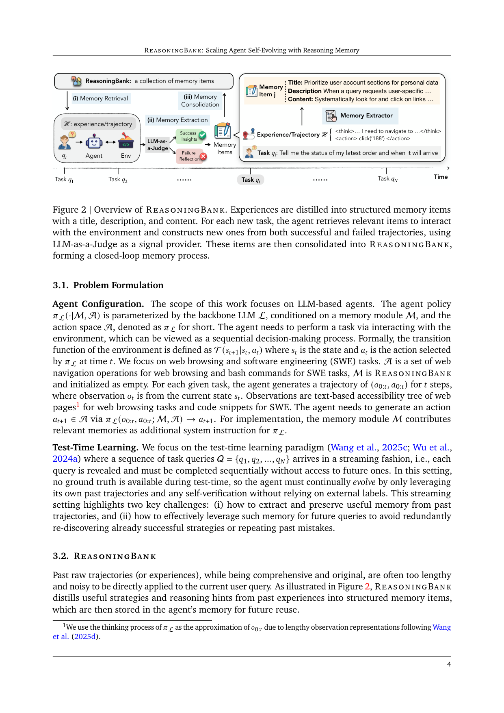
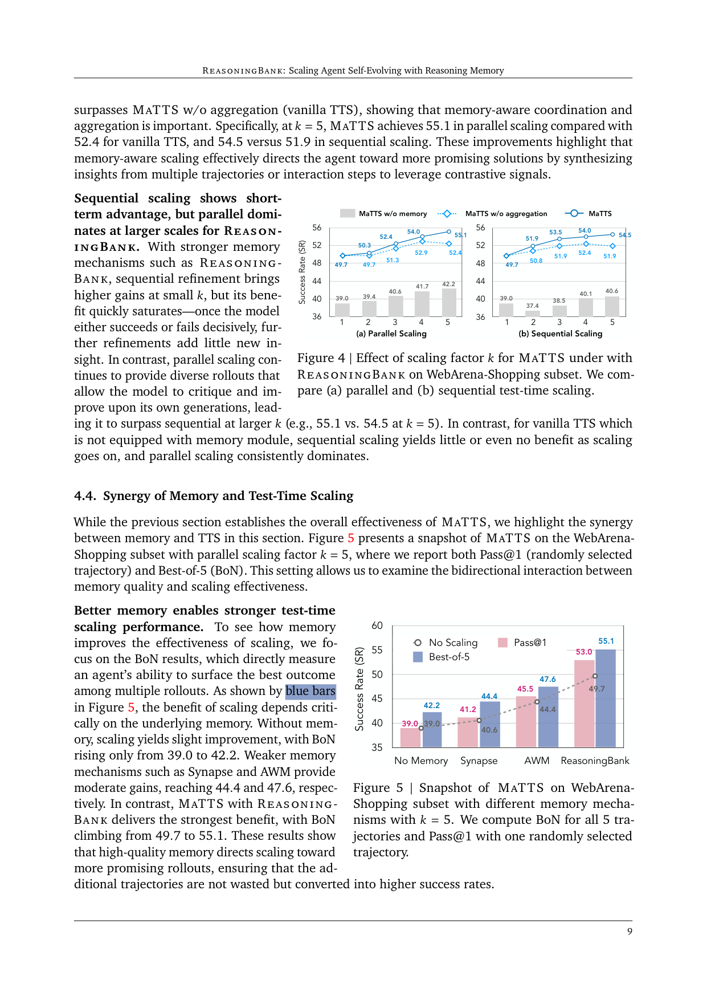

`reasoningbank | ReasoningBank: Scaling Agent Self-Evolving with Reasoning Memory | UIUC + Google Cloud AI Research（Siru Ouyang, Chen-Yu Lee, Tomas Pfister 等） | 2025-09 arXiv:2509.25140v2(16 Mar 2026修订) · 预印本 | L?·经验记忆/test-time self-evolving 主线·高相关`

> 三标注约定:【原文】=论文直述;【推断】=有据判断(附依据);【待核】=拿不准的关键事实。

══ 第一层:一眼看懂 ══

- 🟦 **TL;DR**:LLM agent 干活时(网页操作、改代码)每做完一个任务,就把这次经验"提炼成几条可复用的推理策略"存进一个叫 ReasoningBank 的记忆库;下一个任务来时先去库里检索相关策略塞进 system prompt 再动手。关键创新两点:①不只学成功经验,**也从失败里抽"别再这么干"的教训**(用 LLM-as-a-Judge 自判对错,不要人工标签);②提出 **MaTTS(memory-aware test-time scaling)**——对同一道题多跑几条轨迹(并行)或反复自我精修(串行),用这些"对比信号"提炼出更可靠的记忆。记忆好→引导 scaling 跑向更优路径,scaling 多→喂出更强记忆,形成正反馈飞轮。【原文 摘要+§1】

- **最巧的一步**:把记忆从"存原始轨迹/存成功工作流"升级为**"提炼成 strategy-level 的 title/description/content 三段式推理单元",并显式纳入失败教训**。抽掉"失败也学 + 策略化抽象"这一步,它就退化成 Synapse/AWM 这类老记忆方法——消融(Figure 7)正好证明:基线加了失败轨迹要么无改善(Synapse 40.6→41.7)要么变差(AWM 44.4→42.2),而 ReasoningBank 加失败 46.5→49.7。这是它跑赢的根。【原文 Figure 7】

══ 第二层:为什么做 ══

- **研究背景**:LLM agent 越来越被部署在"持续在线、任务流不断"的长期角色里(web browsing / computer use / SWE),但它们普遍**不会从历史交互中学习**——每个新任务都从零开始,于是反复犯同样的错、丢掉相关问题里学到的洞见、缺乏"越用越强"的 self-evolving 能力。这催生了"记忆感知 agent"研究线。【原文 §1】

- **解决的具体痛点**:现有 agent 记忆有两个硬伤——① **只会存原始轨迹**(Synapse 类)或**只存成功工作流/procedure**(AWM、Memp 类),无法蒸馏出更高层、可迁移的推理模式;② **过度偏重成功经验**,把 agent 自己失败里的宝贵教训基本浪费掉。结果记忆退化成"被动记账",而非"对未来决策有指导性的可泛化指南"。【原文 §1, §2】

- **相关工作 & 各自不足**:
  - *存储形态线*:纯文本(MemGPT/Packer)、latent embedding、结构化图(Mem0、G-Memory 类)——关注"记忆长什么样/怎么检索更新",与本文正交(本文聚焦"该存什么内容")。【原文 §2、附录E自述】
  - *复用成功轨迹/工作流线*:Synapse(原始轨迹)、AWM(workflow)、Memp(procedural)、instance-level concept——都只从成功里学,不学失败,且停在执行层面。【原文 §2】
  - *RL 用于记忆管理线*:Memory-R1 等用 RL 学"怎么增删记忆"——本文刻意不碰 RL/不训参数,走纯 test-time 路线。【原文 §2】
  - *Agent test-time scaling 线*:TTS 在 coding/math 很成熟(BoN、beam search、verifier),但**没人把"agent 记忆"当成一个可 scale 的维度**——这是本文 MaTTS 的切入点。【原文 §2】

- **动机链**:agent 要 self-evolve → 必须从经验学 → 现有记忆只存原始轨迹/成功工作流且不学失败 → 所以要"提炼成策略 + 纳入失败教训"的 ReasoningBank;又因为单纯加任务(breadth)受任务流限制 → 转而对单题加探索深度(depth)→ 但 vanilla TTS 把多条轨迹独立转记忆、浪费了"同题多解之间的对比信号" → 所以要 memory-aware 的 MaTTS,用 self-contrast/self-refine 把对比信号收进记忆。【原文 §1, §3.3】

- **与最近邻 AWM 的 Δ**:最像的是 AWM(Agent Workflow Memory)。**关键差异**:AWM 抽"固定工作流/routine"且只从成功轨迹抽;ReasoningBank 抽"strategy-level 的推理 hints"且**成功+失败都抽**。为什么有用——SWE 这类任务动作高度异质(任意 bash 命令),抽不出固定 routine(附录原文明说 AWM 在 SWE 难抽 common routine);而策略化抽象 + 失败教训能跨任务迁移,故在 cross-domain/Multi 子集 AWM 退化甚至变差、ReasoningBank 仍涨。【原文 §2, §4.2, 附录】

══ 第三层:怎么做 + 靠不靠谱 ══

- **方法流水线(闭环三步)**:任务流 q1…qN 顺序到来,记忆库 M 初始为空。对每个 qi:
  1. **(i) Memory Retrieval**:用当前 query 做 embedding 相似度检索,取 top-k 相关记忆项,作为额外 system instruction 注入 agent 策略 πL,再以 ReAct 风格与环境交互产生轨迹 H。【原文 §3.2】
  2. **(ii) Memory Extraction**:任务完成后,先用 **LLM-as-a-Judge** 在无 ground-truth 下给轨迹打"成功/失败"代理标签;成功轨迹→抽 validated 策略,失败轨迹→抽 counterfactual 教训/护栏。每条轨迹抽多个 memory item(三段式 schema:title 标识核心策略 / description 一句话摘要 / content 蒸馏的推理步骤·决策依据·操作洞见)。【原文 §3.2, 附录A.1】
  3. **(iii) Memory Consolidation**:把新 item 用"简单加法"并入 M(刻意保持简单,不做花哨检索/合并,以凸显是"记忆内容"本身在起作用)。【原文 §3.2, 脚注2】
  4. **MaTTS 叠加**:在 retrieval 后,对同一 qi 用 scaling factor k 扩展——*并行*:跑 k 条轨迹,用 self-contrast 找一致推理模式、滤掉 spurious 解;*串行*:在单条轨迹上 self-refine k 次,把中间 refine 笔记(纠错/洞见)也当记忆信号。两者都让 scaling 产出"更可迁移的高质量记忆"。【原文 §3.3】

- **逐组件必要性**:
  - *失败轨迹纳入*:Figure 7 消融——没它 ReasoningBank 从 49.7 掉到 46.5(success-only)。✔有消融。
  - *MaTTS 的 aggregation(self-contrast/refine)*:对比 "MaTTS w/o aggregation"(=vanilla TTS),k=5 时并行 55.1 vs 52.4、串行 54.5 vs 51.9。✔有消融(Figure 4)。
  - *记忆本身 vs 纯 scaling*:"MaTTS w/o memory" 加 k 几乎不涨且不稳(并行在 39.0–42.2 抖动)。✔证明记忆是 scaling 增益的前提(Figure 4/5)。
  - *LLM-as-a-Judge 质量*:Figure 8 模拟 50%–100% judge 准确率,发现 70%–90% 区间 SR 几乎不变(真实 judge 准确率实测 72.7%)→ 对验证噪声鲁棒。✔有消融。
  - *三段式 schema 各字段的单独必要性*:**原文未做字段级消融**(只整体对比记忆形态),属未证明项。【推断:依据=正文与附录均无 title/description/content 拆解实验】

- **关键机制直觉**:核心不是某个公式,而是"**对比信号驱动的记忆蒸馏**"。同一题多条轨迹之间的异同(self-contrast)= 天然的"哪些步骤是稳健共性、哪些是偶然 spurious"的监督信号;失败轨迹 = 负样本护栏。把这些蒸馏进策略库,等于让 agent 在 test-time 用自己的经验做了一次"无梯度的、in-context 的隐式 RL"——作者明确把 emergent 策略演化类比成 RL 的学习动态(Figure 6)。【原文 §5, Figure 6】

- **实验与证据**:
  - 数据集:**WebArena**(684 任务,5 子集)、**Mind2Web**(cross-task/website/domain 泛化)、**SWE-Bench-Verified**(仓库级 issue 修复)。Backbone:Gemini-2.5-flash/pro、Claude-3.7-sonnet。Baseline:No Memory / Synapse(轨迹) / AWM(工作流)。指标:成功率 SR↑、平均步数 Step↓。【原文 §4.1】
  - **支撑核心主张的关键实验**:WebArena 上 ReasoningBank 相对 No Memory 提 +8.3/+7.2/+4.6(三 backbone),最高声称 ~20% 相对提升;同时 Step 最多减 1.4–1.6(更高效)。SWE-Bench-Verified:Gemini-2.5-flash 解决率 34.2→38.8、步数 30.3→27.5。【原文 Table 1, 2】
  - **最有说服力的一张**:Figure 5(synergy)——BoN(衡量"多 rollout 里能否冒出最优解"):No Memory 39.0→42.2、Synapse→44.4、AWM→47.6、ReasoningBank 49.7→**55.1**;且 Pass@1(衡量记忆 curation 后的平均质量)上,弱记忆 scaling 反而几乎不涨(Synapse 40.6→41.2),ReasoningBank 49.7→53.0。这张图同时证明"好记忆才撑得起 scaling""scaling 才喂得出好记忆"双向。【原文 Figure 5】
  - **成本**:Table 5 token 分解——ReasoningBank 总 token **53054.5,反而低于 No Memory 的 50847.4 之外的所有基线**(Synapse 58514.7、AWM 59372.8);作者算成相对 No Memory 仅 +4.3% token 换 +20.5% 性能。原因:虽多了 judge+extraction 的 token,但**action generation 的 token 因步数减少而下降**(49306.1 < 50847.4)。【原文 Table 5, C.2】
  - *baseline 公平性*:同 backbone、同 ReAct、同 BrowserGym 环境,记忆机制是唯一变量,较公平。【推断:依据=§4.1 设置描述】
  - *"看着强但没回答核心"的隐患*:Mind2Web 的 task-level SR 绝对值很低(cross-domain 仅 1.6/1.7),提升幅度小,泛化最难场景说服力相对弱;Multi 子集仅 29 题、Claude 上从 0.0 起步,小样本波动大。【推断:依据=Table 1/3 绝对数值】

- **假设与失效边界**:
  - 【原文】依赖 LLM-as-a-Judge 提供正确性信号,任务歧义或 judge 自身出错时会引入噪声(虽证明 70–90% 区间鲁棒)。
  - 【原文】刻意只用简单 embedding 检索 + 加法 consolidation,记忆库**只增不删、无去重/淘汰机制**——长跑下记忆会无限膨胀。【推断:依据=§3.2"simple addition operation"+附录E未提遗忘机制 → 长期会有检索噪声/膨胀问题,作者未测】
  - 【原文自述】没和 episodic/hierarchical 等"记忆结构"方法比,贡献限定在"存什么内容"。
  - 【推断】纯 test-time、不动参数 → 学到的全是"prompt 里能表达的策略";需要参数级能力(如新技能、底层执行精度)的瓶颈它解不了。依据=方法只改 system instruction。

- **祛魅总结**:
  - **真贡献(硬货)**:(a)"失败也蒸馏成策略"被消融实锤是涨点主因;(b)MaTTS 把"记忆×TTS"的双向飞轮讲清并量化(Figure 5);(c)成本侧很诚实——靠减步数把额外开销几乎抵消,可信。
  - **包装/可能高估**:"new scaling dimension""self-evolving""emergent behaviors"措辞偏宏大;emergent 演化(Figure 6/17)是**人工挑选的 case study**,非定量证据,属营销性展示。【推断:依据=Figure 6 标注"a human case study"】
  - **可能低估**:记忆膨胀/遗忘问题被一句"future work"轻轻带过,长期部署这其实是关键瓶颈。【推断】

══ 结构化抽取 ══

- 🎯 **机制速览 6 轴**:

| 学什么信号 | 改什么 | 何时改 | 免梯度? | 记忆-技能生命周期 | 防遗忘机制 |
|---|---|---|---|---|---|
| 自反思+经验库(成功/失败轨迹,经 **LLM-as-a-Judge** 自判;MaTTS 下还用同题多轨迹的对比信号) | **记忆**(strategy-level 三段式 item,注入 system prompt;**不改参数/不改 logits**) | **在线 per-episode**(每完成一个任务即抽取并并入;test-time 流式) | **是**(纯 test-time,零梯度) | 写入(extract)→检索(top-k embedding)→**无遗忘/无淘汰**(只做加法 consolidation)→未涉及跨 agent 共享 | **无**(刻意从简;长期靠检索 top-k 间接限制,但库本身只增不减)【原文 §3.2+附录E】 |

- ⑦ **开源代码 + 框架/harness**:**已开源** https://github.com/google-research/reasoning-bank 【原文 摘要】。底层 harness:web 用 **BrowserGym** 生态,agent 走 **ReAct** 风格,SWE 用 bash-only;backbone 为 Gemini-2.5 / Claude-3.7 闭源 API。**无 RL 训练框架**(veRL/TRL 等均不涉及,纯推理时方法)。【原文 §4.1】〔代码仓未 clone 核验,以正文链接为准——待核仓内文件级框架细节〕

- 💰 **资源/成本与可扩展性**:推理时方法、无训练成本。token 开销:相对 No Memory 仅 +4.3%(Table 5),因步数下降抵消了 judge/extraction 开销,**比 Synapse/AWM 更省**。MaTTS 的 k 倍 scaling 会线性增加单题推理成本(k 条轨迹/k 次 refine),作者另有 cost study 称同等开销下优于纯 scaling。延迟:多一次检索 + 任务后抽取,量级小。【原文 Table 5, C.2】

- 🎯 **对"探索-巩固(探索→巩固)"idea 对标**:**强支撑 + 可借组件**。它正是"探索(MaTTS 多轨迹/自精修)→巩固(蒸馏成策略记忆)"的一个完整 test-time 实例。可借组件:①**失败轨迹蒸馏成负向护栏**——可迁移到 TSRD 的 path-recovery(把"错误路径"显式编码成可检索的纠偏记忆);②**self-contrast 多轨迹提炼对比信号**——与"高熵/低置信关键步多次续写再聚合"思路同构,可作巩固阶段的信号源。**缺口/区别**:它停在 prompt 级、零梯度、记忆只增不减;TSRD 若要把策略沉淀进参数(MTP foresight + OPD 蒸馏)则需补"记忆→参数"的巩固通道与防遗忘机制——这是它没碰的格子。【推断:依据=方法纯 in-context + 项目记忆 project_core_idea】

- 🔭 **开放问题/未来方向**:
  - 【原文】用更强 verifier / human-in-the-loop / ensemble judge 提升记忆诱导可靠性;把"记忆内容"与"记忆结构(episodic/hierarchical)"结合;更复杂的自适应检索/分层 consolidation。
  - 【推断】记忆去重与遗忘/淘汰(防膨胀)、跨 agent 记忆共享、把 test-time 学到的策略蒸馏回参数(避免每次都靠长 prompt 注入)——都是其框架的自然但未做的延伸。依据=§3.2从简设计 + 附录E自述限制。

- 🖼 **关键图 top-2**:

  
  这是**原文 Figure 2**(方法主图):展示"经验轨迹 → (i)检索 top-k 注入 → 交互 → LLM-as-a-Judge 判成败 →(ii)抽成 title/description/content 三段式 memory item →(iii)consolidation 并回库"的闭环。选它因为一图说清全部机制与"记忆是什么/怎么用/怎么长"。

  
  这是**原文 Figure 5**(核心发现图,同页含 Figure 4 scaling 曲线):BoN 蓝条显示"记忆越好,test-time scaling 收益越大"(ReasoningBank 49.7→55.1,远超 No Memory 39.0→42.2);Pass@1 粉条显示"弱记忆下 scaling 几乎白做,强记忆才把多 rollout 转成更好记忆"。选它因为这是论文"飞轮"主张的唯一定量证据,也是相对基线最拉开差距的一张。

──────────
**幂等状态**:本文 analysis 首次产出。机制类型 = 经验记忆(test-time, 免梯度, 在线 per-episode, 记忆改 prompt) + memory-aware test-time scaling。抽到 2 图:是(Figure 2 + Figure 5)。
