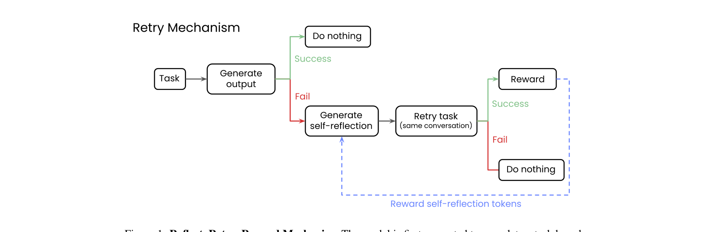
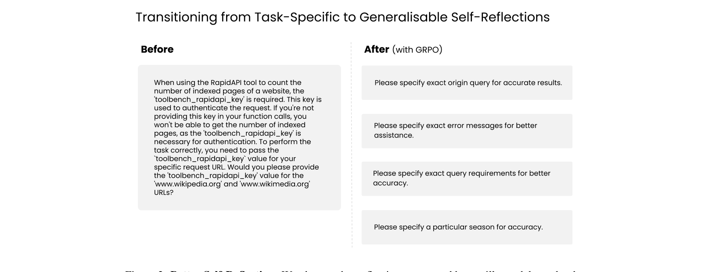

`reflect_retry_reward | Reflect, Retry, Reward: Self-Improving LLMs via Reinforcement Learning | Writer, Inc.（Shelly Bensal, Umar Jamil, Christopher Bryant, Waseem AlShikh 等） | 2025-05 arXiv:2505.24726v1(30 May 2025) · 预印本(under review) | 主题线 = 自反思 × RL 的 self-improving（训练侧·参数级·任务无关）· 高相关`

> 三标注约定:【原文】=论文直述;【推断】=有据判断(附依据);【待核】=拿不准的关键事实。

══ 第一层:一眼看懂 ══

- 🟦 **TL;DR**:不去训"把某个任务做对",而是**专门训"把失败后的自我反思写得更好"**。流程三步(Reflect-Retry-Reward):①模型做任务,**对了就啥也不做**;②错了→让它写一段"我哪里错了、下次怎么改"的自反思;③带着这段反思**重做一次**——若第二次成功,就用 **GRPO 只奖励"自反思那段 token"**(把其它所有 token 的 advantage 置 0,**不奖励答案本身**)。这样模型学到的是"如何反思"这种**任务无关**的元能力,而非死记某任务。只需一个**二值"对/错"验证器**(函数调用是否合法、方程是否等于目标),不需要任何任务专属训练数据、不需要更大的 teacher 模型。结果:数学方程任务最高 +34.7%、函数调用 +18.1%;**1.5B-7B 的小模型训练后能超过同族大 10 倍的未训练模型**。【原文 摘要+§3】

- **最巧的一步**:**"只奖励 self-reflection 的 token、把答案 token 的 advantage 置 0"**。抽掉这一步(改成奖励整条正确输出),模型就会**为特定任务过拟合**、退化成普通任务 RL,失去任务无关性。正因为只奖励反思,模型被逼着把"反思能力"本身学好——这也解释了一个惊人副作用:训练后**即使第一次就做对(根本没触发反思)性能也涨了**,说明"练反思"间接提升了通用推理。【原文 §3, §5】

══ 第二层:为什么做 ══

- **研究背景**:LLM 有"盲区"——在一个任务上行不代表相似任务也行。最直接的补救是用失败任务的数据再微调,但**这类数据集常常不存在**;而且如果连最强 SOTA 模型也做不好该任务,就**没法用它造合成数据**(知识蒸馏路也断了)。另一条路是 prompt 模型自反思(CoT、Reflexion 一脉),好处是不需额外数据,但**效果完全取决于反思 prompt 写得好不好**。【原文 §1】

- **解决的具体痛点**(很具体):
  1. **无数据可训**:目标任务既无标注数据、又造不出合成数据时,传统 fine-tune / 蒸馏全失效。本文只靠"二值验证器 + 模型自己的输出"就能训。【原文 §1, §2.1】
  2. **prompt 式自反思不稳、会反噬**:已有研究指出自反思在"初始正确率低、题难、有外部验证"时才有效;对简单题或强基座模型反而**掉点**,且反复反思收益递减、模型常**认不出自己的错**。【原文 §2.1】
  3. **现有 training-based 自纠正依赖大 teacher**:Kumar/Qu 等把自纠正做成多轮 RL 或在自纠正轨迹上微调,但**通常要更大的 teacher 模型供数据/监督**(本质是蒸馏)。本文**只 bootstrap 自己的输出**,不靠外部 LLM。【原文 §2.1 "Our Approach"】

- **相关工作 & 各自不足**:
  - *Prompt 式自反思线*(CoT、Self-Refine、Reflexion)——无需训练但靠 prompt 质量,且对强模型/易题会掉点。
  - *训练式自纠正线*(Kumar SCoRe、Qu Recursive Introspection、Wu)——能持久提升甚至 test-time 不反思也行,但**依赖大 teacher 供数据**=变相蒸馏。
  - *GRPO/RL 线*(DeepSeekMath GRPO、ReZero 奖励重试、ToolRL、ToRL)——GRPO 去掉 critic、用一组采样的相对优劣估 advantage,适合"稀疏、仅终局可验"的场景;ReZero(Dao&Le 2025)已证明"奖励重试"能促自纠正。本文与 ReZero 最近邻但**奖励对象不同**(见 Δ)。【原文 §2.2】

- **动机链**:模型有盲区 → 想补但常常无数据、无更强 teacher → 退而求其次用自反思(无需数据)→ 但 prompt 式自反思不稳、靠 prompt → 那就**用 RL 把"反思能力"直接训进参数**;又因为"奖励答案"会让模型为某任务过拟合、丢掉通用性 → 所以**只奖励反思 token、不奖励答案**,且只在"初始失败"的样本上做(保证只会提升或持平,不会损害已会的);又因为只需"对/错"信号 → 用 GRPO(无 critic、终局奖励、bootstrap 自身输出)最自然。为什么不直接 SFT 自纠正轨迹?因为那要 teacher 造轨迹、是蒸馏;GRPO 让模型从**自己**的成功反思里学,无需外部模型。【原文 §1, §2, §3】

- **与最近邻 ReZero(奖励重试)的 Δ**:ReZero(Dao&Le 2025)也改 GRPO 奖励结构鼓励"重试"。**关键差异**:ReZero 奖励的是"重试/persist 行为本身";本文**精确地只奖励 self-reflection 那段文本的 token**(其余置 0),目标是让模型学会"写出更有用的反思"而非"多试几次"。为什么这差异有用——它把信用精确分配给"导致从失败翻盘成功的那段反思",于是学到的是**可迁移的反思质量**(Figure 2 显示反思变短变通用),而非任务专属的重试策略;副作用是连"不反思的首答"也变强。【原文 §2.2, §5】

══ 第三层:怎么做 + 靠不靠谱 ══

- **方法流水线**(输入二值验证器 + 失败样本 → 输出一个"更会反思"的模型):
  1. **首答 + 验证**:prompt 模型做任务,用**二值验证器**判对错(函数调用:输出是否精确匹配 gold;Countdown:方程是否用光给定数字且等于目标)。对了→不动。【原文 §3, §4.1-4.2】
  2. **生成自反思**:失败则用固定 prompt("你做错了,反思哪里错了、写一段短说明帮你下次做好")让模型产出一段自反思 commentary。【原文 §3, 附录A】
  3. **带反思重做**:把自反思放进对话历史,模型**第二次**尝试同一任务。仍失败→不动(说明反思没用);成功→进入奖励。【原文 §3】
  4. **GRPO 只奖励反思 token**:第二次成功时,用 GRPO **仅对自反思阶段生成的 token 计入 advantage,其余(含答案)置 0**——逼模型学"通用的会反思"而非"记住这题答案"。【原文 §3】
  5. **(工程)失败数据集 + multi-step GRPO**:为效率,先对每 query 采样最多 64 次、只留失败的构成"失败数据集"(用 vLLM + prefix caching 加速 rejection sampling);在 **TRL 的 GRPOTrainer** 上扩 `_prepare_inputs` 调一个 `second_step` 做第二次生成、并用 mask 把奖励限定到反思 token。这套 multi-step 设计可接任意复杂下游 reward。【原文 §4.3, §4.4】

- **逐组件必要性**:
  - *"只奖励反思 token"*:**无直接消融对照**(没做"奖励全部 token vs 只奖反思"的 A/B);其必要性靠**论证 + Figure 2 反思质量变化 + "首答也变强"的副作用**间接支撑。属未用消融硬证的设计选择。【推断:依据=正文无该对照实验,仅 §3 论证 + §5 现象】
  - *只在失败样本上训*:✔有论证——"corrections 只施于初始错例,故保证只提升或持平、不损害已会的";且失败数据集让"训练到收敛所需样本量"可精确测量。【原文 §2.1, §4.3】
  - *两次尝试(self-reflection 是否真带来翻盘)*:✔主表(Table 1/2)给了"1st try vs 2nd try"在 vanilla 与 trained 下的四格对比,证明反思带来增量(vanilla +4.5%/5.3%,trained 后第二次再 +4.7%/8.6%)。
  - *GRPO 作为唯一机制(无 SFT)*:✔有论证——刻意不加 SFT 阶段,纯 GRPO bootstrap 自身输出。【原文 §2.2】
  - *catastrophic forgetting 检查*:✔Table 3——在 MMLU-Pro/GSM8K/HellaSwag/MATH 上训练前后基本不变(多数 <1% 退化,个别还涨),证明任务无关训练不破坏通用能力。

- **关键机制直觉**:
  - **为什么"只奖励反思"能让首答也变强**:作者假设——被优化的"自反思 token"其实是一种**通用推理脚手架**,模型把"如何分析问题/定位约束"练强后,这种推理能力**渗透**到不需要显式反思的首答里。直觉=练的是"思考姿势"而非"题目答案"。【原文 §5】
  - **GRPO 在这里为何合适**:它无需 critic、只用一组采样补全的相对优劣估 advantage,天然契合"整段生成完才有一个二值对错"的稀疏终局奖励;再配合 mask 把 advantage 精确投到反思 token,实现"段级信用分配"。【原文 §2.2, §4.4】
  - **反思变短而非变长(反 CoT 直觉)**:Figure 2 显示训练后反思从"冗长重复"变成"简短清晰可泛化"(如"Please specify exact origin query for accurate results")——与"CoT 越详细越好"的普遍信念相反。作者把"何时该简洁 vs 详细"列为开放问题。【原文 §5.1, Figure 2】

- **实验与证据**:
  - 数据集/设置:**APIGen**(6 万条函数调用,4211 个工具;必须工具+参数全对才算对;测试集 12000)+ **Countdown**(45 万组数字+目标,来自 TinyZero;必须用光数字且等于目标;测试集 15000)。**只评测数据集发布前就存在的模型**(APIGen 用 June 2024 前、Countdown 用 Jan 2025 前)以杜绝数据污染。模型 1.5B-8B(Qwen2/2.5、Llama3.1/3.2、Phi-3.5、Palmyra),并列 32B/70B/72B 未训练 vanilla 作上界。【原文 §4.1-4.3】
  - **支撑核心主张的关键实验**:Table 1/2 的四格(1st/2nd × vanilla/trained)。最震撼数字:Countdown 上 **Qwen-2.5-1.5B 从 vanilla 6.0%/10.2% 训练后到 34.9%/45.0%**(2nd-try +34.8pp);函数调用平均 +9.0%、Countdown 平均 +16.0%(结论节)。**跨规模反超**:trained Qwen-2-7B(两次尝试)> vanilla Qwen-2-72B;trained Qwen-2.5-7B > vanilla Qwen-2.5-72B。【原文 Table 1/2, 结论】
  - **最有说服力的两块**:① Table 3(防遗忘)——证明"任务无关 + 只在失败样本训"确实不损害通用能力,这是"训反思而非训任务"主张的硬支撑;② Figure 2 + 附录B 错误分析(Table 4/5)——量化训练改掉了哪类错(函数调用:大模型主要学会参数选择;Countdown:多数模型学会"只用允许的数字",Qwen-2.5-7B 则学会"命中目标即使用错数字")。错误分析让"反思到底改了什么"可解释。【原文 Table 3/4/5, Figure 2】
  - *baseline 公平性*:同一基座的 vanilla vs trained 对比,且每模型族都调过 prompt 取最强 baseline;严格按发布时间防污染。较公平。【原文 §4.1-4.2】
  - *"看着强但没回答核心"的隐患*:① 只在**两个高度可验证**任务(函数调用、算术方程)上验证,作者自承"不是所有任务都好定义二值验证器";② **泛化性未证**——全篇都是"在任务X上训、在任务X上测",作者把"反思训练是否跨任务迁移"明确留作 future work(这恰是其"任务无关"卖点最该回答却没回答的问题);③ Countdown 错误分析里 trained Qwen-2.5-1.5B 的"missed target"反而从 14.4%升到 30.2%——即学会用对数字却更常打不中目标,说明改进有"按下葫芦浮起瓢"的一面。【推断:依据=Limitations + Table 5】

- **假设与失效边界**:
  - 【原文·Limitations】**必须能定义二值"对/错"验证器**;无法验证的任务用不了(可退而用 gold 标签或 LLM-as-judge,但那就引入外部依赖)。
  - 【原文·Limitations】**模型需具备基本能力**(能做点该任务、能反思、能学)才训得动;太小的模型(0.5B/1B)或能力不匹配的(Llama3.2-3B 在函数调用上)**学不会自纠正**,直接失败。
  - 【原文】因 GRPO 已知的算力/可扩展性问题,实验**限定 1.5B-8B**;更大模型未验证。
  - 【推断】方法在**初始正确率适中**的区间收益最大(太高=没失败样本可学;太低=连第二次也很少成功,无正向信号)。依据=方法只从"失败→反思→翻盘成功"的样本学,两端都会饿死该信号 + §2.1 自反思有效条件。
  - 【推断】"训反思提升首答"是观察到的关联,作者用假设解释但**未做因果验证**(如冻结反思能力只测首答);Figure 2"反思变短更好"也只是定性单例,无定量证据。依据=§5/§5.1 措辞。

- **祛魅总结**:
  - **真贡献(硬货)**:(a)**"只奖励 self-reflection token、不奖励答案"的段级信用分配**是干净、可复现的新点子,且只需二值验证器、不靠 teacher;(b)**Table 3 防遗忘 + Table 1/2 小模型反超大模型**是有分量的实证;(c)**反思变短更优(Figure 2)**是一个反直觉、值得后续研究的现象。
  - **包装/可能高估**:"task-agnostic / self-improving"是核心卖点,但**全篇没做一次跨任务迁移实验**(训函数调用→测数学,或反之),"任务无关"目前只是机制层面的论证 + 防遗忘的旁证,**未被正面证明**(作者诚实地列为 future work)。"as high as 34.7%"等峰值数字来自最弱基座/最低起点,平均增益(9%/16%)更实在。【推断:依据=Limitations 自承未测迁移 + Table 1/2 峰值来自低基线】
  - **可能低估**:multi-step GRPO 的工程实现(扩 GRPOTrainer 的 `_prepare_inputs`/`second_step`、用 mask 限定奖励 token)其实是个**可复用的"多步 RL + 段级 reward"脚手架**,论文当工程细节一笔带过,对想做"分步/关键步奖励"的人价值不小。【推断:依据=§4.4】

══ 结构化抽取 ══

- 🎯 **机制速览 6 轴**:

| 学什么信号 | 改什么 | 何时改 | 免梯度? | 记忆-技能生命周期 | 防遗忘机制 |
|---|---|---|---|---|---|
| **环境/验证器的二值 reward**(对/错)+ **自反思**(模型自己写、自己用);**纯 bootstrap 自身输出,无外部 teacher** | **参数**(GRPO 微调;**奖励仅作用于 self-reflection token**,答案 token advantage 置 0) | **离线批量**(在"失败数据集"上 GRPO 训到收敛);信号在 **per-episode**(每个失败样本走 reflect→retry) | **否**(GRPO 梯度训练) | 无显式记忆/技能库;"反思能力"一次性蒸馏进参数 → 推理时按需(失败才)生成反思 → 无检索/无淘汰/无共享 | **经验证有效的"低遗忘"**:因只在失败样本训、且优化任务无关的反思,Table 3 显示 MMLU/GSM8K/HellaSwag/MATH 训练前后 <1% 退化。**机制上靠"任务无关 + 仅纠错例"隐式防遗忘**,非显式正则/隔离/merging【原文 §5.2, Table 3】 |

- ⑦ **开源代码 + 框架/harness**:**未开源(未找到作者自己的代码/权重发布)**——全文仅出现两个 github:**huggingface/trl**(所用框架)与 **Jiayi-Pan/TinyZero**(Countdown 数据集来源),**无 "our code is available" 或 Writer 自己的仓库/HF 模型链接**(已全文检索确认)。训练 **framework = TRL(Transformer Reinforcement Learning, von Werra et al. 2020)**,明确**扩展其 `GRPOTrainer`**:改 `_prepare_inputs` 调自写 `second_step` 实现 multi-step GRPO 并用 mask 把奖励限定到反思 token;**rejection sampling 用 vLLM + prefix caching**;4-8×H100;GRPO 超参沿用 DeepSeek 实现(KL=0.001、lr=5e-7、cosine、warmup 0.03)。【原文 §4.4, 附录;代码缺失为全文检索结论】

- 💰 **资源/成本与可扩展性**:训练**相当省**——多数模型远未跑满:Llama-3.1-8B 函数调用**仅 100 步、<2000 条 unique query 即收敛**;函数调用实验平均 <25000 query,数学平均 ~15000 problem;上限 1750 步、effective batch 256。硬件 4-8×H100。**核心成本优势**:无需任务数据、无需大 teacher 造数据、只需二值验证器;且因"只在失败样本训",样本利用精准。**可扩展性局限**:受 GRPO 已知瓶颈,**只验到 8B**,更大模型未试。推理侧:训练后**首答即变强**,故部署时不必每次都跑两遍/生成反思,test-time 开销可控。【原文 §4.4, §5】

- 🎯 **对"探索-巩固"idea 对标**:**强支撑 + 直接可借的核心组件**。
  - **支撑**:它是"探索(失败→自反思→重试翻盘)→巩固(用 RL 把成功的反思固化进参数)"的**纯 RL 训练侧**范例;且与本项目"**从错误路径学纠偏 / path-recovery**"理念高度一致(只从"失败翻盘成功"的样本学)。
  - **直接可借组件**:① **"段级信用分配:只奖励某一段 token(反思),其余 advantage 置 0"**——这正是 TSRD 想要的"**只奖励 path-recovery 那一段 / 只在关键步接管处计入梯度**"的现成 GRPO 实现模板;与项目 reusable_techniques 里"sparse_critical / forward-hard-backward-soft"在"把学习信号精确限定到关键 token 子集"上**同构**;② **multi-step GRPO 脚手架**(扩 `GRPOTrainer._prepare_inputs` + `second_step` + mask)——可直接改造成"MTP 预测关键步→在该步插入 recovery 生成→只奖励 recovery token"的训练循环;③ **"只在失败样本上训→保证只提升不损害"**——可作 TSRD 选择"哪些轨迹/哪些步进入 path-recovery 训练"的筛选原则;④ **防遗忘的"任务无关 + 仅纠错例"思路**(Table 3)——为"巩固新纠偏能力而不忘旧"提供一个轻量、无需显式正则的经验性方案。
  - **缺口/区别**:它**奖励对象是"整段自反思文本"**,粒度比本项目设想的"MTP 定位的单个关键步/单点接管"粗;且**不用 MTP/foresight**——失败信号来自"重试后是否成功"的事后验证,而非"前瞻预测偏差"(SAMULE/KnowSelf 各有一个前瞻味更浓的触发器,本文更朴素);跨任务迁移(=真正的任务无关)它**没证**。TSRD 若要更细的"关键步级"信用,需把本文的"反思段 mask"换成"MTP 探针选出的关键 token 子集"。【推断:依据=§3/§4.4 + 项目 project_core_idea/reusable_techniques(sparse_critical, forward-hard-backward-soft)】

- 🔭 **开放问题/未来方向**:
  - 【原文】**反思训练能否跨任务迁移**(训一个任务的反思能力,提升另一任务)——核心未答问题;何时该生成**简洁 vs 详细**输出(Figure 2 反直觉发现引出的开放题);把验证器扩展到更难验证的任务(gold 标签 / LLM-as-judge)。
  - 【推断】对"只奖励反思 token"做正式消融(vs 奖励全部 token);对"首答变强"做因果验证;把段级奖励细化到"关键步/关键 token"粒度;扩到 >8B 模型与多轮交互 agent 场景。依据=正文缺该消融 + §5 现象 + §4.4 multi-step 框架可推广。

- 🖼 **关键图 top-2**:

  
  这是**原文 Figure 1**(方法主图,裁自 p3 顶部):Task→Generate output→分两路:Success 则"Do nothing";Fail 则 Generate self-reflection→Retry(same conversation)→若 Success 则**Reward**(蓝色虚线明确标注"**Reward self-reflection tokens**"——只奖励反思 token),若 Fail 则"Do nothing"。选它因为一图说清全部机制,尤其那条"只把奖励回灌到反思 token"的蓝虚线正是全文最巧的设计。

  
  这是**原文 Figure 2**(核心发现图,裁自 p7):左 Before=vanilla 模型产出又长又啰嗦、绑死具体工具/参数的反思;右 After(with GRPO)=训练后变成简短、清晰、可泛化的反思(如"Please specify exact origin query for accurate results")。选它因为它直观证明 GRPO 把反思优化成了**任务无关、可迁移**的形态,也引出"简洁 vs 详细"这个反 CoT 直觉的开放问题。

──────────
**幂等状态**:本文 analysis 首次产出。机制类型 = 自反思 × GRPO(参数级,离线批量训练;**段级信用分配——只奖励 self-reflection token**;仅在失败样本上 bootstrap 自身输出,无外部 teacher);经验性低遗忘(Table 3),但无显式防遗忘机制;无记忆/技能库。**未开源**(全文仅引用 TRL 框架与 TinyZero 数据集,无自有代码/权重链接;framework=TRL,扩 GRPOTrainer + vLLM)。抽到 2 图:是(Figure 1 机制 + Figure 2 反思质量对比)。
