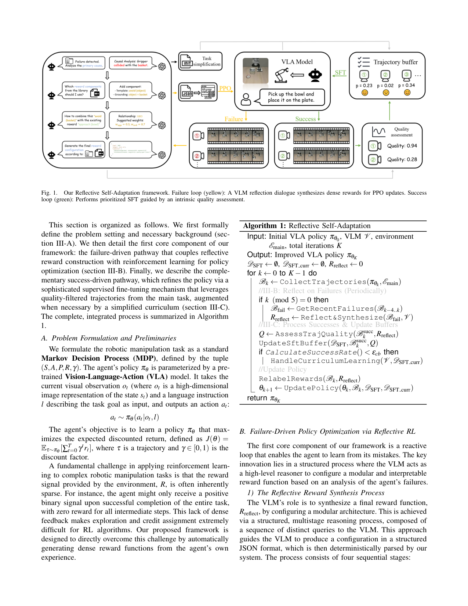
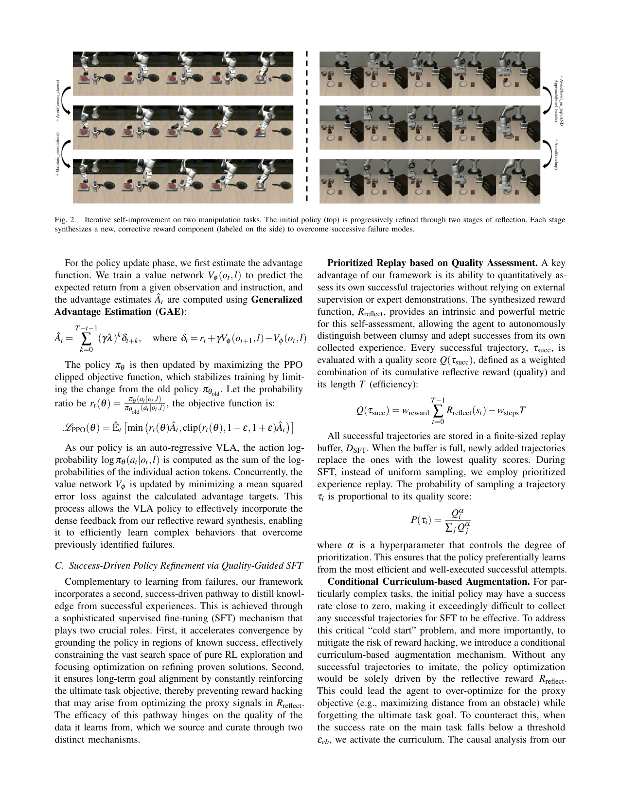

`reflect_vla_task_adapt | Reflection-Based Task Adaptation for Self-Improving VLA (Reflective Self-Adaptation) | 北大智能学院 + 京东探索研究院 JD Explore + 清华 AIR | arXiv 2510.12710 v3 (2026-04-09)，cs.RO | L?·机器人 VLA 自改进线·中相关（VLA+反思自改进，非纯 LLM-agent）`

> 档位：**deep**（全字段三层 + 结构化抽取）。所有内容基于已下载 PDF 正文（_txt_reflect_vla_task_adapt.txt，全文 9 页）。

══ 第一层：一眼看懂 [light] ══

- 🟦 **TL;DR**：让预训练 VLA(视觉-语言-动作)机器人在新任务上"边干边自己改进"，不要人类。核心是**双通路闭环**：①**失败驱动反思 RL**——把失败录像喂给 VLM(GPT-4o)，让它做因果分析、从一个"奖励组件库"里挑/拼出一个**稠密奖励函数**(JSON 配置，可组合 AND/IF/OR)，再用 PPO 训练 VLA；②**成功驱动质量引导 SFT**——把自己跑出来的成功轨迹按"反思奖励+步数效率"打质量分，优先回放高质量的去做行为克隆。两路相加 \(L=L_PPO + λ·L_SFT\)。

- **最巧的一步**：抽掉**成功驱动 SFT 通路**整个方法就垮——消融里去掉它成功率从 63%→**0.0%**(表 II)，因为只靠 VLM 合成的代理奖励做 PPO 会"reward hacking"(把奖励刷满但任务失败)，SFT 用真实成功轨迹把策略钉在真目标上、还顺带约束 RL 探索空间。这是它区别于纯 VLA-RL(只有①)的关键 Δ。

══ 第二层：为什么做（写透，重点） ══

- **研究背景**：大规模基础模型催生了 **VLA(视觉-语言-动作)模型**,在海量机器人轨迹上预训练后展现出惊人 zero-shot 泛化,指向通用机器人。但**通用能力与新环境可靠执行之间有巨大鸿沟**——把预训练 VLA 部署到用户家这类新场景,初始成功率往往低到不可接受("last-mile"适配问题)。【原文 §I】

- **解决的具体痛点**：**用 RL 做 in-situ 适配,样本效率太低**——具身任务奖励通常**稀疏**(只在整任务完成才给二值正信号,中间步全 0),探索与信用分配极难;且**在线微调大 VLA 有两大难题:(a)从稀疏环境奖励高效学习、(b)训练稳定不灾难性遗忘强预训练先验**。本文要回答:**agent 能不能不靠人类专家、只靠反思自己的经验,系统性地在新环境提升?**【原文 §I + §II.B】

- **相关工作 & 各自不足**(§II)：
  1. **VLA 模型**(RT-1/RT-2/Octo/OpenVLA/π0)：知识来自静态离线数据集,**预训练后固定、无法 in-situ 适配**。
  2. **VLA+RL**：离线 RL 安全高效但**受离线数据覆盖度限制**,匹配不了新环境细节;在线 RL 真适配但面临稀疏奖励+稳定性两难。**VLA-RL** 用离线预训练的 learned reward model 给稠密信号(但新场景泛化/适配难);**iRe-VLA/ConRFT** 给 RL 加 IL 损失正则(用成功示范约束更新)。
  3. **VLM 在机器人里的高层推理**：要么当**任务规划器**(分解高层指令,但 VLM 是外部顾问、知识静态不从交互更新)、要么当**事后评估器**(判成败/给偏好标签做 RLAIF,但反馈稀疏间接、非稠密指导信号)。
  本文差异化:**把 VLM 提升为"in-the-loop 的因果推理器 + 奖励合成器"**——动态分析失败、合成稠密纠正奖励,把 VLM 从外部顾问/高层裁判变成技能习得过程的核心主动组件。【原文 §II.C 末】

- **动机链**：现状(预训练 VLA 强但部署新场景初始成功率低,RL 适配样本效率低) → 缺陷(稀疏奖励难探索 + 在线微调不稳/遗忘 + 现有方案要么手工设奖励要么要专家示范) → **所以要(a)自动从失败合成稠密奖励解决稀疏问题、(b)用成功轨迹做 IL 锚定防漂移/遗忘** → 但 VLM 自由生成奖励不可靠、合成代理奖励会 reward hacking → **所以(a')用模块化奖励组件库+关系处理器约束 VLM 输出"可验证 JSON"、(b')用 SFT 真成功轨迹钉住真目标 + 冷启动时 VLM 改场景造课程**。为什么不用 VLA-RL?因为它的 learned reward model 在新场景泛化难、且无防 reward-hacking 锚。【原文 §I+§II.B+§III.C】

- **与最近邻工作的 Δ**：
  - **vs VLA-RL(Lu 2025,本文 RL 基座)**：VLA-RL 用**离线预训练的奖励模型**给稠密信号;本文关键 Δ 是**用 VLM 因果推理 in-situ 现场合成稠密奖励**(更适配新场景)+ **成功驱动 SFT 防 reward hacking**。学习曲线(图3)显示 VLA-RL 达峰后退化(不稳),本文持续稳升。
  - **vs iRe-VLA/ConRFT(给 RL 加 IL 损失)**：它们用 IL 正则,但**示范是外部/被动给定**;本文 Δ 是**用自己的高质量成功轨迹(intrinsic quality 打分 + 优先回放)做 IL**,且 SFT 还**主动约束 RL 探索空间**(图4 可视化)。
  - **vs RLAIF(VLM 当偏好裁判)**：VLM 给稀疏间接的成败/偏好标签;本文 Δ 是 VLM 给**稠密、可解释、模块化的奖励函数**(组件库+AND/IF/OR)。

══ 第三层：怎么做 + 靠不靠谱 ══

- **方法流水线**(图1 + Alg.1,K 轮迭代)：输入初始 VLA 策略 \(π_{θ_0}\)、VLM \(V\)、环境 →
  ① **采轨迹**:用当前 \(π_{θ_k}\) 在主任务环境收集轨迹 \(B_k\)。
  ② **失败驱动反思 RL(§III.B,每 5 轮一次)**:取最近失败 Bfail → **VLM 四阶段合成奖励 Rreflect**:(1) **因果分析**(看失败录像,找主因+提自然语言纠正计划)→(2) **组件选择**(据计划从奖励组件库选必要组件)→(3) **关系识别**(把组件关系分类为 AND/IF/OR)→(4) **结构化配置生成**(组装成层级 JSON,再喂入失败轨迹日志的低层数据如物体位置/速度,让 VLM 数据驱动地设权重/margin/阈值)。
  ③ **成功驱动质量引导 SFT(§III.C)**:对成功轨迹算质量分 **\(Q(τ)=w_{reward}·Σ R_{reflect}(s_t) − w_{steps}·T\)**(质量×效率),存进有限 buffer \(D_{SFT}\)(满了淘汰最低分);SFT 时用**优先回放 \(P(τ_i)∝Q_i^α\)** 偏向高质量;若主任务成功率\(<ε_{cb}=0.1\),启动**条件课程**(VLM 当程序员改仿真定义文件移除障碍/约束、保持最终目标不变,造简化任务存 \(D_{SFT,curr}\))。
  ④ **更新策略**:relabel 奖励 \(r_t=r_{sparse,t}+R_{reflect}(s_t)\);PPO 更新(GAE 估优势,clipped 目标)+ SFT 行为克隆损失;**最终目标 \(L_{total}=L_{PPO} + λ_{SFT}·L_{SFT}\)**(\(λ_{SFT}=0.1\))。
  输出:适配后的 VLA 策略 \(π_{θ_K}\)。

- **逐组件必要性**(消融表II,LIBERO-Adapt,完整 63.0%)：
  - **Success-Driven SFT**：去掉 → **63→0.0%(降100%)**。**最关键**,图3 显示去掉后"快速上升然后灾难性崩溃"=典型 reward hacking。证明它对目标对齐的命门作用。
  - **Failure-Driven RL**：去掉(只剩 Reflective SFT)→ 63→40.0%(降36.5%),图3 显示"稳定但停在次优 plateau"。证明 RL 探索对发现新策略不可或缺。
  - **Reflective Reward**：去掉 → 63→52.6%(降16.5%)。证明稠密合成奖励的价值。
  - **Quality Assessment**：去掉(成功轨迹均匀采样)→ 63→57.3%(降9.0%)。
  - **Conditional Curriculum**：去掉 → 63→59.1%(降6.2%)。
  **五个组件全有干净消融,且降幅排序清晰。** 另图4 可视化:有 SFT 引导时探索更聚焦于任务相关区域,无 SFT 则探索发散(解释样本效率与不稳)。

- **关键机制/公式直觉**：
  - **模块化奖励合成(组件库 + AND/IF/OR)**：直觉是"让 VLM 想'做什么',但把它的输出约束成可验证格式来定'怎么做'"。组件库(位置 approach/avoid、朝向 align/maintain_orientation、运动 control_velocity、状态 is_switch_on...)是原子积木;**AND=加权和 \(Σw_i R_i\)(并发目标)、IF=\(R_{body}·G(s)\) 平滑门控(条件逻辑)、OR=\(\max\)(候选目标)**。这种"高层智能+底层可靠"的混合是它避免 VLM 自由生成不可靠奖励的关键。
  - **质量分 \(Q=w_{reward}·ΣR_{reflect} − w_{steps}·T\)**：直觉是"成功也分笨拙的成功和漂亮的成功"——用累积反思奖励(质量)减步数(效率)给自评分,无需外部监督就能区分,再优先回放好的。
  - **PPO + SFT 联合(\(L_{total}\))**:直觉是 PPO 负责探索找新策略、SFT 负责锚定真目标防漂移,\(λ_{SFT}\) 平衡探索↔模仿。这正是"探索-巩固"的双通路实现。
  - **条件课程**:冷启动成功率近 0 时采不到成功轨迹,纯 Rreflect 会让 agent 过度优化代理目标(如一味远离障碍)忘了真目标——VLM 改场景造简化任务提供锚定信号。

- **实验与证据**：
  - **数据集/设置**：主评测 **LIBERO**(四套件:Spatial/Object/Goal/Long);自建 **LIBERO-Adapt**(10 个初始挑战大的操作场景,专测低起点 in-situ 适配)。base = **OpenVLA-7B**(各套件 SFT 准备)。VLM 全用 **GPT-4o**;每 5 轮并行采集反思一次,**8×A800 GPU**;Q 权重 \(w_{reward}=1.0\)/\(w_{steps}=0.01\)、\(α=0.6\)、\(D_{SFT}\) 存 50 条、\(ε_{cb}=0.1\)、\(λ_{SFT}=0.1\)、SFT batch 16。RL 基于 **VLA-RL 官方代码库的 PPO**。【原文 §IV.A】
  - **核心主张证据**：(1) **LIBERO 四套件平均成功率最高**(表I):Ours 83.6%(Rank 1),超 VLA-RL 81.0%/GRAPE 79.2%/OpenVLA 76.5%,接近商业 π0-FAST 85.5%(近似上界);(2) **学习效率**(图3 LIBERO-Adapt):收敛明显快于 VLA-RL 与 Sparse RL,且 VLA-RL/Sparse RL 达峰后退化、本文持续稳升;(3) **定性案例**(图2):"开炉子+放摩卡壶"任务,第一次反思合成 avoid(cream_cheese)、第二次加 maintain_orientation,逐级修复。
  - **baseline 公平性**：遵循 VLA-RL 评测协议,对比 Diffusion Policy/Octo/OpenVLA/GRAPE/VLA-RL,并列 π0-FAST 作上界参考。**相对公平**。
  - **"看着强但需警惕"的点**：(1) **仅仿真(LIBERO)验证,无真机**——sim-to-real 完全未证;(2) LIBERO-Adapt 是**自造的 10 个场景**,小样本且自设难度,可能偏向本方法;(3) 平均成功率提升相对 VLA-RL 仅 +2.6 个点(83.6 vs 81.0),主要优势在**收敛速度与稳定性**而非终点性能;(4) **重度依赖 GPT-4o** 的因果分析能力,VLM 误判则奖励合成错。

- **假设与失效边界**：
  - 【推断,依据 §III.B+实验】**强依赖 VLM(GPT-4o)能从失败录像做正确因果分析并把纠正意图映射到预定义奖励组件库**——库覆盖不到的新型失败、或 VLM 误判因果时退化(虽库可扩展,但需人/VLM 定义新组件)。
  - 【推断,依据 §IV】**仅 LIBERO 仿真 + OpenVLA-7B 验证**,sim-to-real 与对未知奖励语义的泛化未证。
  - 【原文 §III.C】**冷启动成功率近 0 时**需课程兜底,否则纯 Rreflect 会 reward hacking;**去掉 SFT 必然崩溃**(表II 0.0%)。
  - 【推断】奖励组件库是**手工预定义**的原子函数集——对库外的纠正语义(如复杂多体接触动力学)表达力受限。

- **祛魅总结**：
  - **真贡献(硬货)**：(1) **双通路(失败反思RL ↔ 成功质量SFT)** 把"探索找新策略"与"巩固锚真目标防 reward-hacking"干净地分工,消融(表II)+学习曲线(图3)+探索空间可视化(图4)三重证据扎实;(2) **模块化奖励合成(组件库+AND/IF/OR 关系处理器)** 把"VLM 自由生成不可靠奖励"约束成"可验证 JSON 配置",平衡智能与可靠;(3) **intrinsic quality 自评分 + 优先回放**让 agent 无需外部监督就能区分好坏成功。【推断】
  - **包装/营销成分**：(1) "Reflective Self-Adaptation"听着很自主,但**反思推理完全外包给 GPT-4o**——它本身不学会反思,只是用大 VLM 当奖励工程师;(2) **仅仿真,无真机**,"自改进机器人"的实用性主张打折;(3) 终点性能相对 VLA-RL 提升有限(+2.6 点),真正卖点是**收敛速度+稳定性**;(4) LIBERO-Adapt 自造、小样本,有利于本方法。【推断】
  - 作者**较诚实**:消融充分暴露各组件作用,明确 π0-FAST 是上界参考而非打平,坦承 reward hacking 风险(并用 SFT 解决)。【推断】对 sim-to-real 未做明确 caveat 是个小遗憾。【推断】

══ 结构化抽取（供全景汇总，必填） ══

- 🎯 **机制速览 6 轴** [light]：

| 轴 | 内容 |
|---|---|
| 学什么信号 | **环境 reward(稀疏二值) + VLM 对失败的因果自反思→合成稠密 reward(模块化组件库+AND/IF/OR) + 自身成功经验库(intrinsic 质量分)** 三者混合 |
| 改什么 | **参数**(VLA 策略权重，PPO+SFT 双更新)；间接也改"奖励函数"(VLM 配置 Rreflect) |
| 何时改 | **在线 per-episode 批量**：每收集若干并行轨迹更新;每 5 轮反思一次、relabel 奖励再更新 |
| 免梯度? | **否**——核心是 PPO+SFT 梯度更新 VLA(VLM 只做免梯度的奖励合成/课程编辑) |
| 记忆-技能生命周期 | 成功轨迹**写入**有限 SFT 回放池(50 条)→按质量分**优先检索**(\(P(i)∝Q_i^α\))→满了**淘汰**最低质量者；奖励组件库可扩展 |
| 防遗忘机制 | **隔离/锚定**：成功 SFT(行为克隆)持续重放真目标轨迹，防 RL 漂移/reward hacking(去掉则崩→0%)；冷启动时 VLM 改场景文件造简化课程(\(D_{SFT,curr}\))再锚定真目标 |

- ⑦ **开源代码 + 框架/harness**：**原文未给出 own 代码链接**(仅说 RL 基于 VLA-RL 官方代码库 https://… 风格)。**框架明确:RL 基于 VLA-RL 官方代码库的 PPO(actor-critic + GAE)**;VLM 推理用 GPT-4o(API);base 模型 OpenVLA-7B。**判定:训练用 VLA-RL/PPO 自研封装,无独立公开仓(待核 own repo)。**【原文 §IV.A】
- 💰 **资源/成本与可扩展性**：**8×A800 GPU**;每 5 轮并行采集反思一次(GPT-4o API 调用 = 反思成本);SFT buffer 仅 50 条(轻);base OpenVLA-7B。RL+SFT 联合训练,成本中等偏上(7B VLA + 在线 PPO)。【原文 §IV.A】

- 🎯 **对"探索-巩固"idea 对标** [light]：**可借组件 + 强结构同构**。其"探索(PPO 找新策略)↔巩固(成功 SFT 锚定真目标、防 reward-hacking 漂移)"双通路与"探索-巩固"高度同构——**成功轨迹优先回放=巩固、反思稠密奖励驱动探索**;消融证明"去掉巩固(SFT)→直接崩溃到 0%"是对"光探索不巩固会塌"的极强实证。可迁移的积木:①"用真实成功轨迹的 BC 损失做防漂移锚 + 质量分(质量×效率)优先回放";②"模块化可验证奖励合成(组件库+AND/IF/OR)"约束自动生成的信号;③\(L_{total}=L_{PPO}+λL_{SFT}\) 的探索/巩固加权。但它是 **VLA/PPO 而非 MTP/OPD**,信号来自 VLM 视觉反思而非 token 前瞻;若把 VLM 因果反思换成 MTP 前瞻探针、把 PPO 换成 OPD,可得纯语言域的同构版本。

- 🔭 **开放问题/未来方向**：
  - 【原文结论】把反思能力赋予机器人是下一代自适应机器人的方向(泛)。
  - 【推断】sim-to-real 验证;奖励组件库的自动扩展(超出预定义原子);减少对大 VLM(GPT-4o)的依赖;把"何时反思/合成奖励"从固定每 5 轮做成自适应触发(前瞻信号)。

- 🖼 **关键图 top-2** [light]：
  
  这是**原文 Fig.1(框架主图)**：黄色失败环=VLM 反思对话→合成稠密奖励→PPO；绿色成功环=按内在质量评估做优先 SFT。选它因为一张图说清"双通路如何咬合"——本文最核心结构。
  
  这是**原文 Fig.2**：初始策略经两轮反思逐级修复——第一轮合成 \(avoid(cream_cheese)\)、第二轮加 `maintain_orientation`，直观展示"失败→因果反思→新奖励组件→修复"的滚动过程。选它因为它把抽象机制落成可见的具体案例。
