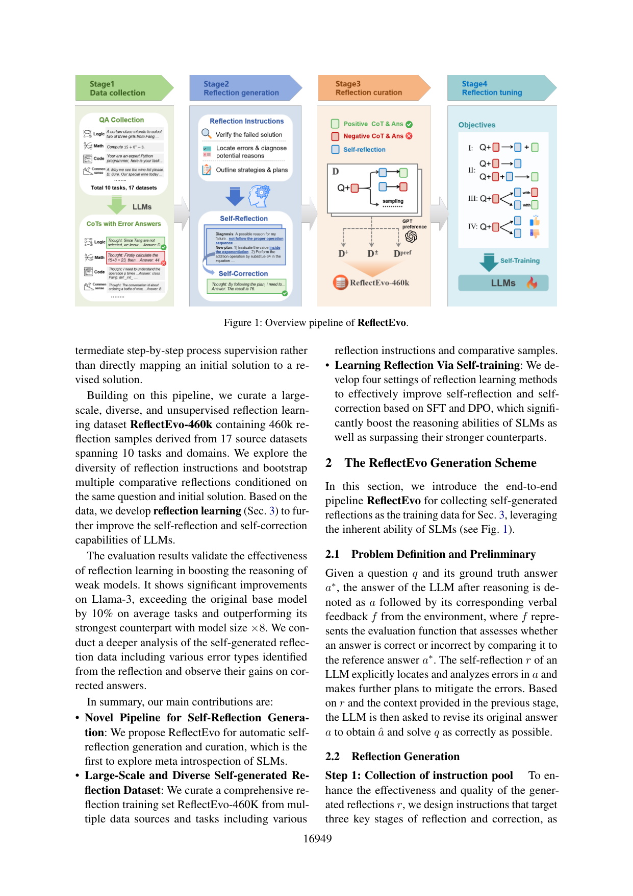
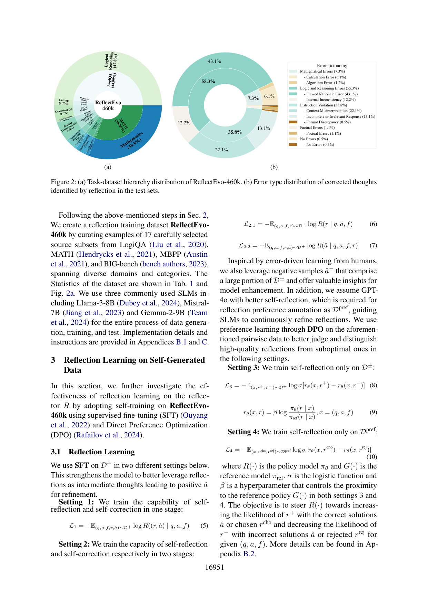

`reflectevo | ReflectEvo: Improving Meta Introspection of Small LLMs by Learning Self-Reflection | BIGAI(通用人工智能国家重点实验室) + 北大；Jiaqi Li 等，朱松纯/郑子隆组 | ACL 2025 Findings (pp.16948-16966, 2025-07) | L?·自反思学习线·中-高相关（自生成反思数据→SFT/DPO 自训练，非参数外免梯度）`

> 档位：**deep**（全字段三层 + 结构化抽取）。所有内容基于已下载 PDF 正文（_txt_reflectevo.txt，全文 19 页）。

══ 第一层：一眼看懂 [light] ══

- 🟦 **TL;DR**：让**小模型(SLM, 7-9B)自己学会"反思"**，不蒸馏更强的老师、不要人工标注。流程：①小模型(同一个 base 当 Generator+Reflector)对题目先答→环境给二值对/错反馈→自己写一段反思(定位错在哪、为什么错、怎么改)→据反思改答案；②只保留"反思后改对了"的样本当正例、改错的当负例，攒成 **ReflectEvo-460k**(46 万条反思,17 源数据集/10 域)；③用 **SFT + DPO** 在这堆自生成反思上做**自训练**，专门训练"写反思"这一步(过程监督)而非直接训"初解→改解"。把 Llama-3-8B 在 BIG-bench 从 52.4%→71.2%、Mistral-7B 从 44.4%→71.1%，甚至超过 ×8 大的同族模型。

- **最巧的一步**：抽掉**"显式生成反思 r 作为中间步骤"**(meta introspection)就退化成普通自训练——本文主张训练目标对准 R(r|q,a,f)(学会写反思)+R(â|q,a,f,r)(据反思改答),把反思当可学习的 step-by-step 过程监督,而不是黑箱地学 q→â 映射;这也是它和"只训最终答案/只 self-correct"工作的关键 Δ(表8 显示 two-stage w/ D+ ∆t1t2 +19.2% 远超 STaR/Re-ReST/RISE)。

══ 第二层：为什么做（写透，重点） ══

- **研究背景**：**自我反思**(self-reflection)指审视自己的推理过程、定位每步错误、生成对失败原因的批评、给出改进建议。本文称之为 **human-like meta introspection(类人元内省)**——不同于"直接从推理过程+最终答案学",它**显式生成反思**,提供"文本化的微分/梯度"(textual differentiation and gradients),明确指出"该学什么、怎么改"。【原文 §1】

- **解决的具体痛点**：现有自反思自改进**严重依赖大模型或从更强模型蒸馏的监督**;而要给小模型获取高质量反思数据,**需要昂贵的细粒度人工标注、无法规模化**。本文挑战:**(1) SLM 的自反思能力能否只从反思数据有效学会?(2) 能否同时利用弱模型自生成的高质量+低质量数据做反思学习?**——目标是用自训练摆脱"资源密集的 rationale 标注"。【原文 §1】

- **相关工作 & 各自不足**(§5)：
  1. **自训练/自改进**(STaR/Self-Rewarding/SPIN)：让模型从自己的输出学,减少对人标/更强模型的依赖,但多聚焦"用正样本 SFT 提升推理"或"偏好学习",**未把'显式反思'当中间过程监督**。
  2. **反思学习**(Reflexion/SCoRe/RISE)：Reflexion 让 agent verbal 反思任务反馈、诱导更好计划;Re-ReST(Dou 2024)用弱模型低质输出迭代微调反思模块;Zhang(2024)证明 SLM 能靠累积高质量 critique-correction 数据自纠错。但**没人在"自生成反思数据"上做反思学习**——这是本文先驱探索点。【原文 §5 末】

- **动机链**：现状(自反思自改进有用但靠大模型/蒸馏/人标) → 缺陷(SLM 自反思弱、人标贵不可扩) → **所以要让 SLM 用自己生成的反思数据自训练** → 但直接学"初解→改解"是黑箱、不可解释 → **所以把'写反思 r'当显式中间过程监督(meta introspection),分两个目标 R(r|q,a,f) + R(â|q,a,f,r)** → 自生成数据有好有坏 → **所以(a)正例(改对的)做 SFT、(b)正负例做 DPO 偏好学习榨取错误样本价值** → 二值反馈信息少,但这正是真实场景常态 → 设计为只需"对/错"二值信号,不要人/强模型的丰富反馈。为什么不直接训最终答案(SFT qa pairs)?表2 显示它常不如反思自训练(Llama BIG-bench SFT 61.6% vs two-stage 反思…实际 one-stage D+ 71.2%)。【原文 §1+§2+§3】

- **与最近邻工作的 Δ**：
  - **vs STaR(Zelikman 2022)/Re-ReST(Dou 2024)**：它们自训练推理路径或微调反思模块;本文关键 Δ 是**把反思当显式过程监督做自训练 + 多轮迭代带来跨 turn 提升**(表8:STaR/Re-ReST 无 turn 提升,Ours two-stage ∆t1t2 +19.2%)。
  - **vs SCoRe/RISE(Qu 2024)**：RISE 多轮 RL 训自改进;本文 Δ 是**用 SFT+DPO 自训练(非 RL)、专训"写反思"、且大规模数据集(460k,17 源)**;表8 RISE ∆t1t2 +3.0% vs Ours +19.2%。
  - **vs Zhang(2024) SLM 自纠错**：Zhang 累积高质量 critique-correction 数据;本文 Δ 是**在完全自生成(含低质)数据上学,且系统比较四种 setting(L1-L4)**。

══ 第三层：怎么做 + 靠不靠谱 ══

- **方法流水线**(图1)：
  ① **指令池(Step1)**：设计针对反思三阶段的指令——(i) 验证失败解(追溯检查推理过程)、(ii) 定位错误并诊断原因(明确指定常见错误类型:数学/逻辑推理/指令违反/事实错误以辅助精确定位)、(iii) 提出纠正策略/计划。
  ② **数据生成(Step2)**：**Generator G**(ReAct 风格,生成交错思考+初答 G(a|q))→ 环境二值反馈 f(对/错验证器,信息有限,免人/强模型丰富反馈)→ 若错,**Reflector R**(与 G 同一 base LLM)分两阶段:自反思 R(r|q,a,f) 定位+分析错因、自纠正 R(â|q,a,f,r) 改答;用 **reject sampling 采 k 个解**、变换 m 个指令丰富数据(本文只反思一次以最大化数据效率)。
  ③ **数据筛选(§2.3)**：D⁺={反思后 â 正确} → GPT-4o 当更强 teacher 从 D⁺ 选偏好对成 **Dpref**(chosen/rejected);为榨取低质数据,正负例配对成 **D±**(â 对/错)。
  ④ **反思学习(§3,四 setting)**：**Setting1**(L1,一阶段 SFT D⁺,联合学反思+纠正)、**Setting2**(L2.1+L2.2,两阶段分别学写反思与据反思改答)、**Setting3**(L3,DPO on D±)、**Setting4**(L4,DPO on Dpref)。policy=R,reference=G。
  ⑤ **推理(§3.2)**：用调好的 R 当 reflector,多轮 rollout(当前答判对则停或到最大轮数,默认 2 轮=两次QA+一次中间反思)。
  输出:会写反思+自纠错的 SLM。

- **逐组件必要性**(表2/3/7/8 多角度对比)：
  - **显式反思(meta introspection)**：核心。表2 显示**SLM 不训练时 prompt-based 反思几乎无提升甚至掉点**(因自生成反思质量低);**训练后四 setting 都大涨**(Llama BIG-bench one-stage D+ ∆t1t2 +33.0%)。
  - **两阶段 vs 一阶段(L2 vs L1)**：表2 显示两阶段在 LogiQA 更强(Llama two-stage +19.2% vs one-stage +13.6%),但 BIG-bench 一阶段更强(+33.0% vs +7.2%)——**task-dependent**,无单一最优。
  - **DPO(D± / Dpref)用负样本**：表2 显示 w/ D± 在 MBPP +20.4%、BIG-bench +24.8%,证明负样本有价值。
  - **teacher 反思 vs 自反思**(表3)：teacher(GPT-4o)反思提升更明显(TR one-stage +21.8% vs SR +13.6%),但**自反思更省成本**——印证"高质量反思更好,但自生成够用"。
  - **verifier 消融**(表7)：oracle ground-truth vs 模型自判,两者都让反思学习提升(Acc@t1 +13%),自判仅轻微退化——说明不强依赖 oracle。
  - **baseline 对比**(表8,公平二值反馈)：Ours two-stage +19.2% 远超 STaR/Re-ReST(无 turn 提升)/RISE(+3.0%)。

- **关键机制/公式直觉**：
  - **meta introspection = 文本化梯度**：直觉是"反思 r 就像给模型一个'该往哪改'的语言版梯度"。把训练目标拆成 R(r|q,a,f)(学会诊断)+R(â|q,a,f,r)(学会据诊断改),比黑箱学 q→â 更可解释、更易泛化。
  - **D⁺/D±/Dpref 三层数据**：直觉是"改对的反思(D⁺)做 SFT 教正面、正负配对(D±)做 DPO 让模型学会区分好反思与坏反思、GPT-4o 标的偏好对(Dpref)给更精的偏好信号"。DPO 目标(式8-10)推高 r⁺(对应正确解/chosen)概率、压低 r⁻。
  - **相关性分析(§4.2,图6)**：发现**反思与第二轮 thought 的语义相关性越高、Acc@t2 越高**(StrategyQA/Social IQa/VitaminC/SQuAD 呈线性关系),证明"反思确实特定于错误才有效";但 MATH/MBPP 无关甚至轻微负相关,暗示它们需更细粒度反思。

- **实验与证据**：
  - **数据集/设置**：ReflectEvo-460k 来自 17 源(LogiQA/MATH/MBPP/BIG-bench 等),10 域;3 个 SLM:Llama-3-8B、Mistral-7B、Gemma-2-9B 全程自生成+训练+测试。【原文 §2.3】
  - **核心主张证据**：(1) **大幅提升且超大模型**(表2):Llama-3-8B BIG-bench 52.4→71.2%(one-stage D+,∆+33.0%)、Mistral-7B 43.8→71.1%(two-stage,∆+34.5%),**三个模型在 BIG-bench 都超过其更强同族(Llama-70B 67.0%、Mistral-22B 67.2%)**;(2) **多轮自反思持续提升**(图4):BIG-bench 6 轮后超 80%;(3) **跨任务/跨模型泛化**(表4/5/6):LogiQA/BIG-bench 泛化好(+10%),数据可跨模型复用(Llama 生成的反思帮 Mistral 学)。
  - **baseline 公平性**：表8 在统一二值反馈、原论文评测设置下比 STaR/Re-ReST/RISE。**相对公平**。但主结果表2 的"超大模型"是**特定 benchmark(BIG-bench)**,且数学(MATH)上提升极小。
  - **"看着强但需警惕"的点**：(1) **超大模型只在 BIG-bench**——MATH 上几乎无提升(Llama one-stage +9.2%、two-stage +0.1%,Mistral 因质量太低直接弃用 MATH 数据);(2) **Dpref 仍用 GPT-4o 标偏好**——并非完全 zero-supervision(虽 D⁺/D± 自生成);(3) **强依赖 SLM 初始推理力**(Limitations 自认:弱模型产不出好反思则自训练失效,Mistral MATH 即例);(4) coding/math 提升有限(缺细粒度 step-by-step critique);(5) ∆t1t2 大部分来自"第二轮纠错"而非"第一轮直接变好"——更像学会了"反思后改",而非内化进直接推理。

- **假设与失效边界**：
  - 【原文 Limitations】**自生成反思质量高度依赖 SLM 初始推理力**——弱模型(如 Mistral on MATH)产不出高质量反思,自训练失效(直接弃用该数据)。
  - 【原文 Limitations】**coding/math 需更专业知识与细粒度 step-by-step critique**,提升有限。
  - 【推断,依据 §2.3 Dpref 用 GPT-4o】**偏好对仍借 GPT-4o 标注**,非完全无监督;且**依赖二值验证器**(任务可判对错,数学/编码/选择题)。
  - 【推断,依据表2/图6】**开放式无明确对错任务、或反思与错误无关时退化**(MATH/MBPP 相关性弱);提升主要在第二轮纠错。

- **祛魅总结**：
  - **真贡献(硬货)**：(1) **把"写反思"当显式过程监督(meta introspection)做自训练** 是相对"黑箱学 q→â"的实质升级,可解释性+泛化性都有据(相关性分析 §4.2);(2) **ReflectEvo-460k**(17 源/10 域/46万条)是大规模可复用资源,且证明跨模型复用(表6);(3) **系统比较四种 setting(SFT 一/两阶段 + DPO D±/Dpref)** + 充分的泛化/verifier/baseline 消融(表4-8);(4) **不蒸更强 teacher、靠自生成**(虽 Dpref 用 GPT-4o 标偏好)。【推断】
  - **包装/营销成分**：(1) "超过 ×8 大模型"听着震撼,但**只在 BIG-bench**——MATH 上几乎无提升、Mistral MATH 数据因质量太低被直接弃用;(2) **"无蒸馏/无人标"不完全准确**——Dpref 偏好对用了 GPT-4o 当 teacher 标注;(3) 提升**主要来自第二轮纠错(∆t1t2)** 而非第一轮直接变好,说明它学的是"反思后能改对",未充分内化进直接推理;(4) **强依赖 base 模型初始推理力**,弱模型直接失效(自认)。【推断】
  - 作者**诚实**：Limitations 明确"质量依赖初始推理力""coding/math 需更专业 critique",正文也坦承 Mistral MATH 弃用、MATH/MBPP 相关性弱。【推断】

══ 结构化抽取（供全景汇总，必填） ══

- 🎯 **机制速览 6 轴** [light]：

| 轴 | 内容 |
|---|---|
| 学什么信号 | **环境二值反馈(对/错验证器)** 触发自反思；自生成的高/低质量反思数据(正例=改对入 D⁺、负例=改错入 D±)，DPO 偏好对(Dpref)由 **GPT-4o 当裁判**标注 |
| 改什么 | **参数**(SLM 权重，SFT+DPO 离线训练；policy=Reflector，reference=Generator) |
| 何时改 | **离线批量**：先一次性生成 460k 数据，再批量 SFT/DPO 训练(论文主体单轮自反思生成；称可迭代但实验主体未多轮，推理时支持多轮 rollout) |
| 免梯度? | **否**——核心就是 SFT+DPO 梯度自训练(反思生成发生在数据构造期,免梯度) |
| 记忆-技能生命周期 | 反思**写入**数据集→reject sampling(k 个)筛选→correct 留 D⁺、incorrect 入 D±→GPT-4o 选 Dpref→SFT/DPO;技能=内化进权重的"会反思",非外部记忆库 |
| 防遗忘机制 | **不适用/无显式机制**(标准 SFT/DPO 微调,未讨论灾难性遗忘;靠多域 460k 数据的多样性间接缓解；DPO 含 β·KL 锚回 reference G) |

- ⑦ **开源代码 + 框架/harness**：**原文未直接给 GitHub 链接**(称发布 ReflectEvo-460k 数据集,实现细节在附录B/C)。**框架：标准 SFT(Ouyang 2022)+ DPO(Rafailov 2024)** 自训练,无专门 RL 库;Generator 用 ReAct 风格;模型 Llama-3-8B/Mistral-7B/Gemma-2-9B。**判定:SFT+DPO 自研 pipeline,数据集开源、代码待核。**【原文 §3 + 附录B.1/B.2】
- 💰 **资源/成本与可扩展性**：自生成 460k 反思数据(17 源/10 域,reject sampling k 个×m 指令);3 个 7-9B SLM;**省成本卖点=不蒸更强模型、不要细粒度人标**(仅 Dpref 用 GPT-4o 标偏好)。多轮推理(图4 最多 6 轮)增成本但提性能。【原文 §2.3 + 附录】

- 🎯 **对"探索-巩固"idea 对标** [light]：**可借组件 + 竞品**。与"探索-巩固"中"path-recovery(出错后纠错)"相关——它把"如何从错误中恢复"训成可学习的**过程监督(显式反思 r)**;可借的积木是"**显式反思作中间 supervision + 正/负反思对比(DPO D±/Dpref)**" + "**reject sampling 筛'改对的反思'当训练正例**" + "**相关性分析(反思与纠正thought的语义相关↑→纠错成功率↑)** 作为反思质量的评估指标"。但它是**数据层自训练(把反思固化进权重)、非在线 per-step 接管**,且无 MTP 前瞻信号、无外部记忆,与 TSRD"教师脚手架在线引路"路线不同;其"提升主要在第二轮纠错、第一轮不变"正提示"教 path-recovery 未必自动内化进 path-selection"——与 stasc"只训纠错也带动初始答"结论部分相左,值得对照。

- 🔭 **开放问题/未来方向**：
  - 【原文 Limitations】探索更复杂的反馈机制(推理时用优化的 verifier/reward 函数);针对 coding/math 提供更细粒度 step-by-step critique;多轮迭代自进化(主体仅单轮)。
  - 【推断】把"事后二值反馈触发反思"前置为前瞻信号(MTP);减少 Dpref 对 GPT-4o 的依赖做到真正 zero-supervision;让纠错能力内化进第一轮直接推理。

- 🖼 **关键图 top-2** [light]：
  
  这是**原文 Fig.1(总览 pipeline)**：清楚展示"生成初解→环境反馈→自反思→自校正→数据筛选(D⁺/D±/Dpref)→反思学习(SFT/DPO)"的自进化闭环。选它因为它一图概括全方法。
  
  这是**原文 Fig.2**：(a)460k 数据的任务/域层级饼图(逻辑推理 47.8%/数学 30.9%/编码/各类 QA),(b)反思识别出的错误类型分布(逻辑与推理错误 55.3% 占大头、指令违反 35.8%、数学 7.3%)。选它因为它量化了"反思到底在纠什么错"——本文深度分析的核心证据。
