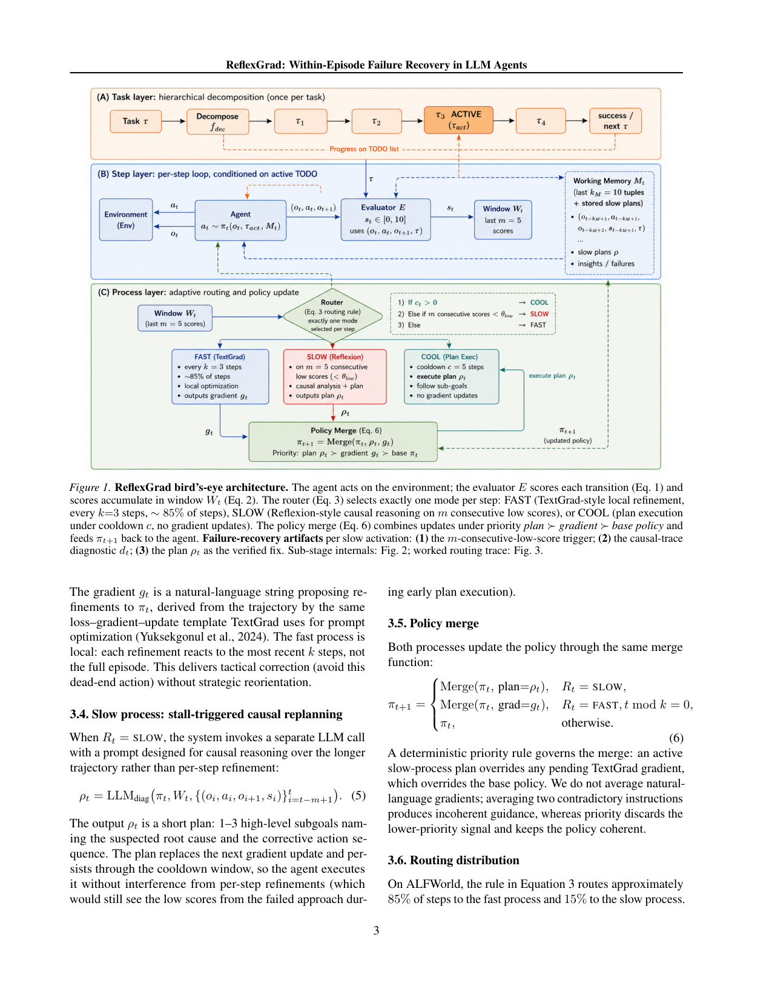
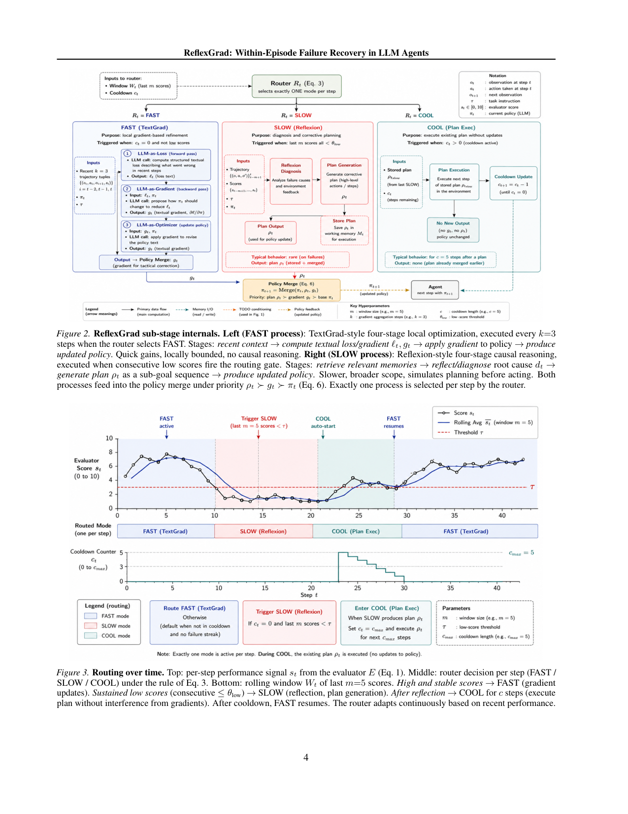

`reflexgrad | ReflexGrad: Within-Episode Failure Recovery in LLM Agents via Progress-Gated Dual-Process Routing | QpiAI（印度）；Ankush Kadu, Aswanth Krishnan | 2026-05（arXiv:2511.14584v4，ICML 2026 FoGen Workshop accepted） | L1 免梯度·in-episode（NL 策略演化 + 双过程路由；强触 L3 失败恢复/反思） | 相关性 High`

> 【档位】deep（由 light 升级，补全第二层/第三层）。基于真实 PDF 正文（18 页：正文 §1–§10 + 附录 A 算法 / B baseline 实现 / C 逐 seed / D-F 失败轨迹 / E 全 prompt / G 统计 / H 敏感性 / I 算力）。三标注：【原文】/【推断】（附依据）/【待核】。

---

## ══ 第一层：一眼看懂 ══

- 🟦 **TL;DR**：【原文】LLM agent 常**早期选错策略→环境反馈无信息→小变体反复→步数耗尽**，而"逃脱所需信息其实已在失败轨迹里",但没有架构在**单个 episode 内**用上它。ReflexGrad 在一个 episode 里**路由两个过程**:**fast(快)**=TextGrad 式每 k=3 步的局部文本梯度精修(战术纠错:避开这个死路动作);**slow(慢)**=当 **m=5 个连续低进度分**触发门控时,做 Reflexion 式因果诊断+重规划(战略纠错:命名根因+给 1–3 子目标)。一个**确定性优先级 merge(plan ≻ gradient ≻ base policy)**保持 NL 策略连贯,plan 后进入 c=5 步 cooldown 保护执行不被梯度干扰。每次 slow 激活产出三件可观察 artifact:可复现触发器 + 因果诊断 + 验证过的修复。ALFWorld 134 任务(10 seeds,**零示范**):Qwen-3-8B 35.1%→**75.4%(+40.3pp)**、GPT-5 46.3%→**88.1%**,算力对齐下超 1-shot LATS +2.7pp、ToT +5.7pp、Self-Refine +6.7pp(均 p<0.05)。
- **最巧的一步**：【原文+推断】**进度门控的路由规则(Eq.3)——slow 只在"m 个连续分都 <θ_low"时才触发,而非平均低**。【推断】这正是抽掉就垮的命门:它精准识别"TextGrad 把一个**错策略**越修越精"的结构签名(连续低分 = 局部梯度在错 basin 里收敛 ∆_loc→0 但 ∆_glob 仍大),从而知道"该从战术升级到战略";固定节奏/随机门控忽略这个签名。证据:fast-only 与 slow-only 之和 <39.8pp/33.5pp,**合并后超出(+12.0pp/+6.8pp 超可加 synergy)**——synergy 就来自"在对的时刻切到 slow"。【推断依据:§3.9 C1/C2 条件分析 + Table 2 synergy + 敏感性 Table 4 显示规则对阈值鲁棒(最差仍 84.3%)】。

---

## ══ 第二层：为什么做 ══

- **研究背景**：【原文】LLM agent 会在**本能解决的任务上失败**:早期 commit 到错策略→环境反馈无信息→小变体反复→步数耗尽(§1,引 Shinn 2023/Kim 2025)。关键观察:**逃脱所需信息其实已在失败轨迹里**,但现有方法要么把恢复延到下一 trial、要么只在局部精炼那个错策略。
- **解决的具体痛点**：【原文】缺口卡在两个现有方法之间(§1,§2):**Reflexion**做**战略纠错**(verbal 自评+整次重试)但**延到下一 trial 且需 demonstration bootstrap**——单 episode 内步数会先耗尽;**TextGrad**做**战术纠错**(文本梯度在单 session 内精炼策略)但**梯度局部、只会把错策略磨得更精**;推理时搜索(LATS/ToT)每步加宽动作空间但**从不更新策略**。**缺的那块**=一个机制:先做战术精炼、当战术修不动时**升级到战略纠错——且在单个 episode 内**。
- **相关工作 & 各自不足**：【原文,§9】(a) **反思/自评**:Reflexion/ReflAct 跨 trial 生成 verbal critique 且需 demo;Self-Refine 迭代自评但不更新持久策略;ExpeL 跨 episode 抽经验——**ReflexGrad 在单 episode 内、无跨 episode 学**。(b) **Prompt 优化**:TextGrad/DSPy/OPRO 在 session/batch 级用文本梯度优化 prompt——本文把同机制**每 k=3 步**用、当快战术环。(c) **推理时搜索**:ToT/LATS 探路径但不更新策略。(d) **自适应规划**:**AdaPlanner 是最近邻**——单 episode 内在"in-plan/out-of-plan"间切。(e) **dual-process/失败恢复**:DPT-Agent(System1/2 切换)、LEAFE、AgentDebug(事后修)、CogRouter(训练学路由,82.3%)、DuSAR(进度门控慢过程,与本文相似)——均为并发工作。
- **动机链(为什么非这样不可)**：【原文+推断】现状=战术修(TextGrad)与战略修(Reflexion)各管一段;缺陷=纯战术会把错策略越修越精、纯战略要等下一 trial;所以要**在一个 episode 内路由二者、且在对的时刻从战术升级到战略**。【推断】为什么不固定节奏/随机门控?——§3.2:固定/随机门控**忽略慢过程要瞄准的结构签名**——"TextGrad 把一个错策略越修越精"的迹象正是**连续低分**(局部梯度在错 basin 里收敛 ∆_loc→0 但 ∆_glob 仍大);进度门控(连续 m 个分都 <θ_low)精准抓这个签名。为什么不平均两条 NL 指令?——§3.5:平均两条矛盾指令产生不连贯指导,所以用**确定性优先级 merge**(plan≻grad≻base)丢弃低优先级信号、保策略连贯。
- **与最近邻(AdaPlanner / Reflexion)的 Δ**：【原文,§9】与 **AdaPlanner** 的关键 Δ=**切换机制**:AdaPlanner 条件于 plan 执行成功/失败(**二值**),ReflexGrad 条件于**连续进度分 + 连续低分触发**——允许"渐进战术精炼**先于**战略介入"。与 **Reflexion** 的 Δ:把 Reflexion 式因果诊断**搬进单 episode 当慢过程**(不跨 trial、不需 demo)。【原文】§9 定位:占据 **training-free × within-episode × progress-gated × dual-process × single-model × demo-free** 的特定交集,据作者所知无前作/并发作占满这整个交集。

---

## ══ 第三层：怎么做 + 靠不靠谱 ══

- **方法流水线(3 组件,Fig.1/Algo.1)**：【原文】任务=NL 指令 τ。
  1. **任务分解(每任务一次)**:f_dec(τ,o_0) 分解成 TODO 列表 T={τ_1..τ_n}(n∈[3,8]),每个带状态 σ∈{pending,active,done,failed} 与 per-TODO 状态;active TODO 当 checkpoint 防回归(§3.1)。
  2. **每步评估+窗口**:LLM 评估器 E 打逐步进度分 s_t=E(o_t,a_t,o_{t+1},τ)∈[0,10];滚动窗口 W_t=最近 m 个分(§3.1 Eq.1-2)。
  3. **路由(Eq.3,确定性)**:\(R_t = SLOW if c_t=0 且 ∀i∈[t−m+1,t]:s_i<θ_low; COOL if c_t>0; FAST otherwise\)。**slow 只在 m 个连续分都 <θ_low 时触发(非平均低)**;激活时 c_t←c=5 进 cooldown(§3.2)。约 **85% 步 FAST / 15% SLOW**(规则在 ALFWorld 上的产物,非调参)。
  4. **FAST(每 k=3 步)**:对最近 k 个 tuple 算文本梯度 g_t=LLM_grad(π_t, W_t[−k:], 最近 k 步轨迹)——TextGrad 式四阶段(loss→gradient→apply→updated policy),局部战术纠错(§3.3)。
  5. **SLOW(门控触发)**:单独 LLM call 对更长轨迹做因果诊断 ρ_t=LLM_diag(π_t,W_t,最近 m 步带分)——Reflexion 式四阶段(retrieve memory→诊断根因 d_t→生成 1–3 子目标 plan ρ_t→updated policy);plan **替换**下一次梯度更新、并贯穿 cooldown 让 agent 无干扰执行(§3.4)。
  6. **Policy Merge(Eq.6)**:确定性优先级 **plan ρ_t ≻ gradient g_t ≻ base policy π_t**;**不平均** NL 指令(§3.5)。每次 slow 激活产三 artifact:可复现触发器 + 因果诊断 d_t + 验证过的 plan ρ_t。
- **逐组件必要性(及消融)**：【原文,Table 2 cross-model ablation,逐行去一组件】
  - **fast(TextGrad-only)**:GPT-5 +23.1pp / Qwen +26.1pp——单它已恢复大部分**便宜可恢复**的错。
  - **slow(Reflexion-only)**:GPT-5 +6.7pp / Qwen +7.4pp(单 trial 零样本,低于其原论文 97% 因那用 2-shot×12 trial)。
  - **合并的 super-additive synergy**:GPT-5 fast+slow 可加=+29.8pp,合并实得 **+41.8pp(+12.0pp synergy)**;Qwen 可加 +33.5pp,实得 +40.3pp(+6.8pp synergy)。**synergy 来自"在对的时刻切到 slow"**——这是"合并>各自之和"的硬证据。
  - **bounded growth 四机制(防策略漂移)**:【原文,§3.7】① working-memory 窗口=10 限可见步;② 策略从 ~150 token 长到 ~380(max 520),不线性爆炸;③ 新梯度对当前 π_t 算、**覆盖**同主题旧指导(不 append history);④ slow plan 替换累积梯度漂移 + cooldown 护 c=5 步。
  - **进度门控 vs 固定/随机**:无直接 A/B,但**敏感性 sweep(Table 4/8)**间接证:k∈{2,3,5}、m∈{3,5,7}、θ_low∈{3,4,7} 范围内 **84.3%–88.1%**,最差(m=3 过触发)仍 84.3%(远超 zero-shot 46.3%);**over-trigger 反而掉分**(m=3 时 slow 在短 dip 上误触发、每次 ~5 call+5 步 cooldown 抢走 fast 精炼,§H)。
- **关键机制/公式直觉**：
  - **进度门控规则 Eq.3(连续低分才升级)**:【原文+推断】直觉=单个噪声低分不该触发战略重规划,只有"连续 m 个都低"才说明 fast 在错 basin 里收敛(战术修不动了)。**C1 激活条件**:设计成在 ∆_loc→0 且 ∆_glob≥c(θ_low) 时触发;评估器幻觉率 η_fp≈0.03,union bound 给假触发率 ≤m·η_fp≈0.15(GPT-5 实测假阳为 0,远低于界)(§3.9)。
  - **C2 逃逸条件(可证伪假设)**:super-additive synergy 需存在非空 T_stuck(fast-only 收敛到局部最优 π*_F、∆_glob(π*_F)>c)且 slow plan 在 cooldown 前把策略移出该 basin;**预测**:若策略类更丰富、|T_stuck| 更大,则 synergy 随模型规模增长——**实证吻合**:GPT-5 synergy +12.0pp > Qwen +6.8pp(GPT-5 fast 饱和 69.4% 但更多剩余 gap 是"stuck"而非世界知识缺失,留更多 synergy 空间)(§3.9)。
  - **优先级 merge(plan≻grad≻base)**:【原文+推断】直觉=战略 plan 一旦生成就压过待定战术梯度、梯度压过 base;丢弃低优先级而非平均→避免矛盾 NL 指令产生不连贯,是"path-recovery 单点接管"的工程实现。
- **实验与证据(关键实验+具体数字)**：【原文】环境=**ALFWorld 134 任务**(6 类:Pick&Place/Clean/Cool/Heat/PickTwo/Examine)、**10 seeds、零示范**;模型 **GPT-5(API)+ Qwen-3-8B(本地 A100 80G)**。**头条**:Qwen 35.1%→**75.4%(+40.3pp)**、GPT-5 46.3%→**88.1%(+41.8pp)**;**1.5pp 跨模型差在 seed 噪声内**(Welch t≈1.60,p≈0.13)→**增益是架构性而非模型规模**。**算力对齐(Table 3,Qwen,均 1-shot 基线 vs 本文零示范)**:超 LATS +2.7pp(p≈0.01,且省 ~30% call:100 vs 140)、超 ToT +5.7pp(p<10⁻⁴)、超 Self-Refine +6.7pp(p<10⁻⁵);**不及 ReflAct 80.6%**(差 5.2pp,作者明说不 claim parity)。**最关键支撑实验**=Table 2 的 super-additive synergy(fast+slow 实得 > 可加和)——这是"双过程路由>各自"的命门,且每个实验配一个隔离 confound 的测试(Table 1 列了 11 类 confound 各对应一个测试,严谨度高于同类)。**baseline 是否公平**:【原文】**故意保守**——baseline 跑最有利的 1-shot,ReflexGrad 跑最难的零示范;且 ToT/LATS 在原 benchmark(Game-of-24/HotPotQA)做了 sanity-check 锚定(±2pp 复现)。**看着强但没回答核心问题**:【推断】**跨域(TextWorld 9 / OSWorld 20)只是 applicability 证据非统计结论**(作者自陈);且 **ExpRAG 用轨迹检索在 ALFWorld 达 83.6%**(无双过程机制就接近 GPT-5 结果),作者诚实指出这把相关比较重framing 成"双过程 vs 轨迹检索",留作 future work。
- **假设与失效边界**：【原文+推断】① 假设 **episode 内有可用逐步进度信号 + 出现重复低进度 streak**;② 失效(§7 失败分析,33 个 Qwen 失败):**世界知识缺失(21/33)**——慢过程能诊断"没在加热"但不知 heat↔microwave 映射(环境不暴露则补不上);**receptacle 导航(8/33)**——知道对的动作但 55 步内没到正确 receptacle;**评估器幻觉(4/33)**——~3% 假阳(96% 2 步内自纠,但持续序列致残余失败)。③ 【原文】**无跨 episode 学习/无知识固化**(与 ExpeL/Voyager 明确划清);④ max_steps=15 饱和(15→20 仅 +2.2pp 但 +33% 成本)。
- **祛魅总结**：【推断】**真贡献(硬货)**=① 把"战术(fast 局部梯度)/战略(slow 因果重规划)"**用进度门控在单 episode 内路由**,并实证 **super-additive synergy(+12pp/+6.8pp 超可加)**——证明"在对的时刻切到 slow"本身就是增益源;② **demo-free 零示范打平/超 1-shot 基线**(算力对齐、p<0.05);③ **C1/C2 可证伪条件 + 11 类 confound 隔离测试**的方法论严谨度明显高于同类 LLM-agent 论文;④ **已开源**(github.com/qpiai/reflexgrad,扉页脚注承诺 release code/prompts/per-seed logs/sweeps);⑤ bounded-growth 四机制是 NL 策略防漂移的可迁移轻量治理。**包装/需打折的**:① 这是 **ICML 2026 FoGen Workshop** 文(非主会);② **仅 ALFWorld 完全验证**,跨域只是 applicability;③ **慢过程受模型世界知识上限约束**(Heat/Examine 类诊断对了也救不回,5.2pp 差距来源)——提示在缺世界知识时需外接检索/示范;④ **无跨 episode 学习/不进权重**(单 episode 内有效但不保留到下次);⑤ GPT-5 闭源不可精确复现(Qwen-3-8B 是可证伪贡献);作者整体非常诚实(明说不 claim ReflAct parity、把 ExpRAG 对比和条件 operationalize 列 future work)。

---

## ══ 结构化抽取 ══

### 🎯 机制速览 6 轴
| 维度 | 内容 |
|---|---|
| **学什么信号** | **自反思 + LLM 评估器的逐步进度分** s_t∈[0,10]\(E 打分,作为路由信号而非成功判据);fast=过去 k 步轨迹的文本梯度;slow=过去 m 步轨迹的因果诊断;**无人类示范、无外部 reward、无金标**(成功仍用 ALFWorld 确定性 oracle 算) |
| **改什么** | **自然语言策略 π_t(NL 字符串,TextGrad 式"可优化参数")** + 一个 episode 内 working memory(最近 10 tuple + slow plan);**LLM 权重冻结**;每步 fast 改 π_t、slow 用 plan 替换梯度 |
| **何时改** | **在线·in-episode per-step**:fast 每 k=3 步、slow 进度门控触发(约 85% 步 fast / 15% slow)、cooldown 期不改;**纯单 episode 内,无跨 episode 学习** |
| **免梯度?** | **是**(零参数更新;"textual gradient"是 NL 字符串的隐喻梯度,非真梯度;training-free) |
| **记忆-技能生命周期** | 写入:fast 梯度/slow plan 入 π_t;**有界增长治理**:working-memory 窗口=10 限制可见步、新梯度**覆盖**同主题旧指导(不 append history)、slow plan 替换累积梯度漂移、cooldown 保护——策略从 ~150 token 增到 ~380(最大 520);**无跨 episode 持久库**(与 ExpeL/Voyager 明确划清:它们跨 episode,本文 within-episode) |
| **防遗忘机制** | **隔离式(不动权重)** + **bounded growth 四机制防策略漂移/矛盾/context 溢出**(窗口/覆盖/plan替换/cooldown);优先级 merge 避免"平均两条矛盾 NL 指令产生不连贯";**无几何/merging/KL**(因无跨 episode 知识保留需求) |

### ⑦ 开源代码 + 框架/harness
- 【原文】**已开源**:`https://github.com/qpiai/reflexgrad`(扉页脚注明确 "Code at…",且承诺 release code/prompts/per-seed logs/sensitivity sweeps)。
- 框架/harness:【原文】**自研编排**(非 veRL/TRL 类训练框架,因零梯度);组件=fdec 任务分解→TODO 列表;每步 7 个 LLM call(slow 激活时);评估器 E 单独 LLM call;附录 E 给全部 verbatim prompt。模型:GPT-5(API)+ Qwen-3-8B(本地,A100 80G)。环境:ALFWorld(主)+ TextWorld/OSWorld(跨域探针)。**本次未 clone**(P4 仅核 PDF;如需实现请取该 repo)。

### 💰 资源/成本与可扩展性
- 【原文】总算力 ≈**240 GPU 时**(A100,Qwen 部分)+ ≈**4.6×10⁵ GPT-5 API calls**;成本效率:**最低 cost/pp**(1.4 calls/pp,虽总调用多但 synergy 把额外调用集中在可恢复失败上,Table 6);max_steps=15 时饱和(15→20 步仅 +2.2pp 但 +33% 成本);slow 激活仅 ~15% 步、每次 ~5 calls。【推断】可扩展性受"逐步 LLM 评估 + 多 call/激活"成本限制,但因 in-episode、无训练,部署门槛低。

### 🎯 对"探索-巩固"idea 对标
- **强支撑 + 高价值可借组件(in-episode"探索→巩固"的双时间尺度路由 + path-recovery 原型)**:与你的 idea **高度同构**——尤其 path-selection / path-recovery / 关键步单点接管。
  - **可借组件**:① **进度门控的 fast/slow 路由(连续低分才升级)**="探索-巩固"里"何时该从局部续写切到全局重规划"的现成判据,直接对应你 MEMORY 里"sparse_critical 与 forward-hard/backward-soft 同构""path-recovery 单点接管";② **slow plan 替换梯度漂移 + cooldown 保护执行**=巩固期"用一个稳定计划接管、保护其不被噪声梯度污染"的机制,正是"path-recovery 单点接管"的工程实现;③ **优先级 merge(不平均矛盾 NL)+ bounded growth 四机制**=NL 策略层防漂移/防遗忘的轻量治理,可迁移到任何"探索期不断改 NL 策略"的设定;④ **C1/C2 可证伪条件 + super-additive synergy 实证**给"探索(fast)与巩固(slow)何时协同>各自"提供分析框架。
  - **关系/缺口**【推断】:它是**单 episode 内**的探索-巩固(无跨 episode 知识固化、无外部记忆),与你"MTP 作 foresight 探针 + 把巩固固化进权重"互补——ReflexGrad 证明"进度信号 + 双过程"在 in-episode 极有效,但**不保留到下次/不进参数**;且**慢过程的根因诊断受限于模型世界知识**(Heat/Examine 类失败:诊断对了但环境没暴露正确 receptacle 就恢复不了,5.2pp 差距来源)——提示"巩固/恢复"在缺世界知识时需外接检索/示范。

### 🖼 关键图 top-2

- 这是**原文 Figure 1**(架构主图)。(A) 任务→TODO 列表(带状态/checkpoint);(B) 每步:Evaluator E 打进度分→窗口 W_t→**Router 选 FAST(局部文本梯度,~85%)/SLOW(连续低分触发的因果重规划)/COOL(cooldown 执行 plan)**;Policy Merge 按 plan≻grad≻base 合并喂回。每次 slow 产出三 artifact。**选它**:一图说清"进度门控的双时间尺度路由 + 优先级 merge",是 6 轴(改什么/何时改/生命周期)与"最巧一步"的唯一依据图。

- 这是**原文 Figure 3**(机制时序图)。上:逐步进度分 s_t;中:每步路由(FAST/SLOW/COOL);下:最近 m=5 分窗口。**高且稳→FAST(梯度);持续低(连续≤θ_low)→SLOW(反思+生成 plan);反思后→COOL c 步无干扰执行 plan;cooldown 毕→FAST 恢复**。**选它**:直观展示"什么信号触发从探索(fast)切到巩固/恢复(slow)再回探索"的完整时序——对"探索-巩固"的切换时机最具借鉴价值。

---

### 假设与失效边界(一句)
- 【原文+推断】假设**episode 内有可用的逐步进度信号 + 出现重复低进度 streak**;失效/边界:**慢过程能诊断根因但补不上模型缺失的世界知识**(Heat/Examine 类:21/33 失败因不知 verb↔receptacle 映射、8/33 因步数耗尽未到达正确 receptacle)、**评估器幻觉 ~3% 假阳**(96% 2 步内自纠但持续序列致残余失败)、**无跨 episode 学习/无知识固化**,且 cross-domain(TextWorld 9/OSWorld 20)仅为适用性证据非统计结论。

### 对"探索-巩固"对标(一句)
- **强支撑**:ReflexGrad = in-episode"探索(fast 局部梯度)—巩固/恢复(slow 因果重规划)"的双时间尺度路由范本,其**进度门控触发(连续低分才升级)、slow-plan 接管+cooldown 保护、优先级 merge、bounded-growth 防漂移**均为可直接迁移的 path-recovery/path-selection 组件;局限是单 episode 内、不固化进权重、慢过程受模型世界知识上限约束。
