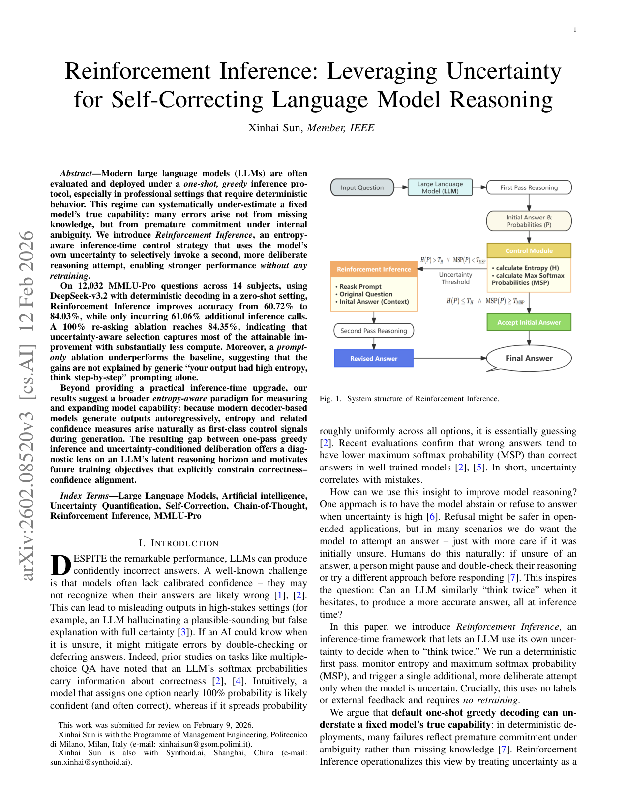
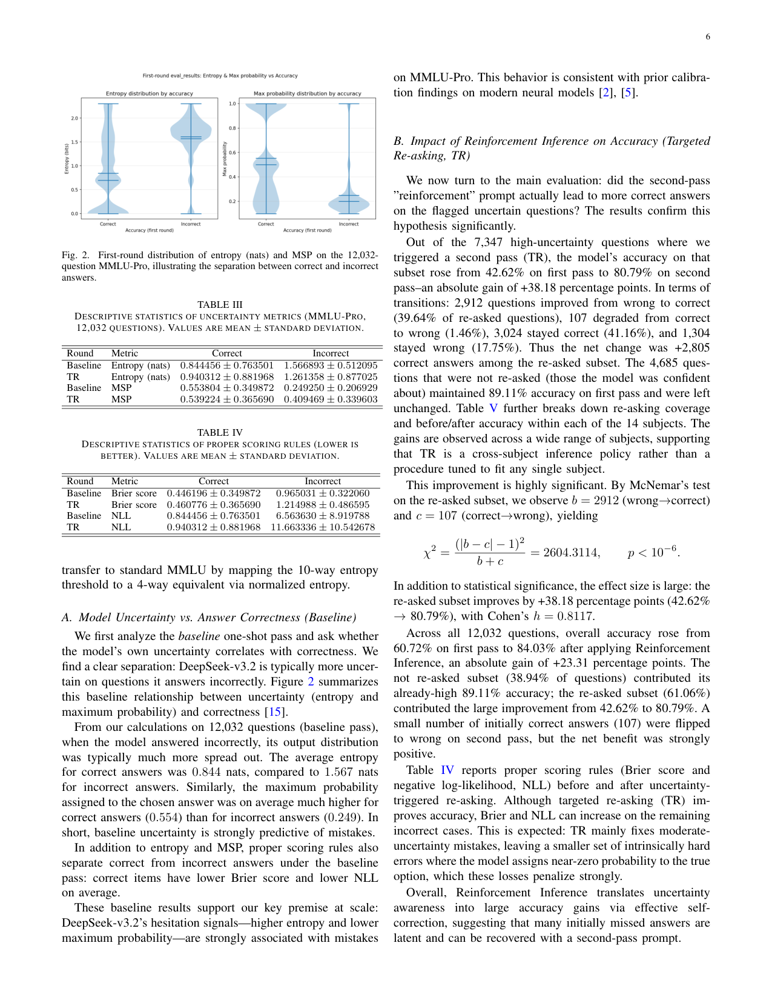

`reinforcement_inference | Reinforcement Inference: Leveraging Uncertainty for Self-Correcting Language Model Reasoning | Politecnico di Milano + Synthoid.ai（上海）；Xinhai Sun（单作者，IEEE member） | 2026-02（arXiv:2602.08520v3，IEEE 投稿 2026-02-09） | L1 免梯度·test-time（不确定性触发二次推理；强触 L3 自纠正/CoT） | 相关性 Med`

> 【档位】deep（由 light 升级，补全第二层/第三层）。基于真实 PDF 正文（11 页：正文 §I–§X + 参考）。三标注：【原文】/【推断】（附依据）/【待核】。
> 命名注意：标题叫 "Reinforcement Inference" 但**与 RL/强化学习无关**——是"用模型自身不确定性触发第二次更审慎推理"的纯推理时启发式（"reinforcement" 取"加强/再确认"之意）。

---

## ══ 第一层：一眼看懂 ══

- 🟦 **TL;DR**：【原文】专业场景常用**一次性贪心解码**(deterministic),这会**系统性低估模型真实能力**——很多错不是缺知识,而是"内部其实犹豫却过早 commit"。Reinforcement Inference 的做法极简:跑确定性**第一遍**,算这一遍答案分布的**熵 H 和最大 softmax 概率 MSP**;**仅当不确定时(\(H>τ_H\) 或 \(MSP<τ_{MSP}\))**才追加**第二遍**——第二遍只告诉模型"你上次不太确定、请从头重想"(**不泄露对错、不给提示**),取第二遍答案为终答。在 12,032 道 MMLU-Pro(10 选 1)、DeepSeek-v3.2、零样本确定性下,准确率 **60.72%→84.03%(+23.31pp)**,只多 **61.06%** 的调用;而 100% 全部重问只多到 84.35%——**说明不确定性选择captures了几乎全部可得增益、却省一半算力**。
- **最巧的一步**：【原文+推断】**用模型自身不确定性(熵/MSP)做"该不该再想一次"的选择性触发**。【推断】抽掉"选择性"这一步就垮:两个消融钉死了这点——(a) **prompt-only**(只用同样的"你熵高、请重想"提示但不真做第一遍、无不确定性测量)**反而低于 baseline**→增益不来自提示措辞/通用 CoT 鼓励;(b) **uniform 全部重问**只比 targeted 多 0.32pp→增益不来自"多问",而来自"**问对题**"(高熵题第二遍 42.62%→80.79%,+38pp)。即"会算熵并据此挑题"才是命门。【推断依据:§VI-C/D 两组消融 + Table VI(TR vs UR)】。

---

## ══ 第二层：为什么做 ══

- **研究背景**：【原文】LLM 常产**自信的错答**——一个公认挑战是模型缺校准置信度(不知道自己何时可能错),在高风险场景会输出貌似合理实则错的解释(§I,引 [1-3])。但**先验证据**:LLM 的 softmax 概率携带 correctness 信息——错答倾向于**更低的 MSP(最大 softmax 概率)**(Hendrycks [2]);不确定性与错误相关。专业场景常用**一次性贪心解码**(deterministic),这正是本文要挑战的 regime。
- **解决的具体痛点**：【原文】默认 **one-shot greedy 解码会系统性低估固定模型的真实能力**——很多失败反映"内部其实犹豫却过早 commit",而非缺知识(§I)。痛点具体到:工业部署常需确定性行为、且**权重不能频繁更新**(大/闭源模型),需要一个**不重训**就能"解锁潜在推理 horizon"的办法。人类做法是类比:不确定时停下来重查/换思路再答——能否让 LLM 也"犹豫时 think twice",全在推理时?
- **相关工作 & 各自不足**：【原文,§III】(a) **置信/不确定性**:MSP 对错答/OOD 更低(Hendrycks),softmax 可预测 MC-QA correctness、可做选择性弃答;Bayesian/ensemble 估计、微调校准——本文**同样用输出分布当不确定性信号,但不训校准/不弃答,而在推理时触发自纠**。(b) **CoT/Self-Consistency**:SC 采多条路径投票,增益大但**算力重(5–10×)、不论置信都多次尝试**;本文**只触发一次额外 pass、且仅在第一遍不确定时**。(c) **Verifier/重排**:训独立 verifier 或 CoVe 自验(迭代生成+追问+改);本文更轻——**单次不确定性触发的二次 pass,无 learned verifier、无显式验证问题**。(d) **监督重训/RLHF**:要标注数据/奖励且重训,对超大/闭源不实际;本文**零训练、推理时 plug-in**,任何能拿概率/logits 的模型可用。
- **动机链(为什么非这样不可)**：【原文+推断】现状=一次性贪心、或全量 CoT/SC、或训 verifier;缺陷=一次性低估能力、SC/全 CoT 算力浪费在简单题、verifier 要训;所以**用模型自身不确定性(熵/MSP)做"该不该再想一次"的选择性触发**——只在犹豫的题上多花一次 pass。【推断】为什么不"全部重问"(uniform)?——§VI-C 消融:uniform(100%)只比 targeted(61%)多 **+0.32pp**(84.35% vs 84.03%),即"问对题"已 captures **98.6%** 可得增益、省一半算力。为什么不只靠 prompt 措辞?——§VI-D 消融:**prompt-only(只用同样的"你熵高、请重想"提示但不真做第一遍、无不确定性测量)反而低于 baseline**→增益不来自提示措辞/通用 CoT 鼓励。
- **与最近邻("Step-Back" prompting / Self-Consistency)的 Δ**：【原文,§VII】与 **Step-Back/双重检查类**的 Δ:那些 prompt 让模型 double-check 但**普遍施用会浪费算力甚至掉分**;本文**把这个想法绑到不确定性度量**——只在模型概率显示犹豫时触发反思,**选择性触发是省算力的核心**。与 **Self-Consistency** 的 Δ:SC 多采+投票(5–10×),本文单次二次 pass(仅 +61% call),且 selective>uniform 证明"问对题"而非"多问"是关键。【推断】这差异有用:它把"反思/自纠"从"无差别施用"变成"按内部不确定性精准投放",在准确率几乎不损的前提下省一半算力。

---

## ══ 第三层：怎么做 + 靠不靠谱 ══

- **方法流水线(Algo.1,4 步)**：【原文,§IV】多选题(K 选 1),从 token log-prob 读各选项归一概率。
  1. **First Pass(确定性)**:标准 zero-shot 格式问、temp=0 取答案 + 选项分布 P。
  2. **Uncertainty Check**:算 **熵 \(H(P)=−ΣP_i \ln P_i\)**(nats)与 **\(MSP=\max_i P_i\)**;若 \(H≤τ_H\) 且 \(MSP≥τ_{MSP}\)→判 confident、接受第一遍答案。
  3. **Reinforcement Prompt(第二遍,仅当不确定)**:\(H>τ_H ∨ MSP<τ_{MSP}\) 时触发——第二遍 prompt 含三部分:① 原题块(同结构);② "Your previous answer was:"+第一遍完整输出;③ Instruction:一句"你上次熵高/不确定、请**丢弃前答、从第一性原理重算**、step-by-step"。**绝不告知对错、不给提示**(§IV-C)。
  4. **Final**:触发则取第二遍答案,否则用第一遍。
  - 主设定阈值(MMLU-Pro,10-way,**先验固定避免泄露**):**\(τ_H=0.8\) nats**(≈35% 最大熵 \(\ln 10≈2.303\))、**\(τ_{MSP}=0.6\)**(把 posterior risk 上界压到 \(1−0.6=0.4\))。
- **逐组件必要性(及消融)**：【原文】
  - **selective 触发(熵/MSP 挑题)**:命门——两组消融钉死:(a) **uniform 全部重问**只多 +0.32pp(§VI-C)→增益不来自"多问"而来自"问对题";(b) **prompt-only**(只提示不测不确定性)**低于 baseline**(§VI-D)→不来自提示措辞/CoT 鼓励。即"会算熵并据此挑题"才是真增益源。
  - **不泄露金标**:必要——保证干净评估,增益归因于"更好用已有知识"而非信息泄露(§IV-C 明说)。
  - **熵 AND/OR MSP 双判据**:【推断】用"\(H>τ_H ∨ MSP<τ_{MSP}\)"(任一犹豫即触发),二者互补(熵=分布整体犹豫、MSP=对所选答案的信心);未单独消融"只用熵 vs 只用 MSP"。
- **关键机制/公式直觉**：
  - **熵 H + MSP 作为不确定性信号**:【原文】§IV-A——从 Bayesian 0–1 决策看,\(ŷ=\arg\max_i P_i\),**\(1−MSP\) 上界了选 ŷ 的 posterior risk**;熵捕捉"分布犹豫"、MSP 捕捉"对所选答案的信心"。直觉:概率近均匀=在瞎猜(该重想)、某选项近 1=自信(常对,可接受)。
  - **为什么第二遍能救**:【原文,§VII 三条】① **Latent Knowledge Utilization**:错答时正确选项常仍有非零概率(潜在知识在但未用),"你不确定、想深点"的 cue 常诱出更深推理、recover 正解;② **Change of Decoding Dynamics**:模型在几个选项间近无差别时,二次 cue 鼓励权衡替代项、justify 选择,常打破平局偏向正解(呼应 CoT 为何有用);③ 但 **107 个初始对的被翻错**(1.46%,净仍正)。
- **实验与证据(关键实验+具体数字)**：【原文】模型 **DeepSeek-v3.2(主,~685B)** + DeepSeek-v3.2-Reasoner/Qwen3-30B/Qwen3-235B(泛化);数据 **MMLU-Pro 12,032 题(14 学科,10 选 1)** + MMLU 4-way(迁移);temp=0、top_logprobs=20、单 token 答案直接读概率。**头条**:总准确率 **60.72%→84.03%(+23.31pp)**,只多 **61.06%** call;**high-uncertainty 子集(7,347 题)第一遍 42.62%→第二遍 80.79%(+38.18pp)**,McNemar \(χ²=2604,p<10⁻⁶\),Cohen's \(h=0.81\)。**两个最关键支撑实验**:① **前提证据 Fig.2+Table III**——答对题熵更低(0.845 vs 1.567 nats)、MSP 更高(0.554 vs 0.249),小提琴图显示对/错分布分离(没这个前提,"按不确定性挑题"就不成立);② **TR vs UR(Table VI)**——targeted 84.03%(1.61× 算力)vs uniform 84.35%(2× 算力),证 selective captures 99.6% 增益却省一半算力。**baseline 是否公平**:【推断】baseline=同模型一次性贪心、prompt-only/uniform 两消融控制了"提示措辞"和"多问"两个混淆,**严谨**;16 配置阈值扫(Table IX)显示鲁棒(83.69%–84.34%、re-ask 52.8%–76.3%)。**看着强但没回答核心问题**:【原文】**跨模型不一致**(Table VIII):DeepSeek-Reasoner re-ask 仅 20.96% 但 target 子集 31.68%→44.61%(显著);**Qwen3 re-ask 频繁(57.5%/65.2%)却增益微薄**(76.37→77.25 / 81.44→82.58)——疑似 Qwen 已对 MMLU-Pro 暴露/已饱和,"高熵反映内在歧义而非可纠错误";跨数据集迁移到已强的 MMLU(91.134%→91.184%,+0.05pp)几乎无收益。
- **假设与失效边界**：【原文+推断】① 假设**任务是离散多选(熵可定义)+ 模型校准良好(不确定性真预测错误)+ 能拿 token 概率**;② 失效:**过度自信的错答不触发**(无法救,§VII-Model's Self-Monitoring + §VIII)、**跨模型不一致**(Qwen 高 re-ask 却增益微薄、DeepSeek 显著)、**仅多选题**(开放生成需语义熵聚类[22],未测,§VIII);③ 【原文,§VI-F】阈值若按测试集选有 **"privileged" 偏置风险**(作者自承,严格做法应在 held-out 上选阈值);④ 【原文】只允许 1 次额外 pass(多步迭代列 future work);**完全不积累知识/记忆**。
- **祛魅总结**：【推断】**真贡献(硬货)**=① 一个**极简、省算力的纯推理时控制**:用模型自身熵/MSP 选择性触发二次推理,只多 61% call 拿到 uniform(2×)增益的 **99.6%**——比 SC(5–10×)/全 CoT 便宜得多;② **两组消融(uniform/prompt-only)严谨地证明"问对题 ≠ 多问 ≠ 提示措辞"**,把增益干净归因到 selective uncertainty triggering;③ **不泄露金标的干净评估** + 12,032 题大规模 + 16 配置阈值扫,统计可信;④ "一次性贪心低估真实能力 / 错答常有 latent 正确概率"是有价值的观察。**包装/需打折的**:① 标题 "Reinforcement Inference" **与 RL 无关**(易误导,"reinforcement"=加强/再确认);② **正文未给代码链接**;③ **仅多选题 + 主要 DeepSeek 单模型显著**——跨模型(Qwen)增益微薄、迁移到已强基准几乎无收益,说明**强依赖"模型校准好+有可纠 headroom"**;④ 阈值选择有 privileged 偏置风险(作者诚实自承);⑤ 单作者 IEEE 投稿(arXiv v3),非顶会;对"探索-巩固"主线属**信号层借鉴**(用熵/MSP 当"何时再想/接管"触发)而非核心机制。

---

## ══ 结构化抽取 ══

### 🎯 机制速览 6 轴
| 维度 | 内容 |
|---|---|
| **学什么信号** | **模型自身不确定性**(预测分布的熵 H + 最大 softmax 概率 MSP,从 token log-prob 读出);**无人类反馈、无外部 reward、无金标**(correctness 仅事后评估、推理时绝不泄露给模型);辅以 Brier/NLL 当诊断 |
| **改什么** | **什么都不改——纯推理时控制**:不改参数、不改 prompt 模板(第二遍只 prepend 一句不确定性提示)、不存记忆;只是**有条件地多跑一遍生成**(adaptive compute policy) |
| **何时改** | **test-time·per-query**:第一遍后按阈值决定是否触发第二遍;**仅 1 次额外 pass**(future work 提到可多步迭代但本文只 1 步) |
| **免梯度?** | **是**(零训练、零梯度、零参数更新;纯 inference-time plug-in,任何能拿到概率/logits 的模型可用) |
| **记忆-技能生命周期** | **不适用**:无记忆、无技能、无经验积累、无跨 query 状态;每题独立处理 |
| **防遗忘机制** | **不适用**(不动权重、无持续学习,故无遗忘问题);仅强调"不泄露金标→干净评估" |

### ⑦ 开源代码 + 框架/harness
- 【原文/待核】正文**未给出代码链接/仓库**〔待核:本次仅核 PDF,正文无 link〕。
- 框架/harness:【原文】**无框架**(纯推理脚本):调 API 取 token-level log-prob(top_logprobs=20)、温度 0、单 token 答案(A–J)直接读概率。模型:**DeepSeek-v3.2(主,~685B)** + DeepSeek-v3.2-Reasoner / Qwen3-30B / Qwen3-235B(泛化)。数据:MMLU-Pro(主)+ MMLU 4-way(迁移)。

### 💰 资源/成本与可扩展性
- 【原文】**额外成本仅触发题多 1 次 call**:targeted 比 baseline 多 **61% 调用**(7,347/12,032),却达 uniform(2×)增益的 **99.6%**;远便宜于 self-consistency(5–10×)或 always-on CoT。16 配置阈值扫显示鲁棒(最终准确率 83.69%–84.34%、re-ask 率 52.8%–76.3%),可按预算选阈值。【推断】可扩展性极好(无训练、按需付费),瓶颈在高熵题的延迟翻倍。

### 🎯 对"探索-巩固"idea 对标
- **可借组件(不确定性作为'何时介入'的触发信号)+ 边缘支撑**:这篇最相关的是**"用模型自身不确定性当控制信号"**这一点,与你的 MTP-foresight / 关键步识别同源。
  - **可借组件**:① **熵/MSP 作为"该不该再想/该不该接管"的选择性触发**=与你"切关键步(高熵/低置信)而非换行""MTP 作 foresight 探针"高度同构——本文给出一个**纯输出分布层的、极简且省算力的触发判据**(只 1 次额外 pass 拿到大部分增益),可作 path-recovery"何时单点接管"的轻量信号源;② **"一次性贪心低估真实能力 / 错答的正确选项常有非零概率(latent knowledge underused)"** 的观察,支持"探索期该在犹豫点放开重采/重想"的动机;③ **selective > uniform 的成本论证**(问对题 vs 多问)对"巩固/恢复应集中在高不确定处而非全局"有迁移价值。
  - **关系/缺口**【推断】:它**完全不碰知识固化/记忆/技能/权重**,且**仅多选题**(离散选项才好定义熵)、向开放生成迁移需语义熵聚类(作者列 future work);**对过度自信的错答无能为力**(不触发);**跨模型不一致**(Qwen 高 re-ask 率却增益微薄,疑似 benchmark 暴露或已饱和)。故对"探索-巩固"主线属**信号层的边缘借鉴**,非核心机制。

### 🖼 关键图 top-2

- 这是**原文 Figure 1**(系统/方法主图)。第一遍确定性解码→算熵/MSP→**不确定则触发第二遍(prepend 不确定性提示、不给对错)**→取第二遍为终答,否则用第一遍。**选它**:一图说清"不确定性触发的选择性二次推理"这一核心控制流,是 6 轴(改什么/何时改)的依据图。

- 这是**原文 Figure 2 + Table III**(核心证据图)。12,032 题上,**答对的题熵更低(0.845 vs 1.567 nats)、MSP 更高(0.554 vs 0.249)**,小提琴图直观显示对/错两组分布的分离。**选它**:这是整篇的前提证据——"模型自身不确定性确实强预测错误",从而"按不确定性挑题再想"才成立;直接支撑"高熵=关键/可疑步"这一对标点。

---

### 假设与失效边界(一句)
- 【原文+推断】假设**任务是离散多选(熵可定义)+ 模型校准良好(不确定性真预测错误)+ 能拿到 token 概率**;失效/边界:**过度自信的错答不触发**(无法救)、**跨模型不一致**(Qwen3 高 re-ask 却增益微薄、DeepSeek 显著)、**仅多选题**(开放生成需语义熵且未测)、阈值若按测试集选有"privileged"偏置风险(作者自承),且**完全不积累知识/记忆**——纯单题推理增强。

### 对"探索-巩固"对标(一句)
- **边缘支撑·可借信号**:最可借的是"**用模型自身熵/MSP 做选择性'何时再想/接管'触发**"(与你切高熵关键步、MTP foresight 同源)及"selective>uniform、错答常有 latent 正确概率"的论证;但它纯推理时、仅多选题、不碰任何知识固化/记忆/权重,对"探索-巩固"主线属信号层借鉴而非核心组件。
