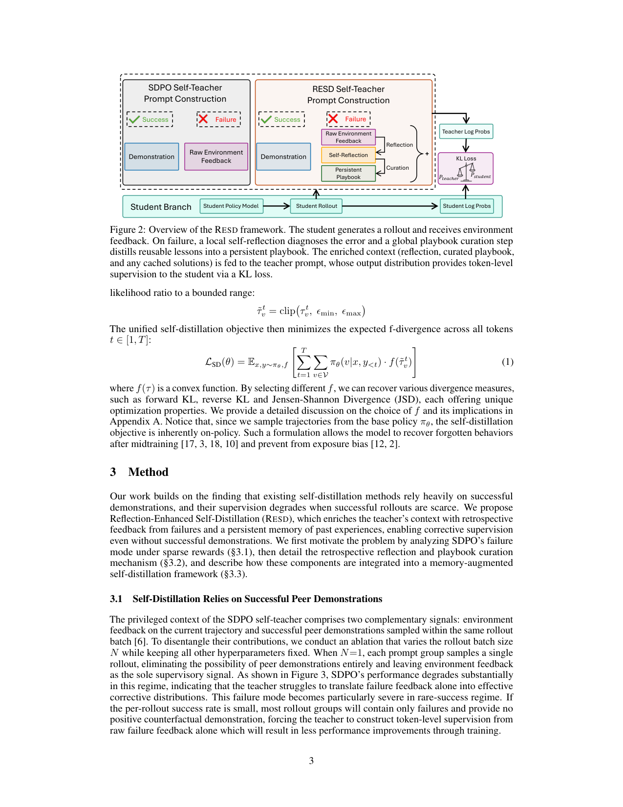
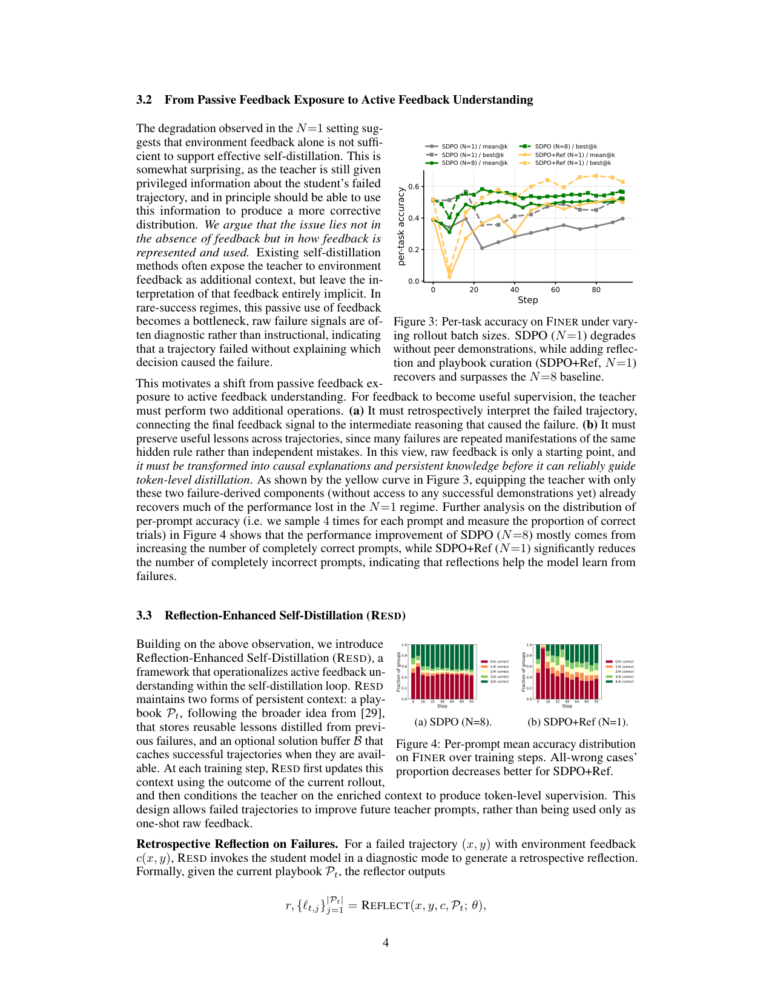

`resd | Learning with Rare Success but Rich Feedback via Reflection-Enhanced Self-Distillation (RESD) | UC San Diego + Amazon + Georgia Tech (Yuwei Zhang, Jingbo Shang 等) | 2026-05 arXiv:2605.12741v1 (12 May 2026) · 预印本 | 主题线 L?·on-policy 自蒸馏 + 反思/playbook·极高相关(本项目主轴)`

> 三标注约定:【原文】=论文直述;【推断】=有据判断(附依据);【待核】=拿不准的关键事实。

══ 第一层:一眼看懂 ══

- 🟦 **TL;DR**:在"成功极稀少、但反馈很丰富"的持续学习场景里,把**On-Policy 自蒸馏(self-distillation)** 做得能"从失败里学"。标准做法(SDPO/OPSD):学生跑一条轨迹,一个"自教师"(=模型自己的旧/EMA 权重)在**特权上下文**(看得到环境反馈、有时还有同批次的成功示范)下算出每个 token 的目标分布,学生用 KL 去对齐——把稀疏的终局成败变成稠密的 token 级监督。**痛点**:当一组里全是失败(rare-success),教师只能拿"原始失败反馈"当上下文,效果很差。**RESD 的解法**:在喂给教师之前,先让模型对失败轨迹做一段**回顾式反思 r**(诊断"哪步导致失败、本该怎么改"),再把反复出现的教训**沉淀进一个跨训练步持久的 playbook P**;教师拿"反思+playbook+(若有)缓存成功解"这个**富化上下文**去产 token 级监督。结果:**单 rollout(N=1)的 SDPO+反思就能追平甚至超过 N=8 的 SDPO**;早期收敛比"8× 采样的 GRPO"还快。【原文 摘要+§1+§3】

- **最巧的一步**:**把"原始失败反馈"主动转译成"反思 + 持久 playbook"再喂教师**。抽掉反思(w/o reflection),MANUFACTORIA-HAS 的 per-test-case acc 从 76.95 掉到 51.41(m@4)——最大跌幅。为什么是它:作者论证(§3.2)失败反馈是**诊断性的(说"失败了")而非指令性的(没说"哪一步该改")**;只有先把它转成"因果解释 + 可复用规则",教师才能在没有任何成功示范时也产出**有纠正性的**分布。Figure 3 黄线:只给这两个失败衍生组件(无成功示范),N=1 就追回并超过 N=8。【原文 §3.2, Fig 3, Table 3】

══ 第二层:为什么做 ══

- **研究背景**:LLM 后训练的核心命题之一是"靠环境交互持续自我改进"。RL(PPO/GRPO)是标配,但**稀疏奖励**是瓶颈:复杂多步任务里成功轨迹极稀有时,RL 缺稠密监督、难在巨大探索空间里 bootstrap。**On-Policy Distillation(OPD)** 是有前景的替代——用更强/特权教师给每个 token 算目标概率,把稀疏终局变稠密 token 信号。【原文 §1】

- **解决的具体痛点**:OPD 要维护一个独立大教师(贵 + 学生/教师分布失配);**自蒸馏(SDPO/OPSD)** 用模型自身(当前/EMA 权重 θold)在特权上下文下当教师,既省外部 oracle 又天然对齐学生分布。**但**:自蒸馏的成败全押在"自教师监督质量"上,而现有方法**把环境反馈当成静态、被动的条件变量**——在没有成功示范的 rare-success 区,教师被迫只从失败反馈里凑监督,提升微乎其微(Fig 1)。**被忽视的设计轴 = 反馈本身的结构化表示**。【原文 §1, §3.1】

- **相关工作 & 各自不足**:
  - *经典 KD*(Hinton 等):学生对齐固定教师输出,但**用固定数据、有学生-教师失配**(学生在自己生成的轨迹上被评)。
  - *On-policy distillation*(GKD、Agarwal'24 等):学生从"教师对自身生成的反馈"里学,对齐训练分布——RESD 正建于此。
  - *自蒸馏特权信息线*(SDPO[6]、OPSD[30]、privileged distillation[14,3]):教师条件于环境反馈/执行信号或参考解/hint——但**都停在 instance 级孤立纠正**,不跨样本聚合经验。
  - *免训练持续学习线*(Reflexion 把口头反馈当 episodic 记忆[19,13]、Self-Discover[32]、ACE/演化经验池[29,28]):提取可复用策略注入未来推理,但**不把经验融进 on-policy 蒸馏的训练信号**。
  - **RESD 的位置**:把"跨样本反思 + 持久经验"**直接嵌进 on-policy 自蒸馏的教师上下文**,补的就是"instance 级孤立纠正"这个缺口。【原文 §5】

- **动机链**:要持续自改进 → 稀疏奖励下 RL 难 → OPD 给稠密 token 信号 → 但外部教师贵且失配 → 自蒸馏(SDPO)解决之 → 但自蒸馏在 rare-success 下退化(教师只有失败反馈、无成功示范,Fig 3 的 N=1 崩)→ **问题不在"有没有反馈"而在"反馈怎么表示/使用"**(§3.2)→ 把失败反馈**主动转译成反思 + 持久 playbook** → 教师据此产出有纠正性的 token 级监督,N=1 也能学。为什么不用更简单做法:直接把原始失败反馈塞进教师上下文(=SDPO)→ Fig 1/3 证明几乎不涨;直接上 GRPO → 8× 采样、早期信号还更弱(Fig 6)。【原文 §1, §3, Fig 1/3/6】

- **与最近邻 SDPO 的 Δ**:最像 SDPO[6]\(自教师 + 环境反馈 + 同批次成功示范)。**关键差异**:SDPO 把反馈当被动上下文、且依赖**同批次的成功示范(peer demonstration)**;RESD ① 把失败反馈**主动转译**成反思 r;② 维护**跨训练步持久**的 playbook(SDPO 的上下文是逐批次即用即弃);③ 即使**完全没有成功示范**也能产纠正监督。为什么有用:Fig 3 的 N=1 设定下 SDPO 崩(没 peer demo 了),SDPO+Ref 反而超 N=8 → 证明"持久反思知识"比"碰运气抽到的同批成功示范"更稳。【原文 §3.1, §3.2, Fig 3】

══ 第三层:怎么做 + 靠不靠谱 ══

- **统一目标(预备)**:对每个 token v 定义似然比 `τ^t_v = πθold(v|x,y<t,c)/πθ(v|x,y<t)`,clip 到 `[ϵmin,ϵmax]` 防极端比值;统一用 **f-散度** 写匹配损失 `L_SD(θ)=E[Σ_t Σ_v πθ(v|·)·f(τ̃^t_v)]`(选不同 f 得 forward-KL / reverse-KL / JSD)。因轨迹从学生 πθ 采样,**目标天然 on-policy**。实践默认 **reverse-KL**,ϵmin=0.2、无上 clip。【原文 §2, §4.1】

- **方法流水线**(Algo 1,每个训练步一个闭环):
  1. **Rollout & Reward**:学生采 `y∼πθ(·|x)`,拿环境反馈 c(x,y) 与奖励 R(x,y) 判对错。
  2. **Context Update(失败才学)**:先 `CONCISE(P)` 修剪 playbook(去 stale/有害条目);若 R<阈值(失败)→ `r ← REFLECT(x,y,c,P;θ)` 产反思并给现有 playbook 条目打 helpful/harmful/neutral 标签;`P ← CURATE(P,r;θ)` 从反思生成**非冗余**新条目;若成功 → 把解缓存进 solution buffer `B(x)←y`、置 r=∅。
  3. **Enriched Teacher Prompt**:检索 B(x)(若有),拼出富化上下文 = playbook P + 反思 r + 上次轨迹 y + 反馈 c + 缓存解 B(x)。
  4. **Policy Update**:教师 `πθold(·|x,y<t,c,r,P,B(x))` 产 token 级目标分布,学生最小化 `L_SD`;另对成功样本按"批次成功率函数"加 per-sample 权重(强化成功样本梯度,Appendix B)。
  5. **Teacher sync**:`θold ← θ`,以 **EMA** 更新(rate 0.0001)。因 P、B 跨步持久,教师可用监督**随训练变好,即使当前批无成功示范**。【原文 §3.3, Algo 1】
  - **Playbook 生命周期**:每条目记累计 (helpful h_j, harmful d_j) 计数;`CONCISE` 在更新前剪掉**净有害(d_j≥h_j)** 的条目,超预算 Mmax 则淘汰**最久未被标注**的(LRU 式)→ 收敛到"反复有用"的条目。【原文 §3.3, Appendix D】

- **逐组件必要性**(Table 3,移除式消融,per-test-case m@4/b@4):
  - *reflection(局部反思)*:✔最关键。MANUF-HAS 76.95→51.41。负责"短期、针对当前失败的纠正"。
  - *playbook(持久经验)*:✔。MANUF-HAS 76.95→60.65、BSIM-EASY 38.87→32.95。负责"保留可复用教训、防回归"。
  - *solution buffer(缓存成功解)*:✔。MANUF-HAS 76.95→60.24、b@4 96.53→80.10。负责"把部分进展转成完整正确解"。
  - *per-sample 成功加权 / EMA rate / clip 设置*:有用但**未做专门消融**(只在 Appendix 给默认值)。【推断:依据=正文消融只覆盖三个上下文组件】

- **关键机制直觉**:RESD **不改自蒸馏目标本身,只改喂给教师的信息**(作者自定位为 "feedback-enhancement / plug-and-play 模块",§6)。直觉:自蒸馏的上限 = 教师能给的分布有多"对";原始失败反馈只告诉"错了"(诊断),反思把它补成"哪步错、该怎么改"(指令),playbook 再把"一次性教训"变成"跨任务持久规则"。Figure 5 的证据很妙:**RESD 的 self-distillation loss 反而更高**,且 loss 质量集中在 "create/solution/The goal" 等**推理决策 token** 上——高 loss = 教师分布更偏离学生当前行为 = 教师在**纠正推理策略**(而非随大流),说明监督确实更有纠正性。【原文 §4.3, Fig 5, §6】

- **实验与证据**:
  - 数据集(Table 1):**MANUFACTORIA-HAS**(写 DSL 程序判定 tape 是否含目标模式)、**BOUNCINGSIM-EASY/MEDIUM**(写 Python 模拟 2D 多物体弹跳)——取自 RL-Grok[20],**初始成功率近 0**,是天然的"从失败学"测试床;**FINER**[29]\(SEC 文件金融实体打 XBRL 标签),初始成功率较高,用来验证"非极稀疏区也受益"。
  - 模型:MANUF-HAS/BSIM-EASY/FINER 用 **Qwen3-4B-Thinking-2507**,更难的 BSIM-MEDIUM 用 **Qwen3-30B-A3B-Thinking-2507**。
  - 协议:**在线流式**(每例最多见一次),每批内 **K=4 次** inner-loop 更新;**N=1 单 rollout**;reverse-KL;teacher EMA 0.0001;train batch 32。指标 mean@4 / best@4 × (Per-Task acc / Per-Test-Case acc)。baseline:SDPO、SDPO+ss(额外蒸馏自身成功样本)、GRPO。【原文 §4.1】
  - **支撑核心主张的关键实验**:Table 2 — MANUFACTORIA-HAS(rare-success):Per-Task acc 从 SDPO+ss 的 **0.57/2.27** 跃到 RESD 的 **35.80/65.91**(m@4/b@4),Per-Test-Case 37.97/71.93→**76.95/96.53**。这是"从近零成功 bootstrap 出来"的最强证据。FINER(高成功率)RESD 仍最好(per-task m@4 53.66 vs SDPO+ss 50.25),证明非极稀疏区也受益。
  - **最有说服力的对照**:Figure 3 — SDPO(N=1)崩、SDPO(N=8)靠多采样涨,而 **SDPO+Ref(N=1)追平且超 N=8**;配合 Figure 4:N=8 的涨主要来自"全对 prompt 变多",而 **SDPO+Ref(N=1)主要是"全错 prompt 显著变少"**(直接证明"从失败学"在起作用)。
  - **vs GRPO(Figure 6)**:GRPO 用 group size 8(8 条 rollout + 8 次反馈/prompt),RESD 单 rollout。**RESD 早期收敛更快**——但作者诚实地把它定位为**交互效率对比**而非等 rollout 预算对比。
  - *"看着强但没回答核心"/隐患*:Fig 6 中 RESD **非单调**,有掉点(FINER ~step50 因 response 截断;BSIM-EASY ~step60 后,进入高成功率区时"稠密自蒸馏不如 reward-based 稳")。作者据此提出**实操策略:先用 RESD 快速冲到高成功率区,再切 GRPO**。这等于承认 RESD 是"早期 bootstrap 器"而非全程最优。【原文 §4.4, §6】

- **假设与失效边界**:
  - 【原文】高成功率区后,纯反馈衍生上下文的稠密自蒸馏**不如 reward-based 稳定**(BSIM-EASY 后段退化)→ 失效边界明确:RESD 擅早期 rare-success,不擅后期精修。
  - 【原文】训练曲线对 **response 截断**敏感(FINER 掉点)。
  - 【推断】反思 r 与 playbook 条目都由**学生模型自身**生成;若模型反思能力弱(尤其小模型/无 thinking),反思可能误诊、playbook 沉淀错误规则 → 教师被带偏。论文用的是 Qwen3-*-Thinking 强反思模型,**未测弱反思 backbone**。依据=REFLECT/CURATE 都用 θ。
  - 【推断】奖励 R 需可判对错(R<阈值才触发反思);若环境只有模糊/延迟反馈,reflect 触发与 c 的诊断价值都打折。依据=Algo 1 line 4 用 R 阈值门控。

- **祛魅总结**:
  - **真贡献(硬货)**:(a)指出 **"反馈表示"是 on-policy 自蒸馏一个被忽视的设计轴**,并用 N=1 vs N=8(Fig 3/4)干净地坐实"反思让模型从失败学";(b)三组件消融清楚(Table 3),反思是主因;(c)Fig 5"高 loss 集中在决策 token"是"教师更具纠正性"的巧妙证据;(d)对失效边界(后期退化、非单调)极诚实,并给出"先 RESD 后 GRPO"的实操建议。
  - **包装/可能高估**:"substantially outperforms GRPO" 需打折——是**交互效率(单 rollout vs 8 rollout)**对比、且只在**早期**更快、后期还会被 GRPO 反超(作者自己承认)。MANUF-HAS 那个 0.57→35.80 的巨大数字是在"baseline 几乎全崩"的极端 rare-success 任务上,泛化到一般任务的幅度要看 FINER(涨幅温和)。【推断:依据=§4.4 措辞 + Table 2 任务间幅度差异】
  - **可能低估**:把自己谦称为"plug-and-play 模块"——但"跨样本反思聚合进 on-policy 蒸馏教师上下文"其实是个有普适价值的新接口,作者对其通用性(可插到更强自蒸馏目标上)只在 §6 点到。【推断】

══ 结构化抽取 ══

- 🎯 **机制速览 6 轴**:

| 学什么信号 | 改什么 | 何时改 | 免梯度? | 记忆-技能生命周期 | 防遗忘机制 |
|---|---|---|---|---|---|
| 环境反馈 c + **自反思 r(诊断失败)** + 持久 playbook + 缓存成功解;经 reward 阈值门控判对错 | **参数**(学生 πθ 用 token 级 reverse-KL 对齐富化上下文下的自教师);**同时**改"教师上下文"(playbook/reflection,这部分是 prompt 级) | **在线 per-step(流式)**:每训练步 rollout→更新上下文→policy update;每批 K=4 inner-loop;单遍数据 | **否**(核心是有梯度的 on-policy 自蒸馏 KL);但**上下文构造(反思/playbook 增删)是免梯度**的 → **混合** | playbook:REFLECT/CURATE **写入**→检索拼进教师上下文→`CONCISE` **遗忘/淘汰**(净有害 d≥h 剔除、超 Mmax LRU 淘汰);solution buffer 缓存成功解供 replay | playbook **CONCISE 修剪 + LRU 淘汰**收敛到稳定有用条目;EMA 教师(rate 1e-4)平滑;§2 称 on-policy 自蒸馏本身可"找回 midtraining 遗忘的行为、防 exposure bias"【原文 §2,§3.3】 |

- ⑦ **开源代码 + 框架/harness**:**已开源**(PDF 内嵌链接)— GitHub **https://github.com/horizon-llm/RESD** + Project Page https://yuweizhang.notion.site/resd 【原文 首页脚注链接】。**底层框架**:**未用现成 RL 框架名(veRL/TRL 等均未提)**;基础设施 = 单节点 8× NVIDIA H200,**vLLM** 做 rollout 生成(tensor parallel × 4 GPU)+ **FSDP** 做分布式训练(Appendix G)→ **推断为基于 FSDP+vLLM 的自研/SDPO 改造代码**。【原文 §4.1, Appendix G】〔待核:仓内具体是否复用某 RL 框架,需 clone 核验〕

- 💰 **资源/成本与可扩展性**:单节点 8× H200;一次实验约 **1 天** wall-clock(Appendix G)。**核心卖点就是交互效率**:N=1 单 rollout 即可,相比 GRPO 的 8 rollout/prompt 省 8× 采样;比 SDPO N=8 用更少采样达同/更优效果。代价:每步多出 REFLECT/CURATE/CONCISE 的额外 LLM 推理(用学生自身),且当 playbook 膨胀时 latency 升(Appendix 提及某配置 latency 升到 >1200s/step)。模型规模覆盖 4B 与 30B-A3B(MoE)。【原文 §4.1, §4.4, Appendix G】

- 🎯 **对"探索-巩固(探索→巩固)"idea 对标**:**最强支撑 + 本项目主轴的直接同行**。RESD 就是"on-policy 自蒸馏 + 从失败巩固经验"的一个完整实现:
  - *探索→巩固*:学生 rollout(探索)→ 反思+playbook(巩固经验)→ token 级蒸馏把经验落到参数(巩固进权重)。
  - **可借组件(对 mtp_opd / OPD 主轴极相关)**:① **f-散度统一 + clip 似然比 + reverse-KL** 的自蒸馏目标,可直接做 OPD baseline 框架;② **"自教师条件于富化上下文产 token 级监督"** 的接口——把"反思/playbook"替换成"MTP 前瞻探针给出的关键步标注 / path-recovery 提示",即可让教师在"该接管的关键步"上给更强 token 监督;③ **per-sample 成功率加权** 与 **EMA 教师**是稳训 trick,可复用;④ playbook 的 helpful/harmful 计数 + LRU 淘汰是个轻量"记忆生命周期"模板。
  - **缺口/差异**:RESD 的"何处加强监督"靠**反思自报**(prompt 级),不是 **MTP foresight** 这种前瞻信号;且它是"forward-soft 全 token KL",未做"forward-hard/backward-soft"那种关键步硬接管(对照项目 reusable_techniques)。把 **MTP 关键步预测 → 决定教师在哪些 token 上加权/硬接管** 嫁接到 RESD 的自蒸馏接口,正是差异化点。【推断:依据=方法用反思选信息 + 全 token reverse-KL;对照 project_core_idea + reusable_techniques】

- 🔭 **开放问题/未来方向**:
  - 【原文】把 RESD 当**插件**接到更强自蒸馏算法上:sample routing 决定何时蒸馏[11]、reward-grounded objective 决定更新方向[26],而 RESD 提供"让失败轨迹可用"的结构化上下文;以及"先 RESD bootstrap、后切 GRPO"的混合调度。
  - 【推断】① 弱反思 backbone(小模型/无 thinking)下的鲁棒性;② playbook 膨胀的 latency 控制(已现端倪);③ 把"何处加强 token 监督"从"反思自报"升级为可学习/前瞻信号(MTP)。依据=Appendix latency 提及 + 方法靠反思选信息。

- 🖼 **关键图 top-2**:

  
  这是**原文 Figure 2**(方法主图):左半 SDPO 自教师上下文(Demonstration/Success/Failure/Raw Feedback)vs 右半 **RESD 自教师上下文额外加 Self-Reflection + Persistent Playbook + Reflection Curation**;学生分支产 log probs,与教师 log probs 之间算 **KL Loss**。选它因为一图点明全文唯一改动——"不改蒸馏目标,只把失败反馈主动转译成反思+playbook 富化教师上下文"。

  
  这是**原文 Figure 3**(核心动机/消融图):FINER 上 **SDPO(N=1)不带 peer 示范明显退化**,而加了反思+playbook 的 **SDPO+Ref(N=1)追回并超过 SDPO(N=8)**。选它因为这是"反馈表示比采样多寡更重要 / 模型能从失败学"这一核心论点的最干净证据。

──────────
**幂等状态**:本文 analysis 首次产出。机制类型 = on-policy 自蒸馏(token 级 reverse-KL,**有梯度改参数**)+ 反思/持久 playbook(免梯度改上下文)= **混合**;在线流式 per-step;playbook 有 CONCISE/LRU 防膨胀。抽到 2 图:是(Figure 2 框架 + Figure 3 N=1 消融)。**代码:github.com/horizon-llm/RESD(已开源);框架未用现成 RL 库,基于 FSDP+vLLM,待 clone 核验。**
