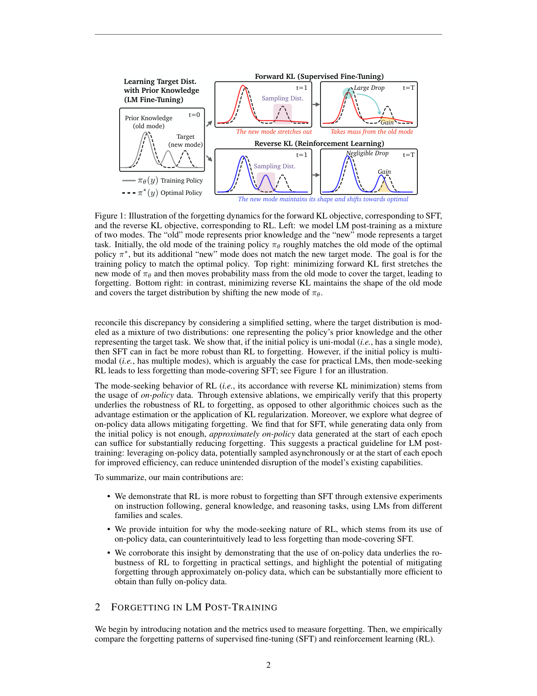
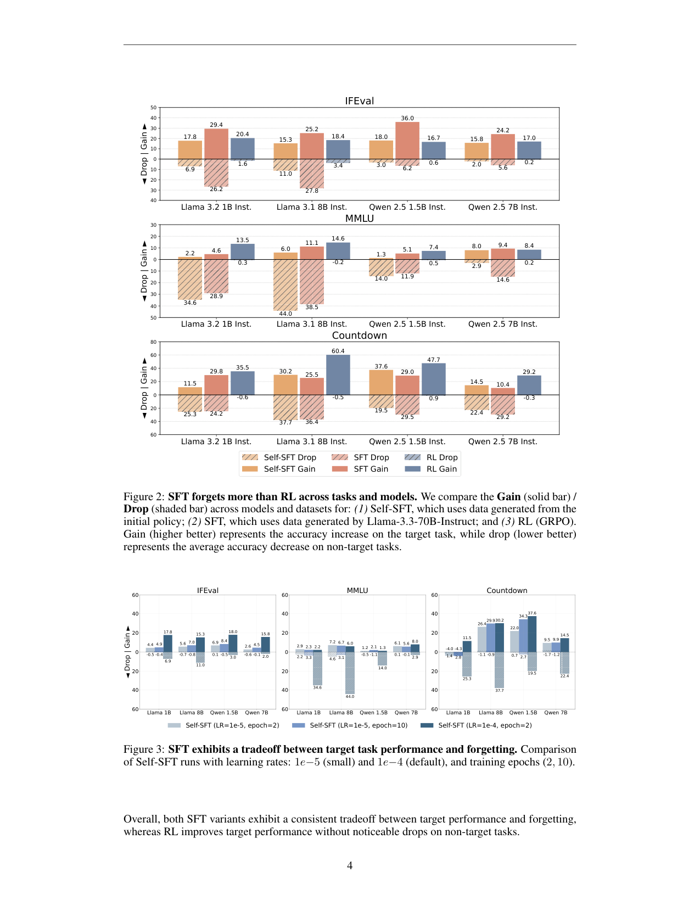

`retaining_by_doing | Retaining by Doing: The Role of On-Policy Data in Mitigating Forgetting | Princeton Language and Intelligence（Howard Chen, Noam Razin, Karthik Narasimhan, Danqi Chen） | 2025-10 arXiv:2510.18874v2(3 Dec 2025) · 预印本 | 防遗忘机理/SFT-vs-RL 主线 · 高相关（直接支撑 OPD「on-policy 蒸馏防遗忘」论点）`

> 三标注约定：【原文】=论文直述；【推断】=有据判断(附依据)；【待核】=拿不准的关键事实。

══ 第一层：一眼看懂 ══

- 🟦 **TL;DR**：同一个大模型,要它学一个新任务(指令遵循/算术推理),用两种方式——SFT(拿别的大模型/它自己的正确答案当标签去模仿)和 RL(自己生成、对了给 1 分错了给 0 分)。本文系统比较发现一个**反直觉但稳定**的结论:**RL 学新任务时"忘记旧本事"远比 SFT 少**(旧任务掉分小,新任务还学得一样好甚至更好),跨 Llama/Qwen、跨任务都成立。原因追到底**不是** RL 的 KL 正则、也**不是** GRPO 的优势估计(advantage),而是**RL 用的是"on-policy 数据"(模型自己当下生成的样本)**这一件事。更实用的发现:不必每步都重新采样(全 on-policy,贵),只要**每个 epoch 开头重采一次("近似 on-policy"/Iterative-SFT)就能基本消除遗忘**——便宜很多。【原文 摘要+§1+§4】

- **最巧的一步**:用**"双峰混合分布 + 前向/反向 KL"**这一极简玩具模型,把"为什么 mode-seeking 的 RL 反而忘得少"讲圆(§3 + 图1)。抽掉这一步,全文就只剩"RL 经验上忘得少"的现象观察,失去机理解释;而正是这个玩具揭示了关键转折:**初始策略单峰时 SFT 忘得少(符合常识),但一旦初始策略多峰(更贴近真实 LM),结论反转成 RL 忘得少**。这个"单峰→多峰反转"是整篇 reconcile 直觉与实验的枢纽。【原文 §3.2/§3.3, 图1/4/5】

══ 第二层:为什么做 ══

- **研究背景**:后训练(post-training)给 LM 加新能力时,常常侵蚀已有能力——经典的"灾难性遗忘",在 LM 上又叫"alignment tax"。SFT 和 RL 都是主流后训练手段,但"二者谁更容易引发遗忘、为什么"一直没系统答案。【原文 §1, §5】

- **解决的具体痛点**:① 实践者缺一条"想学新任务又别毁旧能力,该选哪种后训练 / 该喂什么数据"的原则性指南;② 已有并发工作(Lai et al. 2025)把 RL 少遗忘**归因于某种优势估计的隐式正则**,本文认为归因错了,要找出**真正的因**;③ 全 on-policy RL 太贵,需要知道"on-policy 到什么程度才够防遗忘"。【原文 §1, §4.1 开头, §4.2】

- **相关工作 & 各自不足**:
  - *经典防遗忘*(EWC/Kirkpatrick 2017、LwF、GEM):靠"约束参数别大改"。在海量预训练的 LM 上遗忘模式不同(不会全忘),这些方法不直接对症。【原文 §5】
  - *SFT vs RL 的差异线*:Chu et al.(SFT 记忆、RL 泛化)、Razin(RL 速度依赖 reward variance)、Wang(RL 单样本不过拟合)、Mukherjee(RL 改的子网络更小)——共同暗示"RL 的参数更新更局部/更靶向",但**没人从"遗忘"角度系统比较、也没定位到 on-policy 数据**。【原文 §5】
  - *并发工作*:Lai et al. 2025 归因于 advantage estimator 的隐式正则(本文 §4 给反例);Shenfeld et al. 2025 也指出 on-policy 好处,但用"距初始策略 KL"解释,本文发现该假设在其设置下并不总成立(附录A.5)。【原文 §5 Concurrent】
  - *forgetting-as-wrong-mode*:Kotha et al. 2024——遗忘是 LM 从混合分布里推断错了模式,选对 prompt 能恢复。本文借了它的"混合分布"视角建直觉。【原文 §5】

- **动机链**:要给指南 → 先比 SFT/RL 谁忘得少(§2 实验:RL 忘得少)→ 但这违反"reverse KL=mode-seeking 应该更容易丢旧模式"的常识 → 用双峰玩具 reconcile:**单峰时 forward KL(SFT)确实忘得少,多峰时反转**(§3)→ 多峰的 mode-seeking 来自"用 on-policy 数据" → 经验上逐一排除 KL 正则(图6)、优势估计(REINFORCE vs GRPO, 表1),坐实**on-policy 数据才是因**(§4.1)→ 全 on-policy 太贵 → 测"近似 on-policy"(每 epoch 重采的 Iterative-SFT)够不够 → 够(图7)→ 给出实用指南(§4.2)。【原文 §2-§4 逻辑链】

- **与最近邻(Lai et al. 2025 / Shenfeld et al. 2025)的 Δ**:三者都观察到"RL 比 SFT 少遗忘"。**关键差异**:Lai 归因 advantage estimator、Shenfeld 归因"距初始策略的 KL",本文**把因明确锚到"on-policy 数据本身"**,并给出可证伪的对照(去掉 KL 正则仍少忘=图6;用无 advantage 的 REINFORCE 仍少忘=表1)。**为什么这差异有用**:若因是 on-policy 数据而非 RL 特有的算法零件,那么**SFT 只要变得"近似 on-policy"也能享受防遗忘**——这是个比"必须上 RL"便宜得多的可操作结论(Iterative-SFT、甚至直接拿 RL 轨迹做 SFT 都行)。【原文 §4.1-§4.2, 附录A.4.1】

══ 第三层:怎么做 + 靠不靠谱 ══

- **方法/论证流水线(这是"分析型"论文,流水线=论证链而非系统模块)**:
  1. **实测对比(§2)**:三任务 IFEval/MMLU/Countdown 为 target;非 target 含 MATH + 两个安全集(WildJailbreak/WildGuardTest)。对每个 target 训完,测所有其它任务的掉分。比较 SFT(用 Llama-3.3-70B 生成的答案当标签)/ Self-SFT(用初始模型自己的正确答案)/ RL(GRPO,verifiable reward 0/1)。指标:target gain ∆g↑、non-target drop ∆d↓。→ 结论:RL gain 相当但 drop 显著更小(图2)。
  2. **理论直觉(§3)**:把 LM 后训练抽象成"旧模式(先验知识)+新模式(目标任务)"的双峰高斯混合。SFT=最小化 forward KL(mode-covering),RL=最小化 reverse KL(mode-seeking)。**单峰训练策略**下 forward KL 忘得少(图4,drop 0.64<0.70);**双峰训练策略**下反转——reverse KL 把"新峰"平移去贴目标、几乎不动"旧峰"(图5,reverse KL drop 0.03 vs forward 高 LR 0.12),因为 mode-seeking 不需要从旧峰搬概率质量。
  3. **归因消融(§4.1)**:GRPO 与 SFT 有三处不同——(i) on-policy 数据 (ii) KL 正则 (iii) advantage 估计。**去掉(ii)**:\(β=0\) 的 GRPO 与 \(β=0.05\) 的 drop-gain 几乎一样(图6,除 Llama+IFEval)。**去掉(iii)**:用无 advantage 的 REINFORCE,gain 落后 GRPO 但 drop 同样低(表1)。→ 排除 (ii)(iii),坐实 (i) on-policy 数据是主因。
  4. **on-policy 程度(§4.2)**:Self-SFT(只从初始策略采=最 off-policy 的"自采")仍严重遗忘;**Iterative-SFT**(每 round/epoch 开头用当前模型重采)→ target 准确率≥SFT 且几乎不忘(图7);"直接拿 RL 过程中产生的数据做 SFT"也减遗忘(附录A.4.1)。→ "近似 on-policy"够用。

- **逐组件必要性**:
  - *双峰假设*:是"反转"的命门——单峰下结论相反(图4 vs 图5 直接对照),作者明确这是 reconcile 常识与实验的关键。✔有对照(玩具实验)。
  - *KL 正则非必要*:图6 消融(\(β=0\) vs 0.05)。✔有消融。
  - *advantage 非必要*:表1 REINFORCE vs GRPO。✔有消融。
  - *"每 epoch 重采"这一频率*:图7 对比 Iterative-SFT / Self-SFT / SFT,证明频率到"每 epoch"即够。✔有对照。但**"每 epoch"是不是最优频率、再稀疏会怎样**——原文未做更细的频率扫描。【推断:依据=§4.2 只给了 epoch 级一档】

- **关键机制直觉**:核心式子是 KL-正则 RL 的最优策略 \(π^*(y|x)=Z^{-1}·π_{θ_0}(y|x)·\exp(r/β)\),由此 \(J_{RL}\) 等价于 \(−β·KL[π_θ‖π^*]\)(reverse KL)。直觉:**reverse KL(RL)从"模型自己当前会说什么"(on-policy 采样)出发去抬高得分高的回答**,它只在"模型已有概率质量的地方"重新分配,于是**新峰就地长出/平移、旧峰基本不被触碰**;而 **forward KL(SFT)被外部标签(目标峰样本)牵着走**,为了覆盖目标峰会**从旧峰搬概率质量过去**,旧峰塌缩=遗忘。一句话:on-policy 让优化"锚在自己的分布上",改动局部化。【原文 §3.1+图1】

- **实验与证据**:
  - 数据集/设置:Llama-3.2-1B/3.1-8B-Instruct、Qwen-2.5-1.5B/7B-Instruct;target=IFEval/MMLU/Countdown,non-target=MATH+两安全集;RL 用 GRPO,\(reward∈\{0,1\}\);SFT 两变体(70B 标签 / 自采正确样本);均训 2 epoch。【原文 §2.2】
  - **支撑核心主张的关键实验**:图2——RL 的 drop 普遍接近 0 甚至为负(几乎不忘),而 SFT/Self-SFT 在拿到相近 gain 时 drop 大得多。具体如 Countdown 上 Llama-8B:GRPO gain 60.4 / drop −0.5,SFT gain 25.5 / drop 36.4。MMLU 上 Llama-8B:GRPO gain 14.6 / drop −0.2,SFT gain 11.1 / drop 38.5。【原文 图2, 表1】
  - **最有说服力的对照**:表1(REINFORCE)+图6(无 KL)。它们直接砍掉两个"备择解释",把因逼到 on-policy 数据——这是全文最硬的归因证据。
  - **实用价值证据**:图7——Iterative-SFT 在 Qwen-1.5B/7B 的 IFEval/MMLU 上 target 准确率追平/超过 SFT,而相对 GRPO 的额外 drop 趋近 0;Self-SFT/SFT 则随 round 持续掉分。
  - *baseline 公平性*:同 backbone、同任务划分、SFT/RL 都用 reward 过滤只留正确样本,变量较干净。【推断:依据=§2.2 设置】
  - *"看着强但没回答核心"的隐患*:§3 是**玩具高斯模拟**,非真实 LM 上的机理证明;作者自己在 limitations 承认"理论上确立 on-policy 作用仍需后续研究"。所以"on-policy=因"是**强经验归因 + 直觉模型**,不是定理。【推断:依据=§6 limitations + §3 用单变量高斯】

- **假设与失效边界**:
  - 【原文】§3 玩具模型假设:目标分布=两个一维高斯的混合,训练策略可单峰/双峰;真实 LM 的高维多峰结构与之的差距未量化。
  - 【原文】规模上限:最大 8B、2 epoch、受限算力;"更大模型/更大数据下遗忘模式如何变"未测(§6)。
  - 【推断】结论隐含"target 与 non-target 在分布上是可分的不同峰";若新任务与旧能力高度纠缠(共享同一峰),"旧峰不动"的图景可能失效。依据=双峰可分是图1/5 的前提设定。
  - 【推断】"近似 on-policy 够用"只验到 epoch 级与"二任务、2 epoch"规模;长跑持续学习(几十轮)下近似 on-policy 是否仍守得住,未测。依据=图7 仅到个位数 round。

- **祛魅总结**:
  - **真贡献(硬货)**:(a)把"RL<SFT 遗忘"从零散观察做成**跨族跨任务的稳定经验律**;(b)**归因实验设计漂亮**——用 \(β=0\) 的 GRPO 和 REINFORCE 两个对照,干净地排除 KL 正则与 advantage,把因锁定到 on-policy 数据(并直接反驳并发工作 Lai et al.);(c)**Iterative-SFT 的实用降本结论**最接地气:不必上 RL,SFT 变近似 on-policy 即可。
  - **包装/可能高估**:§3 的"理论"其实是**一维高斯数值模拟**,"mode-seeking 因 on-policy"更像有据直觉而非证明;标题"Retaining by Doing"的"Doing"=用自己生成的数据,措辞略宏大。【推断:依据=§3 方法 + §6 自承需理论】
  - **可能低估**:对"持续学习 agent"的含义其实很重(作者在 §6 点到:从其他 agent 或互联网拿来的 off-policy 经验更危险,自己生成的 on-policy 经验更安全)——这条对"经验流式自进化 agent 怎么选数据"是强指导,但正文只一句带过,未做 agent 场景实验。【推断:依据=§6 结尾两句】

══ 结构化抽取 ══

- 🎯 **机制速览 6 轴**:

| 学什么信号 | 改什么 | 何时改 | 免梯度? | 记忆-技能生命周期 | 防遗忘机制 |
|---|---|---|---|---|---|
| 环境/可验证 reward(RL,0/1)对比 监督标签(SFT);本质对比的是**数据是否 on-policy(模型自采 vs 外部/初始)** | **参数**(全参后训练;非 prompt/记忆/logits) | **离线批量**(2 epoch 训练;Iterative-SFT=每 epoch 重采一次) | **否**(都是基于梯度的后训练;对比项是数据来源,不是免不免梯度) | 不适用(本文不涉记忆库/技能库,研究的是参数级能力的保持与遗忘) | **on-policy 数据驱动的隐式防遗忘**:reverse KL/mode-seeking 让更新锚在自身分布、改动局部化,旧峰不被搬空。**显式排除** KL 正则与 advantage 估计为防遗忘的主因(图6/表1)。【原文 §3-§4】 |

- ⑦ **开源代码 + 框架/harness**:**已开源** https://github.com/princeton-pli/retaining-by-doing 【原文 脚注1, §1】。RL 用 **GRPO**(并对比 REINFORCE);SFT 标签来自 Llama-3.3-70B-Instruct。**具体训练框架(veRL/TRL/OpenRLHF 等)正文未点名**——〔待核:需查仓库文件确认 GRPO 实现所依赖框架〕(本子代理按指令未 clone 仓库,以正文链接为准)。【原文 §2.2】

- 💰 **资源/成本与可扩展性**:规模≤8B、2 epoch,作者自述受 compute budget 限。**核心成本洞见**:全 on-policy RL 每步重采贵;**近似 on-policy(Iterative-SFT)只在每 epoch 开头采一次**,大幅降低采样开销却保住防遗忘——这是论文的"省钱"卖点。绝对算力/GPU 时数/美元成本原文未给。【原文 §4.2, §6】

- 🎯 **对"探索-巩固(探索→巩固)"idea 对标**:**强支撑(理论背书)+ 可借组件**。本文几乎是 **OPD/on-policy 蒸馏"为什么能在学新东西时不毁旧能力"的直接理论/经验背书**:on-policy 数据 → mode-seeking → 旧峰(先验/已有技能)不被搬空。对标 TSRD:
  - *支撑*:把"巩固阶段用 on-policy(模型自采)数据蒸馏"从经验上证成"防遗忘的安全选择",而 off-policy(教师强标 / 其它 agent 经验)更危险——这正契合"用 MTP foresight 引导、但回灌的训练信号要保持 on-policy"的设计直觉。
  - *可借组件*:**Iterative-SFT(每 epoch 重采)** 是一个现成、便宜的"近似 on-policy 巩固"配方,可直接用作 TSRD 巩固阶段的数据生成策略;**\(β=0\) / REINFORCE 对照** 是干净的归因实验范式,可复用于验证"是哪个零件在防遗忘"。
  - *缺口/区别*:本文只到"二任务、≤8B、2 epoch"的参数级遗忘,**没碰记忆/技能库、没碰 MTP、没碰多轮持续学习的累计漂移**;且"on-policy=因"是直觉+经验非定理。TSRD 若把"探索-巩固"做成长跑流式,还需自己验证近似 on-policy 在多轮下的稳定性。【推断:依据=§6 limitations + 项目 project_core_idea/OPD 主线】

- 🔭 **开放问题/未来方向**:
  - 【原文】把"on-policy 数据防遗忘"做**理论化**(目前只有高斯直觉);研究**更大模型/更大数据**下遗忘模式如何变化(§6)。
  - 【原文】对"持续学习/test-time training agent"的延伸:on-policy 自采经验比 off-policy(互联网/他 agent)更安全——是后续 agent 数据策略的groundwork(§6 结尾)。
  - 【推断】扫描"on-policyness"频率谱(比 epoch 更稀疏/更密)找性价比拐点;在新旧任务"纠缠"(共享峰)场景测边界;多轮持续学习下的累积遗忘。依据=图7 仅 epoch 级 + 双峰可分假设。

- 🖼 **关键图 top-2**:

  
  这是**原文 Figure 1**(机理主图):左把 LM 后训练画成"旧峰(先验)+新峰(目标)"的混合;右上 forward KL(SFT)——新峰先拉伸、再**从旧峰搬概率质量**去覆盖目标,旧峰"Large Drop"=遗忘;右下 reverse KL(RL)——新峰**保持形状直接平移**贴目标,旧峰"Negligible Drop"。选它因为一图说清全文最核心、最反直觉的机理(为什么 mode-seeking 的 RL 反而忘得少)。

  
  这是**原文 Figure 2**(主结果图):三任务面板(IFEval/MMLU/Countdown)× 四模型,实心条=target gain、阴影条=non-target drop;一眼可见 RL(GRPO)的 drop 普遍贴近 0 甚至为负,而 SFT/Self-SFT 在拿到相近 gain 时 drop 大得多。选它因为这是"RL 忘得少"这一中心论断的全部经验证据浓缩。

──────────
**幂等状态**:本文 analysis 首次产出。机制类型 = **防遗忘机理分析(参数级·基于梯度·on-policy 数据是因;非记忆/非技能库)**;附带实用配方 Iterative-SFT(近似 on-policy)。抽到 2 图:是(Figure 1 机理 + Figure 2 主结果)。
