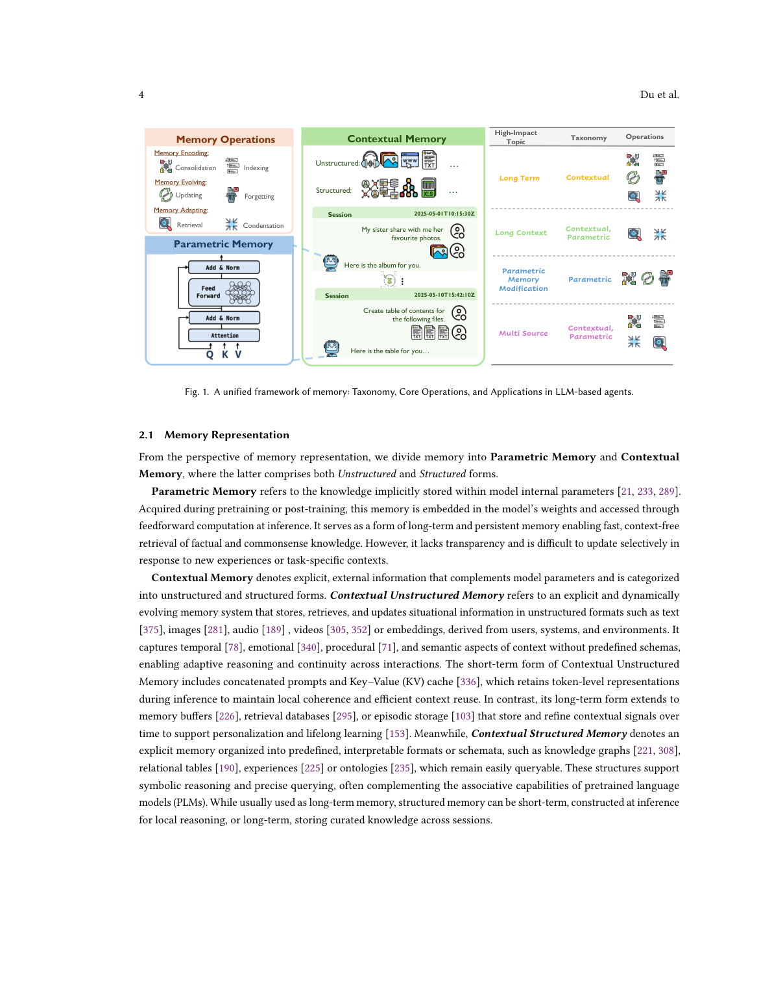
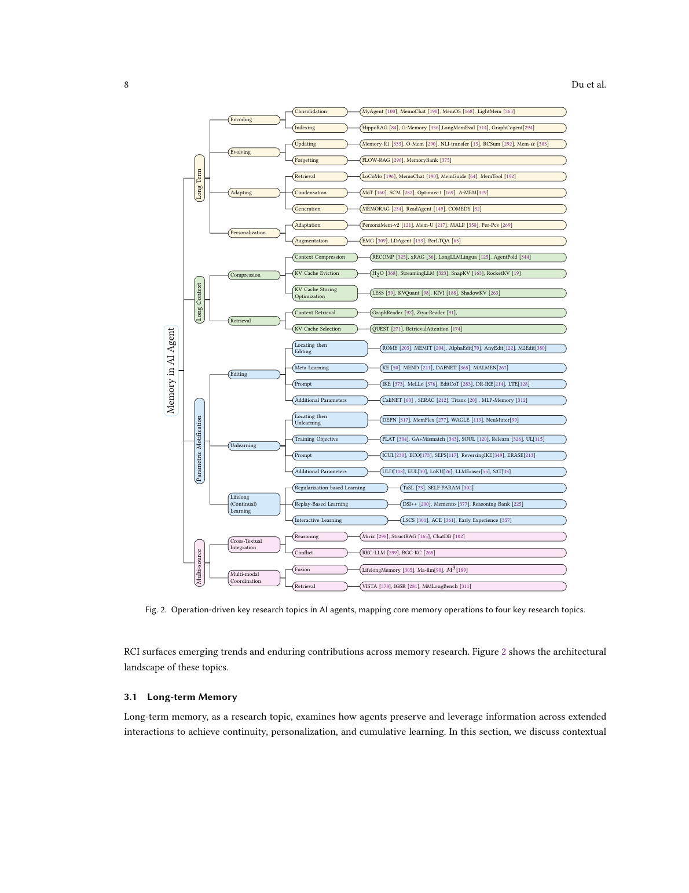

`rethinking_memory | Rethinking Memory in LLM based Agents: Representations, Operations, and Emerging Topics | CUHK + Univ. of Edinburgh + HKUST + Huawei(Yiming Du, Jeff Z. Pan, Mirella Lapata 等) | 2025-12 v3 · arXiv 2505.00675 · 综述 | 主题线 L?(综述·横切记忆全线) · 相关性 High(A 栏"六大原子操作"主来源)`

══ 第一层:一眼看懂 [light] ══
- 🟦 TL;DR:一篇 agent 记忆综述,卖点是"不只看应用,而是抽出记忆的**原子操作**"。它把记忆按**表示**分两类——parametric(知识藏在模型权重里)/ contextual(显式外部数据,又分结构化/非结构化);再定义**六个核心操作**:Consolidation(巩固)、Updating(更新)、Indexing(索引)、Forgetting(遗忘)、Retrieval(检索)、Condensation(压缩浓缩),并归到 **Encoding / Evolving / Adapting** 三大类;最后把这些维度映射出**四个研究前沿**(长期记忆 / 长上下文 / 参数化修改 / 多源记忆)。配公开 GitHub 仓(papers+tools)。
- 最巧的一步:**把记忆从"按类型/认知层(episodic/semantic…)描述"切换成"按可执行的原子操作描述"**。抽掉"六操作"这层抽象,本文就退回成又一篇"按应用罗列"的综述(作者明确批评 Zhang 2024 只有 write/manage/read 三粗操作、漏了 indexing)。正是"操作化"让它能统一对比异构系统、并把"巩固/遗忘"摆成一等公民。

══ 第二层:为什么需要这篇综述 + 它如何分类(综述适配) ══
- **领域在关心什么(背景)**:记忆是 LLM agent 的核心组件、通向 AGI 的关键一步,支撑持久交互、推理、多模态理解、个性化、多 agent 协作(§1)。但作者诊断:**现有记忆综述都偏"应用级/认知启发视角"(如个性化对话),缺少对"治理记忆动态的原子操作"的形式化**;多数只聚焦子话题(长上下文、长期记忆、个性化、知识编辑),Zhang 2024 只覆盖 write/manage/read 三个高层操作、**漏了 indexing**。这是本综述要补的 gap。
- **为什么"又一篇"(自我定位 §1, §8)**:相对 Zhang 2024 三粗操作,本文增量是——① 把记忆**表示二分**为 parametric(权重隐式)/ contextual(显式外部,structured/unstructured);② 定义**六个原子操作**并归到 Encoding/Evolving/Adapting 三类(含被前人漏掉的 indexing/condensation);③ 把六操作映射到**四大研究前沿**;④ 提供 datasets/papers/tools 的工业级清单 + 开源资源仓。区别于 Gao 2024(只覆盖 RAG 检索-生成管线)、Sumers 2024(认知架构蓝图,本文与之互补但扩到载体与操作)。
- **它如何分类 + 方法论严谨度(§1.1,综述少见的硬货)**:不是拍脑袋分类——① 先用 **37 篇 seed 论文**经专家标注+迭代讨论定义 taxonomy 与四前沿;② 再收集 2022-2025 顶会(NeurIPS/ICLR/ICML/ACL/EMNLP/NAACL)**3 万+ 论文**,用 GPT-4o-mini 按 taxonomy 对齐的任务定义做相关性打分(≥8/10 保留),得 **3923 篇高相关集**,并人工抽样验证阈值;③ 引入 **RCI(Relative Citation Index)**——log-log 回归的时间归一化引用指标(R²=0.97,新论文期望引用收敛到 0),纠正发表年龄偏差,公平比较跨年影响力。这套"语义过滤 + RCI 影响力"流程让它的"代表系统"选取比一般综述更可复现。
- **四大维度框架(§2)**:记忆 = 表示(结构形式)× 时间尺度(持续多久)× 功能类型(扮演什么认知/计算角色)× 操作(如何演化)。功能型(episodic/semantic/procedural/working)作为**互补视角**与操作框架交织——本文明确说 procedural memory "通过大规模训练或 CoT 数据的 RL 形成,驱动高效工具使用"(这点直接关联 mtp_opd 的 OPD 设想)。

══ 第三层:分类框架细节 + 局限(综述适配) ══
- **六大原子操作的形式化定义(§2.4,带公式,本综述最核心贡献)**【原文 eqs 1-6】:**Encoding**=① *Consolidation*:把 \([t,t+\Delta t]\) 的短期经历 \(E=(\varepsilon_1\ldots\varepsilon_m)\) 转成持久记忆 \(M_{t+\Delta t}=Consolidate(M_t,E)\),落地为参数/图/知识库(支撑持续学习、个性化、Memory Bank 构建);② *Indexing*:构造辅助码 \(\varphi\)(实体/属性/内容表示)作访问点 \(I_t=Index(M_t,\varphi)\),还编码时间/关系结构。**Evolving**=③ *Updating*:重激活并临时修改 \(M_{t+\Delta t}=Update(M_t,K_{t+\Delta t})\)——参数侧用 locate-and-edit,上下文侧用摘要/剪枝/refine;④ *Forgetting*:选择性抑制 \(F\),\(M_{t+\Delta t}=Forget(M_t,F)\)——参数侧用 unlearning,上下文侧用时间删除/语义过滤;作者特别提示遗忘/更新**引入安全风险**(攻击者可投毒、坏记忆碎片潜伏后触发恶意行为)。**Adapting**=⑤ *Retrieval*:\(sim(Q,m)\geq\tau\) 取相关记忆(Q 可跨模态/跨源,含参数侧检索);⑥ *Condensation*:推理时按压缩比 \(\alpha\) 留要点弃冗余,分 pre-input(无检索的长上下文压缩)与 post-retrieval(检索后压缩,含把知识整合进参数)——**明确区别于 consolidation**(后者在构建期摘要,condensation 在推理期减量)。
- **从操作到四大前沿的映射(§3,系统/数据落地)**【原文 Fig1+§3 列表】:① **Long-Term(temporal)**——Encoding(HippoRAG/G-Memory/MemOS/LightMem)、Evolving(Memory-R1/O-Mem/Mem-α)、Adapting(LoCoMo/MemTool/A-MEM/MemoRAG)+ 个性化(PersonaMem/MALP);② **Long-Context(contextual)**——Context Compression(RECOMP/xRAG/LongLLMLingua)、KV Cache Eviction(H2O/StreamingLLM/SnapKV)、KV 存储优化(KVQuant/KIVI);③ **Parametric Modification(model-internal)**——Editing(ROME/MEMIT/AlphaEdit,locate-then-edit / meta-learning / prompt / 额外参数四范式)、Unlearning(DEPN/MemFlex,同样四范式)、Lifelong/Continual learning;④ **Multi-Source(cross-source)**——异构文本 + 多模态整合。每格都挂了代表论文,构成"操作×前沿"的可反查文献版图。
- **人脑对照 + 未来方向(§5-§6,与"探索-巩固"idea 最相关的硬货)**:作者用 **CLS(互补学习系统)**点题——海马快编码 episodic、皮层慢整合 stable 长期记忆,启发 AI 的 dual-memory/synaptic consolidation/experience replay 抗遗忘;引 **K-Line Theory** 说层级记忆结构是认知根本(婴儿把 apple/banana 归入 fruit/food)。未来方向里**多条直接对标 mtp_opd**:(a) **Parametric Sharing**——把记忆作 model-native 表示(动态 adapter / 专用记忆层)在 latent 空间交换,绕过文本"瓶颈",探索标准化神经记忆协议 + 跨模型权重对齐以"merge 内化经验";(b) **Lifelong Learning**——从离散任务转向实时环境流,极端数据稀疏下用 meta-learning 优化"memory value function"自主判定"solidification value(固化价值)"做选择性内化,用 evolving LoRA/embedding 解耦个人轨迹与通用知识;(c) Procedural Tool Memory——工具用内化为可复用技能(点名 ReAct/MCP/Anthropic Claude skills 为 procedural memory);(d) Parametric Memory Retrieval、Unified Memory Representation(统一参数+外部记忆的表示空间与联合索引)、Spatio-temporal Memory、Memory Threats & Safety。
- **局限与祛魅**【推断,除标注外】:① **综述无原创实验**——统计/趋势图来自 RCI 引用计数与他文转引(如 Fig 关于 CounterFact/ZsRE 编辑 SOTA、最大连续编辑数);六操作的"正交性"在真实系统会**耦合**(如 update 与 forget 难截然分、consolidation 与 condensation 边界靠作者人为划定);② 团队规模与可信度较高(CUHK + Edinburgh + HKUST + Huawei,含 Mirella Lapata / Jeff Z. Pan 等资深作者,v3 2025-12,方法论透明可复现),但**2026 上半年新工作未覆盖**(截止 2025);③ "表示二分(parametric/contextual)足以覆盖"是简化假设,多模态具身记忆作者自承仍处早期。**真贡献(硬货)**:把记忆"操作化"为六个带形式化定义的原子操作 + 表示二分 + 四前沿映射,且**把 Consolidation 列为六操作之首、把 Condensation 称为"通向 self-improving/lifelong agent 的关键一步"**——对本调研是**最强术语供给 + 直接对标**(A 栏六操作即本篇为主来源;parametric/contextual 并置正契合 mtp_opd "外部记忆 + 固化进参数(OPD)"双线;"memory value function / solidification value / evolving LoRA"几乎是为 TSRD/OPD 量身的未来方向)。

🎯 **机制速览 6 轴** [light]\(综述论文;填它**归纳的设计空间**,即 A 栏记忆操作分类真值)
| 维度 | 内容(本文归纳) |
|---|---|
| 学什么信号 | 不限定;contextual 侧来自交互/外部观测/对话,parametric 侧来自训练/编辑/CoT-RL 形成的 procedural |
| 改什么 | **两种记忆表示**:parametric(权重内,经编辑/unlearning/持续学习改)+ contextual(外部文本/向量/图/表/轨迹) |
| 何时改 | 跨时间尺度:short-term(kv-cache/当前对话)+ long-term(多会话/外部库);编码/演化离线或在线均可 |
| 免梯度? | **混合**:contextual 操作多免梯度;parametric memory modification(model editing/unlearning/continual learning)需改权重 |
| 记忆-技能生命周期 | **六操作即完整生命周期**:Consolidation+Indexing(编码写入)→ Updating+Forgetting(演化)→ Retrieval+Condensation(适配读取)→ grounded generation |
| 防遗忘机制 | Forgetting 被定义为**主动操作**(区别于认知心理学的被动衰减);并把 continual learning / sequential editing 抗遗忘列为前沿(Fig8:多数编辑法可承受的连续编辑数有限) |

**A 栏 · 记忆操作分类(本文权威 taxonomy,供全景汇总抽取 —— 本篇是该分类的主来源)**:
- **表示二分**:Parametric memory(权重隐式)/ Contextual memory(显式外部:structured=图/表/轨迹,unstructured=文本/向量/音视频)。
- **六大原子操作(三类)**【原文 §3,定义均见正文】:
  · **Encoding(编码)**=① *Consolidation 巩固*:把短期 context 稳定成长期记忆;② *Indexing 索引*:组织记忆以便检索(三范式:graph-based 如 HippoRAG / 其他)。
  · **Evolving(演化)**=③ *Updating 更新*:重激活并修改已有记忆、整合新知、剪枝过时(分 intrinsic/extrinsic);④ *Forgetting 遗忘*:主动移除已巩固的过时/错误内容。
  · **Adapting(适配)**=⑤ *Retrieval 检索*:取相关记忆;⑥ *Condensation 浓缩*:推理时把检索到的原始长记忆转成结构化紧凑 context(可跨源/跨模态),作者称其为"通向自改进、终身学习 agent 的关键一步"。
- **功能型视角(互补)**:Episodic / Semantic / Procedural / Working 四类。
- **四大前沿**:Long-Term(时间)/ Long-Context(上下文,含 KV-cache 驱逐+压缩)/ Parametric Modification(model editing·unlearning·continual learning)/ Multi-Source(多源·多模态)。

- 🎯 **对"探索-巩固"idea 对标** [light]:**最强术语供给 + 直接对标**。本文把"Consolidation(巩固)"列为六操作之首并独立定义("把短期 context 稳定为长期记忆"),把"Condensation"称为通往 self-improving/lifelong agent 的关键——与我们"探索→巩固"主线几乎同构;且明确把 parametric 与 contextual 巩固并置,正契合 mtp_opd 既想用外部记忆又想固化进参数(OPD)的双线设想。可借:六操作清单可作 idea 的"操作字典",逐项检查我们的方法覆盖/缺哪几个操作。

- 假设与失效边界(一句)【推断】:核心假设"记忆可被无歧义拆成六个正交原子操作、且 parametric/contextual 二分足以覆盖"。失效边界——综述**无原创实验**(统计/趋势图来自 RCI 引用计数与他文转引,如 Fig10 CounterFact/ZsRE SOTA、Fig8 最大连续编辑数);六操作的"正交性"在真实系统里会耦合(如 update 与 forget 难分);时间为 2025-12 v3,2026 上半年新工作未覆盖。属"分类框架"贡献,落地需自行补实现。

🖼 **关键图 top-2** [light]

· 这是**原文 Fig. 1**:左列六大记忆操作(Encoding/Evolving/Adapting 三组),中列 Contextual vs Parametric 两种表示,右列映射到长期/长上下文/参数修改/多源四类应用。选它因为这一张图就是全文骨架,把"表示×操作×应用"三轴一次呈清——本篇最核心的概念贡献。

· 这是**原文 Fig. 2**:把六个核心记忆操作逐一连到四大研究主题及其代表论文集群。选它因为它把抽象操作落到具体文献版图,便于在全景调研里按"操作"反查相关工作。

⑦ 开源代码 + 框架/harness:**配套资源已开源**——https://github.com/Elvin-Yiming-Du/Survey_Memory_in_AI(datasets / papers / tools 列表,综述性资源仓,非训练框架;本笔记未 clone)。
