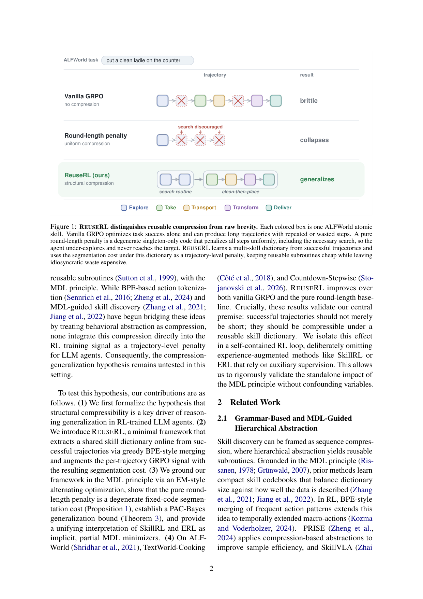

`reuserl_compress | Skill Reuse as Compression in Agentic RL (REUSERL) | Arizona State Univ. + UPenn + USC (Zhikun Xu, Yu Feng, Jacob Dineen, Taiwei Shi, Jieyu Zhao, Ben Zhou) | 2026-05 · arXiv:2605.31509v1 [cs.LG] | L3(技能/RL 正则)· Med`

> 档位:deep(三层精读 + 完整结构化抽取)。基于 PDF 正文(18 页,含方法/理论/实验/消融/附录实现)。

══ 第一层:一眼看懂 ══
- 🟦 **TL;DR**:用 RL 训 Agent 时,它常学到**脆的、一次性的"奇技淫巧"**(任务能过但不迁移,即 reasoning collapse)。本文假设:**能泛化的成功行为 = 结构上可压缩的行为**(能拆成少量可复用抽象模式)。于是把技能发现当**序列压缩(MDL/最小描述长度)**:从成功轨迹**在线**抽一个**共享技能字典**(贪心 BPE 式合并频繁动作模式),再给 GRPO 的每条轨迹加一个 **segmentation cost(分段代价)惩罚项**——"用字典编码得差/特异"的行为变贵,可复用子程序保持便宜。在 ALFWorld / TextWorld-Cooking / Countdown-Stepwise 上,in-/out-of-distribution 成功率都超 vanilla GRPO 和 round-length(纯长度惩罚)基线。
- **最巧的一步**:**把"奖励应鼓励可复用结构"这个直觉精确成"在字典 C 下编码成功轨迹所需的最少 phrase 数(segmentation cost)"作为轨迹级 RL 惩罚**(§3)。抽掉这个"用共享字典做 MDL 压缩、而非用原始长度"的核心,方法就退化成纯长度惩罚——而论文恰好用 **Proposition 1** 证明"纯 round-length 惩罚 = 退化的单例固定码 segmentation cost"(它会一刀切惩罚所有步、连必要的探索也砍,导致 under-explore 崩溃)。可压缩 ≠ 短,正是其与长度基线的本质区别。

══ 第二层:为什么做(写透) ══
- **研究背景**:【原文 §1+§2】LLM agent 在交互任务上靠"自然语言推理 + 环境交互"取得进展,RL(尤其多轮 agentic GRPO 变体:Search-R1/GiGPO/SkillRL/ERL)成为训练主范式。但有个持久难题:**RL 训练常固化脆的行为捷径**(reasoning collapse)——长时间优化会**放大记忆化的动作模式、牺牲可迁移推理**。
- **解决的具体痛点**:【原文 §1】作者**不主张** collapse 只有单一成因,而是**隔离出一个能形式化也能干预的结构因子**:只奖励任务成功,会**允许特异、一次性的解题模式**(过了训练任务但迁移差)。关键澄清:难点**不是"策略形成捷径"**(紧凑重复的解题模式对泛化是好事),**而是"它也形成特异捷径"**——完成训练任务却不组合成可复用技能。现有方法(teacher distillation/reflection loop/外部 memory)能缓解,但**说不清到底是学到的行为的哪个共享结构属性带来增益**。
- **相关工作 & 各自不足**:【原文 §2】摆在三条线旁——(1) **基于语法/MDL 的分层抽象**(MDL skills、Learning options via compression、PRISE、SkillVLA、PAC state abstraction):把行为抽象当压缩学紧凑技能码本,但都是**离线准则**,**没人把压缩直接做进 RL 训练信号当轨迹级惩罚**;(2) **技能巩固 & 经验增强推理**(ERL/SkillRL/RAGEN/DYSTIL/Reflexion/ExpEL/Voyager):靠环境反馈/检索经验自改进,但**放任累积自生轨迹会触发 reasoning collapse**——这正是 REUSERL 要用"显式压缩可复用结构作正则"去治的(且不依赖 teacher/检索/辅助模块);(3) **信息论策略压缩**(LAPO、lazy length penalty、conditional info bottleneck):在 **token/length 层**塑形推理(惩罚原始推理长度);REUSERL 在 **行为层**操作——压缩成功技能序列的**结构**而非表面长度。
- **动机链**:现状(RL agent 靠 success-only reward 训,易 reasoning collapse)→ 缺陷(success-only 允许特异一次性捷径,且现有缓解法说不清哪个结构属性起作用)→ 假设(成功且可泛化的行为 = 可压缩的行为,即能由少量可复用模式组合)→ 所以必须**把 MDL 压缩做成轨迹级 RL 惩罚**,显式奖励"在共享字典下编码便宜"的成功轨迹。为什么不用更简单的现成做法(纯长度惩罚)?——【原文 §3.4 Proposition 1】纯 round-length **正是** segmentation cost 在"单例字典"下的退化情形,它一刀切惩罚所有步(包括必要的 search),**无法区分原始长度相同但可复用结构不同的序列**;TextWorld-Cooking 上纯长度惩罚甚至**比 vanilla GRPO 还差 10.94 点**(掉进"照菜谱字面 cook 已熟食材→烧糊"的脆捷径),实证了"可压缩 ≠ 短"。
- **与最近邻工作的 Δ**:最像 **SkillRL / ERL**(同为"训练中用技能/经验改进 agent RL")。论文专门用 §3.6 + 附录 B 把二者**统一解释为"隐式/部分 MDL 最小化器"**:SkillRL 用 teacher 蒸馏构层级技能库 = 隐式压缩字典项 Lskill_dict,但**不惩罚每条轨迹的分段复杂度**(策略仍可任意复杂地组合检索来的技能),且其库只允许增不压缩;ERL 把"反思+修正"两段码内化进权重 = 真正的描述长度最小化,但是**实例级**(每个反思只管一个 episode,不抓跨轨迹共享结构)。REUSERL 的 Δ:**显式最小化完整 batch 级 MDL 目标(同时搜紧凑共享码本 + 激励成功轨迹间可复用组合)**。为什么有用?——它给"为什么这些方法有效"提供了**统一的信息论解释**,并把效果**单变量隔离**出来(刻意不引 SkillRL/ERL 的辅助监督,确保测的是 MDL 本身)。

══ 第三层:怎么做 + 靠不靠谱 ══
- **方法流水线**(§3,EM 式交替):**① Skill projection φ**(规则化:按原始动作动词映到小的环境相关原子技能字母表 Σ,如 EXPLORE/TAKE/TRANSFORM/DELIVER;ALFWorld 5 个、TW-Cooking 10 个、Countdown 26 个技能)→ **② E-step 字典提取**(对成功轨迹组 B+,用贪心 BPE 合并频繁相邻 phrase 对,只在合并严格降低 batch MDL 目标 LBDL 时接受,phrase 长度上限 L=4;用一个 FIFO **global success buffer**(256 条)稳定小 batch 的字典估计)→ **③ 算 segmentation cost**(`SegCost(s|C)=seg(s,C)/T`,seg=动态规划求的最少覆盖 phrase 数)→ **④ M-step GRPO 更新**(增广目标:`R(τ) − λ·1{R(τ)=1}·SegCost`,指示函数把惩罚**只加在成功轨迹**上,绝不打击任务完成;λ=10)。E/M 交替迭代降低成功行为的联合描述长度。
- **逐组件必要性(有消融 §6 + 案例 §7)**:
  · **共享字典 / 非单例 phrase(核心)**:Proposition 1 + Table 1 共同证明——去掉就退化成纯 round-length,TW-Cooking 上从 81.73 掉到 64.03(还低于 GRPO 的 74.97)。
  · **global success buffer(§6.2 有正反消融,很诚实)**:**有时有益**(成功轨迹在单 batch 太稀疏/太杂时,ALFWorld SC@7 从 93.57/89.55→97.14/93.28,Countdown 从 68.94→80.37);**有时有害**(被简单游戏的多数类 macro 主导时,TW-Cooking 去掉 buffer 反而从 81.73→83.50,全靠 hard split 9.0%→18.5%——持久 buffer 过度代表简单 macro、剪掉了 hard recipe 需要的 cut-and-cook 交织结构)。
  · **贪心 BPE 近似(§6.1)**:LBDL 精确最小化是 NP-hard,贪心在合成语料上**逼近 brute-force 最优到 0.14%、回收 99.02% 非单例 phrase、快 285×/2231×**——证明可与每步 GRPO 同跑且代价低。
  · **指示函数(只惩罚成功)**:保证信号不打击任务完成(无单独消融,属设计性约束)。
- **关键机制/公式直觉**:核心是 **两段码 MDL**(公式 2/3):字典成本 `Lskill_dict(C)=Σ(|pj|log2 KΣ + log2 L)`(存 M 个 phrase 的代价)+ 数据成本(平均每条成功轨迹用 `seg·log2|C|` 比特编码)。固定字典后,**唯一随单条轨迹变化的只有条件 segmentation cost**,所以它就是该挂到 RL 信号上的量。直觉:**一条拆成几个长可复用 phrase 的轨迹 seg≪T(便宜),一条全是不相关单例的轨迹 seg=|s|≈T(最贵)**——于是策略被推向"成功且结构可复用"的行为。**理论保证**:Theorem 3 给 PAC-Bayes 界(用 `P(C)∝2^−Lskill_dict(C)` 当先验,归一化损失∈[0,1]),证明"若提取的字典紧压了观测成功 batch,其在同分布未来成功轨迹上的期望描述长度被形式化 bound";Corollary(Prop 4)把 B⋆/K⋆(字典复杂度/每轨迹段数上界)翻译成显式 out-of-sample 界。**作者诚实**:Theorem 3 **只 bound 固定策略分布下的期望描述长度,不刻画迭代 RL 后的策略泛化**,故"它单独不证明 per-trajectory 惩罚是泛化正则",只 justify "用经验 MDL 当结构可复用性的可靠度量"。
- **实验与证据**:三个文本 agentic benchmark——**ALFWorld**(家居,只 timeout 失败,SC@7,IID 140/OOD 134 scene)、**TextWorld-Cooking**(菜谱,有烧糊等不可逆失败,Pass@1×3 seed,1000 instance,4:1 simple-hard)、**Countdown-Stepwise**(算术规划,有 ROLLBACK/RESET,Pass@1×3 seed,1024 instance)。base model 1.5–1.7B(Qwen2.5-1.5B-Instruct / Qwen3-1.7B non-thinking),GRPO 训 300 步。**支撑核心主张的关键实验 + 具体数字(Table 1)**:严格序 **REUSERL-SegCost ≻ pure-round-length ≻ Vanilla GRPO** 在每个 benchmark 成立(唯一例外:TW-Cooking 上 pure-round-length 跌破 GRPO,正是 Proposition 1 预测的"原始长度≠结构");REUSERL vs pure-round-length:ALFWorld IID/OOD **+0.71/+1.49%**、TW-Cooking **+17.70%**、Countdown **+3.35%**;REUSERL 绝对值 97.14/93.28(ALFWorld)、81.73(TW)、80.37(Countdown),vanilla GRPO 仅 84.29/79.85、74.97、68.46。**最强证据是 OOD/组合迁移**(ALFWorld OOD + TW/Countdown held-out 上增益最大)。**机制级证据(Table 2,step 300 行为统计)**:ALFWorld 成功轨迹长度 GRPO 15.3 步→REUSERL ~9 步、invalid 23.5%→1.8%、repeat 40.4%→14.4%;TW-Cooking burned 失败 pure-len 74% vs SegCost 仅 3.3%;Countdown REUSERL 独家扩大 MUL/DIV 用量(学到多步 solver 模板)。**baseline 公平性**:同 GRPO 设置、同 harness;pure-round-length 是 Proposition 1 定义的"REUSERL 退化情形",是最直接公平的对照。**值得注意**:增益在 ALFWorld IID 上很小(+0.71%,已近饱和 96→97);真正大头在 TW-Cooking(+17.70%),靠的是避开烧糊陷阱而非泛化能力本身。
- **假设与失效边界**:【原文+推断】**核心假设(原文显式)"成功且可泛化的行为 = 可压缩的行为"**;**Assumption 2(原文)**:成功技能序列分布存在共享可复用分解(字典复杂度有界 B⋆ + 每轨迹段数有界 K⋆)。**失效边界(原文 §限制)**:(i) φ 是规则化 per-environment 映射,迁新域需少量人工 schema 设计;(ii) 贪心 BPE 是 NP-hard 的近似,**|Σ| 越大近似 gap 越大**;(iii) 依赖 Assumption 2——**在无结构/纯新颖推理域(成功轨迹共享子结构少)会失效,segmentation cost 退化成 round-length 惩罚**;(iv) 实验仅限文本 benchmark + 1.5–1.7B 模型,VLM/大模型留待未来。【推断】隐式假设技能投影 φ 这个规则化、小字母表的离散抽象足以捕捉有意义结构——当关键差异落在 φ 抹掉的低层动作细节里、或动作空间无法良定义离散 skill 字母表时该假设失效。
- **祛魅总结**:【推断】**真贡献(硬货)**:(1) **理论侧最强**——把"巩固可复用结构→涨泛化"用 MDL/PAC-Bayes 形式化,且 Proposition 1 干净地证明"长度惩罚是退化的压缩"、附录 B 把 SkillRL/ERL 统一成隐式 MDL 最小化器,这套统一视角有解释力;(2) **单变量隔离做得严谨**(刻意不引辅助监督,只比退化形 pure-round-length);(3) Table 2 的机制级证据(invalid/repeat/burned 比例)比单看成功率更有说服力。**包装/营销面**:(1) "across three benchmarks 都超 GRPO"成立,但**最大增益(TW +17.70%)主要来自避开一个具体陷阱(烧糊),而非展示更广的泛化能力**——ALFWorld IID 仅 +0.71%;(2) "minimal framework"是真的(λ、L=4、buffer 256 等少量超参),但 **φ 需手工设计每环境技能字母表**,迁移成本被轻描淡写(作者列为限制,但 abstract 不提);(3) 理论很漂亮,但作者**自己澄清 Theorem 3 不直接证明 per-trajectory 惩罚是泛化正则**(只 bound 固定策略的描述长度),这点诚实但也意味着"压缩→泛化"的因果在理论上**未完全闭合**,主要靠实证支撑。作者整体**未高估**——限制与理论边界都明说。

══ 结构化抽取(供全景汇总) ══
- 🎯 **机制速览 6 轴**:
  | 学什么信号 | 改什么 | 何时改 | 免梯度? | 记忆-技能生命周期 | 防遗忘机制 |
  |---|---|---|---|---|---|
  | 环境二值终端 reward(成功/失败)+ **成功轨迹的可压缩性**(MDL 编码代价)作为附加结构信号 | **模型参数(策略 πθ,GRPO 更新)**;同时在线维护一个外置**技能字典 C**(BPE 式合并) | **在线、训练中**(EM 式交替:更新字典 ↔ 更新策略;per-trajectory 惩罚) | **否**(标准 GRPO 梯度训练 + 附加惩罚) | 写入(从成功组 B+ 贪心合并出字典 phrase,长度≤L=4)→ 用作分段编码计 cost → 反馈进 RL 信号;字典随训练在线更新(global FIFO buffer 256 稳定);**无显式遗忘/淘汰机制**(EM 交替隐式重估,buffer 满则 FIFO 挤出) | **无显式机制**;但"压缩惩罚"本身抑制 idiosyncratic shortcut → 间接缓解 reasoning collapse(可视作泛化正则,非防参数遗忘) |

- ⑦ 开源代码 + 框架/harness:**承诺开源未必已上线**——【原文】脚注"We will release all code and data under an open-source license upon publication"〔待核:发表时才放,当前可能无 repo〕。harness/框架:**GRPO,基于 verl-agent(Feng et al. 2025)on top of verl(Sheng et al. 2025,即 HybridFlow)**〔已核:附录 D 明确点名 verl-agent + verl,先前"未指明 RL 框架"的待核已消除〕;skill-projection 规则 + BPE 搜索是 CPU-only 内联进 GRPO loop;推理引擎 vLLM。**自研 RL loop**(刻意"self-contained",不引 SkillRL/ERL 等辅助监督以隔离 MDL 单变量效应)。
- 💰 资源/成本与可扩展性:**部分**——训练在 **Nvidia RTX Pro 6000 96GB + tensor parallelism**;GRPO 300 步;base 仅 1.5–1.7B;BPE/φ 是 CPU 内联、global buffer 256 序列,作者称"minimal framework"、贪心 BPE 比 brute-force 快 285×/2231× 故可与每步 GRPO 同跑。具体总卡时/美元未给。可扩展性瓶颈(原文限制):φ 需手工设计、|Σ| 大时 BPE 近似变差、未验证大模型/VLM。
- 🎯 **对"探索-巩固"idea 对标**:**支撑 + 可借组件(理论侧最强)**。它从信息论给"为什么巩固可复用结构能涨泛化"提供 MDL/PAC-Bayes 论证,并把 SkillRL、ERL 统一解释为"隐式/部分 MDL 最小化器"——这正是 TSRD"巩固"那一极的理论靠山。可借:**segmentation cost 作为轨迹级正则**,惩罚"不可复用的特异行为",可迁移到 MTP/OPD 的训练目标里,鼓励学到可复用 path 模式;**EM 式"在线抽字典↔更新策略"交替**也是一个可借的巩固骨架。属支撑(它是参数训练、与 forward-hard/backward-soft 同为训练侧机制)。
- 🔭 开放问题/未来方向:【原文 §限制】(i) 让 φ 自动化/可学(去掉手工 schema);(ii) 大 |Σ| 域的更好字典搜索启发式;(iii) 放宽 Assumption 2 / 处理无结构推理域;(iv) 扩到 VLM agent 与更大 backbone。【推断】最关键缺口是**把"压缩→泛化"的因果在理论上闭合**(当前 Theorem 3 只 bound 固定策略描述长度,不含迭代 RL 后的策略泛化),以及**让字典与策略的内化边界自适应**(对接 TSRD 的"何时把外置结构巩固进参数")。
- 🖼 **关键图 top-1**(保留原选):

这是**原文 Figure 1**(动机/核心对比图,该页)。一个 ALFWorld 任务("把干净 ladle 放台面")三种行为对比:**Vanilla GRPO**(无压缩→长而重复→脆)、**Round-length penalty**(均匀压缩→连必要搜索都被砍→under-explore 崩溃)、**REUSERL**(结构压缩→学出 search 例程 + clean-then-place→泛化)。底部用彩色原子技能(Explore/Take/Transport/Transform/Deliver)标注。选它因为它一图说尽全文论点:**可复用 ≠ 短**,字典压缩与纯长度惩罚的本质差异。
*(注:本篇只取 1 张主图;其余为理论命题(Prop 1/Thm 3)与结果表(Table 1/2),无更优图。)*
