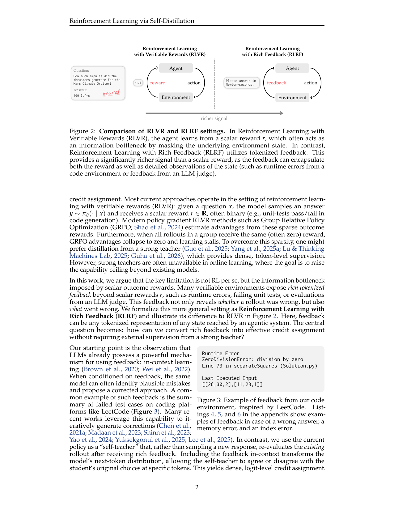
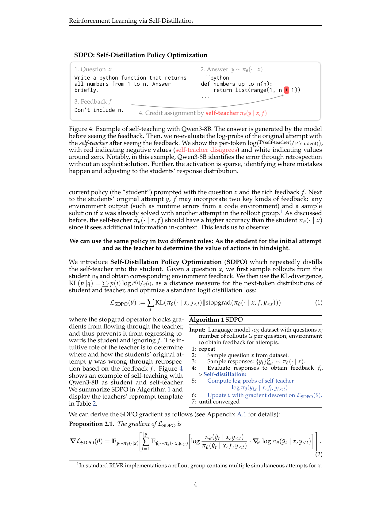

`rl_self_distillation | Reinforcement Learning via Self-Distillation (SDPO: Self-Distillation Policy Optimization) | ETH Zürich + MPI-IS + MIT + Stanford；Jonas Hübotter / Andreas Krause 等(lasgroup) | arXiv 2601.20802 v2 (2026-02-16)，cs.LG | L?·On-Policy 自蒸馏/RLVR 线·**极高相关**（on-policy 自蒸馏、logit 级信号、与项目 OPD 直接同族）`

> 档位：**deep**（全字段三层 + 结构化抽取）。所有内容基于已下载 PDF 正文（_txt_rl_self_distillation.txt，正文 ~12 页 + 大量附录）。**最该对标 TSRD/MTP+OPD 的两篇之一。**

══ 第一层：一眼看懂 [light] ══

- 🟦 **TL;DR**：RLVR(可验证奖励 RL,如 GRPO)每次只拿到一个标量对/错奖励⇒信用分配瓶颈(不知哪个 token 错)。但很多可验证环境其实给了**富文本反馈**(runtime error、失败测试、judge 评语)。SDPO 的核心:把**"当前模型 + 把反馈塞进上下文"当作 self-teacher(自老师)**,让它**重新评估原 rollout 的逐 token 概率**,再把这个"看过反馈后的 next-token 分布"**蒸馏回策略**——\(L_SDPO = Σ_t KL( π(·|x,y<t) ‖ stopgrad·π(·|x,f,y<t) )\)。无需外部强老师、无额外采样(只重算 logprob),把富反馈变成稠密 logit 级信号。标量环境也能用:把同组成功 rollout 当失败尝试的"反馈"。

- **最巧的一步**：抽掉 **stopgrad(在 self-teacher 上停梯度)** 整个方法就垮——若不停梯度,teacher 会回退去迎合 student、忽略反馈 f,自蒸馏退化成自我强化的平凡解。stopgrad 强制 teacher 保持"已看反馈"的优势分布,梯度只更新 student 去逼近它。这正是**前向硬(用条件分布)/反向软(梯度只流 student)**的解耦结构。

══ 第二层：为什么做（写透，重点） ══

- **研究背景**：LLM 后训练越来越多用 RL,尤其在 code/math 这类**可验证域**。深度 RL 历史表明"行动→收反馈→更新策略"的迭代能解锁静态监督学不到的能力。【原文 §1】

- **解决的具体痛点**：**RLVR 被标量 outcome reward 的信用分配瓶颈卡住**。给定问题 x,模型采 y∼πθ,只收一个标量 r(常二值,如单测过/不过)。GRPO 从这种稀疏 outcome reward 估优势,**当一组 rollout 全同奖励(常为0)时优势塌成0、学习停滞**。想用强 teacher 蒸馏(稠密 token 监督)?但**在线学习里强 teacher 常不可得**(目标本就是把能力上限推到现有模型之上)。**关键洞察:瓶颈不是 RL 本身,而是标量 reward 的信息瓶颈**——很多可验证环境其实暴露了**富 tokenized 反馈**(runtime error/失败单测/LLM judge 评语),不仅告诉你"错了"还告诉你"错在哪"。中心问题:**如何把富反馈转成有效信用分配,而不需要外部强 teacher 的监督?**【原文 §1】

- **相关工作 & 各自不足**(表1 是最精炼的定位)：
  | 方法 | on-policy? | 富信号? | 不需强 teacher? |
  |---|---|---|---|
  | SFT/Distillation | ✗ off-policy | ✓ rich | ✗ 需强 teacher |
  | On-Policy Distillation | ✓ | ✓ rich | ✗ 需强 teacher |
  | RLVR(GRPO) | ✓ | ✗ weak(标量) | ✓(环境) |
  | **SDPO(本文)** | ✓ | ✓ rich | ✓(环境) |
  - **传统蒸馏/On-Policy Distillation**：有稠密 token 监督,但**都需要一个更强的外部 teacher**——在线学习里没有。
  - **RLVR(GRPO)**：on-policy 且用环境信号,但**只有标量弱信号**,信用分配差。
  - **迭代纠错(Self-Refine/Reflexion/TextGrad)**：也用 in-context 反馈,但它们是**采样一个新回答**;SDPO 不采新样,而是用当前 policy 当 self-teacher **重新评估已有 rollout 的 logprob**。【原文 §1 + §6】

- **动机链**：现状(RLVR 是主流,但标量奖励信用分配差) → 缺陷(全同奖励→优势塌0、稀疏;强 teacher 蒸馏稠密但在线无强 teacher) → **关键重构:很多可验证环境有富文本反馈(runtime error 等),把问题从 RLVR 重定义为 RLRF(RL with Rich Feedback)** → 但怎么把富文本变成可优化的稠密信号、还不需外部 teacher? → **观察:LLM 已有 in-context learning——把反馈塞进上下文,同一模型能回溯识别自己的错** → **所以用"当前 policy + 反馈条件"当 self-teacher,重算原 rollout 的 next-token 分布,KL 蒸回 student** → teacher 会迎合 student? → **所以 stopgrad 隔离 teacher**。为什么不用 SFT on teacher successes(off-policy 蒸馏)?表5 证明它在 LCBv6 显著不如 SDPO 且遗忘更重(off-policy 模仿不稳)。【原文 §1+§2+§4.4】

- **与最近邻工作的 Δ**：
  - **vs On-Policy Distillation(Agarwal 2024)**：同是 on-policy + logit 蒸馏,但 OPD **需要外部强 teacher**;SDPO 关键 Δ 是**用 self-teacher(同模型+反馈条件)替代强 teacher**——填了"在线无强 teacher"的缺口(表1)。
  - **vs GRPO**：GRPO 优势是 rollout 内恒定标量(A=r−mean{r});SDPO 优势是 **logit 级、逐 token、仅在 student/teacher 不一致处非零**(A^SDPO=log[π(·|x,f,y<t)/π(·|x,y<t)])。SDPO 是 GRPO 的两点扩展:1-bit 反馈→任意 token 序列反馈、标量优势→稠密 logit 优势。
  - **vs Self-Refine/Reflexion(迭代纠错)**：它们**采样新回答**;SDPO **不采新样,只重算原 rollout 的 logprob**(零采样开销),把反馈变成对原尝试逐 token 的信用分配。

══ 第三层：怎么做 + 靠不靠谱 ══

- **方法流水线**(Alg.1 + 图2/4)：输入 LLM πθ、问题数据集、每题 G 个 rollout、环境(给反馈) →
  ① **采样**:从 student πθ(·|x) 采 G 个回答 {y_i}。
  ② **取反馈**:评估回答得环境反馈 f_i(runtime error/失败单测/judge);若该题在 rollout 组里已被另一尝试解出,把那个成功解也作为反馈(reprompt 模板 Table 2:"Correct solution: …" + "feedback from your unsuccessful attempt: …")。
  ③ **self-teacher 重评**:计算 self-teacher 的 logprob log πθ(y_{i,t}|x, f_i, y_{i,<t})——**不采新样,只重算原 rollout 在"已看反馈"上下文下的逐 token 概率**。
  ④ **蒸馏更新**:对 LSDPO=Σ_t KL(πθ(·|x,y<t) ‖ stopgrad·πθ(·|x,f,y<t)) 做梯度下降(Prop 2.1 给出梯度;**stopgrad 阻断 teacher 梯度**)。
  实现上**只需把现有 RLVR pipeline 的 advantage 换成 SDPO advantage**;用 top-K 蒸馏(K=100)近似 KL 避免显存爆;用**正则 teacher**(EMA 或与初始 teacher 插值)+ **对称 JS 散度**稳训练。
  输出:能把富反馈内化、稠密自我纠错的策略。

- **逐组件必要性**(消融充分)：
  - **stopgrad**：方法定义性。无它 teacher 会回退迎合 student、忽略反馈(§2 明确)。
  - **logit 级 dense credit assignment**：**有消融**(图10左,LCBv6)。logit-level(top-100)> token-level(top-1)> sequence-level(平均成标量,如GRPO)。**关键发现:即便 sequence-level SDPO 也超 GRPO**——说明"利用富反馈(RLRF)"与"稠密信用分配"是**两个互补**的增益来源。
  - **self-teacher 在线更新(非冻结)**：**有消融**(图10右 + 表4)。self-teacher 随训练改进,**student 最终超过初始 teacher 准确率**(真·bootstrapping,弱→强不被初始 teacher 限制);trust-region/EMA teacher > 冻结初始 teacher > 无正则(后者发散)。
  - **正则 teacher(EMA/trust-region)+ JS 散度**：**有消融**(表4)。无正则 teacher 显著欠拟合(最终发散);但 SDPO 即便用冻结 teacher 也 work。
  - **SDPO vs off-policy SFT-on-teacher**：**有对比**(表5)。SFT-on-self-teacher 在 LCBv6 显著不如 SDPO(42.7 vs 48.8)且遗忘更重——印证 on-policy 蒸馏优于 off-policy 模仿。
  - **SDPO+GRPO 混合**:λ 加权两种优势(式3,图11)。弱模型(Qwen3-0.6B)上混合更稳(GRPO 优势补救不可靠的 SDPO 优势),强模型上 SDPO 单用略优。

- **关键机制/公式直觉**：
  - **self-teacher = 同模型 + 反馈条件**:直觉是"我答完看到错误反馈后,回头看自己的答案能指出哪里错"。πθ(·|x,f) 因看到额外信息(反馈)应比 πθ(·|x) 更准——把这个"看过反馈的我"当老师。
  - **KL + stopgrad(式1)**:直觉是"让 student 的 next-token 分布去逼近 self-teacher 看过反馈后的分布",stopgrad 保证 teacher 不被拉回迎合 student。**SDPO 优势 A^SDPO=log[P_teacher/P_student]**:teacher 更同意的 token 优势为正、更不同意的为负,**只在不一致处非零**(图4/9:激活稀疏,精准定位错误 token)。这是**前向硬(用 teacher 条件分布)/反向软(梯度只流 student)** 的解耦——与项目 MEMORY 记的 forward-hard/backward-soft 签名同构。
  - **零采样开销**:不像 Self-Refine 采新回答,SDPO 只重算原 rollout 的 logprob(图5:仅 +5.8%~17.1% 时间,可并行)。
  - **学会简洁推理(§3.3)**:SDPO 响应平均短 3×(Chemistry 上 11×),因稠密信用分配给每个 token 精准优势→避免 GRPO 那种"Hmm/Wait"填充与循环推理(图7)。**"refining how it reasons, not how long"**。

- **实验与证据**：
  - **数据集/设置**：三场景。**§3 无富反馈**(标量环境,用同组成功 rollout 当反馈):SciKnowEval L3(化学/物理/生物/材料)+ ToolAlpaca 工具调用,Qwen3-8B/Olmo3-7B-Instruct,4×GH200,avg@16。**§4 富反馈**:LiveCodeBench v6(131 题,LeetCode 式 public/private 单测),Qwen3 系。**§5 test-time**:对单题在线自蒸馏。用 **verl 库**多 GPU 训练。【原文 §3.1/§4/§5】
  - **核心主张证据**：(1) **§3 无富反馈**:SDPO 70.2% vs GRPO 66.6%(aggregate),且 Olmo3 Chemistry **50 分钟达 GRPO 5 小时精度=6× 加速**,5h 精度高 10+ 点,响应短 11×(图6);(2) **§4 富反馈**(图1,核心):LCBv6 **SDPO 48.8% vs GRPO 41.2%**,且 4× 更少 generation 达 GRPO 终点,**超过 Claude Sonnet 4(40.5%)/Opus 4(39.7%)**;(3) **§4.1 随模型规模增益增大**(图8):大模型 SDPO 显著超 GRPO、小模型(Qwen3-0.6B/Qwen2.5-1.5B)仅持平或反而不如——self-teaching 是**随规模涌现**的能力;(4) **§4.4 防遗忘**(表5):SDPO 在 holdout(IFEval/ArenaHard/MMLU-Pro)上 performance-forgetting tradeoff 最优;(5) **§5 test-time**:对 base pass@64<0.03 的难题,SDPO 加速发现解 **3×**。
  - **baseline 公平性**：GRPO 基线是**强化版**(含 asymmetric clipping/避免 biased normalization/off-policy 修正),还单列 on-policy GRPO 匹配 SDPO 超参;充分超参 sweep。**对比相当公平且诚实**(off-policy GRPO 多步 vs SDPO 单步)。
  - **"看着强但需警惕"的点**：(1) **增益强依赖模型规模**——弱模型(Qwen2.5-1.5B/Qwen3-0.6B)上 SDPO **反而不如 GRPO**(作者诚实报告),因弱模型 in-context 回溯不准、self-teacher 不可靠;(2) **仅 code/math/tool 可验证域**;(3) **当前只 on-policy 单步**(off-policy 多步留作 future,可能进一步提效);(4) self-teacher 的"优势"本质上**对真目标 J(θ) 有偏**(§4.5,类比 bootstrapped vs Monte Carlo),靠 in-context 准确性兜底。

- **假设与失效边界**：
  - 【原文 §4.1 Takeaway 2】**核心假设:self-teacher 看过反馈后准确率 > student**(强模型才是好 in-context learner)——**SDPO 增益随规模涌现,弱模型上反而不如 GRPO**(Qwen2.5-1.5B 实测)。
  - 【原文 §4.5】**SDPO 优势对真目标有偏**(从富反馈+self-teacher 算,非无偏 Monte Carlo);弱模型上需混 GRPO 优势(SDPO+GRPO)稳住。
  - 【推断,依据实验域】**仅 code/math/tool 可验证域验证**(有 runtime error/单测/judge 这类富反馈或可验证奖励);**反馈与错误无因果关联、或模型据反馈仍辨不出错时退化**。
  - 【原文 §2.3】**需正则 teacher(EMA/trust-region)+ JS 散度稳训练**,无正则会发散。

- **祛魅总结**：
  - **真贡献(硬货)**：(1) **RLVR→RLRF 的问题重构** + **self-teacher(同模型+反馈条件)替代外部强 teacher** 是真正新颖且优雅的——填了"在线自蒸馏无强 teacher"的缺口(表1 定位清晰);(2) **logit 级 KL+stopgrad** 把富反馈变成稠密信用分配,且**消融证明"富反馈"与"稠密信用分配"是两个独立互补的增益**(图10:sequence-level 也超 GRPO);(3) **self-teacher 在线 bootstrapping**(student 超过初始 teacher,图10右)是 weak→strong 的硬证据;(4) **零采样开销**(只重算 logprob)+ **可最小改动套进现有 RLVR pipeline**(只换 advantage);(5) 防遗忘(表5)、学简洁推理(§3.3 短 11×)、test-time 3× 加速都有据。【推断】
  - **包装/营销成分**：(1) **增益强依赖模型规模**——作者诚实报告弱模型上 SDPO **反而不如 GRPO**(Qwen2.5-1.5B),所以"无需强 teacher"其实换成了"需要足够强的 base 模型做好的 in-context 回溯者";(2) 仅 code/math/tool 可验证域;(3) self-teacher 优势对真目标**有偏**,弱模型要靠混 GRPO 救;(4) "超过 Claude Sonnet 4"是在 LCBv6 这个特定子集、训练后的对比。【推断】总体**包装克制、营销成分低**,是一篇硬核且诚实的工作。
  - 作者**非常诚实**:主动报告弱模型上的失败、优势的偏性、只 on-policy 单步的局限,且消融把"富反馈 vs 稠密信用分配"的贡献拆得很干净。【推断】

══ 结构化抽取（供全景汇总，必填） ══

- 🎯 **机制速览 6 轴** [light]：

| 轴 | 内容 |
|---|---|
| 学什么信号 | **环境富文本反馈 f(runtime error/失败测试/judge 评语)** → 经 self-teacher 转成 logit 级稠密目标;标量环境则用同组成功 rollout 当隐式反馈 |
| 改什么 | **参数**(策略权重;policy-gradient 算法,advantage 由 self-teacher 估计,可最小改动套进现有 RLVR pipeline——只换 advantage) |
| 何时改 | **在线 per-batch**(采 rollout→取反馈→KL 蒸馏更新,严格 on-policy 单步);另有 **test-time 版**(对单题在线自蒸馏,§5) |
| 免梯度? | **否**——梯度更新策略;但 self-teacher 是同一冻结快照(stopgrad)、**无额外采样开销**(只重算 logprob,+5.8~17%时间) |
| 记忆-技能生命周期 | **无外部记忆库**;"记忆"=反馈的 in-context 利用(瞬态);self-teacher 即 student 自身在反馈条件下的另一角色,随训练更新(EMA/trust-region) |
| 防遗忘机制 | **KL 投影/隔离 + on-policy 性质**:loss 本身是向 self-teacher 分布的 KL,stopgrad 隔离 teacher⇒防 teacher 漂移;§4.4 表5 实证 on-policy SDPO 比 off-policy SFT 遗忘更少(performance-forgetting tradeoff 最优) |

- ⑦ **开源代码 + 框架/harness**：**开源**，https://github.com/lasgroup/SDPO 。**框架明确:基于 verl 库(Sheng et al. 2025)多 GPU 训练**;SDPO 实现为"在 RLVR/GRPO pipeline 里把 advantage 换成 self-teacher 估计的 logit 级优势";top-K(K=100)蒸馏近似 KL;正则 teacher(EMA/trust-region)+ JS 散度。模型 Qwen3-8B/Olmo3-7B/Qwen2.5/Qwen3 系。【原文 标题页 + §3.1 + §2.3】
- 💰 **资源/成本与可扩展性**：4×NVIDIA GH200/run,每 run≈6 小时(含初始化+验证);**计算开销仅比 GRPO +5.8%~17.1%**(只多 self-teacher 重算 logprob,可并行,图5);top-K 蒸馏避免显存爆。**样本效率显著高于 GRPO**(4-6× 加速达同精度),且响应短 3-11× 进一步省推理。【原文 §2.2 + §3.1 + 表3】

- 🎯 **对"探索-巩固"idea 对标** [light]：**强支撑 + 可借核心组件（最该对标）**。这是与项目 OPD 最同族的一篇——**on-policy 自蒸馏 + stopgrad 前向硬/反向软**正是 MEMORY 里记的"forward-hard/backward-soft 解耦"签名(teacher 用条件分布=前向硬,梯度只流 student=反向软);Table 1 明确把 SDPO 定位为"on-policy + rich signal + 无外部 teacher",填了 OPD 在线缺强老师的缺口。可直接迁移的积木:①**self-teacher=同模型+反馈条件,免额外采样**(只重算 logprob);②**logit 级 KL+stopgrad 把"前瞻/反馈信息"灌成稠密信号**——与 MTP 当"前瞻探针"高度可组合(把"反馈条件"换成"MTP 前瞻条件"即得前瞻版自蒸馏);③**self-teacher 在线 bootstrapping**(student 超初始 teacher)给"巩固阶段无需固定强老师"提供范式;④**"富反馈 vs 稠密信用分配"两增益可拆**(图10)提示 MTP 前瞻信号即便只做 sequence-level 也可能有增益。**弱模型反而不如 GRPO** 是重要警示:自蒸馏的"探索-巩固"收益依赖 base 的 in-context 能力。

- 🔭 **开放问题/未来方向**：
  - 【原文】SDPO 的 off-policy 多步扩展(已给 PPO-style clipped IS,附录A.4);更强模型(>Qwen3-8B)上的 self-teaching 涌现;SDPO+GRPO 混合的最优配比。
  - 【推断】把"反馈条件 self-teacher"换成"MTP 前瞻条件 self-teacher";扩到非可验证开放域(如何构造富反馈);弱模型上如何让 self-teacher 仍可靠(混 GRPO 之外的方案)。

- 🖼 **关键图 top-2** [light]：
  
  这是**原文 Fig.2(设定对比图)**:左 RLVR 只回标量 r(信息瓶颈、掩盖环境状态),右 RLRF 用 tokenized 反馈(含 runtime error 等)给远富信号。选它因为它一图讲清本文的问题重构(RLVR→RLRF),是动机基石。
  > 注:本图所在 PDF 页同时含 Fig.3(LeetCode 式反馈样例);主选 Fig.2。
  
  这是**原文 Fig.4(自老师信用分配)**:Qwen3-8B 在看到反馈"Don't include n"后,对原答案逐 token 算 log(P_teacher/P_student),红=老师不同意(定位错误 token),且**激活稀疏**——只在出错处调整。选它因为它直观证明"模型能回溯性自我纠错、且信号稀疏精准",是 SDPO 机制的可视化证据(对应 forward-hard/backward-soft 的稀疏优势)。
