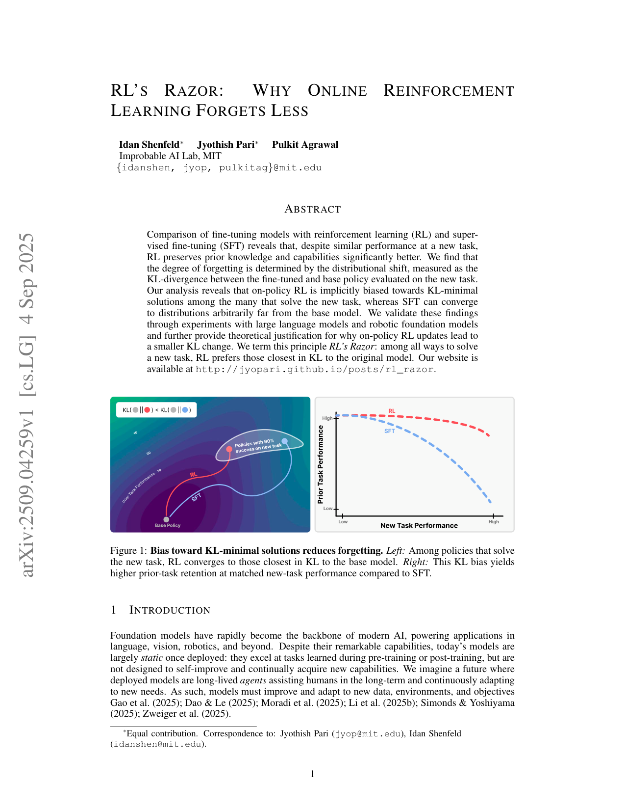
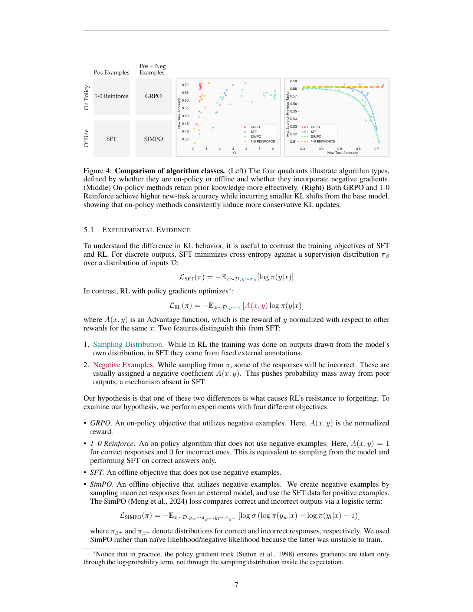

`rls_razor | RL's Razor: Why Online Reinforcement Learning Forgets Less | MIT Improbable AI Lab（Idan Shenfeld∗ / Jyothish Pari∗ / Pulkit Agrawal；SDFT 的同组前作） | 2025-09（arXiv:2509.04259 v1，4 Sep 2025，Preprint） | L5 巩固·on-policy 少遗忘机理（理论基石） | 相关性 High（PLAN 指定"巩固机制的理论基石"）`

> 【档位】deep 全档。基于下载的真实 PDF 正文（23 页，主体 §1–§7 + 附录 A 理论/B 实验细节/C 表征分析）。三标注：【原文】直接来自论文 /【推断】我的有据判断（附依据）/【待核】拿不准的关键事实。
> ⚠️ 本篇是「on-policy 为何少遗忘」的机理总论，按子代理指令对"探索-巩固 idea 对标"栏重点写透；与同组 `sdft_selfdistill`（把本文机理工程化、无需 reward）互为姊妹篇，交叉引用见对标栏。

---

## ══ 第一层：一眼看懂 ══

- 🟦 **TL;DR**：【原文】同一个基座模型,用 SFT 和用 RL（GRPO）各去学同一个新任务,**即使新任务学得一样好**,RL 对"旧能力"的破坏远小于 SFT（Fig 2 的 Pareto 前沿,RL 那条线几乎贴着旧任务满分走,SFT 那条线学新任务必须以掉旧任务为代价）。作者要解释"为什么"。结论分两层:① **经验遗忘律**——遗忘多少,可以只用一个量预测,即"微调后模型 π 相对基座 π0、在**新任务输入**上的前向 KL 散度" \(E_{x∼τ}[KL(π0‖π)]\)(注意只需新任务数据,不需要旧任务数据,可在训练中实时测量);② **RL's Razor(剃刀原理)**——在所有能解新任务的解里,on-policy RL 天然偏好"离基座最近(KL 最小)"的那个,而 SFT 会被标签拽到任意远的解。理论上证明:二元奖励下的策略梯度 = "拒绝采样(I-投影)+ 策略梯度(M-投影)"交替的 EM 过程,收敛到**可表示族内 KL 最小的最优策略**。验证:构造一个解析上 KL 最小的"oracle SFT 分布",在它上面做 SFT 遗忘比 RL 还少——证明 RL 的优势不来自算法本身,而来自它隐式逼近 KL 最小解。

- **最巧的一步**：【原文+推断】**把"遗忘"这个看似要靠旧任务数据才能衡量的量,换成只用新任务分布就能测的前向 KL**(§4、经验律)。**抽掉它**整篇就垮:没有这个"可测、可优化、且跨算法统一"的预测量,SFT vs RL 的差异就只能停留在现象描述,无法归因。为什么是它——【原文】§6 系统消融了所有竞品预测量(权重变化 L1/Fisher-L2/谱范数、表征漂移、更新稀疏性/秩、TV、reverse-KL、L2),在 ParityMNIST 上前向 KL 的二次拟合 R²=0.96,碾压一切其它变量(Table 1:reverse-KL 0.93、TV 0.80、Fisher-L2 0.58、权重-L1 0.34);其中"更新稀疏性"被证明是 **bfloat16 假象**(改 float32 后稀疏性消失但性能不变),直接否掉了 Mukherjee et al. 2025 的"RL 更新稀疏所以少遗忘"假说。【推断】这一步的巧在于"换了一个可观测、可干预的代理变量",把因果问题从不可测(旧任务无穷)变成可测(新任务 KL)。

---

## ══ 第二层：为什么做（写透） ══

- **研究背景**：【原文】基础模型部署后基本是静态的:擅长预训练/后训练学过的任务,但不会自我改进、持续获取新能力(§1)。作者设想"长寿命 agent"——部署后持续适应新数据/环境/目标(引 Self-Adapting LMs / SEAL 等同组工作)。实现这一愿景的核心拦路虎就是**灾难性遗忘**:学新任务时丢旧能力(§2)。
- **解决的具体痛点**：【原文】① 既有防遗忘法(EWC 约束权重、LwF 保特征、KL 正则约束输出)都"治标不治本"——它们针对遗忘的**效应**下手,没回答"到底什么决定了遗忘""为什么不同算法差这么多"(§1、§2)。② 有人提"遗忘由旧任务上的分布漂移决定",但**旧任务集在基础模型里浩瀚甚至无界,根本没法测**(§1),所以这个量没有实用价值。③ SFT 与 RL 的对比此前都只比"新任务性能",**没人系统研究过二者对灾难性遗忘的相对易感性**(§2"SFT versus RL")。
- **相关工作 & 各自不足**（§2）：
  - **防遗忘启发式族**(EWC/MAS/SI 约束权重;LwF/iCaRL 保特征/输出)——【原文】有效但是治标的启发式;且 EWC 本身可被看作 KL 最小化的近似(Chaudhry 2018),本文把这点收编进统一框架。
  - **RL 中的 KL 正则**(Stiennon 2020/Ouyang 2022)——【原文】实践者早发现 RLHF 里加 KL 正则能稳训练/防 reward hacking,也"顺带"减遗忘;本文的贡献是证明 **KL 不只是有用的启发,而是遗忘的可靠预测量**。
  - **最接近的并发工作 Lai et al. 2025**(arXiv:2507.05386,"RL 自然缓解持续后训练的遗忘")——【原文】也报告"RL 比 SFT 少遗忘",但把原因**归于"从负例学习"**;本文 §5 的实验**直接反驳**:on-policy 才是关键,负梯度不是(见下消融)。这是本文与最近邻的核心 Δ。
- **动机链**：现状(部署模型不会持续学)→ 灾难性遗忘是拦路虎,而既有解释要么治标、要么需不可测的旧任务分布 → 经验观察到 SFT/RL 在同等新任务性能下遗忘差异巨大(Fig 2)→ 必须找一个**可测、跨算法统一**的预测量来归因 → 系统消融后锁定"新任务上的前向 KL"→ 进一步追问"为何 on-policy 天然 KL 小",用信息几何(I/M 投影 = EM)给出理论(§5.2)→ 用 oracle SFT 反证"是分布不是算法"(§4)。【推断】"为什么不用更简单的现成做法"——最简单的是直接给 RL 加显式 KL 正则,但作者要回答的是更基础的"为何**不加正则的纯 RL** 也少遗忘",从而揭示 on-policy 的**隐式**偏好,这是比"加正则"更深一层的机理。
- **与最近邻工作的 Δ**：
  - **vs Lai et al. 2025**：同结论("RL 少遗忘")、不同归因。Lai 归因"负例";本文用 **1-0 Reinforce(on-policy 但无负梯度)≈ GRPO** 且 **SimPO(offline 但有负梯度)≈ SFT** 的双向对照(Fig 4),证明分水岭是 **on-policy vs offline**,不是有无负梯度。【推断】这个"四象限"消融是全文最干净的因果切割。
  - **vs Mukherjee et al. 2025**（"RL 更新稀疏")：本文证明所谓稀疏是 bfloat16 尾数截断的数值假象,float32 下稀疏消失而性能不变(§6),否掉该假说。

---

## ══ 第三层：怎么做 + 靠不靠谱 ══

- **方法流水线**（注意:本文**不提出新算法**,而是"发现规律 + 给理论",流程是"实验设计 → 归因 → 理论 → 反证",§3–§6）：
  1. **现象确立(§3)**：同一组 prompt,一组用 SFT、一组用 GRPO(二元成功奖励,**不加 KL 正则**)训练;在新任务(Math/Science Q&A/Tool Use/机器人抓取)和一批无关旧 benchmark(MMLU/HellaSwag/TruthfulQA/IFEval/Winogrande/HumanEval 等)上各扫几十组超参,画"新任务 acc × 旧任务 acc"的 **Pareto 前沿**。结果(Fig 2):RL 的前沿几乎水平(学新不掉旧),SFT 的前沿陡降(学新必掉旧),Math 上尤甚。
  2. **找预测量(§4)**：设计可跑到收敛的玩具任务 **ParityMNIST**(MNIST 改判奇偶,多个输出分布都对 → 模拟"多解任务"这一生成式任务的本质),与 FashionMNIST 联合预训练 MLP,只在 ParityMNIST 上微调、在 FashionMNIST 上量遗忘。把遗忘对各候选量作图,**只有前向 KL 把 RL 和 SFT 的点收到同一条曲线上**(Fig 3 中,R²=0.96),证明"遗忘由 KL 决定,与算法无关"。
  3. **oracle 反证(§4)**：ParityMNIST 任务简单到可**解析求出**"100% 正确且 KL 最小"的标注分布 q*(闭式,见 Eq. 附录 B.3);在 q* 上做 SFT,遗忘**比 RL 还少**(Fig 3 左)→ 证明 RL 不是因为算法特殊,而是因为它隐式逼近了 q*。补充:用 RL 模型生成数据再 SFT(蒸馏),也复现 RL 的 trade-off(Fig 9)→ 再证"学到的分布"而非"优化器"决定遗忘。
  4. **归因 on-policy(§5)**：四象限消融(Fig 4)——GRPO(on-policy+负梯度)/ 1-0 Reinforce(on-policy 无负梯度,等价于"采样自己的输出、只对正确的做 SFT")/ SFT(offline 无负梯度)/ SimPO(offline+负梯度)。结果:on-policy 两者 KL 小、少遗忘;offline 两者 KL 大、多遗忘 → **on-policy 是因**。
  5. **理论(§5.2 + 附录 A)**：见下"关键机制"。
- **逐组件必要性**：
  - **前向 KL 作为预测量**：有消融(§6 Table 1,9 个竞品全列),且 reverse-KL/TV 也有信号但都弱于 forward-KL → 必要性被强证。
  - **ParityMNIST 玩具设定**：负责"可跑到收敛 + 可解析求 oracle",大模型 RL 太贵跑不到收敛(§4 明说)→ 没它就无法做 oracle 反证。【推断】代价是结论的外推性依赖"玩具规律=大模型规律"的假设(作者用 LLM 上 R²=0.71 的弱拟合做了部分桥接,Fig 11)。
  - **四象限对照(Fig 4)**：负责切割"on-policy vs 负梯度"两个混淆因素 → 没它无法反驳 Lai 的负例假说。
  - **oracle SFT**：负责把因果钉死在"分布"上 → 没它,"RL 隐式 KL 最小"只是相关而非因果。
- **关键机制/公式（直觉,不复述符号）**：
  - **经验律**:\(遗忘 ≈ f(E_{x∼τ}[KL(π0‖π)])\),f 是单调凸函数(二次拟合好)。直觉:模型在新任务上越是"改变了自己说话的分布",对旧能力的连带破坏越大;而这个改变量**只看新任务输入**就能测,不需要碰旧任务。
  - **RL = I-投影 + M-投影的 EM(Lemma A.1/A.2 + Thm A.3)**:这是全文理论命门。① 从当前策略 π 采样、只保留奖励=1 的样本(**拒绝采样**),得到的条件分布 π(·|S) 恰好是"在'解对'约束下离 π 最近(KL 最小)"的分布——即 π 到最优集的 **I-投影**(信息投影)。② 策略梯度那一步(梯度只穿过 log π、不穿采样分布)等价于把上面这个目标分布 q **M-投影**(矩投影)回可表示的神经网络策略族。③ 二者交替 = 带信息投影的 EM,在 e-/m-flat 几何下由 Pythagorean 恒等式保证**收敛到 \(π† = argmin_{π∈P*∩Π} KL(π‖π0)\)**(可表示族内 KL 最小的最优策略,Thm 5.2 / Prop A.4)。直觉:RL 每一步都"先在自己已经觉得可能的输出里挑对的(I-投影,天然贴近自己),再把策略往那挪一点(M-投影)",所以永远在 π0 附近的低 KL 区域爬;而 SFT 是直接拿外部标签分布做 M-投影,标签可以在任意远处,所以会被拽走。
  - **GRPO/PPO 的 advantage 不破坏该结论**(附录 A"Practical considerations"):用 advantage A 代替 raw reward R 是控制变量(control variate),只降方差不改期望梯度方向,投影解释仍成立。
- **实验与证据**（§3–§6）：
  - **数据/设置**：基座 Qwen2.5-3B-Instruct;新任务 = Math(Open-Reasoner-Zero)/Science Q&A(SciKnowEval Chem L-3)/Tool Use(ToolAlpaca);机器人 = OpenVLA-7B 在 SimplerEnv 抓罐子。RL 用 GRPO(Dr.GRPO loss,group size 64,**KL reg=0**),SFT 的 CoT 标注由 DeepSeek-R1(Math,16 采样取对)/GPT-4o(Science)蒸馏得到。玩具 = 3 层 MLP on ParityMNIST+FashionMNIST。
  - **支撑核心主张的关键实验**:(a) **Fig 2** Pareto 前沿——RL 学新不掉旧、SFT 掉旧,跨 4 个域一致,是"现象"的硬证据。(b) **Fig 3 + Table 1**——前向 KL R²=0.96 且把 RL/SFT 点收到同一曲线,是"经验律"的核心证据。(c) **oracle SFT 比 RL 还少遗忘**(Fig 3 左)——是"分布决定论"的关键反证,逻辑上最致命。(d) **Fig 4 四象限**——是"on-policy 是因"的因果切割。
  - **baseline 公平吗**：【推断】总体公平。同基座、同 prompt、对每种方法都做几十组超参扫并取 Pareto 前沿(§3.1、附录 B.1 Table 2 给了完整超参网格),避免了"挑一个点比"的不公;1-0 Reinforce 与 GRPO 的对照刻意只差"有无负梯度"一个变量,设计干净。【待核】Math 的 SFT 标注用 R1 蒸馏(96% 覆盖),Science 用 GPT-4o(100%)——SFT 数据质量受教师模型影响,作者未做"SFT 教师质量 → 遗忘"的敏感性分析(但 oracle/distill 实验已部分覆盖此关切)。
  - **"看着强但没答核心问题"的隐患**：【推断】(a) 大模型上前向 KL 的拟合只有 R²=0.71(Fig 11),远弱于玩具的 0.96,作者归因为"近似 KL/acc 估计的噪声、残差均值为零",但**这意味着在真实 LLM 尺度,KL 是强相关而非铁律**,外推需谨慎;(b) 全部新任务都是"多解"任务(Parity 故意如此、生成式任务天然多解),**单解/强约束任务(标签唯一)下 RL 的 KL 自由度被压缩,剃刀效应是否还在,未测**。
- **假设与失效边界**：
  - 【原文】理论收敛(Prop A.4)的前提:**二元奖励** + 最优集 P* 非空且可实现(Π∩P*≠∅) + Π 为 e-flat 指数族。作者**自己声明**(附录 A practical considerations):神经网络诱导的 Π **一般不是 e-flat**,可能阻止精确收敛到 KL 最小解——"定理只提供对实践中观察到的偏好的**原理性解释**,非精确保证"。这是作者难得诚实标出的失效边界。
  - 【原文】§7 自陈三大未解:① **缺乏机理解释**——为何"新任务上更大的 KL 漂移"会破坏旧知识(表征干扰?隐式容量上限?未知);② 只在中等规模 LLM + 玩具上验证,**前沿尺度/更多生成域的行为未知**;③ **未研究 online 但 off-policy 的算法**(实践中很常见)。
  - 【推断】隐式假设:遗忘可由"单一标量(新任务 KL)"充分预测——这在多解任务成立度高,在任务间共享表征强耦合时可能漏掉"哪部分旧能力被动"的结构信息(KL 是聚合量,不告诉你动了哪个旧技能)。
- **祛魅总结**：
  - **真贡献(硬货)**：① **经验遗忘律**(遗忘 ∝ 新任务前向 KL)——一个可测、可优化、跨算法统一的预测量,且用 9 个竞品消融把它钉死,这是真正的概念贡献;② **RL=I/M 投影 EM** 的信息几何刻画,把"on-policy 少遗忘"从经验上升到可证明的隐式 KL 最小化(Thm 5.2),理论干净;③ **oracle SFT 反超 RL** 的反证设计极其有力——直接证明"是分布不是算法",并顺势指出"SFT 若被导向 KL 最小分布可以超过 RL",为后续方法(如同组 SDFT)指明方向。
  - **包装/可能高估**【推断】：(a) 标题"RL's Razor"听起来像普适定律,但理论严格成立仅在二元奖励 + e-flat 族的理想设定,真实 LLM 上是 R²=0.71 的强相关;(b) "forgetting law"一词偏强——它是**强预测关系而非机理定律**,作者 §7 自己承认不知道 KL 漂移**为何**导致遗忘,故"律"更多是工程意义上的可预测性;(c) 全文是"分析/解释"论文,**不给可直接用的新训练算法**(改进留给读者/后续 SDFT),实用价值是"指出设计轴"而非"给出方法"。

---

## ══ 结构化抽取 ══

### 🎯 机制速览 6 轴
| 维度 | 内容 |
|---|---|
| **学什么信号** | 环境/任务的**二元成功奖励**(RL 侧,GRPO,reward∈{0,1});SFT 侧为外部标注分布。本文核心是**对比**两种信号源如何影响遗忘,而非提出新信号 |
| **改什么** | **模型参数**(全参微调权重);本文不改 prompt/记忆,聚焦"参数级后训练"两种范式(SFT vs RL)对旧能力的破坏 |
| **何时改** | **离线批量**(标准后训练,跑到几十组超参的 Pareto 前沿);非 test-time、非 per-step |
| **免梯度?** | **否**(两种范式都是梯度更新;本文研究的正是"梯度更新时谁更少遗忘") |
| **记忆-技能生命周期** | 不适用(本文无记忆库/技能库;它研究的是"权重里的旧知识"如何被新任务覆盖,生命周期=预训练写入→微调时被部分擦除) |
| **防遗忘机制** | **KL 投影(隐式)**——核心结论即"on-policy RL 隐式做 KL 最小投影 → 少遗忘";显式版=给 SFT/RL 加"向 KL 最小分布靠拢"的约束(oracle SFT 即其上界)。**与 EWC(Fisher 加权 L2)的关系:本文把 EWC 收编为 KL 最小化的近似**,但实测 Fisher-L2 预测力(R²=0.58)远弱于直接的前向 KL(0.96) |

### ⑦ 开源代码 + 框架/harness
- 【原文】**项目主页**:http://jyopari.github.io/posts/rl_razor (摘要 + §1 给出)。【待核】主页是否挂出训练代码仓库——**正文未给 GitHub 链接**,只给 blog 式 website;本次 P4 仅核 PDF,**未访问主页核实是否含可运行代码**。〔代码可达性:待核;如需复现请访问该主页〕
- 框架/harness：【原文】RL 用 **GRPO(Dr.GRPO loss)**;评测用 **EleutherAI Language Model Evaluation Harness**(Gao et al. 2024)跑旧任务 benchmark;机器人用 **SimplerEnv** + OpenVLA。【推断】训练框架正文未点名(GRPO 实现未说明用 veRL/TRL/OpenRLHF 哪个)→ 标"原文未说明具体 RL 训练框架"。

### 💰 资源/成本与可扩展性
- 【原文/附录 B】LLM 实验:Qwen2.5-3B-Instruct,AdamW,1-2 epoch,LR 扫 {1e-5…9e-5};GRPO group size 64、每生成 8 prompts。机器人:OpenVLA-7B,REINFORCE + reward 归一化 baseline。玩具:3 层 MLP(512/256 隐层),每方法约 500 run(含中间 checkpoint)。算力:【原文致谢】用 MIT Supercloud / Lincoln Lab 超算,**具体 GPU 型号/卡时正文未给**〔待核〕。
- 【推断】成本主要在"几十组超参 × 多任务 × RL 训练"的扫描代价(RL 跑不到收敛是其昂贵的直接体现,§4 明说);相比给出可部署方法的论文,本文是"科学发现"型,资源用于充分消融而非单次训练。

### 🎯 对"探索-巩固"idea 对标（重点写透,子代理指令要求）
- **强支撑 + 巩固期的理论地基**：本文是用户 idea 里"**巩固期为什么要走 on-policy/KL-min 路径**"的**核心机理依据**,几乎是"巩固半边"的物理定律。具体:
  - **为"巩固期应最小化对基座的 KL 漂移"提供了第一性原理**:idea 的"巩固"若要"学新技能而不擦旧能力",本文证明充分条件就是"让更新走 KL 最小路径"。这把"探索-巩固"里"巩固期该怎么更新参数"从直觉变成可量化目标:**巩固时显式监控/约束 \(E_{x∼新经验}[KL(π0‖π)]\)**。
  - **可借组件(直接搬)**:① **前向 KL 作为巩固期的"遗忘探针"**——在把探索期积累的经验固化进权重时,实时测新经验上的 KL 漂移,作为早停/学习率调度信号(无需旧任务数据,完美契合在线巩固);② **oracle 分布思想**——若巩固目标的"正确解"不唯一(多解任务),应主动构造/选择 KL 最小的那个监督分布(而非任取一个 demo),本文证明这能让 SFT 式巩固超过 RL;③ **I/M 投影 EM 框架**——可作为"探索(I-投影:从自身采样筛高价值轨迹)+ 巩固(M-投影:把筛出的分布固化进参数)"两阶段的**统一数学语言**,与 idea 的两期结构天然同构。
  - **与 idea 的"MTP 前瞻探针"的潜在结合**【推断】:本文遗忘探针是"输出分布 KL",MTP(multi-token prediction)可提供"前瞻 token 上的分布漂移"作为更细粒度、更早期的 KL 信号——把 KL 探针从单 token 推广到前瞻窗口,可能比本文的单步 KL 更早预警遗忘。〔依据:本文 KL 定义在单步输出分布,MTP 天然给多步前瞻分布,二者形式可拼接;此为我的推断,本文未涉及 MTP〕
  - **缺口(idea 需补、本文未做)**:① 本文是**纯分析**,没给"如何在持续学习/巩固流程中实际施加 KL-min 约束"的算法——这正是同组 SDFT 接力做的(见下),也是 idea 巩固期的工程空间;② 本文**只研究单任务微调的遗忘**,没碰"多轮探索-巩固交替"下 KL 预算如何跨轮分配;③ KL 是聚合标量,**不告诉你哪个旧技能被动**,idea 若要"选择性巩固/路径恢复"需要比 KL 更结构化的信号(本文 §7 自承缺机理)。
  - **定位**:与"探索-巩固"是**地基 vs 楼房**关系——它给出"巩固为何要 KL-min"的 why,idea 与 SDFT 给出 how。非竞品。

### 🔭 开放问题 / 未来方向
- 【原文 §7】① **KL 漂移破坏旧知识的机理**(表征干扰/容量上限/其它动力学,未知);② 前沿尺度 + 更多生成域是否仍成立;③ **online off-policy 算法**(实践常用)未研究;④ 提出新设计轴:"算法不应只看新任务优化得多好,还要看它在 KL 上移动得多保守"——offline 数据不是不能用,而是要让更新贴着 KL 最小路径走。
- 【推断】⑤ 把 forward-KL 探针做成"在线遗忘预算控制器"(在持续学习中实时调更新强度);⑥ 单解/强约束任务下剃刀效应的边界刻画;⑦ 把 oracle 分布从玩具的解析解推广到真实任务的近似构造(SDFT 用 self-distillation 给了一种答案)。

### 🖼 关键图 top-2

- 这是**原文 Figure 1**(全文论点缩略图,我渲染了含标题/摘要的首页以保留语境)。左图:在"新任务成功率 90%"的等高线上,RL(蓝)收敛到离 Base Policy 更近(KL 更小)的解,SFT(红)跑到远处;\(KL(RL‖base) < KL(SFT‖base)\)。右图:把"先验任务性能(y)× 新任务性能(x)"画出,RL 在高新任务性能处仍保持高旧任务性能,SFT 则掉下去。**选它**:一张图同时讲清"经验律(KL↔遗忘)"和"剃刀(RL 偏好 KL 最小)"两大结论,是理解全文(以及它为'探索-巩固'巩固期立的'KL-min 第一性原理')的最佳入口。

- 这是**原文 Figure 4**(因果归因主图;该页同时含 Fig 4 与 §5.1 文本)。左:四象限定义——横轴 on-policy/offline,纵轴有无负梯度,把 GRPO/1-0 Reinforce/SFT/SimPO 各归一格。中/右:**on-policy 两法(GRPO、1-0 Reinforce)** 用更小的 KL 达到同等新任务 acc、保留更多旧能力;**offline 两法(SFT、SimPO)** 反之。**选它**:这是全文最干净的因果实验——通过"控制有无负梯度、只变 on/off-policy",直接反驳"RL 少遗忘是因为负例"(Lai 2025),把原因钉死在 **on-policy** 上;对"探索-巩固"idea 的直接启示是"巩固若要少遗忘,更新信号必须 on-policy(采样自当前模型)而非来自外部固定标签"。
