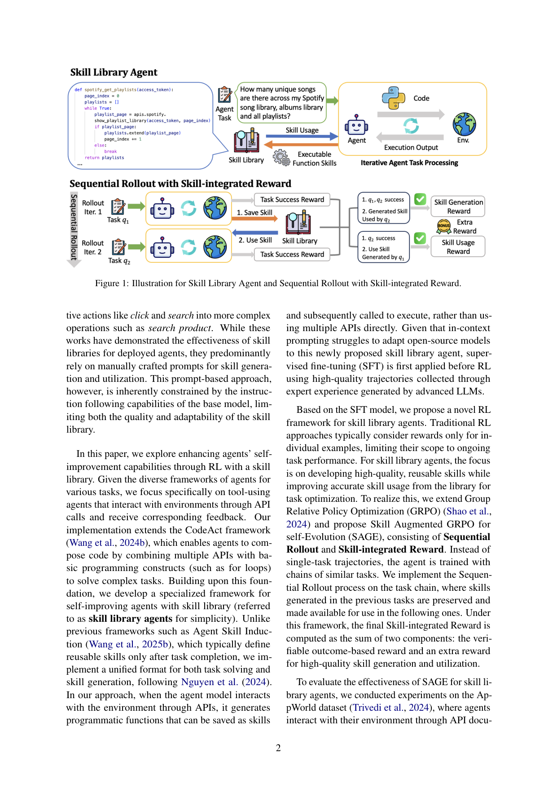
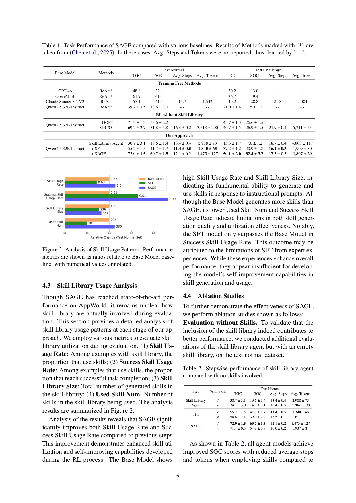

`sage_skilllib | Reinforcement Learning for Self-Improving Agent with Skill Library (SAGE) | Univ. Wisconsin–Madison + AWS Agentic AI (Amazon) | arXiv:2512.17102v2, 2026-03-10, cs.AI | 主题线 L?(技能库自进化 + RL 训练参数)·相关性 High`

> 三标注:【原文】=论文直述;【推断】=有据判断(附依据);【待核】=拿不准关键事实。本篇基于下载 PDF 全文(21 页,73K 字符)精读。

══ 第一层:一眼看懂 [light] ══
- 🟦 **TL;DR**:LLM agent 部署到新环境后不会"越用越强"。一个办法是给它一个"技能库"(skill library),让它把成功经验沉淀成可复用的代码函数,下次遇到相似任务直接调用。但现有技能库都靠**提示词(prompt)**驱动,质量受限于基模型的指令遵循能力。本文不靠 prompt,而是**用 RL 把"生成技能 + 使用技能"这件事直接训进模型参数里**。核心算法 SAGE(Skill Augmented GRPO for self-Evolution)= GRPO + 两个新部件:**Sequential Rollout**(把同场景的 2 个相似任务串成一条链做 rollout,前一个任务造的技能留给后一个用)和 **Skill-integrated Reward**(在原始结果奖励之外,额外奖励"成功生成并被后续复用的技能")。在 AppWorld 上,SAGE 比无技能库的 GRPO 基线 SGC 高 8.9%,且步数少 26%、token 少 59%。【原文 Abstract/§1/§3】
- **最巧的一步**:**Sequential Rollout**。抽掉它整个方法就垮——因为技能的价值要等"后续任务复用成功"才能体现,单任务 RL 根本无法把"未来复用收益"的奖励信号回传到"当前生成技能"这一步。把两个相似任务串进同一条 rollout 轨迹,使得 q2 成功使用 q1 所造技能的奖励能 back-propagate 到 q1 的技能生成动作上(§3.2.2)。这是把"技能复用"从一个离线检索问题转化为可端到端 RL 优化的关键。【原文 §3.2.2】【推断:消融 Table 4 显示去掉 chain/skill 奖励设计后 SGC 从 60.7 掉到 55–57,佐证此步必要性】

══ 第二层:为什么做(写透) ══
- **研究背景**:LLM agent(coding/deep research/assistant/web)靠多轮环境交互解复杂任务,近年大量工作用 RL(尤其 RLVR)端到端训 agent。但 RL 训出的 agent **局限于训练场景**;一旦部署到新环境,缺乏"持续学习"能力,无法把在线积累的经验用于未来任务。【原文 §1】
- **解决的具体痛点**:(1) 现有 skill-library agent(Voyager、Agent Workflow Memory、Agent Skill Induction)**全靠手工 prompt** 做技能生成/使用 → 质量与适应性被基模型指令遵循能力卡死;(2) 这些框架**在任务完成后才定义技能**(task-completion-then-define),对 RL 有两个坏处:长程任务下额外的技能生成进一步拉长 context 可能超模型上限;任务执行与技能生成分离造成不一致、伤害学习效果(§3.1)。【原文 §1/§3.1】
- **相关工作 & 各自不足**:① LLM-agent 框架线(ReAct 推理后行动、CodeAct 生成可执行 Python)——只解当前任务,无持续进化;② skill-library 线(Voyager/AWM/ASI/DynaSaur)——证明技能库有效但**依赖 prompt 且后定义技能**;③ agent RL 线(LOOP 等)——能 rollout 中自我提升但**无技能库**、且只对单样本算奖励。SAGE 站在 ②③ 交叉点:**第一个把 RL 与 skill library 结合**。【原文 §2/§1】
- **动机链**:RL-agent 不能跨场景泛化 → 想用技能库做持续学习 → 但 prompt 驱动质量差且后定义技能不利 RL → 所以(a)follow DynaSaur 用**统一格式**(交互时先生成技能函数再调用,而非直接调 API),(b)用 SFT(Claude 3.5 Sonnet V2 造专家轨迹)先把开源模型拉到能产生有效 rollout 的水平,(c)再用 SAGE 做 RL,让模型真正学会"生成高质量可复用技能 + 准确复用"。为什么不用更简单的现成做法:作者实测**纯 prompt skill agent 反而比 ReAct 更差**(Table 1: 30.7 vs 39.2 TGC),**纯 SFT 也打不过无技能库 GRPO 基线**(SFT 41.7 SGC vs GRPO 51.8)——说明"模仿专家"不足以学会自我提升能力,必须 RL。【原文 §1/§4.2】
- **与最近邻工作的 Δ**:最像 Agent Skill Induction(ASI, Wang 2025b)与 DynaSaur(Nguyen 2024)。Δ:ASI/Voyager **任务完成后**才定义技能且**纯 prompt**;SAGE 用**统一格式(边解题边造技能)** + **RL 把技能能力训进参数**。相对 LOOP(纯 agent RL 无技能库)Δ:加了 Sequential Rollout + Skill-integrated Reward。这个差异有用是因为它让"技能复用收益"成为可微优化目标,而非靠基模型自发涌现。【原文 §3.1/§1】

══ 第三层:怎么做 + 靠不靠谱 ══
- **方法流水线**(输入→输出,5 步):
  1. **统一格式 skill library agent**(§3.1):agent 处理任务 q 时,先从技能库 M 检索 top-k 技能入 context;交互中可做 4 种动作——Skill Usage(用已有技能)/ Skill Generation(定义新技能函数并立即调用)/ Skill Update(技能执行失败则改写重调)/ Skill Save(执行无错则存入/更新 M);也允许直接 API 调用。
  2. **SFT 冷启动**:用 Claude 3.5 Sonnet V2 作专家在该 agent 格式下产高质量轨迹,用 LLaMA-Factory 全参微调 Qwen2.5-32B-Instruct(4×H100)——把开源模型拉到能产生有效 rollout 的水平。
  3. **Sequential Rollout**(§3.2.2):把同场景的两个相似任务 (q1,q2) 串成链,顺序 rollout;q1 阶段技能库 M¹=∅,q2 阶段 M²=q1 生成的技能。同一 group 内不同样本 i 的 M²ᵢ 不同(这是与原 GRPO 的关键差异——同 group 生成来自不同技能库)。
  4. **Skill-integrated Reward**(§3.2.3):R1 = r1 + 1[r1=1]·1[r2=1]·1skill(q2|q1);R2 = r2 + 1[r2=1]·1skill(q2|q1)。即:只有当任务真成功**且** q2 确实用了 q1 造的技能,才给技能奖励;无代码直接终止则 −1.0 惩罚。
  5. **SAGE 优化**(§3.2.4):在 (q1,q2) 链上做 group rollout,用上述奖励算组内相对优势 Âᵏ,GRPO 式更新;**不用 KL 惩罚、优势不除标准差**(follow LOOP);环境观测 token 被 mask,只对 LLM 生成内容算 loss。
- **逐组件必要性**:
  · Sequential Rollout / Skill-integrated Reward → 消融(Table 4)对比 Outcome-based / Chain-based 奖励:Skill-integrated 60.7 SGC > Chain-based 56.6 > Outcome-based 55.4,**有消融证明**。
  · 技能库本身 → Table 2(带/不带技能)所有阶段 SGC 都因技能而升(SAGE 60.7 vs 54.8)、步数/token 降,**有消融**。
  · SFT 初始化 → Table 5 对比 Base/Self-Distillation/RL-Warm-Up/SFT:SFT 60.7 远超无额外数据的最好者 RL-Warm-Up 55.3,直接从 Base RL 仅 25.6,**有消融且证明 SFT 冷启必要**。
  · 检索方法 → Table 3:默认用"同场景"理想检索(免检索模型);实测 Query N-gram(60.1)≈ 同场景(60.7),Skill Embedding 最差(56.0),**有消融**。【原文 §4.3–4.4】
- **关键机制直觉**:Skill-integrated Reward 的乘积式指示函数 = "**只有真正闭环成功的技能复用才计奖励**"——避免奖励"造了一堆没人用/用了没成功的技能"。Sequential Rollout 则把"技能的延迟价值"塞进同一条可微轨迹,让信用分配(credit assignment)从生成动作到复用收益打通。【推断:基于 §3.2.2-3.2.3 公式直觉,作者未用此措辞】
- **实验与证据**:数据集 **AppWorld**(750 任务/250 场景,每场景 3 个相似任务;指标 TGC=单任务完成率、SGC=场景内 3 任务全成);基模型 Qwen2.5-32B-Instruct。**支撑核心主张的关键实验**=Table 1:SAGE 在 Test Normal 达 **72.0 TGC / 60.7 SGC / 12.1 步 / 1475 token**,对比无技能库 GRPO 基线 **69.2 / 51.8 / 16.4 步 / 3613 token**——SGC +8.9、token −59%、步数 −26%;且超过专家 Claude(41.1 SGC)与 LOOP(53.6 SGC)。Test Challenge 亦 SOTA(50.1/32.4)。Skill 使用分析(Fig 2)显示 SAGE 的 Skill Usage Rate 与 Success Skill Usage Rate 显著高于前序阶段。**baseline 公平性**:作者自承 LOOP 无开源代码/无效率指标,故自实现 GRPO 基线(唯一差异:严格 on-policy 无 PPO epoch)对齐比较——【推断:这是合理但非完美对齐,LOOP 原始数字直接引用,效率项无法对照】。**"看着强但没回答核心问题"的风险**:默认结果用"同场景理想检索"(有 test 集场景标签),现实未必可得;但 Table 3 已补真实检索且 N-gram 几乎无损,基本回应了此质疑。【原文 §4】
- **假设与失效边界**:【原文】仅在 AppWorld 单一数据集验证;不同场景可能需不同 agent 设计。【推断】(a) 任务必须能自然成"相似任务链/场景"(AppWorld 天然每场景 3 任务),无此结构时 Sequential Rollout 难构造;(b) 论文为简化只用**长度 2 的任务链**,更长链成本陡增(Appendix B 讨论),延迟价值的传播深度有限;(c) 依赖闭源专家(Claude)造 SFT 数据,纯靠 base 自蒸馏效果明显差(Table 5);(d) 需 4×H100 8-GPU 节点级算力,门槛高。
- **祛魅总结**:**硬货**=(i) 第一个把 skill library 用可端到端 RL 优化的清晰方案,Sequential Rollout + 乘积式技能奖励是真正新颖且有消融支撑的设计;(ii) "token −59%、步数 −26%"的效率收益是实打实的(技能把多步动作压成一次调用)。**包装/需谨慎**=(i) "self-improving / self-evolution"措辞略大:其"进化"发生在**训练期 RL**,部署后是否在线持续写技能进步,正文未展示在线 deployment 的持续增益曲线【推断:全文增益来自训练后评测,非部署期在线学习曲线】;(ii) 高度依赖 SFT 冷启+理想检索的实验设定。作者对 SFT 必要性诚实(明说纯模仿不够),未明显高估。【推断,依据 §4.2/§5/Limitations】

══ 结构化抽取(供全景汇总) ══
- 🎯 **机制速览 6 轴** [light]:
  | 维度 | 内容 |
  |---|---|
  | 学什么信号 | 环境可验证 reward(AppWorld outcome)+ 自造的 Skill-integrated 额外奖励(技能成功复用)【原文 §3.2.3】 |
  | 改什么 | **模型参数**(GRPO 梯度更新)+ 外部技能库(代码函数的写入/更新);prompt 固定 |
  | 何时改 | 训练期:per-episode(以 2-任务链为单位做 RL);技能库写入在 rollout 内 per-step;部署评测期技能库可在线增长但参数冻结【原文 §3.2/§4.1】 |
  | 免梯度? | **否**(核心是 GRPO 参数更新);技能库读写本身免梯度,属混合,但主创新是梯度 RL |
  | 记忆-技能生命周期 | 写入(Skill Save,执行无错才存)→ 检索(top-k,同场景/N-gram/embedding)→ 更新(Skill Update,失败则改写)→ **无显式遗忘/淘汰机制**(正文未述删除策略)→ 共享:技能在同场景任务链内共享 |
  | 防遗忘机制 | 训练侧:follow LOOP **不用 KL 惩罚**(故无 KL 投影防遗忘);未报告参数层灾难性遗忘对策【推断:正文无防遗忘专门设计,属"无/不适用"】 |
- ⑦ **开源代码 + 框架/harness**:代码 https://github.com/amazon-science/SAGE 【原文 Abstract】。**RL 框架=verl**(rollout 用 vLLM、梯度更新用 FSDP + DeepSpeed-Ulysses 序列并行);**SFT 框架=LLaMA-Factory**(全参微调)。【原文 Appendix E/F/G】(仓库本身未 clone 验证,框架结论基于 PDF 附录明述)
- 💰 **资源/成本与可扩展性**:RL 全程 **4×NVIDIA H100 8-GPU 节点**;rollout context 上限 28,048、每轮输出上限 1,500 token;batch/mini-batch 增至 576(SAGE)以容纳额外 rollout;学习率 1e-6 常数、梯度裁剪 1。专家数据由 Claude 3.5 Sonnet V2 生成(有 API 成本,具体未量化)。任务链限长 2 即因成本(Appendix B)。【原文 Appendix E/G,部分 API 成本"原文未量化"】
- 🎯 **对"探索-巩固"idea 对标** [light]:**支撑 + 可借组件**。(支撑)它正面论证"用 RL 把经验巩固进参数 + 外部技能库"的范式优于纯 prompt/纯 SFT,与"探索→巩固"主张同向。(可借组件)**Sequential Rollout** 这一"把延迟价值串进同轨迹做 credit assignment"的技巧,可迁移到 MTP/OPD 中"前瞻探针的收益要在后续 step 才兑现"的信用分配问题;**乘积式 gating 奖励**(只奖励闭环成功的复用)也可借。(竞品维度)它走的是**梯度 RL** 路线,与免梯度记忆/技能库路线(如 ReasoningBank/training_free_grpo)形成对照组。
- 🔭 **开放问题/未来方向**:【原文】扩展到 AppWorld 之外的其它 tool-using agent 数据集;探索更长任务链的 Sequential Rollout(Appendix B)。【推断】(a) 部署期真正在线持续进化(参数+技能库同时增长)的长程曲线缺失,值得补;(b) 技能库无遗忘/去重/版本治理机制,规模膨胀后检索质量与冲突如何控未答(此点正是 skillops 等姊妹工作的切口);(c) 去掉闭源专家依赖、纯自举冷启的可行性。

- 🖼 **关键图 top-2** [light]:
  
  · 这是**原文 Figure 1**(方法主图/pipeline)。上半展示 skill library agent 如何把任务转成"生成可执行技能函数→调用→存库";下半展示 Sequential Rollout 把 Rollout item1(q1,造技能存库)与 item2(q2,用技能)串联,并标出三类奖励(Task Success / Skill Generation / Skill Usage)。选它因为一张图同时讲清"统一格式 agent"与"链式 rollout+复合奖励"两大核心,是全文精华。【原文 Figure 1】

  
  · 这是**原文 Figure 2**(核心发现图)。以 Base Model 为 1.0 基准,对比 Base/SFT/SAGE 在四个技能利用指标上的比值。选它因为它直接回答"RL 到底改变了什么"——SAGE 虽生成技能更少,但**被用技能数与成功复用率显著更高**,证明 RL 提升的是技能"质量与会用",而非数量,是支撑核心主张(RL 学会"生成高质量+准确复用")的关键证据。【原文 Figure 2/§4.3】
