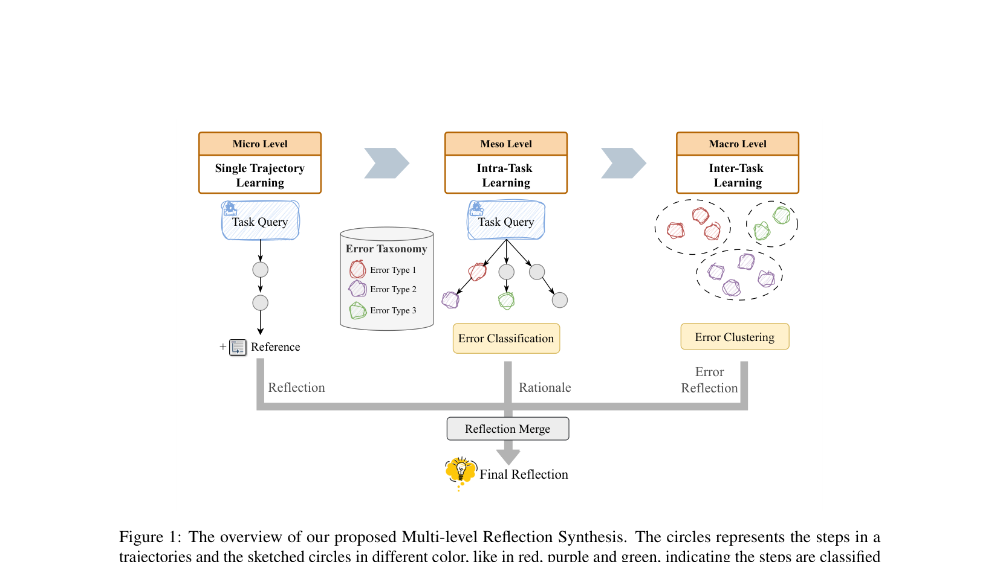
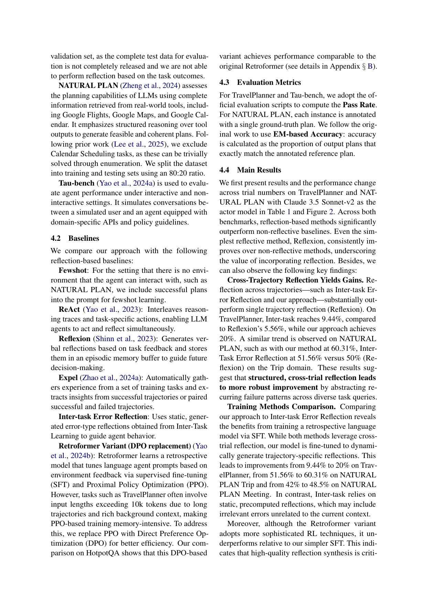

`samule | SAMULE: Self-Learning Agents Enhanced by Multi-level Reflection | AWS AI Labs（Yubin Ge, Salvatore Romeo, Jason Cai, Monica Sunkara, Yi Zhang） | 2025-09 arXiv:2509.20562v1(24 Sep 2025) · 预印本 | 主题线 = 自反思/经验学习驱动的 self-evolving agent（训练侧·失败中心）· 高相关`

> 三标注约定:【原文】=论文直述;【推断】=有据判断(附依据);【待核】=拿不准的关键事实。

══ 第一层:一眼看懂 ══

- 🟦 **TL;DR**:让 agent(做旅行规划、多步推理这类复杂任务)从**失败轨迹**里学到有用的"复盘笔记(reflection)",并把这种复盘能力**蒸馏进一个小模型**。做法分两阶段:①离线**多层级反思合成**——对每条失败轨迹,从三个粒度造高质量反思:**微观**(单条轨迹 vs 参考答案逐项对比,找具体错)、**中观**(同一道题的多次尝试归纳成"错误类型表 error taxonomy")、**宏观**(把不同任务里"同类型错误"聚类,提炼跨任务通用教训);三层合并成一条 final reflection。②用这些"(轨迹→反思)"对**SFT 微调一个 Qwen-2.5-3B 当"复盘模型(retrospective model)"**,推理时它看着 agent 轨迹直接吐反思(此时**不再需要参考答案**)。另外给交互场景加了一个 **foresight-based reflection**:每一步先**预测用户会怎么回**,真回复来了就比对,差太多就触发反思、当场纠偏。【原文 摘要+§1+§3】

- **最巧的一步**:**"中观层的错误分类 + 宏观层的同类错误跨任务聚类"**——抽掉它,方法就退回普通 Reflexion(只在单轨迹上复盘)。证据:消融把"跨轨迹反思"(Inter-Task Error Reflection)对比 Reflexion,TravelPlanner 上 5.56%→9.44%;再叠加"训练复盘模型动态生成"到 20%(Table 1)。错误聚类把"零散失败"变成"可迁移的错误模式",是它在低成功率任务上跑赢的根。【原文 Table 1, §4.4】

══ 第二层:为什么做 ══

- **研究背景**:LLM agent 越来越当"推理引擎"干多步、要和环境交互的活,但**不会从经验(尤其失败)里自我改进**——这在 TravelPlanner 这种成功率极低(ReAct 仅 4.44%)、失败遍地的复杂环境里特别致命。"从失败中学习"是长期能力的关键。【原文 §1】

- **解决的具体痛点**(很具体,三条):
  1. **反思空洞**:Reflexion 在复杂任务上几乎不涨(TravelPlanner 5.56%),因为它**不会深挖失败根因**,只产出泛泛、没用的纠错策略。【原文 §1】
  2. **过度依赖成功轨迹**:Expel 这类靠"成功轨迹/成败配对"抽经验的方法,在**成功极稀少**的硬任务里直接崩(Expel 在 TravelPlanner = **0%**),因为根本没有足够成功样本可学。【原文 §1, §4.4】
  3. **RL 方法对反思质量敏感**:Retroformer/CTRL 用 RL + "反思带来的任务改善"当 reward,可一旦反思本身造得差,RL 就学到无意义策略;且复杂任务轨迹超 10k token,PPO 训练显存吃不消。【原文 §1, §4.2】

- **相关工作 & 各自不足**:
  - *Prompt 式自反思线*:Reflexion(verbal RL,episodic buffer)、Self-Contrast、Iteration-of-Thought——停在 prompt 级,复杂任务诊断力不足。【原文 §2】
  - *经验学习线*:Expel(从成功/成败配对抽 insight)、Self-evolving GPT(终身经验学习)——偏成功导向,失败信息被浪费。【原文 §2】
  - *自反思驱动的 post-training 线*:Retroformer(SFT+PPO 调 prompt)、WebRL(自演化在线课程 RL)、self-rewarding 数学纠错——是最近邻,但 RL 不稳/对反思质量敏感/长上下文显存重。【原文 §2】

- **动机链**:agent 要 self-evolve → 必须从经验学,而真实环境**失败远多于成功** → 所以要"失败中心"学习,但单纯自反思(Reflexion)诊断不出根因、产出空洞 → 引入"参考答案 + 多层级(微/中/宏)"把失败拆细、归类、跨任务抽象 → 但多层级合成依赖**参考答案 y_train**,推理时拿不到 → 所以把"看轨迹生成反思"的能力**SFT 蒸馏进一个小复盘模型**,推理时脱离参考独立工作 → 又因为交互任务不能"失败后再复盘",于是加 foresight:**用"预测 vs 真实用户回复"的偏差当 in-episode 的失败信号**,实时触发反思。为什么不用更简单的 RL?因为作者实测:高质量反思合成 + 简单 SFT > 复杂 RL(Retroformer variant),既更准又更省、更稳。【原文 §1, §4.4】

- **与最近邻 Retroformer 的 Δ**:最像 Retroformer(也是"训一个复盘模型来改 agent")。**关键差异**:Retroformer 靠 **RL(PPO/DPO)**、复盘信号来自"环境 reward 改善",且只在单轨迹层面;SAMULE 靠**纯 SFT**,但喂给 SFT 的目标反思是**多层级合成的高质量数据**(含跨任务错误聚类)。为什么这差异有用——RL 的天花板被"反思数据质量"卡死(reward 来自反思,反思差→学废);SAMULE 把功夫全下在"离线把反思造好",于是简单 SFT 就超过 RL(TravelPlanner 20% vs Retroformer-variant 12.78%;Claude-3.7 上 29.44% vs 21.67%)。定性上(附录D)Retroformer-variant 会**误诊不存在的错误**(瞎报地理/用餐时间问题),而 SAMULE 准确点出真实违例。【原文 Table 1/2, §4.4, 附录D】

══ 第三层:怎么做 + 靠不靠谱 ══

- **方法流水线**(输入失败轨迹 → 输出一个会复盘的小模型 + 交互纠偏):
  1. **微观/Single-Trajectory(Algorithm 1 上段)**:对每个训练 query 用 ReAct 最多重试 K 次;失败则让 LLM **拿轨迹和参考 plan y_train 逐项对比**、诊断根因、写一条简洁纠错 plan 作 reflection r,带入下次重试。【原文 §3.2.1】
  2. **中观/Intra-Task**:把同一 query 的多条轨迹(成功+失败)拼起来,让 LLM **增量构建错误类型表 E**(检查已有类型→补新类型),再回头给每条轨迹的每个动作**打错误类型标签 + 分类理由**,得到"错误路径 ϵ + rationale z"。【原文 §3.2.1】
  3. **宏观/Inter-Task**:对每个错误类型 e,把**不同 query 里犯了 e 的轨迹聚成一簇**,让 LLM 生成一条**跨任务通用**的错误反思 re(识别反复出现的 failure mode + 通用对策)。【原文 §3.2.1】
  4. **Reflection Merge**:把某轨迹的(微观 r + 中观 rationale z + 它命中的各类型宏观反思 re)拼起来再总结成一条 final reflection r_final。【原文 §3.2.1】
  5. **Stage II 训练**:构造 (instruction+query+背景+轨迹 → r_final) 训练对,**SFT 一个小模型(Qwen-2.5-3B,LoRA+DeepSpeed-3)**当复盘模型;推理时它看轨迹直接产反思,**不需参考答案**。【原文 §3.2.2, 附录A】
  6. **Foresight-based Reflection(Algorithm 2,交互场景)**:每步先 \(Action a_t\),再**预测用户回复 Rp**;观测真回复 Rt 后用 `LLMdiff(Rp,Rt)` 判偏差,偏差大→当场 `LLMreflect(轨迹)` 生成反馈塞回上下文继续。【原文 §3.2.3】

- **逐组件必要性**:
  - *跨轨迹(中观+宏观)反思*:✔有消融——Inter-Task Error Reflection(9.44%)> Reflexion(5.56%);训练后 20%(Table 1)。
  - *训练复盘模型 vs 用静态反思*:✔有对比——SAMULE(动态生成,20%)> Inter-Task(静态预算反思,9.44%);静态反思会混入与当前上下文无关的错误。【原文 §4.4】
  - *参考答案该放哪一层*:✔专门消融(Table 4)——**只在微观放参考**最好(20%),两层都放反而降到 15.56%,不放 18.33%。原因:y_train 非唯一解,中观也喂参考会让模型"过度对齐某一个 plan"、忽略其他合法错误。这是个反直觉但诚实的发现。【原文 §4.6】
  - *失败中心 vs 成功中心*:✔间接证明——Expel(成功导向)在 TravelPlanner=0%,SAMULE 靠错误分类/聚类从失败抽 insight=20%。【原文 §4.4】
  - *Foresight 的"预测用户回复"这一步是否必要*:**原文未做消融**——交互表(Table 3)只给了 SAMULE vs Reflexion/ReAct 的端到端结果,没有"去掉 foresight 触发器、改成定步反思"的对照。属未证明项。【推断:依据=Table 3 无 foresight 内部消融】

- **关键机制直觉**:核心不是公式,是**"把失败信息做三次抽象升维"**。微观=逐项对照(具体到"选了参考里没有的餐厅");中观=把"很多次具体错"归并成"有限几类错误类型"(降噪、给出可复用标签);宏观=把"同一类错误"跨任务聚合(得到"不管哪个任务,这类错都该这么防"的通用护栏)。三层合并的反思=既有 instance 细节又有 conceptual 模式,正好对应教育心理学的 self-explanation/Kolb 经验学习循环(具体经验→反思观察→抽象概念化)。然后 SFT 把"会这样三层复盘"的能力压进一个小模型。【原文 §3.2.1】

- **实验与证据**:
  - 数据集/设置:**TravelPlanner**(sole-setting,验证集,轨迹可超 10k token)、**NATURAL PLAN**(Trip/Meeting 两域,80:20 切分,排除可枚举的 Calendar)、**Tau-bench**(Retail/Airline,既测非交互也测交互)。Actor = Claude-3.5-Sonnet-v2(主)/Claude-3.7-Sonnet;复盘模型 = Qwen-2.5-3B(LoRA,8×A100,~1h/run)。指标:Pass Rate / EM Accuracy。【原文 §4.1, 附录A】
  - **支撑核心主张的关键实验**:Table 1——TravelPlanner 上 ReAct 4.44 → Reflexion 5.56 → Inter-Task 9.44 → Retroformer-variant 12.78 → **SAMULE 20.00**;NATURAL PLAN Trip 50→60.31、Meeting 40.5→48.5。Table 2(换 Claude-3.7)SAMULE 29.44 vs Retroformer-variant 21.67——证明跨 actor 稳健。【原文 Table 1/2】
  - **最有说服力的一组**:Table 5 错误归约率(加 final reflection 重试后重新分类、看错误减少比例)——SAMULE 0.67 / 0.73 / 0.53 远超 Reflexion 0.13 / 0.42 / 0.22。**直接量化"反思真的把对应错误改掉了"**,而非只看终端 pass rate,这是它"失败中心有效"主张最硬的证据。【原文 Table 5】
  - 交互场景:Table 3,Tau-bench 非交互 SAMULE 87.83/66.00 > Reflexion 82.61/56.00;交互 75.97/55.32 > Reflexion 69.75/48.50。【原文 Table 3】
  - *baseline 公平性*:同 actor、同 ReAct base、同官方评测脚本,反思机制是主要变量;但 Retroformer 被改成 DPO 变体(因长上下文 PPO 跑不动),作者在 HotpotQA 上证明 DPO-variant≈原版(44% vs 43%,Table 6)以保公平。较诚实。【推断:依据=§4.2+附录B】
  - *"看着强但没回答核心"的隐患*:① TravelPlanner 绝对 pass rate 仍很低(20%/29%),说明方法**缓解而非解决**复杂规划;② Tau-bench **交互**setting 反而比**非交互**(3 trials)分数低(75.97<87.83),即 foresight 单趟交互打不过"多次重试后复盘"——交互纠偏的增量其实有限,论文未正面讨论这点。【推断:依据=Table 3 交互 vs 非交互对比】

- **假设与失效边界**:
  - 【原文】训练阶段**强依赖参考输出 y_train**;很多 benchmark 没有参考答案时该框架的数据合成跑不起来(§4.6 把这列为 key constraint)。
  - 【原文·Limitations】**错误类型表(taxonomy)是离线静态构建的,推理时不更新**——遇到新任务/没见过的失败模式会过时、不完整,**不支持真正的终身/在线持续学习**(作者自承)。
  - 【原文·Limitations】多层级反思合成**离线开销大**(轨迹分析+taxonomy 构建+跨任务聚类,长轨迹大数据集尤甚),虽然最终复盘模型推理很轻。
  - 【推断】foresight 依赖"agent 能较准地预测用户回复",在用户行为高度随机/开放域对话里这个预测信号会失真,触发器要么乱触发要么漏触发。依据=Algorithm 2 完全建立在 \(R_p≈R_t\) 的可比性上,论文未测预测准确率。
  - 【推断】复盘模型用 Claude-3.5 合成数据 SFT 到 Qwen-3B,本质是**蒸馏一个固定 actor 分布下的复盘策略**;换很不同的 actor / 任务族时复盘模型需重训,泛化未验证(只验了 Claude-3.5→3.7 同族)。依据=附录A 训练设置 + 仅同族 actor 实验。

- **祛魅总结**:
  - **真贡献(硬货)**:(a)**"失败中心 + 三层抽象"被错误归约率(Table 5)实锤有效**,不是只靠终端指标;(b)"高质量反思 SFT > 复杂 RL"是一个有说服力、可复现的反主流结论(且省算力);(c)Table 4"参考只放微观最好"是诚实且有教益的反直觉发现。
  - **包装/可能高估**:"self-learning""self-improving"标题略大——它本质是**离线一次性蒸馏出复盘模型 + 推理时静态使用**,并非在线自演化(作者 Limitations 也承认 taxonomy 静态)。foresight 部分包装成"实时自适应学习",但它**不更新任何参数/记忆**,只是 in-context 触发一次反思,且交互分数还低于多次重试;宣传力度 > 实测增量。【推断:依据=Limitations + Table 3】
  - **可能低估**:错误归约率这个评测指标本身(把"反思→错误是否真减少"量化)很有价值,论文当成普通辅助实验,其实是该领域少见的"反思有效性"直接度量,值得单独强调。【推断】

══ 结构化抽取 ══

- 🎯 **机制速览 6 轴**:

| 学什么信号 | 改什么 | 何时改 | 免梯度? | 记忆-技能生命周期 | 防遗忘机制 |
|---|---|---|---|---|---|
| **自反思(失败轨迹为主)** + 训练期用**参考答案 y_train** 当对照信号;交互期用"**预测用户回复 vs 真实回复**的偏差"当 in-episode 失败信号 | **参数**(SFT 一个 Qwen-2.5-3B 复盘模型,LoRA);该复盘模型推理时产出的反思去改 actor 的 **prompt/上下文**(actor 本身不更新) | 训练复盘模型 = **离线批量**;推理时非交互 = **per-episode**(失败后复盘再重试)、交互 = **在线 per-step**(foresight 触发) | **混合**:复盘模型靠**梯度 SFT**训练;但运行时对 actor 的纠正是**免梯度**的 prompt 注入 | 写入=离线合成(微/中/宏三层反思)→构建静态错误 taxonomy →蒸馏进复盘模型参数;检索≈复盘模型按轨迹即时生成(无显式记忆库检索);**无遗忘/淘汰**(taxonomy 静态);未涉及跨 agent 共享 | **无 / 不适用**(单次离线蒸馏,无持续学习,故不涉及灾难性遗忘;作者把"静态 taxonomy 无法持续学习"列为局限)【原文 Limitations】 |

- ⑦ **开源代码 + 框架/harness**:**未找到开源代码**——通篇正文、脚注、附录均**无 GitHub / 项目主页 / 数据发布链接**(已全文检索确认,唯一 "open-source" 命中是指 WebRL 的 "open-source LLM",与本文代码无关)。训练 harness:**自研脚本**,依赖 **LoRA + DeepSpeed ZeRO-3 + AdamW**(8×A100);**未使用** veRL/TRL/OpenRLHF/LLaMA-Factory 等具名 RL 框架(纯 SFT,且作者刻意避开 RL)。actor 与反思合成均用 Claude-3.5/3.7(闭源 API),base planner = ReAct。【原文 附录A;代码缺失为全文检索结论】

- 💰 **资源/成本与可扩展性**:复盘模型训练**很轻**——Qwen-2.5-3B + LoRA,8×A100,**约 1 小时/run**,15 epochs,bs=1,lr 5e-5。**主要成本在离线数据合成**(多层级反思:每任务最多 K=4 次重试 + taxonomy 构建 + 跨任务聚类,全用 Claude-3.5 API,长轨迹>10k token,作者自承 resource-intensive)。推理增量:非交互 = 多一次"看轨迹生成反思"的小模型调用;交互 = 每步多一次"预测用户回复 + diff 判断"(可能额外触发反思),延迟随步数线性增。actor 是闭源 API,推理成本受 token 量(10k+/轨迹)驱动。【原文 §6, 附录A】

- 🎯 **对"探索-巩固"idea 对标**:**强支撑 + 多个可借组件**。
  - **支撑**:它是"探索(多次 ReAct 重试产失败轨迹)→巩固(把失败提炼成可迁移反思并蒸馏进参数)"的一个**训练侧**完整实例,且明确把"失败"当一等学习信号——与 TSRD 的 **path-recovery(从错误路径学纠偏)**理念高度一致。
  - **可借组件**:① **三层抽象(微/中/宏)**——可作 TSRD 把"单步关键错→错误类型→跨任务通用护栏"逐级巩固的现成蓝本,尤其"宏观=同类错误跨任务聚类成通用策略"可直接对应"巩固进参数/技能库";② **foresight-based reflection ≈ 用户侧的 MTP 预言探针**——本文用"预测用户下一回复 vs 真实回复"的偏差当触发器,**与本项目核心 idea「MTP 作为 foresight 探针、用预测-实际偏差定位关键步」结构同构**,是少见的"foresight 触发 in-episode 纠偏"先例(虽然它停在 prompt 级、不动参数);③ **错误归约率(Table 5)**作为"巩固是否真消除了对应错误"的评测指标,可直接迁来度量 path-recovery 的有效性。
  - **缺口/区别**:它的 foresight **不更新参数、不写记忆**(只 in-context 触发一次反思),错误 taxonomy 静态、无持续学习;而 TSRD 若要"MTP foresight + OPD 把纠偏沉淀进参数"则需补"在线巩固通道 + 防遗忘"——正是本文 Limitations 自承的两个空白(静态 taxonomy、无 online adaptation)。【推断:依据=§3.2.3+Limitations+项目 project_core_idea/TSRD】

- 🔭 **开放问题/未来方向**:
  - 【原文】**增量构建错误 taxonomy + 在线适应**以支持终身学习(把当前静态 taxonomy 变动态);更 scalable 的反思合成 / 高效记忆管理以降低离线开销。
  - 【推断】foresight 触发器的可靠性研究(预测用户回复的准确率、误触发/漏触发分析);把复盘模型从"prompt 级纠正"升级为"把反思蒸馏回 actor 参数"(避免每步长 prompt 注入);跨 actor 族 / 跨任务的复盘模型泛化或元学习。依据=Algorithm 2 + 附录A 仅同族验证。

- 🖼 **关键图 top-2**:

  
  这是**原文 Figure 1**(方法主图,本文裁自 p4 顶部):一图说清三层级如何咬合——Micro(单轨迹 vs Reference 找具体错)→ Meso(用 Error Taxonomy 给步骤分类,Error Classification)→ Macro(把同类型错误跨任务聚类,Error Clustering)→ 三路反思汇入 **Reflection Merge → Final Reflection**。选它因为它把全文最核心、也是最巧的"失败信息三次升维"机制完整可视化。

  
  这是**原文 Figure 2**(主结果图,本文裁自 p6 含该页正文):TravelPlanner / NATURAL PLAN(Trip)/(Meeting) 三幅曲线,横轴是 trial 次数,SAMULE 一路居顶且随重试持续拉开与 ReAct/Reflexion/Expel/Retroformer-variant 的差距。选它因为它直观证明"多层级反思 + 复盘模型"在**复杂、低成功率**任务上的稳定优势,且体现"随探索次数增多增益累积"的趋势。〔注:该裁图同页含 §4.2-§4.4 正文文字,图本身在该页底部三联子图〕

──────────
**幂等状态**:本文 analysis 首次产出。机制类型 = 自反思/失败中心经验学习(离线 SFT 蒸馏复盘模型 + 交互期 foresight 触发的免梯度 prompt 纠偏);改参数(复盘模型)+ 改 actor prompt;无持续学习/无防遗忘(taxonomy 静态)。**未开源**(全文无代码链接)。抽到 2 图:是(Figure 1 方法主图 + Figure 2 主结果)。
