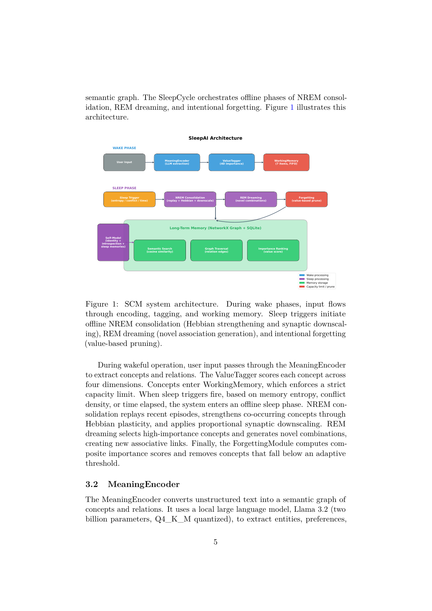
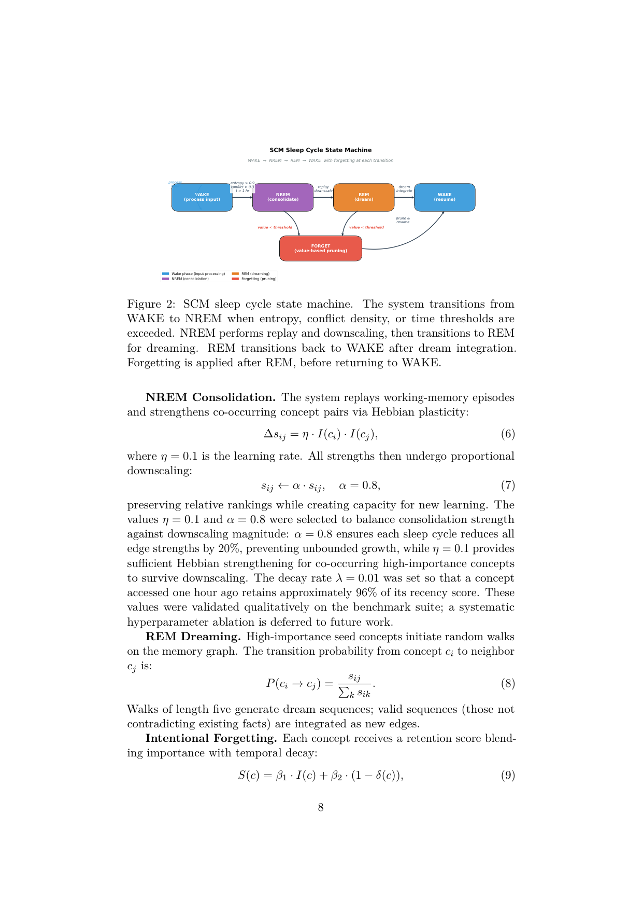

`scm | SCM: Sleep-Consolidated Memory with Algorithmic Forgetting for Large Language Models | Saish Shinde(单作者,Clyrai IP Studio)| 2026-04 v1 · arXiv 2604.20943 · "research preview"/prototype | 主题线 L?(记忆·神经科学启发巩固) · 相关性 High(对"探索-巩固"直接同构)`

══ 第一层:一眼看懂 [light] ══
- 🟦 TL;DR:LLM 本质"健忘",现有记忆方案(截断上下文 / 无界向量库 / MemGPT 分层 / Mem0)都缺"巩固"与"主动遗忘"。SCM 照搬人脑五件套做了个记忆架构原型:① 容量受限的工作记忆(~7 项 FIFO);② 多维重要性打标(新颖度/情感效价/任务相关/重复频率 四维);③ **离线"睡眠"巩固,分 NREM 与 REM 两阶段**(NREM=回放+Hebbian 强化+突触下调;REM=高重要概念间生成新关联);④ 价值阈值的"有意遗忘";⑤ 计算自我模型(introspection)。清醒(wake)时编码入工作记忆,睡眠触发(熵/冲突密度/时间)时离线重组。原型在 8 项基准上 10 轮对话满分召回,同时靠遗忘减噪 90.9%,搜索 <1ms。
- 最巧的一步:**把"巩固"和"遗忘"做成离线睡眠阶段、与在线 wake 解耦**,且 NREM(强化已有)与 REM(生成新关联)分工。抽掉睡眠阶段,SCM 就退回成"awake-only"的 Mem0 式系统(作者明确以此批评 Mem0"既不离线巩固也不有意遗忘")——正是这个 offline sleep cycle 让"减噪 90.9% 而不丢重要概念"成为可能(消融:No-Forget Graph 召回与 SCM 持平但内存膨胀 3×)。

══ 第二层:为什么做(写透,重点) ══
- **研究背景**:LLM 本质"健忘"(amnesic)——每次对话从零开始,记忆方案有限。随着 LLM 从无状态聊天机器人走向持久个人助理,结构化记忆系统的需求变迫切(§1)。
- **解决的具体痛点**(§1-§2,越具体越好):现有三类方案各有硬伤——①**上下文窗口**:受 token 预算限,且 relevant 信息落在长序列中段时性能恶化(lost-in-the-middle);②**RAG/向量库**:embedding 无界增长,**无重要性优先级、无巩固、无主动遗忘**;③**分层记忆 MemGPT**:借 OS 隐喻在快慢存储间搬数据,但**无睡眠依赖巩固、无突触剪枝**;④**Mem0**:从对话抽事实按相似度取,但是 **awake-only**(既不离线巩固也不有意遗忘)。Table 1 用七个特征(working memory 限/多维重要性/NREM/REM/有意遗忘/self-model/multi-agent sync)对比 MemGPT/Mem0/WSCL,**SCM 是唯一七项全占的**。
- **人脑记忆五件套(作者的论证支点,§1)**:工作记忆约 7 项(Miller 瓶颈,强制选择性注意)+ 长期记忆关联网络 + 睡眠巩固(NREM 海马重激活+强化皮层连接 / REM 形成新关联+整合)+ 主动遗忘(synaptic homeostasis hypothesis:剪弱突触保信噪比,非被动衰减)+ self-model(自我表征支持内省)。SCM 给这五者各做一个计算类比。
- **动机链**:LLM 健忘且现有方案都缺"巩固+主动遗忘" → 人脑记忆是动态自组织、非 append-only DB → 其核心是工作记忆瓶颈 + 睡眠巩固(NREM 强化/REM 生成)+ 主动遗忘(突触稳态)→ 所以应把这五件套计算化,做成 wake(在线编码)↔ sleep(离线巩固+遗忘)解耦的架构。为什么不用更简单的现成做法(纯向量库)?因为向量库永不遗忘、无优先级,内存无界膨胀(§4.2 实证:Vector DB 召回 86.4% 但留 55 概念全是噪声)。
- **相关工作 & 各自不足**(§2):与 **EWC**(弹性权重巩固)——EWC 在**参数层**用 Fisher 惩罚防灾难遗忘,但不构建对话 agent 的结构化记忆系统(SCM 在记忆架构层);与 **Wake-Sleep Continual Learning (WSCL)**——AI 里最接近的睡眠机制,显式区分 NREM 模型压缩 / REM 合成数据生成,但**针对图像分类、无语义记忆图、无价值遗忘、无多维重要性**;与 **SleepGate**——把睡眠隐喻用于 transformer KV-cache 驱逐,但那是**缓存管理而非语义巩固**(操作 token 级投影、跨 session 清空)。
- **与最近邻 WSCL / SleepGate 的 Δ**:SCM 的关键差异是**把睡眠巩固搬到"语义概念图"层**(突触下调=按比例减图边权、replay=重激活概念共现、遗忘=多维重要性阈值剪枝),且**首次把五件套统一进单一对话 agent 系统**并加多维 value tagging(4D)。这差异有用,因为它让"哪些经验值得固化/该忘"有了可计算的打分,而 WSCL/SleepGate 都做不到对话记忆的这种细粒度优先级。

══ 第三层:怎么做 + 靠不靠谱 ══
- **方法流水线(5 模块,wake↔sleep,§3)**:输入 →①**MeaningEncoder**:本地 Llama 3.2-2B Q4 从文本抽 typed 概念(person/preference/fact/event/object/location/abstract)+ all-MiniLM-L6-v2 384 维 embedding;边是 typed 关系(has_property/prefers/related_to/**contradicts**/causes/part_of),矛盾时记 contradicts 边待睡眠解决(LLM 不可用则退化为 regex)。②**ValueTagger**:给每概念打 4 维重要性——novelty(1−与已有记忆最大余弦)、emotional valence(LLM 情感\(\in[-1,1]\))、task relevance(与当前目标余弦)、repetition(归一化访问频次);加权合成 \(I(c)=0.30\cdot novelty+0.20\cdot|emotional|+0.35\cdot task+0.15\cdot repetition\)(task 权重最高因最相关于召回,权重由 benchmark 消融定)。③**WorkingMemory**:海马等价物,固定 7 项 FIFO(Miller's Law),满则挤出最旧,制造"记忆压力"逼迫巩固。④**LongTermMemory**:皮层等价物,NetworkX 有向图(节点存 embedding/value/时间戳/访问数/连接强度)+ SQLite 持久化(可选 PostgreSQL);检索=语义余弦 + 图遍历 + 重要性排序三路融合。⑤**SleepCycle**:由 memory entropy>0.9 / conflict density>0.3 / 时间>1h / 手动 触发,进入离线三阶段。
- **睡眠三阶段(关键机制/公式,§3.6)**:**NREM 巩固**——replay 工作记忆 episode,对共现概念 Hebbian 强化 \(\Delta s_{ij}=\eta\cdot I(c_i)\cdot I(c_j)\)(\(\eta=0.1\)),然后全局按比例下调 \(s_{ij}\leftarrow\alpha\cdot s_{ij}\)(\(\alpha=0.8\),每周期减 20% 防无界增长,保相对排序)。**REM dreaming**——高重要 seed 在图上做长度 5 随机游走 \(P(c_i\to c_j)=s_{ij}/\sum s_{ik}\),不矛盾的序列作新边整合(附录 A 例:"healthcare→anatomy→hiking"生成新 related_to 边,使"profession-related 户外活动?"可答)。**Intentional Forgetting**——保留分 \(S(c)=\beta_1\cdot I(c)+\beta_2\cdot(1-\delta(c))\),\(\delta=\exp(-\lambda\cdot\Delta t)\) 时间衰减;自适应阈 \(\theta_f=\mu_I-\sigma_I\cdot(|G|/target\_size)\)(图越大于目标 100,\(\theta_f\) 越高、遗忘压力越大,clip 下限 0.05)。**self-model**:把"SCM"作最高重要节点(0.95)+10 个能力概念,支持内省回答(不声称意识)。
- **逐组件必要性(§4.4 消融,Table 4,full=22/22 召回 + LTM 24 + 0/50 噪声)**【原文】:**去 ValueTagger**(均匀重要性)→ 召回掉到 18/22、留全部 50 噪声(最伤);**去 NREM**→ 召回 90.9%(共现概念无法强化);**去 ForgettingModule**→ 内存膨胀到 72(留全部噪声,最大膨胀);**去 WorkingMemory 限**→ 无界增长留 35 噪声。**作者极诚实地标注两个组件"在当前 benchmark 无可测收益"**:**REM dreaming**(召回不变 22/22,LTM 仅 24→26)和 **Self-Model**(对召回/内存零影响)——因当前测试只问显式事实,不需要新关联推理或内省;作者认为它们"架构上必要"但**承认当前评测未验证其功能收益**(属难得的自我祛魅)。
- **实验与证据(关键数字)**【原文】:① **8 项 benchmark 全满分 1.00**(Table 3):working memory 7/7、5 轮 11/11、10 轮 22/22、巩固 6 重要保留12噪声除、遗忘 90.9%(50/55→剪45)、图遍历 3/3、延迟 <1ms@360概念、跨 session 3/3;② **baseline 对比**(Table 2,**支撑核心主张的关键实验**):FIFO 7-buffer 召回 36.4%(留 7)、Vector DB 86.4%(留 55 全噪声)、No-Forget Graph 100%(留 72,**3× 膨胀**)、SCM 100%(留 24)——**SCM 是唯一"满召回 + 最紧凑"**;③ Fig3 显示无遗忘 20 周期线性涨到 110、有遗忘 plateau;④ **\(\beta_2\) bug 的诚实记录**(Fig5):初版 \(\beta_2=0.4\) 误抬新概念(\(1-\delta\approx1\))致 0% 遗忘,grid search 改 0.2 后达 90.9%。
- **baseline 公平吗 / 有没有"看着强但没回答核心"**:**这是最大软肋**。① benchmark 是**自建的 8 项小测、10 轮对话、22 个显式事实**(如"I live in Mumbai"),作者自陈"这是能力下界,真实部署需处理隐式偏好/时序/矛盾/歧义";② **5 次运行零方差**——作者老实解释这源于"确定性抽取+固定种子",并明示"零方差是当前 benchmark 的性质而非系统普遍性质,换大 LLM/变措辞/对抗输入会有随机性";③ baseline 是"简化近似"而非真实 MemGPT/Mem0 跑分。所以"perfect recall"基本是 **toy 基准上的满分**,外推性弱(作者本人也基本承认)。
- **假设与失效边界**【推断,除标注外】:核心假设"概念级的突触下调/replay/价值阈值能忠实近似生物巩固,且自建 8 项 benchmark 能代表真实记忆需求"。失效边界——【原文 §5.1】NetworkX 在约一万概念以上成瓶颈(需 Neo4j)、概念抽取质量依赖本地 LLM(抽取错误会传播进图)、纯文本无多模态、无持续后台活动(只在 API 调用时运行);超参 \(\eta/\alpha/\lambda/\beta\) 仅"qualitatively validated",**系统性 hyperparameter ablation 明确留待未来**(原文§3.6)。【推断】"8 测满分"很可能是小规模过拟合式满分,缺大规模/对抗评测与真实 baseline。
- **祛魅总结**:**真贡献(硬货)**——(a) 把"wake↔sleep / NREM↔REM / 主动遗忘 / 多维 value tagging"五件套**统一成一个可跑的 ~3000 行 Python 系统**(MacBook Air 8GB 无 GPU 可跑),工程完整度高;(b) 遗忘公式 + 自适应阈 \(\theta_f\) 是可迁移的"内存稳态"积木;(c) **罕见的诚实**——主动披露 \(\beta_2\) bug、零方差成因、REM/Self-Model 无可测收益、benchmark 是下界。**包装/营销成分**——标题与叙事高度"神经科学化"(NREM/REM/突触稳态/海马-皮层)但实现只是图算法 + LLM 调用,作者自己也澄清"是 approximation not replication、不声称意识/qualia";"perfect recall"在 toy 基准上达成,容易被读者误当性能背书。整体属 **research-preview/原型**(单作者 Clyrai IP Studio),**宜作"灵感/术语/积木来源"而非性能证据**——作者定位也确实如此("invite collaboration","establishes architectural foundations")。

🎯 **机制速览 6 轴** [light]
| 维度 | 内容 |
|---|---|
| 学什么信号 | 概念的**四维重要性**(novelty/emotional valence/task relevance/repetition);睡眠触发信号=memory entropy / conflict density / time;无环境 reward、无人类标注 |
| 改什么 | **记忆**(语义图:NetworkX Graph + SQLite 持久化);工作记忆(FIFO 缓冲)+ 长期记忆(consolidated 语义图);**不改模型参数**(用本地 Llama 3.2-2B Q4 仅做概念抽取) |
| 何时改 | **wake 在线编码 + 离线"睡眠"批量巩固/遗忘**(per sleep-cycle,触发驱动);典型"探索期累积→离线巩固"两相 |
| 免梯度? | **是**(纯算法 + LLM 调用做抽取/关联,无梯度训练) |
| 记忆-技能生命周期 | 写入(MeaningEncoder→ValueTagger→WorkingMemory)→ NREM 巩固(Hebbian 强化+下调)→ REM 生成新关联 →**价值阈值遗忘剪枝**→ 多路检索读取;完整 write→consolidate→forget→read |
| 防遗忘机制 | **主动遗忘 + 突触稳态式下调**:借 synaptic homeostasis hypothesis,把"全局下调边权 + 价值阈值剪枝"当成保信噪比的手段(不是 KL/merging/几何共识,而是"生物式 prune + 重要性保护") |

- 🎯 **对"探索-巩固"idea 对标** [light]:**最直接的概念同构(支撑)+ 可借框架,但工程证据弱**。SCM 把"探索-巩固"几乎逐字落成 wake(探索/编码)↔ sleep(巩固/遗忘),且 NREM=强化已验证经验、REM=组合出新假设,这恰好对应我们想要的"巩固既稳固旧知又催生新连接";多维 value tagging 可作"哪些探索结果值得固化"的打分器,睡眠触发条件(熵/冲突/时间)可迁移作 OPD"何时把经验写回参数"的调度。**风险提示**:SCM 是单作者 research-preview、benchmark 自建(8 项小测、10 轮对话),证据强度远低于我们正文主线工作,宜作"灵感/术语来源"而非"性能背书"。

- 假设与失效边界(一句)【推断】:核心假设"概念级的突触下调/回放/价值阈值能忠实近似生物巩固,且自建 8 项 benchmark 能代表真实记忆需求";失效边界——【原文 §5.1 限制】NetworkX 在约一万概念以上成为瓶颈、超参靠 benchmark 调(承认 hyperparameter ablation 留待未来);【推断】"perfect recall on 8 tests"很可能是小规模 toy 基准上的过拟合式满分,缺大规模/对抗评测与公平 baseline,外推性存疑。

🖼 **关键图 top-2** [light]

· 这是**原文 Figure 1**:上排 WAKE PHASE(MeaningEncoder→ValueTagger 四维→WorkingMemory 7 项 FIFO),下排 SLEEP PHASE(NREM 巩固=replay+Hebbian+downscale / REM dreaming=novel combinations / value-based prune),底部 Long-Term Memory = NetworkX Graph + SQLite,右侧多路检索。选它因为一图看全"清醒编码—睡眠巩固—遗忘剪枝"的整套生物式管线。

· 这是**原文 Figure 2**:睡眠周期状态机,由 entropy/conflict/time 触发从 WAKE 进入 NREM(式7 Hebbian \(s_{ij}\leftarrow s_{ij}+\alpha\cdot f(c_j)\),\(\alpha=0.8\);下调 \(\eta=0.1\))→REM(式8 高重要概念按重要性采样组合)→Intentional Forgetting(式9 价值×时间衰减阈值)→回到 WAKE。选它因为它把"何时巩固/如何巩固/如何遗忘"的机制与公式一图讲清,是本文最具操作性的部分。

⑦ 开源代码 + 框架/harness:**未开源**——原文明确"The source code for SCM is **not publicly available at this time**;作者拟在发表后释出开源参考实现"。无训练框架(纯推理时记忆系统);实现栈:本地 Llama 3.2-2B(Ollama)做概念抽取 + all-MiniLM 嵌入 + NetworkX 语义图 + SQLite/可选 PostgreSQL + FastAPI。
