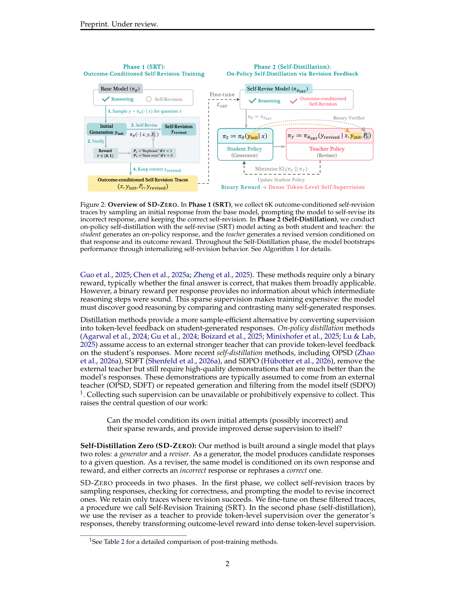
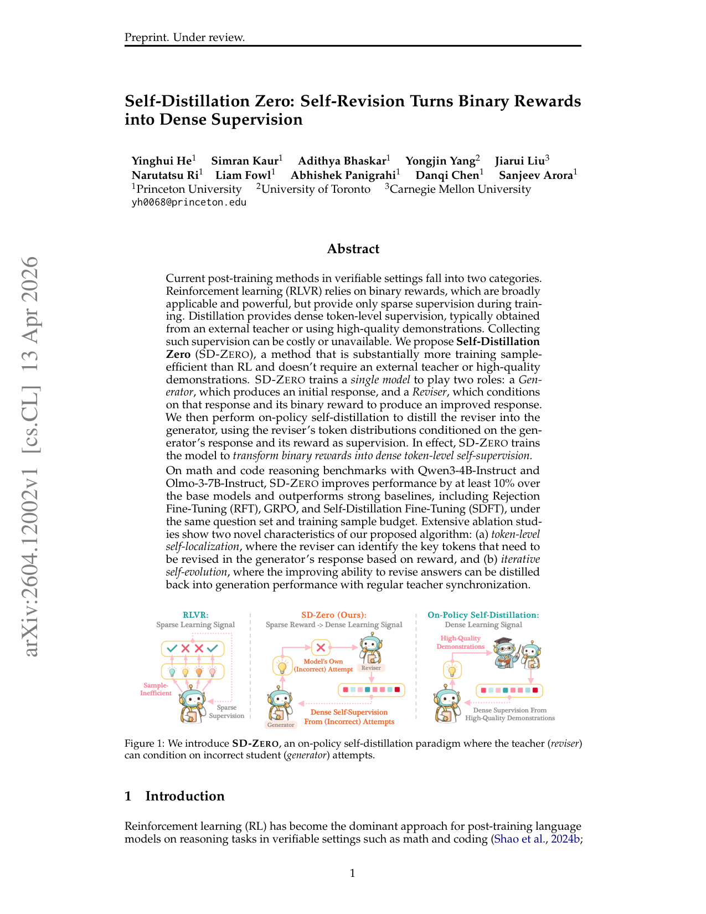

`sd_zero_self_revision | Self-Distillation Zero (SD-ZERO): Self-Revision Turns Binary Rewards into Dense Supervision | Princeton + 多伦多大学 + CMU；Yinghui He / Danqi Chen / Sanjeev Arora 等 | arXiv 2604.12002 v1 (2026-04-13)，cs.CL | L?·On-Policy 自蒸馏/Self-Revision 线·**极高相关**（无老师 on-policy 自蒸馏、二值奖励变稠密、与项目 OPD 直接同族）`

> 档位：**deep**（全字段三层 + 结构化抽取）。所有内容基于已下载 PDF 正文（_txt_sd_zero_self_revision.txt，正文 ~9 页 + 附录）。**最该对标 TSRD/MTP+OPD 的两篇之一（与 SDPO 并列）。**

══ 第一层：一眼看懂 [light] ══

- 🟦 **TL;DR**：只有二值奖励(对/错)、且**没有外部老师、没有高质量示范**,怎么把稀疏奖励变稠密监督?SD-ZERO 让**同一个模型演两角**:**Generator**(生成初答)+**Reviser**(看着自己的初答和它的二值奖励,产出改进答)。两阶段:**Phase1 SRT(自修订训练)**——采初答→验对错→提示模型自修订(对:"Let me rephrase";错:"Wait...let me start over"),只留"改对了"的轨迹微调(6K 条),同时训 revision 与 generation 两损失;**Phase2 自蒸馏**——冻结 SRT 当 teacher(reviser),student(generator)出 on-policy 答,teacher 据该答+奖励产 token 分布,student 用 KL 去匹配⇒把"会修订"内化进"直接生成"。Qwen3-4B/Olmo-3-7B 提升 \(≥10\%\) over base、超 RFT/GRPO/SDFT(同题集同样本预算)。

- **最巧的一步**：抽掉 **Phase2 自蒸馏**只剩 SRT,模型会**答得极长**(显式自修订行为冗长)且每题要采多个答构造修订轨迹(不省样本)——Phase2 把修订能力蒸回生成器,**响应长度砍约 2×**、每题只需 1 个答(样本高效)、性能再涨。故 Phase2 是"训练+推理效率"的命门;而"reviser 能条件于自己的错答"是区别于 SDFT/OPSD(需高质量示范)的核心 Δ。

══ 第二层：为什么做（写透，重点） ══

- **研究背景**：可验证域(math/code)的后训练分两派——**RLVR**(只需二值奖励、广泛适用强大,但训练中只给稀疏监督)和**蒸馏**(给稠密 token 级监督,但通常需外部 teacher 或高质量示范)。【原文 摘要 + §1】

- **解决的具体痛点**：**两派各有死穴**。(1) RLVR:每条回答只一个二值奖励,**不告诉哪个中间推理步是对的**,稀疏监督使训练昂贵(模型得靠对比海量自生成回答才能发现好推理);(2) 蒸馏更样本高效,但 on-policy 蒸馏(Agarwal 2024)**需外部更强 teacher**;更新的自蒸馏(OPSD/SDFT/SDPO)去掉了外部 teacher 但**仍需比模型回答好得多的高质量示范**(来自外部 teacher 或模型反复生成+过滤)——收集这些监督**可能不可得或代价高昂**。中心问题:**模型能否条件于自己的初始尝试(可能是错的)及其稀疏奖励,给自己提供改进的稠密监督?**【原文 §1】

- **相关工作 & 各自不足**(表2 是核心对比)：
  - **On-Policy Distillation(Agarwal 2024)**：on-policy logit 蒸馏,但**需外部强 teacher**。
  - **OPSD/SDFT**：去掉外部 teacher,但**需高质量示范(通常来自外部 teacher)**;SDFT 要 gold solutions(表8:只给最终答不给 gold solution 时 SDFT 大幅变差)。
  - **SDPO(Hübotter 2026,姊妹工作)**：去掉外部 teacher,但**需模型反复生成+过滤得到的高质量示范/成功 rollout** 作隐式反馈。
  - **RFT(拒绝采样微调)**：在正确自生成轨迹上微调,但**完全丢弃错误推理**(不保留失败上下文)。
  SD-ZERO 定位:**唯一既不需外部 teacher、也不需高质量示范——只需模型对自己初答的二值奖励**。【原文 §1 + §3.1】

- **动机链**：现状(RLVR 稀疏低效 vs 蒸馏样本高效但要 teacher/示范) → 缺陷(高质量示范不可得/昂贵) → **核心问题:能否让模型条件于自己(可能错的)初答+二值奖励,自己给自己稠密监督?** → 但模型默认 generator 强、reviser 弱(图3) → **所以 Phase1 SRT 先用少量自生成修订轨迹强化 reviser(同时保 generator)** → 但 SRT 后模型显式自修订导致响应极长、且构造修订轨迹要采多个答(不省样本) → **所以 Phase2 自蒸馏把 reviser 能力蒸回 generator(砍长度、每题只需1答)** → 为什么不用 SDFT/RFT?SDFT 要 gold solution、RFT 丢弃错误上下文(本文核心反驳)。【原文 §1+§2+§3.2】

- **与最近邻工作的 Δ**：
  - **vs SDPO(姊妹工作)**：两者都 on-policy 自蒸馏、把稀疏信号变稠密。但 **SDPO 的 self-teacher 条件于富文本反馈或同组成功 rollout**(需成功 rollout 作隐式示范);**SD-ZERO 的 reviser 条件于"自己的错答 + 二值奖励 + 控制短语(rephrase/start over)"**——**关键 Δ:teacher 能直接条件于错答本身做修订,不需要任何成功示范**(连 SDPO 的"同组成功 rollout"都不需要)。且 SD-ZERO 显式有 Phase1 SRT 解锁修订能力。
  - **vs SDFT/OPSD**：它们 teacher 条件于高质量示范/gold solution;SD-ZERO Δ 是 **teacher 条件于模型自己的(可能错的)尝试 + 二值奖励**(表8 证明 SDFT 缺 gold solution 即崩)。
  - **vs RFT**：RFT 只留正确轨迹、丢弃错误;SD-ZERO Δ 是**保留失败尝试作上下文**让模型从自己的错误学(SRT 的 outcome-conditioned 结构),在难题(AIME25/HMMT25/LCB)上增益尤大。

══ 第三层：怎么做 + 靠不靠谱 ══

- **方法流水线**(图2 + Alg.1,数据集切成 N1/N2 两不相交子集)：
  ① **Phase1 SRT(自修订训练,§2.1,N1 子集)**：对每题 \(x\) 采多个初答 \(y_{init}∼π_θ\) → 二值验证 \(r∈\{0,1\}\) → 构造修订 prompt 含控制短语 \(P_r\)(\(r=1\)→"Let me rephrase";\(r=0\)→"Wait, this response is not correct, let me start over")→ 同模型产修订 \(y_{revised}∼π_θ(·|x,y_{init},P_r)\) → **只留改对的轨迹** 成 D_REVISION。训练**两损失**:**\(L_{revision}\)**(式1,条件于 \(x,y_{init},P_r\) 产 \(y_{revised}\),学自修订)+ **\(L_{generation}\)**(式2,只条件于 \(x\) 产完整正确答,保生成能力),\(L_{SRT}=\)两者和(式3)。
  ② **Phase2 Self-Distillation(§2.2,N2 子集)**：student \(θ:=θ_{SRT}\) 出 on-policy 答 \(π_θ(·|x)\);**teacher 冻结在 \(θ_{SRT}\)**,条件于 generator 的答+二值奖励产 token 分布 \(π_{θ_{SRT}}(·|x,y,P_r)\);student 最小化 **\(KL(π_θ(·|x,y_{<t}) ‖ π_{θ_{SRT}}(·|x,y,P_r,y_{<t}))\)**(式4)。把修订行为蒸回直接生成。
  ③ **iterative self-evolution(§3.4)**：Phase2 也提升模型修订能力,故**一个 epoch 后把 teacher 同步为更新后的 student**,继续训练→再涨 \(≥3\%\)(图5)。
  输出:把自修订内化进直接生成、token 高效的策略。

- **逐组件必要性**(消融充分,§4.3)：
  - **SRT 两损失(\(L_{revision}\) + \(L_{generation}\))**：**有消融**(表11)。只 \(L_{generation}\)→保生成但弱修订;只 \(L_{revision}\)→提修订但几乎不提生成。**两者互补缺一不可**(\(L_{revision}\) 引出自修订、\(L_{generation}\) 把它转成更强生成)。
  - **Phase1 SRT(对 Phase2 的必要性)**：**有消融**(表12)。直接对 base 做 Phase2(无 SRT)→仅边际提升、不提修订能力。**SRT 是 SD-ZERO 生效的前提**。
  - **Phase2 Self-Distillation**：**有对比**(表1)。在 SRT 基础上再 +2.7%(Qwen)/+1.2%(Olmo),**响应砍 2×**(图3/6),且**每题只需1答(样本高效)**(SRT 要采多答构造修订轨迹)。
  - **correctness 过滤修订轨迹**：附录G 证明重要(只留改对的)。
  - **数据分配(SRT vs Self-Distillation)**：**有消融**(表13)。给 SRT 更多数据只略提 SRT 模型、不提最终性能;**给 Self-Distillation 更多数据最好**(SRT 解锁能力后,Phase2 更有效地用数据蒸成强生成)。
  - **teacher 同步**:**有对比**(图5),同步后再涨 \(≥3\%\) 无饱和迹象。

- **关键机制/公式直觉**：
  - **outcome-conditioned 控制短语(\(P_r\))**：直觉是"用一句话告诉模型该干嘛"——对了就"换个说法"(rephrase,常更短)、错了就"等等不对,重来"(start over,critique+regenerate)。这把二值奖励变成可执行的修订指令。
  - **Phase2 KL 蒸馏(式4)= 二值奖励→稠密 token 自监督**：直觉是"reviser 看过(答+奖励)后的 next-token 分布,就是给 generator 的稠密目标"。**token-level self-localization(§4.1,图4)**:reviser 虽只收二值 r,但其 KL 信号**集中在少数关键 token**——错答(r=0)KL 质量集中在出错 token(faulty 论证大正 KL、正确替代大负 KL),对答(r=1)KL 平坦(主要保留)。即**把标量变成双向 token 级信号:既定位错误又指向更优替代**。
  - **内化(internalization,§4.2,图6)**:SRT 阶段响应变长、显式 revision 关键词("Wait/start over")变多;Phase2 阶段两者都降但准确率继续升——模型从"显式回溯"转向"内化的 pitfall-aware 主动推理"(图6 例:SD-ZERO 模型不回溯、直接预判陷阱导向正确答)。
  - **iterative self-evolution**:teacher 也在变强,定期同步=滚动 bootstrapping,只需初答+二值奖励在 teacher 上下文里。

- **实验与证据**：
  - **数据集/设置**：base 模型 **Qwen3-4B-Instruct / Olmo-3-7B-Instruct**;训练 OpenR1-Math(15K 竞赛/奥数,有验证解)+ Codeforces(7.5K cpp + 7.5K py);评测 8 个 benchmark(AIME24/25、HMMT25、MATH、AMOBench、OpenR1、Codeforces、LiveCodeBench);temp 0.7,训练 16K/评测 32K token 上限,avg@8。**所有方法 compute-equalized**(同题集、同生成预算)。【原文 §3.1】
  - **核心主张证据**：(1) **SRT 单独就超所有基线**(表1):6K 自修订轨迹→Qwen +7.8%/Olmo +9.2%,超在 15K 上训的 SFT(DeepSeek-R1 示范)/RFT/GRPO/SDFT;(2) **SD-ZERO 总增益**:Qwen +10.5%/Olmo +10.4% over base,超 GRPO/SDFT 至少 4.8%;(3) **Phase2 砍 token 2×**(图3)且 pass@8 也涨(表7,非仅锐化分布);(4) **SRT 真学会用奖励修订**(图3 Generate-then-Revise:base 修订只 +1.1%,SRT +5.0%,SD-ZERO +5.3%);(5) **iterative self-evolution**(图5):同步 teacher 后第二阶段再 +3%。
  - **baseline 公平性**：**compute-equalized**(同题集、按模型生成回答数归一),且诚实指出"GRPO 可能从更多 epoch 受益,本文是 single-epoch 预算下比较";SDFT 给 gold solution(SD-ZERO 只需二值奖励,对 SD-ZERO 不利的设置)。**对比相当公平且严格**。
  - **"看着强但需警惕"的点**：(1) **仅 instruct 模型(短回答)**——Limitations 明确未扩到 thinking 模型(长 CoT 有 false start/部分纠正,难区分"探索"与"真错误"),附录F 还给了 SDFT 在 thinking 模型上反而掉点的预警证据;(2) **仅 math/code 可验证域**;(3) **大部分增益来自 SRT(7.8-9.2%)而非 Phase2(1.2-2.7%)**——Phase2 主要贡献是"token 效率 + 样本效率"而非绝对性能(作者诚实论证 Phase2 价值在效率);(4) 4B/7B 规模,更大模型未验。

- **假设与失效边界**：
  - 【原文 §2.1 + §4.3 表12】**关键假设:base 模型"生成强、修订弱"且被提示修订错答时有能力产出改对的修订**(否则 SRT 收集不到正例);**无 SRT 则 Phase2 几乎无效**(表12)。
  - 【原文 Limitations】**仅 instruct 模型(短回答),未扩 thinking 模型**——长 CoT 的 false start/部分纠正难与真错误区分、难做 token 级信用分配(附录F:SDFT 在 thinking 模型上掉点)。
  - 【原文 Limitations】**仅可验证域(math/code)**;无可验证奖励的域是开放问题(建议用元认知信号如 consistency/self-correction 定义奖励)。
  - 【推断,依据表8】**对模型本就答不对/修订也救不回的难题退化**;且 reviser 的修订质量上限受 base 自修订潜能约束。

- **祛魅总结**：
  - **真贡献(硬货)**：(1) **reviser 能直接条件于"自己的错答 + 二值奖励"做修订** 是相对 SDFT/OPSD/SDPO 的实质突破——**真正去掉了"高质量示范/成功 rollout"的依赖,只需二值奖励**(表2 定位 + 表8 SDFT 缺 gold solution 即崩的对照);(2) **token-level self-localization**(图4)用干净实验证明"二值奖励经 reviser 变成定位错误+指向替代的双向 token 信号";(3) **两阶段分工(SRT 解锁修订 / Phase2 内化进生成砍长度+样本高效)** + 充分消融(两损失表11、Phase2-only 表12、数据分配表13);(4) **iterative self-evolution**(teacher 同步,图5)给"无外部老师的持续自进化"提供范式;(5) **compute-equalized 的严格对比** + 诚实暴露增益主要来自 SRT。【推断】
  - **包装/营销成分**：(1) **"Zero(无老师无示范)"是真卖点但要看清**——它**强依赖 base 模型的自修订潜能**(无 SRT 则 Phase2 失效,表12);(2) **绝对增益主要来自 SRT(7.8-9.2%),Phase2 只 +1.2-2.7%**——Phase2 的真实价值是 token 效率(砍2×)与样本效率,而非性能,作者诚实地专门论证了这点;(3) **仅 instruct 短回答模型 + math/code**,thinking 模型上有反例预警(附录F);(4) 4B/7B 规模。【推断】总体**包装克制、对比严格、自我批判充分**,是一篇硬核诚实的工作。
  - 作者**非常诚实**:Limitations 主动给出 thinking 模型的失败预警(附录F SDFT 掉点)、明确增益主要来自 SRT 并专门论证 Phase2 的效率价值、compute-equalized 严格对齐。【推断】

══ 结构化抽取（供全景汇总，必填） ══

- 🎯 **机制速览 6 轴** [light]：

| 轴 | 内容 |
|---|---|
| 学什么信号 | **二值奖励 \(r∈\{0,1\}\)(答案对/错验证器)** → 经 reviser 条件化(错答+奖励+控制短语)转成 token 级稠密自监督(双向:定位错误+指向替代);**不假设有 gold 解/外部老师/高质量示范** |
| 改什么 | **参数**(单模型权重;Phase1 SFT 两损失 \(L_{revision}+L_{generation}\) + Phase2 on-policy KL 蒸馏) |
| 何时改 | **离线两阶段**(Phase1 在 N1 子集 SFT、Phase2 在 N2 子集 on-policy 自蒸馏);支持**多轮 teacher 同步**做迭代自进化(图5) |
| 免梯度? | **否**——两阶段都梯度更新;teacher 在单轮内冻结(\(θ_{SRT}\)),轮间可同步 |
| 记忆-技能生命周期 | **无外部记忆**;"技能"=被内化进权重的自修订能力;teacher/student 是同模型两角色,定期同步=技能滚动复用(iterative self-evolution) |
| 防遗忘机制 | **KL 投影 + 隔离 + on-policy 性质**:Phase2 是向冻结 reviser 的 KL;Phase1 的 \(L_{generation}\) 项专门**保留原生成能力**(防只会修订不会生成);跨任务遗忘未专门讨论(但 on-policy 蒸馏一般遗忘较少) |

- ⑦ **开源代码 + 框架/harness**：**原文未直接给 GitHub 链接**(Preprint under review;附录C 给训练细节)。**框架：Phase1 标准 SFT(两损失);Phase2 on-policy KL 自蒸馏**;GRPO 基线用 **DAPO 变体**(Yu 2025)。模型 Qwen3-4B-Instruct/Olmo-3-7B-Instruct。**判定:两阶段 SFT+自蒸馏自研 pipeline,公开代码待核。**【原文 §3.1 + 附录C】
- 💰 **资源/成本与可扩展性**：**样本高效是核心卖点**——SRT 仅 6K 自修订轨迹(超在 15K 上训的基线);**Phase2 每题只需 1 个回答**(vs GRPO 需一组采样、SRT 需多答构造修订轨迹);**compute-equalized 对比下 SD-ZERO 性价比最高**(best performance per model generation)。推理时响应砍 2×(图3)进一步省。base 4B-7B,成本中等偏低。【原文 §3.3 + 附录C.2】

- 🎯 **对"探索-巩固"idea 对标** [light]：**强支撑 + 高度可借（与 SDPO 并列最该对标）**。与 SDPO 同族、且**更贴 path-recovery**——**Reviser 条件于错答+二值奖励做修订,再把修订蒸回生成器**正是"出错路径→纠错→巩固进策略"的完整闭环;**Phase1(SRT 解锁自修订=探索找对答)↔ Phase2(KL 蒸回直接生成、砍长度=巩固内化)** 是"探索-巩固"两阶段的干净落地。可迁移积木:①**generator/reviser 单模型双角免外部老师/免示范**(比 SDPO 更彻底,连成功 rollout 都不需要,只需二值奖励);②**"二值奖励→token 级双向自监督"**(token-level self-localization,图4)的转换机制——可与 MTP 前瞻信号组合(把"reviser 条件于错答+奖励"换成"条件于 MTP 前瞻探针");③**L_generation 防遗忘项**(保生成能力)+ **teacher 同步做迭代自进化**;④**"显式修订→内化进直接生成"(图6)** 正是"教 path-recovery 后内化"的范式,与本项目"单点接管教 path-recovery"互补。其 Limitations(thinking 模型/长CoT 难区分探索与真错误)恰好是 **MTP 前瞻探针可补的缺口**(前瞻能区分"productive exploration"与"genuine error")。

- 🔭 **开放问题/未来方向**：
  - 【原文 Limitations】扩到 **thinking 模型(长 CoT)**——挑战在区分 productive exploration 与 genuine error、token 级之外的信用分配;扩到**无可验证奖励的域**(用元认知信号如 consistency/self-correction 定义奖励)。
  - 【推断】把"reviser 条件于错答+二值奖励"换成"条件于 MTP 前瞻信号";多轮 teacher 同步的饱和点与最优轮数;更大模型上验证。

- 🖼 **关键图 top-2** [light]：
  
  这是**原文 Fig.2(方法总览)**:Phase1 采初答→验证→按奖励给"rephrase/start over"提示→留对的轨迹微调(两损失);Phase2 student 出 on-policy 答、teacher(reviser)据答+奖励产分布、student 最小化 KL。选它因为它把"二值奖励→稠密 token 自监督"的两阶段机制完整画出。
  
  这是**原文 Fig.1(范式定位图)**:左 RLVR 稀疏低效、中 SD-Zero 用自己(可能错的)尝试产稠密自监督、右传统 on-policy 蒸馏依赖高质量示范。选它因为它一眼点明本文卡位——"teacher 能条件于错答(而非高质量示范)"这一独特点。
