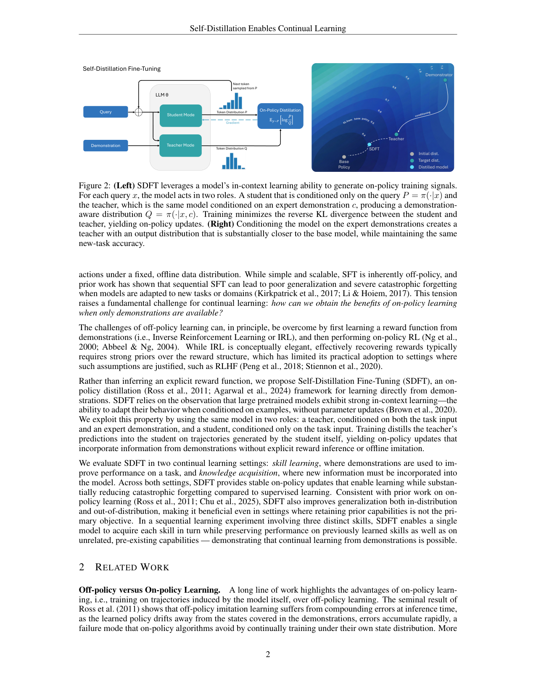
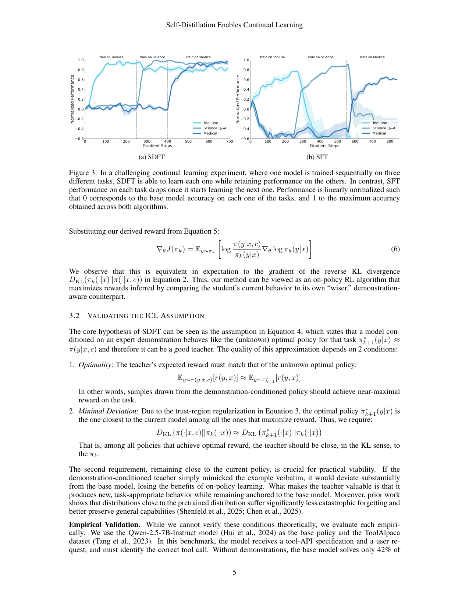

`sdft_selfdistill | Self-Distillation Enables Continual Learning (SDFT) | MIT Improbable AI Lab + ETH Zurich（Idan Shenfeld / Mehul Damani / Jonas Hübotter / Pulkit Agrawal；RL's Razor 的同组接力作） | 2026-01（arXiv:2601.19897 v1，27 Jan 2026，Preprint） | L5 巩固 + L4 反思内化·on-policy 蒸馏从示范学（无 reward） | 相关性 High（PLAN 七大种子方向之一,与 rls_razor 互为姊妹）`

> 【档位】deep 全档。基于下载的真实 PDF 正文（21 页,主体 §1–§5 + 附录 A 消融/B 训练评测细节）。三标注：【原文】直接来自论文 /【推断】我的有据判断（附依据）/【待核】拿不准的关键事实。
> ⚠️ 本篇把姊妹篇 `rls_razor` 的机理("on-policy 走 KL 最小路径 → 少遗忘")**工程化落地**:在没有 reward、只有专家示范的常见场景下,如何也拿到 on-policy 的少遗忘红利。按子代理指令对"on-policy 少遗忘机理"与"探索-巩固 idea 对标"重点写透。

---

## ══ 第一层：一眼看懂 ══

- 🟦 **TL;DR**：【原文】姊妹篇 RL's Razor 已证明"on-policy 学习少遗忘",但 on-policy 通常要靠 RL,而 RL 需要 reward——现实里很多时候**只有专家示范(demonstration),没有 reward**,这时大家只能用 SFT,而 SFT 是 off-policy、会灾难性遗忘。SDFT 的招:**让同一个模型分饰两角**——① **教师模式**:把模型 condition 在"问题 x + 一条专家示范 c"上,得到分布 `Q = π(·|x,c)`(它见过示范,所以答得对);② **学生模式**:只 condition 在问题 x 上,`P = π_θ(·|x)`。训练时**从学生自己采样**轨迹 y,最小化学生对教师的**反向 KL** `KL(π_θ(·|x) ‖ π(·|x,c))`。因为轨迹是学生自己生成的,这就是 on-policy;因为教师只是"同一个模型看了示范后的自己",所以教师天然贴近基座(KL 小),把 RL's Razor 的"KL 最小"红利接了过来。结果:在技能学习(Science/Tool/Medical)和知识注入(2025 灾难维基)上,SDFT **新任务比 SFT 学得更好、旧能力几乎不掉**;在"连续学 3 个技能"的序列实验里,SDFT 能逐个累积技能不回退,而 SFT 学下一个就忘上一个。

- **最巧的一步**：【原文】**In-Context Assumption(§3.1, Eq.4)**:"模型 condition 在示范 c 上的分布 `π(·|x,c)`,近似等于该任务的(未知)最优下一步策略 `π*_{k+1}`"。**抽掉它**整个方法就失去理论依据:正是这一假设让"自蒸馏"摇身变成 **逆强化学习(IRL)**——§3.1 推导出隐式奖励 `r(y,x,c)=log π(y|x,c) − log π_k(y|x)`(教师比学生多出来的对数概率就是"奖励"),并证明对这个奖励做 on-policy 策略梯度**在期望上等于**反向 KL 蒸馏(Eq.6 = Eq.2)。**为什么是它**:① 它把"无 reward"难题转化为"用 ICL 当 reward 推断器",绕开传统 IRL 需要强结构先验、难 scale 的老毛病(§2 IRL 段);② 它依赖的两个条件都被实测验证(§3.2):**最优性**——示范条件下教师在 ToolAlpaca 上达 100%(基座仅 42%)、人工查 50 条 CoT 均语义正确(说明教师在"重建正确推理"而非"抄答案");**最小偏移**——教师对基座的 KL 仅 0.68 nats,而 SFT 模型偏到 1.26 nats(几乎两倍),正是 trust-region 要求的"既对又近"。这一步是"无 reward 也能 on-policy"成立的命门。

---

## ══ 第二层：为什么做（写透） ══

- **研究背景**：【原文】基础模型部署后是静态的——推理时能靠检索/prompt 临时改行为,但**不更新参数**去获取新技能、内化新知识、从经验改进(§1)。要造"会持续学习"的下一代模型,必须解决持续学习:学新不忘旧。近期一批工作(Shenfeld 2025 即 RL's Razor、Chen 2025)指出 **on-policy 学习是少遗忘的关键**,但成功的 on-policy 几乎都在 RL 框架里、需要显式 reward。
- **解决的具体痛点**：【原文】① **现实缺 reward**:很多场景奖励不可得或难定义,学习只能从专家示范走,而主导范式 SFT **天生 off-policy**——只在专家诱导的状态上训练,test 时策略漂移到没见过的状态,误差复合(Ross 2011 的经典结论),且导致灾难性遗忘(§1)。② **IRL 这条理论上优雅的路不好走**:先从示范学 reward 再 on-policy RL,但传统 IRL 需要对 reward 结构的强先验(最大熵假设 Boltzmann 最优、对抗 IRL 假设可分类、偏好 IRL 需正负对),**不 scale**(§2)。痛点凝成一句:**只有示范时,如何拿到 on-policy 学习的好处?**
- **相关工作 & 各自不足**（§2）：
  - **off-policy vs on-policy**(Ross 2011 / Agarwal 2024 / Chu 2025 / Shenfeld 2025 / Lai 2025)——【原文】一致表明 on-policy 泛化更好、迁移更强、少遗忘;本文目标就是把这红利搬到"只有示范"的场景。
  - **IRL**(Ng 2000 / Ziebart 2008 / Ho-Ermon 2016 / RLHF)——【原文】需强结构先验才能让 reward 可辨识,本文不显式推 reward,而用 ICL 提取 on-policy 信号。
  - **Context Distillation**(Bai 2022 Constitutional AI / Snell 2022)——【原文】最接近的一条线:用"condition 在额外信息上的模型"教"没该信息的自己"。但已有做法是 **offline 蒸馏 + 静态 context**(few-shot/行为准则)。**SDFT 的两点关键 Δ**:① **on-policy**——学生在自己诱导的轨迹分布上训练,教师能即时纠正"学生会犯的错"(off-policy 蒸馏做不到);② **逐实例动态 condition**——给教师的不是固定 prompt 前缀,而是**为每个 query 选的特定示范 c**,让教师表达细粒度任务意图而非单一全局先验。二者合起来,使 context distillation 不再只是"prompt 压缩",而成了"IRL 式提取示范背后推理"的机制。
- **动机链**：现状(部署模型不会学)→ on-policy 是少遗忘关键但需 reward → 现实常只有示范、SFT 又 off-policy 会忘 → IRL 理论上能补但需强先验不 scale → **能否不显式推 reward,而用大模型现成的 ICL 能力把示范变成 on-policy 信号?** → 同一模型分饰师生、condition 示范当教师、学生采样做反向 KL → 证明它等价于对"ICL 隐式奖励"的 on-policy RL(§3.1)→ 实测教师"既对又近"(§3.2)→ 上桌比 SFT/DFT/Re-invoke 全面好(§4)。【推断】"为什么不用更简单的现成做法":更简单的是"从教师离线采样再 SFT"或"固定 context 离线蒸馏",但 §4.6 的消融(Fig 6)证明二者都不如 on-policy——逻辑链因此闭合,且这个消融正是把"红利来自 on-policy 而非教师质量"钉死的关键。
- **与最近邻工作的 Δ**：
  - **vs RL's Razor(同组前作,本文的理论母体)**：RL's Razor 是"为何 on-policy 少遗忘"的**分析/解释**(需 reward 的 RL 设定);SDFT 是其**算法化落地**——把"走 KL 最小路径"的红利,在**无 reward、只有示范**的场景下用自蒸馏实现。【推断】可以说 RL's Razor 给了 why 与上界(oracle KL-min 分布),SDFT 给了一种在示范场景逼近该上界的 how(用 ICL 教师近似 oracle)。
  - **vs DFT(Wu 2025b,本文 baseline)**：DFT 用重要性采样把离线数据"当作 on-policy 样本"来近似 on-policy 更新;SDFT 是**真 on-policy**(学生真采样)。结果(Fig 4):DFT 减遗忘但仍有明显退化,SDFT 几乎不退化。关键 Δ:近似 on-policy vs 真 on-policy。
  - **vs Re-invocation(Lu & Lab 2025,baseline)**：Re-invoke 是"先 SFT 学新、再用通用 prompt 上的 on-policy 蒸馏**事后修复**被损能力"的两阶段法;SDFT **一步到位**(学习过程本身就 on-policy、不损能力)。【原文】§5 指出 Re-invoke 的多阶段流程算总账反而比 SDFT 慢且效果差。
  - **vs 知识注入的 text-only 自蒸馏**(Eyuboglu 2025 / Kujanpää 2025)——【原文 A.2】它们只用原始语料当 context 做 offline 蒸馏;SDFT 既 condition 文本**又 condition 一条做对的答案**且 on-policy。消融(Fig 7):full text+answer 89% strict ≫ text-only 75% ≫ answer-only 介于其间,证明"答案条件"提供了更强引导。

---

## ══ 第三层：怎么做 + 靠不靠谱 ══

- **方法流水线**（§3,配 Fig 2,核心 = 一个自蒸馏循环 + EMA 教师）：
  1. **构造教师(逐 query,无参数更新)**:对每个问题 x,取一条专家示范 c,用固定模板把模型 condition 成教师 `Q=π(·|x,c)`。模板是:"<Question> This is an example for a response to the question: <Demonstration> Now answer with a response of your own, including the thinking process:"。【原文】这个措辞足以**防止模型逐字抄 c**,而是输出"反映对示范意图理解"的自有回答(靠 ICL)。
  2. **学生采样(on-policy)**:从学生 `P=π_θ(·|x)` 采样一条响应 y(主实验每 prompt **仅 1 条 rollout**)。
  3. **反向 KL 蒸馏(梯度更新)**:最小化 `L(θ)=KL(π_θ(·|x)‖π(·|x,c))`(Eq.1),按自回归分解成 token 级,梯度只对学生 θ 求、教师视为常数(Eq.2)。【原文 A.1】实际用**全解析 per-token 估计器**(对词表求和,方差低;虽对序列级有偏但最稳),不用 token 级 MC(高方差)也不用 Rao-Blackwell(贵且无增益)。
  4. **EMA 教师(稳定关键)**:教师的**权重**不是冻结基座、也不是当前学生,而是**学生参数的指数移动平均 EMA**(§3 末 + A.3)。冻结基座 → 教师跟不上学习进度、效果差;直接用当前学生当教师 → on-policy 反馈环放大噪声、训练发散;EMA 折中——跟得上又平滑(Fig 8 实证)。
  5. **循环**:逐 batch 重复,学生渐强、EMA 教师随之渐强,持续 on-policy 改进(序列多任务时逐任务推进,Fig 3)。
- **逐组件必要性**：
  - **on-policy(学生自采样)**:**有消融且是核心**(§4.6 Fig 6)——"SFT from teacher"和"offline distillation from teacher"都用同一个好教师但 off-policy,二者都不如 on-policy SDFT → 证明红利来自 on-policy 而非教师质量。这是全文最关键的消融。
  - **demonstration-conditioned 教师**:有消融(A.2 Fig 7)——text+answer ≫ text-only,证明示范(尤其答案)条件不可省。
  - **EMA 教师**:有消融(A.3 Fig 8)——冻结基座/当前学生两个极端都坏,EMA 必要。
  - **反向 KL(而非前向)**:【推断】反向 KL `KL(π_θ‖teacher)` 在学生采样下天然 on-policy 且 mode-seeking(让学生收敛到教师的高概率模式);论文用 Eq.6=Eq.2 证明它=对 ICL 隐式奖励的策略梯度。**论文未单独消融"反向 vs 前向 KL"**(标出:这是一个未被隔离验证的设计选择,但理论推导给了它合理性)。
  - **首 token loss masking**:【原文 §5 Learned Artifacts】学生会沾染教师的"Based on the text…"等口头禅;mask 掉前几个 token 的 loss 可压制,**作者自认是 heuristic fix**、非根本解。
- **关键机制/公式（直觉）**：
  - **自蒸馏=IRL(§3.1)**:从 trust-region RL 的最优解 `π*_{k+1}∝π_k·exp(r/β)`(tilted 分布)反解出 `r=β(log π*_{k+1} − log π_k)`;用 In-Context Assumption 把未知的 `π*_{k+1}` 换成可得的 `π(·|x,c)`,得隐式奖励 `r=log π(y|x,c) − log π_k(y|x)`。直觉:**"看了示范的我"比"没看示范的我"在某条回答上多给的对数概率,就是这条回答的奖励**;学生朝"让自己更像看过示范的自己"的方向爬,而由于 trust-region,这个目标天然离基座近。
  - **为何少遗忘(接 RL's Razor)**:on-policy + 教师贴近基座(0.68 vs SFT 1.26 nats)→ 更新走低 KL 路径 → 按 RL's Razor 的遗忘律,遗忘小。SDFT 把"找 KL 最小监督分布"这件 RL's Razor 留给读者的事,用"ICL 教师"给了一个现成的近似。
- **实验与证据**（§4）：
  - **数据/设置**:基座主用 **Qwen2.5-7B-Instruct**,全参微调,**HF TRL 库**,单张 **H200**。两大设定——**技能学习**:Science Q&A(SciKnowEval Chem L-3,示范由 GPT-4o 蒸馏)/Tool Use(ToolAlpaca,自带示范)/Medical(HuatuoGPT-o1,GPT-5-mini 当评测器);**知识注入**:2025 年自然灾害维基(预训练截止后的新事实,~200K token,生成 QA 对约 5× 语料)。旧能力评测套件:MMLU/HellaSwag/TruthfulQA/IFEval/Winogrande/HumanEval(用 LM Eval Harness),3 个随机种子报均值+95% CI。
  - **支撑核心主张的关键实验**:(a) **Fig 4**(技能学习 Pareto)——SDFT 在 Science/Tool/Medical 三任务上 Pareto 前沿全面占优(新任务高 + 旧任务保留高),是 SFT/DFT/Re-invoke 里唯一"学新几乎不损旧"的。(b) **Table 1**(知识注入)——SDFT strict 89%/lenient 100%/**OOD 98%**,SFT 仅 80/95/**80**,CPT 崩(9/37/7),逼近 oracle RAG(91/100/100)——**OOD 98 vs SFT 80** 是最硬的"真内化而非死记"证据。(c) **Fig 3**(序列 3 技能持续学习)——SDFT 逐个累积不回退,SFT 学下一个忘上一个(振荡),这是"真持续学习"的标志性结果。(d) **Fig 6**(§4.6 消融)——on-policy 必要性的因果钉死。(e) **Fig 5 右 pass@k(到 128)**——增益跨所有 k 一致,排除"只是熵塌缩/分布锐化"的平凡解释(对 RL 式方法这是重要的祛魅自检)。(f) **Table 2**(无 CoT 数据训练推理模型)——Olmo-3-7B-Think 上,SFT 把准确率从 31.2 砸到 23.5 且 token 数从 4612 缩到 3273(推理塌缩),SDFT 反升到 43.7 且保住长度(4180)——证明 SDFT 在"只有最终答案、无推理链"时能保住模型自己的 CoT 风格。
  - **baseline 公平吗**:【推断】公平度高。同基座(Qwen2.5-7B),每个 baseline 都做超参扫并取验证集最优 checkpoint(附录 B);on-policy 必要性消融(Fig 6)刻意让所有变体共用同一个教师,只变"on/off-policy",切割干净;还做了 3B/7B/14B 的 scale 消融(Fig 5 左)诚实地暴露了"3B 上 SDFT 反而不如 SFT(−3.3)"的失效区。
  - **"看着强但没答核心问题"的隐患**:【推断】(a) **强依赖 ICL 能力**——3B 模型 ICL 太弱,SDFT 直接输给 SFT(Fig 5 左 −3.3),所以"SDFT 好"的结论**有规模门槛**,小模型场景不成立;(b) 示范质量:Science 的示范是 GPT-4o 蒸馏的、Tool 的是数据集自带的——**示范本身就接近最优**,在"示范噪声大/非专家"时教师质量会塌(作者 §5 future work 自己点出未测);(c) 所有任务都是"学新技能/新知识"型,**作者明说 SDFT 难以做"需要根本改变生成模式"的适应**(如把非推理模型变成推理模型),失效边界清晰。
- **假设与失效边界**：
  - 【原文 §3.1/§3.2】核心 **In-Context Assumption**:`π(·|x,c)≈π*_{k+1}`,要求教师(i)近最优、(ii)对基座 KL 最小。两条件**无法理论证明,只能实测**(§3.2 给了 ToolAlpaca 上的经验证据)——这是方法的根基性假设。
  - 【原文 §5】① **ICL 能力门槛**:小模型(弱 ICL)失效(Fig 5 左);② **不能做激进行为改变**:把非推理模型变推理模型这类"根本改变生成模式"的适应做不到;③ **学习赝迹**:学生会沾教师口头禅,只能 heuristic mask 修复;④ 即便 on-policy,**仍有少量遗忘残留**(只是远小于 SFT)。
  - 【推断】隐式假设:每个 query 都能配到一条"相关且做对"的示范 c;无示范或示范错配时无信号。
- **祛魅总结**：
  - **真贡献(硬货)**:① **把 RL's Razor 的红利搬到无 reward 场景**——一个简单、可 scale、用 HF TRL 单卡就能跑的 on-policy-from-demonstrations 方法,这是真正实用的工程贡献;② **自蒸馏=IRL 的等价推导(§3.1)**——给"用 ICL 教师当隐式 reward"提供了干净的理论解释(反向 KL 蒸馏 = 对 ICL 隐式奖励的 on-policy PG);③ **Fig 6 的 on-policy 必要性消融**——排除"红利来自好教师"的平凡解释,逻辑严密;④ **Table 2 的"无 CoT 数据训推理模型不塌缩"**——一个 SFT 做不到、SDFT 做到的、有实际价值的副产物。
  - **包装/可能高估**【推断】:(a) "Enables Continual Learning"标题偏强——它**减少**遗忘但**未消除**(作者 §5 自承仍有残留),且序列实验只到 3 个任务,更长程未测;(b) In-Context Assumption 是经验假设非定理,在示范质量差/小模型时失效,"通用持续学习方案"的普适性被规模和示范质量双重限制;(c) 成本上 **2.5× FLOPs、4× wall-clock vs SFT**(§5),虽作者辩称比 Re-invoke 多阶段总账划算,但对"只想便宜微调"的用户仍是实打实的开销。

---

## ══ 结构化抽取 ══

### 🎯 机制速览 6 轴
| 维度 | 内容 |
|---|---|
| **学什么信号** | **专家示范(demonstration)** → 经 ICL 教师转成**隐式奖励** `r=log π(y|x,c)−log π_k(y|x)`(无显式 reward、无人工标);本质是"看过示范的自己 vs 没看的自己"的对数概率差 |
| **改什么** | **模型参数**(全参微调权重);不改 prompt/记忆/技能库——示范只用于临时构造教师,不留存 |
| **何时改** | **离线批量**(标准后训练,逐 batch);序列设定下逐任务推进。非 test-time、非 per-step |
| **免梯度?** | **否**(梯度更新;但更新信号是 on-policy 自蒸馏,而非外部标签的交叉熵) |
| **记忆-技能生命周期** | 不适用(无显式记忆/技能库)。"技能"直接内化进权重:写入=on-policy 蒸馏固化;无检索/无淘汰/无共享的外部生命周期。【推断:与 JitRL/记忆类方法正相反——SDFT 把技能写进参数而非外挂经验库】 |
| **防遗忘机制** | **KL 投影(隐式,继承 RL's Razor)**——on-policy + 教师贴近基座(0.68 nats)使更新走低 KL 路径,旧能力少被覆盖;**非显式正则、非 merging、非隔离**,而是靠"on-policy 自蒸馏天然 KL 小"。可与 RL 组合(SDFT 作 RL 初始化) |

### ⑦ 开源代码 + 框架/harness
- 【原文】**代码与数据集**:http://idanshenfeld.com/SDFT （摘要明示"Code and Datasets are available at…"）。【待核】该主页实际是否已挂出可运行代码/数据——本次 P4 仅核 PDF,**未访问主页核实仓库可达性/内容**;〔如需复现请访问该主页〕。
- 框架/harness：【原文 B.1】**训练用 Hugging Face TRL 库**(全参微调,单 H200);旧能力评测用 **EleutherAI LM Evaluation Harness**。【推断】SDFT 的自蒸馏循环(教师 condition + 学生采样 + 反向 KL)应是在 TRL 之上自行实现的训练逻辑(TRL 原生无 SDFT loss),但正文只点名 TRL,故框架明确记为 **HF TRL**。

### 💰 资源/成本与可扩展性
- 【原文 §5】计算开销:相比 SFT,SDFT 约 **2.5× FLOPs、4× wall-clock**(因训练中需 on-policy rollout 生成)。【原文】但比 GRPO 省——SDFT **每 prompt 仅 1 条 rollout**(GRPO 要 group 采样估相对优势),且监督在 **token/logit 级**(比 GRPO 的轨迹级 advantage 更稠密的信用分配)。
- 【原文 B.1】硬件:**单张 NVIDIA H200** 即可跑全参 7B 微调;基座 Qwen2.5-{3B,7B,14B} + Olmo-3-7B-Think。epoch:技能学习 2、知识注入 4(SFT 1 epoch 就过拟合)。
- 【推断】可扩展性:作者论证"模型越大 ICL 越强 → SDFT 增益越大"(3B −3.3 → 7B +4.0 → 14B +6.9,Fig 5 左),即**方法随 scale 越来越有利**——这是难得的"正向 scale 依赖"卖点,但也意味着小模型不适用。

### 🎯 对"探索-巩固"idea 对标（重点写透,子代理指令要求）
- **强支撑 + 几乎是"巩固期(从示范学新技能)"的现成实现**：SDFT 直接对应用户 idea 里"**巩固期如何把新技能固化进权重而不忘旧**"这一环,且是无 reward 场景的可用方案。
  - **可借组件(直接搬进巩固期)**:① **ICL 教师 = 现成的"KL 最小监督分布"近似器**——idea 巩固期若要"学新不忘旧",RL's Razor 说该走 KL 最小路径,SDFT 给出"用 condition 在示范上的自己当教师"这一不需 reward、不需训 reward model 的现成近似;可作为巩固期的默认监督信号生成器。② **EMA 教师稳定技巧**——"巩固期"若做在线/迭代自蒸馏,EMA 教师(跟得上又平滑)是防 on-policy 反馈环发散的关键工程件,可直接复用。③ **隐式奖励 `r=log π(·|x,c)−log π_k(·|x)`**——把"示范"转成稠密 token 级奖励,适合做巩固期的细粒度信用分配(比稀疏终局 reward 友好)。④ **首 token loss masking** 防口头禅沾染,工程细节可借。
  - **与 idea "MTP 前瞻探针/路径恢复"的结合点**【推断】:SDFT 的教师=学生看了示范后的分布,正是一种"前瞻/有正确路径信息的分布";idea 的"path-recovery 单点接管"可与之嫁接——在学生采样将偏离正确路径的**关键步**,用 demonstration-conditioned 教师做单点 KL 接管(而非全程蒸馏),既省算力又精准。SDFT 现在是"全程反向 KL",idea 可把它稀疏化为"关键步接管"。〔依据:SDFT 教师天然提供"正确续写分布",与 path-recovery 的"在岔路口注入正确方向"形式契合;此为我的推断,本文做的是全程蒸馏、未做关键步稀疏接管〕
  - **与姊妹篇的分工对 idea 的意义**:`rls_razor` 给"巩固为何要 KL-min"的第一性原理(why),`sdft_selfdistill` 给"无 reward 时怎么近似 KL-min 监督"的方法(how)——二者合起来几乎构成"探索-巩固"巩固半边的理论+方法底座。
  - **缺口(idea 需补、SDFT 未做)**:① SDFT **只有巩固、没有探索**——它假设每个 query 都有一条做对的示范 c,**不主动探索/不从失败学**(纯 RL 的探索半边它不碰,作者明说 SDFT 与 RL 互补);idea 的"探索期"(主动试错、从负例/失败学)SDFT 完全空缺。② **示范从哪来**:SDFT 不解决"示范获取",idea 若要闭环需配探索期(如 JitRL/RL)产出高价值轨迹当示范,再用 SDFT 巩固——**这正是"探索→巩固"的天然接口**。③ **全程蒸馏 vs 选择性巩固**:SDFT 对所有 token 一视同仁做反向 KL,idea 的"选择性/关键步巩固"是其上的改进空间。④ 长程序列(>3 任务)与遗忘残留累积:SDFT 只验到 3 任务,idea 关心的长寿命持续学习下残留遗忘是否累积未知。
  - **定位**:对 idea 是**巩固期的可借底座 + 互补件**(非竞品)——它把"从示范 on-policy 学新技能"做成可用,但把"探索/示范获取/选择性巩固"留给了 idea 去补。

### 🔭 开放问题 / 未来方向
- 【原文 §5 Future Work】① 与 on-policy RL **组合**:SDFT 作 RL 初始化(序贯),或把示范信号与 reward 信号**混合**(同时);② 进一步压低残留遗忘的互补技术;③ 扩到**非专家/含噪示范**、乃至用户对话等**非结构化数据**(当前只用专家示范);④ 让 SDFT 支持更激进的行为改变(如非推理→推理)。
- 【推断】⑤ 把全程反向 KL **稀疏化为关键步接管**(省算力 + 对齐 path-recovery);⑥ ICL 教师质量的在线监控/校准(In-Context Assumption 失效检测);⑦ 与几何共识/参数融合类巩固法结合,处理多任务 SDFT 间的潜在冲突(SDFT 本身无跨任务冲突消解机制)。

### 🖼 关键图 top-2

- 这是**原文 Figure 2**(方法主图/pipeline,我渲染了含上方插图与正文的整页以保留语境)。左:同一 LLM_θ 两种模式——Teacher Mode 见到 Demonstration、Student Mode 只见 Query,各出 token 分布 Q/P,下一 token 从 P 采样,损失 `E_{y∼P}[log P/Q]`(反向 KL),梯度回学生 → On-Policy Distillation。右:概念图——把模型 condition 在示范上,得到的教师(Demonstrator Teacher)分布**显著比 SFT 更靠近 Base Policy**,同时保住新任务准确率("既对又近")。**选它**:一张图说清全文最巧的一步(用 ICL 教师把示范变 on-policy 信号)+ 少遗忘的来由(教师贴近基座→低 KL),是理解"探索-巩固"巩固期"无 reward 也能 KL-min"的最佳缩略图。

- 这是**原文 Figure 3**(核心发现/主结果图)。把一个模型**依次**在 Tool Use→Science→Medical 三技能上训练,纵轴为各任务归一化性能随梯度步的变化。**SDFT(a)**:学新任务时,已学任务的曲线基本维持高位,呈**累积式上升**;**SFT(b)**:每切换到下一个任务,前面任务性能**急剧跌落**,呈振荡而非累积。**选它**:这是"真持续学习 vs 灾难性遗忘"最直观的对比,直接支撑标题主张,也正是"探索-巩固"idea 追求的"长寿命累积不回退"的目标态可视化——对标 idea 时这张图说明 on-policy 自蒸馏已能撑起多技能累积的巩固骨架。
