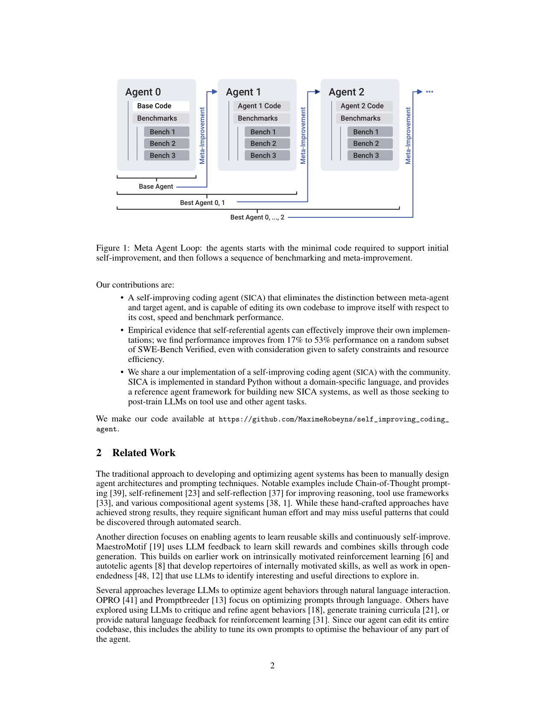
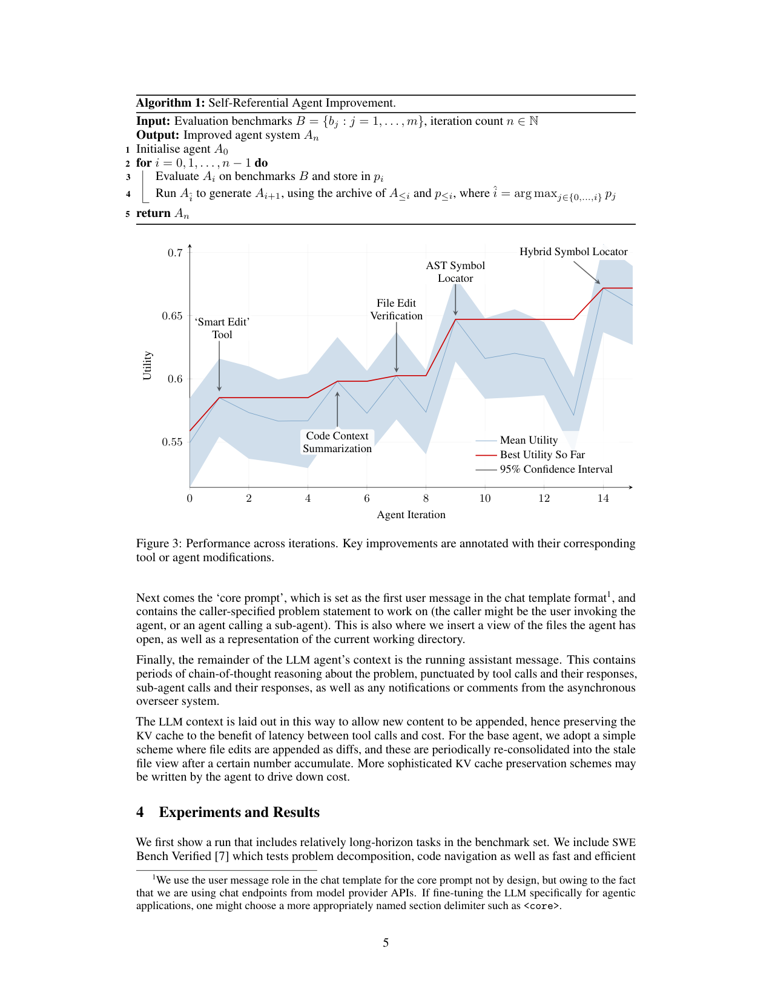

`self_improving_coding_agent | A Self-Improving Coding Agent (SICA) | U. Bristol + iGent AI (Maxime Robeyns, Martin Szummer, Laurence Aitchison) | 2025-04 arXiv v1 → 2025-05 v2 preprint | L4 架构进化(自指 meta-agent)+ L3 工具进化·相关性 High(自进化代表作,综述多处引用)`

---

══ 第一层:一眼看懂 [light] ══

- 🟦 **TL;DR**:给一个**会写代码的 Agent** 配上最基本的编码工具(开/关/改文件、跑 shell、提交答案),然后让它**改自己的源代码**——加新工具、改 prompt、改子 Agent 的编排方式——从而在 benchmark 上越跑越好。关键卖点:**meta-agent 和 target-agent 是同一个东西**(消除了 ADAS 里"另设一个改进器"的分裂),即**完全自指(fully self-referential)**:今天改进出来的更强编码能力,下一轮还能用来更好地改进自己,有望复利滚动。**全程不动模型权重**,纯靠"LLM 反思 + 改代码"这种**免梯度、样本高效**的学习。实测 SWE-Bench Verified 子集从 17% → 53%。【原文 Abstract、§1、Fig.1】
- **最巧的一步(抽掉就垮)**:**"benchmark runner 框架天然把'改进编码 Agent'本身变成一个可被该 Agent 解的编码任务"(self-referential task)+ 从 archive 里按效用挑'当前最强 Agent 当 meta-agent'**(Algorithm 1 第4行 `î = argmax_j p_j`)。抽掉"自指"这一步,它就退回成 ADAS(固定 meta-agent 改 target);抽掉"从档案挑最强当改进器",复利效应(改进能力随迭代增强)就没了。这两点合起来才是"自我改进"区别于"被人/被固定 agent 改进"的本质。

---

══ 第二层:为什么做(写透) ══

- **研究背景**:LLM 要落地必须包成 **agent system**(编排 LLM 调用 + 暴露工具的代码)。agent system 靠各种**手工**提示策略(CoT、ToT、GoT、LLM-Debate、Self-Refine、Expert-Prompting…,Schulhoff 综述列了海量)能显著超过"裸 LLM",但这些都是**人手工试错设计**,只探索了解空间的一小块。
- **解决的具体痛点**:**能不能让编码 Agent 自己发现新提示方案/新工具,而不靠人手工设计?** 手工编排 = ad-hoc、试错、覆盖面窄;ADAS 虽自动化,但**meta-agent 与 target-agent 分离 → meta-agent 不会变强 → 无复利**;且 ADAS 只改"单个 forward 函数",用的是精心设计的 **DSL**(领域专用语言),表达受限。
- **相关工作 & 各自不足(§2,划界很清楚)**:
  - 手工编排(CoT / self-refine / self-reflection / 工具框架 / 组合式 agent):效果强但费人力、漏模式。
  - 技能学习/开放式(MaestroMotif 用 LLM 反馈学技能奖励、内在动机 RL、autotelic agent、open-endedness):侧重学可复用技能。
  - NL 优化行为(OPRO / PromptBreeder 优化 prompt;用 LLM 批评/精炼行为、生成课程、给 RL 文本反馈)——SICA 因能改**整个代码库**,**包含了"调自己任意部分的 prompt"** 这一能力作为子集。
  - 自动 agent 设计(**AgentSquare** 模块化搜索 planning/reasoning/tool/memory;**AlphaEvolve** 编码 agent 做科学发现+优化基础设施→可能加速自身 LLM 训练):更偏**结构化进化搜索**,SICA 更轻量(直接改 Python)。
  - **最近邻 = ADAS**:target/meta 分离、改单个 forward、DSL。**SICA 的 Δ = 完全自指(无 meta/target 之分)+ 操作整个 Python 代码库(无 DSL)**。
  - **划界另两篇"自称自进化"但非编码 agent**:**Gödel Agent**(有 `action_adjust_logic`/`action_read_logic` 等特定工具改自己运行中的小部分,**不是通用编码 agent**,故在 DROP/MGSM/MMLU/GPQA 上评而非编码);**Zelikman 等 self-taught optimizer**(递归自改代码生成,但只在 parity-with-noise/String-Grid-Distance/3-SAT 等算法任务上)。**SICA 自称是"第一个真正的(通用编码)自我改进 agent"**。
- **动机链(现状→缺陷→所以这样)**:agent system 靠手工提示策略提升 → 手工=慢+覆盖窄 → 自动化(ADAS)但 meta/target 分离无复利、DSL 受限 → **所以要做一个'起步即通用编码 agent + 完全自指 + 操作全代码库'的系统**,让"改进能力本身"随迭代增强。"为什么不用更简单的现成做法"——因为 ADAS/Gödel Agent/Zelikman 各自缺"通用编码 + 自指 + 复利"中的一项。**为什么先做编码 agent**:因为"agent 本身就是代码写的",会写代码的 agent 天然能改自己(§3)。

---

══ 第三层:怎么做 + 靠不靠谱 ══

### 方法流水线(Meta-Agent Loop,Fig.1 + Algorithm 1)
1. **初始化 A0**:一个"最小但够用"的编码 agent(见下"初始 agent 配置")。
2. **评测当前代 Ai**:在 benchmark 集 B 上跑,存性能 pi。
3. **挑 meta-agent**:从 archive(A≤i 及其分数 p≤i)里**按效用挑分最高的那一代 Aî 当 meta-agent**(`î=argmax p`)。
4. **自我改进**:让 Aî 翻阅 archive(看历代做了什么、效果如何)→ **识别一个改进点 → 在代码库里实现它 → 产出 Ai+1**。
5. **回到 2**,迭代 n 次。**因不更新权重,效用分数只用来"挑下一个 meta-agent + 下一轮 base agent",不做任何梯度更新**(§3 明确)。
   - **效用函数(公式1–2)**:`U = 0.5·p_score + 0.25·(1−min(1, cost/\$10)) + 0.25·(1−min(1, time/300s))` —— 把**性能、$成本、墙钟时间**三项加权;超时(>300s)给 τ=0.5 的半惩罚 `U_final=U(1−τ)`。**即"又准又快又省"才算好 agent**,这把成本/速度也纳入了进化目标(而非只追准确率)。

### 初始 agent 配置(§3.1,这些都可被自我改进)
- **工具**:开/关文件(进/出 context)、覆写文件、执行 shell、计算器、提交最终答案、子 agent 返回值、提前退出、**archive 分析工具**(抽取历代 agent 的高层统计)。
- **子 agent(sub-agents)**:像工具一样被调用(传参→返字符串)。初始三个:**coding agent / problem-solver agent / reasoning agent**。两大作用:① 让 benchmark 任务**全自主**跑(主入口 agent 分解任务、委派/提问给子 agent);② **管理 context 长度**——子 agent 返回时其 context 自然丢弃,只把"摘要"返回主 agent(meta-improvement 一轮可达 ~1 小时,必须省 context)。
- **异步 overseer(监工,关键稳定器)**:一个**并发线程里周期运行的 LLM**(默认每 30s 或关键事件触发),读系统的**callgraph + 事件流(LLM 消息/工具调用/子 agent 调用)**,判断有无**病态行为/偏离原任务**;可**注入消息**提醒当前 agent(或其父),严重时**直接取消执行**。防止长程自主跑时陷入死循环/跑偏。
- **Context 结构(Fig.2)**:System Prompt(agent 定义+工具/子agent 文档+系统指令)→ Core Prompt(问题陈述 + 打开的文件 + 目录树,放在首条 user message)→ Assistant Messages(CoT + 工具调用结果 + 子 agent 调用结果 + overseer 通知)。**file edit 以 diff 追加、定期再合并进文件视图**——为的是**保 KV cache**(降延迟与成本)。

### 逐组件必要性 & 消融
- **无传统消融**(不是"去掉组件比性能"),但**Fig.3 的标注本身就是一种"自然消融/归因"**:它把每次效用跃升标注到**agent 自己引入的具体改动**上——'Smart Edit' Tool、Code Context Summarization、File Edit Verification、AST Symbol Locator、Hybrid Symbol Locator。这说明"哪些自创工具带来了提升"是可追溯的。**overseer/子 agent 的必要性靠论证(防跑偏、省 context),未做"去掉它们"的对照**【推断:论文未给 ablation】。

### 关键机制/直觉
- **"免梯度、样本高效的学习"** = 把"经验"存成 **archive(历代 agent 代码 + 分数)**,meta-agent **细读 archive → 一步做出大幅代码修改**。相比 RL 需海量 rollout,这里"一次详尽的档案检视 → 一个高质量改动"非常省样本。**学习的载体是代码与 prompt,不是权重**。
- **复利直觉**:第3行挑"当前最强"当改进器,意味着**改进工具越强,后续改进越可能更好**——这是与 ADAS(固定弱 meta-agent)的本质差异。

### 实验与证据
- **设置**:大多数 agent 用 **Sonnet 3.5 (v2)**,reasoning 子 agent 用 **o3-mini**。15 轮迭代 API 成本 **≈ \$7,000**(meta-improvement 是复杂长程任务,需强模型)。
- **数据集**:**SWE-Bench Verified**(随机 50 题子集)、**LiveCodeBench**(50 题,偏竞赛/理论推理)、**两个 agent 自造的合成 benchmark**(① file-editing:克隆 SWE repo,取连续 commit 间"有意思的"文件编辑,让 agent 把文件改成目标内容,按相似度+成本打分;② symbol-location/codebase 导航:克隆 repo 找符号,要 agent 返回 `path:line:col`)。
- **支撑核心主张的关键数字(Fig.3 + Table 1)**:
  - **SWE-Bench Verified:0.17(iter0)→ 0.53(iter14)**(摘要里的"17%→53%")——主增益区。
  - file-editing:0.82→峰值 0.96(iter6,得益于自创 'smart edit' diff 工具);symbol-location:0.35→0.43(iter11,iter9 加了 AST locator);LiveCodeBench:0.65→0.71(轻微提升)。
  - 同时**平均每题时间下降**(如 iter12 103.9s vs iter0 130.2s),%cached 上升(32.5→~40),体现成本/速度也被优化。
- **baseline 公平吗 / 看着强但没回答核心问题**:
  - **【原文自陈的关键反例(Fig.4,极重要)】**:在**推理任务(AIME 2024 + GPQA Diamond)上几乎无提升**!iter0 agent(Sonnet3.5 + o3-mini reasoning 子 agent)整体 76%,但**o3-mini 单独**就有 AIME 87% / GPQA 79%(high effort)。检视 trace 发现主 agent 常**只是把题甩给 o3-mini 子 agent**,没用上系统全部能力;且 iter4/6 加的"诱导推理"的粗糙组件**反而打断了 reasoning model 的 CoT**,导致掉分。作者称之为 **"Agent Framework Saturation(脚手架饱和)"**:当底层模型本身已很强时,scaffolding 的边际收益趋零甚至为负。
  - 【推断,依据 §5.1 Limitations】SWE-Bench 的"17%→53%"**部分是低基线人为造成的**:5 分钟超时 + 单题成本上限**压低了 iter0 分数**(尤其长程任务),很多早期增益来自"加快文件编辑/降成本"的工程改进,而这些**传统上不太体现在 SWE-Bench 分数里**——即增益被"超时设置"放大了一部分。baseline 是"被自己掐了时间的初始 agent",对"自我改进绝对价值"略有高估。

### 假设与失效边界
- **【原文 §5.1/§5.2】**:① **想新点子难**——LLM 难自主提出真正新颖/可行/有趣的改动(开放式学习老问题);坏点子代价高(长编辑 + 更贵的全 benchmark 重跑)。② **路径依赖/高方差**——初始 feature 想法会强烈影响后续(常变成同一主题的变体),早期烂点子(如"死磕缓存打开的文件")拉低后续质量。③ **静态 benchmark 会被"学完"**——长跑后无东西可学(本文未到饱和,但预见到;用 agent 自造 benchmark 缓解)。
- **【原文 §6 Safety + 推断】失效边界**:**纯脚手架(不改权重)有能力上限**(Fig.4 饱和现象就是证据)——对"模型本身已强"的任务无能为力,甚至有害。【推断:依据 Fig.4 + §7】**对'探索-巩固'的直接启示**:SICA 把"巩固"完全放在**代码/工具层(外部脚手架)**,模型参数零变化 → 凡是需要"把新技能内化进参数"的提升它都做不到,这正是参数级巩固方法(本项目方向)的互补空间。

### 祛魅总结
- **真贡献(硬货)**:① **首个通用编码 agent 的完全自指自我改进系统**(消除 meta/target 之分,操作全 Python 代码库,无 DSL);② 一套**把成本/速度纳入效用**的进化目标 + archive 复利机制;③ **诚实地报告了脚手架饱和(Fig.4)** 这一负面但极有价值的发现;④ 强 **observability(web 界面 + 异步 overseer)** 作为自进化系统的安全缓解范式;⑤ 开源参考实现。
- **包装/营销**:① "17%→53%" 抢眼,但作者自己说低基线部分由超时设置造成、增益不少来自提速降本【原文 §5.1 已诚实标注,非隐瞒】;② "复利/compounding" 是**期望(hopefully)**而非实测验证——15 轮内未见明显加速的复利曲线;③ \$7,000/15 轮的成本说明**该范式很贵**,可扩展性受限。整体**作者对局限相当坦诚**(Limitations/Safety 写得实在),营销成分低。

---

══ 结构化抽取 ══

- 🎯 **机制速览 6 轴** [light]:
  | 学什么信号 | 改什么 | 何时改 | 免梯度? | 记忆-技能生命周期 | 防遗忘机制 |
  |---|---|---|---|---|---|
  | **外部 reward(benchmark 效用 = 性能+成本+时间)+ 自反思**(meta-agent 读 archive 反思) | **harness/代码库**(自己的 Python 源码:工具、子agent、prompt、编排逻辑);**不改模型权重** | **离线批量**(inter-task:跑完整 benchmark 集→挑 meta-agent→改代码→再评,一轮≈1h) | **是**(纯 LLM 反思 + 改代码,零梯度更新) | **archive 即记忆**:历代 agent 代码+分数写入→meta-agent 检索阅读→失败代也保留(当反例);技能=自创工具(smart-edit/AST-locator)持久进代码库 | **隔离式(天然)**:每代是完整代码快照存档,旧代不被覆盖;但**无主动防遗忘机制**,且存在**路径依赖**(新点子被旧点子带偏)——算"反遗忘但易固着" |
- ⑦ **开源代码 + 框架/harness**:**开源,自研框架(无第三方训练框架)**。GitHub: `https://github.com/MaximeRobeyns/self_improving_coding_agent`(master 分支,已 clone `resource/repos/self_improving_coding_agent`,2.8M,完整无 LFS)。**使用框架 = 标准 Python 自研 agent 框架(无 DSL)**;依赖(`base_agent/requirements.txt`)= **anthropic[vertex]==0.42.0 + openai + google-genai**(直连模型 API,**非 veRL/TRL/OpenRLHF**)、pydantic、fastapi/uvicorn(web 观测界面)、GitPython、diff-match-patch(diff 编辑)、swebench、sympy。仓库结构 `base_agent/src/{agents,benchmarks,callgraph,events,llm,oversight,tools}` 与论文 §3.1 完全对应。作者明示这是"供他人构建新 SICA、或**为在工具使用/agent 任务上 post-train LLM**提供参考的 agent 框架"。【原文 §1 + 仓库实测】
- 💰 **资源/成本与可扩展性**:**【原文】15 轮 ≈ \$7,000 API 成本**;单轮 meta-improvement ≈ 1 小时;单题成本上限 \$10、超时 300s。meta-improvement 需强模型(Sonnet3.5 + o3-mini)。**可扩展性差点**:每轮要全 benchmark 重跑评测(昂贵),坏点子代价高。% cached 32~41 体现刻意保 KV cache 降本。
- 🎯 **对"探索-巩固"idea 对标** [light]:**竞品(脚手架路线)+ 重要反例提供者**。SICA 代表"**巩固在代码/prompt 层、零参数更新**"的极端;它的 **Fig.4 脚手架饱和** 是本项目的**核心论据**:当任务需要把能力**内化进参数**(而非外挂工具)时,纯脚手架自进化会饱和甚至有害 → **本项目的"MTP foresight + 参数级 path-recovery 巩固"恰好填这个洞**。**可借组件**:① 把**成本/时间纳入效用**(公式1)防止 agent 越改越慢;② **异步 overseer** 监工机制(防长程探索跑偏,可移植到 path-recovery 的"何时接管");③ **archive(代码+分数+失败反例)** 作为可检索经验库的设计。**注意区分**:SICA 改 harness、本项目改参数/激活,二者正交可叠加。
- 🔭 **开放问题/未来方向**:
  - **【原文 §5.2/§6】**:① **联合更新基础模型权重 + 脚手架**(明确指出 AlphaEvolve 证明了这条路的潜力,建议显式 fine-tune 模型去配合新工具/脚手架)——**这正是 scaffolding 的天花板需要参数侧补**;② **自动设计/curate benchmark** 防静态评测被学完(已用两个自造 benchmark 示范);③ 安全:观测性(observability)+ 在 benchmark 集里加**安全评测**作为每代晋级闸门;但承认"一旦改权重,纯观测不够,需更多安全研究"。
  - **【推断】**(依据 Fig.4 饱和 + 路径依赖):④ 需要机制**对抗 meta-agent 的点子固着/路径依赖**(如强制多样化提案);⑤ 把"自指改进"从纯文本反思升级为**带前瞻(预测改动会不会有用)** 的探索,可降低"坏点子→昂贵重跑"的代价——与本项目 foresight-probe 同向。
- 🖼 **关键图 top-2** [light]:
  - 
    这是**原文 Figure 1**(p.2)。选它因为它是**方法主图**:一图说清"Agent0 → benchmark → meta-improvement → Agent1 → … "的自指循环,以及"Best Agent 0..i"被选作下一轮改进器(复利的来源)。理解 SICA 的"自我改进 = 改自己代码库 + 档案择优"全靠它。
  - 
    这是**原文 Figure 3**(p.5)。选它因为它是**核心结果 + 自然归因图**:utility 曲线随 15 轮上升,且**把每个台阶标注到 agent 自己引入的改动**('Smart Edit' Tool、Code Context Summarization、File Edit Verification、AST Symbol Locator、Hybrid Symbol Locator)——既证明"自我改进有效",又让"哪个自创工具带来提升"可追溯。(注:Fig.4 的"推理任务饱和"虽是最有洞察的祛魅图,但 top-2 取方法主图+主结果图更符合"表现论文精华"的要求;Fig.4 已在正文充分讨论。)

【三标注小结】方法循环/效用公式/初始配置/SWE-Bench 17→53/\$7000/Fig.4 饱和现象/Limitations 三条/Safety 两机制均为**【原文】**;"低基线被超时放大、复利未实证、对探索-巩固是竞品+反例、可借 overseer/effort-utility/archive、需对抗点子固着"为**【推断】**(各附依据);仓库框架(纯Python+Anthropic/OpenAI API,非 veRL/TRL)为**仓库实测**;无未核实关键事实。
