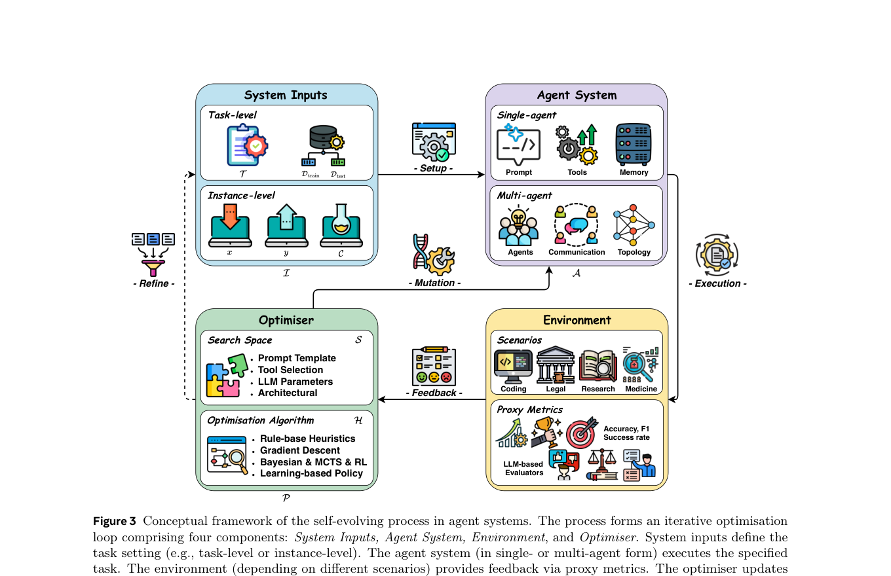
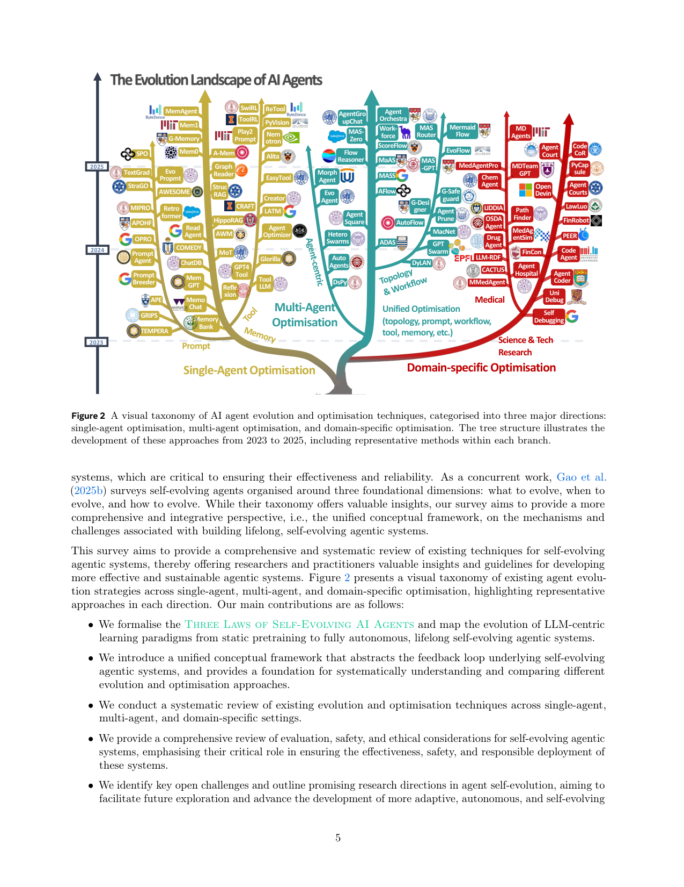

`selfevolve_survey2 | A Comprehensive Survey of Self-Evolving AI Agents: A New Paradigm Bridging Foundation Models and Lifelong Agentic Systems | 格拉斯哥大学 · 谢菲尔德 · 剑桥 · MBZUAI · NUS · UCL 等(EvoAgentX 团队;Jinyuan Fang/Yanwen Peng/Xi Zhang 共一,Zaiqiao Meng 通讯) | 2025-08 首发·arXiv v2(2025-08-31)·cs.AI·综述 | 主题线 L?(自进化 agent 全景综述 —— 本调研"第二锚",与 ASI 综述互补)· 相关性 High(锚)`

> 三标注约定：【原文】= 论文明说；【推断】= 我的有据判断(附依据)；【待核】= 拿不准的关键事实。
> 本篇是**综述(deep 档,但按综述特性产出:重锚架构/分类法,不强套"消融/失效边界")**。

══ 第一层：一眼看懂 [light] ══

- 🟦 **TL;DR**：这是继 Gao et al.(本调研第一锚 survey_self_evolving_agents_asi)之后的**第二篇权威"自进化 AI agent"综述**。核心不是堆论文,而是提出一个**统一的"反馈闭环(feedback loop)"概念框架**把整个领域装进去:任何自进化系统都可拆成 **四个组件——System Inputs(系统输入)→ Agent System(被优化的 agent)→ Environment(环境/反馈)→ Optimiser(优化器)**,优化器的工作被形式化成 `A* = argmax_{A∈S} O(A; I)`(在搜索空间 S 里、用某优化算法 H、按评估函数 O 找最优 agent 配置)。围绕这个框架,综述把方法按**被优化的组件**分三大类——**单 agent 优化**(LLM 行为 / prompt / memory / tool)、**多 agent 优化**(topology / workflow / 通信)、**领域专用优化**(生物医学 / 编程 / 金融 / 法律)。此外还提出**自进化三定律(Three Laws:Endure 安全 > Excel 性能保持 > Evolve 自主演化,仿阿西莫夫机器人三定律的层级约束)**,并把 LLM 学习范式的演进画成 **MOP→MOA→MAO→MASE** 四阶段轨迹(静态预训练 → 在线适应 → 多 agent 编排 → 多 agent 自进化)。最后专章讨论评估、安全、伦理与开放挑战。配套开源仓 **EvoAgentX/Awesome-Self-Evolving-Agents**(论文清单)。【原文 Abstract/§1/§3】
- **最巧的一步**：**把"优化器(Optimiser)"抽象成 `(搜索空间 S, 优化算法 H)` 这个二元组**(§3.5)。抽掉这层抽象,这篇就退化成又一份"按组件罗列方法"的清单;**正是"任何自进化方法 = 在某搜索空间 S 上用某算法 H 优化某目标 O"这一步,让 prompt 优化、记忆优化、workflow 搜索、参数微调这些表面异构的工作能被放进同一张可比较的表里**(S 从 prompt 模板/工具选择 一直到 连续 LLM 参数/架构;H 从 规则启发式/梯度下降/贝叶斯/MCTS/RL/进化策略/可学习策略)——这是本综述区别于第一锚 Gao et al.(按 what/when/how/where 切)的"整合性视角"卖点。

══ 第二层：为什么做（写透·综述=领域地图与定位） ══

- **研究背景**：LLM agent 强但**绝大多数靠人工配置、部署后静态**,难适应动态环境(用户意图变、任务变、工具/信息源变)。手工重配既慢又难扩展 → 催生 **Self-Evolving AI Agents**(能自主、系统地通过与环境交互持续优化内部组件,在保安全、提性能的前提下适应变化)。【原文§1 Definition】
- **解决的具体痛点(综述要填的空白)**：现有 agent 综述要么讲通用架构,要么只覆盖单组件(planning/memory/协作/评估),要么讲领域应用——**对"agent 自进化与持续适应"覆盖不足**,而这恰是迈向 lifelong/autonomous AI 的核心能力。本综述要填这个 holistic 空白。【原文§1】
- **与第一锚(Gao et al. 2025b = survey_self_evolving_agents_asi)的 Δ(关键,直接对标)**：【原文§1 明写】"As a concurrent work, Gao et al. surveys self-evolving agents organised around three foundational dimensions: **what / when / how to evolve**(及 where)。While their taxonomy offers valuable insights, our survey aims to provide a **more comprehensive and integrative perspective, i.e., the unified conceptual framework**"。⇒ **两锚分工**:**Gao(第一锚)= "What/When/How/Where to evolve" 的认知坐标(回答'演化什么、何时、怎么、在哪')**;**Fang(本篇,第二锚)= "Optimiser-Feedback-Loop" 的工程坐标(把每个方法定位成 闭环里哪个组件 + 用什么 (S,H) 优化器)**。本调研应**双锚并用**:用 Gao 的轴给方法归"性质",用 Fang 的框架给方法归"优化机制",两者正交互补。
- **范式演进定位(MOP→MOA→MAO→MASE,Table 1)**：
  - **MOP(Model Offline Pretraining)**:大规模静态语料预训练 + 冻结部署(Transformer/BPE/MoE)。
  - **MOA(Model Online Adaptation)**:部署后适应——SFT / LoRA-Adapter-Prefix / RLHF(RLAIF/DPO/PPO)/ 对齐。
  - **MAO(Multi-Agent Orchestration)**:多 agent 消息交换/辩论/CoT ensemble/工具调用,**不改模型参数**。
  - **MASE(Multi-Agent Self-Evolving)**:终态——一群 agent 基于环境反馈与 meta-reward **持续优化 prompt/memory/工具策略/交互模式**。
  - 这条轴是本调研给所有方法定"演化代际"的好工具:本项目 MTP+OPD 偏 **MOA↔MASE 之间**(参数侧自适应 + 经验巩固)。【原文§1/Table 1】

══ 第三层：怎么做 + 框架/分类法细节(综述核心硬货) ══

- **统一概念框架(§3,全篇骨架,对应 Fig 3 闭环图)**——**四组件 + 一个优化方程**：
  1. **System Inputs(I,§3.2)**:定义问题设置。**两档**:**Task-Level**(`I={T, D_train}` 甚至 +D_test;无标注时**动态合成 surrogate 训练样本**——直接关联本调研 self-generated data 线)/ **Instance-Level**(`I={x, y, C}`,只优化某单个实例的解,如 AlphaEvolve/Novikov 2025)。
  2. **Agent System(A,§3.3)**:被优化对象,可拆 LLM / prompt / memory / tool 等。**多数工作只优化单组件**;少数**联合优化**(单 agent 里 LLM+prompt;多 agent 里 prompt+topology)。
  3. **Environment(§3.4)**:提供执行上下文 + **反馈信号**(任务特定 proxy metrics:accuracy/F1/success rate;无 ground truth 时用 **LLM-based evaluators** 给 proxy/文本反馈)。
  4. **Optimiser(P,§3.5)**:**核心组件**。形式化 `A* = argmax_{A∈S} O(A; I)`(Eq.1)。由二元组定义:
     - **搜索空间 S**:可探索的 agent 配置集合,粒度从 prompt/工具选择 → 连续 LLM 参数 → 架构结构。
     - **优化算法 H**:规则启发式 / 梯度下降 / 贝叶斯优化 / **MCTS** / **强化学习** / **进化策略** / 可学习策略。
     - **(S, H) 决定优化器行为** —— 这就是"优化器-反馈环"分类法的内核。
  - **闭环**:Inputs→Agent 执行→Environment 给反馈→Optimiser 用 (S,H) 更新 Agent(有时也合成新 Inputs 扩数据)→ 重新部署,迭代到收敛/达阈值。**EvoAgentX 是首个落地此闭环的开源框架**(§3.1)。
- **方法分类法(三大设定,Fig 2 树 + Fig 4/5 层级)**：
  - **单 agent 优化(§4,Fig 4)**:① **LLM Behaviour 优化**(Reasoning Behaviour / Test-Time Scaling[Feedback-based + Search-based]);② **Prompt 优化**(Edit-Based / Generative / Text-Gradient[TextGrad] / Evolutionary[PromptBreeder]);③ **Memory 优化**(短期 / 长期;含 Reflexion/A-Mem/Mem0/MemGPT/HippoRAG/AWM 等——与本调研 memory 线大量重叠);④ **Tool 优化**(Training-Based / Inference-Time / Prompt-Based / Reasoning-Based;Alita/CRAFT/LATM/ToolRL/ReTool)。
  - **多 agent 优化(§5)**:agent topology / agentic workflow(ADAS/AFlow/EvoFlow/MaAS/MASS/ScoreFlow)/ inter-agent 通信协议。
  - **领域专用优化(§6)**:Science&Tech、Medical(MedAgentSim/MDAgents/PathFinder)、编程(SelfDebugging/UniDebug/OpenDevin)、金融(FinRobot/FinCon)、法律(LawLuo/AgentCourt)。
- **评估(§7)**:讨论 proxy metrics vs LLM-based evaluators、纵向/交互式评估缺位等。
- **安全/对齐/鲁棒性(§5 安全段 + §7.x + §8.1.1,本调研"安全"对标的综述级覆盖)**:
  - 明确**安全是三定律之首(Endure)**,但**多数优化 pipeline 只优化任务指标、忽视安全约束**(与本调研 misevolution 的实证发现一致)。
  - 指出**动态演化破坏现有法律框架**(EU AI Act/GDPR 假设静态模型)→ 呼吁 **evolution-aware 审计机制、自适应许可证、provable-safety 沙箱、可追踪并约束自进化路径的法律协议**。
  - 提到安全探针:RedCode(代码安全)、MobileSafetyBench、AgentHarm。
- **挑战与未来(§8,按三定律组织)**：
  - **Endure(安全)**:① 安全/监管/对齐(任务指标压倒安全);② **奖励建模与优化不稳定**(中间步 reward model 数据稀缺、监督噪声、反馈不一致 → 行为发散;**稳定性是安全核心**)。
  - **Excel(性能保持)**:① 科学/领域场景缺可靠 ground truth;② MAS 优化的效率-效果权衡(算力/延迟/不稳定);③ **优化出的 prompt/topology 跨 backbone 脆弱、泛化差**。
  - **Evolve(自主)**:① 多模态/空间环境优化(现多 text-only,需内部 world model);② **工具的自主发现/适应/共演化**(现多假设固定工具集)。
  - **未来方向**:全自主自进化的开放式仿真环境;工具使用与创建进阶(RL+反馈);真实世界纵向评估基准;MAS 效率-效果联合优化;领域感知演化。

══ 结构化抽取 ══

- 🎯 **机制速览 6 轴** [light]（综述层面：归纳"全领域的设计空间",非单一方法）：

| 学什么信号 | 改什么 | 何时改 | 免梯度? | 记忆-技能生命周期 | 防遗忘机制 |
|---|---|---|---|---|---|
| **环境反馈(proxy metrics:acc/F1/success;或 LLM-based evaluator 给 proxy/文本反馈);可合成 surrogate 数据** | **Agent System 的任一组件:LLM 参数 / prompt / memory / tool / topology / workflow / 通信(综述按"改哪个组件"组织全篇)** | **闭环迭代优化(task-level 跨任务批量 / instance-level 单实例 test-time);终止于性能阈值或收敛** | **混合(综述把 H 全谱列出):规则启发式 / 梯度下降 / 贝叶斯 / MCTS / RL / 进化 / 可学习策略** | **memory 优化专章覆盖:短期(任务内,完成即清)vs 长期(跨任务持久,RAG 检索);写入→检索→整合,生命周期管理是公认难点** | **本综述把"防遗忘"放到 Excel(性能保持)定律 + 挑战 §8.1.2:承认"优化结果脆弱/跨 backbone 不泛化",但未系统给防遗忘机制(这正是 capability_erosion_cpe 要补的);安全侧用三定律的层级约束(Endure>Excel>Evolve)兜底** |

- ⑦ **开源代码 + 框架/harness**：**有开源(论文清单仓,非方法实现)**——【原文 Abstract 明写】**Github: https://github.com/EvoAgentX/Awesome-Self-Evolving-Agents**(Awesome-list 性质,持续维护的自进化 agent 文献/方法索引)。**配套落地框架**:综述明确 **EvoAgentX(arXiv:2507.03616,本调研 evoagentx)是首个落地该自进化闭环的开源框架**。按本调研 clone 决策②,**Awesome-list 属"B 层只记录不 clone"**(纯文献索引,非可运行训练代码)。
- 💰 **资源/成本与可扩展性**：综述层面【原文 §8.1.2】指出 **MAS 大规模优化算力/延迟/不稳定成本高**,效率-效果权衡未解;LLM-based evaluator 当反馈虽省标注但引入评判成本/偏差。无单一数字(综述不涉具体训练成本)。
- 🎯 **对"探索-巩固"idea 对标** [light]：**支撑(第二锚定位工具)+ 缺口指认**。① **作为"第二锚",给本项目提供"优化器-反馈环"坐标**:本项目"在线探索→可学习离线巩固"可被精确定位为——**Agent System = LLM 参数(+记忆);Optimiser 的 (S,H) = (参数/记忆空间, GRPO/RL + MTP 引导探索);Inputs 可含自合成 surrogate;Environment 反馈含成败 + MTP 前瞻信号**。这套语言便于把本项目在综述全景里"挂位"。② **明确指认本项目的缺口/机会**:综述把"防遗忘/性能保持"列为 **Excel 定律下的未解挑战**(§8.1.2 优化结果脆弱),且**全篇没有系统的'巩固/防遗忘'机制章节**——这正是 capability_erosion_cpe + 本项目"可学习巩固"要补的空白;综述还把**"奖励建模与优化不稳定"列为安全核心挑战**(§8.1.1),与本项目"巩固坏经验会失稳"的关切一致。③ **三定律 = 现成的设计约束清单**:本项目做自进化巩固时,可直接用 **Endure(巩固前安全闸)> Excel(巩固不损旧能力)> Evolve(自主探索)** 的层级作为目标优先级。④ **Instance-Level Optimisation** 概念(只优化单实例的解)与本项目"per-step/单点 path-recovery 接管"同构,可借其形式化 `I={x,y,C}`。
- 🔭 **开放问题/未来方向**：见上"挑战与未来"(§8)。【推断】对本调研最相关的三条:① **安全/巩固缺位**——综述自己承认安全约束被任务指标压倒、优化结果脆弱,留给 misevolution + CPE + 本项目去补"巩固期防遗忘+安全闸";② **奖励建模不稳定**——中间步 reward 稀缺噪声,正是本项目"per-step 前瞻信用分配"可切入处;③ **纵向/交互式真实评估基准缺位**——与本调研 benchmark 线(BenchTrace/OdysseyBench 等)呼应。

- 🖼 **关键图 top-2** [light]：

· 这是**原文 Figure 3**(全篇骨架图,已裁剪上半)。完整画出闭环四组件:**System Inputs**(Task-level / Instance-level)→ **Agent System**(单/多 agent:prompt/tools/memory/agents/topology/communication)→ **Environment**(各场景,经 proxy metrics / LLM-based evaluators 给 **Feedback**)→ **Optimiser**(框内清楚列出 **Search Space**=prompt 模板/工具选择/LLM 参数/架构 与 **Optimisation Algorithm**=规则启发式/梯度下降/贝叶斯&MCTS&RL/可学习策略),箭头标 Setup/Execution/Feedback/Mutation/Refine 回到输入。选它因为它就是**本综述的核心贡献="优化器-反馈环"统一框架**的可视化,也是本调研要抽的"第二锚分类法"本体。

· 这是**原文 Figure 2**(领域全景树)。以时间(2023→2025)为生长轴,三大主枝 **Single-Agent Optimisation / Multi-Agent Optimisation / Domain-specific Optimisation**,每枝挂代表方法(prompt:OPRO/TextGrad/PromptBreeder;memory:Reflexion/A-Mem/Mem0/HippoRAG;tool:Alita/CRAFT/ToolRL;多 agent:ADAS/AFlow/EvoFlow/MaAS;领域:MedAgents/FinRobot/OpenDevin…)。选它因为它一张图给出**整个自进化领域的方法版图与谱系**,便于把本调研已读的近百篇快速"挂位"到三大设定下,是综述作为"地图"价值的浓缩。
