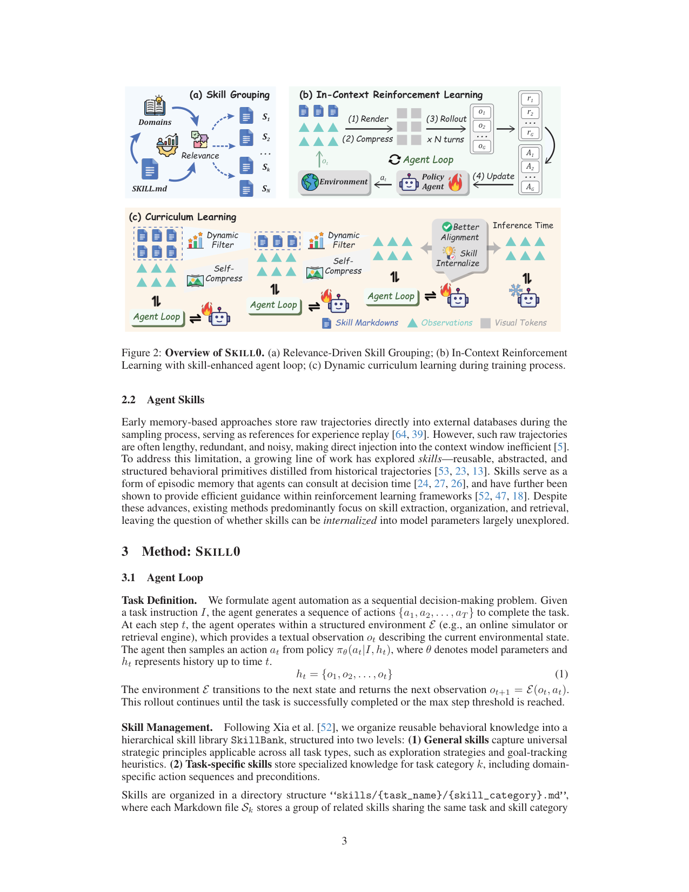
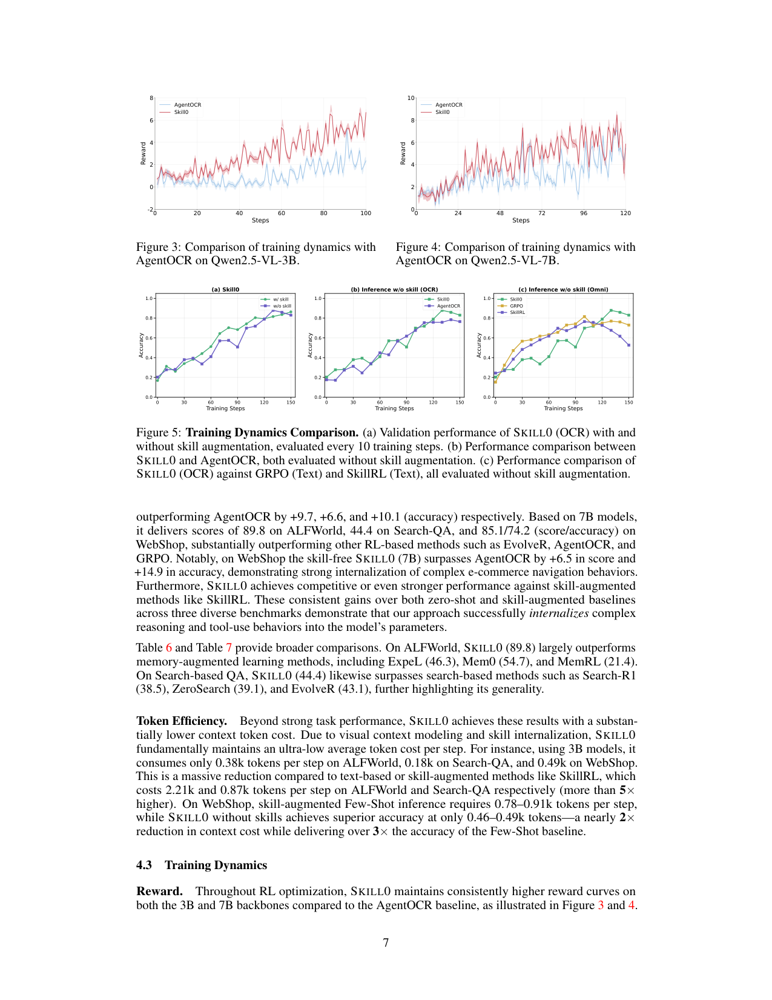

`skill0_zero | SKILL0: In-Context Agentic Reinforcement Learning for Skill Internalization | Zhejiang Univ. + Meituan + Tsinghua (Zhengxi Lu, Zhiyuan Yao, ..., Qi Gu†, Yongliang Shen†;ZJU-REAL Lab) | 2026-04(arXiv v2, 2604.02268, 15 May 2026)·Preprint·v2 | 主题线 L?(技能内化 / agentic ICRL · skill→参数,首篇把内化当显式目标)·相关性 High`

> 一句定位:推理时给 agent 塞"技能文档"(skill prompt)虽实用,但模型只是**照着 prompt 执行技能、并没真学会**(能力住在 context 里、不在参数里),还带检索噪声 + token 开销。SKILL0 是**首个把"技能内化进参数"当显式训练目标**的 RL 框架:训练 rollout 时给技能、推理时**完全撤掉**——靠 **In-Context RL(ICRL)** + **helpfulness 驱动的动态课程**(每个技能文件按"当前策略带它/不带它的验证准确率差 ∆k"决定是否保留,预算线性退火到 0),把"context 里的能力"逐步搬进权重,最终 zero-shot 自主。还有一招独门:把"历史 + 技能"**渲染成一张紧凑 RGB 图**喂视觉编码器(self-compression),每步 <0.5k token。

---

## ══ 第一层:一眼看懂 ══

- 🟦 **TL;DR**:Agent skills(结构化的程序性知识包,推理时动态加载)是当前增强 LLM agent 的标准机制,但**推理期技能增强有三宗罪**:① 检索噪声引入无关/误导指南;② 注入的技能内容**逐轮累积 token 开销**,限制扩展;③ 最致命——**照 prompt 执行技能 ≠ 学会技能**,能力在 context 不在模型。SKILL0 的问题转向:能不能把技能**内化进参数**,让推理时**不再需要检索**?做法:① **离线 Relevance-Driven Skill Grouping**——把技能库按类别组织成 SkillBank={S_k}(每个 .md 文件一组同类技能),并把验证集切成与每个 S_k 对齐的子任务 T_k;② **In-Context RL**——训练 rollout 时把"历史 h_t + 选中的技能子集 S"**渲染成一张紧凑 RGB 图**(压缩比 c_t 由策略自生成),视觉编码器压成 visual context 喂策略,GRPO 优化任务成功 + 压缩效率的复合奖励;③ **Helpfulness-Driven Dynamic Curriculum**——每 d 步算每个 S_k 的 helpfulness ∆k=Acc(带 S_k)−Acc(不带),只保留 ∆k>0 的、按 ∆k 排序取 top-M(s),技能预算 M 线性退火([6,3,0])直到 S=∅、agent 全 zero-shot。结果:3B 上 ALFWorld 87.9 / Search-QA 40.8 / WebShop 78.6,**无技能推理**却超 AgentOCR +9.7/+6.6/+10.1,且每步 <0.5k token(比 SkillRL 省 5×)。

- **最巧的一步**:**"helpfulness ∆k=Acc(w/ skill)−Acc(w/o skill) 驱动的逐技能退火课程"**(Algorithm 1 的 Filter→Rank→Select)。抽掉它就垮:消融 Table 3,**w/o Rank(随机选)直接崩到 62.9(∆=−13.7)**,Fixed-Full / [6,6,6] 在撤技能时**塌 −12.3/−13.3**,而 ∆k 课程反而 **+1.6**。精妙在 ∆k 是个**自指的内化探针**——技能一旦被内化进参数,Acc(w/o)就追上 Acc(w),∆k 自然→0,被正性过滤**自动淘汰**(附录 A.2 给了自配速课程的理论),所以"何时撤哪个技能"完全数据驱动、无需手设时间表。

---

## ══ 第二层:为什么做 ══

- **研究背景**:LLM agent 在 code/GUI/游戏/具身控制上能力渐强;随 Claude Code、OpenClaw 等 scaffold 兴起,**结构化 Agent Skills**(紧凑可复用的策略文档)成了扩展 agent 专项能力的标准机制(§1)。主流范式 = **inference-time skill augmentation**:从 skill bank 检索相关技能,每步注入 context 作自然语言指南——已有成熟的技能库/检索管线/演进机制生态。
- **解决的具体痛点**(§1–2.2):推理期增强的三宗罪——① **检索噪声**腐蚀 context;② **token 开销**多轮复利、限制扩展;③ **最关键**:照 prompt 执行 = executing skills, not learning them,能力住 context 不住模型。类比人类技能习得:显式指令阶段 → 内化阶段(从记忆自主执行);推理期增强把 agent 永久锚在第一阶段。
- **相关工作 & 各自不足**(§2.2):① **memory-based**(ExpeL/Mem0/原始轨迹存库)——轨迹冗长嘈杂,直接注入低效;② **skill-based**(SkillRL/各类技能抽取-组织-检索)——聚焦**抽取/组织/检索**,"能否把技能内化进参数"几乎无人探。SKILL0 正补这块空白。
- **动机链**:推理期注入技能有效但能力不进参数 → 朴素 RL 两头不讨好(无技能 context 则缺结构指南学不动复杂多步行为;全程满技能则模型永远依赖外部知识、从不被迫内化)→ 需要一个**"始于有技能、终于无技能"**、系统地把能力从 context 搬进参数的训练 regime → ICRL(训练给、推理撤)+ 动态课程(按 helpfulness 逐技能退火)→ 再叠 context rendering 解决"扩域时 token 爆炸"。为什么不用更简单法:固定 few-shot 注入(能力不进参数);固定满技能训练(撤了就塌,Fig.7/8 证)。
- **与最近邻的 Δ**:
  - vs **SkillRL / EvolveR**(skill-augmented RL):它们推理时仍带技能、把"带技能性能"当目标;SKILL0 **推理时零技能**,把"内化"当显式目标——这是范式级差异(Fig.1)。SKILL0 甚至复用 SkillRL 的 SkillBank 初始化。
  - vs **AgentOCR**(Feng 2026,最近邻 + 直接基线):AgentOCR 提供了 **context rendering / 视觉自压缩**的底座(把历史压成图、复合奖励含 ln(c_t)),SKILL0 **沿用这套压缩机制**,但**新增"技能 + 动态课程内化"**那一层。所以 SKILL0 vs AgentOCR 的增益(+9.7/+6.6/+10.1)恰恰隔离出"技能内化"的纯贡献(同样视觉压缩、同样 zero-shot 推理协议)。
  - vs **GRPO**(纯 RL):GRPO 无技能脚手架,早期探索弱、收敛早停(Fig.5c plateau);SKILL0 借技能脚手架探索、持续提升到更高上界。

---

## ══ 第三层:怎么做 + 靠不靠谱 ══

- **方法流水线**(§3,Fig.2):
  1. **Agent Loop / 任务设定**(§3.1):序贯决策,π_θ(a_t|I,h_t),h_t={o_1..o_t},环境转移 o_{t+1}=E(o_t,a_t),直到成功或步数上限。
  2. **Skill Management**:分层 SkillBank——**General skills**(跨任务通用策略,如探索/目标追踪启发式)+ **Task-specific skills**(类别 k 的专门动作序列/前置条件);目录结构 `skills/{task}/{category}.md`,共 N 个文件。训练时**不按语义相似度检索单条技能**,而是按 **on-policy helpfulness** 选 m 个技能文件子集 S⊆SkillBank。
  3. **Context Rendering(独门效率机制,§3.1)**:把文本 context(历史 h_t + 选中技能 S)映射成**紧凑 RGB 图**,视觉编码器 Enc 压成 V_t=Enc(h_t,S;c_t)∈R^d 喂策略。**压缩比 c_t 不是固定超参,而是策略每步自生成**:(a_t,c_t)∼π_θ(a_t,c_t|I,V_t)。→ 大幅降 token,同时保结构信息。
  4. **In-Context RL(ICRL,§3.2)**:复合奖励 r̃_t=r_t+λ·r_comp,其中 r_comp=ln(c_t)·[成功]——成功时奖励更高压缩(对数反映边际递减),失败给 0;联合优化任务成功 + 压缩效率。目标 = **标准 GRPO**(group-normalized advantage + PPO clip + KL-to-ref,Eq.5)。
  5. **Adaptive Curriculum(§3.3,Algorithm 1,核心)**:技能预算 M 沿 **NS 个阶段线性退火**(Eq.6):|S^(s)|≤M^(s)=⌈N·(NS−s)/(NS−1)⌉,ALFWorld 实例化为 **[6,3,0]**(NS=3),保证每阶段最多撤 ⌈N/(NS−1)⌉ 个技能 → context 分布平滑过渡(附录 A.1 给稳定性界:NS 够大则 GRPO 保单调改进)。每 d 步:对每个 T_k 算 ∆k=Acc(π,T_k,带 S_k)−Acc(π,T_k,∅)→ **Filter**(留 ∆k>0)→ **Rank**(按 ∆k 降序)→ **Select** top-M^(s);M^(s)=0 时 S=∅(全 zero-shot)。
  6. **推理**:**完全撤技能**,只用内化进参数的能力,zero-shot 跑。

- **逐组件必要性**(消融):
  - **Filter & Rank & Select(完整)** vs **w/o Filter**(用满预算所有技能,引入 context 噪声)→ 87.9→81.6、且撤技能后 ∆ 由 +1.6 变 −2.7(Table 3)。
  - **w/o Rank(随机选)** → **崩到 62.9(∆=−13.7)**——证明"严格只留有用技能"是稳定学习、防表面 prompt 依赖的命脉(Table 3)。
  - **Skill Budget**:[6,3,0] vs Fixed-Full / [6,6,6]\(撤技能时塌 −12.3/−13.3)vs [3,3,3]\(静态低预算限制早期探索、峰值低、训练不稳)→ 只有退火课程兼顾"早期探索 + 撤后不塌"(Fig.7/8)。
  - **Validation interval d**:d=10 最优(d=5 边际增益但开销大,d=20 适配慢、ALFWorld 掉到 78.1,Table 4)。
  - 三步课程 + 预算 + 间隔均有消融;**context rendering 本身未单独消融**(继承自 AgentOCR,但 AgentOCR 作为基线间接对照)。

- **关键机制直觉**:技能是**"暂时的脚手架"**(transient scaffolding)。helpfulness ∆k 像"血氧探针"——只要"吸氧(带技能)"还比"自主呼吸(不带)"明显好,就保留;一旦自主呼吸追上(∆k→0),说明已内化,自动撤掉。Fig.6 的 **rise-then-fall** 曲线是全文最漂亮的实证:早期 ∆k 低(策略还不会用技能 prompt)→ 中期升(学会 grounding 到技能)→ 后期课程压预算逼内化、∆k 回落到 0。附录 A.2 把这写成"自配速课程 + 子模性 greedy 选择(1−e^−α 近似)"的理论。context rendering 的直觉:与其把技能/历史当长文本撑爆窗口,不如压成图——视觉 token 密度高,策略还能自调压缩率。

- **实验与证据**(§4):
  - 数据集/设置:**ALFWorld**(3827 实例,6 类)、**Search-QA**(单跳 NQ/TriviaQA/PopQA + 多跳 HotpotQA/2Wiki/MuSiQue/Bamboogle,NQ+HotpotQA 为 in-domain、其余 OOD)、**WebShop**(128 固定验证任务)。base=**Qwen2.5-VL-3B/7B**;4×H800,≤180 步;ALFWorld bs=16/8 rollout、prompt≤3072;Search-QA 用 Search-R1 设置 + E5 检索器、bs=128;WebShop 1000 训练任务。NS=3,SkillBank 用 SkillRL 初始化。指标:成功率(%)+ 每步 context token 成本(k),5 类基线(in-context prompting / GRPO / AgentOCR / EvolveR / SkillRL),含 GPT-4o/Gemini-2.5-Pro 闭源对照。
  - **支撑核心主张的关键实验**:① **主表 Table 1/2**——**无技能推理**的 SKILL0(3B):ALFWorld 87.9(>AgentOCR 78.2 +9.7)、Search-QA 40.8(>34.2 +6.6)、WebShop 66.4 acc(>56.3 +10.1);7B 上 89.8/44.4/74.2,且与**带技能的 SkillRL** 竞争或更强 → "撤了技能还赢"是内化成立的最直接证据。② **训练动态 Fig.5(核心)**——(a) 带技能验证早期快、无技能初期低但**末期追上**(内化趋势);(b) **严格公平**的无技能推理下 SKILL0 仍 > AgentOCR(证优势来自内化非 prompt);(c) 无技能协议下 GRPO/SkillRL **早早 plateau**,SKILL0 持续提升到最高上界。③ **helpfulness Fig.6 rise-then-fall** 跨所有子任务一致 → 实证 ICRL+课程的协同机制。④ **token 效率**——3B ALFWorld 0.38k/step vs SkillRL 2.21k(>5×),WebShop ~0.46k 却 3× 于 Few-Shot 的准确率。
  - **baseline 公平性**:相对 AgentOCR 是**最干净对照**(同视觉压缩、同 zero-shot 推理),增益纯归因"技能内化"。**潜在不公/需注意**【推断】:(a) SkillRL 在**带技能**下 7B ALFWorld 89.9、Bamboogle 73.8 等单项仍高于 SKILL0——SKILL0 的卖点是"无技能下逼近带技能",而非全面碾压;(b) SkillRL-3B 是"无 cold start + 无 skill evolution"的**简化复现**(Table 1 脚注),可能低估 SkillRL。依据:Table 1 脚注 + SkillRL 带技能列。
  - **"看着强但没答核心问题"风险**【推断】:Search-QA 上 SKILL0(3B 40.8 / 7B 44.4)对 EvolveR(38.2/43.1)、SkillRL(38.9/47.1)的优势**不如 ALFWorld 显著**,7B 上 SkillRL-Search 反超(47.1>44.4)——说明"内化"在**搜索类长尾知识任务**上没那么吃香(技能更像"操作指南"而非"知识"),核心机制在**程序性技能强的 ALFWorld/WebShop** 上最成立。依据:Table 1 Search-QA 列 7B。

- **假设与失效边界**:
  - 【原文 §Limitations】SKILL0 依赖**初始 SkillBank 质量**;离线 relevance-driven 分组在**新任务域需重新划分**(re-partition)。
  - 【原文 附录 A.1/A.2】稳定性需 NS 足够大(Eq.14:NS>1+N·δr/(ε_clip·σ_G)),否则阶段切换的非平稳性破坏 advantage 信噪比;skill selection 的 (1−e^−α) 最优性需 J(·) 近似子模。
  - 【推断】方法绑定 **VL 模型 + context rendering**(把技能/历史渲成图)——纯文本 LLM 无法直接用这套视觉压缩;且"技能进参数"对**程序性技能**(动作序列)友好,对**事实性知识**(Search-QA OOD)增益弱。依据:base 全是 Qwen2.5-**VL**、Search-QA OOD 增益小。
  - 【推断】helpfulness 评估需**为每个技能文件配验证子任务 T_k** + 每 d 步跑 with/without 两遍验证——技能多/类别细时验证成本与 T_k 标注成本上升。依据:Algorithm 1 Step 1 双重 Validate。

- **祛魅总结**:
  - 真贡献(硬货):① **首次把"技能内化"形式化为显式 RL 训练目标**,并给出干净的"训练给技能、推理撤技能"ICRL 范式 + helpfulness 自配速课程(rise-then-fall Fig.6 + 公平对照 Fig.5b 是强证据);② **helpfulness ∆k 作内化探针 + 正性过滤自动淘汰**(附录 A.2 理论)——优雅地把"何时撤哪个技能"变成数据驱动;③ **context rendering(自压缩成图)** 带来真实的 <0.5k token/step 效率(比 SkillRL 省 5×),是落地相关的硬货。开源(github.com/ZJU-REAL/SkillZero)+ veRL 实现,可复现性高。
  - 包装/营销成分【推断】:(a) 摘要/结语"paving the way toward truly autonomous … self-sufficient intelligence"叙事偏大——实测仅 3B/7B + 三个 benchmark;(b) "competitive against skill-augmented"——在带技能 SkillRL 的若干单项上**并未超越**(7B Search-QA SkillRL 反超),"competitive"措辞略美化;(c) **context rendering 的效率红利大半来自 AgentOCR**(继承),技能内化本身对 token 的贡献需与压缩解耦看(论文未单独拆分两者对 token 的贡献)。依据:Table 1 + AgentOCR 引用。

---

## ══ 结构化抽取 ══

- 🎯 **机制速览 6 轴**:

| 学什么信号 | 改什么 | 何时改 | 免梯度? | 记忆-技能生命周期 | 防遗忘机制 |
|---|---|---|---|---|---|
| **环境 task reward**(成功率)+ **压缩效率** r_comp=ln(c_t)·[成功];课程用 **helpfulness ∆k=Acc(w/skill)−Acc(w/o skill)**(自产的内化探针);**无自反思/无人类/无外部经验库** | **改模型参数**(策略 π_θ,GRPO 把技能内化进权重 + 学自适应压缩比 c_t);**SkillBank 本身只被过滤/退火,不学** | **在线**:rollout per-step 渲染+决策;GRPO per-batch 更新;课程**周期性**(每 d=10 步算 ∆k、退火预算);test-time **零技能**不再改 | **否(纯梯度内化)**——核心靠 GRPO 梯度;课程/过滤是免梯度调度,但能力获取全靠策略梯度 | 技能=训练期外部脚手架:**写入**=离线 SkillBank(SkillRL 初始化)+ 按类分组;**检索/选择**=on-policy helpfulness 选 top-M 文件(非语义相似);**遗忘/淘汰**=∆k≤0 过滤 + 预算线性退火([6,3,0])单调减到 0;**共享**=内化进参数后推理期完全不需技能 | **线性预算退火**保证每阶段最多撤 ⌈N/(NS−1)⌉ 技能 → context 分布平滑、防突变(附录 A.1 稳定性界);**KL-to-ref**(GRPO 自带)约束策略漂移;**无显式参数级防遗忘 / 无 merge / 无隔离**——靠"平滑退火 + 持续 RL"维持 |

- ⑦ **开源代码 + 框架/harness**:**已开源** https://github.com/ZJU-REAL/SkillZero(REAL Lab;abstract 明示 + HF papers/2604.02268 + repo 有 `skills/` 目录)。**框架 = veRL / verl-agent**(WebSearch 交叉确认 repo "builds on AgentOCR, **verl-agent, veRL**, ALFWorld, SkillRL, Search-R1")。即:**veRL 系 agentic RL** + **AgentOCR**(context rendering/视觉自压缩底座)+ **SkillRL**(SkillBank 初始化)+ **Search-R1**(Search-QA 设置/E5 检索)+ ALFWorld 环境。【原文 abstract + repo README 交叉确认】

- 💰 **资源/成本与可扩展性**:**4×H800**,≤180 训练步,base Qwen2.5-VL-3B/7B;ALFWorld bs=16×8 rollout、prompt≤3072;Search-QA bs=128、prompt≤4096;WebShop 1000 训练任务。**推理成本极低**:每步 <0.5k token(3B:ALFWorld 0.38k / Search-QA 0.18k / WebShop 0.49k),比 SkillRL 省 5×、比 Few-Shot 省 ~2×(§4.2)。课程额外成本 = 每 d 步对每个 T_k 跑 with/without 双验证。【原文】

- 🎯 **对"探索-巩固(TSRD/MTP+OPD)"idea 对标**:**强支撑 + 核心可借组件**(且是 skillc 的母体)。
  - **强支撑**:SKILL0 的 **"训练给脚手架→推理撤脚手架→能力从 context 搬进参数"** 正是你"探索(借 teacher 脚手架)→巩固(撤掉后自主)"的**最干净先例**;Fig.5 公平对照(撤脚手架后仍赢)证明"内化"可度量、可达成,直接背书 TSRD 的可行性。
  - **可借组件**:① **helpfulness ∆k=Acc(w/scaffold)−Acc(w/o) 作内化探针 + 正性过滤自动淘汰** —— 可直接迁到 TSRD,把"是否还依赖 teacher 路径提示"量化,决定何时撤脚手架(与 skillc 的对比间隙 ∆(x) 同源,SKILL0 是课程层、skillc 进一步下沉到信用层)。② **预算线性退火 + 稳定性界(NS 下限)** —— 给你"巩固阶段平滑撤脚手架不破坏已学"提供现成 schedule + 理论保证。③ **rise-then-fall 的 helpfulness 曲线** 可作 TSRD 训练健康度的诊断信号。④ **context rendering 自压缩** 若你的 teacher 脚手架很长,可借此压成视觉 token 省开销(但需 VL 模型)。
  - **竞品/缺口**:SKILL0 走**离散技能文档 + GRPO 内化**,**无 teacher 分布蒸馏(OPD)**、**无 MTP 前瞻**、**无参数级防遗忘**;你的 OPD 用 teacher logits 做更密信号、MTP 做前瞻探针——正补 SKILL0 "只用环境 reward + 二值 helpfulness"的稀疏性。SKILL0 是"自 teach(技能文档)+ 撤梯子",TSRD 是"他 teach(强 teacher)+ 撤梯子",信号源互补。

- 🔭 **开放问题/未来方向**:
  - 【原文 §Limitations/§5】(a) 降低对**初始 SkillBank 质量**的依赖;(b) 自动化 relevance-driven 分组(免去新域重划分);(c) 把内化范式推广到更通用/可扩展设定。
  - 【推断】(d) 把课程信号从**二值 helpfulness ∆k** 升级为**连续/密集信号**(如 teacher 分布差、token 级置信),缓解 Search-QA 这类弱信号任务;(e) 脱离 VL+rendering 依赖,做纯文本版内化;(f) **参数级防遗忘**(内化新技能时保旧能力);(g) 技能可演进(当前 SkillBank 固定初始化、只退火不新增)。依据:Search-QA 增益弱、base 全 VL、SkillBank 固定。

- 🖼 **关键图 top-2**:

  
  这是**原文 Figure 2**(第 3 页):(a) **Relevance-Driven Skill Grouping**——SKILL.md 按 Domains/Relevance 组织成 S_1..S_N;(b) **In-Context RL**——agent loop 里 (1) Render(历史+技能渲成图)→(2) Compress(视觉自压缩,策略自生成 c_t)→(3) Rollout(采 G 条轨迹得 r/A)→(4) Update(GRPO);(c) **Curriculum Learning**——多个 agent loop 经 Dynamic Filter 逐步 Better Alignment → Skill Internalize → 推理时 zero-shot。选它因为一图说清全文三大件如何咬合成"训练给技能、课程退火、推理撤技能"的内化闭环。

  
  这是**原文 Figure 5**(第 7 页,本页上方另有 Fig.3/4 的 reward 曲线):(a) SKILL0 带技能 vs 不带技能验证准确率——不带初期低、**末期追上**(内化发生);(b) **严格公平**下 SKILL0 vs AgentOCR(均无技能推理)——SKILL0 仍高,证优势源自内化而非 prompt;(c) 无技能协议下 SKILL0 vs GRPO/SkillRL——后两者**早早 plateau**,SKILL0 持续爬升到最高上界。选它因为这是全文最核心的证据图:直接可视化"技能内化"这一现象本身,并用三重对照排除"靠 prompt/靠初始化"的替代解释。
