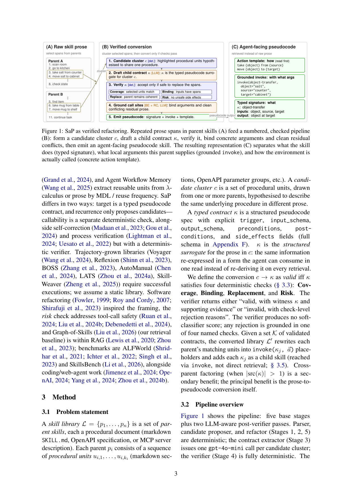
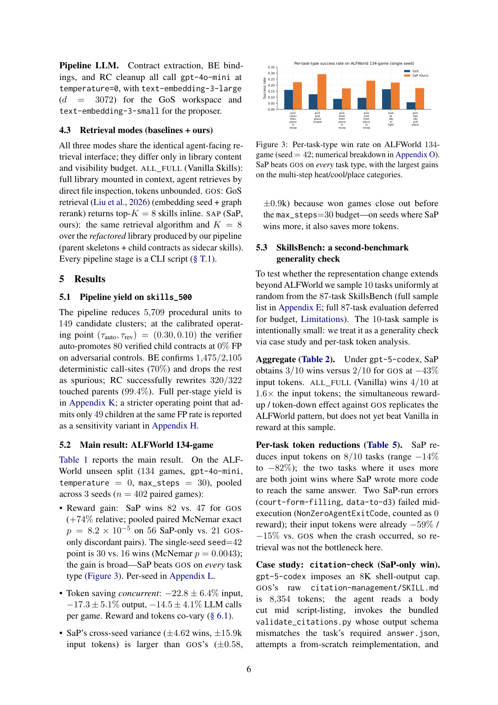

`skill_as_pseudocode | Skill-as-Pseudocode (SaP): Refactoring Skill Libraries to Pseudocode for LLM Agents | 南洋理工(NTU)+ 复旦 + 上海 AI Lab(InternLM) | arXiv:2605.27955v1, 2026-05-27, cs.PL | 主题线 L?(技能库表示重构/技能"生产侧",免梯度+确定性验证)·相关性 High`

> 三标注:【原文】=论文直述;【推断】=有据判断(附依据);【待核】=拿不准关键事实。本篇基于下载 PDF 全文(18 页,78K 字符)精读。

══ 第一层:一眼看懂 [light] ══
- 🟦 **TL;DR**:LLM agent 的技能库现在大多是**自由散文式 Markdown(SKILL.md)**。问题:散文把"这个技能产出什么(输出 schema)"和"怎么调用它(环境接受的具体动作 token)"**混在一堆提示/注意事项/示例里**,agent 每次检索都要**重新从散文里推导**这两件事。结果是一个"**困惑→重检索→还是困惑**"的死循环:agent 发出一个动词/参数略错的动作(如该说 `move X to Y` 却说 `put X in/on Y`),环境回 "Nothing happens.",于是再检索同一段散文。本文 **Skill-as-Pseudocode (SaP)** 把散文技能库**自动重构成"带类型的伪代码"**:对一簇相似的过程段落,抽出一个**带类型的契约 \(\kappa\)**(trigger/输入 schema/输出 schema/前后置条件),用一个**确定性的四检查验证器**(Coverage/Binding/Replacement/Risk)过滤,通过后把契约 inline 进重写的技能骨架,同时**恢复具体动作模板**。于是 agent 一次拿到两个互补信号:**typed signature(技能做什么)+ 具体模板(怎么调)**。在 ALFWorld 134 游戏(gpt-4o-mini,3 seed)上,SaP 对 Graph-of-Skills(GoS)基线 **82/402 vs 47/402 配对胜**(McNemar p=8.2e-5),且**同时**省 −22.8% 输入 token、−14.5% LLM 调用。代码开源。【原文 Abstract/§1】
- **最巧的一步**:**"散文→带类型伪代码"的表示转换 + 确定性四检查验证器**。抽掉验证器(让 LLM 直接输出契约当结果)整个方法就垮——因为本文纪律是"**每次 LLM 抽取都是一个假设,由确定性规则核验,而非黑盒输出**":LLM 只负责"提议候选契约",**契约能否替换 = 独立的确定性检查**(接受时给 witness,拒绝时给具名原因)。这把"用 LLM 改写技能库"从"可能引入幻觉/不安全/破坏控制流"变成"可审计、0% 假阳(在对抗负样本上)"的工程过程。最巧之处还在于:它发现**瓶颈是散文表示本身,而非缺乏因式分解**(cross-parent factoring 只是次要收益)。【原文 §1/§3/§5.6】

══ 第二层:为什么做(写透) ══
- **研究背景**:现代 LLM agent 依赖技能库(预先写好的过程文档,任务时检索并遵循)。带类型目录(OpenAPI/ToolLLM/Gorilla)已暴露机器可读签名,但**当今 agent 技能最常见的部署形态是 Markdown**:Anthropic SKILL.md、GoS 库、MCP server 描述,**全是给人和 LLM 读的自由散文**。【原文 §1】
- **解决的具体痛点**:**散文是瓶颈**(作者明确论点)。Markdown 技能文档**不分离"产出什么(输出 schema)"与"怎么调(环境接受的具体原语动作)"**,两者还和散文提示/警告/示例交织。检索时 agent 必须**每次重新推导两者**。实测在 ALFWorld 形成"检索-动作反馈循环":发 SkillRequest→读回长 Markdown→发出动词/参数略错的动作→环境回 "Nothing happens."→再检索找缺的细节。这个循环**同时驱动任务失败和 per-game LLM 调用成本**。【原文 §1/§6.1】
- **相关工作 & 各自不足**:① **typed routing**(RestGPT/ToolLLM/Gorilla/API-Bank)——**假设契约已手写好**,只解 agent 侧选择/路由;SaP 是互补的"**生产侧**",从散文恢复契约。② **库级技能管理**(并发工作 **SkillOps**——把技能建成 typed contract 诊断库健康做 merge/repair/retire;**GraSP**——把 flat 技能编译成 typed DAG)——**都在契约已存在后操作**;SaP 解上游表示缺口(散文→typed 伪代码契约+inline 具体模板)。③ **库压缩 vs 验证重构**(DreamCoder/Stitch/LILO/AWM 按 MDL/复用频率抽单元)——SaP 不同:目标是 typed 伪代码契约,且**复发只提候选,可调用性是独立确定性检查**。④ **轨迹生长库**(Voyager/Reflexion/SkillWeaver)——需成功执行;**SaP 假设静态库**。⑤ 软件重构(Fowler)启发了 framing,risk 检查对应工具调用安全。【原文 §2】
- **动机链**:Markdown 是主流技能形态 → 散文不分离 what/how 且交织 → agent 每次检索重推导 → 形成"困惑-重检索"循环,既降成功率又增成本 → 两条信息可短路循环:(1) typed contract 一眼告知能做什么/要什么参数(=OpenAPI 给 typed-routing agent 的 affordance);(2) 具体动作模板告知如何用环境接受的确切 token → Markdown 本就含这两块但散落在散文 → 现有 typed-routing 假设契约已手写 → 所以**自动化散文→伪代码转换 + 确定性质量控制**。为什么不用更简单做法:纯散文检索(GoS)成功率仅 11.7%,vanilla 全库挂载 0 胜且 3.4× token(全库 prompt 压垮 gpt-4o-mini)。【原文 §1/§5.2】
- **与最近邻工作的 Δ**:最近邻 = **SkillOps / GraSP**(同期、同样基于 typed contract)。Δ:它们**在契约已存在后**做库维护/组合;SaP 是**生产侧——从自由散文自动恢复 typed 契约 + inline 具体动作模板**,是"同一供应链的上游"。相对 typed-routing(假设契约手写),Δ 也是"自动恢复契约"。这个差异有用因为现实技能库 90% 是散文,没有现成契约可供 SkillOps/GraSP/typed-routing 直接消费——SaP 补上了这个前置环节。【原文 §2】

══ 第三层:怎么做 + 靠不靠谱 ══
- **方法流水线**(5 基础阶段 + 2 个 LLM-aware 后验证;见 Fig 1;§3):
  1. **Stage1 Parser(确定性)**:SKILL.md 按 Markdown 标题切成 procedural units;OpenAPI 按参数组切。输出 parents.json。
  2. **Stage2 Candidate proposer(确定性)**:每 unit 抽 frame 元组 (verb, objects, code_langs, linked_scripts) + text-embedding-3-small 嵌入;单链接聚类(共享 frame 且 \(\cos\geq0.65\))。**故意高召回**(过聚类没关系,下游验证器会过滤)。
  3. **Stage3 Contract extractor(LLM,每簇 1 次 gpt-4o-mini 调用)**:产严格 JSON 契约草稿 \(\kappa\)(trigger/input_schema/output_schema/pre-postconditions/side_effects/source_parents);模型可 \(_extraction_failed\) 拒绝。**此后所有拒绝都是确定性的**。
  4. **Stage4 Verifier(完全确定性,四检查)**:**Coverage**(\(\kappa\) 的 trigger/I-O 串对各 parent unit 文本的 token recall,抓错命名)、**Binding**(每个必需输入,(parent,input) 对中 unit 文本重叠输入名的比例,抓过宽簇)、**Replacement**(各 parent 的 unit 能否被 \(invoke(\kappa)\) 替换且保持 Markdown 结构,抓控制流纠缠)、**Risk**(AST 扫脚本/资源找 `rm -rf`/未声明网络出口等不安全 sink,加权分 \(\geq0.80\) 硬拒)。**四检查近乎正交**(无单层占首次失败拒绝的 >51%)。三档决策(auto_promote/review/reject)由阈值 \((\tau_{auto},\tau_{rev})\) 定,对 30 个合成负样本标定到 **0% 假阳**(默认 (0.30,0.10) 提升 80 个契约)。
  5. **Stage5 Refactor(确定性骨架 + BE/RC 两 LLM 后验)**:确定性检测 call-site;**BE(Binding Extraction,LLM)**——问 gpt-4o-mini 该 unit 是否 κ 的真实实例、每个输入绑哪段子串,确定性后检查丢掉空绑定/token 不重叠者(skills_500 上丢掉 30%=630/2105 伪 call-site);把 parent 匹配 unit 改写成 \(invoke(κ, args)\);**RC(Rewrite Cleanup,LLM)**——把未聚类残留内容(Example/Workflow)中与子契约矛盾的(如用了错动词的示例)重写成 invoke 调用(成功率 320/322=99.4%)。**输出**:每 parent 的 *.rewritten.md + refactored_library.json。
  6. **检索时替换(§3.5,Fig2)**:任务时**只检索 parent**(提升的 child 契约存内部库,仅经 parent 的 invoke 占位到达)。命中 parent 后,检索模块给出三块:① 每个 invoke 的**逐字原始动作模板**(环境接受的确切 token)+ 绑定;② 重写的 parent 骨架;③ inline 的 child 契约。**动作模板放最前**(agent 先读),契约抽象放下面。
- **逐组件必要性**:
  · 整套 vs GoS → 主结果 Table 1(82 vs 47 胜),**强**。
  · BE/RC → **Table 3 组件消融**:deterministic-only 0.05 → +RC 0.10 → +BE+RC 0.15(每步 +5pp);RC 修"未重写残留的过时语法"(put X in/on Y),BE 丢 30% 伪 call-site。**有消融**(但 BE-alone 未单跑)。
  · 四检查 → 标定到对抗负样本 0% 假阳;Appendix I 显示四层近乎正交,**有证据**。
  · **层级检索分离(只检 parent)** → **§5.5 关键消融**:允许 child 契约作为顶层结果出现,reward 从 22.4%→16.4%(−27%)——因 agent 读到没有 parent 动作模板包裹的"欠语境" child 契约,破坏了"契约+模板"配对。**有消融,且证明增益来自 parent 侧替换包,而非 child 库**。
- **关键机制直觉**(§6.1,核心因果):SaP 一次给出两个结构化信号,GoS 逼 agent 在长混合散文里自己找两块(典型 "lost-in-the-middle" 退化)。证据三条:① **检索后动作正确率**——SaP 检索后下一个环境动作成功率 **29.3% vs GoS 20.5%**;在 READ_SKILL 事件上 29.8% vs 19.0%(1.57×);② **循环是失败单位**——输掉的游戏发 ~4× 更多 SkillRequest 与 "Nothing happens.",SaP 在输局上把 SkillRequest/game 砍 ~30%;③ trace 对比(idx_36"把热杯放柜":GoS 22 步 4 次检索 + 3 次近语法错;SaP 7 步 1 次检索)。即:**结构化表示打断了散文诱发的检索-动作循环**。【原文 §6.1/Table 4】
- **实验与证据**:**库** = 公开 GoS skills_500(500 文档,5709 units,54 带脚本,~10 域;选它因 skills_200 零 alfworld 技能)。**benchmark** = ① ALFWorld unseen(134 文本家务游戏,30 步预算,二元 reward,检索回合不耗预算);② SkillsBench 10 任务子集(87 中随机采,gpt-5-codex,Docker)。**模型**:ALFWorld agent + pipeline 用 gpt-4o-mini(temp=0);SkillsBench agent 用 gpt-5-codex。**支撑核心主张的关键实验**=Table 1:SaP **82/402 胜 vs GoS 47**(+74% 相对 reward,McNemar p=8.2e-5),**同时** −22.8% 输入/−17.3% 输出/−14.5% 调用;Fig3 显示 SaP 在**每个任务类型上都胜 GoS**(多步 heat/cool/place 增益最大)。**baseline 公平性**:三模式(ALL_FULL/GOS/SAP)共享相同 agent 接口、相同检索算法(K=8)、相同 seed,仅库内容不同——**对齐良好**;GoS 是公开基线。**"看着强但没回答核心问题"风险**:低——§6.1 用检索后正确率 + 循环签名 + §5.5 检索池消融**直接做了因果归因**(增益来自结构化包打断循环);SkillsBench 样本小(10/87,作者坦承)但 per-task token 降在 8/10 成立。【原文 §4-6】
- **假设与失效边界**:【原文 Limitations】(i) **SkillsBench 仅 10 任务**(全 87 因预算暂停在 37,不纳主结果);对 GoS 的同时增益复现,但**对 ALL_FULL(vanilla)在 reward 上尚未胜**;(ii) **只在一个库(skills_500)、仅 Markdown 端到端跑**;skills_1000/2000 未重跑;typed-API 库(Stripe/GitHub OpenAPI)只到 parser+candidate 阶段,**跨模态 dispatch 是架构性而非实证**;(iii) **Replacement 是静态检查**(测 invoke 能否语法替换 unit,**不测运行时 agent 是否正确 ground 调用**);更强的"层级调用"主张需运行时 sap_invoke 机制(未实现)。次要:单模型、单 LLM 家族 pipeline、仅合成负样本、无人类用户研究、仅英文。【原文 Limitations/Appendix G】【推断】强依赖技能库本就含"可恢复的结构"(verb/object/动作模板);纯抽象、无具体动作的散文难抽出有用模板。
- **祛魅总结**:**硬货**=(i) **问题 reframing 是真贡献**——"技能库改进 = 散文→typed 伪代码转换 + 确定性质量控制",且明确区分"表示瓶颈"vs"因式分解"(后者只是次要收益),视角清晰且有说服力;(ii) **确定性四检查验证器 + LLM 只提假设**的纪律工程上严谨,0% 假阳标定 + 近正交四层 + 安全 risk 检查,可审计性强;(iii) **同时**提升 reward 且降 token/调用(罕见的"既要又要"),且 §6.1 因果归因扎实(检索后正确率 1.43–1.57×);(iv) 成本透明(全实验 ~\$30)。**包装/需谨慎**=(i) **SkillsBench 证据弱**(10/87,且打不过 vanilla)——作者诚实标为"generality check via case study"而非锦标赛;(ii) **只一个库、仅 Markdown、仅 gpt-4o-mini/单 LLM 家族**,泛化性待证;(iii) "hierarchical invocation"目前**只是静态替换,无运行时展开**,作者明说更强主张需未实现的运行时机制;(iv) 标题"Pseudocode"听着像编程语言,实为"typed contract + 具体动作模板"的结构化重排。作者**异常诚实**(主动列三大限制、标 SkillsBench 主张比 ALFWorld 窄、明示跨模态是架构非实证),不是高估。【推断,依据 §5.3/Limitations/§6.1】

══ 结构化抽取(供全景汇总) ══
- 🎯 **机制速览 6 轴** [light]:
  | 维度 | 内容 |
  |---|---|
  | 学什么信号 | **无学习信号**(index-time 一次性重构);依据=技能库散文的结构(verb/object/嵌入相似)+ 确定性规则核验 + LLM 抽取/绑定/清理的文本判断【原文 §3】 |
  | 改什么 | **技能库的表示**(散文→typed 伪代码契约 + inline 具体动作模板;重写 parent 骨架);**不改模型、不改 agent 代码、不改 prompt 模板逻辑**(只改检索到的库内容) |
  | 何时改 | **离线/index-time 一次性**:整库重构在索引时完成("paid at index time rather than at every read");任务时只检索替换后的库【原文 §6 Conclusion】 |
  | 免梯度? | **是**(无任何训练/梯度;pipeline 仅少量 gpt-4o-mini 调用做抽取/绑定/清理 + 确定性验证) |
  | 记忆-技能生命周期 | 写入(从散文抽 typed 契约,提升复发者为 child)→ 验证(确定性四检查 0% 假阳 + BE/RC 后检查)→ 组织(层级:parent 顶层检索,child 经 invoke 到达)→ 检索(K=8,替换包=模板+骨架+契约)→ **无在线更新/遗忘**(假设静态库,一次性重构) |
  | 防遗忘机制 | **不适用**(静态库一次性重构,不涉及持续学习/参数更新,无灾难性遗忘问题);质量保障靠确定性验证器而非防遗忘【推断】 |
- ⑦ **开源代码 + 框架/harness**:**已开源** https://github.com/InternLM/Skill-as-Pseudocode (含 pre-built artifacts)【原文 §1 脚注/Contributions】。**无训练框架**(非参数、index-time pipeline,每阶段是 CLI 脚本);依赖 gpt-4o-mini(pipeline+ALFWorld agent)、gpt-5-codex(SkillsBench agent,经 codex CLI + Harbor harness + Docker)、text-embedding-3-small/large;检索基底=Graph-of-Skills(GoS)。
- 💰 **资源/成本与可扩展性**:**极低**——全部报告实验**总 LLM 花费 ~\$30**(开发全程)。pipeline 每候选簇仅 1 次 gpt-4o-mini 抽取 + BE/RC 少量调用;验证器纯确定性 0 LLM。推理期**省 token**:对 GoS −22.8% 输入/−14.5% 调用(ALFWorld),SkillsBench −43% 输入。可扩展性待证(仅在 skills_500 端到端跑,更大库未重跑)。【原文 Ethics/§5】
- 🎯 **对"探索-巩固"idea 对标** [light]:**可借组件(方法论纪律,最有价值)+ 缺口补充**。(可借,核心)**"每次 LLM 抽取是一个假设,由确定性规则核验——接受给 witness,拒绝给具名原因"** 这一纪律高度可迁移:在"探索→巩固"中,把探索得到的"路径/技能/经验"巩固进库时,可用 SaP 式确定性验证器(覆盖/绑定/可替换/安全)过滤 LLM 自动抽取的产物,避免幻觉污染巩固库——这对保证 MTP/OPD 巩固内容的"靠谱"极有用。(可借)"**把转换成本付在 index-time 而非每次 read**"的思想可迁移到"巩固一次、复用多次"的成本结构。(缺口)它揭示并填补"技能生产侧(散文→契约)"这一环,与 SkillOps(库治理)、sage_skilllib(RL 训练)拼成技能库供应链全景。(非竞品)静态重构、不学习,与参数侧巩固正交。
- 🔭 **开放问题/未来方向**:【原文 Conclusion/Limitations】(a) **技能库是否该直接用伪代码撰写**(Markdown 利于人类作者,但 agent 每次 read 付转换成本);typed 目录(OpenAPI/MCP)发布者可在 index-time 预替换;(b) 跨模态 dispatch(同 pipeline 跑 typed OpenAPI 库,换 Stage1-2)的**实证评估**(当前仅架构);(c) **运行时调用机制**(sap_invoke 按当前状态解析参数)以支撑更强的"层级调用"主张;(d) 全 87-task SkillsBench、更大 GoS 库(1000/2000)、多模型/多 LLM 家族评估。【推断】(e) 该确定性验证纪律向其它"散文→结构"任务(runbook 抽 schema、法律文档抽条款、wiki 抽 API spec)迁移(作者已点名)。

- 🖼 **关键图 top-2** [light]:
  
  · 这是**原文 Figure 1**(方法主图/pipeline)。三栏讲清全流程:(A) 多个 parent 技能里重复的散文片段;(B) 编号、带检查的管线——形成候选簇 c → 草拟 child 契约 κ → 验证(Coverage/Binding/Replace/Risk)→ 绑定具体参数并清理冲突 → 产出伪代码;(C) 结果表示**分离三件事**:技能做什么(typed signature)、本 parent 供什么参数(grounded invoke)、环境如何被调用(具体动作模板)。选它因为它一图说尽"散文→验证式 typed 伪代码"这一核心思想与确定性质量控制,是绝对精华。【原文 Figure 1】

  
  · 这是**原文 Figure 3**(核心发现/主结果图,seed=42)。逐任务类型(pick-clean/pick-and-place/pick-heat/pick-cool/look-at/pick-two 等)对比 GoS vs SaP 成功率柱状图,SaP **在每一类上都不低于 GoS**,且在**多步 heat/cool/place** 这类最易触发"散文-动作循环"的类别上增益最大。选它因为它直观证明主结果(SaP 全面优于 GoS 且增益集中在多步任务),与 §6.1"结构打断检索-动作循环"的机制解释相互印证,是支撑核心主张的关键证据图。【原文 Figure 3/§5.2】
