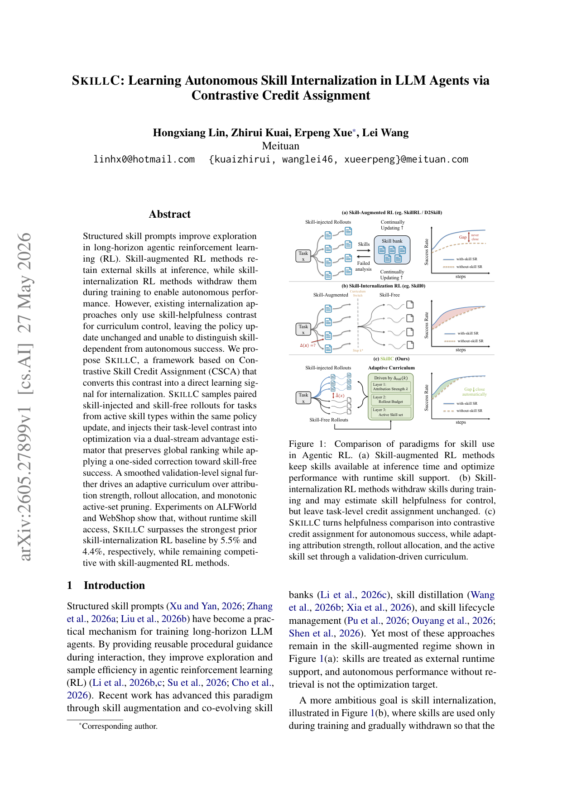
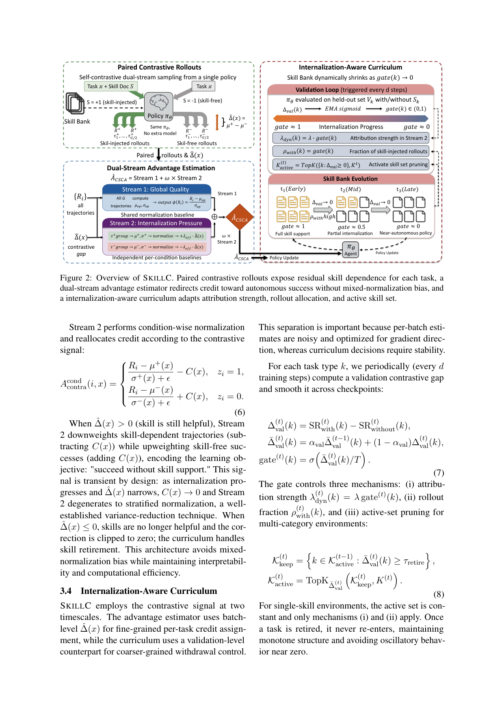

`skillc | SKILLC: Learning Autonomous Skill Internalization in LLM Agents via Contrastive Credit Assignment | Meituan (Hongxiang Lin, Zhirui Kuai, Erpeng Xue*, Lei Wang) | 2026-05(arXiv v1, 2605.27899, 27 May 2026)·Preprint·v1 | 主题线 L?(技能内化 / agentic RL credit assignment · skill→参数内化)·相关性 High`

> 一句定位:技能内化 RL(训练时给技能提示、推理时撤掉,逼模型自主)以前只用"技能有没有用"来**控课程**(何时撤),但 **GRPO 的策略更新本身没变**——一个 update 内所有 rollout 都在同一 prompt 条件下,梯度根本分不清"这次成功是靠技能拐杖还是已经会自己走了"(作者命名 **internalization blindness**)。SKILLC 把这个对比变成**直接的学习信号**:同一次 update 里**成对采样**"注入技能"与"不给技能"两路 rollout,用**双流优势估计器**(全局排名流 + 按条件归一的内化压力流)把信用**单向地推向"无技能也成功"**,并用一个**验证集上的对比信号**自动驱动课程(归一强度 λ、技能注入比例 ρ、技能集剪枝)。

---

## ══ 第一层:一眼看懂 ══

- 🟦 **TL;DR**:长程 agent 训练里常先塞"结构化技能提示"(reusable 操作指南)帮探索,但目标是让模型最终**不靠提示也能干**(内化)。问题:现有内化法(代表 SKILL0)只拿"技能还有没有帮助"去决定**何时撤技能**(课程层),但每个 GRPO 梯度步里**所有 rollout 共用同一个 prompt 条件**,于是优化只是在"当前是否有技能"这个 regime 下强化成功,**学不到"撤了技能也行"**。SKILLC 的做法:① 对"还活跃的技能类型"的任务,**同一 update 内同时采样**带技能(z=1)和不带技能(z=0)两组 rollout,算出**任务级对比间隙** ∆(x)=E[R|有技能]−E[R|无技能]\(>0=还依赖技能,≈0=已内化);② **双流优势** Â_CSCA = Stream1(全部轨迹一起归一,保全局排名)+ ω·Stream2(按条件各自归一 + 单向修正项 C(x)):当技能仍有用(∆>0)时,**给无技能成功 +C(x)、给有技能成功 −C(x)**,把信用拉向自主成功;③ 验证集上算平滑后的 SR_with−SR_without 得 gate∈(0,1),gate 同时调 λ、ρ、以及多类环境下的**单调技能剪枝**(技能退役不再回来)。ALFWorld 无技能 SR 从 SKILL0 的 85.9%→90.6%,WebShop 70.9%→74.0%,且追平/超过"推理时仍带技能"的 D2Skill/SKILLRL。

- **最巧的一步**:**"同一 policy、同一 update 内成对采样有技能/无技能两路 → 用任务级对比间隙 ∆(x) 做单向信用修正"**。抽掉它(消融"no pairing")SR 90.6→87.3(掉 3.3,最大跌幅),整个"内化信用"就无源可取——因为没有配对,梯度永远看不到 ∆(x),退回 SKILL0 的盲区。它精妙在:**不引入额外模型、不把对比变成 reward bonus**(明确强调"绝不转成技能奖励/轨迹奖励",只用于信用分配与课程),且修正项 C(x)∝[∆̂(x)]₊ 会随内化完成**自动衰减到 0**(附录 C 的渐近引理),从而不留永久偏置。

---

## ══ 第二层:为什么做 ══

- **研究背景**:结构化技能提示已成训练长程 LLM agent 的实用机制——给可复用程序性指南,提升 agentic RL 的探索与样本效率(§1)。这条线分两派:**skill-augmented RL**(SKILLRL/D2Skill 等,推理时仍保留技能、把"带技能性能"当优化目标,Fig.1a)与 **skill-internalization RL**(训练时逐步撤技能、追求"撤后自主",SKILL0 为代表,Fig.1b)。
- **解决的具体痛点**(§1–2.2,作者命名 *internalization blindness*):现有内化法**只改课程、不改策略目标**。每个 GRPO update 内,一个任务的所有 rollout 仍在**单一 prompt 条件**下生成,于是 group-relative 优势的归一**把有技能/无技能混在一起**——当带技能 rollout 得分高时,**baseline 被抬高**,恰恰**压低了"无技能成功"轨迹的优势**(在最该奖励自主的时候)。训练 loop "知道技能整体还有用",却**判断不了某条成功轨迹是否已独立于技能**。结果(Fig.4):SKILL0 的 with-skill SR 全程显著高于 without-skill,且**毫无自发收敛迹象**;到课程切换点(强行撤技能)时,积累的"内化债"一次性暴露,SR 骤降。
- **相关工作 & 各自不足**(§2):
  - **Agentic RL / GRPO**(Shao 2024):critic-free、group-relative,但通用,没解决"训练用引导↔最终要自主"的张力。
  - **skill-augmented RL**(SKILLRL/Skill1/D2Skill/RetroAgent/EvolveR):把技能当**推理期外部支撑**,自主性能(无检索)**不是优化目标**;且三阶段(选/用/蒸馏)未统一信号。
  - **skill-internalization RL**(SKILL0):能估"技能是否还有用"并据此撤技能,但**策略更新本身不变**——这正是 SKILLC 攻击点。
  - **D2Skill**(最近邻,§4.2):**也在同一 update 内成对采样**,但把性能差当作**有技能轨迹的 hindsight bonus**(在混合归一下),实际是**强化运行时技能使用**,方向与内化相反。
- **动机链**:技能提示助探索 → 但终极目标是无技能自主 → 现有法只在课程层撤技能、策略目标不动 → 单一 prompt 条件 + 混合归一 → 梯度盲于"自主 vs 依赖"(internalization blindness)→ 必须把"对比"注入**信用分配本身**(成对 rollout + 双流优势)→ 且让修正随内化自动消退(否则永久偏置)→ 再用验证级对比信号驱动课程,实现**全数据驱动**的撤技能时序。为什么不用更简单法:固定预算撤技能(SKILL0)与真实内化进度脱钩;把对比当 reward bonus(D2Skill)会强化技能依赖。
- **与最近邻 D2Skill 的 Δ**:两者都"同 update 成对采样",**唯一关键差异在对比信号的用法方向**——D2Skill 把它当 bonus 奖励"带技能成功"(混合归一,强化依赖);SKILLC 把它当**单向信用修正 + 按条件分层归一**,奖励"无技能成功"(§3.3)。正因这一点,SKILLC 在**无技能**下就能追平 D2Skill 的**有技能**性能(§4.2),证明"把同一对比信号转向 skill-free 信用分配"足矣。

---

## ══ 第三层:怎么做 + 靠不靠谱 ══

- **方法流水线**(§3,Fig.2):
  1. **问题设定**(§3.1):固定技能库 B={S_k}、活跃任务类型集 K_active^(t);prompt 条件 z∈{0,1}(1=注入技能,0=技能自由)。对活跃类型任务 x,**用同一策略 πθ** 成对采样 τ⁺∼πθ(·|x,S_k) 与 τ⁻∼πθ(·|x)(已退役类型只采 τ⁻)→ **self-contrastive**(同参数、无额外模型)。
  2. **任务级对比间隙**:∆(x)=E[R|z=1]−E[R|z=0]\(Eq.1)。批级估计 ∆̂(x)=clip(EMA_αbatch[μ⁺−μ⁻],−δ,δ)(Eq.3,δ=2.0 截断)。**关键克制**:此对比信号**只**用于信用分配与课程控制,**绝不**转成技能 bonus 或轨迹 reward。
  3. **成对采样比例**:课程 gate 映射为技能注入比例 ρ_with(k)=ρ_min+(1−2ρ_min)[2·gate−1]₊(Eq.2),从早期主导逐步降到探针级 ρ_min=0.1;G 个 rollout 里 n₊=clip(round(G·ρ),1,G−1) 给有技能支,其余给无技能。
  4. **双流优势估计**(§3.3,Eq.4–6,**核心**):Â_CSCA(i,x)=Φ(R_i,R_batch)+ω·A_contra^cond(i,x)。**Stream 1** Φ=(R_i−μ_ep)/(σ_ep+ε) 保**全局排名**(所有 G 条一起归一);**Stream 2** 按条件各自归一并加单向修正:z=1 时 (R_i−μ⁺)/(σ⁺+ε)−C(x),z=0 时 (R_i−μ⁻)/(σ⁻+ε)+C(x),其中 **C(x)=λ_eff(x)·[∆̂(x)]₊**,λ_eff=λ_dyn(k)/(1+β_freq·n_x) 按内化进度与任务频率缩放。直觉:技能仍有用(∆>0)就**压有技能成功、抬无技能成功**;∆→0 则 C→0,Stream 2 退化为纯分层归一(经典方差缩减);∆≤0 则修正截断为 0,交给课程退役技能。
  5. **内化感知课程**(§3.4,Eq.7–8,**两时间尺度**):优势估计用**批级** ∆̂(x)(细粒度、为梯度方向,容噪);课程用**验证级** ∆_val(k)=SR_with−SR_without,跨 checkpoint EMA 平滑(α_val=0.7)后过 sigmoid 得 gate(k)∈(0,1)。gate 同时控:(i) 归一强度 λ_dyn=λ·gate;(ii) 注入比例 ρ_with;(iii) **多类环境的单调技能剪枝**——∆̄_val(k)≥τ_retire(=0)才保留,再 TopK,**退役不再回来**(避免零点附近震荡)。单技能环境(WebShop)无剪枝、K≡1,gate 只调 (i)(ii)。
  6. **训练目标**(§3.5,Eq.9):标准 GRPO + PPO clip + KL,只把 vanilla group-normalized advantage **换成 Â_CSCA**。
  7. **自然停机**:gate、活跃技能集、注入比例随对比间隙**同步下降**(Fig.3 三者锁步);间隙稳定到 0 以下时无技能 SR 达最佳、技能全退役 → 提供天然停训准则(§4.5)。

- **逐组件必要性**(消融 Table 2,ALFWorld 无技能 SR,full=90.6):
  - **no pairing**(单条件 update)→ **87.3(−3.3,最大跌幅)**:配对是内化信用的**主源**。
  - **mixed norm**(替掉按条件归一)→ 88.4(−2.2):混合归一确实抬高 baseline、压无技能成功,验证了核心论点。
  - **fixed gate=0.5** → 88.9(−1.7);**w/o 剪枝** → 89.5(−1.1);**fixed ρ_with=0.5** → 89.8(−0.8):课程三件套都有用但弱于前两者。
  - **high init score**(∆̄_val(0)=0.3)→ **87.1(−3.5)**:过于乐观的先验**延迟纠正**(误以为已内化、过早松手)。证据链完整,三大件 + 课程逐项消融。
  - 三大件(配对 / 双流归一 / 课程)均有消融;课程内部三机制也分别消融。

- **关键机制直觉**:把"内化"从**课程层的撤梯子时机**问题,下沉为**信用分配层的方向**问题。Stream 1 像"全局打分裁判"(谁好谁差),Stream 2 像"内化教练"——只要还看出"带拐杖更稳",就**额外奖励敢不拄拐杖还走对的**、轻罚"靠拐杖走对的";一旦带不带拐杖没差别(∆→0),教练自动退场,只剩裁判 + 分层方差缩减。附录 C 引理 C.1 证明:策略完全内化 ⇒ τ⁺/τ⁻ 分布同 ⇒ ∆(x)=0 ⇒ C(x)→0,修正项**自动消失**,不留永久偏置——这是"transient by design"的理论背书。

- **实验与证据**(§4):
  - 数据集/设置:**ALFWorld**(文本家务,6 类:Pick/Look/Clean/Heat/Cool/Pick2,长程多步)+ **WebShop**(在线购物,搜索/浏览/购买)。base=**Qwen2.5-7B-Instruct**;8×A100-80GB,bs=8 任务/步,G=8,lr=1e-6;ALFWorld 用 SKILL0 的 6 类技能、容量调度 K∈{6,3,0};WebShop 自建单一购物技能、K≡1。技能本身用 SKILL0 的技能学习 prompt 获得。指标:内化法报**无技能 SR**(SR_without),5 次独立运行均值。
  - **支撑核心主张的关键实验**:① **主表 Table 1**——SKILLC 无技能 ALFWorld 90.6%(>SKILL0 85.9%,+4.7),WebShop Succ 74.0%(>SKILL0 70.9%,+3.1);且**追平推理时带技能的 D2Skill(90.6)、超 SKILLRL(89.9)**,WebShop Score 85.6 亦近最佳——"无技能追平有技能"是最有力证据。② **训练动态 Fig.4**——SKILL0 的 with/without 间隙全程不收敛、切换点骤降;SKILLC 间隙**单调下降、中训期穿越 0、后期稳在略低于 0**,证明"持续信号"而非"切换点突变"。③ **内化时序 Fig.3**——gate、活跃技能数(6→0 单调剪枝)、注入比例三者锁步下降,证明**数据驱动而非预设时间表**。④ **可用性的临界刻画**(§1 摘要 + Limitations):**信号质量决定成败**——强对比信号大涨(Heat +10.5%/Cool +11.1%/Pick2 +33.4%),但**天花板任务上弱信号会倒退**(Pick −11.5%),单技能环境只小涨(WebShop +3.1%)。作者**主动暴露失效面**,诚实度高。
  - **baseline 公平性**:对比覆盖 5 类(training-free / direct RL / on-policy self-distill / skill-augmented / skill-internalization),同 base、同 5-run。**潜在不公**【推断】:GiGPO(direct RL,90.8)≈SKILLC(90.6),Skill1(带技能 97.5)远超——说明 SKILLC 的增量主要相对 **SKILL0 这条内化基线**,而非"全场最强";作者也只声称"超最强内化基线 + 与带技能法竞争"。依据:Table 1 GiGPO/Skill1 列。
  - **"看着强但没答核心问题"风险**【推断】:Pick 任务 SKILLC(88.5)反而**低于** SKILL0(100.0)——天花板任务上 CSCA 因弱信号过早退役致回退;作者承认(§1 "Pick −11.5%")。这说明方法在"已经会、不需技能"的任务上**可能帮倒忙**,核心机制只在"有真实内化空间"的任务成立。依据:Table 1 Pick 列 + Limitations。

- **假设与失效边界**:
  - 【原文 §Limitations】(i) **技能清单结构**:假设训练前定义好的**固定、任务对齐**技能库;开放设定下技能质量/相关性动态变化或技能-任务映射不确定时,课程 gating 会产生**不稳定的退役决策**。(ii) **验证级瓶颈**:可靠的内化进度估计需足够验证覆盖;极端类别不均/稀有任务下平滑验证信号变噪,可能**过早退役**。(iii) **计算开销**:成对采样早期 +26% over GRPO(随退役下降),大规模训练可能 prohibitive。
  - 【推断】方法本质需要"技能-任务的清晰对齐 + 任务有真实内化空间"。天花板任务(已会)→ ∆≈0 但因噪声误判 → 倒退(Pick 实证)。依据:Table 1 Pick + §1 临界刻画。
  - 【推断】只验证到 **7B + 6 类技能 + 两环境**;technique 依赖"成对 rollout 的方差足够低到 ∆̂ 可信",更大技能库 / 层级技能(作者列为 future work)下成对采样成本与信号稳定性未知。依据:§5 future work 明列"层级技能结构"。

- **祛魅总结**:
  - 真贡献(硬货):① **命名并定位 internalization blindness**——把"内化只调课程、不改策略目标"这一被忽视的优化错配讲清(Fig.4 是干净的实证);② **CSCA 的双流 + 单向修正 + 自动衰减**是**对 GRPO 信用分配的最小而对症的改动**(换掉 advantage 即可,不加模型、不动 reward),且有渐近理论(引理 C.1)保证不留偏置;③ **全数据驱动课程**(gate↔退役↔注入比例锁步,Fig.3)替代 SKILL0 的固定预算撤技能,提供自然停机。这些都是相对 SKILL0/D2Skill 的实质前进。
  - 包装/营销成分【推断】:(a) 标题"Autonomous Skill Internalization"听着宏大,**实际范围窄**——固定技能库、7B、两个经典 benchmark;(b) "surpasses strongest prior internalization by 5.5%/4.4%"(摘要)是相对 **SKILL0 一条线**,而非全场(GiGPO 这条纯 RL 线已逼近,带技能的 Skill1 远超);(c) 增益**高度信号依赖**(Pick 倒退),并非普适——作者自己列为 contribution「critical characterization … signal-quality-dependent」,算诚实但也削弱"通用方法"的叙事。依据:Table 1 + §1 第三条 contribution。

---

## ══ 结构化抽取 ══

- 🎯 **机制速览 6 轴**:

| 学什么信号 | 改什么 | 何时改 | 免梯度? | 记忆-技能生命周期 | 防遗忘机制 |
|---|---|---|---|---|---|
| **环境 task reward**(成功率/score)经 **GRPO group-relative**;核心创新=**任务级对比间隙 ∆(x)=R_with−R_without**(同 update 成对 rollout 自产),用于信用修正 + 课程;**无自反思/无人类标注/无外部经验库** | **改模型参数**(策略 πθ,内化技能进权重);**技能库本身不学只被剪枝退役**(B 固定、活跃集单调缩);base 主干即被训对象 | **在线 per-update**(批级 ∆̂ 做信用)+ **周期性**(每 d=10 步验证级 gate 调课程);test-time **无技能**直接跑,不再改 | **否(纯梯度内化)**——核心是 GRPO 梯度把技能内化进参数;对比/课程都是为梯度服务的免梯度调度,但"学习"本身全靠策略梯度 | 技能=训练期外部脚手架:**写入**=固定技能库提供;**检索**=按活跃集成对注入;**遗忘/淘汰**=验证 gate<阈值 → 单调剪枝退役(不可回);**共享**=技能内化进参数后推理期完全不需技能 | **修正项自动衰减**(C(x)∝[∆̂]₊→0,引理 C.1)防永久偏置;**Stream 1 全局排名 + Stream 2 分层归一**保住全局质量信号不被对比破坏;**单调退役**避免震荡——但**无显式参数级防遗忘**(无 KL-to-old/merge/隔离),靠"内化债持续偿还"而非保护旧能力 |

- ⑦ **开源代码 + 框架/harness**:**未开源 / 未找到**。论文正文、附录无 GitHub/项目页链接;WebSearch 交叉核验(2026-06)只找到 arXiv html 与**姊妹工作 SKILL0 的代码**(github.com/ZJU-REAL/SkillZero,**属 skill0_zero,非本篇**),未见 SKILLC 自身代码仓。【待核:可能后续放出;现状=无代码】**框架**:正文未明说 RL 框架名;从"标准 GRPO + PPO clip + KL、8×A100"判断为**基于某 GRPO/agentic-RL 实现**(veRL/自研类),但**原文未指明具体框架**【原文未说明】。

- 💰 **资源/成本与可扩展性**:8×A100-80GB,bs=8,G=8,lr=1e-6,180 训练步(Table 3 时序到 150);**成对采样开销**:早期 +26% over GRPO(因双倍条件 rollout),随技能退役(6→0)回落,后期稳定在 +20% over SKILL0,**总额外算力 ≈+30% vs GRPO**(§4.7)。Time/Step:GRPO~920s、SKILL0~1060s、SKILLC~1130s。可扩展性受限于"成对采样成本随技能/类型数增长"+"验证覆盖需求"(§Limitations)。【原文】

- 🎯 **对"探索-巩固(TSRD/MTP+OPD)"idea 对标**:**强可借组件 + 部分竞品/最近邻**。
  - **可借(核心)**:① **同 policy、同 update 内成对采样"有脚手架/无脚手架"两路 + 任务级对比间隙 ∆ 做单向信用修正** —— 这套**直接可迁到 TSRD**:把"teacher-scaffolded reasoning"(给提示路径)当 z=1、"撤掉提示自主推理"当 z=0,用 ∆ 衡量"是否还依赖 teacher 脚手架",**把信用单向推向"无脚手架也走对"**,正是你"探索(借助脚手架)→巩固(撤掉后自主)"的优化层实现。② **双流优势(全局排名 + 分层归一 + 自动衰减修正)**是对 GRPO 的最小侵入式改造,**可直接套在 OPD 的 on-policy RL 上**,且引理 C.1 的"修正随内化自动归零"对你"巩固不应留永久偏置/不破坏已学"很对路。③ **gate 驱动的数据驱动撤脚手架时序 + 自然停机**(间隙稳定到 0 以下即停)可作 TSRD 的课程控制器。
  - **竞品/最近邻**:SKILLC 与 TSRD 都做"训练时给引导、推理时自主"——但 SKILLC 走**离散技能库 + 内化进参数**,**无 MTP 式前瞻探针**、**无蒸馏**(纯 RL 内化);TSRD 走推理路径 + MTP foresight + OPD 蒸馏。SKILLC 可视为"无 teacher logits、用环境 reward 的对比版内化",你的 OPD 用 teacher 分布做更密的信号,二者信号源互补。
  - **缺口/可补**:SKILLC **无参数级防遗忘**(只靠持续偿还内化债)、**技能库固定不增长**(无技能发现)、**天花板任务会倒退**——你的 TSRD 若引入"path-recovery 技能可演进 + MTP 前瞻判断该不该撤脚手架"恰补这三缺。

- 🔭 **开放问题/未来方向**:
  - 【原文 §5/§Limitations】(a) **动态技能发现**(当前技能库固定预定义);(b) **泛化到层级技能结构**;(c) 开放设定下稳定的退役决策;(d) 稀有任务/类别不均下验证信号去噪。
  - 【推断】(e) **把对比信号从"环境 reward 差"换成"teacher 分布差/置信差"**(更密、更早),缓解天花板任务弱信号倒退;(f) **参数级防遗忘**(KL-to-old 或 selective update)防内化新技能时损旧能力;(g) 更大模型 / 更多技能下成对采样的成本-稳定性权衡。依据:Pick 倒退(Table 1)、+26% 开销(§4.7)、无防遗忘机制(§3.5)。

- 🖼 **关键图 top-2**:

  
  这是**原文 Figure 1**(第 1 页):(a) skill-augmented RL——推理时保留技能、优化"带技能性能",with/without 间隙**永不闭合**;(b) skill-internalization RL(如 SKILL0)——按预设课程在 step k* 撤技能,但 ∆x=? 信用分配不变;(c) SKILLC——把 helpfulness 对比变成**对比信用分配**驱动自主成功,并用验证驱动课程同时调 λ(归一强度)/ρ(rollout 预算)/活跃技能集,间隙**自动闭合**。选它因为一图说清全文动机与定位:三派的根本差异 = 对比信号用在哪一层(不用 / 只控课程 / 注入信用分配)。

  
  这是**原文 Figure 2**(第 4 页):四大块——左上 **Paired Contrastive Rollouts**(同一 πθ 自对比采 z=±1 两路,算 ∆̂(x)=μ⁺−μ⁻)、左下 **Dual-Stream Advantage Estimation**(Stream1 全局质量共享归一 + Stream2 内化压力按条件独立归一 ±λ_eff·∆̂)、右侧 **Internalization-Aware Curriculum**(验证 loop 每 d 步算 ∆_val→EMA-sigmoid→gate∈(0,1),gate 同控 λ_dyn/ρ_with/技能集剪枝)、底部 **Skill Bank Evolution**(随 gate→0 技能库单调收缩,Early→Mid→Late:full→partial→near-autonomous)。选它因为它是方法主图,完整呈现"成对采样→双流信用→课程退役"如何咬合成"持续把信用推向无技能成功"的闭环。
