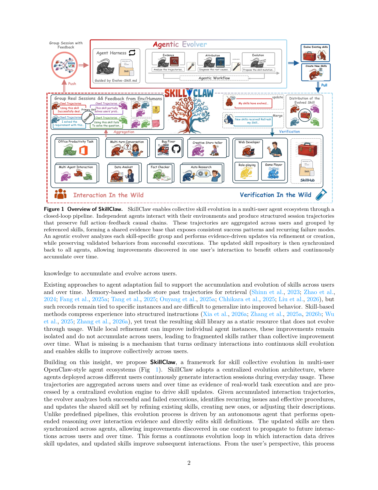
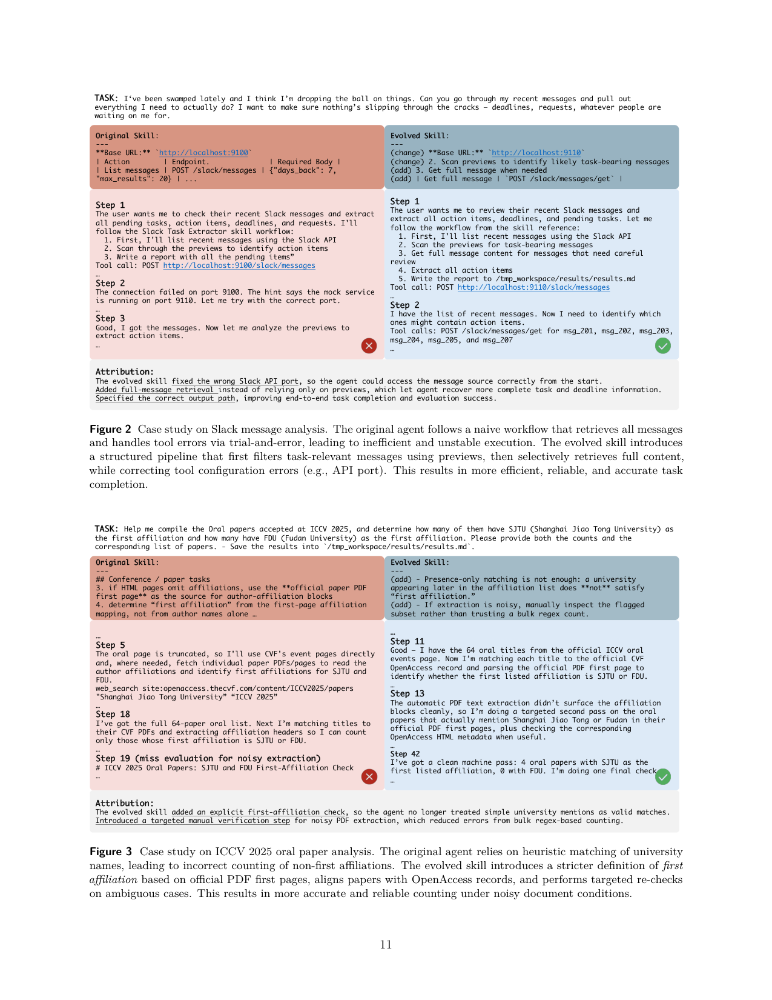

`skillclaw | SkillClaw: Let Skills Evolve Collectively with Agentic Evolver | DreamX Team(阿里 AMAP-ML;Ziyu Ma, Xiangxiang Chu 等) | 2026-04(arXiv v1, 2026-04-09, "Work in Progress") · Preprint · v1 | 主题线 L?(技能演进/经验巩固 · 多用户协同 self-evolving skills)·相关性 High`

> 一句定位:把"OpenClaw 式 agent 的技能库"从**部署后一动不动的静态资源**,改成一个**跨用户、跨时间持续自演进的共享技能生态**——所有用户日常用 agent 产生的轨迹(含 tool 调用/报错/反馈)被汇总,一个 agentic evolver(LLM agent)按"被引用的技能"分组、诊断成败、refine/create/skip,**夜间在真实空闲环境跑验证**,只有严格胜过当前最优才合并、第二天同步给所有用户——一个用户踩的坑,全系统受益。

---

## ══ 第一层:一眼看懂 ══

- 🟦 **TL;DR**:现在的 agent 技能(skills,封装工具用法/SOP 的结构化指令)是用户从 skill hub 手动装好、装完就僵的。结果同样的工作流、同样的工具坑、同样的失败-恢复模式,被一个又一个用户**反复重新发现**,系统从不"长经验"。SkillClaw 的做法:① 每次用户与 agent 交互都记录完整因果链(prompt→action→feedback→…→response),上传成"证据";② 按**被引用的技能**把跨用户会话分组 G(s)(没用任何技能的归到 G(∅));③ 一个 **agentic evolver**(带固定 harness 的 LLM agent)对每组联合看成功+失败会话,选 **refine / create / skip**,直接改写技能文档或新建技能;④ **夜间验证**:候选技能 s′ 与当前最优 s 在**真实空闲用户环境**同条件跑,LLM 判 s′ 是否在任务成功率+执行稳定性上更好,Accept 才合并;⑤ 第二天同步给所有 agent。形成 Interaction→Evidence→Evolution→Validation→Deployment 闭环。在 WildClawBench(60 个真实任务、6 域)上用 Qwen3-Max、8 并发用户、跑 6 天,四个报告类别全部稳定涨(如 Creative Synthesis +88% 相对增益)。

- **最巧的一步**:**"按被引用技能分组 + 夜间真实环境验证 + 只接受严格改进(monotonic deployment)"** 这三件套里,**夜间验证 gate** 抽掉就垮。因为 evolver 是开放式 LLM 推理改文档,极易"修一个坑、踩坏另一个";没有"在真实环境用全工具链跑、与旧版对比、只接受更好者"这道闸,演进就会噪声化、用户体验会抖。论文反复强调这道 gate 带来 **monotonic(不退化)部署** —— 这是它敢说"持续改进"的底气。(注:正文未对"去掉验证"做消融,这是【推断】,依据 §2.3 + §3.2 把验证称为 "critical component" 且唯一保证不退化的机制。)

---

## ══ 第二层:为什么做 ══

- **研究背景**:LLM agent(OpenClaw 类个人助理)靠 **skills** 完成复杂多步任务;技能是 agent 行为的主要积木。但技能从中心化 hub 手动安装、装完即静态,交互中发现的解法很少能跨 session 留存。
- **解决的具体痛点**(§1,很具体):多步任务(如自动化数据处理流水线)的失败常源于**细微的过程性问题**——参数格式错、工具调用顺序错、缺一步校验。agent 经几轮试错也许能凑出可用流程,但**这点改进只活在当前 session**,不沉淀进技能、不带去未来。不同用户处在**重叠的任务空间**(相似工作流/工具/失败模式),系统却不利用这些重复经验 → 每个用户被迫独立重新发现 → 知识无法在系统级累积。
- **作者主张的三性质**(§2,区分于现有系统):(i) **collective evolution 集体演进**——单次交互的知识贡献给共享、持续改进的技能生态;(ii) **fully automatic 全自动**——演进由运行时交互驱动,无需人工策展或用户介入(唯一人类输入=正常用 agent);(iii) **agentic evolution paradigm**——技能更新由**开放式推理**产生,而非预定义更新规则,以应对未见过的失败模式。
- **相关工作 & 不足**(§4):
  - **Memory-based**(Reflexion/ExpeL/Mem0/ReasoningBank/AgentKB…):存过去轨迹供检索,但**记录绑死具体实例、难泛化成"改进后的行为"**。
  - **Skill-based**(Voyager/SkillWeaver/SkillRL/AutoSkill/MemSkill…):把经验压成结构化指令,但**把技能库当静态资源、不随使用演进**;即便有局部精化也**孤立、不跨用户累积**,导致碎片化技能而非集体改进。
  - 共同缺口:缺一个把"普通交互→持续技能演进、并跨用户集体改进"的机制。
- **动机链**:技能静态 + 过程性失败只在 session 内被临时修好 → 跨用户重叠任务空间里同样的坑被反复踩 → 必须把交互轨迹抬升为**跨用户共享证据** → 但单用户信号不足以区分"可泛化改进 vs 个别怪招" → **聚合跨用户证据**才提供稳定演进的 grounding → 用开放式 agentic evolver 改技能 + 夜间真实验证守门 → 闭环。为什么不用更简单的现成法?memory 检索不改"行为";固定规则的技能精化处理不了多样失败模式;单用户 RL/反思不跨用户累积。
- **与最近邻的 Δ**:
  - vs **AutoSkill(Yang 2026,同被本调研收录)/ SkillRL / MemSkill**:它们多在**单 agent / 单优化循环**内从自身历史演进技能;SkillClaw 的演进发生在**群体层(group-level)**,聚合分布式本地 agent 的会话。这是最关键差异——**"集体/多用户"是卖点**。
  - vs **AgentKB(Tang 2025)/ SkillNet(Liang 2026)**:它们框"跨域经验外部知识库 / 技能创建连接";SkillClaw 聚焦**从部署 agent 群聚合证据来 group-level 演进共享技能**。

---

## ══ 第三层:怎么做 + 靠不靠谱 ══

- **方法流水线**(§2,Fig.1,Algorithm 1):
  1. **形式化**:共享技能集 S={s₁…s_M},每个技能=可复用过程性 artifact;每次交互产出 session 轨迹 τ(prompt+actions+env/user feedback+final response);目标 S′=Φ(S,T) 用跨用户轨迹集 T 更新 S。
  2. **结构化会话(保因果)**:每条原始 session 转成 `prompt→action→feedback→…→response` 的结构表示——**因为大多数技能级失败是过程性的**(错参/缺校验/错序),只在中间 action-feedback 轨迹里能诊断,final response 里看不出来。再抽轻量元数据:引用了哪些技能、是否有 tool error、粗粒度质量估计(不强加硬标签)。
  3. **按技能分组(关键设计)**:G(s)={τ_i | s∈K_i} 收集所有调用过 s 的会话;没用任何技能的进 G(∅)。**这相当于一次自然消融**——同一技能在不同用户/任务/环境下产生不同结果,技能本身是受控变量,直接暴露"哪儿能用、哪儿崩"。两个操作因此可靠:① 评估现有技能在真实多样使用下的表现;② 从 G(∅) 的模式里识别"没有技能覆盖的复发过程"。
  4. **agentic evolver(开放式推理)**:一个 LLM agent + 固定 harness(供给:分组会话证据、当前技能定义、允许的演进动作)。harness 给结构化输入但**不约束推理**。对每个 (s, G(s)):选 **Refine**(据失败模式纠错/增鲁棒)/ **Create**(G(s) 暴露未被覆盖的复发子过程时新建)/ **Skip**(证据不足不动)。对 G(∅):专注发现缺失但可复用的过程,仅当模式"足够具体可教且会复发"才建新技能。**关键约束**:无论哪种动作,evolver 总是**联合看成功+失败会话**——成功会话定义"不可动的不变量(invariants)",失败会话定义"要纠正的目标(targets)",防止"修一个坑、毁掉一个原本有效的过程"。这使演进**累积**(cumulative)。
  5. **夜间验证 + 同步(monotonic gate)**:候选 s′ 在**夜间、真实空闲用户环境**用全工具链(含多步交互+中间反馈)与 s 同条件跑;LLM 按"整体任务成功 + 执行稳定性"比较,胜者 Accept 合并并次日同步给所有 agent,败者只留作候选不部署。**因为只接受改进,部署技能池随时间不退化(monotonic)**。
  6. **闭环**(§2.3):Interaction→Evidence→Evolution→Validation→Deployment,更新后的技能塑造未来交互、产生下轮证据。对用户全程不可见(后台收集/演进/同步)。

- **逐组件必要性**(证据较弱,见祛魅):
  - **结构化因果链**:作者论证"过程性失败只能从中间轨迹诊断"——case study(Fig.2 Slack 端口错、Fig.4 SAM3 CUDA 硬编码)都印证这点,但**无定量消融**。
  - **联合成败 / invariants 保护**:声称防"修一个坏一个",**无消融**,靠论证。
  - **夜间验证 gate**:§3.2 称 "critical component",对比"无验证直接部署"会显著不稳——但论文**只给了带验证的结果**,未跑无验证对照。【推断】这是全文最缺的对照实验。
  - **跨用户聚合**:§2 论证单用户信号不足,但实验是 8 个并发用户**跑同一套 WildClawBench 任务**(模拟),并未真正展示"用户 A 的发现迁移到用户 B 的不同任务"的孤立证据。

- **关键机制直觉**:把"技能演进"做成一个**昼夜节律的工厂**——白天用户当"压力测试员"自然产生成败样本,夜间一个"工艺工程师"(evolver LLM)按"哪批料(技能)做砸了"改配方/加配方,改完先在真线试产(真实环境验证)、只有良率更高才上线。分组 G(s) 是把同一配方的所有批次摆一起做"对照实验",成功批次=不能动的工艺红线,失败批次=要改的点。

- **实验与证据**(§3):
  - 数据集:**WildClawBench**(Ding 2026,60 个复杂任务,6 域:Productivity Flow / Code Intelligence / Social Interaction / Search&Retrieval / Creative Synthesis / Safety&Alignment;**全 Linux 容器真实执行**、多模态输入、3–27 指标聚合、**硬约束(关键错误→0 分)**、任务长 15–50 步、依赖外部 API/模型下载)。Backbone:**Qwen3-Max**(执行/演进/验证全用它)。设置:6 天(6 轮)昼夜循环,8 并发用户,共享 best skill pool,Day1=baseline 初始技能集。
  - **支撑核心主张的关键实验**:
    - ① **主表 Table 3(用户侧白天 best-skill 部署视角)**:四类别 Day1→Day6——Social Interaction 54.01→60.34(+6.33,+11.72%);Search&Retrieval 22.73→34.55(+11.82,**+52%**);Creative Synthesis 11.57→21.80(+10.23,**+88.41%**);Safety&Alignment 24.00→32.00(+8.00,+33.33%)。**模式**:先解主瓶颈、再围绕 best pool 稳定(非每日抖动)。
    - ② **逐夜演进-验证决策表 Table 4–7**:暴露真实接受率很低——Social 6 夜只有 Night1 的 `03_task6` 被 Accept(从描述性指令改写成显式有序过程→大涨);Search 接受 `validate-file-existence`(Night1)等;Creative 只接受 Night1 的 `validate-tmp-workspace-inputs`;Safety Night1–4 连续接受 git fallback/clone 类。**说明大量候选被验证 gate 拒掉**(monotonic 守门真在起作用)。
    - ③ **受控验证 Table 8(Skill Evolve Lite,3 个自定义 query)**:单轮演进平均 +42.1%;save report 28.3→100.0(+71.7,缺输出路径过程被补齐),basic extraction +47.8,但 deadline parsing 仅 +6.9(**依赖细致推理的任务对过程性技能更新不敏感**)——这是个诚实的负向信号,给出了"技能演进在哪类失败上有效(过程性) / 在哪类无效(推理性)"的机制级解释。
    - ④ **5 个 case study(Fig.2–5)**:Slack 端口纠错+预览过滤+正确输出路径;ICCV first-affiliation 严格定义+噪声重核;SAM3 环境感知+CPU monkey-patch;手机多约束选型校准化决策。质性展示"技能演进重构出更可靠流水线"。
  - **baseline 公平性 / 局限**【推断+原文】:**没有外部方法 baseline 对比**——Table 3 的 baseline 就是它自己的 Day1。即无 ExpeL/AgentKB/MemSkill 等同台对比。作者**自己明说**(§3.3)"this study represents a small-scale test...limited user queries, feedback signals, and interaction depth"。所有评测/演进/验证都用同一个 Qwen3-Max,可能存在评判偏好自家技能风格的风险。
  - **"看着强但没答核心问题"风险**【推断】:核心卖点"集体/跨用户知识迁移",但实验是 8 用户跑**同一套**任务的模拟,**没有孤立证明"A 用户的发现帮到 B 用户的不同任务"**;增益更像"单一共享池在 6 天里被逐步修好",与"单用户多日演进"难以区分。依据:Table 3/4 全是共享池视角,无 per-user 迁移拆解。

- **假设与失效边界**:
  - 【原文】§3.3:deadline parsing 类**依赖细致推理**的任务对过程性技能更新不敏感(失效边界);Creative 后期更复杂技能在 6 天窗内未超越早期 best pool。
  - 【原文】§3.2:验证带来额外 token 成本(候选须在真实环境跑全工具链),但换来显著更稳的用户侧表现。
  - 【推断】依赖**强 backbone**(Qwen3-Max 级)同时当 executor+evolver+validator——弱模型可能既写不好技能也判不准验证。依据:全栈单一大模型。
  - 【推断】**技能库膨胀/淘汰**:evolver 只 refine/create/skip,**无显式删除/退役机制**;长期跨用户演进下技能数与检索负担如何控制,正文未给硬约束。依据:§2.2 只述三动作。
  - 【推断】"真实空闲用户环境跑夜间验证"在隐私/资源/可复现性上有强工程假设(占用用户机器);学术复现需自建多用户模拟。依据:§2.3 "executed in available idle user environments"。

- **祛魅总结**:
  - 真贡献(硬货):① **把技能演进抬到"多用户群体层 + 共享池"** 的系统设计——相对单 agent 自演进是清晰的范式扩展;② **按被引用技能分组 = 自然消融**,这个组织数据的视角很漂亮,直接让"评估技能真实表现 / 发现缺失技能"变可靠;③ **夜间真实环境验证 + monotonic 部署**——把"开放式 LLM 改文档"的噪声用一道工程 gate 兜住,是它敢称"持续改进"的关键工程实现;④ **联合成败、保护成功不变量**的编辑原则(及其超长的 EVOLVE prompt 附录,§附)是一套可直接复用的"保守技能编辑"工程规范。
  - 包装/营销成分【推断】:(a) "collective / cross-user knowledge transfer" 在实验里**未被孤立验证**(同任务集模拟),宣传强于证据;(b) "Work in Progress"、无外部 baseline、小规模(8 用户/6 天/仅报 4 类),结论更像 proof-of-concept;(c) 命名(OpenClaw/CoPaw/IronClaw/WildClawBench…)是 Claude/Anthropic 生态的化名/影射风格,实际 backbone 是 Qwen3-Max;(d) "agentic / open-ended" 演进本质是**冻结 LLM 按超详细 prompt 改 Markdown**,非端到端学习。依据:§3.3 自陈小规模 + 附录长 prompt + Table 3 无外部对比。

---

## ══ 结构化抽取 ══

- 🎯 **机制速览 6 轴**:

| 学什么信号 | 改什么 | 何时改 | 免梯度? | 记忆-技能生命周期 | 防遗忘机制 |
|---|---|---|---|---|---|
| **环境/人类反馈**(tool 结果/报错/用户回复,编码进结构化因果轨迹)+ **下游任务成功率 & 执行稳定性**(夜间验证的判据,LLM-judge);粗粒度质量估计 | **改技能库 skill repository(技能文档/描述,LLM 文本 refine/create)**;base LLM(Qwen3-Max)**不改**;无参数学习 | **离线批量·昼夜节律**:白天在线收集会话,夜间批量演进+验证,次日同步;非 per-step/per-episode 在线更新 | **完全免梯度**——evolver/executor/validator 均为**冻结 LLM 经 prompt 调用**;改的是外部文本技能 | 写入=evolver 据分组证据 refine/create 技能;检索=inference 时 agent 从技能 catalogue 动态选载相关技能;淘汰=**无显式删除**(只 refine/create/skip)+ 验证 gate 拒绝劣化候选;共享=**跨用户共享 repo + 每日同步全体 agent**(核心) | **验证 gate + monotonic 部署 + invariants 保护**:① 候选须在真实环境严格胜过当前最优才合并→部署池不退化;② 联合成败、保护"成功会话定义的不变量"防修坏已有过程;base LLM 冻结天然不遗忘 |

- ⑦ **开源代码 + 框架/harness**:**已开源** https://github.com/AMAP-ML/SkillClaw(论文首页给出)。**框架 = 无外部 RL/训练框架**(全程冻结 LLM + prompt,不训练任何权重);属**自研 agentic harness**——核心是"会话摘要器(Summarize Session prompt)+ evolver agent(Agentic Evolve / EVOLVE_AGENTS.md harness,带文件读写工具在 workspace 内改 SKILL.md)+ 夜间 validator"。SKILL.md 用 YAML frontmatter(name/description/category)+ Markdown body;技能版本化历史 v<N>.md / v<N>_evidence.md。backbone=**Qwen3-Max**(API)。〔代码仓内部细节待核——本分析基于 PDF 正文与附录 prompt;**未 clone 仓库验证**,P3.5 已标 has_code,具体框架文件以仓库为准〕

- 💰 **资源/成本与可扩展性**:**训练成本=0**(无权重训练,纯 prompt + 文本编辑)。主要成本=**夜间验证的额外 token/真实环境执行**(候选技能须在真实容器跑全工具链多步交互,§3.2 明说"introduces additional token cost",但换来更稳)。实验规模:8 并发用户 × 6 天 × WildClawBench 60 任务,全用 Qwen3-Max API。延迟:用户侧推理时仅在 prompt 里多了技能 catalogue 选载,几乎零额外推理调用;演进异步发生在夜间后台。GPU/具体 token 数正文未给。【原文 §3.2/§3.3】

- 🎯 **对"探索-巩固(TSRD / MTP+OPD)"idea 对标**:**可借组件 + 部分竞品 + 一个关键缺口**。可借:① **"按受控变量(被引用技能)分组做自然消融"** 的证据组织法,可直接迁到 TSRD——把"同一恢复策略/path-recovery 技能在不同 prefix 切点下的成败"分组对照,定位策略真实有效边界;② **"联合成功+失败、成功定义不可动的 invariants、失败定义 targets"** 的保守编辑原则,正对你"巩固阶段不能把已学坏掉"的诉求,是现成的反遗忘编辑规范;③ **夜间真实环境验证 + monotonic gate**——把"探索产出的新策略"先验证再合并、只接受严格改进,可作 TSRD 巩固阶段的"安全合并闸";④ 超详细的 EVOLVE prompt(区分 skill-problem / agent-problem / env-problem)是一套可复用的"诊断归因"模板。竞品面:都做"从经验巩固可复用知识 + 防遗忘",但 SkillClaw 走**外部自然语言技能 + 冻结 LLM + 多用户协同**、零参数学习;TSRD 走**推理路径层 + MTP 前瞻 + OPD 参数蒸馏**。**关键缺口**:SkillClaw 完全不触及"模型能力本身"(executor 冻结),无 MTP 式前瞻、无 path-selection/path-recovery 的细粒度接管——你的 MTP-foresight + OPD 参数蒸馏正补此格;反过来它的"多用户共享技能池 + 验证 gate"可作为 TSRD 的外部巩固/分发层。

- 🔭 **开放问题/未来方向**:
  - 【原文】§3.3 + §5:扩大用户数、延长时间窗、引入更多样任务与验证条件以丰富演进轨迹;号召研究"利用跨用户经验实现持续自改进"的集体 agent 系统。
  - 【推断】(a) **真正孤立验证跨用户迁移**(A 的发现→B 的不同任务),当前实验做不到;(b) **技能淘汰/去冗**机制防库膨胀(现无删除);(c) 与外部 baseline(ExpeL/AgentKB/MemSkill)同台、加无验证对照,补足实证;(d) 弱/小 backbone 下 evolver+validator 的可靠性;(e) 真实部署的隐私/资源/可复现(夜间占用用户机器)。依据:§3.3 自陈小规模、§2.2 仅三动作、全栈单一大模型。

- 🖼 **关键图 top-2**:

  
  这是**原文 Figure 1(总览/方法主图)**:顶部 Agentic Evolver(Agent Harness:Evidence→Attribution→Evolve→agentic workflow,由 Evolve-Skill.md 引导);中部"Group Real Sessions & Feedback from Env/Humans"按 Primary Skill Group 聚合 Claw1–4 的成败轨迹(成功/部分解决/失败)→ Aggregation → 中央 SkillClaw 技能树(Evolve Existing / Create New)→ Distribution of the Evolved Skill;底部六域任务(Office Productivity / Web Developer / Bug Fixer / Creative Storyteller / Data Analyst / Game Player…)经 SkillHub,左 "Interaction In the Wild"、右 "Verification In the Wild",Push/Pull/Merge/Update 闭环。选它因为一图说清本文最核心的范式——静态技能库→多用户协同、白天交互-夜间验证的持续自演进生态,以及 evolver 的诊断-演进-验证-同步全咬合关系。

  
  这是**原文 Figure 2(case study)**:对照展示同一 Slack 任务在演进前后的轨迹与技能 diff——原始技能写死错误端口 9100、agent 试错改到 9110;演进后技能直接 (change) Base URL 9110、(change) 先扫预览定位任务相关消息、(add) 按需取全文、(add) 指定正确输出路径。底部 Attribution 逐条说明每处技能改动如何修复执行。选它因为它把抽象的"技能演进"落到一个**具体、可读的"过程性失败→技能文本修订→端到端成功"**实例,印证 §3.4 "技能演进对过程性失败最有效"的核心机制论断。
