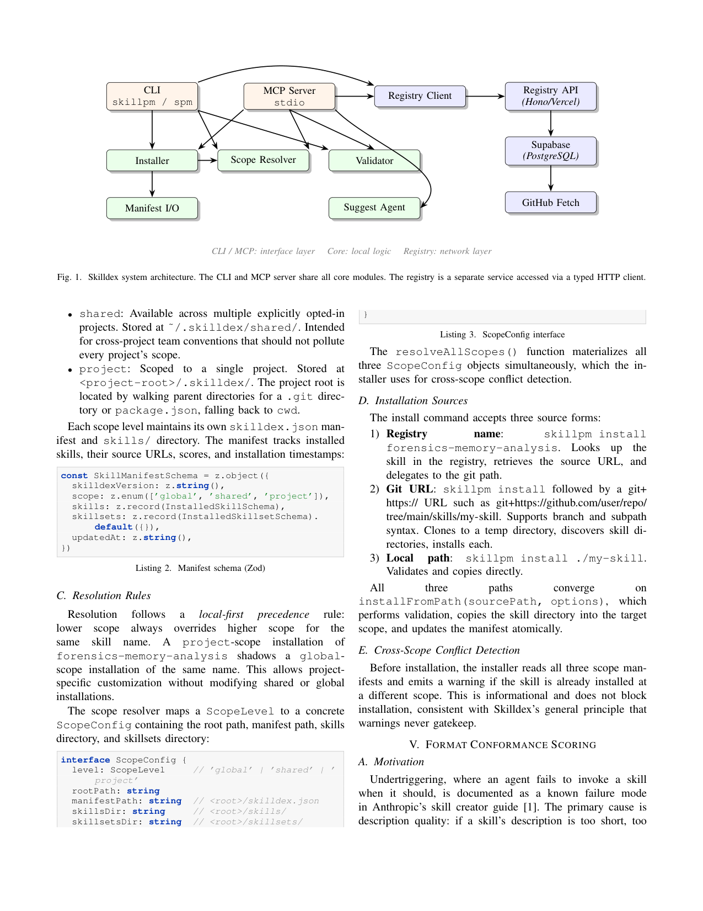
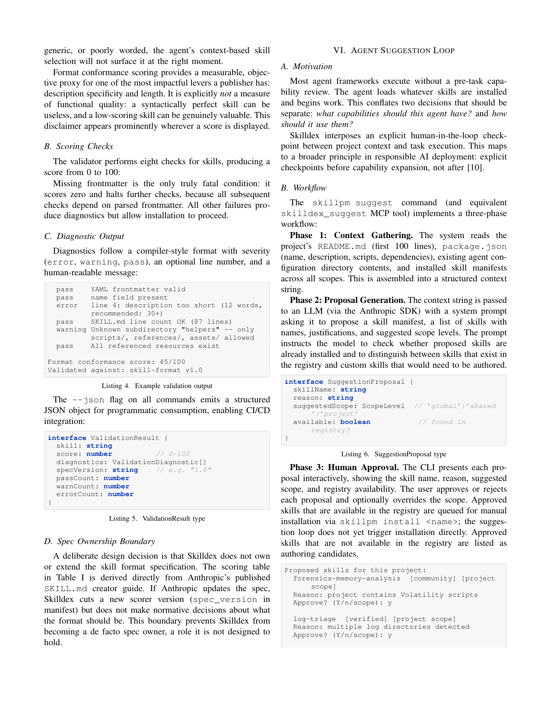

`skilldex | Skilldex: A Package Manager and Registry for Agent Skill Packages with Hierarchical Scope-Based Distribution | Pandemonium Research (Sampriti Saha, Pranav Hemanth) | 2026-04 · arXiv:2604.16911v1 [cs.AI] · 系统/工程 | L3,L6(技能分发+harness/工具) · Med`

> 档位:deep(三层精读 + 完整结构化抽取)。基于 PDF 正文(9 页)。
> 注:本篇是纯软件工程系统论文,**无任何定量实验/评测**(无成本数、无规模数、无 A/B);第三层"实验与证据"以此为核心事实。

══ 第一层:一眼看懂 ══
- 🟦 **TL;DR**:给 Agent 的"技能包"做一个 **npm/pip 式的包管理器 + 注册表**(CLI 名 `skillpm`/`spm`,TypeScript 实现,Hono/Supabase 后端,带 MCP server)。解决两个具体缺口【原文 §I】:(1) 现有工具只看安装量/作者徽章,**没人拿 Anthropic 的 SKILL.md 格式规范给技能打分**——一个 description 太短(触发不可靠)或 frontmatter 写坏的技能,跟规范技能一样被发布安装;(2) 技能都是**散装单独安装**,缺一个"把相关技能 + 它们共享的约定文件/模板/词表捆一起保持互相一致"的抽象。两个新贡献:**① 编译器式格式合规打分(0–100,行级诊断:error/warning/pass + 行号)**;**② skillset 抽象**(一捆共享 assets 的相关技能,保证跨技能行为一致)。配套:三层 scope(global/shared/project,本地优先)+ human-in-loop 建议 loop + 纯元数据社区 registry + MCP server。
- **最巧的一步**:**把 Anthropic 已发布的 SKILL.md 规范当成"编译器/linter 的真值表",做 spec-grounded 合规打分**(§V,8 项检查;缺 frontmatter 是唯一致命项判 0 并停)。抽掉这点,Skilldex 就只是又一个 npm-clone(它自承直接借鉴 npm/pip CLI + Python venv scope 模型),失去相对 vercel-labs/skills 等已有 CLI 的差异化。**且刻意不拥有规范**(§V-D:Anthropic 改规范则它出新 scorer 版本,自己不做规范决策),避免变成事实标准持有者。

══ 第二层:为什么做(写透) ══
- **研究背景**:【原文 §I+§II】LLM agent 越来越多在运行时用 **skill** 扩展——结构化自然语言文档(Markdown + YAML frontmatter 的 SKILL.md),agent 从约定目录(Claude Code 的 `.claude/skills/`)载入当 prompting context。Anthropic 的 Claude Code 推广了这个格式,现已被多家 agent 采用。skill 在性质上**类比软件库**:有作者、有版本、质量参差、最有价值的前提是"可被发现 + 可分享"。
- **解决的具体痛点**:【原文 §I】社区已有安装工具和 registry(vercel-labs/skills、CCPM、ClawdHub 等),但**两个缺口**:(1) **无 spec-grounded 合规信号**——现有工具只 surface 安装量/publisher badge,没有任何工具拿 Anthropic 发布的格式规范给技能打分;一个 description 太短(导致 **undertriggering**:agent 该调时不调,Anthropic skill creator guide 自己记录的已知失败模式)或 frontmatter 坏掉的技能,跟规范技能**一视同仁地被发布安装**;(2) **无 skillset 一致性机制**——技能都是扁平单装,没有抽象把"相关技能 + 它们需要的共享约定文件/参考文档"捆起来;独立安装相关技能会让**每个技能各持隐式词表、悄悄发散**(§VIII 例:一个写 Conventional Commits、一个生成 CHANGELOG,独立装则二者对 commit type → changelog section 映射没有共识,工作流"不是因 bug 而是因共享词表缺失"而断)。
- **相关工作 & 各自不足**:【原文 §II-D】(1) **Smithery.ai / Glama.ai**:MCP server 的 registry,**抽象层不同**(MCP server 暴露 tool,agent skill 改行为);(2) **LangChain Hub**:LangChain prompt/chain 的 registry,生态与抽象层都不同;(3) **Anthropic 官方 skills directory**:结构化 GitHub 仓 + 规范 + 插件市场,但**无 CLI 安装工具、无 scoping**——Skilldex 把它当作 verified tier 的种子源;(4) **vercel-labs/skills**:开源 CLI(`npx skills add`)+ 社区 registry(skills.sh),跨 40+ agent 装 SKILL.md,有搜索/安装量/官方 publisher 标识——**最近邻竞品**,但缺分层 scope 安装、缺 spec-grounded 合规打分、缺 skillset 抽象;(5) **CCPM/ClawdHub/claude-skill-registry**:提供安装/哈希校验/基础 validation,但都**没有 grounded 在 SKILL.md 规范的打分 rubric,也没有 skillset 捆绑抽象**。
- **动机链**:现状(skill 已是运行时扩展主力,社区已有装/搜工具)→ 缺陷①(质量信号全是社会代理 install count/badge,没人查格式合规,导致 undertriggering 的坏技能畅通无阻)+ 缺陷②(扁平单装→相关技能词表发散→工作流静默断裂)→ 所以必须(a) 用规范做**客观可测的格式打分**给 publisher 可操作反馈,(b) 引入 **skillset** 把相关技能 + 共享 assets 绑在一起保一致。为什么不用更简单的现成做法(直接复用 npm)?——npm 解决依赖解析,但**不懂 SKILL.md 语义**(description 长度、frontmatter 字段、允许的子目录),也没有"多技能共享词表"概念;Skilldex 借 npm 的 CLI 形态 + venv 的 scope 模型,但**在上面叠 skill 专属的合规检查 + skillset 抽象**。
- **与最近邻工作的 Δ**:最像 **vercel-labs/skills**(同为 SKILL.md 的 CLI + 社区 registry)。三个 Δ:(1) **分层 scope 安装**(global/shared/project + local-first 解析,借 Python venv + CSS cascade,解决同名冲突);(2) **spec-grounded 合规打分**(0–100 + 行级编译器诊断);(3) **skillset 捆绑**(共享 assets 保跨技能一致)。为什么这差异有用?——前者(vercel)只解决"找到并装上",Skilldex 多解决"装的东西格式对不对(影响触发可靠性)"和"一组技能彼此一致不一致(影响多技能工作流不静默断)",这两点是 flat install 工具的盲区。

══ 第三层:怎么做 + 靠不靠谱 ══
- **方法流水线/系统骨架**(§III Fig 1):三独立组件——**CLI**(`skilldex-cli` npm 包,Node 20+/TS/Commander/simple-git/Zod)+ **Registry**(Hono on Vercel Edge + Supabase/PostgreSQL,存 skill/skillset 元数据 + auth + 搜索 + 安装计数)+ **Web**(Next.js,registry 浏览 + 文档)。关键:**CLI 与 MCP server 共享同一套 `core/` 模块**(install/validate/resolve/manifest),所以两个接口行为不会发散。安装流:registry name / git URL / local path 三种源 → 都汇到 `installFromPath` → 校验 + 拷进目标 scope + 原子更新 manifest。
- **逐组件必要性**(本篇**无消融**,以下为作者论证 + 推断):
  · **格式合规打分(8 检查,Table I)**:【原文 §V】缺 frontmatter=25 分致命判 0 并停;name 10 / description 10 / description≥30 词 10 / SKILL.md≤500 行 15 / 仅允许子目录 10 / 引用资源存在 15 / 资源在正确子目录 5。没它就退回"只看 install count"。**关键诚实点**:作者反复声明(§V-A)"格式合规**明确不是功能质量度量**——语法完美的技能可能没用,低分技能可能很有价值",且此免责声明在任何显示分数处都醒目出现。
  · **三层 scope(§IV)**:解决"把所有装的技能塞进每个 session"在 scale 上失败(context window 与技能数成正比、无关 description 也吃 token、同名冲突无解析策略);local-first 让低 scope 覆盖高 scope。没它则 context 爆炸 + 同名无解。
  · **skillset(§VIII)**:核心特征是 skillset 根的共享 `assets/`,被各成员技能用相对路径引用(例:developer skillset 的 `commit-conventions.md` 被 conventional-commit 和 changelog-gen 共用,**装机时绑同一词表**,保证一个技能写的 commit 必能被另一个解析)。安装 skillset 是 orchestration(复用已有 installFromPath/installFromGitUrl),非新原语。
  · **建议 loop(§VI,human-in-loop)**:三阶段(读 README/package.json/已装技能→LLM 提技能清单→人逐条批/拒/改 scope);把"该有什么能力"与"怎么用"两个决策分开,对应"能力扩张前显式 checkpoint"。**当前局限**:Phase 3 批准后**不自动安装**,要手动 `skillpm install`(§XII 列为待办)。
  · **registry(§VII)纯元数据**:只存元数据 + source_url 指向 GitHub,安装时直接从 GitHub fetch → 基础设施成本近零、继承 GitHub 可靠性/版本、作者保留所有权;代价是依赖 GitHub 可用性 + rate limit。trust tier 二元(verified=Anthropic 官方手动指派、community=任何认证 GitHub 用户),刻意不做星级/karma(避免通胀侵蚀信号)。
  · **设计哲学(§XI)**:三原则——**warnings over blockers**(校验/trust/冲突只提示绝不拦,12/100 也能装,过度 gatekeep 逼用户绕路);**spec 所有权留给 Anthropic**;**两接口一内核**。
- **关键机制/直觉**:没有数学公式;核心机制是**"把规范当编译器真值表"**。直觉:**description 质量是 publisher 手里对触发可靠性最有杠杆的一项,而它的"长度/格式"这一面恰好可被客观量化**(词数、YAML 可解析、子目录白名单),于是用 linter 风格行级诊断把这一面变成可操作反馈(§V-B 输出样例:`error line 4: description too short (12 words, recommended: 30+)` + `Format conformance score: 45/100`)。
- **实验与证据**:**本篇没有任何实验**——无 A/B、无"打分高的技能触发率真的更高"的验证、无成本/延迟/规模数据。它通篇是**系统设计 + 实现细节描述**(schema、API 端点、技术栈 Table V)。作者自己在 §XII 把"打分高低与实际触发可靠性的关系"列为**未解开放问题**("30 词用对术语的 description 比 100 词错术语的触发更好,语义质量打不了分")。【推断:故"合规打分有用"这一核心卖点目前是**未经验证的假设**,只有"格式合规可客观测量"是事实,"格式合规⇒功能更好"无证据。】
- **假设与失效边界**:【推断】**隐式假设"格式合规是技能质量的有用代理"**,而它自己反复声明这恰恰**不是功能质量度量**(§V-A)——这是其最大局限:量化了易测的(格式)、回避了难测的(功能效果)。【原文 §XII 自承七个开放问题/失效边界】spec 无显式版本(靠人工跟踪)、语义 description 质量打不了分、manifest 并发写非原子(并行 CI 会 torn)、三层 scope 是设计假设(复杂多项目团队可能要任意嵌套)、无团队身份/RBAC、**冷启动**(registry 价值随发布技能数增长,但社区增长依赖采用→低效用→低采用→少贡献者的死循环)。
- **祛魅总结**:【推断】**真贡献(硬货)**:(1) **skillset 抽象**——"相关技能 + 共享 assets 装机时绑同一词表保一致"是个有价值的工程概念,确实戳中 flat install 工具的静默断裂盲区;(2) **罕见的克制**——明确声明"我只评格式不评功能""不拥有规范",避免了很多包管理器的越权陷阱。**包装/营销面**:(1) 论文 abstract 强调"两个 novel contribution",但本质都是**已知工程模式的领域移植**(linter + 包捆绑),"novel"主要在"首个 grounded 在 SKILL.md 规范"这个领域首发性,而非技术新颖性;(2) **核心卖点(合规打分)与实际效用的因果链未验证**——读者可能误以为"高分=好技能",作者虽自我声明但这层风险真实存在;(3) 整篇是 engineering report 性质,与本调研主轴(学习/巩固)**零交集**——它完全不碰技能怎么学/怎么改/怎么巩固。作者**没有高估**自己(反而处处自我设限),这点值得肯定。

══ 结构化抽取(供全景汇总) ══
- 🎯 **机制速览 6 轴**:
  | 学什么信号 | 改什么 | 何时改 | 免梯度? | 记忆-技能生命周期 | 防遗忘机制 |
  |---|---|---|---|---|---|
  | **无学习信号**——纯软件工程:格式规范 + 人在环审批 + 社区元数据;建议 loop 调 Anthropic SDK 让 LLM 提技能清单 | **harness / 技能分发基础设施**(安装/校验/检索/manifest);不改模型、不改技能内容质量(明确只评格式不评功能) | 安装/发布时(离线、人触发);MCP 让 agent 可会话中自管技能环境(mid-session) | **是**(无任何训练) | 写入(publish 到 registry,带 conformance score)→ 检索(全文搜索 + trust tier)→ 安装(三层 scope 解析,本地优先,解决同名冲突)→ 共享(社区 registry,Anthropic 官方技能种子为 verified tier);**淘汰/遗忘:原文未明确机制** | **不适用** |

- ⑦ 开源代码 + 框架/harness:**已开源** https://github.com/Pandemonium-Research/Skilldex(【原文 §XIII 明确给出 URL】;CLI 发到 npm 为 `skilldex-cli`;registry=Hono on Vercel + Supabase,Web=Next.js;MCP server 暴露 install/list/validate/search/suggest/uninstall + skillset 系列)。harness:**MCP + TypeScript 自研工具链**,无 ML 框架。〔已核:正文 §XIII 与摘要均确认 open-source 且给出 GitHub 与 npm 名,先前"未给 URL"的待核已消除。〕
- 💰 资源/成本与可扩展性:**原文未给定量**(无成本/延迟/规模评测)。设计上**基础设施成本近零**(registry 只存元数据、文件托管在 GitHub、Hono on Vercel Edge);rate limit 当前用 in-memory(计划 Upstash Redis);anonymous GitHub 60 req/hr、带 token 5000 req/hr。【推断:可扩展性瓶颈在 GitHub rate limit + 社区冷启动,而非算力。】
- 🎯 **对"探索-巩固"idea 对标**:**缺口(纯工程基础设施)**。它管的是"技能包怎么发布/检索/装/保持一致",**完全不碰技能怎么学/怎么改/怎么巩固**。对 TSRD 的价值:**skillset 抽象**(相关技能 + 共享 context 捆绑保一致)这个工程概念,可作为"多技能组织/版本/scope 治理"层借鉴;但无任何学习成分。
- 🔭 开放问题/未来方向:【原文 §XII 七项】spec 显式版本化、**语义 description 质量打分(提议用 embedding-based similarity 对成功触发上下文打分)**、manifest 并发原子性、scope 层级深度可配、团队治理/RBAC、社区冷启动、建议 loop 直接安装。【推断】最关键的研究缺口是**验证"合规分数 ↔ 实际触发可靠性"的因果关系**——这是把它从工程产品升格为研究贡献的唯一路径。
- 🖼 **关键图 top-2**(保留原选):

这是**原文 Figure 1**(系统主图,该页)。表现 CLI/MCP 接口层 → Core 本地逻辑(Installer / Scope Resolver / Validator / Manifest I/O / Suggest Agent / Registry Client)→ Registry 网络层(Hono/Vercel + Supabase + GitHub Fetch)。选它因为它一图说清"CLI 与 MCP 共享同一套 core 模块"的工程骨架,是理解该系统的入口。

这是**原文该页**(含 Listing 4 校验输出样例 + §V-D spec ownership boundary)。表现核心卖点:pass/warning/**error line 4: description too short (12 words, recommended 30+)** 这种行级编译器风格诊断 + "Format conformance score: 45/100"。选它因为 conformance scoring 是两大新贡献之一,这段最直观地展示它长什么样。
