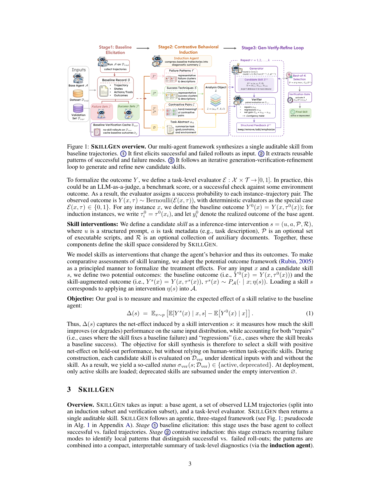

`skillgen_verified | SKILLGEN: Verified Inference-Time Agent Skill Synthesis | LMU Munich (MCML) + Notre Dame + Microsoft Research (Yuchen Ma, Yue Huang, Han Bao, Haomin Zhuang, Swadheen Shukla, Michel Galley, Xiangliang Zhang, Stefan Feuerriegel) | 2026-05 · arXiv:2605.10999v1 [cs.LG] · Preprint | L3(技能合成)· Med`

> 档位:deep(三层精读 + 完整结构化抽取)。基于 PDF 正文(20 页,正文 + 实验/消融/迁移)。

══ 第一层:一眼看懂 ══
- 🟦 **TL;DR**:自动从 Agent 的成功+失败轨迹里**合成一条人可读、可审计的"技能"(推理时挂进 context 的程序化指引,不改权重)**,而且**用因果干预的方式验证这条技能到底有没有净增益**才决定上不上。两个对前作的关键改进【原文 §1】:(1) 别人主要从成功轨迹学(失败顶多孤立总结),SKILLGEN 用 **contrastive induction(对比归纳)**——把同一任务下相邻的成功 vs 失败配对,专门抓"成功里有、失败里缺的那一步"(如一个中间校验步);(2) 别人不验证技能的经验收益,而技能既可能**修好失败(repair)也可能弄坏原本对的(regression)**,所以 SKILLGEN 把技能建模成 **intervention(干预)**,在同一批 instance 上做 with/without 配对评测,算净效应 ∆(s)=repairs−regressions,只保留净正的(verification gate)。
- **最巧的一步**:**把"技能是否有用"形式化成 Rubin potential-outcome 框架下的干预净效应,并做成一道 verification gate**(§2 公式 1;§3 best-of-K 选 ∆ 最大者,过门槛才 active)。抽掉这道"配对净效应验证门",方法就退回成"LLM 总结轨迹写个 prompt"——而它全文的"verified"卖点和"既算修复又算回归"的严谨性就没了(消融 A3 证明 verification gate 是涨点来源之一)。

══ 第二层:为什么做(写透) ══
- **研究背景**:【原文 §1】LLM 越来越多解多步复杂任务,一种常见的形式化是 **skill**——可复用的推理时程序(指令/可执行代码/领域知识),**不改模型权重**就给任务特定指引。skill 的好处是模块化 + 可审计:它是可读的推理时 artifact 而非权重更新或 prompt search,所以能检视它编码的程序、直接改、部署前测效果。但现实里**高质量 skill 仍主要靠手写**。
- **解决的具体痛点**:【原文 §1】自动技能合成想从 agent 经验里学可复用 skill,但现有方法有**两个硬伤**:(1) **主要从成功轨迹学**,即便考虑失败也是**孤立总结**,而非"在同一任务上拿失败对照相邻的成功"——于是错过了**成功 vs 失败的对比信号**(agent 在相似上下文里正确做了什么、失败时漏了什么)。例:成功轨迹含一个中间校验步、失败轨迹没有,但 success-only 学习**不会把"中间校验很重要"隔离出来变成可复用模式**;(2) **不显式验证技能的经验收益**——一条 skill 可能修好某些失败,但也可能在**原本做对的题上引入新失败**;因此技能合成**本质是干预问题**,要比较"加/不加候选技能"的净效应,且这种性能评估也是"有原则地迭代精炼候选技能"的前提。
- **相关工作 & 各自不足**:【原文 §1+§4-RQ2】摆在四个最近邻"技能合成"工作旁,SKILLGEN 全程把它们当 baseline 直接比:**Trace2Skill**(Ni et al. 2026,把轨迹局部教训蒸成可迁移技能)、**SkillX**(Wang et al. 2026,把轨迹蒸成分层技能并执行反馈精炼)、**EvoSkill**(Alzubi et al. 2026,多 agent 系统的自动技能发现)、**CoEvoSkills**(Zhang et al. 2026,从 EvoSkills 实例化的协同进化 baseline)。它们的共同不足:要么 success-only / 失败孤立总结(缺对比信号),要么不做干预式净效应验证(可能引入未被察觉的回归)。更远的背景:Reflexion(verbal RL)、Voyager(代码技能库)、role-play/personalization 等。
- **动机链**:现状(skill 是不改权重提升 agent 的好途径,但靠手写)→ 缺陷①(自动方法多 success-only,丢了"成功有/失败缺的关键步"这个最有信息量的对比信号)+ 缺陷②(没人验证技能净收益,可能 repair 几个却 regress 更多,净亏)→ 所以必须(a) 做 **contrastive induction** 把对比信号显式抽出来,(b) 把技能当 **intervention** 做 **配对 with/without 验证**,用净效应 ∆ 选并设门。为什么不用更简单的现成做法?——【原文 §4-RQ3 消融 A1】把"诱导出的技能"换成"k=3 demonstration 重用"(纯 ICL/检索)效果更差,证明**增益不只是检索**;【RQ6/Fig7】不做 best-of-K 选择而用"最新一轮候选",到第 8 轮最新候选期望 ∆=−3.1pp 而 best-verified 达 +8.1pp(差 ~11pp),证明**精炼轨迹本身是噪声的,必须靠验证门做选择**。
- **与最近邻工作的 Δ**:最像 **Trace2Skill / SkillX**(同为"从轨迹蒸技能")。两个关键 Δ:(1) **对比归纳**(成功-失败相邻配对抓缺失步)vs 它们的 success-centric / 失败孤立;(2) **干预净效应验证门**(repair−regression 的因果度量 + best-of-K 选择)vs 它们不验证净收益。为什么这差异有用?——前者让技能锚定在"同一 base agent 已演示过、但在邻近失败里缺席"的行为上(§3.2 局部对比 C,比聚类摘要更能抓"小动作选择");后者把"技能可能弄坏对的题"这个隐患显式量化并拦住,这是 SKILLGEN 主张"verified"的根基。

══ 第三层:怎么做 + 靠不靠谱 ══
- **方法流水线**(§3 Fig 1,三阶段多智能体):
  · **Stage1 Baseline Elicitation**:跑 base agent A 在 induction 子集 Dind 上,存 \(B={(xi, τ0_i, y0_i)}\),分成失败集 I−(y0=0)和成功集 I+(y0=1);并在 construction-time verification 子集 Dver 上缓存 no-skill outcome(`Bver`,供后续配对验证省钱,首轮不参与生成/归纳)。
  · **Stage2 Contrastive Behavioral Induction**(induction agent):把轨迹压成诊断摘要 \(Z=(a0, F, S, C)\)——a0 任务级抽象、F 失败聚类摘要(每簇:复发根因 + 失败常出现的轨迹位置 + 该用的纠正规则)、S 成功聚类摘要(可复用程序 + 出现条件 + 让程序鲁棒的检查)、**C 局部对比**(对每个失败实例,在 embedding 距离下取最近成功邻居,先查是否同任务类型,再对比两条完整轨迹,描述"成功里有、失败里缺"的行为)。Stage3 只接收 Z(把变长轨迹降维成诊断摘要)。
  · **Stage3 Gen-Verify-Refine Loop**:**Generator** 用 Z(+上轮反馈)生候选技能 \(s=(u,a,P,R)\),其中 u 用固定三段 schema \((u_ctx, u_succ, u_fail)\)(任务上下文 / 可复用成功模式 / 可复用避错模式),工具密集任务还可带脚本 P + 参考文档 R(r>1 后只改自然语言 body、锁住工具接口防膨胀)→ **Verifier** 在 Dver 上对每个候选做配对评测,构造列联表(repairs n01:0→1,regressions n10:1→0),净增益 \(Gm=n01−n10\) → **结构化反馈** Φ=(keep/remove/add/emphasize)精炼 → **Best-of-K 选择** s⋆=argmax Gm → **Verification Gate**:仅当 \(Gm(s⋆)≥γm\)(γm=max{gabs, ⌈grel·m⌉, 1},即绝对 + 相对 + 至少净正 1)才标 active,否则 deprecated 退化成空干预。部署时只把 active 技能注入 system prompt 专用槽,参考文档按需 `skill_load_reference` 载入。
- **逐组件必要性(有完整消融 §4-RQ3 Fig3,A1–A5)**:
  · **对比归纳 / Failure Lessons(A4 去掉失败教训)**:【原文】失败模式在 ALFWorld OOD 上有用——去掉则 ALFWorld OOD 掉。
  · **refinement(A2 去精炼)** + **verification gate(A3 去门)**:【原文】二者对交互任务的可靠增益**都必需**,因为早期候选可能修了一些失败却引入回归;Full 在每个 dataset–model 对上都最优。
  · **task-specific skill 结构 / script+reference bundle(A5 纯文本无脚本+参考)**:【原文】在 ChemLLMBench 上有用(去掉则掉)。
  · **诱导技能 vs 纯 ICL(A1,k=3 demonstration)**:【原文】诱导技能 > demonstration 重用,证明**增益不是单纯检索**。
  · **Best-of-K 选择(RQ6/Fig7)**:虽非传统消融,但定量证明它把"不稳定的精炼轨迹"变成"可靠最终技能"(第 8 轮最新候选 −3.1pp vs best-verified +8.1pp)。
- **关键机制/直觉**:核心式是 **∆(s)=E_x[E[Y^s(x)] − E[Y^0(x)]]**(公式 1)与其经验估计 \(Ĝm=n01−n10\)(公式 12)。直觉:**别只问"技能修好了多少"(repair),要同时减去"技能弄坏了多少"(regression),净值为正才算真有用**——这正是 Rubin 潜在结果框架"同一输入下比有无处理"的精神。配对评测(同一 instance、同一 base agent、只改是否注入技能)消掉了任务难度的混杂,使 Ĝm 是 ∆(s) 的无偏估计(§3.3:固定非自适应技能 + iid 验证集时 E[Ĝm]=∆)。
- **实验与证据**:数据集覆盖交互/科学/编码/web/工具:**ALFWorld(IOD/OOD)、ScienceWorld、LiveCodeBench、MCPBench、Mind2Web、PubMedQA、SocialMaze、τ-Bench retail、ChemLLMBench(property/yield)**;8 个 base LLM(开源 Gemma-4-26B/Llama-3.1-8B/Mistral-Nemo/Qwen-2.5-7B + 闭源 Claude-Haiku-4.5/GPT-5.4-Nano/GPT-5.4-Mini/Grok-4-Fast)。**支撑核心主张的关键实验 + 具体数字**:(1) **主结果(Table 1,80 个 benchmark–split–model 组合)**:8 个 base LLM **平均准确率全部提升**,held-out 增益 **+3.27 ~ +10.08 pp**(开源 +3.27~+4.77、闭源 +4.79~+10.08);80 项里 **50 涨 / 25 不变 / 仅 5 回归**;最大增益在程序性多步 benchmark——**ALFWorld 16 项中 14 项涨、ScienceWorld 8 个 agent 全涨**;(2) **vs baselines(Fig2)**:在 ALFWorld IOD/OOD + ScienceWorld 上对比 Trace2Skill/SkillX/EvoSkill/CoEvoSkills(同评测 harness),SKILLGEN 一致为正且平均增益最大;(3) **跨模型迁移(Fig4,36 个 source×evaluator 对,每 benchmark 100 held-out)**:120 个 off-diagonal 比较中 **70% 非负、42% 超 +5pp**;关键洞察——**最能产可迁移技能的不一定是最强 agent**(ALFWorld 上 Qwen-2.5-7B 平均最佳,ScienceWorld 上 GPT-5.4-Nano 最佳);(4) **τ-Bench(Fig5)**:门通过的 5 个模型平均 +5.3pp,门未过的模型保持不变(不暴露未验证干预);(5) **ChemLLMBench(Fig6)**:yield prediction 6 模型平均 +16.1pp,property prediction 只少数涨(知识 bound 任务技能难修)。**baseline 公平性**:【原文 RQ2 明确"all methods use the same evaluation harness"】,且主结果用 paired held-out(构造完成后同一 instance 跑有/无技能),较为严谨。**看着强但需注意**:不少格子是 0.00%/±0.0(如 LiveCodeBench、MCPBench 多模型无变化),平均增益被 ALFWorld/ScienceWorld 等程序性任务拉动——【原文 RQ7 自承】交互环境残留失败多是"程序执行不完整"、化学/编码失败常是"grounding/全局结构限制,推理时技能修不了"。
- **假设与失效边界**:【原文+推断】**核心主张(原文)**:把技能建模成可验证干预、用对比归纳 + 净效应门,能在多 base LLM 上稳定 held-out 涨点且跨模型迁移。**隐式假设(推断)**:(a) **单条全局技能就能改善整个任务分布**——当任务高度异质、一条技能难覆盖时受限;(b) **构造期 Dver 上验证的净效应能泛化到 held-out**——【原文 RQ7 自承】accepted skill 仍可能在 held-out 上 overgeneralize;(c) evaluator E 足够准——E 可为 LLM-judge,噪声大时 ∆ 估计失真。**失效边界(原文 RQ5/RQ7)**:任务若主要是"回忆领域事实"而非"程序可学"(如 property prediction)增益微弱;grounding/全局结构受限的任务推理时技能无能为力。
- **祛魅总结**:【推断】**真贡献(硬货)**:(1) **把"技能有没有用"从直觉升格为可证伪的因果度量(repair−regression 净效应 + 配对评测)**,并落成 verification gate——这是 skill-synthesis 文献里少见的严谨化,且消融 + RQ6 都给了它"既是安全检查又是选择机制"的实证;(2) **对比归纳抓"成功有/失败缺的那一步"**,是个廉价且有信息量的信号;(3) 实证规模扎实(8 LLM × 10 benchmark × 完整消融 + 跨模型迁移矩阵)。**包装/营销面**:(1) "+3.27~+10.08pp"是**平均值**,被少数程序性任务拉动,大量格子 0 变化,读者勿误以为"处处大涨";(2) "verified"听着像保证有效,实则只保证**构造期 Dver 上净正**,held-out 仍可能 overgeneralize(作者诚实指出);(3) 多智能体框架本质是**三个 prompt 角色 + 干预评测的编排**,无 RL 训练、无参数巩固,与本调研主轴(参数巩固/防遗忘)不在同一层。作者整体**未明显高估**——RQ7 主动列了失败模式与边界。

══ 结构化抽取(供全景汇总) ══
- 🎯 **机制速览 6 轴**:
  | 学什么信号 | 改什么 | 何时改 | 免梯度? | 记忆-技能生命周期 | 防遗忘机制 |
  |---|---|---|---|---|---|
  | 环境/评测 outcome(成功失败二值,evaluator E 可为 LLM-judge/benchmark/环境校验)+ 成功失败的**对比信号** | **技能 = 推理时干预 s=(u,a,P,R)**:结构化 prompt + 任务元数据 + 可选脚本 + 可选参考文档;**不改模型参数**(产物可跨模型迁移) | **离线构造**(三阶段:baseline 采集 → 对比归纳 → 生成-验证-精炼循环);部署时只挂 active 技能 | **是**(纯 inference-time artifact;明确"without parameter updates") | 写入(对比归纳出 diagnostics → 生成候选技能)→ 验证/精炼(gen-verify-refine 循环,结构化反馈 keep/remove/add/emphasize)→ 选择(best-of-K by ∆)→ **状态机 active/deprecated**(deprecated 等价空干预,不加载) | **不适用**(无训练);但 verification gate 防"负迁移/技能弄坏原本对的题"可视作一种**质量隔离/回归防护** |

- ⑦ 开源代码 + 框架/harness:**已开源** https://github.com/yccm/SkillGen(【原文】§2 脚注)。harness/框架:**多智能体框架,自研**(三个专门 agent:contrastive induction / generation / verification;无 RL 训练框架,纯 LLM 编排 + 干预评测;部署时脚本以 `skill_` 前缀的顶层函数 + `skill_load_reference` 按需加载参考)。
- 💰 资源/成本与可扩展性:**部分说明**——核心成本来自 baseline elicitation 采集成功/失败轨迹 + 在 Dver 上反复 with/without 配对评测;有 **baseline verification cache**(`Bver` 缓存 no-skill rollouts 复用,省重复采样)。精炼有 round budget K(实验 K 到 8;Fig7 显示并非越多越好,best-of-K 才是关键)。具体算力/API 美元数原文未给定量。
- 🎯 **对"探索-巩固"idea 对标**:**强可借组件**。两点高度可迁移到 TSRD:(a) **"成功 vs 失败相邻配对、抽出失败里缺的那一步"**(§3.2 局部对比 C)——与 path-recovery / 关键步定位思路同构,是一种廉价的"哪一步该接管"信号;(b) **干预净效应验证门(repair−regression + best-of-K)**——给"加了某个 scaffold/技能后是否真净增益"提供严谨度量,可直接用来筛 TSRD 的脚手架是否值得保留。属支撑+可借组件,非竞品(它免梯度、不做参数巩固)。
- 🔭 开放问题/未来方向:【原文 RQ7/全文】accepted skill 在 held-out 上 overgeneralize 的控制;交互环境"程序执行不完整"类残留失败如何修;grounding/全局结构受限任务推理时技能的天花板;【推断】当前是**单条全局技能**,扩展到"多技能/分层技能 + 各自验证门"以覆盖异质任务分布,是自然下一步;把净效应验证从离线构造期延伸到**在线持续验证**也是潜在方向。
- 🖼 **关键图 top-2**(保留原选并补一张):

这是**原文 Figure 1**(方法主图,该页)。表现完整流水线:**Stage1 Baseline Elicitation**(跑 base agent 收成功集 I+/失败集 I−)→ **Stage2 Contrastive Behavioral Induction**(归纳 agent 把成功技巧 S、失败模式 F、对比对 C 压成诊断摘要 Z)→ **Stage3 Gen-Verify-Refine Loop**(Generator 生候选技能 → Verifier 在 Dver 上配对评测出列联表/repairs n01、regressions n10、净增益 Gm → 结构化反馈精炼 → **Best-of-K 选 Gm 最大 → Verification Gate 过门槛才 active**)。选它因为它把"对比归纳 + 干预验证门"两个核心创新一图全包,是该论文最精华的表达。
*(注:Figure 1 已综合呈现机制;主结果(Table 1)与迁移矩阵(Fig4)为表格/热图形式,本篇仅渲染到方法主图 1 张,其余未单独取图——属"主结果为表格,未另取图",非提取失败。)*
