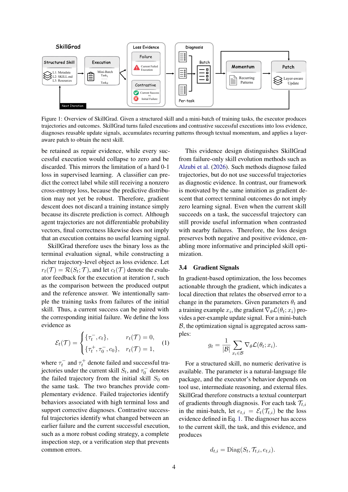
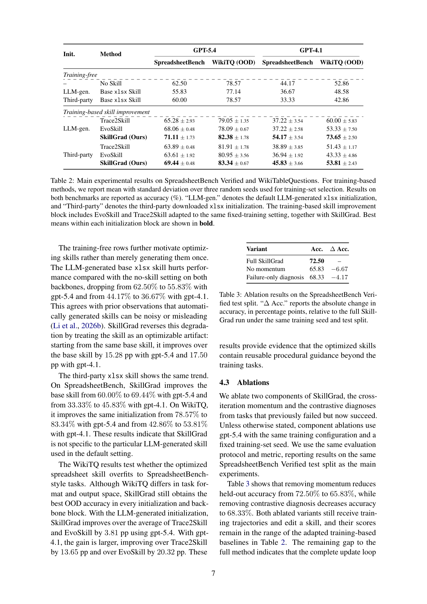

`skillgrad | SkillGrad: Optimizing Agent Skills Like Gradient Descent | 宾州州立 Penn State(Hanyu Wang, Yifan Lan, Bochuan Cao, Lu Lin, Jinghui Chen 通讯) | 2026-05(arXiv v1 2026-05-26)·Preprint·v1 | 主题线 L3(技能优化/技能自进化)·相关性 High`

> 一句定位:把"改进一个 agent 技能包"**严格类比成对参数做梯度下降**(概念类比,非数值):**技能包 \(S\)=(元数据 H, SKILL.md 正文 B, 资源 Q) 当参数** → 在一小批任务上执行得轨迹/结果当 **loss evidence**(不仅用失败,还**对比性地用"初始技能失败但当前技能成功"的成功轨迹**,类比"0-1 loss 答对≠零梯度")→ diagnoser 把证据转成**文本梯度** \(d_{t,i}\)(指明纠正方向)→ **文本 momentum agent** 跨迭代累积"反复出现的诊断模式"成持久记忆 \(M_t\) + 当前 overlay \(O_t\)(稳住更新、不只追当前 batch)→ **layer-aware patcher** 决定"改什么 + 改到 H/B/Q 哪一层",产出 \(S_{t+1}\)。在 SpreadsheetBench-Verified + WikiTQ(OOD)、两个 backbone(gpt-5.4/gpt-4.1)上,**比最强的 training-based 技能进化基线平均高 6.7pp**;消融证明 momentum 与对比诊断都有贡献。

---

## ══ 第一层:一眼看懂 ══

- 🟦 **TL;DR**:现状痛点——agent 技能(结构化文件包,存可复用过程知识)无论第三方下的还是自动生成的,常**不可靠/不完整/过时**,SkillsBench 已证自动生成的技能可能远不如专家写的、甚至**比不用技能还差**;现有技能进化法多靠**启发式反思(heuristic reflection),没有显式的优化形式化**。SkillGrad 给出一套**梯度下降式**的技能优化框架(Table 1 是核心对应表):把技能包当可优化参数,每轮——① **执行**:当前技能在 mini-batch 任务上跑,得结果+轨迹当 loss evidence;② **loss evidence 设计**(Eq.1,最巧):失败任务给纠错证据 \(\{τ⁻_t, c_t\}\);**成功任务则配上"同一任务在初始技能 \(S₀\) 下的失败轨迹 \(τ⁻₀\)"做对比** \(\{τ⁺_t, τ⁻₀, c₀\}\)——**保留正负两类证据**;③ **diagnoser → 文本梯度** \(d_{t,i}\)(不是打分/总结,而是"证据指向哪个执行行为该修/该保留"的更新信号,且**以当前技能 \(S_t\) 为条件**——同样证据,取决于"指引缺失/太弱/已有但被忽略"会推出不同更新);④ **文本 momentum**:不做算术累积/衰减,而是**追踪反复出现的语义方向及其"是否已被吸收"的状态**,把"多个表达同一机制的诊断"当一个 recurring 方向(语义聚合),并**把成功对比行为带向后续**;⑤ **layer-aware patch**:patcher **改"模式"而非"任务"**(多诊断指向同一机制→一条泛化编辑,防技能变成训练集的 append-only 流水账),且决定知识该放 L1/L2/L3 哪层(B 总被加载→放紧凑通用指引;Q 按需加载→放长流程/边角/例子)。

- **最巧的一步**:**"对比性 loss evidence——把成功轨迹也当学习信号(配对初始失败),而非只诊断失败"**。这是 SkillGrad 区别于 EvoSkill 等 failure-only 方法的关键,且直接落地了那条漂亮的优化直觉:**"终端答对 ≠ 该样本无可学信号"**(就像分类器预测对了交叉熵仍非零、GD 不因离散预测对就丢样本)。抽掉它→退回"只追失败"的启发式反思,消融 Table 3 显示去掉对比诊断掉 4.17pp。**为什么是它**:技能优化最怕"修好了 A 又改坏了 B",对比成功轨迹明确告诉 patcher"哪些新学会的行为(更稳的写码/完整的检查/防错的验证步)值得保留",把"巩固已学"和"修复失败"对称地纳入。(次巧=文本 momentum,去掉掉 6.7pp,是更大的承重墙;但对比诊断是更"反直觉、更具迁移性"的概念创新。)

---

## ══ 第二层:为什么做 ══

- **研究背景**:LLM agent 在长程决策(推理/规划/网页)进步快,但很多实际应用在**过程密集的专门域**(电子表格操作/文档编辑/代码库维护)需反复遵循领域工作流、正确用专用工具、处理重复边角。靠微调/检索管线/反复网搜来适配域**贵或笨重**,尤其当所需知识是**过程性(procedural)而非纯事实**时。**Agent Skills** 提供轻量替代:持久文件包,按需渐进加载,是结构化 artifact(元数据决定何时激活、SKILL.md 激活后总加载、资源按需查)。
- **解决的具体痛点**(§1):**适配效果严重依赖技能质量**;SkillsBench 证自动生成技能可能远逊专家、甚至**降低 agent 性能(比不用技能还差)**。这问题比"自动生成"更广——**任何固定技能包**都可能漏任务特定边角、与目标任务分布错配、或编码了对工具/工作流的脆弱假设。引出核心问题:**能否把技能当可优化 artifact,在初始化后系统性地改进它?**
- **相关工作 & 各自不足**(§2):
  - **training-based 基线(本文重点对标,因都"吃执行、产独立技能 artifact",可在同初始化/同训练任务/同 backbone/同 held-out 下公平比)**:**EvoSkill**(失败驱动:分析失败→产新/改技能→用 held-out 验证选候选;**只用失败、不用成功做诊断证据**)、**Trace2Skill**(轨迹→技能蒸馏:分析一池轨迹、抽局部 lesson、层级合并成统一技能目录;**离线 trace 蒸馏,不重复执行当前技能**)。
  - **更广的技能系统(非直接基线)**:SkillX(多级技能即插即用库)、SkillClaw(多用户生态的集体技能进化)、Memento-Skills(markdown 技能当持久记忆 read-write loop)、CoEvoSkills(生成器+验证器造多文件技能包)、AutoSkill(从用户对话终身个性化技能)。
  - **共性 gap**:技能进化多是**启发式反思,无显式优化形式化**;failure-only;离线蒸馏不闭环。
- **动机链**:技能轻量但质量决定一切 → 自动/第三方技能常坏甚至有害 → 现有进化法是启发式无优化框架、且只追失败 → **借 GD 的形式化结构**(参数/loss/梯度/momentum/更新各有清晰角色)给技能优化一个"有原则的设计透镜" → 但技能是离散文本无数值导数 → 用**文本诊断当梯度 + 文本 momentum 当优化器状态 + layer-aware patch 当参数更新** → 且学 GD"答对不丢样本"→ **对比性保留成功证据**。为什么不用更简单法?纯反思(EvoSkill)无系统优化结构、丢成功信号;离线蒸馏(Trace2Skill)不闭环(更新不改后续观测到的证据);微调贵且把过程知识塞进权重不透明。
- **与最近邻的 Δ**:
  - vs **EvoSkill**(最近邻,failure-only + 验证选择):SkillGrad **同时用失败+对比成功**当 loss evidence(关键差异),且**优化单个当前技能 artifact**(不是产候选再验证选),更新闭环改变后续证据。
  - vs **Trace2Skill**(离线 trace 蒸馏):SkillGrad **反复执行当前技能** → 每次更新改变后续迭代观测到的证据(在线闭环 vs 离线一次性)。
  - vs **普通 prompt 优化**(TextGrad/APO 等):SkillGrad 的参数是**分层结构化技能**(H/B/Q),更新必须**决定知识放哪层**(layer-aware routing 是参数更新的一部分)——窄任务细节放 B 会干扰未来任务、核心工作流只放 Q 会加载不到。这是相对 flat-prompt 优化的本质区别。
  - 概念血统:文本梯度/不可平均的 per-task 信号保留 = 承自 TextGrad(Yuksekgonul 2024);但**对比成功证据 + 文本 momentum + layer-aware 路由**是本文新增。

---

## ══ 第三层:怎么做 + 靠不靠谱 ══

- **方法流水线**(§3,Fig.1,完整 GD 对应见 Table 1):
  1. **Parameter(§3.2)**:技能 \(S=(H, B, Q)\)。L1 元数据(YAML 描述,决定激活)、L2 SKILL.md 正文 B(总加载:原则/工作流/操作/代码例/常见坑)、L3 资源 Q(按需加载:长流程/边角/worked example)。**更新要决定 what + where(放哪层)**。
  2. **Loss Evidence(§3.3,Eq.1)**:终端二值 loss \(L_bin=1−R(S;T)\)(太稀疏不足以更新结构化技能)→ 构造更丰富的轨迹级证据:\(rₜ=0\) 时 \(Eₜ={τ⁻ₜ, cₜ}\)(失败轨迹+评测反馈);\(rₜ=1\) 时 \(Eₜ={τ⁺ₜ, τ⁻₀, c₀}\)(当前成功轨迹 + 初始技能 \(S₀\) 在同任务的失败轨迹)。**故意从初始技能的失败任务里采训练任务**,使"当前成功"能配对"初始失败"。
  3. **Gradient Signal(§3.4)**:\(dₜ,ᵢ=Diag(Sₜ, Tₜ,ᵢ, eₜ,ᵢ)\)——证据锚定的更新信号(指认哪个执行行为该修/该保留),**以 \(S_t\) 为条件**;收成 batch 诊断集 \(Dₜ={dₜ,₁..dₜ,B}\);文本诊断不能像向量平均,故**保留 per-task 信号**(承 TextGrad),语义聚合留给 momentum。
  4. **Momentum(§3.5)**:\(Mₜ, Oₜ=Momentum(Mₜ₋₁, Dₜ, Sₜ)\)。\(M_t\)=跨迭代模式记忆(每个 reusable 机制+支持证据+当前技能是否覆盖它),\(O_t\)=本轮 patch 的紧凑 overlay。三作用:① 语义累积(多诊断同一机制→一个 recurring 方向);② 以当前技能状态为条件(缺/含糊/已够各推不同 patch,减 update churn);③ 把成功对比行为带向后续(防只追失败、保住新学会的有用行为)。**不做算术累积/衰减**,而是追踪"语义方向 + 吸收状态"。
  5. **Parameter Update(§3.6)**:\(Sₜ₊₁=Patch(Sₜ, Dₜ, Mₜ, Oₜ)\)。**改模式不改任务**(同机制的多诊断→一条泛化编辑,防 append-only 流水账);**layer-aware**(决定改到 H/B/Q 哪层,保持知识有组织、未来能按条件检索应用)。patch 后技能成下批参数 → 闭环(更新改执行器未来行为分布→改后续证据/诊断)。

- **逐组件必要性**(消融 Table 3 + 超参 Fig.2,**消融干净**):
  - **去 momentum**:72.50→**65.83(−6.67pp)** → 跨迭代携带 recurring 证据很重要(最大承重)。
  - **去对比诊断(failure-only)**:72.50→**68.33(−4.17pp)** → 保留成功 recovery 当证据有实质贡献。
  - 两个消融变体仍收到训练轨迹+编辑技能,得分落在"被适配的 training-based 基线区间"——说明**与完整方法的差距正来自这两个组件**。
  - **batch size**(Fig.2a,固定 10 次更新):bs=2→70.0、**bs=4→72.5(默认,正好一遍 40 任务池)**、bs=6→70.8;对 batch 较鲁棒但更大 batch 不自动更好(一条 patch 要压缩更宽诊断)。
  - **iteration**(Fig.2b):iter1 63.3→iter4 65.8→iter7 67.5→**iter10 72.5**→iter13 70.0(**非单调!额外编辑会与早期通用规则 trade-off**),故用**固定预算而非评测后选最佳 checkpoint**(诚实,避免 held-out 过拟合)。

- **关键机制直觉**:把"改技能"当"训参数"——执行=前向、答错答对的轨迹=带证据的 loss、诊断="往哪个方向改"的梯度、momentum="哪些方向反复出现该坚定执行/哪些已吸收别重复改"的优化器记忆、patch=按学习率把更新落到参数(且要落到对的"层")。对比成功轨迹=GD 里"预测对但分布不稳仍有梯度"的对应物——告诉系统"这次靠什么救回来的,别下次又改没了"。

- **实验与证据**(§4-§5):
  - **数据集/设置**:**SpreadsheetBench-Verified**(真实 Excel 论坛题,人验子集,cell/sheet 级操作;官方协议:执行生成的解、重算公式、在标注答案范围内比对 golden workbook,全对才算对);**WikiTableQuestions(OOD 迁移)**(Wikipedia 半结构化表 QA,比 denotation)。**两 backbone**:gpt-5.4、gpt-4.1(**全框架同一 backbone,不跨模型混用**)。**两初始技能源**:LLM 生成(默认)+ 第三方下载。设置:每 run 随机 40 训练任务、固定 held-out 测试、**batch=4、10 iter**(选此因 agent 前向极贵、一 run 正好覆盖 40 任务一遍)。三随机种子报 mean±std。
  - **支撑核心主张的关键实验 + 数字**(Table 2):
    ① **胜 training-based 基线**:LLM-gen 初始 + gpt-5.4,SkillGrad **71.11%**,超 Trace2Skill/EvoSkill 均值 +4.44pp;**gpt-4.1 上更强**——SkillGrad 54.17% vs Trace2Skill=EvoSkill 并列 37.22%(+~17pp)→ **不绑单一强 backbone,能帮弱执行器恢复领域行为**。综合**平均 +6.7pp**(摘要数)。
    ② **逆转"技能有害"**(最有力的动机验证):LLM-gen base 技能**比不用技能还差**(gpt-5.4 62.50→55.83;gpt-4.1 44.17→36.67);SkillGrad 从同一 base 起 **+15.28pp(gpt-5.4)/+17.50pp(gpt-4.1)** → 把"坏技能"优化成"好技能"。
    ③ **第三方技能同样有效**(不绑特定 LLM 生成的技能):gpt-5.4 SpreadsheetBench 60.00→69.44;WikiTQ 78.57→83.34;gpt-4.1 亦升 → 框架与技能来源无关。
    ④ **OOD 不过拟合**(WikiTQ,虽任务格式/输出空间都不同):SkillGrad 在每个初始化×backbone 块都拿**最佳 OOD**;gpt-4.1 上超 Trace2Skill +13.65pp、超 EvoSkill +20.32pp → 优化出的技能含**超训练任务的可复用过程指引**。
  - **baseline 公平性**:EvoSkill/Trace2Skill 被适配到**同初始化、同训练任务、同 backbone、同 held-out**(都产独立技能 artifact 才纳入对比),三种子报方差 → **公平且严谨**。
  - **成本**(Fig.3,§5.2):10-iter 全 run **平均 \$6.40±0.38**(gpt-5.4);per-iter 从 ~\$0.35 升到 ~\$0.85(执行/诊断因 batch 固定而平,增长主要来自 momentum/patch 阶段——其 prompt 含改进后技能+累积模式状态)。**无微调权重、无大规模候选验证 sweep**。
  - **"看着强但没答核心问题"风险**【推断】:**只测电子表格域**(+ WikiTQ 一个 OOD),"像梯度下降"的普适性主要靠**单一域 + 一个 OOD** 支撑,跨 web/文档/代码库等域**未验**(作者自己列为 limitation);WikiTQ 虽 OOD 但仍是"表格"类,迁移距离有限。另外**类比是概念性的**——无任何收敛性/稳定性的形式保证(non-monotonic 已显现),"like gradient descent" 更多是设计透镜而非数学性质。

- **假设与失效边界**:
  - 【原文·Limitations】① **主要在电子表格域评测**(WikiTQ 当 OOD),是否迁移到 web 自动化/文档编辑/代码库维护**未验**;② **分析是经验/定性的**,缺"文本诊断+momentum 何时产生稳定更新"的**形式化理论**。
  - 【原文】更新**非单调**(iter13 < iter10),额外编辑会与早期通用规则 trade-off → 须用固定预算。
  - 【推断】重度依赖**强 backbone 做 diagnoser/momentum/patcher**(都是 LLM agent)——gpt-4.1 上虽仍胜基线但绝对值低很多(54 vs 71),弱模型下诊断/打补丁质量是瓶颈;**故意从初始技能失败任务采训练集**,意味着优化方向被"初始技能的失败画像"塑形,初始技能若在某类任务上**从不失败也从不成功(根本碰不到)**,该类得不到证据。依据:Eq.1 采样策略 + Table 2 gpt-4.1 绝对值。
  - 【推断】layer-aware 路由质量未单独消融——"放对层"的收益混在整体里,无 w/o-layer-aware 对照。依据:§3.6 只描述未消融该项。

- **祛魅总结**:
  - 真贡献(硬货):① **把"技能改进"严格形式化为结构化 artifact 上的优化**(参数/loss evidence/梯度/momentum/更新逐一对应,Table 1),给一个此前满是启发式反思的领域提供了**清晰、可复用的设计透镜**——这是概念层的实在贡献;② **对比性 loss evidence(成功轨迹也当信号,配对初始失败)** 是真新颖且经消融验证(+4.17pp)的点,落地了"答对≠零梯度"的优化直觉;③ **文本 momentum(语义累积 + 吸收状态追踪,非算术)** 经消融是最大承重件(+6.67pp);④ **layer-aware patch(决定知识放 H/B/Q 哪层)** 抓住了"技能优化 ≠ flat prompt 优化"的本质;⑤ **逆转"自动技能比不用还差"** 是有力且实用的动机验证;⑥ **公平严谨的基线对齐 + 透明成本核算 + 固定预算不选最佳 checkpoint + 诚实列 non-monotonic/单域局限**——方法论卫生极好,营销成分低。
  - 包装/营销成分【推断】:(a) "Like Gradient Descent" 是**概念类比非数学**(作者明确说"correspondence is conceptual rather than numeric"、无收敛保证、更新 non-monotonic)——标题略有吸睛但正文不夸大;(b) 评测**仅电子表格 + 一个表格类 OOD**,"通用技能优化"的普适性证据有限;(c) 全程**不训练模型权重**(training-free at model level),"optimizing" 指优化技能文本而非模型——与标题"gradient descent"易让人误以为训模型。**定位:概念清晰、形式化漂亮、消融与方法论卫生俱佳的"技能优化方法"论文,真创新在'对比证据+文本momentum+分层路由',营销克制;主要短板是评测域窄 + 缺理论。**

---

## ══ 结构化抽取 ══

- 🎯 **机制速览 6 轴**:

| 学什么信号 | 改什么 | 何时改 | 免梯度? | 记忆-技能生命周期 | 防遗忘机制 |
|---|---|---|---|---|---|
| **任务执行的轨迹+结果证据**(二值 R 当终端 loss + 轨迹级 evidence);**失败轨迹(纠错)+ 对比成功轨迹(配对初始失败,保留行为)**;**评测器反馈 \(c_t\)**;**无 RL reward 回传、无人工标注、无真实数值梯度**(文本诊断当"梯度") | **改技能包 \(S\)=(H元数据, B正文SKILL.md, Q资源)文本**;**backbone LLM 参数完全不改**(model-level training-free) | **离线迭代优化(per-batch)**:固定训练集上 batch=4、10 iter 反复"执行→诊断→momentum→patch"闭环;优化完得静态技能,**用时直接加载**(无在线 per-step 更新) | **是(全免梯度)**——执行/诊断/momentum/patch 全是 LLM-agent prompt 操作 + 文本编辑;无参数优化、无微调 | 写入=patcher 把诊断 layer-aware 落到 H/B/Q;**检索/加载**=L1 元数据决定激活→L2 总加载→L3 按需(运行时检索学到的资源);**精炼**=每轮 patch"改模式不改任务"(泛化编辑防 append-only);**momentum 记忆 \(M_t\)** 跨迭代记 recurring 机制 + 覆盖状态;无显式"删技能"(单一技能内编辑);**共享/迁移**=优化出的独立技能 artifact 可跨 backbone/初始源复用(实证) | **文本 momentum + 对比保留 + 固定预算 + layer 路由**:momentum 以"当前技能是否已覆盖"为条件、减少 update churn 稳住已学;**对比成功证据明确保留新学会的有用行为(防只追失败把已学改坏)**;non-monotonic 故用固定 iter 预算不过度编辑;layer-aware 把知识放对层、防窄细节污染通用 B。**无几何共识/merging-into-weights/KL**(不碰参数) |

- ⑦ **开源代码 + 框架/harness**:**已开源且代码现已可用**(论文写 "Code will be updated"，实际仓库**已 populated**)https://github.com/wwwhy725/SkillGrad(已 clone 成功,**完整克隆,体积极小 ~50KB 源码**)。**框架/harness = OpenAI Agents SDK + 自研优化流水线,无 RL/训练框架**(无 veRL/TRL/OpenRLHF…,因 model-level training-free)。已核实仓库:`requirements.txt` 钉死 \(openai-agents==0.12.5\)、\(openai==2.29.0\)、\(openpyxl==3.1.5\)(xlsx 操作)、`PyYAML`、`python-dotenv`;`pipeline/` **恰好是论文各模块**——`executor.py`/`execution.py`(执行)、`diagnoser.py`(文本梯度)、`momentum.py`(文本动量)、`patcher.py`(layer-aware 更新)、`training.py`(优化主循环);`runners/`(`cost_tracker.py` 成本核算、`model_dispatch.py`/`model_settings.py` 模型派发、`soffice.py`=LibreOffice headless 跑 xlsx 评测、`stream_runner.py`、`trajectory_logger.py`);`evaluators/`、`prompts/`、`seeds/`(初始技能种子)、`data/`。【原文 §4 + 仓库源码实测确认】
- 💰 **资源/成本与可扩展性**(本文罕见地给了精确美元核算,Fig.3):**无训练成本**(不微调)。**优化成本**:10-iter 全 run **平均 \$6.40±0.38**(gpt-5.4,三种子);per-iter \$0.35→\$0.85(执行/诊断因 batch 固定而平稳,增长来自 momentum/patch 阶段 prompt 随累积状态变长)。瓶颈=**每样本一次完整 agent 执行轨迹**(LLM-agent 前向贵),故用小 batch(4)+ 少 iter(10)+ 固定子集评测。**无大规模候选验证 sweep**(对比 EvoSkill 的 validation-selection)。可扩展卖点:优化出的技能可跨 backbone/初始源复用、成本透明可控。【原文 §5.2】
- 🎯 **对"探索-巩固(TSRD/MTP+OPD)"idea 对标**:**强支撑 + 高价值可借组件 + 概念互补**(本篇与你 idea 同构度最高)。强支撑/可借:① **对比性 loss evidence——"答对≠零梯度,成功轨迹配对早期失败也当学习信号"** 与你的 **forward-hard/backward-soft + path-recovery** 直觉高度同构:它把"巩固已学会的恢复行为"和"修复仍失败的"对称纳入,正是你"巩固阶段不能把已学坏掉、且要明确保留'怎么救回来的'"的现成形式化,**可直接迁成 TSRD 的训练信号设计**;② **文本 momentum(语义累积 recurring 方向 + 追踪'是否已吸收',以当前状态为条件减少 churn)** 是一套"稳住跨迭代巩固、防反复改坏"的机制,对你"持续巩固而不遗忘"极有借鉴;③ **layer-aware 路由(知识放对层、窄细节不污染总加载的通用部分)** 可类比到"把 path-recovery 的具体修复 vs 通用前瞻原则分层组织";④ **"改模式不改任务"防 append-only** = 防止巩固退化成对训练集的死记,呼应你要的"泛化的恢复能力";⑤ **逆转'技能有害'** 提示"未经优化/验证的巩固可能负收益"——支持你强调巩固需有原则。竞品/缺口面(对你最关键):SkillGrad **(a) model-level training-free——只优化技能文本不进权重**,"梯度下降"是文本类比、**模型能力本身不演进**(且无真实梯度/无收敛理论);**(b) 无 MTP 式前瞻探测**;**(c) 离线固定预算优化,非在线**;**(d) 仅电子表格域**。你的 **MTP-foresight + OPD 真·参数蒸馏(真实梯度)** 恰补"把恢复/前瞻能力内化进权重 + 前瞻探测",而 SkillGrad 是**你"文本类比梯度"的最佳对照物**——可论证"真梯度参数蒸馏 vs 文本类比技能优化"的优劣,且它的**对比证据/momentum/分层路由**可作为你 OPD 损失/课程设计的灵感来源。**建议把它列为你方法章节的关键 related/对照工作。**
- 🔭 **开放问题/未来方向**:
  - 【原文】① 把该优化框架迁到**其他技能域**(web 自动化/文档编辑/代码库维护),验证普适性;② 给"文本诊断与 momentum 状态**何时**产生稳定技能更新"一个**更形式化的理论**,强化"技能优化↔经典优化"的连接。
  - 【推断】(a) **真正的"学习率/步长"控制**(当前隐式,non-monotonic 提示需要);(b) layer-aware 路由的独立消融与更优路由策略;(c) 弱 backbone 下诊断/打补丁质量的提升;(d) 跳出"从初始失败任务采样"的偏置(覆盖初始技能碰不到的任务类);(e) 与**参数内化**结合(把优化好的技能蒸进权重,突破"外挂文本"上限)。依据:§Limitations + Fig.2b non-monotonic + Eq.1 采样偏置。

- 🖼 **关键图 top-2**:

  
  这是**原文 Figure 1**(方法主图,p4)。完整呈现 GD 式优化闭环:**Structured Skill(L1/L2/L3)→ Execution(mini-batch 任务)→ Loss Evidence(Failure 当前失败 + Contrastive=当前成功 vs 初始失败)→ Diagnosis(per-task→Batch)→ Momentum(Recurring Patterns)→ Patch(Layer-aware Update)→ Next Iteration**。选它因为一张图说清本方法全部机制与"梯度下降对应"的精髓(尤其那条 Contrastive 分支=本文最巧的对比证据),是理解 SkillGrad 的唯一必读图。

  
  这是**原文 Table 2(主结果)+ Table 3(消融)**(p7)。Table 2:training-free 行显示 **base 技能比 No Skill 还差**(62.50→55.83/44.17→36.67),SkillGrad **逆转并超 EvoSkill/Trace2Skill**(gpt-5.4 71.11、gpt-4.1 54.17 vs 基线 37.22),WikiTQ(OOD)也最佳;Table 3 消融:**去 momentum −6.67pp、failure-only(去对比诊断)−4.17pp**。选它因为它一图打包本文最关键的两类证据——**"技能优化的必要性(坏技能被逆转)+ 胜过 training-based 基线 + 两个核心组件的消融贡献"**,直接支撑全文核心主张,也体现其严谨公平的对照与诚实的方差报告。
