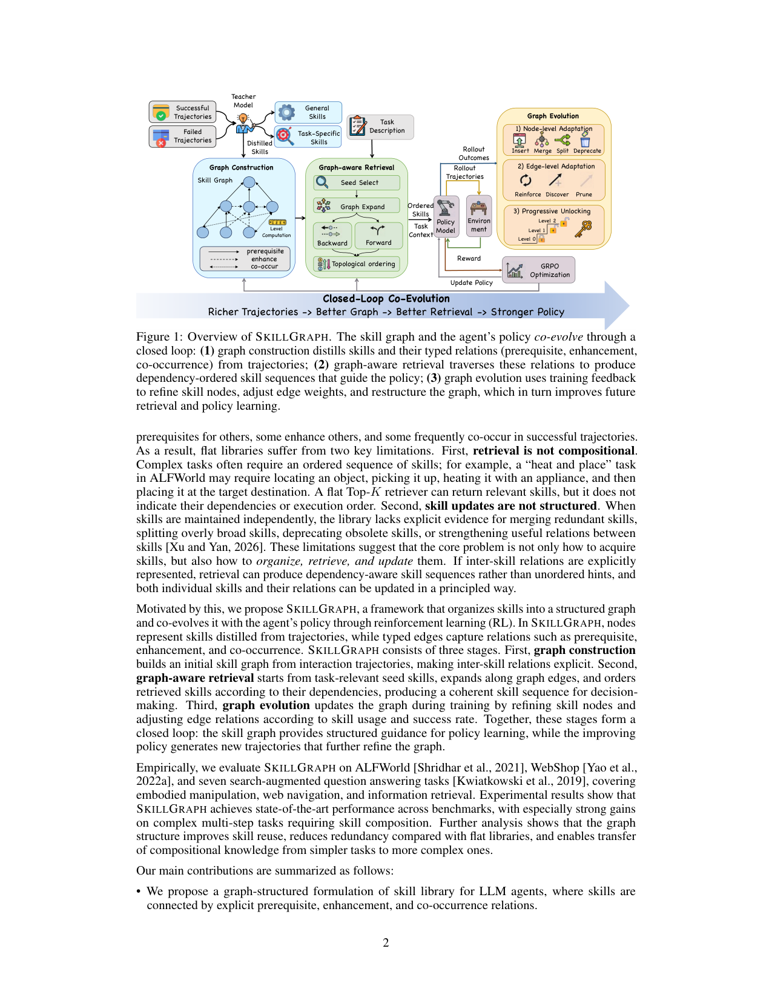
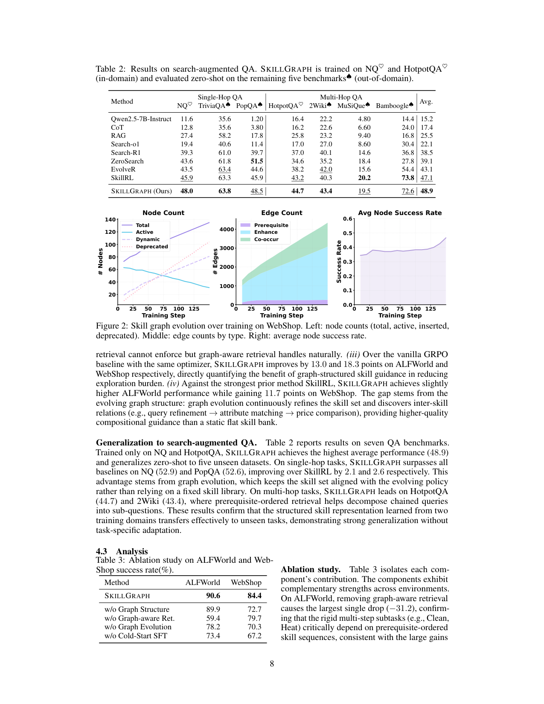

`skillgraph_evolving | SKILLGRAPH: Skill-Augmented Reinforcement Learning for Agents via Evolving Skill Graphs | USTC + Alibaba Group + NUS (Fuli Feng / Dayiheng Liu 组) | 2026-05-12 v1 arXiv preprint (cs.CL) | L? 技能积累线（结构化技能图 + RL 共进化）·相关性 High`

══ 第一层：一眼看懂 [light] ══
- 🟦 **TL;DR**：现有技能库把技能当**孤立条目、只按语义相似度检索**，对"需要按顺序组合多个技能"的复合任务无能为力，也不知何时该合并/拆分/删技能。SkillGraph 把技能做成**有向依赖图**的节点，带三类有类型的边（prerequisite 先决 / enhance 增强 / co-occur 共现）；新任务来时不只检索单个技能，而是检索一个**按依赖拓扑排序的技能子图**；图在训练中持续随轨迹和 RL 反馈进化（节点增/合/拆/弃 + 边强化/发现/衰减剪枝 + 按拓扑层级渐进解锁）。是 SkillRL 的直系升级（同套基准、同班基线），在 ALFWorld/WebShop/7 QA 上更强，复合任务增益尤大。
- **最巧的一步**：**graph-aware retrieval（seed→backward BFS 补先决→forward beam 沿强边扩→拓扑排序）**——抽掉它(消融 w/o graph-aware retrieval) ALFWorld 暴跌 −31.2（最大单项降幅）。因为像 Clean/Heat 这类任务必须严格按先决顺序执行，扁平 TopK 给得出相关技能却给不出"先后依赖"，而拓扑序让智能体天然拿到"由简到繁"的技能序列。

══ 第二层:为什么做(写透) ══
- **研究背景**:LLM agent 在 web/具身/工具问答上能力强,但**多数把任务当孤立 episode**,即便遇到结构相似的问题也学不会复用。技能库(skill library)是复用经验的常见手段——可人工设计或从轨迹自动蒸馏(蒸成自然语言或可执行程序);自动蒸馏更可扩展,故本文聚焦自动获取技能。【原文 §1】
- **解决的具体痛点**:现有技能库**多是扁平集合——每个技能独立存、只按语义相似度检索**,带来两个核心缺陷:① **检索不可组合**——复合任务(如 ALFWorld 的 "heat and place" 须 locate→pick→heat→place)需要一个有序技能序列,扁平 TopK 能给相关技能却**给不出依赖与执行顺序**;② **更新无结构**——技能独立维护时,系统**缺少结构线索判断何时该合并冗余/拆分过宽/淘汰过时/强化有用关系**。【原文 §1】
- **相关工作 & 各自不足**:① 扁平技能库(ExpeL/SkillRL/SimpleMem)——独立条目+语义检索,正是本文要解决的对象;② 程序化技能(Voyager 类)——可执行但仍不显式建模技能间依赖;③ memory-augmented RL(MemRL/EvolveR/Mem0+GRPO)——把记忆塞进 RL 但无关系结构;④ SkillRL(直系前作)——分层(通用/任务专属)但**仍是无序集合**。共同缺口=**没有显式表示技能间关系**。【原文 §1, §4】
- **动机链**:现状=自动蒸技能可行但库是扁平的 → 缺陷=复合任务需有序技能而扁平检索给不出顺序 + 库维护没有结构依据 → 关键洞察:**技能本质上是有关系的(先决/增强/共现)**,把关系显式建成图,检索就能产出"依赖有序的技能序列"而非无序提示,且节点和关系都能有原则地更新 → 所以提出 SkillGraph(有向 typed-edge 技能图 + 与策略 RL 共进化)。为什么不用扁平库?因为扁平库给不出执行顺序(消融:去掉 graph-aware retrieval 在 ALFWorld 暴跌 -31.2)。【原文 §1, §4.3】
- **与最近邻的 Δ**:相比 **SkillRL(同套基准、同班人马、同 base/teacher 的直系前作)**,关键差异=**把 SkillRL 的"扁平分层库"升级成"带 typed 边的有向依赖图 + 拓扑排序检索 + 渐进解锁课程 + 节点统计驱动的 deprecate/merge/split 生命周期"**。这个差异有用,因为:① 拓扑序让 agent 天然拿到 simple→complex 的有序脚手架(复合任务增益尤大);② 图统计能自调节防膨胀(解决 SkillRL 只增不删的问题)。消融里 "w/o Graph Structure" 这一行的数字 89.9/72.7 正好就是 SkillRL,直接量化了图带来的增量(ALF +0.7、WebShop +11.7)。【原文 §4.2, §4.3】

══ 第三层:怎么做 + 靠不靠谱 ══
- **方法流水线(三段闭环,Fig.1)**:① **Graph Construction**——teacher(o3)从成功/失败轨迹蒸出技能(title/principle/applicability/category),并建立 prerequisite(先决)/enhance(增强)/co-occur(共现)三类 typed 边,算每节点的 level;② **Graph-aware Retrieval**——给新任务:**seed select**(语义选种子技能)→ **backward BFS** 补齐先决技能 → **forward beam** 沿强边扩展 → **topological ordering** 出依赖有序的技能子图(Kmax=8)注入 context;③ **Graph Evolution**(每 validation step)——**节点级**:失败驱动 insert / \(\text{Jaccard}\geq0.85\) merge / \(\hat p\in[0.15,0.4]\) 且高用量 split / \(n_{use}\geq20\) 且 \(\hat p<0.15\) deprecate(永久排除);**边级**:\(\alpha\) 加权 reinforce / 自动 discover 新 co-occur / \(\gamma\) 衰减 prune;**渐进解锁**:先开 level-0,平均 \(\hat p\geq\theta_{unlock}=0.6\) 才解锁下一层。策略侧 \(\text{GRPO}(\beta=0.01,\epsilon_c=0.2,G=8,lr\ 1e\text{-}6)\) 在有序技能 context 上更新。飞轮:Richer Trajectories→Better Graph→Better Retrieval→Stronger Policy。【原文 §3, Fig.1】
- **逐组件必要性(均有消融,Table 3:SkillGraph 90.6/84.4)**:① **graph-aware retrieval**——去掉在 **ALFWorld 暴跌 -31.2(至 59.4)**,最大单项降幅,证明刚性多步子任务(Clean/Heat)严重依赖先决有序的技能序列;② **graph structure**——去掉(退回 SkillRL 扁平)在 WebShop 掉 -11.7(至 72.7),说明灵活导航任务里"对的技能集"比顺序更重要;③ **graph evolution**——去掉在 WebShop 掉 -14.1(至 70.3),证明维持高质量演化技能集是 WebShop 主要增益来源;④ **cold-start SFT**——去掉双环境合计降最多(-17.2,73.4/67.2),证明好初始化对 RL 在复杂 agent 环境收敛至关重要。四组件全有消融,且两环境的瓶颈不同(ALF 靠顺序、WebShop 靠技能质量)分析到位。【原文 §4.3, Table 3】
- **关键机制(直觉)**:① **拓扑排序检索**把"无序提示"变成"由简到繁的有序脚手架"——对必须按先决顺序执行的任务(Heat 前必先 locate/pick)是质变;② **节点统计驱动生命周期**——用 usage/success/p̂ 这些运行时统计自动 merge/split/deprecate,让图自净化、自调节(Fig.2:节点 ~20→140 但 active 早早 plateau,deprecation 剪掉失败技能,防无界膨胀);③ **渐进解锁=课程式隔离**——掌握底层再开高层,既防遗忘又防"过早暴露高级技能"。【原文 §3, §4.3, Fig.2】
- **实验与证据(支撑核心主张的关键数字)**:
  · ALFWorld overall **90.6%**(超 SkillRL 89.9、GRPO 77.6),WebShop succ **84.4%**(超 SkillRL 72.7、SimpleMem+GRPO 46.9)、score 91.5;ALFWorld 多个子任务(Pick/Clean/Heat)达 100.0。【Table 主结果】
  · **复合任务增益尤大**——这正是"图结构+有序检索"的卖点对应处(Heat/Clean 这类强先决任务从 SkillRL 提升明显)。
  · 7 个 search-augmented QA 也 SOTA(摘要称对 memory-augmented RL 方法 SOTA,复合任务增益最大);context 比 SkillRL 扁平检索更短(Fig.3 右,~2900–3000 vs SkillRL 更高)。
  · 图演化动态(Fig.2):节点 ~20→140(失败驱动 insert),active 早 plateau(deprecation 自调节),三类边 co-occur 增最快(自动发现关系),平均节点成功率随训练上升(进化在过滤低质技能)。
- **baseline 公平性**:与 SkillRL 同 base(Qwen2.5-7B+cold-start SFT)、同 teacher(o3)、同基准、同 GRPO,**最干净的同门对比**,图带来的增量可直接读出;对比还覆盖闭源 LLM、prompt/memory、纯 RL、memory-augmented RL 四族,公平。**看着强但没回答核心问题**:无明显此类问题,两环境消融把"顺序 vs 技能质量"的不同瓶颈拆得很清。
- **假设与失效边界**:【原文 Limitations】① **强依赖强 teacher(o3)**做蒸馏+图操作(额外推理开销,作者点名待用自蒸馏/critic 替代);② 图当前**单环境内构建与进化**,跨环境技能迁移未做;③ 规模化到更大 base 模型/更多样任务分布是 open。【推断】teacher 对 insert/merge/split 可能引入幻觉技能(靠 deprecate 兜底,但安全敏感场景需人审);WebShop 上 graph structure 增益(+11.7)大于 retrieval ordering 增益,说明"图的价值在灵活任务上主要来自技能质量管理而非顺序"——拓扑序的普适性可能被高估。
- **祛魅总结**:真贡献(硬货)=**把技能从"无序条目"升级为"带先决/增强/共现关系的有向图 + 拓扑序检索 + 节点统计驱动的 merge/split/deprecate 生命周期 + 渐进解锁课程"**,且用同门 SkillRL 对照(消融 w/o Graph Structure 一行=SkillRL)硬证了图的增量,WebShop 84.4 vs 72.7 提升显著。【推断】"图结构"的价值在不同任务上来源不同(ALF 靠顺序、WebShop 靠技能质量),拓扑排序检索并非处处是关键;且仍强依赖 o3、单环境、无开源代码,工程可复现性是软肋。

══ 机制速览 6 轴 [light] ══
| 维度 | 内容 |
|---|---|
| **学什么信号** | 环境二元 reward（成功/失败）+ 老师模型(o3)蒸馏技能与关系 + 节点运行统计(usage/success/ \(\hat p\)) 驱动图进化 |
| **改什么** | ① 策略参数（GRPO 更新 \(\pi_\theta\)）② 外部技能图（节点+typed edges，prompt-level 注入）——共进化 |
| **何时改** | 策略：在线 per-step（GRPO）；图：离线批量（每个 validation step 跑整套图进化 + 渐进解锁检查） |
| **免梯度?** | **混合**：参数走梯度(SFT+GRPO)；图的节点/边操作全免梯度（老师生成 + 统计规则:Jaccard 合并、\(\hat p\) 阈值拆/弃、\(\alpha\) 加权 \(\gamma\) 衰减剪枝） |
| **记忆-技能生命周期** | 写入(蒸馏 title/principle/applicability/category + 建 enhance/co-occur 边)→检索(seed→BFS→beam→toposort，Kmax=8)→**淘汰(deprecate: \(n_{use}\geq20\) 且 \(\hat p<0.15\) 永久排除)** + 合并(\(\text{Jaccard}\geq0.85\))/拆分(\(\hat p\in[0.15,0.4]\) 且高用量)→**共享(节点统计 + co-occur 自动发现新关系)**；节点 ~20→140 但 active 早早 plateau（自调节防膨胀，**优于 SkillRL 的只增不删**） |
| **防遗忘机制** | KL 投影（GRPO 锚定 \(\pi_{ref}\)=SFT）；渐进解锁=课程式隔离（先 level-0，掌握(平均 \(\hat p\geq\theta_{unlock}=0.6\))再开下一层），既防遗忘又防"过早暴露高级技能" |

🖼 **关键图 top-2** [light]：

图1（方法 pipeline 主图）：三段闭环——graph construction(蒸馏技能+建 typed 边) → graph-aware retrieval(seed/backward/forward/topo-order 出有序技能) → graph evolution(节点增合拆弃 + 边强化/发现/剪枝 + 渐进解锁)，底部 "Richer Trajectories→Better Graph→Better Retrieval→Stronger Policy" 点出共进化飞轮。选它因为一图说尽全文三段结构 + 闭环逻辑。

图2（核心发现/主结果，WebShop 上）：左=节点数(total/active/inserted/deprecated，active 早早 plateau 证明自调节)；中=三类边数(co-occur 增最快=自动发现关系)；右=平均节点成功率随训练上升(进化在过滤低质技能)。选它因为定量坐实了"图结构能自我调节、自发现关系、自净化"——这是相对 SkillRL 扁平库的核心增量证据。

══ 假设与失效边界（一句）[推断] ══
【原文 Limitations】强依赖强老师模型做蒸馏+图操作（额外推理开销，作者点名待用自蒸馏/critic 替代）；图当前**单环境内构建与进化**，跨环境技能迁移未做；规模化到更大 base 模型/更多样任务分布是 open。【推断】老师对 insert/merge/split 可能引入幻觉技能（靠 deprecate 兜底，但安全敏感场景需人审）。

══ 对"探索-巩固"idea 对标（一句）[light] ══
**支撑 + 强可借组件**：与"探索-巩固"同构且更进一步——把 path-selection/path-recovery 经验**结构化为带先决关系的图**，最贴合 TSRD 的"路径选择"语义；可借积木=【typed 依赖图 + 拓扑排序检索(把无序提示变成 simple→complex 的有序脚手架)】+【渐进解锁课程(掌握底层再开高层，天然防遗忘+防过早暴露)】+【节点统计驱动的 deprecate/merge/split 生命周期(解决 SkillRL 只增不删的膨胀)】；是 SkillRL 的直系竞品/升级，二者构成"扁平库→图"的演进对。

══ 结构化补充 ══
- ⑦ **开源代码 + 框架/harness**：**正文/附录全文未给开源链接**（无 GitHub），属"未找到/未开源"〔待核：可能后续放出〕。RL=GRPO\((\beta=0.01,\epsilon_c=0.2,G=8,lr\ 1e\text{-}6)\)，base=Qwen2.5-7B-Instruct + cold-start SFT，teacher=OpenAI o3；**底层 RL 框架未在文中标注**〔待核〕。
- 💰 资源/成本：8× A100 80GB 单节点，全部训练  run 合计 **~280 GPU-hours**（附录 G）；额外成本=o3 老师 API（蒸馏+SFT 数据+每验证步图进化）。context 比 SkillRL 扁平检索更短(Fig3 右，~2900–3000 vs 更高)。
- 🔭 开放问题：自蒸馏/critic-based 技能生成降老师依赖；跨环境技能图迁移(一域 bootstrap 另一域)；scale 到更大模型。
