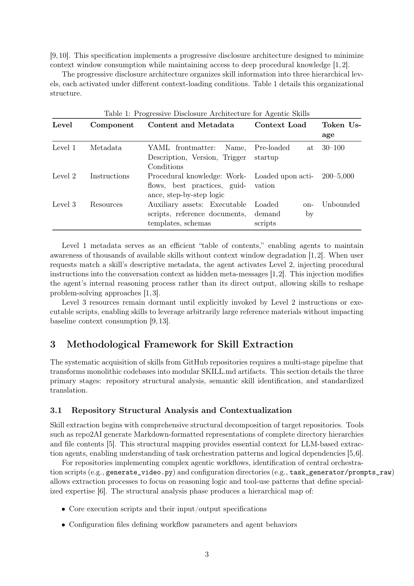
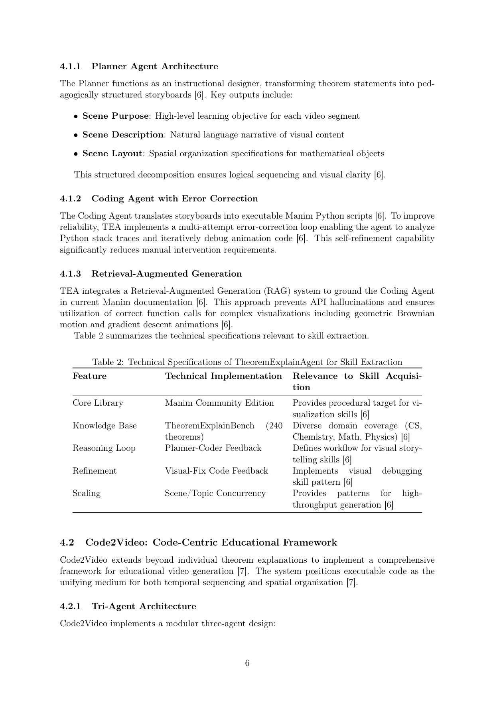

`skillkb_mining | Automating Skill Acquisition through Large-Scale Mining of Open-Source Agentic Repositories | East China Normal Univ. + Shanghai Innovation Institute + USTC + SJTU (Shuzhen Bi, Mengsong Wu, Hao Hao, …, Aimin Zhou) | 2026-03 · arXiv:2603.11808v2 [cs.AI] · 技术报告/框架 | L3(技能获取)· Med`

> 档位:deep(三层精读 + 完整结构化抽取)。基于 PDF 正文(14 页)。
> 注:本篇是技术报告(report),**无本框架自身的端到端独立评测**;唯一定量数字(40%)来自被挖系统 Code2Video,非本框架产出。第三层"实验与证据"以此为核心事实。

══ 第一层:一眼看懂 ══
- 🟦 **TL;DR**:技能不是从 agent 自己的轨迹里学,而是**从 GitHub 上现成的开源 agentic 仓库里"挖"出来**,自动翻译成标准 SKILL.md。把"怎么训模型做任务 X"换成"怎么给模型喂可执行的程序性知识做任务 X"。三段流水线【原文 §3】:① 仓库结构分析(repo2AI 把目录/文件转 Markdown,定位核心编排脚本如 generate_video.py)→ ② 语义技能识别(dense retrieval 双编码器 + cross-encoder 二段排序,按 recurrence/verification/non-obviousness/generalizability 四准则筛"潜在技能")→ ③ 翻译成 SKILL.md(生成 frontmatter + Level2 指令 + 打包 scripts/references/templates,去掉硬编码路径/密钥)。案例:从 TheoremExplainAgent 和 Code2Video 两个 Manim 数学动画系统抽"可视化/教育"技能;声称 agent 生成的教育视频在知识传递效率上 +40%。
- **最巧的一步**:**把"技能获取"从"自己探索/人手写"换成第三条路——对已有开源代码做语义检索式重构提取**(§1 三条获取路径对比;§3.2 两段 retrieval+rerank)。抽掉"two-stage dense retrieval + cross-encoder 筛真正可复用模式"这步,提取就退化成"把整个 repo 塞给 LLM 总结",拿到的全是 project-specific 实现细节而非可泛化技能——四准则 + rerank 正是用来区分"可复用程序模式"vs"仓库特异实现"的闸门。

══ 第二层:为什么做(写透) ══
- **研究背景**:【原文 §1】AI 部署正从"单体 transformer LLM"转向"模块化、装技能的 agent 架构"。当代 LLM 声明性知识广,但**自主任务执行受限于缺乏专门的程序性专长**。这催生了"agent skill 范式"——把程序知识封装成离散的、基于文件系统的单元,agent 按需发现/加载/执行。架构上把能力与模型参数解耦,**不需重训/微调就能动态扩能力**,核心问题从"怎么训模型做 X"变成"怎么给模型可执行的程序知识做 X"。
- **解决的具体痛点**:【原文 §1+§2】**技能获取的可扩展性**是推进这个架构愿景的核心挑战。三条获取路径各有不足:(1) **领域专家手写**——可靠但**扩展性严重受限**;(2) **自主发现**(autonomous discovery)——有前景但**在开放世界里难保语义连贯和教学价值**;(3) **从现有开源软件(尤其 GitHub agentic 仓)系统抽取**——这些仓常含复杂领域逻辑(数学定理可视化、教育内容合成、多模态解释),可系统重构成标准化可复用技能。本文走第三条路。
- **相关工作 & 各自不足**:【原文 §1/§2,引用偏弱】(1) **手写技能**:可靠性保证但不可扩展;(2) **开放世界技能发现**(如 ICCV "Open-World Skill Discovery from Unsegmented Demonstration Videos"):难保连贯;(3) **SKILL.md 规范**(Anthropic 起、后开放):progressive disclosure 三级(L1 metadata/L2 instructions/L3 resources)是范式工程基石;(4) **dense retrieval / cross-encoder**(借自 IR/RecSys);(5) 安全侧引用了"社区分发技能 26.1% 有漏洞"的 survey 作为治理动机。〔注:正文引文大量是 alphaxiv/researchgate/huggingface 搜索页/博客等**非一手来源**,学术严谨性偏弱。〕
- **动机链**:现状(agent skill 范式需大规模获取技能)→ 缺陷(手写不可扩展、自主发现难保质量)→ 所以走第三条路**挖现成开源代码**(GitHub 已有大量高质量领域逻辑)→ 但直接挖会拿到 project-specific 实现细节 → 所以必须用 **two-stage retrieval+rerank + 四准则** 筛出"可复用程序模式",再标准化成 SKILL.md + 安全去敏。为什么不用更简单的现成做法(整个 repo 塞 LLM 总结)?——【推断,§3.1/3.2】那样无法区分"可复用模式"与"仓库特异实现",四准则(recurrence/verification/non-obviousness/generalizability)+ cross-encoder 阈值 τ 正是做这个区分的闸门。
- **与最近邻工作的 Δ**:与"从 agent 自身轨迹学技能"(AutoSkill/SkillX/SkillGen 等)的最关键 Δ:**技能来源是"别人写好的代码"而非 agent 自己的在线经验**——既不需要 agent 去探索,也不依赖环境 reward。为什么这差异有用?——【推断】GitHub 上已有海量经人类调试验证的领域逻辑,直接重构比从零探索更省、起点更高;但代价是技能质量受限于被挖仓库,且本框架未独立验证"挖出的技能在新任务上真有用"。

══ 第三层:怎么做 + 靠不靠谱 ══
- **方法流水线**(§3,三段):
  · **Stage1 仓库结构分析(§3.1)**:用 **repo2AI** 把完整目录层级 + 文件内容转成 Markdown 表示,给 LLM 提取 agent 提供上下文;定位中心编排脚本(`generate_video.py`)和配置目录(`task_generator/prompts_raw`),产出层级图(核心执行脚本及其 I/O、配置文件、辅助模块、文档示例),用于区分"可复用程序模式"vs"仓库特异实现"。
  · **Stage2 语义技能识别(§3.2,two-stage ranking)**:**dense retrieval 阶段**——用 trained bi-encoder 把任务描述 {T_k} 和代码模块 {M_j} 编码成向量,算 cosine 相似度,留 top-K 候选;**binary ranking 阶段**——cross-encoder 联合编码 task-module 对出细粒度相关分,只有超过校准阈值 τ 的模块才晋级。提取准则四条:recurrence(多上下文复现)、verification(代码可用/有文档/无关键 bug)、non-obviousness(需领域专长/调试才能发现)、generalizability(可参数化/适配)。
  · **Stage3 翻译成 SKILL.md(§3.3)**:**frontmatter 生成**(name/description/version/trigger/dependencies)+ **instruction drafting**(L2 写成 LLM 可消费的程序指引:分步工作流 + 决策点 + 错误处理 + 最佳实践 + 集成模式,**避开仓库特异实现细节**)+ **asset bundling**(scripts//references//templates/,重构去掉硬编码路径/API key/仓库特异依赖保可移植)。
  · **安全治理(§7,four-stage G1-G4)**:G1 静态分析(扫 eval()/exec()、未授权网络调用、破坏性文件操作、混淆代码)→ G2 语义分类(LLM 查指令-目的对齐、无隐藏 prompt injection、元数据与实现一致)→ G3 沙箱执行(网络隔离 + 受限文件 + 资源监控)→ G4 权限校验(对 allowed-tools manifest);技能按审计运行表现晋升 trust tier。
- **逐组件必要性**:**本篇无任何消融实验**。各组件必要性仅靠定性论证:repo2AI 结构化提供上下文、two-stage retrieval 区分可复用 vs 特异、四准则当筛选闸门、G1-G4 防恶意代码。【推断:无 ablation 证明哪个组件贡献多少;four-stage 安全流水线甚至是"we propose"的提议性框架,未见实测漏洞拦截率】。
- **关键机制/公式直觉**:唯一公式是 **cosine 相似度(公式 2)** `sim(Ti,Mj)=eTi·eMj/(‖eTi‖‖eMj‖)`,标准 dense retrieval,无新意。真正的"机制"是**两段检索的分工直觉**:bi-encoder 快速召回(把所有模块预编码,任务来了算相似度取 top-K),cross-encoder 精排(联合编码 task-module 对做细判,贵但准)——这是 IR 领域成熟的 retrieve-then-rerank 范式直接搬到"代码模块→技能"上。另一个工程机制是 **SKILL.md progressive disclosure**(§2.2 Table 1):L1 元数据 30–100 token 当目录预载、L2 指令 200–5000 token 激活时载、L3 资源无界按需载——让 agent 能"感知上千技能而不撑爆 context"。
- **实验与证据**:**这是本篇最大的硬伤**。全文**没有本框架自身的端到端评测**——没有"用本 pipeline 挖出 N 个技能、装上后在新任务上成功率提升多少"的对照实验。所谓证据全是**借来的或提议的**:(1) **"40% 知识传递增益"(§4.2.3/§6.2)**——来自**被挖系统 Code2Video 的 TeachQuiz 指标**(VLM 先"遗忘"领域事实→看生成视频→测事实恢复),是 **Code2Video 自己 vs baseline code-gen 的结果,不是本提取框架产出的**;(2) TEA o3-mini 在 TheoremExplainBench 上 0.77——也是 **TEA 自己的成绩**;(3) §6.3 "SkillNet 巩固带来 30% 步数减少 / 40% 平均奖励提升"——引自他人工作(HuggingFace 搜索页),非本框架;(4) §6.1 多维评测指标(Safety/Completeness/Executability/Maintainability/Pedagogy)是**提议的 taxonomy(Table 3),无实测数据填充**。**baseline 公平性**:无从谈起——本框架根本没跑对照实验。**典型"看着有数但没回答核心问题"**:全篇 40% 反复出现,易让人以为是本框架的成果,实则是被挖系统的指标。
- **假设与失效边界**:【推断】**隐式假设"开源仓库里的优质程序逻辑能被检索-重构成跨上下文可泛化的技能,且检索阈值 τ 能可靠区分可复用 vs 特异"**——这是个偏理想化的工程假设。**失效边界**:(a) 当仓库逻辑高度耦合特定环境/数据、抽出来无法参数化时,four 准则的 generalizability 难满足;(b) cross-encoder 阈值校准依赖标注,跨域迁移时阈值失准;(c) **最根本**:本框架**未验证"提取出的技能在新任务上是否真有用"**(40% 来自被挖系统本身),故有效性证据极弱【推断:全篇无本框架自身的 held-out 性能对照】。
- **祛魅总结**:【推断】**真贡献(硬货)**:(1) **提出"挖开源 agentic 仓库"作为技能获取第三条路**——这个 framing 有价值(GitHub 是被低估的程序知识矿);(2) **two-stage retrieve-rerank + 四准则**作为"从代码抽可复用技能"的工程模板,加上**去敏 + G1-G4 安全治理**,是可落地的工程清单;(3) SKILL.md progressive disclosure 三级的清晰梳理。**包装/营销面(较重)**:(1) **40% 这个数字被反复借用却不属于本框架**——这是最该警惕的"借光"包装,读者极易误以为是本方法的成果;(2) 大量"成果"(SkillNet 30%/40%、TeachQuiz)全是引用他人,本框架自身**零定量实验**;(3) §9 FAQ 给出"降低 2-3 个数量级计算成本""上限 10000+ 技能"等数字,**无任何出处/实测支撑**,属营销话术;(4) 引文质量差(大量 alphaxiv/博客/HF 搜索页)。整体上这更像一份**带案例的立场/工程综述报告**而非有实证的研究论文,作者**明显高估了"系统抽取"的已验证程度**(标题"Automating…Large-Scale Mining"暗示规模化已实现,实则只手工分析了 2 个仓、抽了 2 个示例技能、零端到端评测)。

══ 结构化抽取(供全景汇总) ══
- 🎯 **机制速览 6 轴**:
  | 学什么信号 | 改什么 | 何时改 | 免梯度? | 记忆-技能生命周期 | 防遗忘机制 |
  |---|---|---|---|---|---|
  | **现有开源代码库**(GitHub agentic repos 的结构 + 编排逻辑 + 工具用法);**非自身轨迹、非环境 reward** | **外置技能库(SKILL.md artifacts)**;不改模型参数 | **离线批量挖掘**(一次性 pipeline:扫库→检索→翻译) | **是**(纯检索 + LLM 生成,无训练;bi-encoder/cross-encoder 是"trained"现成检索模型,非本工作训练目标) | 写入(从 repo 挖→翻译成 SKILL.md,含 L1 元数据/L2 指令/L3 资源,progressive disclosure)→ 检索(语义检索 + rerank)→ 安全治理(去密钥/去硬编码路径,G1-G4 trust tier);**遗忘/版本演化:原文未给运行时淘汰机制**(§8.1 仅提及未来"Evolution Agents"挖日志精炼技能,无实现) | **不适用** |

- ⑦ 开源代码 + 框架/harness:**原文未给本框架的开源仓库链接**(正文只引用**被挖的** TheoremExplainAgent https://github.com/TIGER-AI-Lab/TheoremExplainAgent、Code2Video https://github.com/showlab/Code2Video,以及工具 repo2AI https://github.com/huolter/repo2AI;**未声明本框架自身代码开源**)〔已核:通读全文 + 引用列表,确无本框架 repo URL,疑似无代码/仅技术报告〕。harness/框架:**自研检索式提取 pipeline**(repo2AI 结构化 + bi-encoder/cross-encoder 检索 + LLM 翻译),无训练框架。
- 💰 资源/成本与可扩展性:**几乎无定量**——§9 FAQ 称"降低 2-3 数量级计算成本""progressive disclosure 支持 10000+ 技能",但**无出处/实测**【推断:营销性断言】。唯一"成本"论据是 progressive disclosure 省 context(L1 当目录、L2/L3 按需载)。本框架自身**无大规模挖掘规模数**(实际只手工分析 2 个仓)。
- 🎯 **对"探索-巩固"idea 对标**:**缺口/弱关联**。技能来源是"别人写好的代码"而非 agent 自身在线经验,无探索、无 reward、无参数巩固;对 TSRD 仅"如何把程序性知识标准化成可复用单元(SKILL.md progressive disclosure 三级)+ 安全去敏(G1-G4)"这套**离线技能工程模板**可借鉴。核心的 path-selection/path-recovery 学习信号它完全不涉及。
- 🔭 开放问题/未来方向:【原文 §8.1】"Evolution Agents"自主挖对话日志/执行 trace 精炼技能、按用户偏好个性化适配;SkillNet 式本体巩固(is-a-subset-of / requires-output-from 关系图)做技能去冗余。【推断】最关键缺口是**给本框架补上端到端独立评测**(挖出的技能装上后在新任务的真实增益),以及**自动化阈值校准**让跨域提取更稳;当前"大规模挖掘"名不副实,真正规模化需先解决"挖出技能的质量如何客观验证"。
- 🖼 **关键图 top-2**(保留原选):

这是**原文 Table 1**(该页)。表现 SKILL.md 的渐进式披露:**Level1 Metadata**(YAML frontmatter,启动预载,30–100 token)/ **Level2 Instructions**(激活时载入程序知识,200–5000 token)/ **Level3 Resources**(按需载入脚本/文档,无界)。选它因为它最简洁地呈现"技能为什么省 context"的核心机制——元数据当目录、按需展开,这是整个 skill 范式的工程基石。

这是**原文 Table 2**(该页)。表现从 TheoremExplainAgent 提取技能时,把仓库特征(Manim 核心库 / TheoremExplainBench 240 定理 / Planner-Coder 反馈环 / Visual-Fix 反馈 / 场景并发)逐项映射到"对技能获取的相关性"。选它因为它具体展示"如何从一个真实 agentic repo 的组件读出可复用技能模式",是该挖掘方法的落地示例(也是本篇为数不多的实质内容)。
