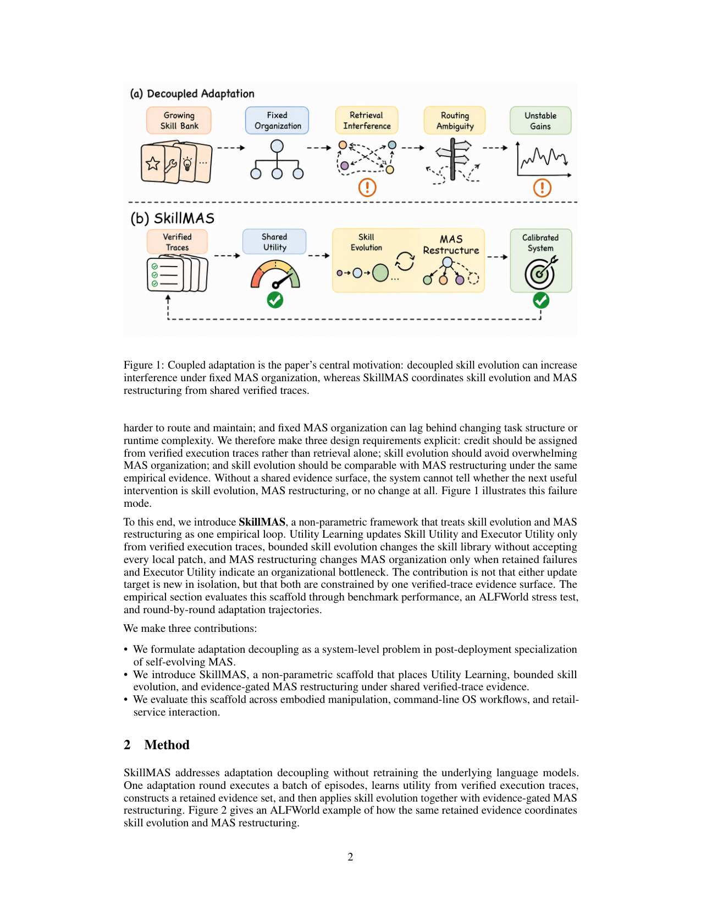
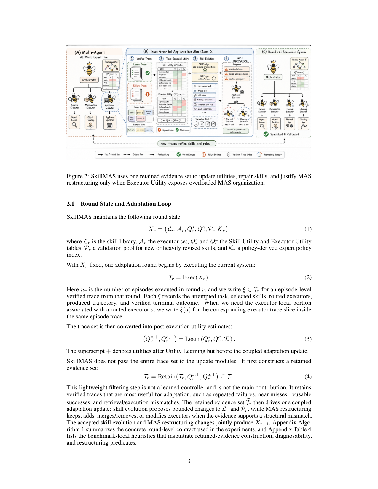

`skillmas | SkillMAS: Skill Co-Evolution with LLM-based Multi-Agent System | 上海交大(SJTU)+ 中南大学 + OPPO | arXiv:2605.09341v2, 2026-05-16, cs.MA, Preprint | 主题线 L?(技能进化 × 多智能体系统重构,非参数自进化)·相关性 High`

> 三标注:【原文】=论文直述;【推断】=有据判断(附依据);【待核】=拿不准关键事实。本篇基于下载 PDF 全文(21 页,67K 字符)精读。

══ 第一层:一眼看懂 [light] ══
- 🟦 **TL;DR**:部署后的 LLM 多智能体系统(MAS)要"越用越强",有两件事要同时做——**进化技能库**(把成功经验沉淀成可复用流程)和**重构智能体组织**(增/删/合并/改 executor 角色与职责)。以往工作把这两件事**分开优化**,但它们互相牵制(技能多了组织路由更难;组织不对技能就用不起来)。本文叫这个毛病 **adaptation decoupling(适应解耦)**,提出 **SkillMAS**:一个**不重训底层模型(non-parametric)**的框架,让"技能进化"和"MAS 重构"**共享同一份"已验证执行轨迹(verified traces)"证据面**,统一决定该改技能、该改组织、还是不动。在 ALFWorld(94.0%)、Lifelong Agent Bench OS(76.7%)、τ-Bench Retail(70.2%)上达到所列方法中最高成功率。【原文 Abstract/§1】
- **最巧的一步**:**"一份共享的 verified-trace 证据面同时约束两类更新"**。抽掉它(回到各自独立优化)整个贡献就垮——因为论文核心主张不是"技能进化"或"MAS 重构"任一单独新颖(作者自承都不新),而是**让二者在同一证据下可比较、可协调**。证据面让系统能判断"下一步最有用的干预是改技能、改组织、还是 no-op"(§1)。这是把"两个解耦的优化"缝合成"一个经验闭环"的关键。【原文 §1 末"The contribution is not that either update target is new in isolation, but that both are constrained by one verified-trace evidence surface."】

══ 第二层:为什么做(写透) ══
- **研究背景**:LLM agent 不仅要完成长程任务,还要**部署后持续提升**(累积已验证轨迹、可复用流程、协作经验)。这带来系统级问题:部署的 agent stack 必须决定"留什么、改什么、何时连固定的协作结构本身都成了瓶颈"。先前工作(MAS 编排 / agent 基础设施外置 / 部署后记忆与技能 / Agentic ROI)都指向"agent 系统应持续改进而非固定流水线"。【原文 §1】
- **解决的具体痛点**:现有工作把两个紧耦合的适应目标当独立问题——① **MAS 重构线**(spawn/编排/角色更新/交互奖励/拓扑选择,如 MorphAgent、AgentSpawn、Agentic Neural Networks);② **技能进化线**(进化可复用技能/把轨迹局部教训蒸成可迁移流程,通常不动 executor 边界)。但二者直接互动:技能进化改变 MAS 要路由/维护什么;MAS 组织决定进化出的技能能否在不爆 context、不职责模糊下被复用。**三个反复出现的失败模式**:(a) verified-trace 复用引入冗余/低价值证据;(b) 技能进化让 MAS 路由更难;(c) 固定 MAS 跟不上变化的任务结构。【原文 §1】
- **相关工作 & 各自不足**:① MAS(MetaGPT/AutoGen 角色协作)——把组织当自适应,但触发靠任务复杂度/交互奖励;**SkillGraph 最接近**(共进化多模态技能 + 协作拓扑),但它**用多模态图 transformer 学拓扑(参数化)**,而 SkillMAS 用**非参数 verified-trace 效用 + bounded 重构**;② 自进化 agent(Reflexion/Voyager/textual backprop/记忆元进化)——证明部署 agent 不该固定,但 SkillMAS 专注"进化知识时何时也该改 executor 边界";③ skill/memory 学习(MemRL 把记忆复用形式化为非参数 RL;MemSkill/SkillRL/Trace2Skill/EvoSkills)——SkillMAS 继承 utility-aware 检索与 verifier 式修复,但窄贡献是"一份证据约束两类更新"。④ 基础设施/治理线(Externalization/Holos/SkillProbe/Agentic ROI)——SkillMAS 把技能增长、组织、验证放同一证据面,当作运行时系统问题。【原文 §5】
- **动机链**:部署 agent 需持续进化 → 技能与组织两类适应被分开优化 → 但二者互为操作条件(adaptation decoupling)→ 三种失败模式 → 所以提出三条设计要求:(i) credit 只从 verified traces 给(非仅检索);(ii) 技能进化别压垮组织;(iii) 技能进化与 MAS 重构要在同一经验证据下可比 → 落地为 SkillMAS。为什么不用更简单的现成做法:单做技能进化或单做重构都"脆"——消融(Table 2)证明把最终技能库塞进种子组织反而从 102/134 跌到 92/134(选择/应用过载),只重构不配套技能更跌到 67/134。【原文 §1/§4.1】
- **与最近邻工作的 Δ**:最近邻是 **SkillGraph**(技能+拓扑共进化)。Δ:SkillGraph **参数化**(多模态图 transformer 学拓扑),SkillMAS **完全非参数**(verified-trace 经验效用表 + 规则化 bounded 重构);且 SkillMAS 把触发从"任务复杂度/交互奖励"转为"由技能进化产生、并在 retained traces 中观察到的压力"。这个差异有用是因为非参数 + 证据门控让"何时该重构"有可解释的经验依据,而非靠学到的黑盒拓扑。【原文 §5】

══ 第三层:怎么做 + 靠不靠谱 ══
- **方法流水线**(一个 adaptation round,输入→输出,5 步;§2):
  1. **Round State**:维护 \(Xr\)=(技能库 Lr,executor 集 Ar,Skill Utility 表 \(Qˢ\),Executor Utility 表 \(Qᵃ\),验证池 Pr,专家策略索引 Kr)。
  2. **执行**:\(Tr=Exec(Xr)\),跑一批 episodes,每条 ξ 记录"任务/选中技能/路由的 executor/轨迹/已验证终局结果"。
  3. **Utility Learning**(§2.2):从 verified traces 学两张效用表——\(Qˢ(s,τ)\)技能在任务类型 \(τ\) 上的效用、\(Qᵃ(a,τ)\)executor 在 \(τ\) 上的效用,用蒙特卡洛增量更新 \(Q←Q+α(R−Q)\),\(α=1/(1+N)\) 计数衰减(见过越多更新越小)。**关键规则**:检索只是提候选,**只有"被执行调用或轨迹支持"的技能才得正信用**(Sᵘˢᵉᵈ),纯被检索到不算——这是保守的操作性归因。
  4. **Retain**:从 Tr 过滤出最有用的 retained evidence set eTr(重复失败、near-miss、可复用成功、检索/执行不匹配);轻量、非学习控制器。
  5. **耦合更新**:(a) **Skill Evolution**(§2.3)——把技能视为含"适用条件+步骤+失败 guard+验证检查"的 agent-native 包;成功轨迹出 motif,失败轨迹经 **bounded diagnosability** 映射为(主因 c、是否唯一可辨 u、修复标签 \(b∈\){add-guard, reorder-step, tighten-retrieval, split-skill, handoff-to-structure, \(∅\)}),仅当 \(u=1\) 且 b 属前四类才本地修;动作集{create, refine, prune, hold-in-pool, no-op},每簇每轮至多一次;新/大改技能进 Pr 验证池待后续证据。(b) **Evidence-Gated MAS Restructuring**(§2.4)——仅当 retained failures + Executor Utility 显示组织过载/分离差时才改 Ar;先把证据炼成诊断 artifact Fr,再由算子 Gr 输出{keep, add, merge/remove, modify}之一,每轮至多一次结构编辑;触发时迁移已验证技能、合并冗余技能归属、收窄 executor prompt。两类更新共同产出 Xr+1。
- **逐组件必要性**:
  · 技能进化 vs MAS 重构耦合 → **Table 2 transplant stress test**:Full(94.0%)> 只技能进化+种子组织(68.7%)> 只重构+种子技能(50.0%);种子基线 76.1%。两个单侧变体都低于 Full,证明耦合必要。**但作者明确声明这不是 protocol-matched 因果分解、缺受控冻结目标重训消融**(诚实)。
  · Utility Learning 的"只给执行支持的技能信用" → 文中作为核心设计,但**无单独消融**隔离其贡献(作者承认缺多 seed 受控消融)。
  · 证据门控 → 体现在 τ-Bench:选中 checkpoint 保持单 executor 改善(43/74→51/74),强行加 preflight executor 反跌到 32/74(§4.2)——侧证"该不扩张时不扩张"的价值。【原文 §3.3/§4.1/§4.2】
- **关键机制直觉**:\(α=1/(1+N)\) 的计数衰减学习率 = 让"新见到的(技能,任务类型)"全权更新(\(α=1\)),重复证据自动降权,**无需第二个优化器或动量项**——把"经验置信度"编码进步长。Utility 表是"已验证结果的经验摘要",不是收敛保证,任务分布/库/组织一变值就会动(§2.2)。bounded diagnosability 的"唯一主因 u=1 才修"= 避免对一条失败轨迹同时打多个补丁造成混乱。【原文 §2.2-2.3,直觉为【推断】】
- **实验与证据**:数据集 = ALFWorld unseen(具身家务)、Lifelong Agent Bench OS Task(命令行)、τ-Bench Retail(零售对话);模型尽量用 **GPT-4o-mini**,τ-Bench 用 GPT-4.1-mini executor + GPT-4.1-2025-04-14 用户模拟器(**全闭源 API,不重训**)。**支撑核心主张的关键实验**=Table 1 + Table 2:Table 1 三 benchmark 均最高(ALFWorld 94.0 vs Traj-Bootstrap 93.0、OS 76.7 vs 70.0、Retail 70.2);Table 2 stress test 支撑"解耦会受损"。Table 3 任务族分解显示主增益来自 examine(5/18→17/18),说明加入"搜索/检查"专精修复了具体弱点而非平滑已强项。**baseline 公平性问题(重要)**:作者**反复强调 Table 1 是"contextual comparison 而非 protocol-matched leaderboard"**,ALFWorld 的 Direct LLM/ReAct/CDMem/Traj-Bootstrap 标 "Ref."(跨论文引用,协议可能漂移);故小幅度领先(如 94.0 vs 93.0)**不可当严格 SOTA**。【原文 §3.1-3.4】
- **假设与失效边界**:【原文 Limitations】(i) 证据是 benchmark-local、protocol-dependent,绑定特定 harness/prompt/API/checkpoint 选择,**不可读作 domain-agnostic 估计**;(ii) **未隔离各组件因果贡献**(无统一多 seed 重跑/受控冻结目标消融/显著性检验);(iii) **archive 不含完整 token/延迟/成本核算**,效率与长程稳定性未充分刻画;(iv) 抽象掉大量底层轨迹记录,长程稳定性与失败模式审计只部分刻画。【推断】依赖任务能定义"task type τ"做效用条件化;强依赖 verifier 给二元/可信终局信号(无 verifier 的开放任务难用)。
- **祛魅总结**:**硬货**=(i) 把"技能进化"与"MAS 重构"耦合这一系统级问题清晰形式化(adaptation decoupling),并给出"一份 verified-trace 证据面统一两类更新"的非参数框架;(ii) 三 benchmark + transplant stress test + 逐轮轨迹的过程证据,论证"单侧适应会脆";(iii) 计数衰减 α、bounded 动作集、验证池等工程细节扎实。**包装/需谨慎**=(i) **作者异常诚实**地把诸多东西标为"非主贡献/非 protocol-matched/缺消融"——这反过来意味着**实证强度有限**,Table 1 的领先不能当严格 SOTA 读;(ii) "co-evolution / self-evolving"措辞响亮,但本质是**规则驱动的离线批量编辑循环**,非梯度学习也非在线 per-step 进化;(iii) 无开源代码、无成本核算,可复现性与实用效率待证。作者整体**偏低估/克制**(用 "competitive" 而非 "SOTA"),不是高估。【推断,依据 §3.1/§6 Limitations】

══ 结构化抽取(供全景汇总) ══
- 🎯 **机制速览 6 轴** [light]:
  | 维度 | 内容 |
  |---|---|
  | 学什么信号 | 环境 **verified 终局结果**(verifier-backed,ALFWorld 二元 \(R∈\{0,1\}\))→ 转成 Skill/Executor Utility;retained traces(重复失败/near-miss/成功/不匹配)驱动编辑【原文 §2.1-2.2】 |
  | 改什么 | **技能库 + MAS 组织(executor 集/角色/职责边界)+ prompt(收窄 executor prompt)+ 效用表**;**不改模型参数** |
  | 何时改 | **离线批量**:以 "adaptation round" 为单位(跑一批 episodes→学效用→retain→耦合更新);非在线 per-step【原文 §2.1】 |
  | 免梯度? | **是**(完全非参数,无任何模型重训;更新靠蒙特卡洛效用 + 规则化 bounded 编辑) |
  | 记忆-技能生命周期 | 写入(成功 motif/失败修复进库或验证池 Pr)→ 检索(相似度提候选,utility 排序)→ 验证(Pr 中待证据)→ **淘汰/遗忘**(prune 低价值/冗余技能、round 后掉点施惩罚)→ 共享(MAS 重构时跨 executor 迁移/合并技能归属) |
  | 防遗忘机制 | **隔离 + 治理式**:bounded 编辑(每簇每轮≤1 次)避免库无序膨胀;验证池 Pr 隔离未充分验证技能;α 计数衰减稳住已学效用;无 KL/几何共识/merging(非参数,不适用梯度类防遗忘)【推断:属"隔离 + bounded 治理"类】 |
- ⑦ **开源代码 + 框架/harness**:**未开源/未找到**。全文无 SkillMAS 自身代码链接(出现的 github URL 均为引用的他人论文)。harness:复用各 benchmark 官方 harness(ALFWorld / Lifelong Agent Bench / τ-Bench),无自研训练框架(因非参数、不训模型)。【原文 §3.1;"open-source"等关键词检索无自身仓库】
- 💰 **资源/成本与可扩展性**:**原文未提供完整 token/延迟/成本核算**(作者在 Limitations 明确承认这是缺口)。仅知用 GPT-4o-mini / GPT-4.1-mini 类小模型 API、按 round 批量执行;ALFWorld 70-task train 子集做适应、134-task 评估;最佳在 round 5。无 GPU 训练成本(非参数)。【原文 §3.1/§6】
- 🎯 **对"探索-巩固"idea 对标** [light]:**可借组件 + 部分支撑,亦是竞品视角**。(可借)**"verified-trace 证据面统一约束多类更新 + 计数衰减效用 + bounded 动作集 + 验证池隔离"** 这套非参数巩固机制,可借鉴到"探索→巩固"中"如何只把真正经执行验证的经验沉淀、并控制写入预算防遗忘";"diagnosability 唯一主因才修"的思路可迁移到 path-recovery 的"单点接管"。(支撑)正面论证"部署后持续巩固"价值。(竞品)它走**纯非参数/无梯度**路线,与 sage_skilllib 的梯度 RL 路线、与 MTP/OPD 的参数侧巩固形成对照——提示"巩固"未必要动参数。
- 🔭 **开放问题/未来方向**:【原文】protocol-matched 受控消融、多 seed 重跑、长程稳定性与成本分析、端到端可审计的 trace 级记录(让技能与 executor 边界演化可检查)。【推断】(a) 缺 verifier 的开放域如何给 credit;(b) 把规则化 bounded 编辑替换为可学习控制器是否更优(当前刻意非参数);(c) 与 SkillGraph 等参数化共进化方法的 head-to-head 比较(作者称当前 harness 下尚无法直接对比)。

- 🖼 **关键图 top-2** [light]:
  
  · 这是**原文 Figure 1**(动机图,全文中心)。上排 (a) Decoupled Adaptation 画出"技能库膨胀 / 组织固定 / 检索干扰 / 路由模糊 / 收益不稳"的失败链;下排 (b) SkillMAS 用一份 Shared Utility(来自 Verified Traces)同时驱动 Skill Evolution 与 MAS Restructure 得到 Calibrated System。选它因为它一图说尽论文要解决的问题(adaptation decoupling)与解法骨架(共享证据面),是精华。【原文 Figure 1】

  
  · 这是**原文 Figure 2**(方法落地实例/pipeline)。以 ALFWorld 为例展示"一个 adaptation round"的具体咬合:retained evidence → Utility Learning → Skill Evolution(bounded 修复)+ 仅在证据支持结构错配时触发 MAS Restructuring。选它因为它把 §2 抽象的"耦合更新循环"具象成可读流程,补足 Fig 1 的概念骨架,便于理解机制如何实际运行。【原文 Figure 2/§2】
