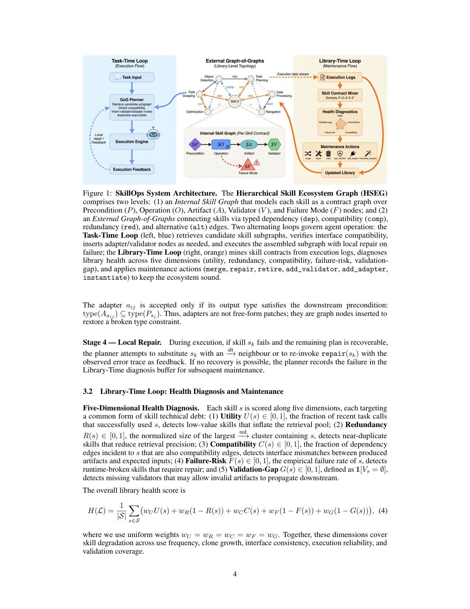
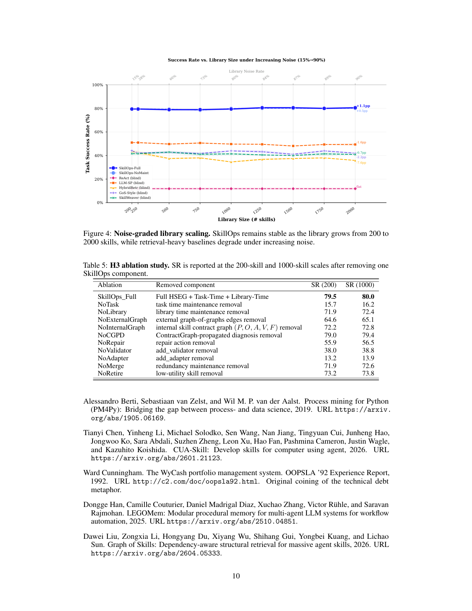

`skillops | SkillOps: Managing LLM Agent Skill Libraries as Self-Maintaining Software Ecosystems | Emory University + UIUC | arXiv:2605.13716v1, 2026-05-13, cs.SE, Preprint | 主题线 L?(技能库"库时"维护/治理,免梯度规则化)·相关性 High`

> 三标注:【原文】=论文直述;【推断】=有据判断(附依据);【待核】=拿不准关键事实。本篇基于下载 PDF 全文(23 页,71K 字符)精读。

══ 第一层:一眼看懂 [light] ══
- 🟦 **TL;DR**:agent 长期部署时,它的"技能库"会越攒越脏——技能被反复加/补丁/复用、依赖在变,慢慢积累"**技能技术债(skill technical debt)**":冗余克隆、缺校验、接口漂移、过时实现。这些**单看每个技能没坏,但会拖垮未来的检索/组合/执行**。以往工作只管"任务时(task-time)"——检索哪个技能、怎么拼、出错怎么修;**没人管"库时(library-time)"维护**。本文 **SkillOps** 把技能库当**自维护的软件生态**来治理:把每个技能写成带类型的 **Skill Contract (P,O,A,V,F)**(前置条件/操作/产物/校验器/已知失败模式),组织成 **HSEG(分层技能生态图)**,沿五个维度诊断库健康,再用 merge/repair/retire/add_validator/add_adapter 等**类型化动作**清理。核心接口一行:`cleaned_lib = run_maintenance(raw_lib)`——是个**方法无关的即插即用(plug-in)层**,不改下游 agent 代码。在 ALFWorld 上独立用达 79.5% 成功率(超最强基线 +8.8pp,零额外 task-time LLM 调用);作为 plug-in 给检索类基线 +0.68~+2.90pp;**规则化维护几乎零 LLM 调用/token**。代码开源。【原文 Abstract/§1】
- **最巧的一步**:**把技能建模为带类型的 Skill Contract (P,O,A,V,F) + 用 dep/comp 双边约束做"拼接"**。抽掉它(回到纯文本检索 / 单边依赖图)整个方法就垮——因为只有"产物类型 A 匹配下游前置 P 且接口兼容 comp"才允许技能转移,这把"文本看着相关但执行拼不起来"的失败在**规划期就挡掉**,而非运行时才暴露。消融印证:去掉 Task-Time Loop 成功率从 79.5% 暴跌到 15.7%;去掉 add_adapter 跌到 13.2%(最致命)。【原文 §3.1/§5.5 Table 5】

══ 第二层:为什么做(写透) ══
- **研究背景**:LLM agent 越来越依赖技能库(存可复用可执行过程:parser/controller/API wrapper/校验器/数据脚本);benchmark 显示有技能能提升成功率,近期系统靠检索、依赖感知图搜索、任务时组合改进技能使用。但**长期部署后库不再静态**:技能反复加/补丁/复用/接新依赖——技能库从"固定检索池"变成"需要管理的持久软件资产"。【原文 §1】
- **解决的具体痛点**:**技能技术债**(借鉴软件/ML 系统技术债):库级持久缺陷(冗余、缺校验、接口漂移、过时实现),**单技能本地不坏,但降低未来检索/组合/执行可靠性**。关键是**持久性**:task-time 修复只解决当前 episode,底层库缺陷仍在,技能下次复用又会失败。现有 skill-based agent 几乎只做 task-time(检索/组合/执行修复),**不直接解库时问题**——任务时修了不更新库,缺的校验器还缺,不兼容接口还暴露,冗余实现仍可被检索到;系统默认"库是健康的",而库越大此假设越弱。【原文 §1】
- **相关工作 & 各自不足**:① task-time 检索/组合/修复(GoS、GraSP、SkillWeaver 等)——重要但不解库时持久缺陷;② self-repair(SkillWeaver 任务时校验+honing)——能修当前 episode 选中技能,但**不做全局库时健康诊断与持久维护**。SkillOps 的位置:**第一个把"技能库可维护性"形式化为库时问题**,提供运行在下游 agent 之前的库管理层。【原文 §1/§4.2】
- **动机链**:agent 长期部署 → 技能库累积技术债 → task-time 修复治标不治本 → 现有系统默认库健康(库大时失效)→ 所以需要一个**库时维护层**:给原始库,诊断持久缺陷、施类型化修复、返回干净库,下游检索/规划 agent 不改代码即可用 → 落地为 SkillOps(契约表示 + 图组织 + 健康诊断 + 反馈驱动维护)。为什么不用更简单做法:纯文本检索/单边依赖图会选到"看着相关但拼不起来"的技能(消融 NoExternalGraph 64.6、NoInternalGraph 72.2,均显著低于 79.5)。【原文 §1/§5.5】
- **与最近邻工作的 Δ**:最近邻 = GoS(Graph-of-Skills,单依赖边做子图抽取)与 SkillWeaver(任务时自修复)。Δ:GoS **只建单一依赖边、不建兼容/冗余/替代边、无库时维护**;SkillWeaver **只修当前 episode、无全局库健康诊断**。SkillOps 的差异是 **(P,O,A,V,F) 类型契约 + 四类边(dep/comp/red/alt)+ 独立的库时维护循环**。这个差异有用:类型约束在规划期挡掉接口不匹配,库时维护持久清债——把"技能库当受管软件资产而非静态检索池"。【原文 §4.2/§6】

══ 第三层:怎么做 + 靠不靠谱 ══
- **方法流水线**(两条交替循环,见 Fig 1;§2-3):
  1. **Skill Contract (P,O,A,V,F)**:每技能 = 前置 P / 可执行操作 O / 产物 A(带类型)/ 校验器 V / 已知失败模式 F。V=∅ 即"validation gap"。
  2. **HSEG(分层技能生态图)**:库 L=(S,R),四类有向边——dep(si 产物满足 sj 部分前置,A_si⊆P_sj)、comp(si 输出类型兼容 sj 输入)、red(两技能接口等价=冗余)、alt(同目标不同实现)。
  3. **Task-Time Loop**(Alg 1):① Skill Matching——r=λ·BM25+(1−λ)·语义,且只留前置被当前状态满足的技能;② Dependency Stitching——只沿 **dep∩comp** 双边拼出计划 π*(单依赖不够,产物类型还要匹配下游输入);③ Validator/Adapter Insertion——非终结技能 V=∅ 则标不可验证并插校验器节点;有 dep 无 comp 则插 adapter 节点(且 adapter 输出类型须满足下游前置);④ Local Repair——执行中技能失败则换 alt 邻居或带错误 trace 重调 repair;不可恢复则记入库时诊断 buffer。
  4. **Library-Time Loop**(Alg 2):**五维健康诊断**——Utility(近期被成功使用比例)、Redundancy(最大 red 簇归一大小)、Compatibility(关联 dep 边中也是 comp 边的比例)、Failure-Risk(经验失败率)、Validation-Gap(1[V=∅]);整体健康 H(L) 均匀加权。**CGPD(ContractGraph-Propagated Diagnosis)**:沿 dep 边传播风险 R^(t+1)(s)=(1−α)R_loc(s)+α·max_{parents}R^(t),由 Banach 不动点定理收敛——让结构健全但继承上游高风险的技能也能被预防性插校验器。再施动作 merge/repair/retire/add_validator/add_adapter(+ task-time 的 instantiate 绑参)。
  5. **Plug-in 接口**:f: L↦L′ 是纯库变换,不碰下游检索/规划/执行逻辑;BM25/dense/hybrid/LLM planner/图 planner/self-repair agent 都可把原始库换成维护后库直接用。
- **逐组件必要性**(H3 消融 Table 5,200/1000 skill 两尺度):
  · **Task-Time Loop**:去掉 79.5→**15.7**(最致命,证明匹配+类型拼接+校验/adapter 插入+本地修复是可执行规划核心)。
  · **Library-Time Loop**:去掉 79.5→71.9(持久维护有价值)。
  · **External Graph**(跨技能关系)→64.6;**Internal Graph**(P,O,A,V,F 契约)→72.2,均必要。
  · 动作层:**NoAdapter→13.2**(最关键!)、**NoValidator→38.0**、**NoRepair→55.9**;merge/retire 影响较小(71.9/73.2)。
  · **CGPD→79.0(几乎无影响)**——作者**诚实承认**:CGPD 当前不提升任务成功率,因为校验器字段尚未在规划期被消费(Limitations)。【原文 §5.5/Limitations】
- **关键机制直觉**:"dep∩comp 双边"= 不仅要"上游能产出下游需要的东西"(依赖),还要"类型对得上"(兼容)才允许接——把运行时接口错误前移到规划期。adapter 不是自由补丁,而是为"修复被破坏的类型约束"插入的图节点(输出类型须满足下游前置)。CGPD 的风险传播 = 让"自己没毛病但喝了上游脏水"的技能也被预防性加校验。规则化诊断用**可观测信号**(utility 日志、body-hash 碰撞、缺校验器、失败日志、类型不匹配)→ **库时几乎零 LLM 调用**。【原文 §3,直觉为【推断】】
- **实验与证据**:数据集 = **ALFWorld**(文本家务,严格序子目标 grader,SR=高层动作序列精确匹配 ground-truth);技能库由 **229 个 SkillsBench 真实技能**构建,放大到更大规模时**注入 6 类技术债**(冗余克隆/过时克隆/缺校验/缺产物/错接口/过度专精),9 个规模 200–2000,降级密度 15%→90%(非嵌套构造避免超集偏差)。**backbone 全用 GPT-4o-mini**。**支撑核心主张的关键实验**:① H1(Table 1)独立 agent 达 **79.5% SR**(零方差),超最强基线 LLM_Skill_Planner(70.6%)+8.9pp;② H2/Fig4(Table 4)**噪声分级缩放**——库从 200→2000、噪声 15%→90%,SkillOps 稳在 ~79–80.5%,最大规模领先次优 >31pp,而 task-time-only 基线随脏池退化(这是论文**最核心证据**:证明库时维护让系统在技术债增长下保持鲁棒);③ V2(Table 3/Fig3)维护几乎零库时 LLM、task-time token 35 格中 24 格下降(库剪枝让 prompt 更干净)。**baseline 公平性**:全用同 GPT-4o-mini + 同库 + 同 gold-argument 假设,作者自实现所有基线;但 GoS/GraSP **未开源,故为"clean reproduction"非作者原版**——【推断:复现可能不完全等价于原方法,但作者明示了这点】。**"看着强但没回答核心问题"风险**:H1 用了 gold-argument + 半合成库,但 H2 的"盲设定(无 gold args)+ 真实+降级混合库"较好地回应了"真实脏库下是否鲁棒"。【原文 §4-5】
- **假设与失效边界**:【原文 Limitations】(i) 依赖**结构化技能契约**,部分设定还需 **gold PDDL 风格参数**,真实部署未必有;(ii) 评估库**半合成、主要基于 ALFWorld**,需更广 benchmark 与真实长程 agent 日志;(iii) 规则化维护几乎零 LLM,但**会漏掉需深推理的语义冗余/复杂技能冲突**;(iv) **CGPD 当前不提升任务成功率**(校验器字段尚未在规划期被消费)。【推断】强依赖技能有明确类型化接口(无类型/自由文本技能难建 comp/red 边);ALFWorld 的精确序匹配 grader 偏严苛,泛化到开放任务的有效性待证。
- **祛魅总结**:**硬货**=(i) **问题框定本身是真贡献**——把"技能库维护/技术债"作为独立的"库时"问题首次形式化,视角新颖且切中长期部署痛点;(ii) HSEG 类型契约 + dep∩comp 双边拼接是扎实工程,消融清楚(NoTask/NoAdapter/NoValidator 的暴跌很有说服力);(iii) "库时维护几乎零 LLM 成本"是实用且诚实量化的卖点;(iv) H2 噪声分级缩放是强证据。**包装/需谨慎**=(i) "Self-Maintaining Ecosystem"措辞响,但**当前维护是规则驱动(rule-based)、非学习/非 LLM 推理**,作者明说会漏语义级问题;(ii) **CGPD 这个带 Banach 不动点定理"高级组件"实际不提升成功率**——属理论包装大于实效,作者诚实标出;(iii) H1 的 79.5% 部分受益于 gold-argument 与半合成库;(iv) "method-conditional"是把双刃剑——对 self-repair agent(SkillWeaver)**外部维护可能与其任务时自修复冲突**(token 反增),说明该层并非普惠。作者整体**异常诚实**(主动揭示中性/冲突/无效组件),不是高估。【推断,依据 §6/Limitations/§5.5】

══ 结构化抽取(供全景汇总) ══
- 🎯 **机制速览 6 轴** [light]:
  | 维度 | 内容 |
  |---|---|
  | 学什么信号 | **可观测执行信号(经验,非 LLM 反思)**:utility 日志、body-hash 碰撞、缺校验器、失败日志、类型不匹配 → 五维健康分【原文 §1/§3.2】 |
  | 改什么 | **技能库本身**(技能契约的合并/修复/淘汰/插校验器/插 adapter + 图结构);**不改模型、不改下游 agent 代码、不改 prompt 模板** |
  | 何时改 | **离线/库时批量**:Task-Time Loop 每任务规划+本地修复(per-episode),Library-Time Loop 在执行后据 trace 批量维护(触发条件 ΔH<Θ_maint)【原文 Alg1/Alg2】 |
  | 免梯度? | **是**(完全规则驱动,库时几乎零 LLM 调用;无任何模型训练/梯度) |
  | 记忆-技能生命周期 | 写入(从执行日志挖契约)→ 检索(BM25+语义+前置过滤)→ 组合(dep∩comp 拼接+插 adapter/validator)→ 诊断(五维健康+CGPD 风险传播)→ **淘汰/遗忘(retire 低 utility、merge 冗余、repair 高风险)**→ 共享(plug-in 给任意下游) |
  | 防遗忘机制 | **治理/隔离类**:retire+merge+repair 主动剪债防"脏池膨胀";校验器/adapter 隔离接口错误;无 KL/几何共识/参数 merging(非参数,无灾难性遗忘问题)【推断:属"主动库治理"型防退化】 |
- ⑦ **开源代码 + 框架/harness**:**已开源** https://github.com/Hik289/SkillOps.git 【原文 Abstract】。**无训练框架**(纯规则化、非参数、不训模型);agent backbone=GPT-4o-mini(OpenAI API);技能源=SkillsBench(BenchFlow AI,Apache-2.0);harness=自实现的 HSEG planner + ALFWorld offline high_pddl grader。(仓库未 clone 验证,框架结论基于 PDF;此为 method-agnostic plug-in 库,非 RL 训练框架)
- 💰 **资源/成本与可扩展性**:**极低成本**——库时维护**几乎零 LLM 调用/token**(规则驱动,Fig3b 仅计 maintenance actions/cycle:从 30(lib=200)到 1815(lib=2000));task-time token 35 格中 24 格**下降**(库剪枝),最大降 −3.95%(Dense_Only@1000);仅个别格上升(BM25@500 +5.56%,因合并后描述变长)。规模可扩到 2000 技能仍稳。无 GPU。【原文 §5.3/Fig3】
- 🎯 **对"探索-巩固"idea 对标** [light]:**可借组件(治理侧)+ 缺口补充**。(可借)SkillOps 提供了"探索→巩固"链路里**最被忽视的一环:巩固后的资产如何长期治理防退化**。其"**五维健康诊断 + retire/merge/repair 主动剪债 + 类型契约挡掉不可组合项**"可直接迁移到 MTP/OPD 巩固出的"路径/技能记忆库"的生命周期管理,防止经验库膨胀后检索质量崩坏。"dep∩comp 双边约束"对"路径恢复时拼接子路径需类型/状态兼容"有启发。(缺口)它揭示了一个调研缺口:多数自进化工作只谈"如何写入/学习",**很少谈"如何长期维护与淘汰"**——SkillOps 正是补这块。(非竞品)它不学习、不动参数,与参数侧巩固正交。
- 🔭 **开放问题/未来方向**:【原文 Limitations】(a) 去掉对结构化契约/gold PDDL 参数的依赖,适配真实部署;(b) 更广 benchmark + 真实长程 agent 日志(摆脱半合成库);(c) 用更深推理(LLM)补规则化漏掉的语义冗余/复杂冲突;(d) 让 CGPD 的校验器字段在规划期被消费,使其真正提升成功率。【推断】(e) 与 self-repair agent 的冲突如何协调(当前"method-conditional");(f) 在线增量维护(当前更像批处理)。

- 🖼 **关键图 top-2** [light]:
  
  · 这是**原文 Figure 1**(方法主图/系统架构)。一图含三块:左蓝 Task-Time Loop(检索候选子图→验接口兼容→插 adapter/validator→执行+本地修复),中间 HSEG 两层(内层把每技能建成 P/O/A/V/F 契约图,外层用四类边连技能),右橙 Library-Time Loop(从日志挖契约→五维健康诊断→merge/repair/retire/add_validator/add_adapter)。选它因为它完整呈现"双循环 + 类型契约 + 图组织"这一全文骨架,是绝对精华。【原文 Figure 1】

  
  · 这是**原文 Figure 4**(核心发现/主结果图)。横轴库规模(下方标注同步上升的噪声率 15%→90%),SkillOps-Full 曲线几乎水平(~79–80.5%),与 SkillOps-NoMaint 及各盲设定基线(ReAct/LLM-SP/Hybrid/GoS/SkillWeaver)随噪声明显下滑形成对比,标注了各点 pp 差。选它因为它**直接证明论文中心主张**——"把技能库当受管软件资产、做库时维护,能在技术债持续累积下保持鲁棒",是支撑全文的最关键实验图。【原文 Figure 4/§5.4】
