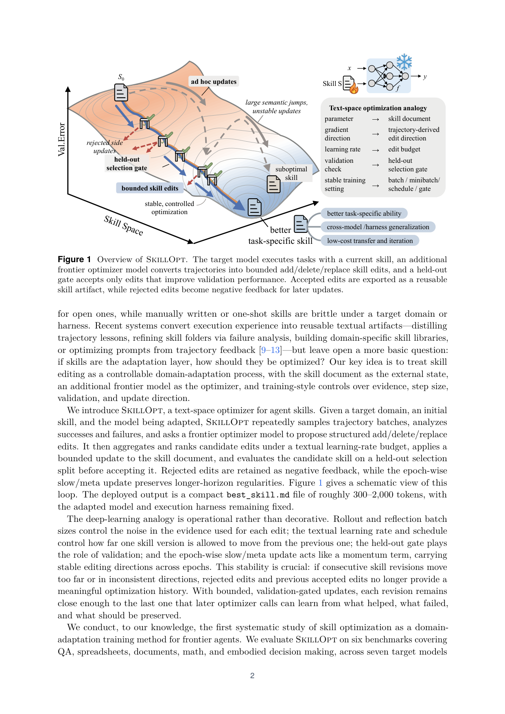
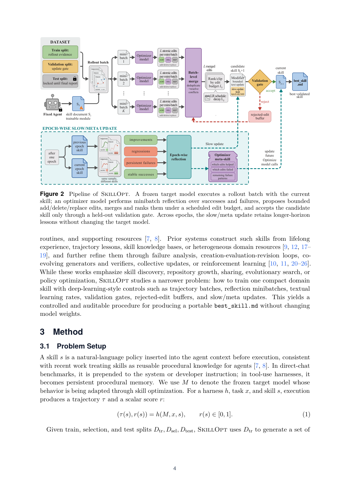

`skillopt | SkillOpt: Executive Strategy for Self-Evolving Agent Skills | Microsoft + SJTU + 同济 + 复旦(Yifan Yang, Xue Yang, Chong Luo 等) | 2026-05(arXiv v2, 2026-05-25) · Preprint · v2 | 主题线 L?(技能演进/经验巩固 · 把"技能文档"当可训练外部状态)·相关性 High`

> 一句定位:把"agent skill 文档"当作冻结模型的**可训练外部状态**,用**深度学习优化器的全套纪律**去训它——rollout batch 当"前向取证据",optimizer 模型反思成败提出 **add/delete/replace** 编辑(=梯度),**文本学习率 L_t** 限定每步最多改几处(=步长),**held-out 验证 gate** 只接受严格涨点的编辑(=验证),**epoch-wise slow/meta update** 跨 epoch 沉淀长程规律(=动量),**rejected-edit buffer** 把被拒编辑变负反馈。最终导出一个 300–2000 token 的 `best_skill.md`,部署时**零额外模型调用**。52/52(模型×基准×harness)格全胜或并列最优。

---

## ══ 第一层:一眼看懂 ══

- 🟦 **TL;DR**:现在的 agent 技能要么人手写、要么 LLM 一次性生成、要么"松散自改写",**没有一个像深度学习优化器那样、能在反馈下稳定地比起点更好**。SkillOpt 把这件事做成一个真正的"文本空间训练循环":① 冻结目标模型 M 用当前技能跑一批任务(rollout batch,=前向);② 一个**独立的 frontier optimizer 模型**把成功/失败轨迹分成 minibatch 反思,提出结构化 add/delete/replace 编辑(=反向/梯度);③ 把候选编辑按效用排序、**clip 到最多 L_t 条**(=学习率/步长,支持 constant/linear/cosine/autonomous 调度);④ 应用后得候选技能,**在 held-out selection split 上跑**,**只有严格 > 当前分**才接受(=验证 gate,平局也拒);⑤ 被拒编辑进 rejected-edit buffer 当负反馈,**epoch 末 slow/meta update** 比较"上一 epoch vs 本 epoch 技能"沉淀长程规律(=动量,写进受保护字段)。导出 `best_skill.md`(300–2000 token),部署只调目标模型、零优化器调用。6 基准 × 7 模型 × 3 harness(直聊/Codex/Claude Code)= 52 格全胜;GPT-5.5 直聊平均 +23.5 分,且比"逐格最强 baseline 的 oracle"还高 +5.4 分。

- **最巧的一步**:**"bounded edit budget(文本学习率)+ held-out 验证 gate"** 这对组合抽掉就垮。没有它,optimizer 的开放式改写会"擦掉有用规则、引入冲突指令、过拟合单个失败"——消融 Table 3 "without lr" 行(84.6/75.7/57.3)与去掉验证后的不稳都印证。更关键:**正因为每步更新有界且被验证 gate 守住**,连续技能版本才"足够靠近上一版",使后续 optimizer 调用能从 rejected/accepted 历史里学"什么有用、什么失败、什么该保留"——把"自改写"变成有优化史可循的"训练"。论文反复强调这是 vs EvoSkill/GEPA 等的本质差异(它们缺有界文本学习率 + 拒绝记忆)。

---

## ══ 第二层:为什么做 ══

- **研究背景**:frontier LLM 越来越作为 agent 部署(从单 prompt 到带工具/文件/verifier 的多步 harness)。领域适配不再只关于权重/prompt,更要**改进 agent 的"过程"**(怎么取证、调工具、守领域惯例、格式化输出)。**skill** 是这种过程性适配的天然接口:一个可移植的自然语言 artifact,打包 procedures/启发式/工具策略/输出约束/失败模式,让**冻结 agent 靠外部文本适配**。
- **解决的具体痛点**(§1):若"适配的反复对象"是 agent 的过程,**技能文档本身就该可训练**。但:① 闭源 frontier 模型权重适配不可得/昂贵,开源的也贵;② 人手写/一次性技能在特定领域或 harness 下**脆**;③ 近期把执行经验转成文本 artifact 的系统(Trace2Skill 蒸馏轨迹教训、按失败分析精化技能文件夹、建领域技能库、从轨迹反馈优化 prompt)都**留下一个更基础的问题没答:如果技能是适配层,它到底该怎么被优化?**
- **核心 idea**:把**技能编辑当成一个可控的领域适配过程**——技能文档=外部状态,额外 frontier 模型=优化器,对"证据/步长/验证/更新方向"施加训练式控制。
- **相关工作 & 不足**(§2):
  - **Prompt 自动调优 / 配置搜索**:GEPA(轨迹反馈引导反思式 prompt 演化,在若干语言-agent 任务上超 RL)、ABSTRAL、EvoTest(扩到多 agent 设计文档 / test-time agentic 系统演化,免梯度)。它们把语言 artifact 当可优化对象、能直接吃执行反馈,但**主要瞄准 prompt / 系统设计 / 整体配置,而非可复用的领域适配**。
  - **技能构建 / 演化**:SkillsBench、SoK on agentic skills 把技能框成可复用过程性知识;诸多系统从终身经验/轨迹教训/技能知识库构建技能,并经失败分析 / 创建-评估-修订 / 协同生成-验证(CoEvoSkills 类)/ 集体更新(SkillClaw 类)/ RL 精化。但它们强调技能**发现、库增长、共享、演化搜索、策略优化**;SkillOpt 研究一个**更窄的问题:怎么用深度学习式控制(轨迹 batch、反思 minibatch、文本学习率、验证 gate、拒绝缓冲、slow/meta update)训出一个紧凑的领域技能**,产出可移植、可审计的 `best_skill.md`,不动权重。
- **动机链**:技能是适配层 → 但谁都没把"怎么优化技能"当成一个真正的优化问题答 → 现有"自改写/prompt 演化"缺步长控制+验证 → 改写易擦掉有用规则、噪声化 → 所以借**权重空间优化的全套纪律映射到文本空间**(梯度=编辑、步长=编辑预算、验证=held-out gate、动量=slow update)→ 让技能训练稳定可复现 → 导出紧凑可审计 artifact、零部署开销。为什么不用更简单的现成法?human/LLM 一次性技能**无法在观察 rollout 后纠错**;Trace2Skill **无 held-out gate**;TextGrad/GEPA **优化 prompt 而非持久技能 artifact**;EvoSkill(最强 harness 侧对手)**缺有界文本学习率 + 拒绝记忆**。
- **与最近邻的 Δ**:
  - vs **EvoSkill(Alzubi 2026,本调研姊妹工作之一)**:都演化技能文件夹,但 EvoSkill 缺"有界文本学习率 + rejected-edit buffer + slow/meta 动量 + 严格验证 gate"。实验直接对比:Codex SpreadsheetBench EvoSkill 把 27.5→67.5,**SkillOpt 再 +17.5(→85.0)**。这是最近邻的关键 Δ——**把松散演化升级成受控训练**。
  - vs **GEPA / TextGrad**:它们优化 prompt(不可作持久可复用技能);SkillOpt 优化一个可训练-验证-导出-复用的**技能状态**,且强调"slow/meta 动量"带来跨 epoch 稳定方向。

---

## ══ 第三层:怎么做 + 靠不靠谱 ══

- **方法流水线**(§3,Fig.2,深度学习类比 Fig.1):
  1. **问题设定(§3.1)**:技能 s=插入 agent 上下文(直聊→前置 system prompt;工具 harness→持久过程性记忆)的自然语言策略。冻结目标模型 M;执行 (τ(s),r(s))=h(M,x,s),r∈[0,1]。三 split:D_tr 供经验、D_sel 当 gate、D_test 只用于最终报告。优化器状态=当前技能 + 最佳验证技能 + 技能 hash 缓存 + epoch-local rejected-step buffer + 可选 slow/meta 状态。只导出最佳被接受技能为 best_skill.md。
  2. **前向(§3.2 Rollout Evidence)**:M 用当前技能跑 D_tr 一个 batch,harness 记录任务元数据/消息/工具调用/观察/命令输出/最终答案/verifier 反馈 + 基准特定上下文(表格预览/文档引用/紧凑执行 trace)。batch=证据单元:小批快但噪,大批暴露更多复发模式。支持 accumulation(多批分别反思再合并)。
  3. **反向(§3.3 Minibatch Reflection)**:optimizer 模型先把失败/成功分开、各切 minibatch(单条轨迹只给"个案修补",minibatch 才暴露可复用过程错误:总搜错源 / 写错格式 / 不验工具结果)。失败 minibatch 提"缺失/纠正规则";成功 minibatch"保住已 work 的行为"。每次反思返回结构化 add/delete/replace(或 rewrite 模式给少量改写建议)。本地提案分层合并(先各自合并失败/成功驱动编辑,再以失败纠正优先合并),过滤重复/矛盾/个案特定建议。
  4. **有界文本更新(§3.4 = 学习率)**:编辑预算 L_t=第 t 步最多应用几处编辑。聚合后 optimizer 按期望效用排序、clip 到 top-L_t。**这是 vs ad hoc 改写的关键**:无界改写会擦有用规则/引冲突/过拟合局部失败;有界更新保连续性又能学新过程。支持 constant/linear/cosine/autonomous 调度(默认 cosine:先大编辑后小整合)。patch 模式=局部 append/insert/replace/delete;rewrite 模式=据建议全文重写。**step 级编辑不能覆盖受保护的 slow-update 字段**(快慢更新隔离)。
  5. **验证 gate + rejected-edit buffer(§3.5)**:候选技能在 D_sel 用同冻结模型+harness 跑;**严格 > 当前 selection 分**才成为新当前技能,**也 > 历史最佳**才成 best_skill.md,否则拒(平局也拒→部署技能不会静默漂移)。被拒编辑进 epoch-local buffer(记失败模式 + 被拒编辑及其掉分),供本 epoch 后续反思**避免重复失败编辑、聚焦未解失败**——给训练负反馈、零推理开销。
  6. **epoch-wise slow/meta update(§3.6 = 动量)**:epoch 末用"同一批训练项"分别在上一/本 epoch 技能下采样,分成 improvements/regressions/persistent failures/stable successes,optimizer 写一段**纵向 guidance** 进受保护 slow-update 字段(仍过验证 gate)。**meta skill 只在 optimizer 侧**(总结哪些编辑模式有用/被拒/失败仍在),前置进未来 optimizer 的反思/合并/排序 prompt,**不随部署技能发货**——关注点分离:部署技能保持紧凑可移植,训练却受益于更丰富的编辑过程记录。
  7. **harness 无关部署(§3.7)**:轻量 adapter 接口(构 batch、注入技能、跑原生 harness、回传打分轨迹),同一 optimizer 服务直聊/表格/文档/多模态/具身/Codex/Claude Code。三模式吃同一 best_skill.md 格式 → 支撑跨 harness 迁移实验。

- **逐组件必要性(消融,本文证据极扎实,§4.2)**:
  - **超参鲁棒(Table 2 a–f)**:训练集大小(过程性基准吃更多证据:Spreadsheet 47.5→78.0)、反思 minibatch(1–32 几乎平,默认 8 居顶)、rollout batch(8→full epoch 几乎平)、学习率 L_t(1/2/4/8/16 均有竞争力)、调度器(constant/cosine/linear 均可)、slow-update 采样数——**头条增益不是脆弱的 batch/调度搜索产物**。
  - **关键组件(Table 3,真消融)**:① 学习率:without lr(无界改写)84.6/75.7/57.3 < 默认 lr=4 87.1/77.5/61.3;dynamic lr 反更差。② **rejected buffer**:去掉掉 1.6/4.6/2.4 分(稳定器)。③ **slow/meta update**:去掉 meta skill 掉一点;**同时去掉 meta+slow,SpreadsheetBench 77.5→55.0(−22.5,全消融最大降幅)**——证明长程证据流 + 受保护字段契约(防局部编辑覆盖耐久过程教训)很关键。
  - **验证 gate 的"实证做功"(§4.4 edit economy)**:6 基准最终技能只由 **1–4 条被接受编辑**构成(中位 2.5);LiveMath +29.3 分、OfficeQA +39.0 分各只来自**单条**被接受编辑——optimizer 每 epoch 提很多编辑,**绝大多数被验证 gate 拒掉**,只少数存活进部署技能。

- **关键机制直觉**:把"调技能"从"随手改 prompt"升级成"跑一个有学习率、有验证集、有动量的训练"。技能=外部参数,optimizer 模型=算梯度的反向引擎,编辑预算=学习率(防一步迈太大把好规则踩坏),验证 gate=只接受真涨点的更新(防"看着合理实则伤模型"的诊断),slow/meta=动量(把跨 epoch 稳定的编辑方向带下去),rejected buffer=负样本记忆(别重复犯错)。

- **实验与证据**(§4):
  - 数据集/设置:**6 基准**——SearchQA(单轮 QA)、SpreadsheetBench(最多 30 轮 codegen + 真 openpyxl/pandas 运行时)、OfficeQA(多轮工具循环最多 24 调用)、DocVQA(多模态)、LiveMathematicianBench(MCQ)、ALFWorld(具身最多 50 步)。**7 目标模型**:GPT-5.5/5.4/5.4-mini/5.4-nano/5.2 + Qwen3.5-4B / Qwen3.6-35B-A3B。**3 harness**:直聊 / Codex CLI(workspace-write sandbox,渲染 per-task SKILL.md + 读回 codex_trace_summary.txt 进反思)/ Claude Code CLI。确定性 split(split_seed=42),selection 只用于接受/拒绝编辑,报告全在 disjoint test split → 测的是泛化非验证集拟合。默认:4 epoch、rollout batch 40、反思 minibatch 8(16 并行 analyst)、L_t=4 cosine(floor 2)、严格 gate、slow update 20 任务/epoch、teacher 反思最多 3 轮/minibatch。**7 baseline**:no skill / human skill / one-shot LLM skill / Trace2Skill / TextGrad / GEPA / EvoSkill(harness 侧),全用同模型+同 test+同 scorer,隔离"适配过程"这一变量。
  - **支撑核心主张的关键实验**:
    - ① **主表 Table 1**:**52/52(模型×基准×harness)格全胜或并列最优**。GPT-5.5 直聊:SearchQA 77.7→87.3、Spreadsheet 41.8→**80.7**、OfficeQA 33.1→**72.1**、DocVQA 78.8→91.2、LiveMath 37.6→**66.9**、ALFWorld 83.6→95.5;六基准均值 58.8→82.3(**+23.5**),且比"逐格选六法最强者的 oracle baseline"(76.9)还高 **+5.4**。七模型平均 ≈+17.6 分/模型;**小模型相对获益最大**(GPT-5.4-nano DocVQA 近翻倍、ALFWorld 三倍),印证"紧凑技能能补小模型权重里没有的过程性知识"。
    - ② **工具 harness 同样有效**:Codex 上 GPT-5.5 五基准全胜,均 +24.8(vs no skill)、+14.0(vs 次优 EvoSkill);Claude Code 上 +19.1、+3.2(EvoSkill 本身已把均值 57.8→73.7,SkillOpt 再超)。
    - ③ **三类迁移(Table 4)**:(a) 跨模型——GPT-5.4 学的 Spreadsheet 技能迁到 mini(+9.4)/nano(+3.0),LiveMath 迁 mini(+4.5)/nano(+5.6),全正,有一格转移甚至超 in-domain;(b) **跨 harness——Codex 学的 Spreadsheet 技能迁到 Claude Code +59.7(22.1→81.8,略超 in-domain),反向 +43.6**;(c) 跨基准——OlympiadBench→Omni-MATH 三模型全正(+3.7/+1.8/+1.3)。→ 学到的是可复用过程性知识,非记忆化格式。
    - ④ **优化器强度(Table 5)**:强 optimizer(GPT-5.5)每格绝对增益更大,但 **target-matched optimizer 仍恢复 56–74% 增益** → **不是"强师蒸馏进弱生",优化循环本身贡献实质价值**。这是个重要的祛魅性证据。
    - ⑤ **学到的技能长啥样(Fig.4 / Table 6)**:最终 best_skill.md 379–1995 token(中位 ~920),由 1–4 条编辑构成;规则**全是过程性、非个案特定**(如 SpreadsheetBench:"检查 workbook 结构与公式,把求值后的静态值写满目标区,而非依赖 Excel 重算"),且编码 frontier 模型 zero-shot 缺的纪律(答案格式约束、证据绑定到具体视觉区、搜索前沿管理)。
  - **baseline 公平性**:同模型/同 test/同 scorer,隔离适配过程;还做了"备择解释"排查(§4.1 末)——不是 prompt 长度(human skill 已 145–516 token 仍被全胜)、不是只靠 optimizer 容量(nano 上也领先 + Table 5)、不是只吃某一技能格式(Codex 上 EvoSkill 已涨、SkillOpt 再 +17.5)。**公平性做得罕见地扎实**。
  - **"看着强但没答核心问题"风险**【推断】:几乎没有明显短板;唯一可挑——**成本不均**(Table 6:SearchQA 37.9M、DocVQA 46.4M token/分,比过程性基准贵一个数量级),且**全部 optimizer 调用是训练时 frontier 模型成本**,论文坦诚这点。另外 ALFWorld 在 Codex/Claude Code 下空缺(具身持久交互未被标准 adapter 表示),属诚实标注的覆盖缺口。

- **假设与失效边界**:
  - 【原文】§4.1:增益**最大在过程性基准**(可复用的工具用法/输出格式规则最重要);事实/多模态基准也有但较小(SearchQA 接近天花板只 +9.6)。
  - 【原文】Table 6:成本一次性付在训练,导出后零优化器调用/零权重更新;但长轨迹/多模态基准 token/分高一个量级。
  - 【原文】ALFWorld 具身持久交互不被标准 Codex/Claude Code adapter 表示(harness 覆盖边界)。
  - 【推断】依赖**强 frontier optimizer 当默认**(虽 target-matched 也行 56–74%);验证 gate 需**可靠标量 reward / exact-match**——开放式任务无明确 reward 时 gate 失效(作者在 Outlook 自认需"reward-free / 偏好驱动 gate")。依据:§3.5 gate 用 r∈[0,1] + Outlook。
  - 【推断】单技能单领域;技能库跨域共享、meta skill 跨基准复用尚未做(Outlook 列为未来)。依据:Conclusion/Outlook。

- **祛魅总结**:
  - 真贡献(硬货):① **"技能=可训练外部状态 + 把权重空间优化全套纪律(LR/调度/验证/动量/负样本)系统映射到文本空间"** 是个干净、可操作(非装饰)的框架,且**首次系统性**把技能优化当领域适配训练来研究;② **bounded edit + 严格 held-out gate** 把"开放式 LLM 改文档"的噪声彻底兜住,使"少数编辑(1–4)即大涨 + 部署紧凑可审计"成立——edit economy 是漂亮的硬证据;③ **slow/meta update(动量)+ rejected-edit buffer(负样本)+ 受保护字段(快慢隔离)** 三件套有消融支撑(去掉 slow+meta 掉 22.5 分);④ **优化器强度消融**诚实证明"非强师蒸馏",优化循环本身有价值;⑤ **跨 harness +59.7 迁移**是强部署信号。整体实证密度(52 格 + 三类迁移 + 6 组超参 + 真消融 + 成本表 + 备择解释排查)在同类工作里属顶配。
  - 包装/营销成分【推断】:(a) 标题 "Executive Strategy" 略空泛,实质就是"带验证 gate 的有界文本编辑训练";(b) "deep-learning optimizer 类比"很贴切但本质仍是**冻结 LLM 按 prompt 改 Markdown + 一个 argmax 选择门**,"学习率/动量"是隐喻而非真梯度;(c) 模型名(GPT-5.5/5.4、Qwen3.6)疑似化名/未来命名风格,具体版本待核;(d) 全程不动权重,**不触及模型能力本身**(Outlook 才把"self-distill 技能回模型"列为通往权重适配的跳板)。依据:§3 全是文本编辑 + gate、Outlook 自陈。

---

## ══ 结构化抽取 ══

- 🎯 **机制速览 6 轴**:

| 学什么信号 | 改什么 | 何时改 | 免梯度? | 记忆-技能生命周期 | 防遗忘机制 |
|---|---|---|---|---|---|
| **下游标量 reward / exact-match**(r∈[0,1],驱动验证 gate 与编辑排序)+ **轨迹成败模式**(optimizer 反思 minibatch 提编辑);rejected 编辑的掉分=负反馈 | **改单个技能文档 best_skill.md(自然语言,add/delete/replace 编辑)** + optimizer 侧 meta skill(不发货);**目标模型权重/harness 全冻结** | **离线批量训练**:rollout batch(前向)→ minibatch 反思(反向)→ 每步有界更新 → 每 epoch slow/meta;**部署 test-time 零更新**(静态技能) | **完全免梯度**——目标模型+optimizer 均冻结 LLM 经 prompt 调用;"梯度/学习率/动量"是文本空间的算子隐喻,非真反传 | 写入=optimizer 提编辑→gate 接受才进技能;检索=部署时整篇技能前置进上下文(单文档,非检索库);淘汰=被拒编辑入 rejected buffer(训练期负样本,不进部署);共享=best_skill.md 跨模型/harness/相邻基准迁移复用 | **验证 gate(严格>,平局拒)+ 有界编辑预算 + 成功 minibatch 保住已 work 行为 + 受保护 slow-update 字段(step 编辑不可覆盖)+ slow/meta 动量**——多重机制防"改写擦掉有用规则/静默漂移/覆盖耐久过程教训";目标模型冻结天然不遗忘 |

- ⑦ **开源代码 + 框架/harness**:**已开源** https://aka.ms/SkillOpt(Microsoft 短链,首页 + correspondence 给出)。**框架 = 无外部 RL/训练框架**(不训练任何权重,纯冻结 LLM + prompt + 文本编辑 + argmax gate);属**自研 text-space optimizer**——核心是 adapter 接口(构 batch / 注入技能 / 跑原生 harness / 回传打分轨迹)+ optimizer-model 反思-合并-排序 pipeline + 验证 gate。**执行 harness 三种**:直聊单 chat completion、**Codex CLI(workspace-write sandbox,SKILL.md + codex_trace_summary.txt)**、**Claude Code CLI**。审计件:edit_apply_report.json(逐编辑 accept/skip 状态)。模型:GPT 与 Qwen 两族 API。〔仓库内部实现细节待核——本分析基于 PDF 正文 + 附录;**未 clone 仓库**,P3.5 已标 has_code,具体框架/依赖以仓库为准〕

- 💰 **资源/成本与可扩展性**:**训练成本=训练时 API token**(Table 6,GPT-5.5/GPT-5.5 师生同模):SearchQA 213.8M / DocVQA 188.2M(贵,37.9–46.4M token/分);过程性基准便宜(Spreadsheet 21.4M、OfficeQA 20.8M、LiveMath 23.2M,仅 0.6–3.6M token/分,绝对增益却最大)。**部署成本≈0 额外**:导出后 best_skill.md(379–1995 token)只多占目标 agent 一点上下文,**无优化器调用、无权重更新**。优化器强度是纯训练时杠杆(强 optimizer 不加部署成本)。延迟:推理只多一段技能前缀。【原文 Table 6 / §4.3-4.4】

- 🎯 **对"探索-巩固(TSRD / MTP+OPD)"idea 对标**:**强可借组件 + 部分竞品 + 关键缺口**。可借(本篇是四篇里对你 idea 最富"训练纪律"启发的):① **"把可复用知识当外部可训练状态 + 用 LR/验证/动量/负样本的训练纪律去优化它"** 整套框架,可直接迁到 TSRD 的"path-recovery 技能/策略库"——把恢复策略集当外部状态,用**有界编辑 + held-out gate** 受控演进,避免巩固阶段把已学坏掉;② **rejected-edit buffer(负样本记忆)+ slow/meta 动量(跨轮稳定方向)** 是现成的"稳定巩固"机制,正对你"探索产物如何稳健沉淀不抖动";③ **严格验证 gate(只接受严格涨点、平局拒)→ monotonic 不退化**,可作 TSRD 巩固的安全合并准则;④ **受保护字段(快慢更新隔离)** 思想可迁到"快适配 vs 慢巩固"的双时间尺度;⑤ **优化器强度消融"非强师蒸馏"** 的实验范式,可借来论证你的方法增益来自机制本身而非更强 teacher。竞品/缺口:SkillOpt 与 TSRD 都做"经验→可复用知识 + 防遗忘",但 SkillOpt **零参数学习、不触及模型能力本身、无前瞻**(Outlook 才把"self-distill 技能回权重"列为未来方向)——你的 **MTP-foresight(前瞻探针)+ OPD 参数蒸馏** 恰好补"把外部技能内化进权重 + 用前瞻指导探索"这两格;反过来 SkillOpt 的"文本空间训练纪律"是你巩固阶段可直接搬的工程脚手架。**特别契合点**:Outlook 明写"self-distillation of optimized skills back into the target model as a stepping stone toward weight-level adaptation"——这正是 OPD 可接管的位置(把 SkillOpt 训出的技能当蒸馏目标内化进学生模型)。

- 🔭 **开放问题/未来方向**:
  - 【原文】Outlook(§5):跨域共享基础设施的**技能库**;optimizer 侧 **meta skill 跨基准复用**;**reward-free / 偏好驱动验证 gate**(应对开放式任务);**把优化后技能 self-distill 回目标模型**作为通往权重级适配的跳板。号召把优化全套工具(学习率/调度/正则/课程/验证)用到 agent 栈里至今手工的"技能"部分。
  - 【推断】(a) gate 依赖可靠 reward,无 reward 任务上的可行性;(b) 多技能协同/路由(当前单技能单域);(c) 长轨迹/多模态基准 token/分高,如何降本;(d) optimizer 与目标模型协同进化(当前 optimizer 冻结)。依据:§3.5 gate 用标量 r、Table 6 成本不均、单技能设定。

- 🖼 **关键图 top-2**:

  
  这是**原文 Figure 1(总览 + 核心类比图)**:左侧把技能优化画成损失面上的优化轨迹——SkillOpt 用 bounded skill edits + held-out selection gate 稳定走向低 Val.Error,而 ad hoc updates 是"大语义跳跃、不稳更新";右侧"Text-space optimization analogy"表把权重空间五要素(parameter / gradient direction / learning rate / validation check / stable training setting)逐一映射到文本空间(skill document / trajectory-derived edit direction / edit budget / held-out selection gate / batch·minibatch·schedule·gate),并列出三大收益(更强任务能力 / 跨模型-harness 泛化 / 低成本迁移迭代)。选它因为一图说清本文最核心的 thesis——**把技能当可训练外部状态、用深度学习优化器的纪律去训**,以及"有界+验证"为何带来稳定不退化。

  
  这是**原文 Figure 2(方法主图/pipeline)**:完整呈现一个 epoch 内的训练循环——Train split 的 rollout 证据切 minibatch,optimizer 模型每 minibatch 出 L 条原子 add/del/replace 编辑、batch 级合并去重解冲突、按编辑预算 L(LR schedule 衰减)做 bounded text update 得候选技能 S_{t+1},经 Validation gate(accept→当前/best,reject→进 rejected-edit buffer 反哺未来 optimizer 调用);右侧 Epoch-wise slow/meta update 比较上/本 epoch 技能、把 improvements/regressions/persistent failures/stable successes 写进受保护 slow-update 字段(动量),meta skill 只在 optimizer 侧。选它因为它把抽象的"训练纪律类比"落成可实现的模块咬合图,清楚展示快(step 编辑)/慢(epoch slow update)两时间尺度、gate 与 buffer 如何把开放式编辑变成受控可复现的优化。
