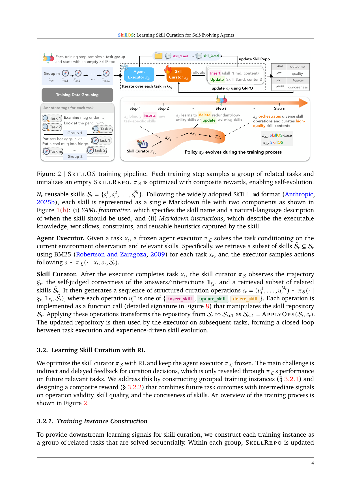
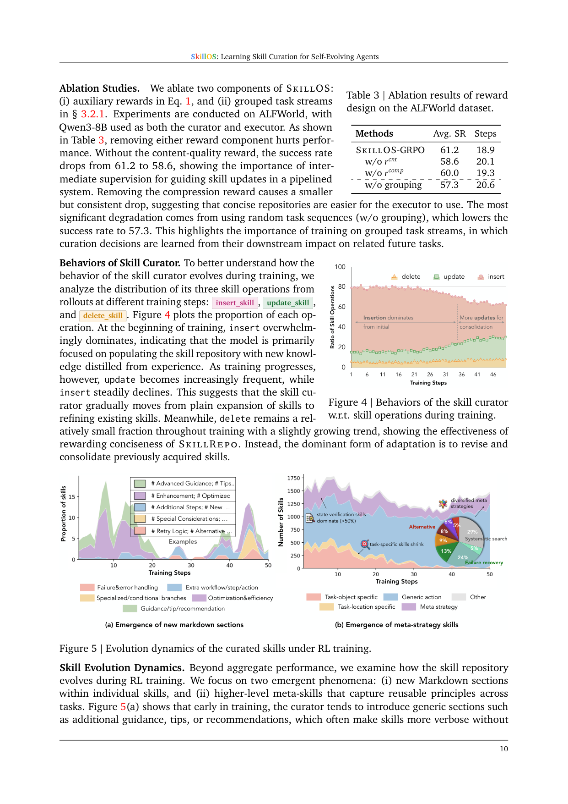

`skillos | SkillOS: Learning Skill Curation for Self-Evolving Agents | Google Cloud AI Research + UIUC + MIT(Siru Ouyang, Jun Yan, Chen-Yu Lee, Tomas Pfister, Jiawei Han 等;ReasoningBank 原班团队) | 2026-05(arXiv v1, 2026-05-07) · Preprint · v1 | 主题线 L?(技能策展/演进 · 用 RL 学 curation policy · self-evolving agents)·相关性 High`

> 一句定位:把"agent 该怎么策展(curate)自己的技能库"这件事**当成一个长程 RL 问题来训**——一个**冻结的 agent executor**(只检索+用技能)配一个**可训练的 skill curator \(π_S\)**,curator 看完执行轨迹后对外部 SkillRepo 发 insert/update/delete 函数调用。关键招:① 训练实例=一**组技能相关的任务**(早期任务更新 repo、后续相关任务来检验更新好不好),把"延迟/间接的下游反馈"变成可学信号;② **复合 reward**(下游 task 成功 + 函数调用合法性 + 技能内容质量 + repo 简洁度)归因到 curation 决策。用 GRPO 训。一个 8B curator 训出来,**直接当 curator 用的 Gemini-2.5-Pro 都打不过它**,且能迁移到没见过的 executor 和任务域。

---

## ══ 第一层:一眼看懂 ══

- 🟦 **TL;DR**:LLM agent 大多是"一次性解题器",不从过去交互里学。可复用 skill(从经验蒸馏的过程性记忆)是 self-evolution 的好底座,但**高质量 skill curation(从轨迹里抽好教训 + 整合进技能库)是瓶颈**。现有做法要么靠人手策展(不可扩)、要么用固定启发式规则定记忆操作(无下游反馈、不适配 executor 真实需要)、要么只在**短任务流**上训(信号稀,学不会复杂的 update/delete)。SkillOS 提出一个**经验驱动的 RL 训练配方**:① 模块化多 agent——**冻结 executor \(π_L\)**(给任务 \(x_t\),BM25 检索相关技能子集 \(S̃_t\),按 \(a∼π_L(·|x_t,o_t,S̃_t)\) 行动)+ **可训练 curator \(π_S\)**(看轨迹 \(ξ_t\) + 自判正确性 + 检索到的技能,产一串 insert/update/delete 函数调用改 SkillRepo,Markdown 当技能格式,像操作系统一样文件 I/O);② **训练实例=技能相关任务组**——组内第一个任务用空 repo,curator 每任务后更新 repo,**后续相关任务的成功率**就是"早期 curation 好不好"的下游信号;③ **复合 reward**(Eq.1):\(r_task\)(组内后续任务平均成功)+ \(λ_f·r_fc\)(函数调用合法率)+ \(λ_u·r_cnt\)(外部 judge 评技能内容质量)+ \(λ_c·r_comp\)(repo 简洁度,防照抄轨迹);④ **GRPO**(丢 KL 项鼓励探索)训 \(π_S\)。在 ALFWorld/WebShop(多轮 agentic)+ AIME24/25/GPQA(单轮推理)上一致超无记忆与强记忆基线(ReasoningBank/MemP),且**更高效**(步数更少);8B curator 超 Gemini-2.5-Pro 当 curator;curator 跨 executor(Qwen3-8B/32B/Gemini-2.5-Pro)与跨任务域都能迁。

- **最巧的一步**:**"把训练实例构造成技能相关任务组(grouped task streams)"** 抽掉就垮。这是把"curation 决策"和"它对未来相关任务的下游影响"绑定起来的唯一机制——没有它(消融 w/o grouping 用随机任务序列),SR 从 61.2 **掉到 57.3(全消融里降幅最大)**,因为随机序列下"早期更新的技能"对"后续无关任务"没帮助,curator 学不到"什么 curation 有长期价值"。这一步直接决定了能否学到复杂的 update/delete(而非只会无脑 insert)。

---

## ══ 第二层:为什么做 ══

- **研究背景**:LLM agent 越来越多部署在**流式(streaming)**真实场景——任务按时间顺序到来,agent 必须超越"即时解题"走向"长期精通"。self-evolution(持续积累/精化/复用经验)因此关键。**过程性记忆**尤其是**可复用 skill**(Anthropic 式:folder 含指令/脚本/资源)是好底座;流式 self-evolving agent 的闭环=选技能→用技能指导执行→据轨迹更新技能库。所以 **skill curation 是核心**。
- **解决的具体痛点**(§1):现有 skill curation 受限:① **人手策展**(Anthropic skills repo)要巨量人类专家、无法扩到 agent 遇到的任务多样性;② **prompting/启发式**定记忆操作(A-MEM/Alita/SkillWeaver)靠固定规则、**无下游性能反馈**、不适配 executor 真实需要;③ 近期 RL 优化 skill 系统的工作要么**只教 agent 用技能**(SkillRL/D2Skill),要么**只在短任务流上优化 skill 操作**(Memory-as-Action/UMEM)——**学习信号密度不足**,学不会"高复用技能策展"和"update/delete 这类复杂管理操作",而后者对鲁棒、可扩的长期 self-evolution 至关重要。
- **两大核心设计动机**:① **任务组**——模仿 test-time 流式设置,把 skill curation **grounding 到长期效用**(早期经验诱导的技能,由"能否改善后续相关任务"评判);② **reward 归因**——把环境反馈(延迟、间接)更好归因到 curation 决策,结合 task 性能 + 函数调用合法性 + 技能质量 + repo 简洁度。
- **相关工作 & 不足**(§2):
  - **case-based memory**(原始轨迹/抽象 QA 对回放):最具体但低抽象。
  - **strategy-based memory**(可复用 workflow / distilled insight / recurring pattern,如 ReasoningBank、AgentKB、Agent Workflow Memory):可编辑/审计/组合,但多为**固定操作或无 RL**。
  - **RL 训记忆/技能**:长上下文管理(compaction,MemAgent)、记忆工具调用(Memory-R1、Mem-α)、记忆检索策略;**SkillRL/D2Skill 教用技能**;**ARISE** 训一个共享策略同时当 skill retriever+worker 但**用启发式管理技能**;**Memory-as-Action/UMEM** 训 curation 但**监督限于短任务流局部适配**——偏好"立即有用"的 insert,**对 revise outdated / delete harmful 这类复杂操作信号有限**。SkillOS 把 skill curation 表述为**长程、executor-grounded 学习问题**(任务分组 + 下游 outcome + 中间 reward)。
- **动机链**:agent 要长期精通 → 需 self-evolve 技能 → curation 是瓶颈 → 人手/启发式不适配、无反馈;短流 RL 信号稀只会 insert → 必须把 curation 抬成**长程、用下游任务检验**的 RL → 但下游反馈延迟/间接 → 用**任务组**(早更新-后检验)+ **复合 reward** 把它变可学信号 → 用 GRPO 训冻结 executor 之外的 curator。为什么不用更简单的现成法?启发式规则无法适配 executor;短流训练学不会 update/delete;直接用 frontier 模型当 curator(SkillOS-gemini)反而因 **curator-executor 失配** 输给训过的小 curator。
- **与最近邻的 Δ**:
  - vs **Memory-as-Action(Zhang 2025a)/ UMEM(Ye 2026)**:都训 curation,但它们**短任务流局部适配**;SkillOS 用**任务组**暴露更长的技能演进轨迹、给更密反馈,专门学 update/delete。这是最关键 Δ。
  - vs **ReasoningBank(本团队自家工作,Ouyang 2026)**:ReasoningBank 蒸馏可复用 insight 但**无 RL 训练的 curation policy**;SkillOS 把"怎么策展"本身**用 RL 学出来**,且实验里 SkillOS 在多 executor 上稳超 ReasoningBank(ALFWorld 55.7→61.2)。
  - vs **ARISE(Li 2026b)**:ARISE 训共享策略当 retriever+worker 但**技能管理用启发式**;SkillOS 训**专门的 curation policy** 含 update/delete。

---

## ══ 第三层:怎么做 + 靠不靠谱 ══

- **方法流水线**(§3,Fig.1+Fig.2,Algorithm 1):
  1. **流式设置 + 模块化(§3.1)**:任务序列 \(D=\{x₁…x_T\}\) 按时到来;外部 **SkillRepo \(S_t\)**\(=\{s¹_t…s^{N_t}_t\}\),每技能=单 Markdown(YAML frontmatter 写 name + 何时用的描述;Markdown body 写可执行知识/workflow/约束/启发式)。
  2. **Agent Executor \(π_L\)(冻结)**:给 \(x_t\),**BM25 检索**相关技能子集 \(S̃_t⊆S_t\),采样 \(a∼π_L(·|x_t,o_t,S̃_t)\)。用 ReAct(agentic)/ CoT(reasoning)执行。
  3. **Skill Curator \(π_S\)(可训练)**:executor 完成 \(x_t\) 后,curator 看轨迹 \(ξ_t\) + 自判正确性 \(1_{ξ_t}\)(LLM-as-judge,用冻结 executor 自己判)+ 检索到的相关技能 \(S̃_t\),产一串结构化 curation 操作 \(c_t=(u¹_t…u^{M_t}_t)\),每个 \(∈\) {insert_skill, update_skill, delete_skill}(各为带签名的函数调用,Fig.8);ApplyOps\((S_t,c_t)→S_{t+1}\);更新后的 repo 给后续任务用,形成闭环。
  4. **训练实例构造(§3.2.1,关键)**:对每个任务用 Gemini-2.5-Pro 标**技能相关属性标签 Z_i**(如 topic、common pitfalls;数学里如 "algebra"/"Fourier transformation");按标签相似度把 D 分成 M 个**任务组 G_m**(组内任务在所需技能上有非平凡依赖)。组内顺序解,curator 每任务后更新 repo → 早期经验诱导的技能由后续相关任务检验。
  5. **复合 reward(§3.2.2,Eq.1)**:\(r = r_{task} + λ_f·r_{fc} + λ_u·r_{cnt} + λ_c·r_{comp}\)。
     - **r_task**(下游 outcome):组内**第一个任务用空 repo**(curator 还没动过),所以 \(r_{task}\)=后续任务(\(i=2..|G|\))平均成功 = executor-grounded 的"演进 repo 的下游性能"。
     - **r_fc**(函数调用):每个 curation 决策中合法且成功执行的函数调用比例。
     - **r_comp**(压缩,防照抄轨迹):\(1−|S_i|/|χ_i|\)(repo token 长 / curator 输入上下文 token 长),鼓励蒸馏可复用技能而非存原始轨迹。
     - **r_cnt**(内容质量):外部 judge(**Qwen3-32B**)给 curation 的标量分,评技能是否语义有意义、对未来任务有用。
  6. **GRPO 优化(Algorithm 1,Eq.2)**:每训练步采一个任务组、初始化空 repo;组内逐任务跑(BM25 检索→冻结 executor 跑→curator 采样 rollout→ApplyOps);采 N 个独立 rollout(不同 rollout 演进出不同 repo 历史),GRPO advantage \(A_n=r_n-\)均值,clipped surrogate,advantage 均匀分给 c_n 所有 token,**丢 KL 项鼓励探索**。

- **逐组件必要性(消融 Table 3,ALFWorld,Qwen3-8B 同当 curator+executor)**:
  - **w/o grouping**(随机任务序列):61.2→**57.3(降幅最大)** → **任务分组是核心**,curation 必须从"对后续相关任务的下游影响"学。
  - **w/o r_cnt**(去内容质量 reward):61.2→58.6 → 中间监督对引导 skill 更新重要(流水线系统里)。
  - **w/o r_comp**(去压缩 reward):61.2→60.0(小但一致降)→ 简洁 repo 更易被 executor 用。
  - (\(r_{fc}\) 未单独消融——它保证函数调用合法,属基本约束。)

- **关键机制直觉**:把"agent 怎么管自己的技能库"训成一个**长跑的"图书馆管理员"策略**。Executor=只会查书用书的读者(冻结);Curator=管理员,看完读者这次解题过程,决定往书架 insert 新书 / update 旧书 / delete 没用的书。难点是"这次整理好不好",要等**后面来借相似主题书的读者**解题顺不顺才知道(延迟反馈)→ 于是把"主题相关的一批借阅"打包成一个训练单元(任务组),用"后续读者成功率"当奖励,再加"调用合法/书写得好/书架别太臃肿"三个辅助奖,用 GRPO 把管理员练出来。练着练着,管理员从"猛塞新书"转向"精修旧书 + 偶尔删书",书架还自发长出"通用元策略"类的书(meta-skills)。

- **实验与证据**(§4):
  - 数据集/设置:**ALFWorld**(文本具身,6 子集 140 测例,报 SR + Steps)、**WebShop**(在线购物,报 Score/SR/Steps)、**单轮推理 AIME24/AIME25/GPQA-Diamond**(训练数据从 DeepMath-103k 采 33k)。curator base=**Qwen3-8B**;训练时 executor 也用 Qwen3-8B(冻结);测试时额外用 **Qwen3-32B、Gemini-2.5-Pro、Gemini-3.1-Flash-Lite** 当 executor 测泛化。**GRPO + verl 框架**,lr 1e-6,batch 32,group size 8,**16×H100**;训练耗时:ALFWorld ≈3 天、推理 ≈2.5 天、WebShop ≈5 天。\(λ_f=1.0/λ_u=0.1/λ_c=0.05\)。3 run 报均值±std。baseline:No Memory / ReasoningBank / MemP / SkillOS-base(初始 curator 未训)/ SkillOS-gemini(Gemini-2.5-Pro 直接当 curator 不训)。
  - **支撑核心主张的关键实验**:
    - ① **主表 Table 1/2**:三基准一致超无记忆与强记忆基线。ALFWorld(Qwen3-8B executor)SR 47.9(No Mem)→**61.2**(超最强基线 ReasoningBank 55.7);WebShop SR 9.8→16.5;推理 Avg 69.6→73.8。Gemini-2.5-Pro executor 上 ALFWorld 66.4→**80.2**。
    - ② **8B curator 超 frontier curator**:SkillOS(Qwen3-8B curator)**全面超 SkillOS-gemini**(Gemini-2.5-Pro 当 curator),尤其配小 executor 时——证明**针对性训练小 curator > 原始模型规模**;且揭示 **curator-executor 失配**:frontier 生成的技能可能与 executor 能力/用法不匹配,RL 学的是 executor-grounded 的 curation。
    - ③ **更高效**:ALFWorld 比 No Mem 减 2.2/3.0/3.1 步(三 executor),且一致少于所有记忆基线 → 学到的 curator 让 executor 找到过程性捷径、跳过冗余探索(非靠更多试错)。
    - ④ **跨 executor 泛化**(Table 1/2):训练只用 Qwen3-8B executor,但 curator 配 Qwen3-32B/Gemini-2.5-Pro 都一致提升。
    - ⑤ **跨任务域泛化**(Fig.3):多数 off-diagonal(训练域≠测试域)仍超基线;**reasoning 学的 curator 迁到两个 agentic 任务尤其好**(含更抽象的分解/验证/自适应规划策略);WebShop/ALFWorld 学的更绑环境特定知识、迁移性弱些。
    - ⑥ **agentic > reasoning 增益**(§4.2):多轮 agentic 增益普遍大于单轮推理——因 agentic 任务暴露更多过程性规律(动作排序/探索策略/恢复行为/环境约束)可反复组合精化;推理的可复用知识更抽象(分解启发式/约束表述/验证模式)。
    - ⑦ **curator 行为演化(Fig.4)**:训练初期 **insert 压倒性主导**(填充 repo);随训练 **update 渐增、insert 渐降**(从扩张转向精修);**delete 始终小比例但略增**(压缩 reward 见效)。
    - ⑧ **技能演化动态(Fig.5,核心分析)**:(a) 早期 curator 加通用 section(guidance/tips,使技能冗长无操作价值),后期转向**可操作结构**(failure-handling、conditional branch)→ RL 把 curator 从"表面丰富"引向"执行导向精修";(b) 早期 repo 由**窄任务特定技能**主导,后期含更多样的 **meta-strategy 技能**(verification/fallback planning/systematic search/strategy adjustment,state verification 类 >50%)→ curator 不只堆技能,而是**扩展 repo 的策略空间**,从孤立任务局部过程转向组合式跨任务控制知识。
    - ⑨ **技能使用归因(Fig.6)**:SkillOS 在**所有评测例都调用技能**(usage rate 100%)、成功率更高、技能覆盖率更大,但**每例用更少技能**(1.95→2.24?注:图标 1.95 vs 2.24 为某指标;usage 更精准)→ 增益来自**更精准的技能选择**而非更多技能上下文。
  - **baseline 公平性**:同 executor、同 benchmark、3 run;baseline 含强记忆法(ReasoningBank/MemP)+ 内部变体(未训 curator / frontier curator)→ **隔离了"学 curation" vs "用静态库" vs "用 frontier 当 curator"** 三者,公平性较好。
  - **"看着强但没答核心问题"风险**【推断】:(a) **绝对增益不算大**(摘要自陈"up to +9.8% relative / −6.0% steps vs 最强基线";ALFWorld 8B 上 55.7→61.2),且 reasoning 任务增益小(AIME/GPQA 涨几个点,方差不小如 ±10);(b) **训练成本高**(16 H100 × 3–5 天/基准),性价比相对纯 prompt 法(ReasoningBank/MemP)需权衡;(c) **任务分组依赖 Gemini-2.5-Pro 标标签**——分组质量受标注模型影响,且引入对 frontier 模型的离线依赖;(d) r_cnt 用 Qwen3-32B 当 judge,可能偏好某类技能表述(judge 偏置)。依据:Table 1/2 绝对值、§4.1 训练资源、§3.2.1 用 Gemini 标 Z_i、§3.2.2 judge=Qwen3-32B。

- **假设与失效边界**:
  - 【原文】§4.2:**agentic 增益 > reasoning**——单轮推理的可复用知识更抽象,过程性技能策展收益小(失效边界)。
  - 【原文】§4.3:**WebShop/ALFWorld 学的技能绑环境特定知识、跨任务迁移弱**(只有 reasoning 学的抽象策略迁移好)。
  - 【原文】§4.3:**curator-executor 失配**——frontier 当 curator 不保证有效,技能须 match executor 能力。
  - 【推断】依赖**任务可分组**(用 Gemini 标技能相关标签)——无明显技能依赖/无法分组的任务流上,grouping 机制失效、退化到随机序列(消融已示掉点)。依据:§3.2.1 分组靠标签相似度。
  - 【推断】**冻结 executor**——curator 优化的是"外部技能库管理",不改 executor 本身能力上限;technique 受 executor + BM25 检索质量制约。依据:§3.1 executor 冻结 + BM25 检索。
  - 【推断】训练时 executor=Qwen3-8B(与 curator 同),虽测试跨 executor 泛化,但**curation policy 可能隐式过拟合训练 executor 的失败模式**;跨 executor 增益虽正但 model-matched 仍最强。依据:§4.1 训练 executor 固定 + Table 1 趋势。

- **祛魅总结**:
  - 真贡献(硬货):① **把 skill curation 明确表述为长程、executor-grounded 的 RL 问题**,并用**任务组(早更新-后检验)**把延迟/间接反馈变可学信号——这是相对"短流 curation / 启发式管理"的实质前进,消融 −3.9pp 证明其核心性;② **复合 reward 把下游 outcome + 函数合法 + 内容质量 + 简洁度**联合归因到 curation 决策,工程上完整;③ **8B curator 超 Gemini-2.5-Pro curator** + **curator-executor 失配**的发现很有价值——"会推理 ≠ 会策展",针对性训练 > 模型规模;④ **emergent meta-skills**(Fig.5)——RL 训出的 curator 让 repo 自发从任务特定过程长出跨任务元策略(verification/fallback/systematic search),是个漂亮的涌现现象;⑤ **真用 GRPO + verl 训权重**(四篇 skill 论文里唯一真做参数级 RL 的),技术栈扎实。
  - 包装/营销成分【推断】:(a) "OS" 命名(文件 I/O 管理技能像操作系统)是隐喻,实质=函数调用增删改外部 Markdown 库;(b) 绝对增益温和(+9.8% relative 是 best case),reasoning 上尤其小;(c) **executor 全程冻结**——不触及 executor 能力本身,只学"外部技能库怎么管",self-evolution 限于外部记忆层;(d) 任务分组依赖 frontier 模型标注,"自演进"仍有离线外部依赖;(e) 模型名(Gemini-3.1-Flash-Lite 等)疑似未来命名,版本待核。依据:§3.1 OS 类比、摘要 +9.8%、executor 冻结、§3.2.1 Gemini 标注。

---

## ══ 结构化抽取 ══

- 🎯 **机制速览 6 轴**:

| 学什么信号 | 改什么 | 何时改 | 免梯度? | 记忆-技能生命周期 | 防遗忘机制 |
|---|---|---|---|---|---|
| **下游 task 成功**(组内后续相关任务平均成功 \(r_{task}\),executor-grounded)+ **函数调用合法率 \(r_{fc}\)** + **技能内容质量**(外部 Qwen3-32B judge \(r_{cnt}\))+ **repo 简洁度 \(r_{comp}\)**;自判正确性 \(1_{ξ}\)(LLM-as-judge) | **改 skill curator 策略 \(π_S\)(Qwen3-8B 参数,GRPO 真梯度)** → 间接改 **SkillRepo(Markdown 技能库,insert/update/delete 函数调用)**;**agent executor \(π_L\) 冻结** | curator 训练:**离线批量 GRPO**(每步采任务组、空 repo 起);SkillRepo 更新:**在线 per-task**(每任务后 curator 发操作);test-time 流式同样 per-task 更新 repo | **混合**——curator 策略=**真梯度(GRPO,唯一四篇里真训权重者)**;executor 用技能 + repo 文本编辑 = 免梯度(executor 冻结) | 写入=curator insert/update 技能进 repo;检索=**BM25** 取相关子集 \(S̃_t\);淘汰=curator **学到的 delete**(去冗余/低效用技能)+ \(r_{comp}\) 压缩压力;共享=curator 跨 executor/跨任务域迁移;SkillRepo 跨任务流持续演进出 meta-skills | **学到的 update/delete(巩固而非堆积)**:Fig.4 训练后期 update 主导、delete 略增;**r_comp 防 repo 膨胀**;**任务组 + 下游 reward** 使"删错/改坏"会被后续任务惩罚 → 隐式防有害遗忘;executor 冻结天然不遗忘 |

- ⑦ **开源代码 + 框架/harness**:**框架明确=verl(HybridFlow,Sheng 2024)做 GRPO RL**(§4.1 + 引用,"trained...using the verl framework")——这是**四篇 skill 论文里唯一基于成熟 RL 框架真训权重**的。执行 harness:**ReAct**(agentic)/ **CoT**(reasoning);技能检索=**BM25**;技能格式=单 Markdown(YAML frontmatter + body,Anthropic SKILL.md 风格)。base 模型:curator/训练 executor=**Qwen3-8B**;测试 executor 含 Qwen3-32B/Gemini-2.5-Pro/Gemini-3.1-Flash-Lite;任务标签标注=Gemini-2.5-Pro;内容质量 judge=Qwen3-32B。**代码开源链接:正文/首页未给显式 GitHub URL**(只给联系邮箱);〔开源状态待核——P3.5 标 has_code,但本 PDF 正文未见代码仓链接,需在 P3.5/项目页核实;框架=verl 明确〕。

- 💰 **资源/成本与可扩展性**:**训练成本高**——**16×H100 GPU**,GRPO(lr 1e-6,batch 32,group size 8);训练耗时 **ALFWorld ≈3 天 / 推理 ≈2.5 天 / WebShop ≈5 天**。训练只训 8B curator(executor 冻结),但 GRPO rollout 需反复跑冻结 executor(多轮 agentic 任务,rollout 昂贵)。**推理成本更低**(效率提升:ALFWorld 减 2.2–3.1 步/任务;WebShop 更少环境交互;用更少技能/例)。部署:curator 在线发函数调用改 repo + executor BM25 检索技能。【原文 §4.1】

- 🎯 **对"探索-巩固(TSRD / MTP+OPD)"idea 对标**:**最强竞品/同类 + 强可借组件**(四篇里与你 idea 在"方法论层级"最接近的——因为它**真用 RL 训权重**)。可借:① **"把'怎么巩固经验'本身当成可学的 RL 策略"** 的核心思路,直接对应你"learn path-selection + path-recovery"——SkillOS 学的是 curation policy,你可类比学"recovery policy";② **任务组(早更新-后检验)** 把延迟反馈变可学信号,是处理"巩固的价值要等未来任务才显现"的现成范式,可迁到 TSRD"巩固的恢复策略要等后续推理才验证";③ **复合 reward 把下游 outcome + 中间信号(合法/质量/简洁)联合归因**,正对你设计 OPD/RL reward 时"如何把稀疏成功归因到细粒度决策";④ **emergent meta-skills**(Fig.5:从任务特定→跨任务元策略)给你一个可观测的"巩固质量"指标——看技能库是否长出更高阶结构;⑤ **GRPO 丢 KL 鼓励探索 + curator 行为从 insert→update→delete 演化** 的训练动态可借鉴;⑥ **verl 框架**是你 OPD/RL 实现的现成技术栈参考。竞品/缺口:SkillOS 与 TSRD 都用 RL 学"如何自我改进 + 防遗忘",但 **SkillOS executor 全程冻结、只学外部技能库管理、无前瞻、无参数级能力内化**;**你的 MTP-foresight(前瞻探针)+ OPD 把技能内化进 student 权重** 恰好补"模型能力本身演进 + 前瞻指导探索"两格——可论证:SkillOS 是"训一个外部 curator 管 prompt-level 技能",TSRD 是"训 student 模型内化 path 级能力",层级互补。**关键对照**:SkillOS 证明"针对性训练小 curator > frontier 当 curator"——这支持你"训一个专门的小模型/模块做巩固"的路线,而非靠大模型 zero-shot。

- 🔭 **开放问题/未来方向**:
  - 【原文】Conclusion:把模块化、可训练的 skill curation 作为"从经验自演进 agent"的实用路径;decouple curator/executor 使无需重训 executor 即可模块化策展。
  - 【推断】(a) **executor 与 curator 协同/联合训练**(当前 executor 冻结)→ 触及 executor 能力本身;(b) **任务分组免 frontier 标注**(当前靠 Gemini 标 \(Z_i\))→ 真自主;(c) reasoning 任务上更大增益(当前小);(d) 跨任务/跨 executor 迁移的进一步泛化(当前环境特定技能迁移弱);(e) 降训练成本(16 H100×多天)。依据:§3.1 executor 冻结、§3.2.1 Gemini 标注、§4.2 reasoning 增益小、§4.1 资源。

- 🖼 **关键图 top-2**:

  
  这是**原文 Figure 2(方法主图/训练流水线)**:左为 Training Data Grouping(用标签把任务分成 \(G_1…G_m\),组内任务技能相关);中为闭环——冻结 **Agent Executor \(π_L\)** 跑任务出 rollout、**Skill Curator \(π_S\)** 据轨迹对 SkillRepo 做 insert/update/delete;右上四个 reward(\(r_{task}\) outcome / \(r_{fc}\) format / \(r_{cnt}\) quality / \(r_{comp}\) conciseness);底部 curator policy \(π_S\) 从 \(π_{S0}\)(SkillOS-base,无脑插入新技能)经训练演进到 \(π_{Sn}\)(SkillOS,编排多样操作、策展高质量内容、学会 delete 冗余/update 旧技能),用 GRPO 更新。选它因为一图说清本文最核心机制——**把"技能策展"当长程 RL、用任务组提供下游信号、复合 reward 归因、GRPO 训出 curation policy**,以及 curator 行为如何从扩张转向精修。

  
  这是**原文 Figure 5(核心分析图,含上方 Fig.4 curator 操作比例 + Table 3 消融)**:(a) Emergence of new markdown sections——随训练步,curator 加的 section 从"Guidance/Tips/Recommendation(表面丰富)"转向"Failure&error handling、Specialized/conditional branches(执行导向)";(b) Emergence of meta-strategy skills——repo 组成从 Task-object/Task-location specific 等**窄任务特定技能收缩**,到 **Meta strategy / Systematic search / Failure recovery / Alternative 等元策略多样化**(state verification 类 >50%)。选它因为它可视化了本文最有辨识度的涌现现象——**RL 训出的 curator 不只堆技能,而是让 SkillRepo 自发长出更高阶、跨任务的元策略结构**,直接支撑"学到的 curation 带来真实的策略空间扩展"这一论断,对你"巩固质量如何度量"极具参考。
