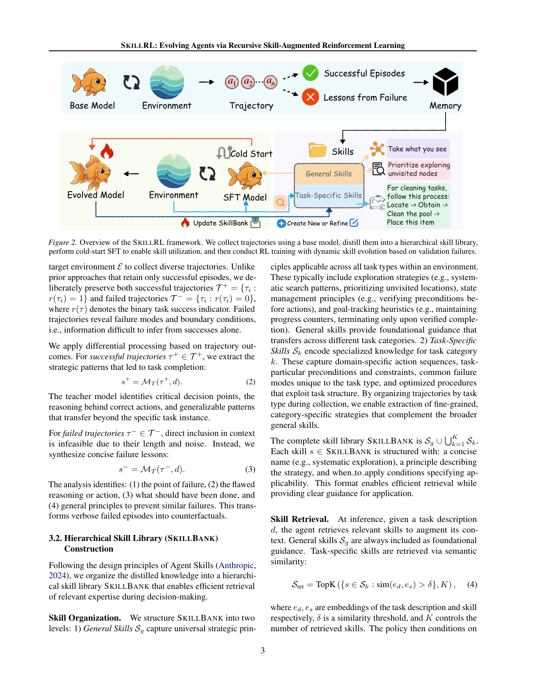
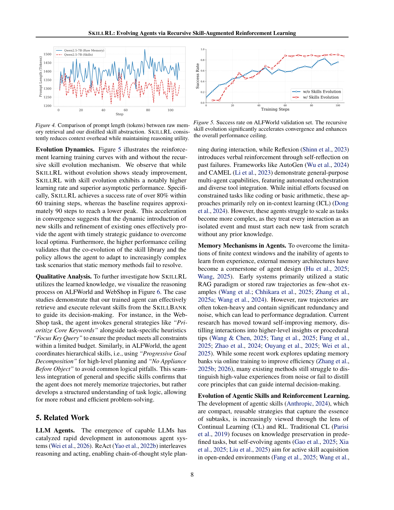

`skillrl_recursive | SKILLRL: Evolving Agents via Recursive Skill-Augmented Reinforcement Learning | UNC-Chapel Hill + UChicago/UCSD/NEC Labs/UC Berkeley/UCSC (Peng Xia, Huaxiu Yao 组) | 2026-02-09 v1 arXiv preprint (cs.LG) | L? 技能积累线（skill library + RL 共进化）·相关性 High`

══ 第一层：一眼看懂 [light] ══
- 🟦 **TL;DR**：智能体每次做任务都"从零开始"、记不住经验。SkillRL 让老师模型(o3)把成功/失败的轨迹**蒸馏成一条条紧凑"技能"**（成功→策略要点，失败→教训），存进分层 SkillBank（通用技能 + 任务专属技能）；先用 SFT 冷启动让小模型(Qwen2.5-7B)学会"读技能"，再用 GRPO 强化学习，**且在每个验证 epoch 用失败轨迹自动补充/精炼技能**——技能库和策略一起进化。结果在 ALFWorld/WebShop/7 个搜索 QA 上 SOTA，比 GRPO 高 12.3%。
- **最巧的一步**：**"递归技能进化"(recursive skill evolution)**——抽掉它（变成静态技能库）方法就退化成普通的"检索增强 RL"。因为静态库无法预知策略变强后会遇到的新失败模式；只有在训练中持续用失败轨迹补技能，库才能跟上策略、突破 local optima（消融：去掉动态进化掉 5.5%；但去掉冷启动 SFT 掉 20%、去掉技能库换原始轨迹掉 25% 才是最致命的几步）。

══ 第二层:为什么做(写透) ══
- **研究背景**:LLM agent 在 web 导航、deep research 等复杂任务上表现亮眼,但**每次任务执行基本是 episodic 孤立的**——不会从过去的成功/失败里学,这严重阻碍其进化。核心问题:agent 如何高效从经验学习并把知识迁移到别的任务?【原文 §1】
- **解决的具体痛点**:现有 memory-based 方法把**原始轨迹直接存进外部库**当未来参考,但原始轨迹**冗长、含大量冗余与噪声**,模型很难从中抽出关键信息;近期工作虽压缩轨迹+在线更新记忆库提升了效率,但**只是模仿过去解法,既不蒸馏核心原则,也不调整 agent 内部策略去利用记忆做决策**——卡在"信息密度 vs 噪声"的权衡上,甚至越用越差(Fig.1b)。【原文 §1】
- **相关工作 & 各自不足**:① prompt/memory 类(ReAct/Reflexion/Mem0/ExpeL/MemP)——纯 in-context,不更新参数,无法把冗长轨迹蒸成可操作知识、也不改策略;② 纯 RL(PPO/RLOO/GRPO)——能改策略但无经验复用机制、稀疏 reward 下收敛慢;③ memory-augmented RL(MemRL/EvolveR/Mem0+GRPO/SimpleMem+GRPO)——把记忆塞进 RL,但 **MemRL 只用 RL 更新记忆库、策略冻结,无法适配**;且这些都存原始/半压缩记忆,缺"抽象成技能"这一步。【原文 §1, §4.1】
- **动机链**:现状=agent 孤立执行、记忆方法只存原始轨迹 → 缺陷=原始轨迹噪声大、模型抽不出可复用模式、且策略不会用记忆 → 关键洞察:**有效的经验迁移需要"抽象"**——人类专家不背每个动作,而是发展出紧凑可复用的"技能"。所以必须 ①把成功/失败轨迹蒸成结构化技能(降噪+压缩)②冷启动 SFT 让模型学会"读技能"③RL 中让技能库随策略共进化(静态库预知不了策略变强后的新失败)。为什么不用更简单的静态技能库?因为策略一变强就会进入新状态、遇到旧库覆盖不到的失败,静态库跟不上(消融:去掉动态进化掉 5.5%)。【原文 §1, §3, §4.3】
- **与最近邻的 Δ**:相比 MemRL(同为 memory-augmented RL),关键差异=**SkillRL 让技能库与策略真正共进化(策略也走 GRPO 更新),而 MemRL 冻结策略只更新记忆**;相比 ExpeL/Mem0(存经验不改参数),差异=**SkillRL 把"抽象成技能"+"冷启动学会用技能"+"RL 联合优化"串成闭环**。这个差异有用,因为只有策略和库一起变,才能突破 local optima 并随任务复杂度上升保持鲁棒。【原文 §1, §4.2】

══ 第三层:怎么做 + 靠不靠谱 ══
- **方法流水线(Alg.1,输入 base 模型/teacher o3/环境 → 输出训好的 πθ + 进化后的 SkillBank)**:① **经验蒸馏**:base agent 在环境 rollout,**成功轨迹 T⁺ 存为策略示范 s⁺ = MT(τ⁺)**,**失败轨迹 T⁻ 合成简洁教训 s⁻ = MT(τ⁻)**(含失败点/错误推理/本应怎么做/防再犯原则,把冗长失败 episode 变成 counterfactual);② **建分层 SkillBank** = 通用技能 Sg(探索策略/前置条件校验/目标跟踪等普适原则)∪ 任务专属技能 Sk(领域动作序列/特有失败模式),每技能=name+principle+when-to-apply 三段式;③ **检索**:Sg 恒注入,Sk 按语义相似 TopK(δ=0.4 阈值,K=6)注入,**技能比原始轨迹压缩 10–20×**;④ **冷启动 SFT**:teacher 生成 N 条 skill-augmented reasoning trace 教模型"如何检索/解释/应用技能",得 πθsft 既是 RL 起点也是 KL 锚 πref;⑤ **递归技能进化 + GRPO**:每 validation epoch 监控各类成功率 Acc(C),只对 Acc(C)<δ 的低分类别触发——用 diversity-aware 分层采样取失败轨迹 → teacher 分析产新技能/精炼旧技能并入库;策略侧 GRPO 在 skill-augmented context 上更新、KL 锚 πref。形成"agent 变强→遇新挑战→扩库→再变强"的飞轮。【原文 §3.1-3.3, Alg.1】
- **逐组件必要性(均有消融,Table 3:SkillRL 89.9/72.7)**:① **分层结构**——去掉(只留任务专属)掉 13.1%(ALF)/11.3%(WebShop),证明通用原则是基础脚手架;② **技能库(换原始轨迹)**——降幅最大(**掉至 61.7/50.2,~-25%**),直接坐实"抽象优于记忆"的核心主张;③ **冷启动 SFT**——去掉掉 20%(至 65.2),证明模型需先学会"用技能"才能进 RL;④ **动态进化**——去掉掉 5.5%(至 84.4),证明库须是动态组件而非静态库。四个组件全有消融,无遗漏。【原文 §4.3, Table 3】
- **关键机制(直觉)**:KL 锚 πref=πθsft 的作用——RL 提升任务表现的同时**保住"会用技能"这个学到的能力**(forward 仍按技能注入决策,backward 用 KL 把更新拉回会用技能的 πsft 附近),这是 forward-hard/backward-soft 式的能力保持。失败差分蒸馏的作用——成功存"怎么做对"、失败存"counterfactual 怎么避错",二者信息互补(失败揭示从成功推不出的边界条件)。【原文 §3.1, §3.3】
- **实验与证据(支撑核心主张的关键数字)**:
  · ALFWorld 89.9% / WebShop succ 72.7%,**比 GRPO(同底层优化器)在 ALFWorld +12.3%(77.6→89.9)**——增益直接归因于技能增强而非算法方差;复杂子任务 Cool/Pick2 比 GRPO 高 23.0%/22.8%(稀疏 reward 下技能先验加速学习的强证据)。【Table 1】
  · 7 个 search-augmented QA:**平均 47.1,超最强基线 EvolveR(43.1)**;Bamboogle(out-of-domain)73.8 远超 EvolveR 54.4,说明蒸出的搜索策略 task-agnostic 可迁移。【Table 2】
  · 总体超强基线 15.3%(摘要)/12.3%(对 GRPO);收敛更快(Fig.5:带进化 60 步破 80%,不带要 ~90 步且峰值更低)。
- **baseline 公平性**:对比覆盖闭源 LLM(GPT-4o/Gemini-2.5-Pro)、prompt/memory(ReAct/Reflexion/Mem0/ExpeL/MemP/SimpleMem)、纯 RL(PPO/RLOO/GRPO)、memory-augmented RL(MemRL/EvolveR/Mem0+GRPO 等),且与 GRPO 同底层优化器对比隔离了算法方差,公平。**看着强但没回答核心问题**:无明显此类问题,消融把每个增量都拆清了。
- **假设与失效边界**:【推断】① **强依赖一个强 teacher(o3)**做蒸馏/SFT 数据/每 epoch 补技能——成本与质量上限都系于此(SkillGraph 续作明确点名此为局限);② **技能库只增不删**(无 deprecate/merge),长跑可能膨胀+噪声累积(SkillGraph 正是来补这个);③ 二元 reward + 短/中 horizon 的模拟环境(ALFWorld/WebShop/QA),向稀疏长程真实环境的迁移未验证。
- **祛魅总结**:真贡献(硬货)=**"抽象优于记忆"用消融硬证(换原始轨迹掉 25%)+ 失败差分蒸馏 + 冷启动 SFT 锚 πref + 验证失败驱动的按需扩库 + 策略-库共进化**这套完整闭环,且收敛加速与跨域迁移都有数据支撑。【推断】"recursive evolution"虽是命名卖点,但消融显示它只贡献 5.5%,真正致命的是技能库本身(-25%)和冷启动(-20%)——即"抽象+会用抽象"才是硬货,动态进化是锦上添花;且整套强依赖 o3,作者对"自蒸馏降 teacher 依赖"尚未解决。

══ 机制速览 6 轴 [light] ══
| 维度 | 内容 |
|---|---|
| **学什么信号** | 环境二元 reward（成功=1/失败=0）+ 老师模型对成功/失败轨迹的反思蒸馏（成功→策略 s⁺，失败→教训 s⁻） |
| **改什么** | ① 策略参数（GRPO 更新 πθ）② 外部技能库 SkillBank（prompt-level，检索注入）——二者共进化 |
| **何时改** | 策略：在线 per-step（GRPO）；技能库：离线批量（每个 validation epoch 触发，仅对 Acc(C)<δ 的低分类别补技能） |
| **免梯度?** | **混合**：参数走梯度(SFT+GRPO)；技能库的增/精炼免梯度（老师模型生成自然语言技能） |
| **记忆-技能生命周期** | 写入（蒸馏成 name/principle/when-to-apply 三段式）→检索（通用技能恒注入 + 任务专属按语义 TopK，δ=0.4,K=6）→进化（失败驱动新增/精炼，库从 55→100 技能）；**无显式遗忘/淘汰**（只增不删，区别于 SkillGraph） |
| **防遗忘机制** | KL 投影（GRPO 锚定 πref=SFT 模型，保住"会用技能"的能力）；技能抽象本身 10–20× 压缩降噪 |

🖼 **关键图 top-2** [light]：

图2（方法 pipeline 主图）：完整流水线——Base Model 在环境采轨迹→老师把成功存为示范、失败合成教训→构建分层 SkillBank（通用+任务专属）→冷启动 SFT 让模型会用技能→RL 训练中基于验证失败动态进化技能库。选它因为一张图说清了"经验→技能→冷启动→共进化"四段咬合，是全文骨架。

图5（核心发现/主结果，此页含 Fig4 prompt 长度 + Fig5 收敛曲线）：带递归技能进化 vs 不带——前者 60 步破 80%，后者要 ~90 步且峰值更低；同页 Fig4 显示技能抽象比原始记忆少 ~10.3% token。选它因为同时佐证了两大卖点：动态进化加速收敛 + 技能压缩省 context。

══ 假设与失效边界（一句）[推断] ══
【推断】强依赖一个强老师模型（o3）做蒸馏/补技能（成本与质量上限都系于此，作者亦在 SkillGraph 续作中点名此为局限）；技能库只增不删，长跑可能膨胀+噪声累积；二元 reward + 短/中 horizon 的模拟环境（ALFWorld/WebShop/QA），向稀疏长程真实环境的迁移未验证。

══ 对"探索-巩固"idea 对标（一句）[light] ══
**支撑 + 可借组件**：与 TSRD"探索-巩固"高度同构——"失败轨迹→教训→补技能"正是 path-recovery 的离线物化版；可借积木=【失败差分蒸馏(成功存策略/失败合成 counterfactual 教训)】+【cold-start SFT 锚定 πref 的 forward(技能注入)/backward(KL 保能力) 解耦】+【验证失败驱动的按需扩库 trigger】；与 SkillGraph 互为直系前作（同套基准/同班人马，SkillGraph 把这里的"扁平库"升级成依赖图）。

══ 结构化补充 ══
- ⑦ **开源代码 + 框架/harness**：有，https://github.com/aiming-lab/SkillRL（原文摘要+引言明确给出）。**框架未在正文标注**〔待核：需 clone 看是否 veRL/自研〕；RL=GRPO，base=Qwen2.5-7B-Instruct，teacher=OpenAI o3。
- 💰 资源/成本：原文未给 GPU 数/算力；关键成本在 o3 老师 API（蒸馏+SFT 数据+每 epoch 补技能）。context 比原始记忆 baseline 少 ~10.3%（~1300 vs ~1450 tokens）。
- 🔭 开放问题：作者强调"抽象优于记忆"为通用原则；【推断】下一步即 SkillGraph（关系结构化）+ 降低老师依赖（自蒸馏/critic 生成技能）。
