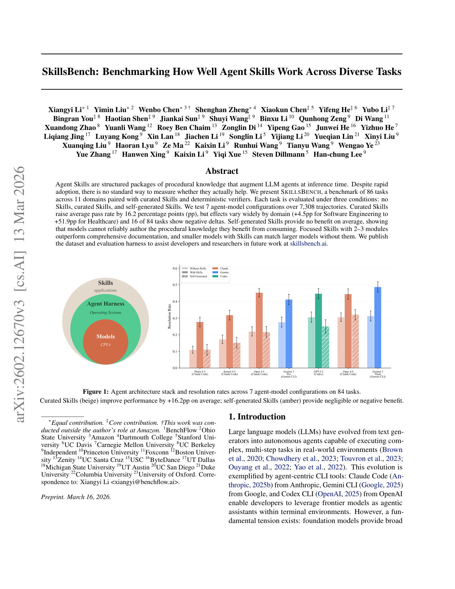
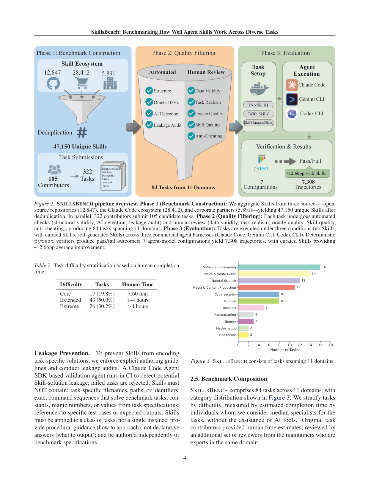

`skillsbench | SkillsBench: Benchmarking How Well Agent Skills Work Across Diverse Tasks | BenchFlow + 多校/独立众包(Xiangyi Li 等,通讯 benchflow.ai) | Preprint, arXiv 2602.12670v3, 2026-03-13 | 主题线 L?(Skill 评测基准 / 推理期技能增强)· 相关性 中-高(技能线的"度量真伪"基准)`

> light 档笔记。基于真实 PDF 正文。三标注:【原文】【推断】【待核】。

══ 第一层:一眼看懂 [light] ══
- 🟦 **TL;DR**:【原文】**Agent Skills**(结构化的程序性知识包:指令 + 代码模板 + 资源 + 校验逻辑,推理期增强 agent、不改模型)被业界快速采用,但**没有标准方法衡量它们到底有没有用**。本文提出 **SKILLSBENCH**:86 个任务(84 个参与评测)横跨 11 个领域,每个任务配 curated Skills + 确定性 pytest 验证器;每任务在三种条件下评测(无 Skills / curated Skills / 自生成 Skills),覆盖 7 个 agent-model 配置(Claude Code×4 Claude 模型、Gemini CLI×Gemini、Codex×GPT-5.2)、共 7,308 条轨迹。核心发现:① curated Skills 平均提升 pass rate **+16.2pp**,但**领域间方差极大**(软件工程 +4.5pp → 医疗 +51.9pp),且 **84 个里有 16 个出现负增益**;② **自生成 Skills 平均零收益**——说明模型**无法可靠地自行撰写它消费时能受益的那种程序性知识**(latent 知识 ≠ 能产出有用 Skill);③ **2–3 个聚焦模块的 Skill 优于"大而全"文档**;④ 小模型 + Skills 可追平不带 Skills 的大模型。
- **最巧的一步**:【推断,依据 §2.3 + Fig2 Phase2】"**防泄漏审计 + 确定性 oracle 验证**"——用 Claude Code SDK 验证 agent 在 CI 里查 Skill-solution 泄漏(禁止 Skill 含任务专属文件名/路径/精确命令),并要求 oracle 100% 可解、pytest 二值判定。抽掉这层,Skill 就可能直接编码答案,"+16.2pp"会被泄漏污染、整个基准失去可信度。

══ 第二层:为什么做 ══
- **研究背景**:【原文 §1】LLM 从文本生成器进化为能跑多步真实任务的 autonomous agent,典型载体是 agent-centric CLI(Claude Code / Gemini CLI / Codex CLI)。存在一个根本张力:基座模型给的是**广度能力**,但缺特定领域工作流所需的**程序性知识**;而微调既贵又损通用性。
- **解决的具体痛点**:【原文 §1】**Agent Skills**(结构化程序性知识包=指令 + 代码模板 + 资源 + 校验逻辑,推理期增强、不改模型)被业界快速采用,社区仓已有数千个用户贡献的 Skill,但**没有任何基准系统性衡量"Skill 到底有没有用、何时有用、哪部分内容驱动增益、什么设计原则区分好坏 Skill"**。核心痛点:整个生态在"裸眼相信 Skill 有用",缺因果度量。
- **相关工作 & 各自不足**:【原文 §1/§2】(a) options 框架(Sutton 1999 时序抽象)与认知架构(CoALA):给 Skill 提供理论根,但不评测;(b) Terminal-Bench:评测**裸模型 + harness 能力**,不隔离 Skill 的因果贡献;(c) 各家 Skill 仓/营销:声称有用但无对照实验、有泄漏风险。差距:无人在"严格隔离 + 确定性验证 + 防泄漏"下测 Skill 的净增量。
- **动机链**:【原文 §1】现状=Skill 大规模采用 → 缺陷=无标准度量、可能被泄漏污染、无法分辨内容贡献 → 所以必须造一个**配 curated Skill + 确定性 pytest 验证器 + 三条件(无/curated/自生成)对照**的基准。为什么不用更简单做法(直接看用户反馈/单测某个 Skill):无对照、无防泄漏、无法跨域比较,得不到"+X pp"这种因果量。
- **与最近邻的 Δ**:【推断,依据 §2】最近邻是 Terminal-Bench。关键 Δ=**把评测对象从"模型/harness 能力"换成"注入 Skill 这一干预的因果增量"**,并加入"**自生成 Skill**"条件来隔离模型 latent 知识。这差异有用,因为它能回答"模型能不能自己写出对自己有用的程序性知识"——这正是 agent 自进化乐观假设的命门。

══ 第三层:怎么做 + 靠不靠谱 ══
- **方法流水线**:【原文 §2 / Fig2 三阶段】**Phase1 构建**:从三源聚合 Skill(开源 12,847 + Claude Code 生态 28,412 + 企业 5,891,去重后 47,150 unique)+ 众包 105 任务;**Phase2 质量过滤**:自动检查(结构有效性 / AI 检测 / **泄漏审计**)+ 人工评审(数据真实性 / 任务真实性 / **oracle 100% 可解** / Skill 质量 / 反作弊)→ 筛到 84 评测任务(86 个里排除需 GPU 的 mhc-layer-impl 与验证器超时的 fix-visual-stability),覆盖 11 域;**Phase3 评测**:每任务在三条件(无 Skills / curated Skills / self-generated Skills)× 7 个 agent-model 配置(Claude Code×4 Claude、Gemini CLI×Gemini、Codex×GPT-5.2)下跑,容器隔离 + 5 次重复 + temperature 0 → **pytest 二值判定** → 共 7,308 条轨迹。
- **逐组件必要性**:① **泄漏审计 + oracle 验证**——抽掉则 Skill 可直接编码答案,+16.2pp 被污染(可信度命根,附录验证 5 runs 足够精度、结论不变);② **三条件对照**——没"无 Skills"基线就没法算净增量,没"自生成"条件就测不出"消费有用≠生产有用";③ **确定性 pytest + 容器隔离**——保证可复现(但作者承认容器给状态隔离≠完美确定性/免训练集泄漏,靠多次运行 + 配对对照缓解);④ **归一化增益 g + 绝对 Δ 双报**——因 g 有天花板混淆(90→95% 与 10→55% 同为 g=0.5),故两者都报。本文是基准论文,"消融"体现为对 Skill 内容(指令 vs 代码 vs 示例)与模块数的对照分析。
- **关键机制/直觉**:【原文 §3 Findings】核心不是公式而是受控对照的逻辑:把"同一任务、同一 harness、同一模型"下"有无 Skill"配对比较,差值即 Skill 因果贡献。"自生成"条件的直觉=让模型先自己写 Skill 再消费,若 latent 知识能转成有用程序性知识,自生成应≈curated;实测**自生成平均零/负收益**,说明"模型能用好别人写的程序性知识,却写不出对自己有用的那种"。
- **实验与证据**:【原文 摘要/Finding1-N】关键数字:curated Skills 平均 **+16.2pp**(7 配置 range +13.6~+23.3pp),但**领域方差极大**(软件工程 +4.5pp → 医疗 +51.9pp),**84 个里 16 个负增益**;**自生成 Skills 平均无收益**(amber 柱可忽略或负);**2–3 个聚焦模块 > 大而全文档**;小模型 + Skills 可追平不带 Skills 的大模型。难度按人类完成时间分层(Core <60min / Extended 1–4h / Extreme >4h)。证据强(7,308 轨迹、确定性验证、防泄漏);"看着强但需谨慎"处:+16.2pp 是**平均量**,域间方差大到不可外推到具体任务。
- **假设与失效边界**:【原文 §5.1 Limitations】① **覆盖/泛化**:聚焦 terminal-based 容器化任务,结论可能不迁移到 GUI agent / 多 agent 协调 / 极长程工作流;② **确定性/污染/生态效度**:容器只给状态隔离,不保证完美确定性或免训练集泄漏(靠多 run + 泄漏审计 + 配对缓解但不能根除);③ 仅覆盖前沿闭源模型 + 三家商用 CLI,对开源模型/自建 harness 未测;④ 归一化增益有天花板混淆。【推断】对"需跨 episode 学习/演化的 Skill"场景不适用(本文是静态注入评测)。
- **祛魅总结**:【推断】真贡献(硬货)=① 一个**防泄漏 + 确定性验证 + 三条件对照**的可信 Skill 基准(7,308 轨迹),把"Skill 有没有用"从信仰变成可量化结论;② 三条最有价值的发现:**+16.2pp 但域方差巨大 + 16/84 负增益**、**自生成 Skill 平均零收益**、**聚焦优于大而全**。最反直觉也最重要的硬货="**消费有用 ≠ 能生产有用**"。包装/边界:数字是平均量、强领域依赖、仅闭源 CLI;"小模型+Skill 追平大模型"是亮点但限于本基准任务。整体是一篇诚实、对自进化研究有警示价值的实证基准。

══ 机制速览 6 轴 [light] ══
| 维度 | 内容 |
|---|---|
| 学什么信号 | 【原文】本文是**基准/评测**,不训练模型;它度量的是"注入 Skill(程序性知识)对 agent 表现的因果增量"。自生成条件用来隔离模型 latent 领域知识。 |
| 改什么 | 【原文】被评测对象改的是 **prompt/上下文层**(Skill 作为 system-level context 前置注入,不改参数);harness 固定为商用 CLI。 |
| 何时改 | 【原文】test-time(推理期注入 Skill,无 episode 间学习)。 |
| 免梯度? | 【原文】是(Skill 增强纯推理期,零梯度)。 |
| 记忆-技能生命周期 | 【原文】技能=结构化包(Instruction.md/task.toml/Dockerfile/solve.sh/tests);来源聚合 47,150 unique(开源 12,847 + Claude Code 生态 28,412 + 企业 5,891,去重后);本文不研究写入/淘汰/共享的在线生命周期,而是评测"给定技能"的效果与"自生成技能"的失败。 |
| 防遗忘机制 | 【原文】不适用(无训练/无持续学习)。 |

⑦ **开源代码 + 框架/harness**:【原文】公开数据集与评测 harness 于 **skillsbench.ai**(摘要明示)。评测用的 harness=商用 **Claude Code / Gemini CLI / Codex CLI**(非训练框架);验证器=确定性 **pytest**;CI 泄漏检测基于 Claude Code Agent SDK。〔待核:具体 GitHub 仓未在已读页给出 URL,以 skillsbench.ai 为入口;按 B 层只记录。〕

💰 资源/成本与可扩展性:【原文】规模=7,308 有效轨迹、7 配置、84 任务、11 领域;难度分层按人类完成时间(Core <60min 17个 / Extended 1–4h 43个 / Extreme >4h 26个)。成本:文中含 API 定价表与每试均成本(Table 11–13,2026-02 价);所有模型 temperature 0 确定性采样。可扩展性=众包任务 + 自动+人工双重质量过滤管线。

🎯 **对"探索-巩固"idea 对标** [light]:【推断】**缺口证据 / 警示**——最重要的一条对标:"**自生成 Skills 平均零收益**,模型无法可靠撰写它能受益的程序性知识"。这对"agent 自进化=让模型自己产出可复用技能/经验"的乐观假设是一记警钟:**消费有用 ≠ 能生产有用**。对本项目"探索→巩固"而言,提示"巩固"环节若纯靠模型自蒸馏/自写技能,质量可能不达标,需要外部验证器或 teacher 把关(呼应本项目 teacher-scaffolded 思路)。同时其确定性验证器 + 防泄漏审计是可借的"巩固质量门"组件。

🖼 **关键图 top-2** [light]:

这是**原文 Figure 1**:既给出"模型/harness/Skills"三层类比,又把核心结论(curated +16.2pp、self-generated 拉胯)一图呈现——选它因为它就是论文的"一眼看懂"图,统摄全文主张。

这是**原文 Figure 2(pipeline overview)**:把"如何构造一个可信的 Skill 评测基准"讲清楚(尤其泄漏审计与 oracle 验证)——选它因为方法论的可信度全在这条管线里。

【假设与失效边界一句】[light]:【推断,依据 §3 + 领域方差结果】假设"Skill 价值可由确定性 pytest 任务通过率 + 商用 harness 上的注入实验测出";其结论高度**领域/任务依赖**(同一 Skill 在软件工程仅 +4.5pp、医疗 +51.9pp,16/84 为负),故"Skills 有用 +16.2pp"是平均量、不可外推到具体任务;且仅覆盖前沿闭源模型 + 三家商用 CLI,对开源模型/自建 harness、对需跨 episode 学习的 Skill 演化场景不适用。
