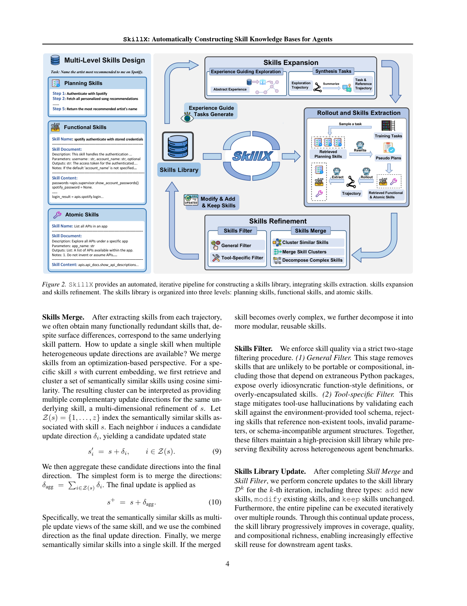
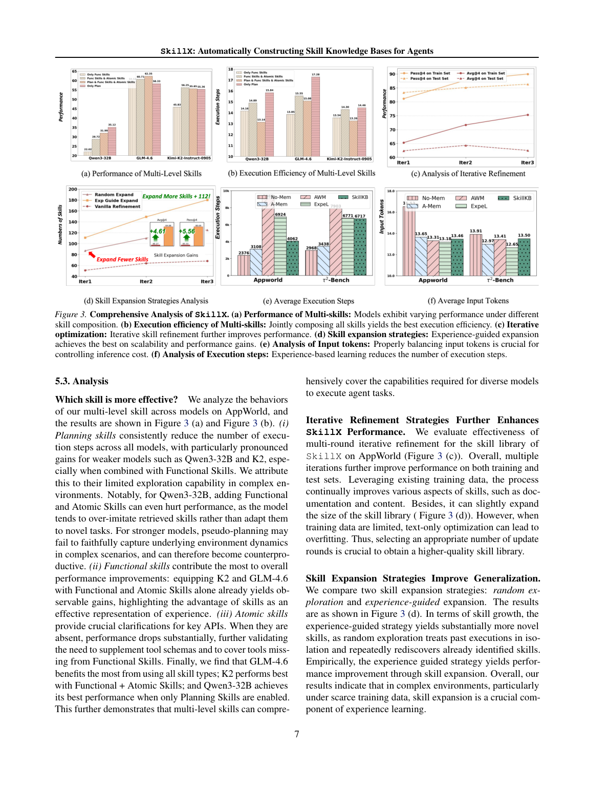

`skillx | SkillX: Automatically Constructing Skill Knowledge Bases for Agents | 浙大 zjunlp + 蚂蚁数科(Chenxi Wang, Zhuoyun Yu… Shumin Deng/Xiang Qi 通讯) | 2026-04(arXiv v2 2026-04-19)·Preprint(ICML 投稿格式)·v2 | 主题线 L3(技能知识库自动构建/技能自进化)·相关性 High`

> 一句定位:用一个**强 backbone agent(GLM-4.6)**离线把成功轨迹蒸馏成**三层技能库**(规划 plan / 功能 func / 原子 atomic),再经"迭代精炼(merge+filter)+ 探索式扩展(主动补盲补错)"把库做厚做好;构造好的库**即插即用**地塞进**更弱的 base agent**(Qwen3-32B 等)的 system prompt,**不训练任何模型**,就能让弱 agent 在 AppWorld/BFCL-v3/τ²-Bench 上**成功率涨~10pts、执行步数更省**。核心主张:跨 agent 可复用的经验,**最好的表示形态是"分层技能",而非整条轨迹/单一 insight/workflow**。

---

## ══ 第一层:一眼看懂 ══

- 🟦 **TL;DR**:现状痛点——自进化 agent 各自孤立学习、反复重新发现相似行为(冗余探索),且"自己探索自己反思"能挖到的经验**被自身能力上限卡死**(model capability bottleneck),换任务还泛化差。SkillX 的解法是一条**全自动离线流水线**:(1) **多层技能设计**——把轨迹拆成三层:`atomic`(对齐单个工具 t 的增强语义规格:用法/约束/常见失败模式,补 tool schema)、`func`(完成一个子任务的工具组合宏操作,字段 name/document/content)、`plan`(子任务的组织结构=排序/依赖/分支,指挥 func 怎么拼)。(2) **Rollout + 抽取**:GLM-4.6 在训练任务上 rollout 4 次,从成功轨迹里抽三层技能(抽 plan 时**显式滤掉探索/回溯/试错的非必要步骤**,只留干净高层步骤)。(3) **迭代精炼** ϕ:**Skills Merge**(把语义相似技能聚类,当成同一技能的"多个更新方向 δ",**求和聚合成单一更新方向**再合并;太复杂则再拆解)+ **两段 Filter**(General Filter 去不可移植/过度封装/依赖额外包的;Tool-specific Filter 拿环境真实 tool schema 校验,**杀掉引用不存在工具/非法参数的幻觉技能**)→ add/modify/keep 更新库。(4) **探索式扩展**:用 seed 经验**有针对性地**驱动 agent 去碰"高失败率工具 / 从没调过的工具",合成新任务再跑一遍抽取流水线,把技能空间扩到训练分布之外。用时:对新任务先检索 plan→自己改写一个**伪计划 pseudo-plan**(但**不注入最终 prompt**,只当检索中介,防投机内容污染行为)→按 pseudo-plan 每步检索 func+atomic→LLM 自筛→注入 system prompt 执行。

- **最巧的一步**:**"把经验组织成三层技能(尤其是 atomic 补 tool schema)+ Tool-specific Filter 用真实 schema 校验杀幻觉技能"**。抽掉分层→退回单一 workflow/轨迹表示,消融 Table 1(∗行)显示 SkillX 一致优于 AWM(workflow)/ExpeL(trajectory few-shot);抽掉 atomic→Fig.3(a) 显示"原子技能缺失时性能大幅下降"(它给关键 API 提供澄清);抽掉 Tool-specific Filter→技能库会混入引用幻觉工具的不可执行项。**为什么是它**:agent 任务的瓶颈常是"工具用错/调用序列错/缺前置检查",分层技能恰好分别治"怎么规划(plan)/怎么组合工具(func)/单工具怎么用对(atomic)",而 schema 校验保证注入的技能"真能执行"。

---

## ══ 第二层:为什么做 ══

- **研究背景**:LLM agent 在长程工具决策(API 调用/网页/科学发现/交互助手)上进步显著,但多数 agent **每个新任务几乎从零开始**(直接推理或少量 task-specific demo),贵、脆、与"智能系统应随时间积累复用经验"的理念相悖(Sutton "experience era")。
- **解决的具体痛点**(§1,三大结构性缺陷):① **Isolated Learning**:agent 反复执行同样任务、各自独立重抽相似经验 → 大量冗余;② **Weak Generalization**:复杂环境里高质量训练数据稀缺,挖到的经验**迁移差**;③ **Model Capability Bottleneck**:只靠 agent 自身探索+反思,能挖到的经验**被它当前能力前沿封顶**。引出核心问题:**什么形态的经验能跨不同能力的 agent、跨不同环境广泛复用?**
- **相关工作 & 各自不足**(§1+§7):现有经验表示有 ① **case-based**(存成功轨迹当 few-shot:ExpeL/AWM 前身)② **strategy-based**(对比成败蒸馏 insight/workflow:AWM/ReasoningBank)③ **skill-based**(轨迹切成模块化技能)。**三者没有一个同时满足"强迁移性 + 高效检索 + 可直接执行"**。受 Claude Skills 启发主张**技能是更合适的抽象**(封装可复用能力、直接支持执行),但先前 skill 设计多依赖**长上下文渐进式披露**(progressive disclosure),对推理和环境插桩要求高、鲁棒性差(Fig.1 对比:Claude Skills 需复杂沙箱+多轮交互;SkillX 是分层 itemized 表示,轻量检索一次性注入 system prompt,易跨模型迁移)。
- **动机链**:经验复用是出路 → 但自进化孤立学习+能力封顶+迁移差 → 需要找"可跨 agent/环境复用的经验形态" → 现有表示三缺一 → 选"技能"但要避开 progressive disclosure 的重 → **分层 itemized 技能 + 一次性注入**;数据稀缺 → 加**探索式扩展**突破 seed 分布;库质量要可持续提升 → 加**迭代精炼(merge+filter)**。为什么不用更简单法?纯轨迹 few-shot(ExpeL)迁移弱;单层 workflow(AWM)粒度单一覆盖不全;自探索受能力封顶 → 故用**强模型蒸馏 + 主动探索扩展**。
- **与最近邻的 Δ**:
  - vs **AWM**(workflow 复用):AWM 是**单一粒度 workflow**;SkillX 是**三层(plan/func/atomic)**,且 atomic 专补 tool schema 幻觉。消融证明分层一致胜 workflow。
  - vs **ExpeL**(轨迹 few-shot + insight):ExpeL 检索过去轨迹当 demo;SkillX 蒸馏成**结构化可执行技能**,更省 token 且可执行性经 schema 校验。
  - vs **Claude Skills**(progressive disclosure):同走"技能",但 SkillX 用 **itemized + 轻量检索 + 一次性注入**替代"长上下文渐进披露+复杂沙箱",**更易跨 base model 迁移**(Fig.1 即此对比)。
  - 关键差异=**"分层技能表示" + "全自动构建-精炼-扩展流水线" + "可直接发布复用的静态技能库"**(作者称是首个提供"可直接复用技能 KB + 自动构建流水线"的工作)。

---

## ══ 第三层:怎么做 + 靠不靠谱 ══

- **方法流水线**(§3-§4,Fig.2):
  1. **三层技能定义**(Eq.5):\(D = S_plan ⊕ S_func ⊕ S_atomic\)。atomic=单工具增强规格;func=子任务级工具组合宏(name/document/content 三字段);plan=子任务组织结构。
  2. **Rollout & 抽取**:GLM-4.6 每训练任务 rollout 4 次;抽 plan(压缩成有序高层步骤,**滤掉探索/回溯/试错**,长反馈做摘要)→用 plan 引导抽 func(每子任务一个)→抽 atomic(调用模式/典型参数/约束/常见失败,与 func 统一表示,作为 func 缺失时的低层补充)。
  3. **迭代库构造**(Eq.6-8):D⁽⁰⁾=∅;第 k 轮用当前库 D⁽ᵏ⁾ 增强的 agent rollout→抽候选技能批 S⁽ᵏ⁾→精炼算子 ϕ(merge+filter)→\(D⁽ᵏ⁺¹⁾=D⁽ᵏ⁾∪ϕ(S⁽ᵏ⁾)\);测试性能不再升则停(最大 3 轮)。
  4. **Skills Merge(优化视角,Eq.9-10)**:对技能 s,检索+聚类语义相似技能 Z(s),把每个邻居 i 当成一个**候选更新方向 δᵢ**(\(s'ᵢ=s+δᵢ\)),**聚合 δ_agg=Σδᵢ**,最终 \(s⁺=s+δ_agg\),合并为单一技能;过复杂再拆解。(直觉:相似技能=同一底层技能的多个互补"更新视图",合起来=多维精炼。)
  5. **Skills Filter(两段)**:General(去不可移植/过度封装/依赖额外 Python 包的)→ Tool-specific(拿环境 tool schema 校验,**拒引用不存在工具/非法参数/schema 不兼容**的)。
  6. **探索式扩展**(§3.4):用 seed rollout 经验(可靠用的工具/高失败工具/从没调的工具)**引导**探索→合成新任务 Q_syn→重跑抽取-精炼。比随机探索发现更多样技能。
  7. **用时**(§4):检索相似任务的 plan→LLM 改写 task-specific **pseudo-plan**(**不注入最终 prompt**,仅作检索中介,防幻觉)→每步检索 func+atomic 去重→LLM 自筛留可用集 Sq→注入 system prompt 执行。

- **逐组件必要性**(消融 Table 3 + Fig.3 + Table 1∗,**消融做得相当扎实**):
  - **多层技能 vs 其他表示**:Table 1 ∗行(抽取模型=执行模型时)SkillX 一致超 No-memory/A-Mem/AWM/ExpeL → 分层表示更优。Fig.3(a):**atomic 缺失性能大幅掉**;plan 对弱模型(Qwen3-32B/K2)降步数显著;func 贡献最大总体提升。不同模型最优组合不同(GLM-4.6 用全部最好;K2 用 func+atomic 最好;**Qwen3-32B 只开 plan 最好**——加 func/atomic 反而因"过度模仿检索到的技能、不会改编"而掉点)。
  - **迭代精炼**:Fig.3(c)+Table 3(Vanilla-Iter1/2/3):多轮在 AppWorld 训练+测试集都进一步提升,但**数据少时纯文本优化会过拟合**(Iter3 部分掉点),故轮数要选好。
  - **探索扩展**:Fig.3(d)+Table 3(Expand-Iter):experience-guided 比 random exploration 发现**多得多的新技能**(random 把过去执行孤立看待、反复重新发现已知技能),且带来性能提升。**诚实标注**:τ²-Bench **未做** iteration/expansion 消融(理由:其 tool schema 简单、训练集已覆盖多数模式,且"以 tool-schema 技能为中心的经验学习是否适合对话型 benchmark"本就存疑)。
  - **结论**:三组件都有消融,证据链完整且作者对边界很坦诚。

- **关键机制直觉**:把"经验"当成一座**分层工具说明书**——plan 是"先干啥后干啥"的攻略,func 是"完成某子任务的工具连招",atomic 是"这个工具的隐藏用法和坑";Merge 把"对同一招式的多份笔记"合成一份(每份笔记=一个改进方向,加起来=更全面的招式);Tool-specific Filter 是"对照官方 API 文档把瞎编的招式删掉"。强模型写攻略、弱模型照着打,所以弱模型涨得最多。

- **实验与证据**(§5-§6):
  - **数据集/设置**:**AppWorld**(90 训练 / Test-Normal 测试,数百 API)、**BFCL-v3**(base multi-turn,随机 50 训 / 150 测)、**τ²-Bench**(retail/airline/telecom 三子域,各有训练测试划分)。指标:AppWorld/BFCL 报 Avg@4 + Pass@4;τ²-Bench 报 Pass^1(跑 4 次)。**Base 模型**:Qwen3-32B、Kimi-K2-Instruct-0905、GLM-4.6(强 backbone)。**两种范式**:∗=抽取模型与执行模型一致(self-evolution);‡=GLM-4.6 抽取但弱模型执行(distillation)。Baseline:No-memory / A-Mem / AWM / ExpeL,统一只按初始 query 检索并插 system prompt(公平协议)。embedding=Qwen3-Embedding-8B,检索 cos 阈值 0.45;最大精炼 3 轮;探索每任务 1 rollout、温度 1.0。
  - **支撑核心主张的关键实验 + 数字**:① **主表 Table 1**——Qwen3-32B(‡蒸馏)在 BFCL Avg@4 53.67→**63.67**、AppWorld Pass@4 47.62→58.93、τ²-Retail 53.75→**66.87**,**多 benchmark ~10pts**;K2 在 AppWorld 明显涨(Avg 46.88→56.40)但 tool-call 密集的另两个涨幅小(推测 K2 更依赖原始 schema、没充分用额外上下文);GLM-4.6(∗)也小幅超 baseline。② **表示形态 > 蒸馏来源**(§5.2 + ‡行):把 GLM-4.6 抽的经验喂给 AWM/ExpeL 在弱模型上(‡)仍**落后 SkillX** → "从强模型蒸馏有效,但经验表示形态更关键,次优表示会阻碍迁移"。③ **扩能力边界**:弱模型(Qwen3-32B/K2)Pass@4 大涨(蒸强模型知识是扩能力边界最直接方式);强模型 GLM-4.6 Pass@4 几乎不涨(已具备稳健探索/规划/工具能力,headroom 小)——**诚实承认上限**。④ **跨更强 base**(Table 2):DeepSeek-V3.2、GPT-4.1 上 SkillX(无论自抽还是 GLM 抽)仍一致正增益(GPT-4.1 BFCL 49.66→**60.00**,GLM-extract)。⑤ **效率**(Fig.3 e/f):执行步数减少;虽非最少步/最少 token,但综合性能最好。
  - **baseline 公平性**:统一检索协议(只用初始 query + 插 system prompt)、统一 base 模型、A-Mem/AWM/ExpeL 都是代表性强基线 → **公平**。∗/‡ 两套设置分别对齐 self-evolution / distillation,设计严谨。
  - **"看着强但没答核心问题"风险**【推断】:τ²-Bench 上提升较小且未做组件消融,作者自己也质疑"tool-schema 技能是否适合对话型任务";K2 在两个 benchmark 几乎不涨,说明**收益强依赖 base 模型"愿不愿意/会不会用"注入的技能**,并非普适。Qwen3-32B "加 func/atomic 反掉点(过度模仿)" 也提示**弱模型有过拟合检索技能的风险**。依据:§5.2-§5.3 + §6.2。

- **假设与失效边界**:
  - 【原文·Limitations】① **跨环境迁移有限**:技能绑特定 tool schema,跨差异大的领域/工具生态直接复用不直接;② **用户交互/纯对话(无 function call)场景非本文重点**,tool-schema 技能未必适用。
  - 【原文】数据少时纯文本迭代优化会**过拟合**(轮数要调);强模型 headroom 小。
  - 【推断】重度依赖**强 backbone(GLM-4.6)做蒸馏源** + base 模型有"采纳并改编技能"的能力(Qwen3-32B 过度模仿、K2 不用额外上下文都暴露这点);Merge 的 δ 加法聚合是**启发式**(把文本技能当向量加法只是隐喻,实际是 LLM 文本合并),其"多方向聚合最优性"无理论保证。依据:§3.3 Eq.9-10 实为文本 merge + Fig.3(a) 模型差异。
  - 【推断】"静态预构建库"范式**缺在线持续更新**(作者把 dynamic updating 列为相关但本文聚焦 static KB),部署后遇到分布外新工具仍需重跑离线流水线。依据:§7 把 static/dynamic 分开,本文做 static。

- **祛魅总结**:
  - 真贡献(硬货):① **"分层技能(plan/func/atomic)是更优的可迁移经验表示"这一主张被扎实的消融与跨模型实验支撑**(∗/‡ 双设置 + atomic 消融 + 多 base 模型),不是空谈;② **atomic skill 补 tool schema + Tool-specific Filter 用真实 schema 杀幻觉技能**是治"工具调用幻觉"的实用机制;③ **Skills Merge 的"多更新方向聚合"视角**把"技能合并"框成优化问题,概念上漂亮且可迁移;④ **发布可直接复用的预构建技能库(skillx_db)+ 全自动流水线**,工程价值实在(声称首个);⑤ 对边界**异常坦诚**(强模型 headroom 小、对话场景存疑、τ²未消融、弱模型会过拟合)。
  - 包装/营销成分【推断】:(a) abstract 强调的 "~10%" 主要来自 **Qwen3-32B 这个弱模型**,K2/强模型增益小得多,"普适提升"被略微放大;(b) "self-evolving" 标签下其实**不训练任何模型**(纯离线 prompt 流水线 + 静态库),"evolution" 指库的迭代精炼而非模型演进;(c) Eq.9-10 的"梯度下降式 δ 聚合"是**隐喻包装**(实为 LLM 文本合并,无真实梯度)。依据:Table 1 各模型增益差异 + 全流程无参数更新 + §3.3 merge 实现。**定位:扎实的"经验表示 + 自动技能库构建"方法论文,主张明确、消融充分、边界坦诚,营销成分轻。**

---

## ══ 结构化抽取 ══

- 🎯 **机制速览 6 轴**:

| 学什么信号 | 改什么 | 何时改 | 免梯度? | 记忆-技能生命周期 | 防遗忘机制 |
|---|---|---|---|---|---|
| **环境执行反馈**(成功轨迹=正信号、工具失败/未用=扩展靶向;task success R∈{0,1});**强模型蒸馏的经验**(GLM-4.6 抽取);**无 RL reward 回传、无人工标注** | **改技能库 D(plan/func/atomic 文本技能)**;**base agent 与 backbone 模型参数完全不改**(训练-free);运行期改的是注入 system prompt 的技能集 | **离线批量构建**(rollout→抽取→精炼最多 3 轮→扩展,部署前一次性);**用时在线 per-task 检索注入**(test-time);**无在线 per-step/per-episode 更新** | **是(全免梯度)**——全流程 prompt 驱动 + embedding 检索 + 文本 merge/filter;无任何参数优化 | 写入=从成功轨迹抽三层技能;**检索**=Qwen3-Embedding-8B 语义检索(cos≥0.45)+ pseudo-plan 改写做中介 + LLM 自筛;**淘汰/精炼**=Merge(语义聚类+δ聚合合并)+ 两段 Filter(General+Tool-schema 杀幻觉)+ add/modify/keep;**扩展**=experience-guided exploration 补盲;**共享**=plug-and-play 库**跨 agent/跨 base model 迁移**(发布 skillx_db) | **静态库 + 严格 Filter + 测试性能早停**:Tool-specific Filter 保证只留"真能执行"的技能(防错误知识累积);迭代到测试性能不升即停(防过拟合退化);base 模型冻结天然不遗忘。**无几何共识/merging-into-weights/KL**(不碰参数) |

- ⑦ **开源代码 + 框架/harness**:**已开源且代码现已可用**(论文写"coming soon",实际仓库已放出)https://github.com/zjunlp/SkillX(已 clone 成功,**完整克隆,体积小**)。**框架 = 无 RL/训练框架(无 veRL/TRL/OpenRLHF…),纯自研流水线 + LangChain-OpenAI 作 LLM 后端**——已核实仓库:`llm/client.py` 用 \(langchain_openai.ChatOpenAI\)(API 调用);目录 `extraction/`(技能抽取)、`clustering/`+`filtering/`(对应 Merge/Filter 精炼)、`expansion/`(探索扩展)、`inference/`(retriever.py + embedding_service.py + plan_rewriter.py + skill_selector.py,对应 pseudo-plan 改写 + 分层检索 + 自筛)、`prompts/`、`pipeline.py`(主流程)、**`skillx_db/appworld/`(发布的预构建技能库)**、`core/`(skill_schema.py 三层技能数据结构)、`inference/benchmarks/`(AppWorld 等评测接入)。embedding=Qwen3-Embedding-8B。【原文 §4-§5 + 仓库源码实测确认】
- 💰 **资源/成本与可扩展性**:**无训练成本**(训练-free)。**构建成本**=GLM-4.6 每训练任务 rollout 4 次 + 抽取/精炼(≤3 轮)/扩展(每任务 1 探索 rollout)的 API 调用,部署前一次性可摊销。**推理成本**=每任务检索 + pseudo-plan 改写 + 执行的 LLM 调用;Fig.3(e/f)显示**比无记忆减少执行步数**,但"非最少步/最少 token"(注入技能增加输入 token,需平衡)。**正文未给具体美元/GPU 数字**(API 模式)。可扩展卖点:库一次构建、跨多 base 模型复用、plug-and-play 注入 system prompt。【原文 §5.1 + Fig.3;具体成本数"原文未说明"】
- 🎯 **对"探索-巩固(TSRD/MTP+OPD)"idea 对标**:**强支撑 + 可借组件 + 互补缺口**。强支撑:① **"抽 plan 时显式滤掉探索/回溯/试错步骤,只留干净高层步骤"** 与你 TSRD 的"path-selection(选对路径)"高度同构——它从成功轨迹里把"正确主干"与"试错枝节"分离,正是你"巩固阶段只内化正确路径"的现成数据处理范式;② **atomic skill 补 tool schema + Tool-specific Filter 杀幻觉** = 一套"防止把错误/不可执行知识巩固进库"的质量闸,可迁到 TSRD 的 recovery 技能质检;③ **Skills Merge 的"多更新方向 δ 聚合"** 概念上与你关心的"多路径/多教师信号聚合成单一更新"呼应(虽它是文本启发式,但视角可借);④ **强模型蒸馏→弱模型即插即用** 验证了"教师把结构化能力外化、学生低成本吸收"的可行性,是 OPD 思路的 prompt 层近邻证据。可借组件:三层技能 schema、pseudo-plan 检索中介(不注入防污染)、experience-guided exploration 补盲。竞品/缺口面(对你最关键):SkillX **(a) 训练-free、不碰参数**——经验只进 prompt 不进权重,**学生能力本身不演进**(强模型 headroom 小、弱模型会过拟合检索技能,正暴露"外挂技能"的天花板);**(b) 静态库、无在线持续更新**;**(c) 无 MTP 式前瞻探测**。你的 **MTP-foresight + OPD 参数蒸馏**恰好补"把正确路径/恢复策略内化进权重(突破外挂上限)+ 前瞻探测关键步",且 SkillX 可作为你的**强 prompt-层 baseline/上界对照**(证明"参数蒸馏 > 技能注入"才有说服力)。
- 🔭 **开放问题/未来方向**:
  - 【原文】① 跨环境/跨工具生态迁移(技能绑 schema 的解绑);② 用户交互/纯对话(无 function call)场景的经验表示是否仍以 tool-schema 技能为中心(存疑,留作 open question);③ static KB 与 dynamic updating 的结合(本文聚焦 static)。
  - 【推断】(a) 弱模型"过度模仿检索技能、不会改编"→ 需要"技能改编/泛化"机制而非照搬;(b) Merge 的 δ 聚合从文本启发式升级为有理论依据的真实优化;(c) 数据稀缺下纯文本迭代过拟合 → 需更强的扩展/正则;(d) 把"外挂技能库"与"参数内化"结合突破能力封顶。依据:Fig.3(a) Qwen 过拟合、§3.3 merge 启发式、§6.2 过拟合、§1 capability bottleneck。

- 🖼 **关键图 top-2**:

  
  这是**原文 Figure 2**(方法主图,p4)。完整呈现四大块:**Multi-Level Skills Design**(Planning/Functional/Atomic 三层 + Spotify 任务的真实技能卡示例)、**Rollout and Skills Extraction**(采样任务→rollout→抽取→改写)、**Skills Refinement**(Skills Filter:General+Tool-Specific;Skills Merge:聚类相似→合并簇→拆解复杂)、**Skills Expansion**(experience-guided exploration→合成任务→抽象经验)。选它因为一张图说清 SkillX 的全部机制咬合(三层表示 + 构建-精炼-扩展闭环 + add/modify/keep 更新),是理解本方法的唯一必读图。

  
  这是**原文 Figure 3**(核心发现图,p7),六个子图:(a) 不同技能组合的性能(模型间差异大,atomic 缺失大掉)、(b) 联合所有技能执行效率最好、(c) 迭代精炼进一步提升、(d) experience-guided 扩展在可扩展性与性能上胜随机探索、(e) 输入 token 需平衡控成本、(f) 经验学习减少执行步数。选它因为它把本文最关键的**逐组件证据 + 模型异质性 + 效率收益**一图打包,是支撑"分层技能优于其他表示 + 精炼/扩展各有增益 + 弱模型受益最大"这些核心主张的实证主图,也直观暴露 K2/Qwen 的差异与过拟合边界。
