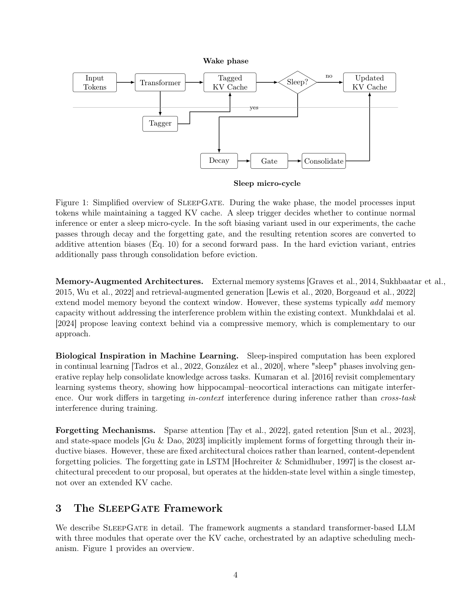
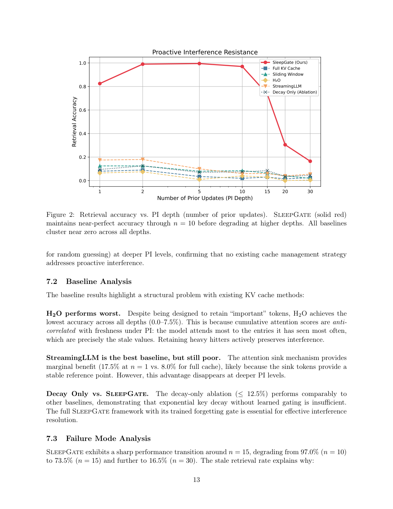

`sleepgate | Learning to Forget: Sleep-Inspired Memory Consolidation for Resolving Proactive Interference in Large Language Models | Kennesaw State University（Ying Xie，单作者） | 2026-03 arXiv:2603.14517v1（15 Mar 2026）· 预印本/proof-of-concept | L?·KV-cache 主动遗忘/巩固·中相关（机制借鉴价值高，实证强度弱）`

> 三标注约定:【原文】=论文直述;【推断】=有据判断(附依据);【待核】=拿不准的关键事实。

══ 第一层:一眼看懂 ══

- 🟦 **TL;DR**:LLM 在长上下文里有个"前摄干扰"(proactive interference, PI)毛病——同一个 key 被反复改写(给变量 x 赋值 5 次),你问它最新值,它经常吐出**被覆盖的旧值**;且 PI 越深(改写次数越多),准确率随 log(n) 线性掉向随机水平,prompt 提示"忽略旧值"几乎没用——这是注意力机制的结构性瓶颈(所有 KV 项平等参与 softmax,没有抑制旧项的开关)。本文从**生物睡眠**(突触缩放/选择性重放/主动遗忘)取灵感,提出 **SleepGate**:给 transformer 的 KV cache 加一个"睡眠微周期"——清醒时正常推理并给每个 cache 项打标签(时间戳/语义签名/被覆盖标志/累计注意力);周期性"入睡"时跑三个轻量模块:①key 衰减(老 key 按 age 缩放)②**遗忘门**(一个 <0.01% 参数的 2 层 MLP 给每项打保留分,决定 keep/compress/evict)③巩固(把要压缩的相似项聚成一个紧凑摘要项,且偏向保留最近值)。实验里用的是"软偏置"变体:不真删,而是把保留分转成注意力的**加性 pre-softmax 偏置** \(b_i=\beta\log r_i\),旧项被指数级压低权重。【原文 摘要+§3】

- **最巧的一步**:把"硬删除(keep/compress/evict)"换成 **soft attention biasing**(Eq. 10)——用保留分的对数当注意力偏置。抽掉这一步,方法要么退化成需要 Gumbel-softmax 松弛+阈值校准的离散删除(训练难、易误删不可逆),要么退化成 decay-only 消融(实测 ≤12.5%,和其它基线一样烂)。软偏置同时解决三件事:①全程可微、免 Gumbel 松弛;②免单独的阈值校准阶段(self-calibrating);③误判可恢复(只降权不删除)。它是"能端到端训出有效遗忘门"的关键载体。【原文 §3.3, §8.1, §9】

══ 第二层:为什么做 ══

- **研究背景**:扩展 LLM 记忆的主流路线是**把上下文窗口越做越大**(隐含假设:能 attend 到更多 token = 能用更多信息)。但 lost-in-the-middle、RULER/LongBench 等一连串证据表明:窗口变长≠下游性能成比例提升,模型在信息明明可见时仍会检索失败。【原文 §1, §2】

- **解决的具体痛点**:Wang & Sun [2025] 用 PI-LLM 范式把这个失败精确刻画为"前摄干扰"——给同一 key 喂 n 个递增更新 \((k,v_1),...,(k,v_n)\) 再问 $v_n$,即使答案紧贴 query,准确率仍随 log(n) 掉向 0,且错误**系统性地是旧值**(不是随机)。这是一个**与上下文长度无关的工作记忆瓶颈**:模型看得见相关 token,难在**抑制不相关的**;标准注意力里每个 KV 项都平等进 softmax,没有"选择性抑制"的杠杆;stale 项靠数量碾压淹没信号。prompt 干预只有边际缓解。【原文 §1, §2】

- **相关工作 & 各自不足**:
  - *KV cache 优化线*(滑窗 Longformer、稀疏注意力、H2O 重击者、StreamingLLM 注意力汇)——**为效率(省显存)设计,不为干扰消解**;尤其 H2O 保留"累计注意力高"的项,而 PI 下高注意力恰恰=被反复看的旧值,**保留重击者=主动保存干扰**(实测 H2O 最差)。【原文 §2, §7.2】
  - *外部记忆/RAG/Infini-attention*——加容量但不解决"已在上下文内的干扰"(Infini-attention 与本文互补)。【原文 §2】
  - *隐式遗忘架构*(稀疏注意力、门控保留 RetNet、SSM/Mamba、LSTM 遗忘门)——都是**固定的归纳偏置,不是学习的、内容相关的遗忘策略**;LSTM 遗忘门最近,但作用在单时间步的 hidden state,不是跨整个 KV cache。【原文 §2】
  - *ML 里的睡眠灵感*(continual learning 的生成重放)——针对**跨任务/训练期**干扰;本文针对**推理期上下文内**干扰,时间尺度不同。【原文 §2, §8.4】

- **动机链**:增大窗口救不了 PI(结构瓶颈)→ prompt 也救不了(注意力没有抑制杠杆)→ 现有 cache 方法为效率而非抗干扰设计、甚至保留重击者加剧干扰 → 所以需要一个**架构级、学习的、内容相关的"主动遗忘 + 巩固"机制**;生物睡眠正好提供了"突触缩放/选择性重放/主动遗忘"三件套的现成蓝图 → 落成 SleepGate 的三模块 + 软注意力偏置(可微可恢复)。【原文 §1–§3】

- **与最近邻 H2O/StreamingLLM 的 Δ**:最像的是 H2O(都按"分数"留项)。**关键差异**:H2O 的分=累计注意力(越被看越留),SleepGate 的分=**学习的、冲突感知的保留分**(被新项语义覆盖→低保留分→压低)。为什么有用——PI 下"被看得多"与"是否过时"**反相关**,H2O 的启发式正好选错;SleepGate 的门由语义签名+被覆盖标志驱动,学的是"谁被取代了"。实测同一深度 H2O 0–7.5% vs SleepGate 99.5%(n=5)。【原文 §7.2】

══ 第三层:怎么做 + 靠不靠谱 ══

- **方法流水线(清醒→入睡闭环)**:
  1. **清醒阶段**:正常 transformer 前向;每生成一个 token,**Module 1 冲突感知时间标签器**给它算语义签名 $s_i$(key 的轻量投影 + 局部池化,LSH 做 O(1) 摊销冲突检测),并把"被后续高相似项覆盖"的旧项打 \(\sigma_i=1\);cache 扩成增广形式 \((k,v,\tau,s,\sigma,a)\)。【原文 §3.2】
  2. **睡眠触发**:自适应调度——当①平均注意力熵 $H_t$ 超过 \(\bar H+\kappa\,\mathrm{std}(H)\)(PI 累积时注意力变均匀="不知道看哪")**或** ②被覆盖项占比 \(\rho_t>\rho_{max}\) **或** ③每 \(N_{max}\) token 兜底——就入睡。【原文 §3.5, Eq. 16】
  3. **睡眠微周期**(Algorithm 1):**Phase1 key 衰减**(按 age 对数缩放,对应突触缩放)→ **Phase2 遗忘门** \(r_i=G_\theta(f_i)\) 给每项打保留分(2 层 MLP,特征含 k/v/位置/签名/覆盖标志/累计注意力/全局摘要)→ **软偏置变体**(实验用):把 $r_i$ 转成加性注意力偏置 \(b_i=\beta\log r_i\) 重跑一次注意力,旧项被指数压低;**硬删变体**:Compress 项经 **Module 3 巩固**(按签名贪心聚类→用偏向最近值的学习 query 把一簇压成单个 $k^*,v^*$,压缩比 \(|S_m|:1\))→ Evict 项删除。【原文 §3.2–§3.4, Alg.1】
  4. **双相训练目标**(Eq. 17):\(L=L_{wake}+\lambda_s L_{sleep}+\lambda_c L_{compress}+\lambda_g L_{align}\)——每个前向同时算**无偏置 logits(wake LM 损失)**和**软偏置 logits(sleep 检索损失,只在当前非过时关联上算)**;compress 损失=平均保留分(压低 cache 占用);align 损失=BCE 让门的保留分对齐标签器的 \(\sigma\) 信号。课程训练:Stage0 warm-start(22%)→Stage1 门单独预训(11%,用 ground-truth 覆盖标签)→Stage2 联合训练 + PI 深度课程(67%,n 从 ≤5 渐增到 30)。【原文 §4, §4.2】

- **逐组件必要性**:
  - *学习的遗忘门(vs 纯衰减)*:**Decay-Only 消融**≤12.5%(和其它基线同档),SleepGate 99.5%(n=5)。✔有消融,证明"学习门"是核心。【原文 §7.2, Table 2】
  - *软偏置(vs 硬删)*:全程用软偏置,作者论证它免 Gumbel/免阈值校准/可恢复(§8.1)。但**未做"软偏置 vs 硬删"的并列定量消融**——硬删变体只在 Alg.1 描述、没跑数。属未充分证明项。【推断:依据=§6.3 明说实验只用软偏置,Table 2 无硬删行】
  - *巩固模块*:在软偏置实验路径里**根本没被激活**(软偏置变体不走 consolidation,见 Fig.1 caption + Alg.1 分支)。所以 Table 2 的强结果**不依赖巩固**;巩固的价值(压缩比)只有 §5.3 的理论 Proposition,无实验。属未证明项。【推断:依据=Fig.1 caption"In the soft biasing variant... a second forward pass. In the hard eviction variant, entries additionally pass through consolidation"】
  - *自适应触发(熵/冲突)*:训练循环里用了 trigger(Alg.2),但**无"自适应 vs 固定周期"的消融**。属未证明项。【推断】
  - *语义签名容量*:§7.3 失败分析反向证明其必要——$d_s=64$ 在 n≥15 时不够区分 30 个近同项,stale 率飙到 62%。算"反向证据"。【原文 §7.3】

- **关键机制直觉**:核心不是 \(G_\theta\) 本身,而是 **softmax 竞争里缺一个"抑制阀"**这一诊断。标准注意力 \(\propto\exp(q^\top k)\),n 个同 key 项权重近均匀→\(p(\text{retrieve } v_n)\approx 1/n\)→\(\log p\approx-\log n\),正好解释 log-linear 衰减(§5.1)。软偏置 \(b_i=\beta\log r_i\) 等于在指数里塞了一个**学习的乘性 gate**:\(\exp(q^\top k+\beta\log r_i)=\exp(q^\top k)\cdot r_i^\beta\),把"该不该看"从 0/1 硬开关松弛成连续可微的 \(r_i^\beta\) 权重——\(\beta=5,r_i=0.01\) 时偏置 ≈−23,几乎清零。理论(Thm.1)说:若门以概率 $p_c$ 正确识别旧项、每 N token 睡一次,则 n 次更新后存活的旧项数 \(\le O(\max(N,\epsilon n))\),\(p_c\to1\) 时是 O(N) 常数→消除 log-linear 衰减(把干扰 horizon 从 O(n) 压到 O(log n))。【原文 §5】

- **实验与证据**:
  - 设置:**从头训练**一个 4 层、\(d_{model}=128\)、4 头、**仅 793K 参数**(总含 sleep 模块 917K,overhead 15.6%)的玩具 transformer;合成 PI-LLM 基准:100 实体词表、500 值,7 个 PI 深度 \(n\in\{1,2,5,10,15,20,30\}\),每深度 200 episode;所有方法同 45 epoch 预算。指标:精确匹配检索准确率↑、stale 检索率↓、PI 斜率(0=完美抗干扰)。【原文 §6】
  - **支撑核心主张的关键实验**(Table 2 / Fig.2):SleepGate 在 n=2/5/10 达 **99.0/99.5/97.0%**,而**全部 5 个基线在所有深度 <18%**(StreamingLLM 最好 17.5%@n=1,H2O 最差 0–7.5%)。n=5 时 SleepGate 99.5% vs 最佳基线 10% = 10×。【原文 §7.1】
  - **最有说服力但也最该警惕的一张**:Figure 2 的曲线——SleepGate 红线在 n≤10 贴顶、所有基线贴底。它确实压倒性,但**所有基线低到离谱(全 KV cache 在 n=1 才 8%、随机=0.2%)**,这暗示**对照组本身在这个 793K 玩具模型上几乎不会做检索任务**,把差距放得失真。【推断:依据=Table 2 全 KV n=1 仅 8%,远低于真实 LLM 在 n=1 应近满分】
  - **失败模式(作者诚实给出)**:n≥15 出现悬崖——97%(n=10)→73.5%(n=15)→16.5%(n=30),stale 率 23.5%→62%。两因:①软偏置饱和(29 个旧项的残余注意力质量累加压过单个正确项);②语义签名容量 $d_s=64$ 不够区分 30 个近同项。【原文 §7.3, §8.5】
  - *baseline 公平性*:同模型规模、同 45 epoch、同合成数据,cache 策略是唯一变量,设置上公平;但**所有方法都在玩具规模从头训**,不能外推到预训练大模型。【推断:依据=§6.1, §8.5 自述】
  - *"看着强但没回答核心"的隐患*:核心主张是"架构级解 PI",但证据全在 793K 合成玩具上;**没有任何真实 LLM(Llama/Mistral)实验、没有自然语言 PI(文档纠正)、没有 RULER/LongBench**。作者自己把这些列为 future work。所以"99.5%"是 proof-of-concept 数字,不是可部署结论。【原文 §8.5, §9.1】

- **假设与失效边界**:
  - 【原文】Thm.1 假设遗忘门以 \(p_c\ge1-\epsilon\) 高概率正确识别旧项、且 N 适中——$p_c$ 低或近同项太多时(n≥15)假设破,实证悬崖。
  - 【原文】proof-of-concept 限定在 793K 玩具 + 合成数据;**能否迁移到预训练大模型、自然 PI 未验证**。
  - 【原文】巩固模块需正确兼容 GQA / PagedAttention / 量化 KV——预期兼容但未实证。
  - 【推断】软偏置只降权不删,cache **物理上仍在增长**(软变体不走 eviction);§5.3 的有界 cache 是硬删变体的理论,软变体长跑显存不省。依据=Fig.1 caption 软变体只重跑注意力、不删项。
  - 【推断】语义签名靠 key 投影+局部池化,**强依赖"同实体的 key 相似、跨实体的 key 可分"**;真实文本里 key 表征更纠缠,$d_s=64$ 的失败会更早。依据=§7.3 失败归因到签名容量。

- **祛魅总结**:
  - **真贡献(硬货)**:(a)**清晰的机制诊断**——把 PI 的 1/n 衰减归到"softmax 缺抑制阀",并给出 \(b_i=\beta\log r_i\) 这个**优雅、可微、可恢复**的注入点(=\(\exp\) 里乘性 gate),这个 trick 本身可迁移;(b)生物睡眠→三模块的映射(Table 4)讲得自洽;(c)失败模式分析诚实(主动给出 n≥15 悬崖 + 两条机理)。
  - **包装/严重高估**:(a)"architecture-level solution"措辞强,但**全部证据是 793K 合成玩具**,无真实模型,标题/摘要的"99.5%"极易被误读为已解决 PI——实为 proof-of-concept;(b)三模块只有**遗忘门+软偏置**真被实验激活,**巩固模块和硬删变体在主实验里没跑**,但贡献列表(§3 三模块)写得像都验证过;(c)Thm.1/Prop.1 是温和假设下的 sketch,非严格;(d)致谢明说"Claude.ai 协助润色",单作者预印本,**无开源代码、无 GitHub 链接**,工程可复现性存疑。【推断:依据=§6.3, §7, §9.1, Fig.1 caption】
  - **可能低估**:软偏置 trick 在**真实大模型上做 post-hoc 微调**(作者列为 future#1)可能才是它真正有价值的落点,但本文没碰。【推断】

══ 结构化抽取 ══

- 🎯 **机制速览 6 轴**:

| 学什么信号 | 改什么 | 何时改 | 免梯度? | 记忆-技能生命周期 | 防遗忘机制 |
|---|---|---|---|---|---|
| 环境/任务信号(检索是否命中最新值=sleep 损失;标签器的"被覆盖"标志 σ 提供监督) | **KV cache 的注意力权重/cache 内容**(软变体:加性注意力偏置 \(b_i=\beta\log r_i\) 压低旧项;硬变体:evict/compress 项;**门网络参数 \(G_\theta\) 经训练改**——base 模型权重在 Stage2 也参与反传) | **在线 per-step / 周期性**(推理中由熵/冲突/兜底周期触发"睡眠微周期",非每 token) | **混合**:门的*运行*免梯度(推理时只前向打分+加偏置);但门/标签器/base 是**训练阶段用梯度学出来的**(双相目标 Eq.17),不是纯 test-time 自适应 | 写入(每 token 进增广 cache)→检索(注意力)→**主动遗忘/巩固**(睡眠周期 evict/compress)→未涉及跨 agent 共享 | **本文的目标本身就是"主动遗忘以抗 PI"**;机制=学习的遗忘门 + key 衰减 + 巩固(把旧项压成保留最近值的摘要);**注意:这是"主动遗忘旧信息"而非"防止遗忘旧能力"**,与 continual-learning 防遗忘方向相反 |

- ⑦ **开源代码 + 框架/harness**:**未找到/未开源**。全文(含摘要、结论、致谢、参考文献)**无 GitHub/代码链接**,致谢仅提"Claude.ai 协助润色"。无 RL/训练框架(veRL/TRL 等均不涉及)——自研玩具 transformer + AdamW 从头训练。【原文 §9.1, 致谢;通篇无代码 URL】〔待核:是否有未在 PDF 中给出的配套仓库——以正文为准,判定为未开源〕

- 💰 **资源/成本与可扩展性**:训练成本极低(**793K base / 917K 总参数**、4 层、合成数据、45 epoch、batch 16、AdamW lr 3e-4,单卡级)。推理 overhead:sleep 模块占参数 15.6%;每睡眠周期对每 cache 项跑一次门前向 \(O(C\cdot d_g\cdot d_h)\),作者称相对 transformer 前向"可忽略",自适应触发只在需要时执行。**可扩展性未验证**——能否上预训练大模型、与 GQA/PagedAttention/量化 KV 兼容均为 open。软变体不省显存(项不删)。【原文 §6.1, §8.5】

- 🎯 **对"探索-巩固(探索→巩固)"idea 对标**:**可借组件 + 部分缺口,弱竞品**。
  - *可借组件(高价值)*:**软注意力偏置 \(b_i=\beta\log r_i\) = 指数里塞乘性可微 gate**——这正是"forward 仍是注意力、backward 流一个有界平滑梯度"的同构 trick(与 reusable_techniques 里的 forward-hard/backward-soft / GPPO 签名同源),可迁移到 MTP/OPD:用 foresight 信号给 KV 项或 token 打"保留分"再以加性偏置注入,免硬删不可逆。
  - *与"巩固"的对标*:它的"巩固模块"(把一簇旧项压成保留最近值的摘要项)是"探索后把经验压缩固化"的一个 cache 级实例——但**它巩固的是 KV 表征、不是参数/技能**,且主实验里没激活,借鉴价值停在 idea 层。
  - *缺口/区别*:它做的是"**主动遗忘 stale 上下文**"(忘旧值),TSRD 的"巩固"是"**沉淀有用策略进参数/技能**"(记新能力)——方向相反但**机制层(可微 gate、按信号选择性保留)互补**;它纯在 cache 上做、不动长期参数记忆,缺"经验→参数"的通道。【推断:依据=方法只作用于 KV cache + 项目 core idea + reusable_techniques 备忘】

- 🔭 **开放问题/未来方向**:
  - 【原文】①集成进 Llama-3/Mistral 等预训练模型(post-hoc 微调)验证真实规模与自然 PI;②攻 n≥15 悬崖(更大 $d_s$、更大 \(\beta\)、软偏置+选择性硬删混合、多轮睡眠);③扩展基准(多实体 PI、带纠正的长文档 QA、流式 agent、RULER/LongBench,且确认不损非 PI 性能);④"做梦式训练"(用模型自生成文本在睡眠期排练巩固);⑤跨时间尺度统一(上下文内遗忘 SleepGate + 跨任务 continual learning);⑥可解释性(门到底学了什么特征驱动 eviction)。
  - 【推断】把"软偏置 gate"做成**即插即用、对预训练模型零/低成本挂载**的推理插件,可能比从头训玩具更有现实意义;以及把 sleep 触发与真实 agent 的 episode 边界对齐。依据=§9.1#1 + 方法的架构无关性。

- 🖼 **关键图 top-2**:

  
  这是**原文 Figure 1**(方法主图,渲染自第 4 页整页):上半"Wake phase"——输入 token 经 transformer 维护带标签的 KV cache,Tagger 打标;中间"Sleep?"门控决定是否入睡;下半"Sleep micro-cycle"——cache 依次过 Decay→Gate→Consolidate 后更新。选它因为一图说清"清醒打标 / 触发入睡 / 三模块清理"的全部机制骨架,以及软变体(过 decay+gate 后转注意力偏置重跑)与硬变体(再过 consolidate 后 evict)的分叉。

  
  这是**原文 Figure 2**(核心主结果,渲染自第 13 页整页):横轴 PI 深度 n∈{1..30},纵轴检索准确率。SleepGate(实红)在 n≤10 贴近 1.0,n≥15 后跳水;全 KV cache / 滑窗 / H2O / StreamingLLM / Decay-only **五条基线全贴底**。选它因为这是论文"架构级解 PI"主张的唯一定量证据,**同时也暴露两点**:n≥15 的失败悬崖(诚实),以及基线低到失真(基线在 n=1 都近 0)——读者据此判断"99.5%"是玩具规模 proof-of-concept、非可部署结论。

──────────
**幂等状态**:本文 analysis 首次产出。机制类型 = KV-cache 主动遗忘/巩固(训练期学门、推理期周期性软偏置;混合免梯度;在线 per-step 触发) + 生物睡眠灵感的双相目标。证据强度:仅 793K 合成玩具 proof-of-concept、无开源、巩固/硬删未实测。抽到 2 图:是(Figure 1 pipeline + Figure 2 主结果)。
