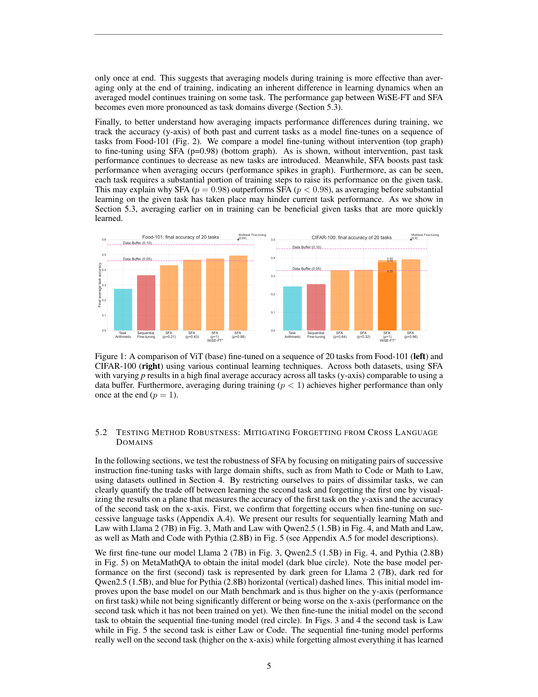
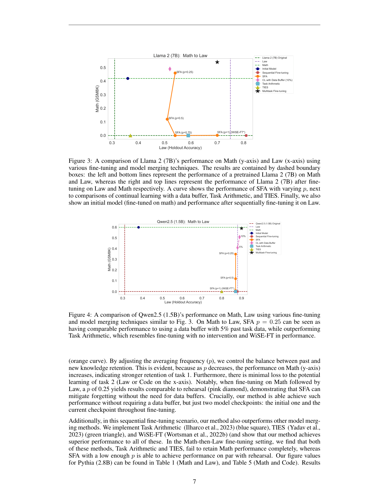

`soup_to_go_sfa | Soup to go: Mitigating Forgetting during Continual Learning with Model Averaging (SFA) | Harvard / Kempner Inst. · Google DeepMind · Databricks(Frankle/Kakade 等) | arXiv 2501.05559 v1 2025-01-09 | 主题线 L?(参数级持续学习 / model merging 防遗忘) · 相关性 High(对"几何共识/merging 抗遗忘"线直接相关)`

══ 第一层:一眼看懂 [light] ══
- 🟦 **TL;DR**:持续学习里顺序微调会忘旧任务。常见的"模型汤/合并"(model soup, Task Arithmetic, TIES, WiSE-FT)只在**训练结束后合并一次**。本文 SFA(Sequential Fine-tuning with Averaging)反问:**为什么只在最后合并?** 于是在**训练当前任务的过程中**,周期性地把"正在训练的模型"与"上一个任务的 checkpoint"做平均(用平均频率 p 控制多久合一次)。好处:不存旧数据、不训生成器、不每步存多份参数,却能逼近用数据 buffer 的效果,且**全面超过只在末尾合并的各种 merging 法 + EWC/L2 等惩罚法**。【原文 Abstract/§1/§3】
- **最巧的一步**:**"训练中途反复平均",而不是末尾一次**。作者把它解释成"用上一个任务的 checkpoint 当旧数据的代理(proxy)",并证明 SFA **近似经典 CL 算法 L2-regression**(§6)——即周期平均等价于对"偏离旧权重"施加隐式惩罚。抽掉"训练中平均"这一步、退回末尾合并,就丢掉了"边学边被旧解牵引"的连续约束,效果掉到普通 soup 水平。

══ 第二层:为什么做(写透) ══
- **研究背景**【原文 §1/§2】:持续学习(CL)中任务数据按流到来、旧数据不再出现,顺序微调会灾难性遗忘旧任务;且遗忘随模型规模增大而加剧(引 Luo 2023),连"通用知识"也会被忘(不止单个旧任务)。
- **解决的具体痛点**【原文 §1】:现有 SOTA 抗遗忘法**都有显著开销**——① 回放/数据 buffer:要存所有旧任务数据,存储随任务数暴涨、还有隐私风险;② 生成式回放:要额外训一个"旧数据生成器";③ 惩罚类(L2/EWC):每个梯度步都要在显存里同时装多份权重(初始+当前+可能的梯度)来算惩罚,模型一大就吃不消。本文要的是"**不存旧数据、不训生成器、不每步多份权重**"却能抗遗忘的廉价方案。
- **相关工作 & 各自不足**【原文 §2/§3】:① **Model Souping**(Wortsman)——只在超参 sweep 后合并多份模型;② **Task Arithmetic**(Ilharco)——加"任务向量"造多任务模型,但本文实验里它在跨域时几乎等同"无干预"、留不住旧任务;③ **TIES**(Yadav)——只合并符号一致的关键参数,跨域同样留不住 Math;④ **WiSE-FT**(Wortsman)——只把"预训练+微调后"两份合并一次;⑤ **Fisher merging**——又要存所有旧数据+算梯度。**共同不足:合并都只发生在训练结束后(one-shot),没有"边训边被旧解约束"的过程**。
- **动机链**【原文 §1 的核心反问 → §3/§6】:既然 merging 廉价且 buffer-free,**"为什么合并只能在训练末尾发生一次?"** → 若在训练当前任务的**过程中**周期性地与旧 checkpoint 平均,既能被旧解持续往回拽(抗遗忘)、又能继续学新任务 → 用"平均频率 p"调多久合一次来平衡稳定-可塑 → 为什么不用更简单的 WiSE-FT/末尾合并?因为 §5.4 实证:末尾合并(p=1)在跨域时会"完全忘掉 Math",而训练中平均(p<1)能保住——过程约束 ≠ 末尾约束。为什么不用 L2/EWC?因为 SFA 近似 L2 但**不必每步装多份权重**,更省(§6)。
- **与最近邻工作的 Δ**【原文 §3 明确对比】:最近邻是 **WiSE-FT**(本文称 "SFA with p=1 技术上等价于 WiSE-FT")与 **Task Arithmetic / 回放**。关键差异:① 对 WiSE-FT——把"一次性末尾合并"推广为"**贯穿训练的周期性合并 + 合并后继续训**",这一字之差(p<1 vs p=1)在跨域上是"保住旧任务 vs 彻底遗忘"的分水岭(Fig 3/7/8);② 对 Task Arithmetic——合并的是"旧任务整模型 checkpoint"而非"各任务的任务向量";③ 对回放——用"旧模型当旧数据的代理"替代真实数据 buffer,省存储省隐私。这个差异有用,因为它把 merging 从"事后拼装"变成"训练时的连续正则",并在 §6 证明其≈L2-regression,从而**把 merging 类与惩罚类 CL 在理论上打通**。

══ 第三层:怎么做 + 靠不靠谱 ══
- **方法流水线**【原文 §3 Algorithm 1】:输入=已在旧任务上微调好的参数 θo、平均频率 p、权重 β(默认 0.5)、当前任务总步数 T。流程:在当前任务上正常做梯度步得 θ*_{t+1}=θt−α∇Ltask →**每隔 pT 步(以及训练结束时)**,把参数重置为凸组合 θ_{t+1}=β·θo+(1−β)·θ*_{t+1};其余步照常更新 → 当前任务训完后,把 θo 更新为"迄今所有任务的合并模型",滚动进入下一任务。输出=对所有已见任务都保持高性能的单一模型。
- **逐组件必要性**【原文 §5.4 + Fig 9,有消融】:① **"训练中平均"(p<1)** 是核心——§5.4 直接对照:固定在末尾合并(p=1/WiSE-FT)再 sweep 权重 β,跨域时 β≥0.5 就完全丢 Math;而 p<1、β=0.5 全程更优(Fig 7/8)。**这是本文最关键的消融,坐实"过程约束"不可替代**。② **平均频率 p** 是稳定-可塑旋钮——p 越小(合得越勤)越保旧任务、Math 分越高,且对新任务损失极小(Fig 4/5)。③ **β(默认 0.5)**——Fig 9(MNIST 玩具)显示调 β 也能换稳定-可塑,但不如调 p 灵活。④ 论文还给出"什么时候该早平均":Fig 2 显示每个任务都要相当多步才学起来,所以对慢学任务 p 宜接近 1(末段才平均),对快学任务可早平均——这是对 p 取值的经验指导。
- **关键机制/公式直觉**【原文 §6,Eq.1-7】:核心洞见——把"每步都平均"的极端 SFA 展开(Eq.6/7:θ_{t+1}=(1−β)θt+βθo−α(1−β)∇Ltask)与"带 L2 惩罚 λ/2‖θt−θo‖² 的一步更新"展开(Eq.3:θ_{t+1}=(1−ηλ)θt+ηλθo−η∇Ltask)逐项对比,当 β=ηλ、α=η/(1−ηλ) 时两式完全相同。直觉:**与旧权重做凸组合 ≈ 给"偏离旧权重"加一个二次弹簧(L2 势阱)**,把当前解持续往旧最优拉。实际 SFA 平均不频繁(p<1),所以只是"近似"而非严格等价——但正因不频繁才省显存(不必每步装多份权重)。同理 EWC 也能被表述成一种 merging(Appendix A.3)。
- **实验与证据**【原文 §4/§5】:数据集=① 图像:Food-101、CIFAR-100 各切 20 任务(每 5 类一组),backbone ViT-base;② 语言跨域:Law(CaseHOLD+ToS+Overruling)、Math(MetaMathQA/GSM8K 评测)、Code(MagiCoder110k/HumanEval 评测),backbone Llama-2 7B / Qwen2.5 1.5B / Pythia 2.8B。**支撑核心主张的关键实验**:(a) Fig 1——20 任务图像流上 SFA(p<1)平均准确率逼近"用数据 buffer",且明显高于 p=1/WiSE-FT 与 Task Arithmetic;(b) Fig 3-5 跨域 Math→Law:SFA p=0.25 的 Math 保留度≈10% buffer 回放,而 Task Arithmetic/TIES "几乎完全丢 Math";(c) Fig 9 MNIST 玩具——超参调优后 **SFA > L2-regression > EWC**(同时更省算力)。**baseline 公平性**:对照了回放(5%/10% buffer 当"合理区间")、Task Arithmetic、TIES、WiSE-FT、L2、EWC、多任务上界(black star),覆盖 merging+惩罚两大族,且做了 β/proportion sweep,相当公平。**隐患**:① 语言端主要做"成对/三域"(Math↔Law↔Code)而非长任务流,真实 CL 的"几十任务顺序"只在图像端验证;② Pythia Math→Code 上回放本身也不灵(作者归因"次优超参",Fig 5 右),说明并非所有跨域都干净;③ 报告多为散点图,缺统一的聚合遗忘表(具体数值散在 Table 1/3-7 附录)。
- **假设与失效边界**【原文 §1/§5 + 推断】:原文承认——"任务/领域数量多且差异极大"时普通 merging 难平衡,SFA 缓解但 p 需按异构度调参;Pythia Math→Code 的失败提示对超参敏感。【推断,依据 §6 凸组合前提】当新旧最优解在权重空间几何上相距很远(线性插值落入高 loss 区)时,周期平均会同时拖累新旧——SFA 的"L2 近似"本质决定它只在"新解离旧解不太远"时有效。
- **祛魅总结**【推断】:**真贡献(硬货)**=① 一个极简到几乎零成本的抗遗忘原语("训练中按 p 周期性凸组合旧 checkpoint");② §6 把 merging 与 L2/EWC 惩罚类 CL 在理论上桥接(Eq.3≈Eq.7),这是概念层面的硬贡献;③ 用充分的 sweep 证明"过程平均 > 末尾平均"(§5.4)。**包装/需注意**=方法新颖度有限(就是"周期化的 WiSE-FT"),"近似 L2"是"resemblance"而非严格等价(作者自己强调实际 infrequent 时不等价);语言端未做长任务流;代码在 v1 时仍"working on releasing"(§9),无可用链接。整体定位:一个**理论解释漂亮、工程极简、但实验主要靠散点/成对验证**的轻量抗遗忘 baseline,作者署名分量重(Frankle/Kakade/DeepMind),结论可信度较高。

══ 机制速览 6 轴 [light] ══
| 维度 | 内容 |
|---|---|
| 学什么信号 | 任务监督 loss + 旧任务 checkpoint(作为"旧数据代理");非 reward / 非反思 |
| 改什么 | **参数**(权重做加权平均 / 合并) |
| 何时改 | **训练中在线**(按平均频率 p 周期性合并,贯穿当前任务训练全程,而非仅末尾) |
| 免梯度? | **混合**:仍用梯度训练当前任务,但"防遗忘"靠免梯度的权重平均实现 |
| 记忆-技能生命周期 | 写入=保存上一任务 checkpoint;"检索"=训练中与之平均;遗忘=旧 checkpoint 被新合并结果覆盖(滚动);无显式技能库 |
| 防遗忘机制 | **merging(model averaging)**,且文中证明其**近似 L2 投影/惩罚**——把 merging 与经典惩罚类 CL 在理论上桥接起来 |

⑦ **开源代码 + 框架/harness**:**v1 未放出代码**——§9 Reproducibility 明确写 "We are working on releasing a repository with our specific configurations and SFA code"(代码与配置承诺后续发布,v1 无可点击链接)〔待核:正式版仓库〕。所用工具均开源,参考文献引用了 **MosaicML Composer**(`github.com/mosaicml/composer`),推测训练基于 Composer 脚手架【推断,依据参考文献该条 + Databricks 作者背景】。方法极简(按频率对权重做凸组合),无需特定 RL 框架;图像端 ViT-base,语言端 Llama-2 7B / Qwen2.5 1.5B / Pythia 2.8B,标准 fine-tuning。
💰 资源/成本:核心卖点就是**省成本**——不存旧数据 buffer、不存每步多份参数、不训数据生成器,仅需保留少量历史 checkpoint(原文 §1 反复强调"minimal computational expenses")。

🎯 **对"探索-巩固"idea 对标** [light]:**支撑 + 可借组件**。SFA 给"巩固"提供了一个极简且有理论解释的范式:**周期性把当前学习态拉回历史态(≈ L2 投影)**。这与本课题"巩固阶段防遗忘"目标一致;其"checkpoint 当旧数据代理 + 平均频率 p 调稳定-可塑"可直接迁移为 OPD/MTP 训练中的"周期性向 teacher/历史策略平均"的轻量稳定化手段。它把 merging 与惩罚类 CL 打通的结论,也支撑了本调研"几何共识/merging 抗遗忘"这条线的合法性。

🖼 **关键图 top-2** [light]:

这是**原文 Figure 1**(p4):经典 CL 设定下,ViT-base 在 20 个图像分类任务序列上,SFA 与顺序微调/各 merging 法的对比。选它因为它在"长任务流"标准 CL 场景下直观展示 SFA 的稳定-可塑平衡(动机+主结果一图双关)。

这是**原文 Figure 3**(p6):Llama-2 7B 在 Math(y 轴)与 Law 等强异构领域上的表现散点/前沿。选它因为它把结论从图像迁移到 **LLM 跨领域(Law/Math/Code)** 的硬场景,证明 SFA 不只对小图像任务有效——这是对本调研(LLM 持续学习)最相关的证据图。

══ 假设与失效边界(一句)[light] ══
【推断,依据 §1/§6:方法依赖"旧 checkpoint 与新解在权重空间足够接近、凸组合仍有意义"】当任务高度异构、损失盆地几何上彼此远离(线性插值落到高 loss 区)时,周期平均会同时拖累新旧任务;且作者自己指出在"任务/领域数量极多、差异极大"时普通 merging 难平衡——SFA 缓解但未根除该极限,平均频率 p 需按异构程度调参。
