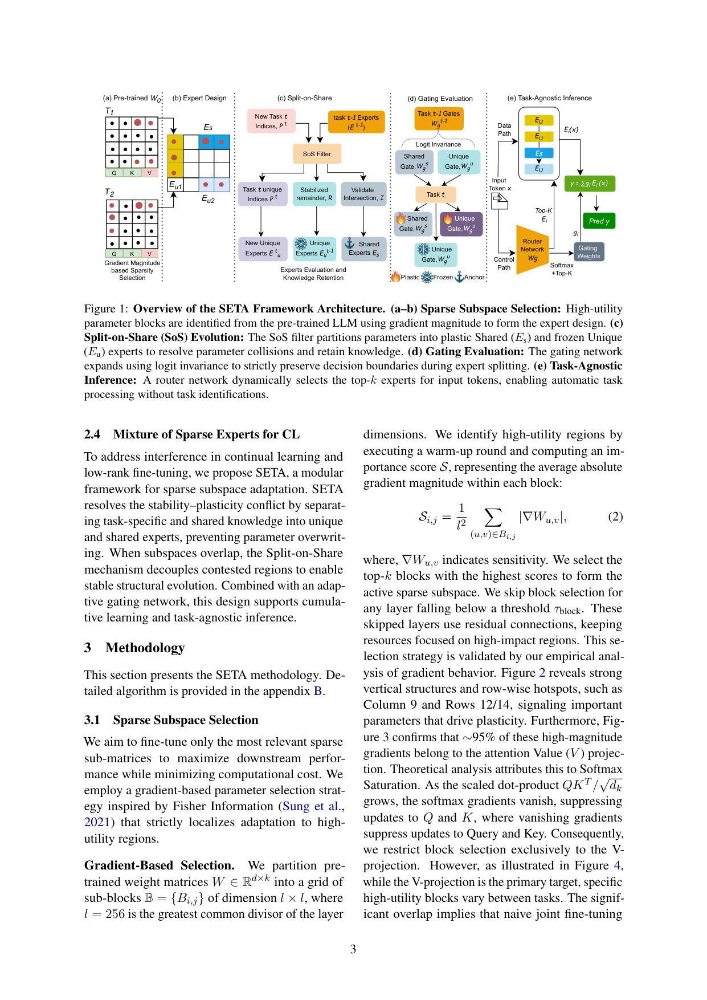
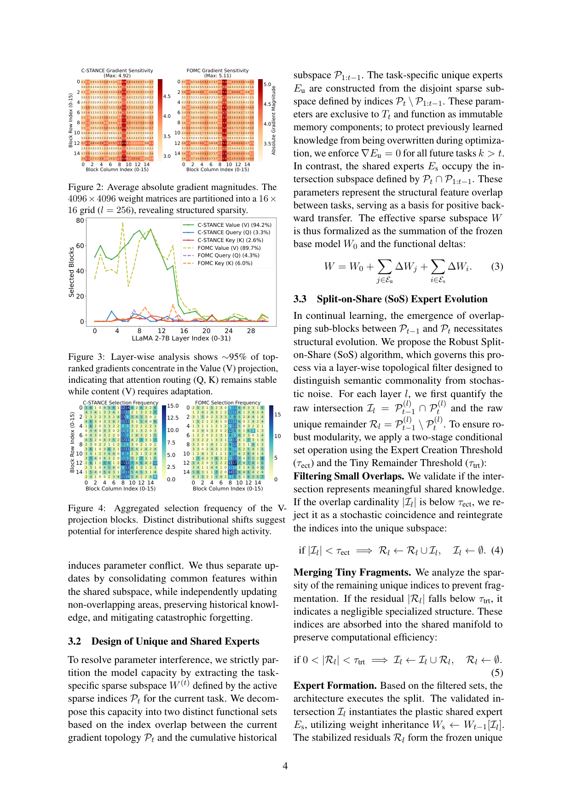

`split_on_share_seta | Split-on-Share: Mixture of Sparse Experts for Task-Agnostic Continual Learning (SETA) | Iowa State Univ. + Argonne National Lab | arXiv 2601.17616 v1 2026-01-24 (abs 页另有 v2,但 v2 PDF 端点当时未就绪,本笔记基于 v1) | 主题线 L?(参数级持续学习 / 防遗忘) · 相关性 Med`

══ 第一层:一眼看懂 [light] ══
- 🟦 **TL;DR**:LLM 持续学习的老大难是"可塑性-稳定性两难"——学新任务就忘旧任务。SETA 把模型按"梯度稀疏块"切成两类专家:**共享专家 Es**(多个任务都用到的重叠参数,弹性锚定、可慢慢更新)和 **独占专家 Eu**(只属于某一任务的参数,直接冻死当不可变记忆)。再配一个**内容路由门**(看输入 token 自动选专家,不需要任务标签),实现"任务无关推理"。在 LLaMA-2 7B 上跑 6 个领域 CL 任务,平均保留分(RT)和抗遗忘(FT)都超过 I-LoRA 等 PEFT-CL 基线。【原文 §1/§3/Table 2】
- **最巧的一步**:**Split-on-Share 把"参数重叠区"和"独占区"分开对待**——重叠的当共享(允许正向迁移、加弹性正则防漂移),独占的直接冻结当记忆。抽掉这一步、退回"所有参数一视同仁地正则"(就是 EWC 的做法),稳定-可塑就又会互相打架。原文 §2.3/§3.3 把这点讲成核心 motivation:统一正则太死板,需要"结构性"切分而非纯 loss 约束。

══ 第二层:为什么做(写透) ══
- **研究背景**【原文 §1】:LLM 在持续学习(顺序学一串任务、不能回看旧数据)场景下要同时满足"可塑性"(学新任务快)与"稳定性"(不忘旧任务),即 plasticity-stability dilemma / 灾难性遗忘。现有 CL 三大流派——回放(rehearse 旧数据)、正则(惩罚改动关键参数,如 EWC)、参数隔离(给每任务单独模块,如 Progressive Net)。
- **解决的具体痛点**【原文 §1/§2.3】:三大流派有一个**共同病根——"在各自子空间里一视同仁地对待参数"(treat parameters uniformly)**,分不清"哪些参数是跨任务可复用的通用特征 vs 哪些是某任务独有的"。落到 PEFT(LoRA)上更糟:LoRA 把更新压进一个窄瓶颈(r≪d),是对权重的**有损近似**(原文引 He 2025),顺序更新时优化路径太窄、无法同时满足相互冲突的需求,于是新学习覆盖历史参数(原文 §2.2,引 Ren 2024 的"顺序任务 loss 极小值几何上断开"观察)。
- **相关工作 & 各自不足**【原文 §2】:① 统一正则(EWC,Eq.1 的固定 α·‖W−W*‖²)——太死板,无法"对共享特征放松、对任务专属收紧";② LoRA 类 PEFT——低秩瓶颈引入噪声、长序列存不下知识;③ 经典参数隔离(每任务加模块)——不迁移、容量线性膨胀;④ I-LoRA(直接架构对照组)——本文实验里它在难任务上会"灾难性崩塌"(Table 2 Task2 掉到 8.1%)。本文把自己定位为"**结构化的稀疏专家**"路线:不靠加 loss 约束,而靠**对参数做结构性切分**。
- **动机链**【原文 §2.3→§2.4,推断补逻辑】:顺序学习中参数会变成"被多任务共用"(shared region I=Pt∩P1:t−1)→ 在这块上"改"会覆盖旧知识、"冻"会限制可塑 → 单一固定惩罚 α 无法同时防漂移+促学习(Eq.1 的根本局限)→ **所以必须把这块从结构上拆开**:共享区可塑+弹性锚定、独占区直接冻死当记忆 → 又因为推理时不想要任务标签 → 加内容路由门做任务无关推理。为什么不用更简单的现成法?因为正则/PEFT/隔离都不区分参数角色,本文主张"角色区分"必须落到结构(专家)层而非 loss。
- **与最近邻工作的 Δ**【推断,依据 §2.2 对 Ren 2024 / I-LoRA 的引用 + §3 设计】:最近邻是 **I-LoRA(LoRA-MoE 式 CL)**与"正交子空间持续学习(O-LoRA, Liu 2024)"。关键差异:① 选参不靠低秩投影,而靠**梯度幅值在稀疏块上选**(且发现 ~95% 高梯度集中在注意力 V-投影,只在 V 上选),这是 LoRA 类没有的"白盒稀疏定位";② 不是把每任务塞进同一组适配器,而是**按"参数在任务间是否重叠"动态切成 shared/unique 两类专家**,unique 直接冻结当不可变记忆。这个差异有用,因为它把"该保护谁/该放松谁"从隐式(靠 Fisher 权重)变成显式(靠结构归属),从而在难任务上不像 I-LoRA 那样崩塌。

══ 第三层:怎么做 + 靠不靠谱 ══
- **方法流水线**【原文 §3】:输入=预训练 W0 + 新任务 Tt 数据 →(1)**稀疏块选择**:把权重切成 256×256 子块网格,warm-up 一轮算每块平均 |∇W| 重要度(Eq.2),取 top-k 块;实证发现高梯度几乎全在注意力 V-投影(Q/K 因 softmax 饱和梯度消失),故**只在 V 选块** →(2)**专家设计**:当前任务稀疏索引 Pt 与历史累积 P1:t−1 比对,交集→共享专家 Es,差集→独占专家 Eu(Eq.3,W=W0+ΣΔWj_unique+ΣΔWi_shared)→(3)**SoS 演化**:用两个阈值清洗(交集太小 τect→退回独占当随机巧合 Eq.4;独占残块太碎 τtrt→并回共享 Eq.5),据此实例化 plastic 共享专家 + frozen 独占专家,容量按 O(log T) 增长 →(4)**历史保护**:旧独占专家强制零梯度冻结(Eq.6)+ 共享专家按"共享频率 nj"加权弹性锚定(Eq.7)→(5)**门控扩展**:专家分裂时保 pre-activation logit 不变(weight inheritance),防 cold-start →(6)**任务无关推理**:单层内容路由 Wg 对所有专家算 softmax,top-k 加权叠加输出(Eq.9),无需任务 ID。
- **逐组件必要性**【原文 §3 + 推断】:① **V-投影限定**——若不限定,在 Q/K 上选块(梯度已消失)等于浪费预算;有 Fig.3(~95% 集中在 V)作依据,但**未做"V vs 全选"的端到端消融**,只是梯度统计支撑。② **SoS 切分(shared/unique)**——核心组件,没它退回统一正则/普通 MoE;**论文未提供"SoS on/off"的直接消融表**,合理性靠 Fig.5(共享专家逐步吸收通用特征、独占专家保持小 footprint)与 Fig.6(后期任务激活更多专家)间接佐证〔推断:缺消融是本文证据链最弱处〕。③ **弹性锚定 Eq.7 按 nj 加权**——比 EWC 固定 α 更细;无独立消融。④ **逻辑不变门控扩展**——防分裂时路由漂移;无独立消融。整体看,**消融基本缺位**,组件必要性多靠机制分析图而非控制变量实验。
- **关键机制/公式直觉**:① Eq.2 用块内平均梯度幅值当"重要度"——梯度大=该块对当前任务损失敏感=值得动,是 Fisher 信息的廉价代理。② Eq.7 的 nj‖ΔWj−ΔW*j‖²:被越多任务共用(nj 大)的参数,挪动它的"弹簧"越硬,等于给高复用参数挖一个深"势阱"把它钉在原地,逼着没约束的独占专家去吸收高方差更新——这是"让通用特征稳、让专属特征动"的核心配方。③ Eq.6 零梯度冻结=硬隔离,保证旧任务专属参数绝对不变(immutable memory)。④ 逻辑不变(z=x⊤Wg^{t−1})保证分裂前后路由概率质量守恒,不破坏已学决策边界。
- **实验与证据**【原文 §4,Tables 1-5】:数据集=6 个领域 CL 任务(C-STANCE/FOMC/MeetingBank/ScienceQA/NumGLUE-cm/20Minuten)+ 3 个通用基准(MMLU/BBH/PIQA)做遗忘对照;backbone=LLaMA-2 7B,2×A100。**支撑核心主张的关键证据是 Table 2**:顺序学完 6 任务后,SETA 聚合保留分 RT=30.47%、遗忘 FT=19.28%,均优于 I-LoRA(RT=27.32%/FT=27.52%);尤其在 I-LoRA 崩塌的 Task2(I-LoRA 8.1% vs SETA 25.0%)、Task3(14.4% vs 21.0%)上更稳——这是"结构切分防崩塌"主张最硬的数字。Table 3 通用基准 GEN loss=−18.42(全场最佳,遗忘最少)。Table 1 多数任务领先(FOMC 59.0 vs I-LoRA 53.9)。**baseline 是否公平**:对比了 10 个 PEFT-CL 基线(Seq/ER/EWC/GEM/A-GEM/L2P/PP/I-LoRA/MTL),设置统一(每任务采 5000/500、batch16、lr1e-4),相对公平。**"看着强但没回答核心问题"的隐患**:① 绝对分普遍偏低(Table 2 最终行多在 20-45%,Task5 仅 21%),说明 6 任务顺序学整体仍很伤;② Table 5 中 Task4 的 #TP 突然飙到 65.28M(其余 6-8M),数字异常且原文未解释〔待核:疑为笔误或该任务专家暴涨〕;③ Table 1 的 ScienceQA 上 SETA(36.92)反而低于 I-LoRA(40.1),并非全面碾压。
- **假设与失效边界**【原文 Limitations + 推断】:原文自承——仅 LLaMA-2 7B 单 backbone、仅固定领域级任务序列、共享子空间设计"仍是启发式"(heuristic),如何随任务增多原则性地收缩共享专家未解决。【推断,依据 §3.1】方法强绑定"梯度集中在 V-投影 + 任务间稀疏块有显著重叠"两个经验前提;换架构/模态(梯度不集中于 V)、或任务彼此几乎无重叠(共享专家退化为空)时,SoS 切分失去意义、退化为纯隔离。
- **祛魅总结**【推断】:**真贡献(硬货)**=把"参数角色区分"从 loss 层(EWC 式加权)提升到**结构层(显式 shared/unique 专家 + 任务无关路由)**,并给出"V-投影集中""O(log T) 容量""逻辑不变扩展"这几个可迁移的工程点;在难任务防崩塌上确有可测优势(Table 2)。**包装/可能高估**=自称 SOTA 但缺关键消融(SoS、V-限定、弹性锚定都没有 on/off 对照),优势主要靠机制图叙事;绝对性能不高且个别任务落后,Table 5 异常数字未解释;代码仅"Anonymous Repository"占位、v1 无真实链接。整体定位:一个设计自洽、但**实证严谨度(消融/规模)偏弱**的结构化稀疏 MoE-CL 方法。

══ 机制速览 6 轴 [light] ══
| 维度 | 内容 |
|---|---|
| 学什么信号 | 任务监督 loss(交叉熵)+ 梯度幅值(Fisher 风格)做稀疏块选择;非环境 reward / 非自反思 |
| 改什么 | **参数**(注意力 V-投影里的稀疏子块 ΔW;门控 Wg 也随专家扩展) |
| 何时改 | **离线批量**(逐任务顺序训练,每任务先 warm-up 算重要度再训) |
| 免梯度? | **否**(梯度训练;但对历史独占专家强制 ∇Eu=0 冻结) |
| 记忆-技能生命周期 | 写入=新任务独占专家;检索=内容路由门 top-k 选专家;遗忘/淘汰=容量按 O(log T) 对数增长,小重叠/小碎片被合并回收(τect/τtrt 阈值);共享=共享专家承载跨任务正向迁移 |
| 防遗忘机制 | **隔离 + 正则混合**:独占专家正交子空间隔离(零梯度冻结)+ 共享专家自适应弹性锚定(按共享频率 nj 加权的 L2)+ 门控扩展时保 logit 不变(防 cold-start 漂移) |

⑦ **开源代码 + 框架/harness**:论文写 "code is available at **Anonymous Repository**"(投稿匿名占位,**v1 未给出可点击 URL**)〔待核:正式版 / v2 是否放出真实链接〕。框架=**HuggingFace Transformers**(原文 §4.4 明确),无 RL 训练框架,稀疏专家/SoS/门控为**自研实现**。
💰 资源/成本:2×A100;LLaMA-2 7B;每数据集采样 5000 训练 / 500 评估,batch=16,lr=1e-4(原文 §4.4)。其余成本原文未细说。

🎯 **对"探索-巩固"idea 对标** [light]:**可借组件**。SETA 的"独占专家=冻结的不可变记忆 + 共享专家=可塑、承载正向迁移"正是一种**显式的"巩固/隔离"机制**;其"按参数在任务间的复现频率 nj 决定保护强度"的自适应锚定,与本课题"对关键/高复用路径加重保护"的直觉同构,可迁移为 MTP/OPD 中"对被多条推理路径共用的参数加几何/弹性约束"。但它是**纯参数级、任务边界已知的经典 CL**,无 agent / 在线探索 / 经验库语义,不是直接竞品。

🖼 **关键图 top-2** [light]:

这是**原文 Figure 1**:从左到右展示 (a-b) 梯度幅值选高效稀疏块→(c) Split-on-Share 把参数切成 plastic 共享 Es / frozen 独占 Eu→(d) 门控 logit 不变扩展→(e) 任务无关推理(路由 top-k 选专家)。选它因为一张图把"切分+冻结+路由"整条 pipeline 的咬合关系讲清,是方法主图。

这是**原文 Figure 3**:逐层分析显示 ∼95% 的 top 梯度集中在注意力 **Value(V)投影**(Q/K 因 softmax 饱和梯度消失而稳定)。选它因为这是 SETA"只在 V-投影选块"这一关键设计决策的**实证依据**(精华发现,支撑方法的合理性)。

══ 假设与失效边界(一句)[light] ══
【推断,依据 §3.1/§3.3:方法绑定"梯度集中在 V-投影 + 任务间稀疏块有显著重叠"】当任务彼此几乎无参数重叠(共享专家退化为空)、或梯度并不集中于 V-投影(不同架构/模态)时,SoS 切分失去意义、退化为纯参数隔离;且实验仅 LLaMA-2 7B + 6 个任务、绝对分偏低(如 Seq T6 仅个位数,SETA RT 也仅 30.47%),长序列/大模型的可扩展性未验证。
