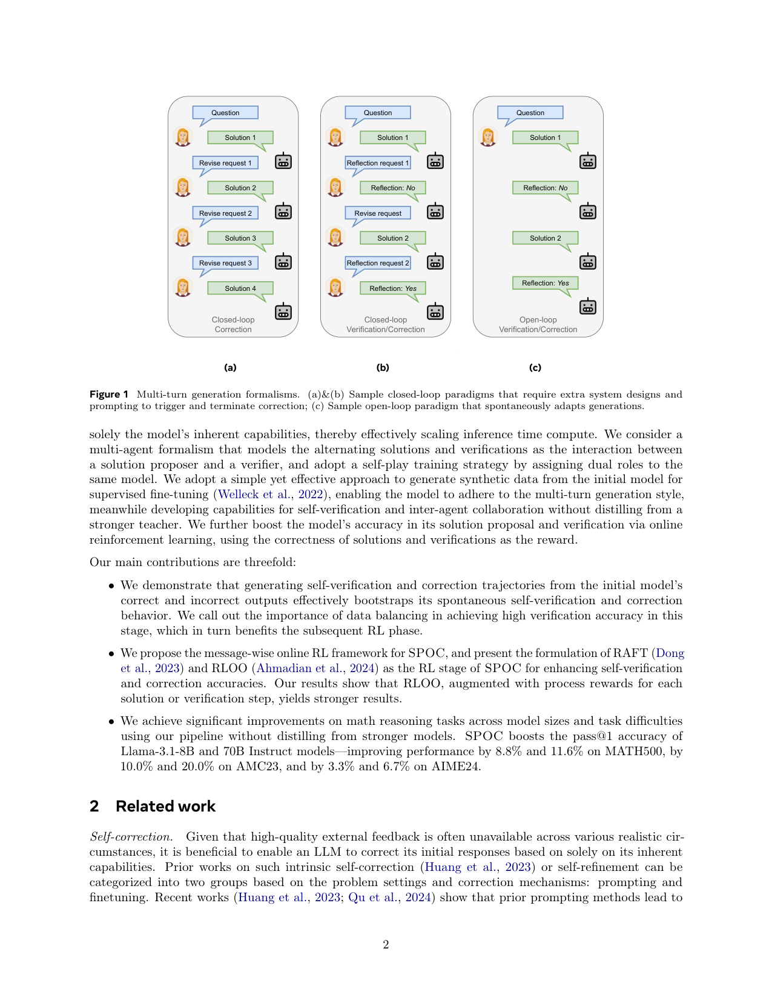
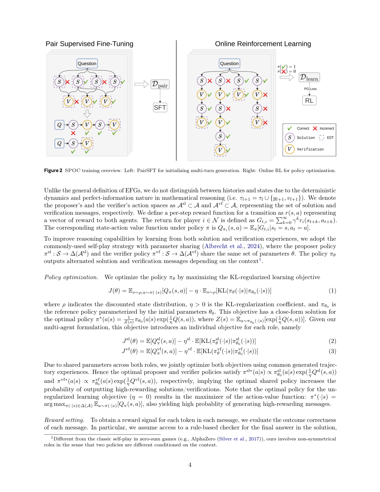

`spontaneous_self_correction | SPOC: Boosting LLM Reasoning via Spontaneous Self-Correction | Meta AI + Mila/Polytechnique Montréal | 2025-06(arXiv:2506.06923v1) | L? 推理/自我纠错（参数化、SFT+在线RL）· 相关性 High`

> 档位：**deep**（全字段三层 + 结构化抽取）。所有内容基于已下载 PDF 正文（_txt_spontaneous_self_correction.txt，9 页正文 + 附录）。

══ 第一层：一眼看懂 [light] ══

- 🟦 **TL;DR**：现有自我纠错都是"先生成完整答案 → 外部再加 prompt 让它反思/重写"(闭环 closed-loop)，要靠额外系统设计触发与停止，没法**自发**纠错。SPOC 让**同一个模型在单次推理里交替输出"解答→验证→(若验证为错)再解答→再验证…"**(**开环 open-loop**)，**验证说对了就自动停、说错了就自己再来一遍**，无需任何外部介入——把"要不要再试一次"交给模型自己决定，从而**自适应地按题目难度伸缩推理算力**(test-time compute scaling)。训练两步：①**Pair-SFT**(从初始模型自采样的对/错答案构造"解答+验证"多轮合成数据做 SFT，让模型学会这种交替体例、且无需更强 teacher 蒸馏)；②**在线 RL**(用解答正确性 + 验证正确性当 reward，message-wise 更新；RAFT 或 RLOO，RLOO+过程奖励最强)。LLaMA3.1-8B/70B 在 MATH500/+8.8%/+11.6%、AMC23 +10/+20%、AIME24 +3.3/+6.7%。

- **最巧的一步**：**"把解答-验证建模成 extensive-form game(EFG)里 proposer 与 verifier 两个角色、参数共享自对弈"** + **数据平衡**。抽掉"验证当作可奖励的一等动作"这一步，模型就退回普通 single-pass，不会自发停/续。最关键的工程点是 **Pair-SFT 阶段把正/负样本子集 reweight 到约 1:1**——原文明确指出数据平衡决定 verifier 准确率，进而决定后续 RL 稳定性（§3.2）；验证准了，"何时停、何时重试"才靠谱，否则纠错信号是噪声。

══ 第二层：为什么做（写透，重点） ══

- **研究背景**：数学推理因其符号化、结构化的本质，仍是 LLM 最难的领域之一。**自我纠错(self-correction)** 被视为"自我改进"的有前景范式——让模型迭代地批评并精炼自己的回答。【原文 §1】

- **解决的具体痛点**：现有自我纠错**做不到自发、实时、单 pass 内纠错**。具体三个毛病：(1) 纯 prompt 方法在无外部反馈时几乎无提升甚至掉点(Huang 2023, Qu 2024)；(2) finetuning 方法依赖 oracle 标注/更强模型/learner 自身的精炼数据，但**仍需在每次回答后插一个特定 prompt 来触发反思/纠错**(图1a/1b 的闭环)，部署时要额外系统设计来注入这些 prompt；(3) 结果是**test-time compute 伸缩低效、部署不灵活**——模型不能根据题目难度自己决定"要不要再想一次"。【原文 §1 + §2】

- **相关工作 & 各自不足**(§2)：
  1. **Intrinsic self-correction 的 prompting 派**(Reflexion/Self-Refine)：Reflexion 靠 oracle 标签(现实常不可得)；Self-Refine 给初答用较弱 prompt 导致**高估了纠错收益**。
  2. **finetuning 派**(SCoRe/Recursive Introspection)：训练能纠错，但**不在生成解答的同一 pass 内纠错**，仍需外部触发停止。
  3. **multi-agent 框架**(AutoGen/debate/MALT)：引入多角色解题，但**不为不同角色做后训练**，可能导致次优或推理时分布漂移；且这些"训练单独模型做纠错"的工作里，模型**不自发纠错**，要外部系统触发与停止。【原文 §2 multi-agent 段】
  4. **并发工作 S2R(Ma 2025)/Self-rewarding(Xiong 2025)**：S2R 用更复杂的 GRPO，SPOC 证明**同设置(Llama3.1-8B)下用更简单的 RAFT 就能更好**；Xiong 在验证里"重答"而非评估前一答，且只用 RAFT。【原文 §2 self-correction 段】

- **动机链**：现状(自我纠错有用但都是闭环、要外部触发) → 缺陷(不能自发、test-time compute 伸缩低效、部署不灵活) → **所以要让模型在单 pass 内自己交替"解答↔验证"、靠验证结论自发停/续(开环)** → 但模型默认不会这种交替体例、也不会可靠自验 → **所以先 Pair-SFT 教会体例 + 自验能力(且不蒸更强 teacher)，再用 RL 把解答与验证的准确率一起拉高** → 验证不准则停/续决策是噪声 → **所以 Pair-SFT 阶段必须做正负数据平衡保证 verifier 准确率**。为什么不用更简单的"外部 prompt 触发纠错"？因为那正是被反驳的闭环范式(高估收益、部署不灵活)。【原文 §1+§3】

- **与最近邻工作的 Δ**：
  - **vs SCoRe(Kumar 2024)**：SCoRe 也用 RL 训自纠错，但**仍是闭环**(需外部 prompt 触发第二次尝试)；SPOC 的关键 Δ 是**开环+EFG 自对弈**——proposer/verifier 共享参数，验证当一等可奖励动作，模型自发决定停/续。
  - **vs S2R(Ma 2025，并发)**：同样教自验自纠，但 S2R 用 GRPO；SPOC 证明**同模型同设置下 RAFT/RLOO 这类更简单算法即可超越**，且系统性地比较了 RAFT vs RLOO(后者+过程奖励最强)。【原文 §2 + 表1 绿色行】
  - **vs Self-Refine**：Self-Refine 给初答用弱 prompt 高估收益、且需 oracle；SPOC 不用 oracle、不用外部触发。表1 里 Self-Refine(w/o oracle) 经常掉点(LLaMA3.1-8B MATH500 52.2→39.4)印证此点。

══ 第三层：怎么做 + 靠不靠谱 ══

- **方法流水线**(图2，两阶段)：
  ① **多轮形式化(§3.1)**：给定题 x，模型生成交替轨迹 τ=(y1,v1,...,yL,vL)，y_l 是第 l 次完整解答、v_l 是对 y_l 的自验(输出 Yes/No + 简短错因)。建模为 **EFG**(extensive-form game)，proposer 与 verifier 是 2 个玩家但**共享同一套参数 θ**(self-play with parameter sharing)，按上下文决定当前输出解答还是验证。
  ② **Pair-SFT 初始化体例(§3.2)**：用 base 模型 π_θ0 对每题采 K 个单轮解答 → rule-based checker 标对错 → 对每个解答配一个"验证消息"(prompt 同一 base 指出潜在错误、简述、给二值结论)，构造 D_pair={(x,y⁻,v⁻,y*)}∪{(x,y⁺,v⁺)} → SFT(错误消息的 token 被 mask 掉)。**关键：把正/负子集 reweight 到约 1:1**。
  ③ **在线 RL(§3.3，Alg.1 message-wise)**：每题采 K 条轨迹 → 给每个 message 标二值 reward(r^sl 解答对错、r^vf 验证对错，v* = r^sl 即真值验证) → 用 RAFT(best-of-N 过滤)或 RLOO(逐 message 算 advantage)更新。RL 目标含 **KL 正则**锚回参考策略(式1/2/3，proposer/verifier 各自 η)。
  输出：一个能在单 pass 内自发交替解答-验证、按需停/续的策略。

- **逐组件必要性**：
  - **Pair-SFT 数据平衡(1:1)**：【原文 §3.2 明确】reweight 正负子集到同尺度 → πθsft 验证准确率更高、后续 RL 更稳。**无独立消融表，但作者把它列为三大贡献之一并明确陈述其因果作用**(属作者强调的关键设计)。
  - **EFG/验证当一等动作**：去掉就退回 single-pass，不会自发停/续——这是方法定义性组件，全篇主张。
  - **reward 配置(Corr vs Last vs All)**：**有消融**(表4，LLaMA3.1-8B)。默认 **Corr**(解答对错与验证对错都奖，图3a)有唯一 Nash 均衡(联合策略同时产对的解答+对的验证)，MATH500 61.0；Last/All 不产生唯一均衡(只在最后解答对时才奖正确解答)，两者在 3 个任务中 2 个低于 Corr。**证明联合优化解答与验证正确性的必要性。**
  - **RAFT vs RLOO**：表1 显示 **RLOO+过程奖励更强**(R1-Distill-8B：SPOC 77.6 → SPOC-RLOO 87.2 MATH500、50.0 AIME24)，因 RLOO 用全部样本、样本效率高。
  - **迭代训练(iter2)**：表3 显示第二轮 PairSFT-RL 仍带一致提升，尤其难题(LLaMA3.1-70B AMC23 +10%、AIME24 +6.7%)。

- **关键机制/公式直觉**：
  - **EFG + 参数共享自对弈**：直觉是把"解题"与"判题"做成同一个模型的两个角色，让它在自我博弈中既学会产好解、也学会准确判错。**Corr reward 的唯一 Nash 均衡**(§3.1 末)保证最优联合策略会"一开始就既产对解又给对验证"——这解释了表2 现象：强模型(70B)倾向第一次就答对(Δ(t1,t2)≈0)，弱模型(8B)更爱再来一轮(Δ 更大)。
  - **开环停/续**：直觉是"验证结论 = 自带的停止信号"。验证说 Yes 就停、No 就再解一遍，无需外部触发——这把 test-time compute 变成**按难度自适应**(难题多花算力、易题早停)。
  - **KL 正则(式1)**：直觉是防止 RL 把策略推离 base 太远(保持语言/推理基本盘)，proposer/verifier 各设 η 系数。最优策略闭式解 π*∝πθ0·exp(Q/η) 表明"提高高奖励解答/验证的概率"。

- **实验与证据**：
  - **数据集/设置**：训练用 NuminaMath(剔除未经人验证的 Orca-Math/合成子集)；评测 MATH500/AMC23/AIME24。base 模型 LLaMA3-Instruct(3.1-8B/70B、3.3-70B)、R1-Distill-Llama(8B/70B)。pass@1、greedy、zero-shot CoT。32×H100，global batch 2048，256 步。【原文 §4.1 + 附录B】
  - **核心主张证据**(表1)：SPOC 在**所有初始模型、所有任务**上一致超 base。LLaMA3.1-8B/70B 增益 8.8%/11.6%(MATH500)、10/20%(AMC23)、3.3/6.7%(AIME24)。**最亮的是 SPOC-RLOO**：R1-Distill-70B 达 94.6/92.5/76.7，AIME24 76.7% 超过 base 70B 的 60.0% 与多数闭源(O1 74.4)。
  - **per-turn 分析**(表2)：第二轮解答一致优于第一轮，且 8B 更倾向产第二轮(Δ 更大)，与 Corr 的 Nash 均衡预期吻合。
  - **baseline 公平性**：表1 对每个初始模型都列了 SFT/RAFT/PairSFT/Self-Refine 同设置基线，并诚实标注哪些是直接引用他人报告(*)、哪些用了不同 tokenizer(R1tok)。**相对公平**。
  - **"看着强但需警惕"的点**：(1) LLaMA3.3-70B 上 SPOC 提升**边际**(75.6→77.8 MATH500)，因强模型本就接近天花板；(2) verifier 可靠性附录C 暴露弱模型(8B)在难题(AIME24)上验证**几乎全判 incorrect**(TN=100%)——它的"高验证准确率"主要来自"反正都判错"，这意味着 8B 的自验在难题上信息量有限；(3) 主结果里最惊艳的 RLOO 数字只在 R1-Distill 系出现，普通 LLaMA 系未报 RLOO，覆盖不全。

- **假设与失效边界**：
  - 【原文 §3.1 reward setting】**强依赖最终答案可被 rule-based checker 判对错**(数学题专属，benchmark 都要求可验证输出)。
  - 【原文 §3.2 + 附录C】**依赖自生成验证数据正负平衡 + base 模型本身有一定自验能力**——8B 在难题上验证退化为"全判错"(附录C TN=100%)。
  - 【推断，依据表1 LLaMA3.3-70B 边际提升】**强模型接近天花板时收益递减**。
  - 【原文结论】**目前只验证数学**；长 CoT(R1 风格)上把 SPOC 用于"部分解"的过程级纠错是未来工作(现仅在完整解层面交替)。
  - 【推断】**对无可验证答案的开放域任务退化**——reward 信号无从构造。

- **祛魅总结**：
  - **真贡献(硬货)**：(1) **开环自发纠错**这一范式重构是实打实的——把"何时停/续"内化进模型而非外部 prompt，且 EFG+参数共享给了它干净的博弈论刻画(唯一 Nash 均衡)；(2) **不蒸更强 teacher**、纯自举(self-bootstrap)就拿到 8-20% 增益，且诚实地证明 RAFT/RLOO 这类简单算法能超 GRPO(对 S2R)；(3) reward 配置消融(表4)与数据平衡的强调都有据。【推断】
  - **包装/营销成分**：标题"spontaneous"听起来很玄，本质是**"把验证当一等可奖励动作 + 验证结论触发停/续"**——一个相当工程化的机制。**最惊艳的数字(RLOO 在 R1-Distill 上 +24%)只在已经很强的 R1 蒸馏模型上出现**，普通 LLaMA 系增益温和得多；强模型(3.3-70B)几乎无提升。附录C 还暴露小模型自验在难题上近乎失效。所以"自发自纠错"的真实收益**高度依赖 base 模型已具备的自验能力**——作者在正文相对低调地承认了这点(数据平衡决定 verifier 准确率)。【推断】
  - 作者**总体诚实**：明确"不蒸 teacher""verifier 可靠性诊断在附录C""强模型边际提升"，未过度吹嘘。【推断】

══ 结构化抽取（供全景汇总，必填） ══

- 🎯 **机制速览 6 轴** [light]：

| 维度 | 内容 |
|---|---|
| **学什么信号** | **环境/规则 reward**(rule-based 答案 checker 给 0/1) + **模型自身的验证结论**(verifier 输出 Yes/No，其正确性也作 reward)；本质是"自反思+可验证奖励"二合一，**无人类标注、不蒸馏更强 teacher** |
| **改什么** | **参数**(SFT + 在线 RL 都更新策略 θ；proposer/verifier 共享同一套参数) |
| **何时改** | **离线批量训练**(Pair-SFT + message-wise online RL 两阶段)；训练后**推理时 per-step 自发触发纠错**(开环，验证为错即续写新解答) |
| **免梯度?** | **否**(SFT + RL 全程梯度更新) |
| **记忆-技能生命周期** | 不适用——"自纠错"内化进**权重**，非外部记忆库；无检索/遗忘/共享 |
| **防遗忘机制** | **KL 投影**(RL 目标含 KL(π_θ‖π_θ0) 正则锚回参考策略，η 系数对 proposer/verifier 分别设定，式2/3) |

- ⑦ **开源代码 + 框架/harness**：**未找到公开代码仓库**（原文无 own GitHub 链接；仅引用 NuminaMath 数据集的 HF/numina 链接）。**RL 框架：RAFT 实现于 CGPO 框架(Xu et al., 2024)**，可过滤"所有采样都无正确解/验证"的 prompt；另自实现 RLOO 变体。**判定：Meta 内部工作，未开源训练代码。**【原文 §4.1 实现细节】
- 💰 **资源/成本与可扩展性**：训练 LLaMA3-Instruct 3.1-8B/70B、3.3-70B、R1-Distill-Llama 8B/70B；最大生成长度 6144 tokens(R1-distill 系 32768)；32×H100、global batch 2048、256 步、lr 1e-6(AdamW)；训练数据 NuminaMath(剔除未经人验证的 Orca-Math/合成子集)。开环推理"验证通过即停"天然省算力(按难度伸缩)。【原文 §4.1 + 附录B】

- 🎯 **对"探索-巩固"idea 对标** [light]：**强支撑 + 可借组件**。SPOC 是"**单模型在单 pass 内自发完成 探索(再解答) ↔ 巩固(验证确认)**"的范式典范——与你 TSRD"教 path-selection + path-recovery"目标同向；其 **proposer/verifier 参数共享自对弈 + 过程级 reward** 是把"自我纠错"内化进权重的成熟配方，可作为"巩固"阶段的训练骨架；**"验证结论触发是否重试"** 可与 **MTP 前瞻探针**结合——用 MTP 信号替代/增强 verifier 的"对/错"判断，把开环停/续决策做得更前瞻、更省 token。属"参数化竞品"：它不依赖 MTP、靠生成式 verifier 的自然语言判断；且附录C 暴露弱模型自验在难题上失效，正是 MTP 前瞻信号可补的缺口。

- 🔭 **开放问题/未来方向**：
  - 【原文结论】把 SPOC 扩到**长 CoT 的部分解**上，用 step-level 过程奖励引导 RL、检测到错误即动态修订；扩到数学之外的更广推理域。
  - 【推断】弱模型自验在难题上退化(附录C)——需要更强/更前瞻的验证信号(如 MTP);开放域无 checker 时如何构造 reward。

- 🖼 **关键图 top-2** [light]：
  
  这是**原文图1**：动机图，把"闭环(要外挂 reflect/revise prompt) vs 开环(模型自己说 No 就再来、说 Yes 就停)"对比得一目了然。选它因为"开环自发"正是本文最核心的卖点。
  
  这是**原文图2**：方法主图，两阶段(PairSFT → online RL)流水线全貌。选它因为它讲清了"怎么把开环自纠错能力训进同一个模型"。
