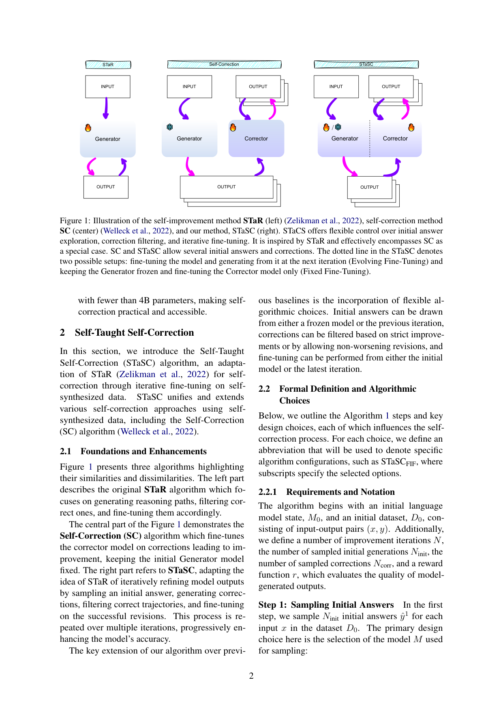
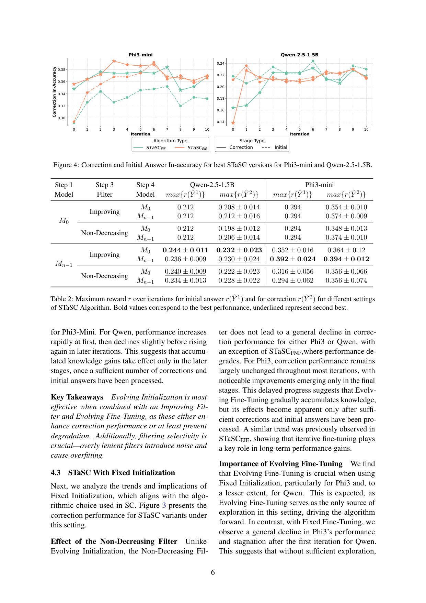

`stasc | STaSC: Self-Taught Self-Correction for Small Language Models | Skoltech + HSE + Univ. Hamburg | 2025-03(arXiv:2503.08681v1) | L? 推理/自我纠错（参数化、迭代自训练 STaR 系）· 相关性 High`

> 档位：**deep**（全字段三层 + 结构化抽取）。所有内容基于已下载 PDF 正文（_txt_stasc.txt，全文 + 附录）。

══ 第一层：一眼看懂 [light] ══

- 🟦 **TL;DR**：能不能让**小模型(SLM, <4B)在不靠外部工具、不靠更强大模型、不靠人标**的前提下，**只用自己生成的数据学会自我纠错**？STaSC 把 **STaR**(生成→筛对的→拿去 SFT 的自训练范式)改造成"纠错版"：**①采样初始答案 ŷ¹ → ②对每个 ŷ¹ 采样若干"修正" ŷ² → ③用 reward 过滤(只留"改对了/没改坏"的修正对) → ④拿这些成功修正去 SFT**，多轮迭代逐步变强。核心贡献是把一堆现有自纠错方法**统一成一个带可调旋钮的框架**：三个设计选择各两档——初始答案来自**冻结M0**(Fixed)还是**上一轮Mn-1**(Evolving)；过滤是**只留严格变好**(Improving)还是**允许不变坏**(Non-Decreasing, SCoRe 式);微调是从**M0**(Fixed FT)还是从**Mn-1**(Evolving FT)起。SC 算法是其特例。结果(Natural Questions QA)：SLM 确实学会自纠错，且**只训纠错却连初始答案质量也一起涨了**。

- **最巧的一步**：**"用 reward 过滤构造'只含成功修正'的 SFT 数据 + 多轮迭代"** 这一 STaR 内核。抽掉过滤(把改坏的也喂进去)或抽掉迭代，自纠错就学不起来。而本文真正的学术贡献是**那张"三旋钮×两档"的设计空间表**——它系统揭示：**Fixed FT(总从 M0 重训)更稳防漂移、Evolving FT 长期上限高但会累积错误**；**Fixed Init 抗分布漂移、Evolving Init 探索更多样**(§2.2)。抽掉这套消融，论文就只是"又一个 STaR 变体"。

══ 第二层：为什么做（写透，重点） ══

- **研究背景**：现代 LLM 已能做复杂推理/元推理，但**即便最强模型也易出错**(幻觉、逻辑不一致)，常需外部验证或人工介入。**自我纠错**(self-correction，模型修正自己的输出)由此兴起。【原文 §1】

- **解决的具体痛点**：现有自纠错几乎都**作弊**——要么用 zero-shot prompting、要么用**外部评估器/工具**给反馈、要么**用大型闭源模型且只盯数学题**(SCoRe)。这带来三个问题：(1) 外部资源现实中常不可得或太贵；(2) **依赖外部验证根本没逼 LLM 发展出内生的推理/自改进能力**(等于把判题外包了)；(3) 真正"在同一模型内、不靠外部"的自纠错几乎没人系统做过，唯一的 SCoRe **缺形式化框架、用闭源大模型、不开源**，难以接续研究。本文要在 **SLM(<4B) + 纯自生成数据 + 无外部** 这个最苛刻设定下验证"自纠错能否被自学会"。【原文 §1 + §5】

- **相关工作 & 各自不足**(§5)：
  1. **外部反馈派**(CRITIC/Active RAG/Logic-LM)：用外部知识/验证工具，评估质量高，但**资源昂贵且没锻炼模型内生能力**。
  2. **intrinsic 但用外部 critic 派**(REFINER/Welleck SC)：用在合成错误上训练的外部模型或自生成修正，但**仍依赖外部 critic 模型**，更接近"基于验证的生成"而非真正的自纠错。
  3. **SCoRe(Kumar 2024)**：唯一在同模型内做 intrinsic 自纠错、引入多轮 RL，但**缺形式化基础、未深入研究基线算法的各种变体、用大型闭源模型、不开源**。【原文 §5 末】

- **动机链**：现状(自纠错火但都靠外部/大模型/只数学) → 缺陷(外部资源贵、没练内生能力、SLM 上无人验证、SCoRe 不可复现) → **所以要在"SLM + 纯自生成数据 + 无外部 + 推理时不给 reward"的真·无监督设定下做** → 但"自生成数据训自纠错"有一堆隐藏设计选择(初始答从哪采、怎么过滤、从哪微调)从未被系统拆解 → **所以把 STaR 思想适配成自纠错，并把这些选择显式化成"三旋钮×两档"的统一框架**(SC 成为其特例) → 用消融揭示每个旋钮如何影响学习动态。为什么不直接用 SC 或 SCoRe？因为它们是这个空间里的**单点**，没回答"为什么这样选、换一档会怎样"。【原文 §1+§2】

- **与最近邻工作的 Δ**：
  - **vs STaR(Zelikman 2022)**：STaR 自训练的是**推理路径**(生成→筛对→SFT)；STaSC 的关键 Δ 是把对象换成**"修正(correction)"**——多了"采初始答→采修正→按 reward 比较 ŷ²>ŷ¹ 过滤"这一纠错专属环节。
  - **vs SC(Welleck 2022)**：SC = STaSC 的特例(Fixed Init + Improving Filter，且 generator 冻结只训 corrector)。STaSC 的 Δ 是**把"初始答来源/过滤准则/微调起点"全部参数化**，并系统比较各档(图2/图3)。
  - **vs SCoRe(Kumar 2024)**：SCoRe 提了 Non-Decreasing Filter 思想但用大闭源模型+多轮RL；STaSC 的 Δ 是**用迭代 SFT(非RL)、在开源 SLM 上、给出形式化框架与可复现代码**，并实测 Non-Decreasing Filter 在不同档下的好坏(§4.2/4.3)。

══ 第三层：怎么做 + 靠不靠谱 ══

- **方法流水线**(Alg.1，每轮 n=1..N)：输入初始模型 M0、数据 D0、迭代数 N、采样数 Ninit/Ncorr、reward r →
  ① **Step1 采初始答**：对每题 x 采 Ninit 个 ŷ¹(旋钮1：用冻结 M0=Fixed Init，还是上一轮 Mn-1=Evolving Init)；
  ② **Step2 采修正**：对每个 ŷ¹ 用 Mn-1 采 Ncorr 个修正 ŷ²；
  ③ **Step3 过滤(旋钮2)**：D⁺={r(ŷ²)>r(ŷ¹)}(Improving，只留严格变好)，或 D⁺∪D⁼(Non-Decreasing，把"已对且没改坏"也留下，r(ŷ²)=r(ŷ¹)≥t)；
  ④ **Step4 微调(旋钮3)**：在 Dn 上训出 Mn，**只对修正 token 算梯度**(旋钮3：从 M0=Fixed FT 重训，还是从 Mn-1=Evolving FT 续训)。
  多轮重复，逐步提升准确率。输出：会自纠错的 SLM。

- **逐组件必要性**(本文核心就是逐旋钮消融，图2/3/4 + 表1/2)：
  - **过滤(filtering selectivity)**：**关键且有强消融**。Evolving FT 下 Phi3 所有设置呈"过滤越宽松→纠错增益越差"的**显著负相关 r=−0.51, p<.001**(§4.2)；Fixed Init+Fixed FT 下用 Non-Decreasing(更宽松)进一步恶化(§4.3)。证明**宽松过滤=引入噪声→过拟合**。
  - **初始答探索(Init 旋钮)**：Evolving Init 探索更多样、Fixed Init 抗漂移。§4.1 发现**探索初始答比探索修正影响更大**(对弱模型 Qwen 尤甚，greedy 时第一轮根本采不到 improving correction、不收敛)；但 Phi3(更强)反而从"探索修正"获益更多——**最优旋钮随模型能力而变**。
  - **迭代微调(FT 旋钮)**：Evolving FT 长期上限高(知识累积，效果在后期迭代才显现)但有累积错误风险；Fixed FT 防漂移更稳。Fixed Init 下 **Evolving FT 是唯一探索来源**，缺它则 Phi3 退化、Qwen 第一轮后停滞(§4.3)。
  - **迭代本身**：图2/3 横轴 0-10 轮，多数增益靠多轮累积。
  - 最优配置：综合表2，**STaSCEIE 与 STaSCEIF(Evolving Init + Improving Filter)最强**，凸显 Evolving Init 与 Improving Filter 的关键作用。

- **关键机制/公式直觉**：
  - **reward 过滤(Step3)**：直觉是"只把'确实把错改对'的修正当正例教模型"，r(ŷ²)>r(ŷ¹) 这个不等式就是"修正有效"的硬标准。Improving vs Non-Decreasing 的区别在于**要不要把"本来就对、没改坏"也算正例**——后者保留正确答案但若过滤不严会混入噪声。
  - **只对修正 token 算梯度却带动初始答变好(§4.4)**：这是最有意思的发现——梯度只更新 correction tokens，但初始答准确率也涨。直觉解释(原文)：学修正要么**增强了模型的事实知识**、要么**改善了初始生成阶段的内部推理**。Evolving FT 还会逐步**缩小初始答与修正的 gap 直至对齐**(Phi3 是初始答追上修正、Qwen 是修正被稳到初始答水平)。
  - **Fixed vs Evolving 的稳定/探索权衡**：Fixed(总从 M0)= 每轮重置防 drift；Evolving(从 Mn-1)= 持续适应但会复合错误。这正是"探索↔稳定"的离散化。

- **实验与证据**：
  - **数据集/设置**：Natural Questions(事实型简单 QA)，train/test 各 500 子集；reward=**In-accuracy**(生成答是否包含参考答，0/1)；**推理时不给 reward**(真·无监督评估)。模型 Qwen2.5-1.5B + Phi3-mini，2-shot，1 epoch、batch 8、lr 7e-6，2×A100、~80 GPU 时。【原文 §3 + 附录A】
  - **核心主张证据**：(1) 表1+图2/3 证明 **SLM 确实能用自生成数据学会自纠错**(修正准确率随迭代上升)；(2) 图4 是**最关键发现图**——最优 STaSC 版本里**修正准确率与初始答准确率双双改善**(只训纠错也带动初始答涨)；(3) §4.1 量化 Ninit/Ncorr 影响并给出每模型最优(Qwen (5,5)、Phi3 (1,5))。
  - **baseline 公平性**：主要是**内部消融对比**(不同旋钮组合)，而非与外部强方法比——这与其定位(系统拆解设计空间)一致，但**没有与 SCoRe/SC 等外部方法在同一表里直接打擂**，只在叙述里说 SC 是特例。
  - **"看着强但需警惕"的点**：(1) 全部**单次运行**(原文 Limitations 承认),误差棒来自迭代而非多 seed，结论稳健性存疑；(2) 只在 **NQ 一个简单事实 QA** 上验证,reward(答案包含参考)对长链推理/开放题会噪;(3) 绝对数值不高(Phi3 修正准确率 ~0.38、Qwen ~0.22),提升是相对的;(4) 不同模型最优旋钮相反(Phi3 爱探索修正、Qwen 爱探索初始答),说明**结论高度依赖模型**,通用性有限。

- **假设与失效边界**：
  - 【原文 §2.2 + Limitations】**Evolving FT 长期上限高但显式承认"累积/复合错误风险"**；宽松过滤导致过拟合(§4.2 负相关)。
  - 【原文 Limitations】**SLM 容量限制**可能制约自纠错程度；**单次运行**有变异性；**仅 QA 任务**；超参可能未最优；reward 函数不完美。
  - 【推断，依据 §4.1/4.4】**强依赖 reward r 可靠判定输出质量**——NQ 这种"答案包含即对"简单可判，开放/长链推理上过滤信号会更噪、双双改善现象未必复现。
  - 【推断】**最优旋钮随模型能力变**(弱模型需更多初始答探索、强模型需更多修正探索)——没有通用最优配方。

- **祛魅总结**：
  - **真贡献(硬货)**：(1) 把散落的自纠错自训练方法**统一成"三旋钮×两档"的清晰设计空间**(SC 成特例),这是干净的概念贡献;(2) 一系列**有据的消融发现**——过滤选择性(r=−0.51)、初始答探索>修正探索(弱模型)、Evolving vs Fixed 的稳定/探索权衡、"只训修正带动初始答变好"——都是可迁移的经验规律;(3) **开源代码+轻量模型**,补了 SCoRe 不可复现的坑。【推断】
  - **包装/营销成分**：标题"Self-Taught Self-Correction"听起来很自主,本质是**STaR 换个训练对象(修正)的迭代 SFT**,算法内核并不新;**绝对性能很弱**(Qwen 修正准确率才 ~0.22),提升只在相对意义上;只在**一个简单事实 QA**、**单次运行**上验证,结论的统计可靠性与跨任务普适性都打折扣;不同模型最优配置相反,意味着"哪个旋钮好"没有一致答案——更像是"探索性研究/设计空间地图"而非给出最优方法。【推断】
  - 作者**相当诚实**：Limitations 列了六条(容量/单run/单任务/超参/分析深度/reward),且明确把 SC 标为特例、把工作定位为"提供 insight"而非刷 SOTA。【推断】

══ 结构化抽取（供全景汇总，必填） ══

- 🎯 **机制速览 6 轴** [light]：

| 维度 | 内容 |
|---|---|
| **学什么信号** | **reward 函数 r**(评估输出质量，QA 任务即答对/答错)筛选自生成修正；**纯自合成数据，无外部工具/无更强 teacher/无人标** |
| **改什么** | **参数**(对筛出的成功修正做 SFT，仅对 correction token 算梯度) |
| **何时改** | **离线批量、多轮迭代**(N 轮，每轮：采样初始答→采样修正→过滤→SFT) |
| **免梯度?** | **否**(迭代 SFT，全程梯度更新) |
| **记忆-技能生命周期** | 不适用——自纠错能力内化进**权重**；"数据"每轮重新自采样，非持久记忆库 |
| **防遗忘机制** | **隔离/不漂移**(Fixed FT 档每轮都从原始 M0 重训以防 drift；Fixed Init 档用冻结 M0 采初始答保持一致性)——这是本文显式讨论的"防累积错误/防漂移"旋钮 |

- ⑦ **开源代码 + 框架/harness**：开源，https://github.com/VityaVitalich/STASC （原文称 user-friendly、可适配的自纠错算法代码 + 轻量模型）。**框架：标准迭代 SFT(STaR 系自训练)**，无专门 RL 库；用 FSDP(Fully Sharded Data Parallel)训练，模型为 Qwen2.5-1.5B + Phi3-mini，1 epoch、batch 8、lr 7e-6、Adam+cosine。【原文 §3 + 附录A】
- 💰 **资源/成本与可扩展性**：面向 **SLM(<4B)** 的低成本场景是卖点；2×A100、**总计约 80 GPU 时**；数据 Natural Questions 各 500 train/test 子集；无外部 API/工具调用成本。【原文 附录A】

- 🎯 **对"探索-巩固"idea 对标** [light]：**支撑 + 可借组件**。STaSC 是"**自生成轨迹→筛选→自训练**"把纠错能力**巩固进权重**的最小可行配方，且**显式把"探索(Evolving Init 更多样) vs 稳定(Fixed Init/Fixed FT 防漂移)"做成可调旋钮**——这正对应你"探索-巩固"权衡的离散化表述，可直接借为消融设计模板。其 **Improving vs Non-Decreasing 过滤准则**(留严格变好 / 允许不变坏)可迁移为 path-recovery 训练数据的筛选标准；"只训修正却带动初始答变好"(§4.4)对"教 path-recovery 是否反哺 path-selection"是个直接的正向证据。属"参数化、无 MTP"路线：它靠 reward 事后过滤而非前瞻信号决定哪条修正轨迹值得学。

- 🔭 **开放问题/未来方向**：
  - 【原文 Limitations】扩到 QA 之外的任务/域；多 seed 验证降低变异；更细的"修正类型/模式"分析；更优 reward 函数。
  - 【推断】把"用哪档旋钮"从手工试做成自适应(按模型能力/迭代阶段动态切换);把事后 reward 过滤升级为前瞻信号筛选(MTP)。

- 🖼 **关键图 top-2** [light]：
  
  这是**原文图1**：核心概念图，把 STaR(自改进)、SC(自纠错)、STaSC(统一+可调)三者的数据流并排，并标出 STaSC 新增的灵活旋钮。选它因为它一图说清本文"统一+扩展"的定位与 SC 为何是特例。
  
  这是**原文图4**：核心发现图，展示迭代中纠错准确率与初始答准确率**双双改善**(即"只训纠错也带动初始答变好")。选它因为这是论文最关键的实证主张。
