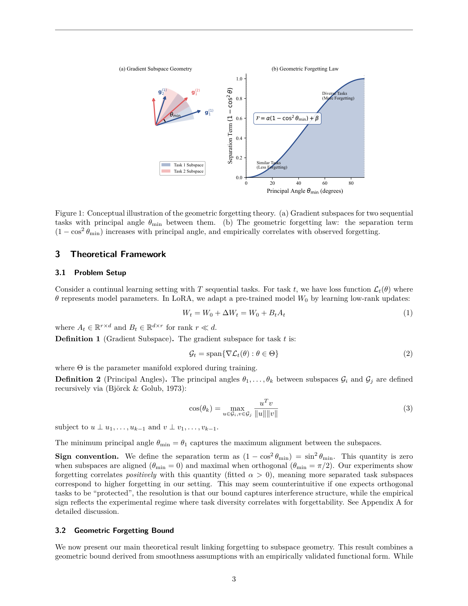
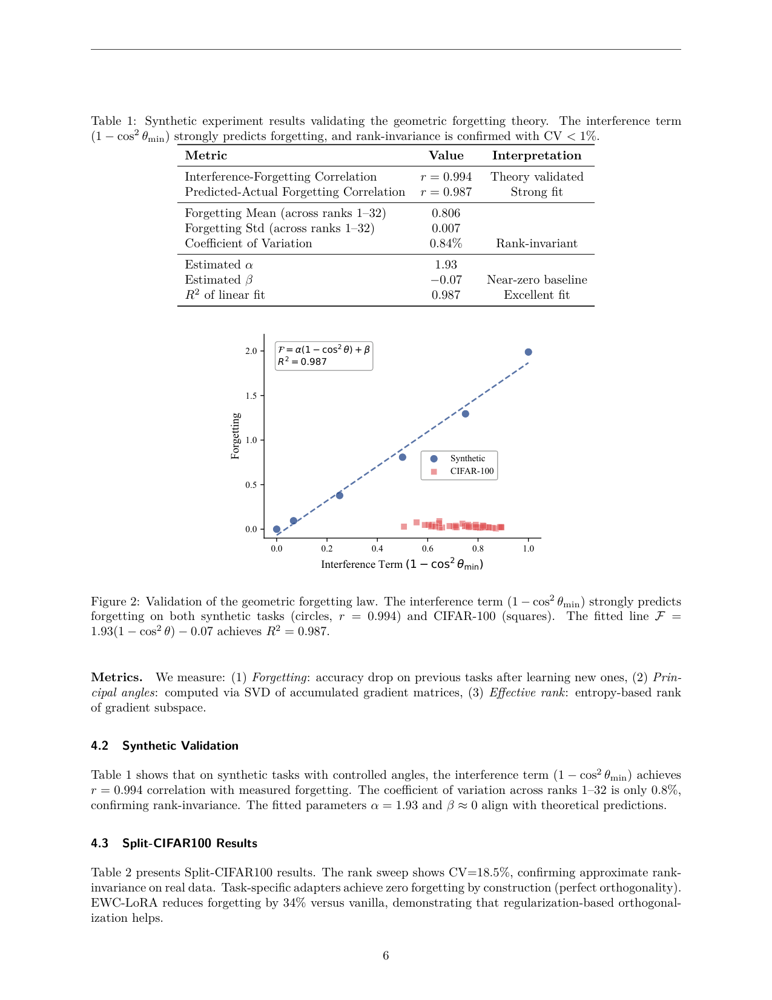

`subspace_geometry_lora | Subspace Geometry Governs Catastrophic Forgetting in Low-Rank Adaptation | Georgia Institute of Technology（Brady Steele，单作者） | 2026-02 arXiv:2603.02224v1(10 Feb 2026) · 预印本 | 防遗忘机理/梯度子空间几何 主线 · 中-高相关（LoRA 持续学习的几何遗忘律，可借诊断组件）`

> 三标注约定：【原文】=论文直述；【推断】=有据判断(附依据)；【待核】=拿不准的关键事实。

══ 第一层：一眼看懂 ══

- 🟦 **TL;DR**:用 LoRA(只训低秩增量 ΔW=BA 的省参微调)做"持续学习"(任务一个接一个学)时,为什么会忘掉旧任务?本文给一条**几何遗忘律**:`F = α(1 − cos²θ_min) + β`,其中 **θ_min 是相邻两任务"梯度子空间"之间的最小主夹角**(principal angle,衡量两组梯度方向有多对齐)。核心论断有二:① **遗忘主要由这个夹角决定,而非 LoRA 的秩 r**——在足够正交(高夹角)区,把秩从 1 调到 32 遗忘几乎不变(合成数据上变异系数 CV≈0.8%);② 这条律还**调和了文献矛盾**:Biderman(2024)说"秩越高越忘",本文说"秩无关",其实**两者各对一个区**——任务相似(低夹角)时秩才有影响,任务多样(高夹角)时秩无关。另外,显式正交化方法(O-LoRA)在"自然正交度已高"时几乎无收益。【原文 摘要+§3+§5】

- **最巧的一步**:把"遗忘"和"梯度子空间主夹角"用 **一个可拟合的显式函数式 (1−cos²θ_min)=sin²θ_min** 绑起来。抽掉这个"显式参数化",全文就退回 OGD/GPM 那套"正交化减遗忘"的**定性**老结论(作者自己在"Clarification of novelty"里坦承几何洞见不新)。**真正的新意=从定性到可定量预测 + 揭示秩-夹角的分区交互**。所以"那条公式 + 分区图景"就是命门。【原文 §1 Clarification, §3.4】

- ⚠️ **关键反直觉(必须先说清,否则会误读)**:常识以为"任务越正交越不互相干扰、越该被保护",但本文拟合出 **α>0**,即在它的实验设置里 **夹角越大(越正交)→ 遗忘反而越多**。作者解释这是**实验 regime 的混杂**:在预训练模型上,夹角小的任务往往"表示相似、更易迁移、本就更难忘",于是"夹角-难度"耦合,使经验符号与"正交=保护"的朴素直觉相反(§3.1 Sign convention + 附录A Step 6)。**这条律是"经验回归 + 几何骨架"的混合体,不是纯推导定理。**【原文 §3.1, 附录A】

══ 第二层:为什么做 ══

- **研究背景**:大模型持续学习的根本矛盾——学新任务别毁旧能力。LoRA 把更新限制在低秩子空间,但"这个低秩约束如何影响遗忘"理论上不清楚。同时,梯度下降已知发生在"很小的子空间"里(Gur-Ari 2018),催生了 OGD/GPM/O-LoRA/InfLoRA 等基于子空间的持续学习方法。【原文 §1, §2】

- **解决的具体痛点**:① 现有子空间方法只给"正交化能减遗忘"的**定性**原理,**没有把夹角→遗忘量化成可预测的函数式**;② 文献对"LoRA 秩是否影响遗忘"**结论打架**(Biderman 说影响,直觉上低秩应更省更稳),缺统一解释;③ 实践者不知道"该不该为了防遗忘而压低秩""什么时候该上 O-LoRA 这类正交方法"。【原文 §1, §2 LoRA and Forgetting】

- **相关工作 & 各自不足**:
  - *PEFT*:LoRA(Hu 2022)、AdaLoRA(自适应秩)、QLoRA、DoRA、正交初始化——关注怎么调秩/量化/分解,**没回答"秩对持续学习遗忘何时重要"**。【原文 §2】
  - *梯度子空间方法*:OGD(把梯度投影到旧任务子空间的正交补)、GPM(SVD 维护旧子空间)、O-LoRA/InfLoRA(把这套搬进 LoRA)、Lie 群几何/PLAN/Sculpting——**都用了子空间几何,但没给"夹角→遗忘"的预测函数式**。本文贡献正是这个显式 (1−cos²θ_min) 参数化 + 秩-夹角分区刻画。【原文 §2, §5.3】
  - *LoRA 与遗忘*:Biderman(2024,"LoRA learns less and forgets less")发现高秩更忘——本文用"指令微调任务夹角低→落在秩敏感区"来调和。并发几何 PEFT 工作(GRIT 曲率感知、正交梯度投影、残差子空间 KeepLoRA)也被定位为"本律提供理论上下文"。【原文 §2, §5.1】

- **动机链**:LoRA 持续学习要少遗忘 → 已知正交化有用但只是定性 → 给出可预测函数式 F=α(1−cos²θ_min)+β(§3.2,Taylor 展开给骨架 + 经验拟合定系数)→ 若有效秩饱和(经验观察 A4),则 F 与名义秩无关 → 推出"高夹角区秩无关"(Corollary 2)→ 但 Biderman 说秩有关 → 用 r_eff(θ,r)=min(r, c/(1−cosθ)) 统一:低夹角秩有关、高夹角秩无关(Prop 3)→ 实验在合成/CIFAR/GLUE 上验证 + 解释 O-LoRA 何时有用。【原文 §3-§5 逻辑链】

- **与最近邻(OGD/GPM + Biderman)的 Δ**:
  - vs OGD/GPM:它们**做投影来减遗忘**,本文**不提新方法、只提预测律**——把同一几何思想从"算法"变成"可量化的诊断/解释"(夹角→遗忘可预测,投影=把 (1−cos²θ_min) 推向 0)。
  - vs Biderman:Biderman 给"秩↑→遗忘↑"的经验观察,本文加一个**夹角维度**把它**限定到低夹角区**,并指出高夹角区秩无关。**为什么有用**:给实践者一条"别盲目压秩防遗忘——先看任务夹角"的可操作判据。【原文 §1, §5.1-§5.3】

══ 第三层:怎么做 + 靠不靠谱 ══

- **方法/论证流水线(理论 + 验证型)**:
  1. **问题设定(§3.1)**:T 个顺序任务,LoRA 更新 ΔW_t=B_tA_t;定义任务 t 的"梯度子空间" G_t=span{∇L_t};用主夹角(principal angles,Björck-Golub 递归定义)刻画 G_i 与 G_t 的对齐度,取最小主夹角 θ_min。分离项 (1−cos²θ_min)=sin²θ_min(对齐时 0、正交时 1)。
  2. **几何遗忘界(§3.2,Theorem 1)**:在(A1)子空间训练中稳定、(A2)干扰主要发生在相邻任务、(A3)损失局部 L-光滑、(A4 经验)高夹角下有效秩饱和 四假设下,F_{i,t} ≤ α(1−cos²θ_min)+β。**证明骨架**:对 F_{i,t}=L_i(θ_t)−L_i(θ_{t−1}) 做 Taylor 展开;把更新 Δ_t 分解为平行/正交于 G_i 的分量,**一阶项 ∇L_i·Δ_t 在 Δ_t⊥G_i 时为零**,残余遗忘来自二阶曲率项 → 得 (1−cos²θ_min) 依赖。**关键诚实**:作者明说 A4 是经验观察、具体函数式是"经验验证的参数化",故称"几何界 + 经验参数化",非纯演绎。
  3. **秩无关推论(§3.3,Corollary 2)**:若有效秩 r_eff 饱和到常数(经验上 ≈1),则界与名义秩 r 无关 → 解释"秩 1→32 遗忘几乎不变"。
  4. **秩-夹角交互(§3.4,Prop 3)**:r_eff(θ,r)=min(r, c/(1−cosθ)) —— θ≈0 时 r_eff→r(秩有关),θ≈π/2 时 r_eff→c(秩无关)。统一矛盾。
  5. **三层验证(§4)**:合成(可控夹角)→ Split-CIFAR100(ViT-LoRA)→ Sequential GLUE(RoBERTa-LoRA);测遗忘、主夹角(SVD)、有效秩(熵)。

- **逐组件必要性**:
  - *主夹角 θ_min*:核心自变量;合成数据上 (1−cos²θ_min) 与遗忘相关 r=0.994(表1)。✔强支撑。
  - *有效秩饱和(A4)*:秩无关推论的命门;附录C 实测 rank-16 适配器平均有效秩仅 1.3±0.2,佐证饱和。✔有证据但是经验性的(非证明)。
  - *秩-夹角分区(Prop 3)*:调和 Biderman 的关键;表6——pooled r=−0.578(混杂)、低夹角区 r=0.68(秩有害=Biderman 区)、高夹角区 r=0.12(秩无关=本文区)。✔有分区证据。
  - *逐层分析(§4.5)*:用来抢救"CIFAR 上整体相关竟为负 r=−0.507"的反例——逐层看 6/7 层正相关、整体 r=0.525,把负相关归因于"难度混杂(r=−0.42)"。✔补救但说明整体证据脆弱。

- **关键机制直觉**:核心是 Taylor 展开的"一阶项消失"。更新 Δ_t 与旧任务梯度方向越正交,**一阶遗忘(∇L_i·Δ_t)越接近 0**,只剩二阶曲率残余 → 这是 (1−cos²θ_min) 的来历。但**经验符号 α>0** 说明在其设置里"夹角越大遗忘越多",与一阶直觉相反——作者把它归到"几何骨架定形状、经验拟合定方向,而方向被任务难度-夹角耦合主导"。所以这条律的**形状**靠几何,**符号/数值**靠数据。【原文 §3.2+附录A】

- **实验与证据**:
  - 数据集/设置:**合成**(生成指定主夹角的梯度矩阵,U2=U1cosθ+Vsinθ);**Split-CIFAR100**(ViT-Base + LoRA,秩{4,8,16},α=16,Adam lr 1e-4,5 epoch/任务,5 seed);**Sequential GLUE**(5 任务 SST-2/MRPC/RTE/QNLI/QQP,RoBERTa-base + LoRA,秩{4,8,16},AdamW lr 2e-5,3 epoch,3 seed)。【原文 §4.1】
  - **支撑核心主张的关键实验/数字**:合成上 (1−cos²θ_min)↔遗忘 r=0.994,预测-实际 r=0.987,跨秩 1–32 遗忘均值 0.806、std 0.007、**CV 0.84%**,拟合 α=1.93、β≈−0.07(表1+图2)。真实数据:CIFAR CV=18.5%、GLUE CV=9.9%(表2/3),即"近似"秩无关。
  - **最有说服力的一张**:图2——合成(r=0.994)+ CIFAR 散点都落在拟合直线 F=1.93(1−cos²θ)−0.07(R²=0.987)上,是"夹角预测遗忘"这一中心主张的直接证据。
  - **O-LoRA 对照(图5/表5)**:CIFAR(rank8)上 vanilla 13.5% vs O-LoRA 12.9%,p=0.73 不显著、Cohen's d=−0.22;两者夹角都 ~1.05 rad(~60°)——说明 vanilla LoRA 本就接近正交,显式正交化无增量。✔印证"O-LoRA 只在低自然正交度时有用"。
  - *"看着强但没回答核心"的隐患/不公平*:① **真实数据的核心相关其实很弱甚至反号**——CIFAR pairwise 角-遗忘相关 r=−0.507(与理论反!),靠逐层分析 + 难度混杂解释才"救回"r=0.525;② 统计功效弱:仅 3 个秩值、3–5 seed、8–10 任务对,作者自承 n=8 时 r=0.5 的 95%CI 宽达 [−0.2,0.9];③ 强证据几乎全来自**合成数据(自己构造夹角)**,真实 benchmark 上证据"近似且混杂"。【原文 §4.3-§4.5, §6 自承】

- **假设与失效边界**:
  - 【原文】(A1)子空间训练中稳定、(A2)干扰仅相邻任务、(A3)局部 L-光滑、(A4 经验)有效秩高角饱和——其中 A4 非证明、是观察。
  - 【原文 §6 混杂】"任务难度独立于子空间夹角"在预训练模型上常失败(相似表示→低夹角→也更易迁移),逐层分析只部分缓解。
  - 【原文 §6 相变】秩无关出现的"相变角 ~38°"是经验测得、未理论推导,与 Hessian 谱的联系未知。
  - 【原文 §6 规模】只用 ViT-Base/RoBERTa-base,**能否 scale 到 LLaMA-70B 这类大模型未验**(作者称"框架应普适"但无证据)。
  - 【原文 §4.6 计算】InfLoRA 因 OOM 没能评(全零空间投影对累积梯度矩阵太贵);算主夹角 O(d²k) 也贵,难实时部署。
  - 【推断】这是 **CV/小模型 + 分类/GLUE 任务**的结论,迁到生成式 LLM 的"指令/推理"持续学习,夹角-难度耦合可能完全不同,符号甚至可能再翻转。依据=§6 规模限制 + 符号约定的 regime 依赖性。

- **祛魅总结**:
  - **真贡献(硬货)**:(a)把"子空间夹角→遗忘"做成一个**可拟合、可预测的显式函数式**(此前只有定性),并在合成数据上拟合极好;(b)**秩-夹角分区**这个 conceptual framing 漂亮地调和了"秩是否影响遗忘"的文献矛盾,给出"别盲目压秩、先看任务多样性"的实用判据;(c)**论文极其诚实**——主动标注 A4 是经验、符号反直觉、真实数据相关弱、统计功效不足,这种 self-skepticism 在预印本里少见,值得信任。
  - **包装/可能高估**:标题"Governs(支配)"偏强——真实 benchmark 上证据其实"近似且混杂"(CIFAR 整体相关一度为负);"Theorem 1"实为"几何骨架 + 经验拟合",作者自己反复降级表述。把它当"经验规律/诊断启发"而非"定律"更合适。【推断:依据=§3.2/§6 多处自承 + 图2 强证据集中在合成数据】
  - **可能低估 / 注意**:**未提供任何开源代码链接**(全文 grep 无 github),复现需自己实现;且核心强结论依赖"自己构造夹角"的合成实验,外部效度有限。【推断:依据=全文无代码声明 + §4.1 合成主导】

══ 结构化抽取 ══

- 🎯 **机制速览 6 轴**:

| 学什么信号 | 改什么 | 何时改 | 免梯度? | 记忆-技能生命周期 | 防遗忘机制 |
|---|---|---|---|---|---|
| 监督标签(分类/NLI 交叉熵;持续学习多任务序列) | **参数**(LoRA 低秩增量 ΔW=BA;分析对象=梯度子空间几何) | **离线批量**(任务序列,每任务数 epoch) | **否**(标准基于梯度的 LoRA 微调;本文是分析+预测律,不提免梯度法) | 不适用(无记忆库/技能库;研究参数级持续学习的遗忘) | **梯度子空间正交化(几何)**:遗忘∝(1−cos²θ_min),正交化(OGD/GPM/O-LoRA)把分离项推向 0 减一阶干扰;并指出"秩无关"区 + 任务专属 adapter 可零遗忘(by construction)。⚠经验符号 α>0 受难度混杂。【原文 §3, §5.3】 |

- ⑦ **开源代码 + 框架/harness**:**未开源 / 未找到**(全文及附录均无 github/代码可得性声明,grep 确认无匹配)。实现栈(从正文推断,非代码核验):LoRA(标准 PEFT 低秩)、ViT-Base / RoBERTa-base、Adam/AdamW;对照实现 O-LoRA;尝试但因 OOM 放弃 InfLoRA。**无 RL 训练框架**(纯监督持续学习)。【原文 §4.1, §4.6;代码缺失=本子代理 grep 全文确认】

- 💰 **资源/成本与可扩展性**:模型小(ViT-Base/RoBERTa-base),单卡可跑。**核心成本痛点**:① 计算主夹角对大梯度矩阵是 **O(d²k)**,难实时;② **InfLoRA 因全零空间投影 OOM 未能评**(说明这类投影法在多任务累积梯度上扩展性差);③ 秩无关结论的实用含义=可用**更小 adapter** 省内存/算力(作者列为正面影响)。绝对算力/时间原文未给。【原文 §4.6, §6, Broader Impact】

- 🎯 **对"探索-巩固(探索→巩固)"idea 对标**:**可借诊断组件 + 弱关联(机理参考)**。
  - *可借组件*:**"主夹角作为遗忘诊断"**——TSRD 巩固阶段若要监控"新学的 path-recovery/技能会不会冲掉旧能力",可借"算新旧任务梯度子空间主夹角、用 (1−cos²θ_min) 预测干扰"作为**轻量诊断信号**,据此决定是否需要正交投影/隔离。**"任务专属 adapter=零遗忘(by construction)"** 也是个可借的隔离思路(对应 6 轴"隔离"防遗忘)。
  - *机理参考*:与 retaining_by_doing(on-policy→mode-seeking 防遗忘)、mech_origins(RL=分布式电路、SFT=压缩)同属"为什么会忘"的机理线,但本文是**LoRA 子空间几何视角、CV/NLP 小模型、纯监督**,不涉 RL/on-policy。
  - *缺口/区别(为何只是弱关联)*:① 它**不提防遗忘新方法**,只给预测律;② 实验是 **ViT/RoBERTa 分类任务**,非生成式 LLM 的推理/agent 持续学习,外部效度存疑;③ 经验符号反直觉且受难度混杂,直接拿"高夹角→多遗忘"指导 LLM 巩固很危险;④ **未开源**,迁移成本高。TSRD 更可能把"主夹角诊断"当一个**可选探针**,而非采纳其整套律。【推断:依据=§4.1 任务域 + §6 规模/混杂限制 + 项目 TSRD/OPD 主线】

- 🔭 **开放问题/未来方向**:
  - 【原文 §6/§7】从理论推导相变角(~38°)、连到损失景观(Hessian 谱);把律扩到 LoRA 之外的 adapter 架构;scale 到更大模型(LLaMA-70B);报告 bootstrap 置信区间、增大样本以提升统计功效;显式控制任务难度以解耦"夹角-难度"混杂。
  - 【推断】在生成式 LLM 的指令/推理持续学习上重测(符号是否翻转);把"主夹角"做成在线监控信号驱动自适应秩/正交投影。依据=§6 规模限制 + §5.2 实用指南。

- 🖼 **关键图 top-2**:

  
  这是**原文 Figure 1**(概念主图):(a)两个顺序任务的梯度子空间及其最小主夹角 θ_min;(b)遗忘律曲线 F=α(1−cos²θ_min)+β,分离项随主夹角增大而升(标注"相似任务=少遗忘 / 多样任务=多遗忘")。选它因为一图说清全文唯一核心对象(主夹角)与那条预测律的形状——这是论文立论的全部直觉。

  
  这是**原文 Figure 2**(验证主图,同页含 Table 1):横轴干扰项 (1−cos²θ_min)、纵轴遗忘,合成数据(圆,r=0.994)与 CIFAR-100(方)都贴合拟合直线 F=1.93(1−cos²θ)−0.07(R²=0.987)。选它因为这是"夹角能预测遗忘"这一中心主张最直接的定量证据(也暴露:强相关主要来自合成圆点,真实方点更散——便于读者校准可信度)。

──────────
**幂等状态**:本文 analysis 首次产出。机制类型 = **防遗忘机理/预测律(参数级·LoRA 梯度子空间几何·纯监督持续学习;非记忆/非技能库;不提新方法)**。⚠注意点:经验符号反直觉(α>0,夹角大反而更忘,受难度混杂)、强证据集中在合成数据、**未开源**。抽到 2 图:是(Figure 1 几何律概念 + Figure 2 验证散点)。
