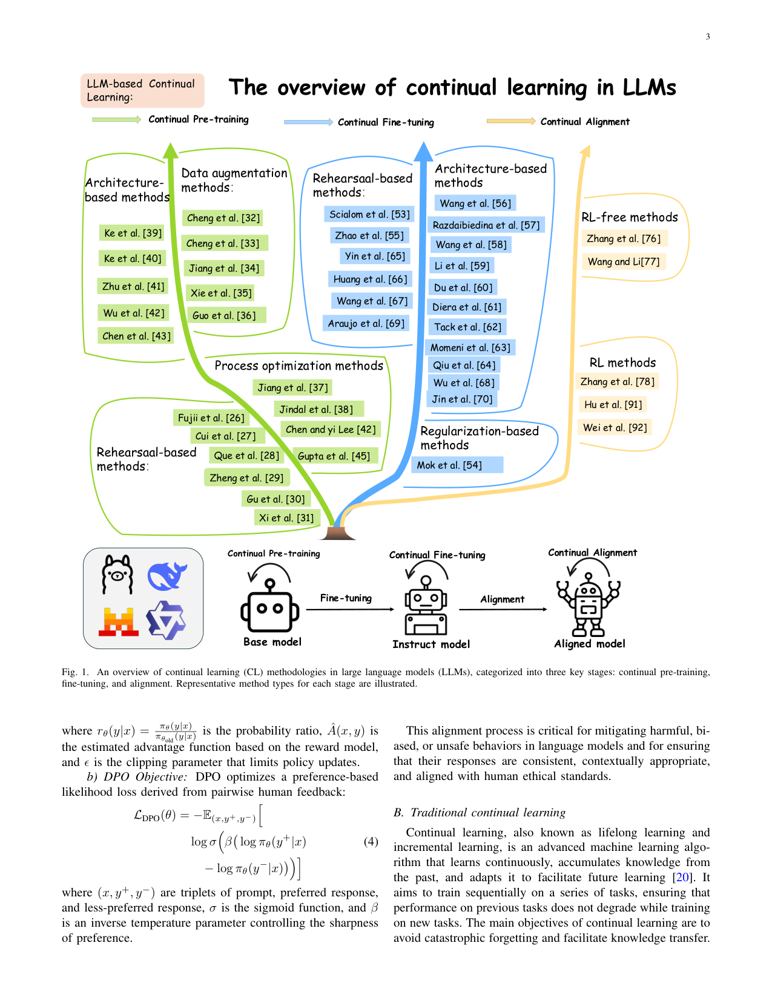
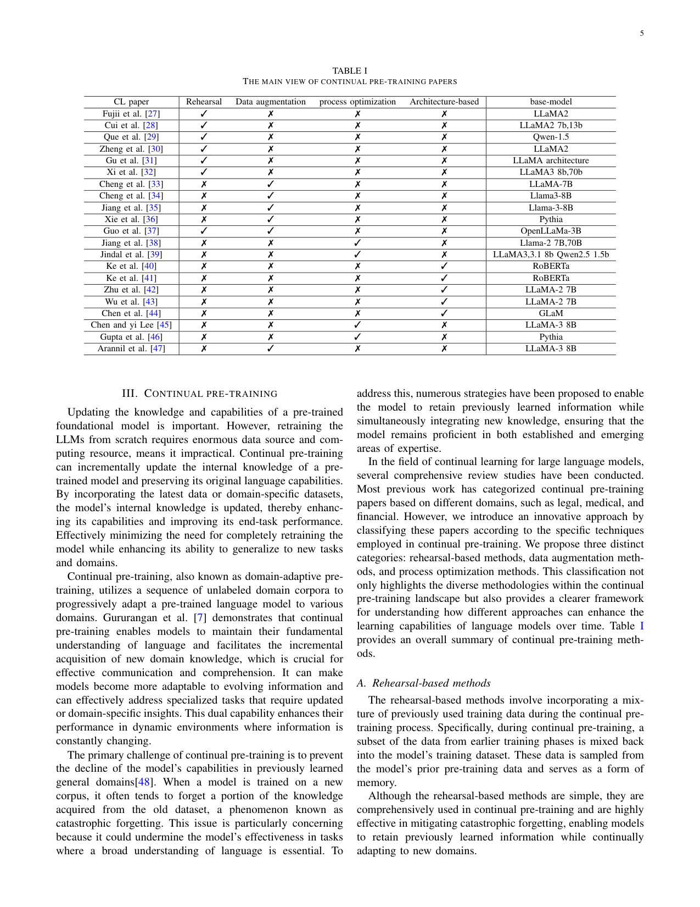

survey_continual_mco | Continual Learning in Large Language Models: Methods, Challenges, and Opportunities | Hongyang Chen 等(含 Xuemin Lin) | 2026-03, arXiv 2603.12658 (IEEE 体例,综述) | 主题线 L4/L6(参数级续学&防遗忘)· 相关性 High(CL 方法学锚)

> [light 档] 综述类 → A 栏抽其分类法。聚焦「参数级」CL(非 agent 记忆),正好补 survey_lifelong 偏 agent 架构、本调研偏 prompt/记忆的盲区。

══ 第一层:一眼看懂 ══
- 🟦 **TL;DR**:【原文 Abstract】这是一篇**专讲「LLM 的持续学习(CL)方法学」的综述**,核心是回答「怎么让 LLM 不断吸收新知识/新任务而不灾难性遗忘」。它的组织主轴是**三个训练阶段**:持续预训练(continual pre-training)、持续微调(continual fine-tuning)、持续对齐(continual alignment)。在每个阶段内,它沿用 CL 经典三分法(rehearsal 回放 / regularization 正则 / architecture 架构),并**再按各自的「遗忘缓解机制」细分**,逐一比较这些传统 CL 方法搬到 LLM 上的适配性与改进。它特别强调 LLM CL 与传统 ML CL 的关键差异:规模、参数高效性、涌现能力;并梳理评测指标(遗忘率、知识迁移效率)和新兴 benchmark。结论:现有方法在特定领域有效,但「跨任务/跨时间尺度的无缝知识整合」仍是根本难题。
- **最巧的一步**:【推断·依据 Abstract + §III/IV/V 结构】把分类法做成**「训练阶段 × 经典CL方法 × 遗忘机制」的三维网格**,而不是平铺方法列表。抽掉「按训练阶段分」这一维,它就和十年前的 CL 综述无异;正因为绑定 LLM 的三阶段(预训练/微调/对齐),它才能讲清「同一个 rehearsal 思想在预训练阶段 vs 对齐阶段实现差异很大」,从而暴露 LLM 特有的 CL 问题。

══ 第二层:为什么需要这综述 + 它如何分类 ══
- **研究背景**:【原文 §I】LLM 的成功建立在**静态预训练范式**上,与真实世界「知识/概念/事件/语言用法不断涌现」的动态本质尖锐冲突。三重现实压力:① 不可能造一个穷尽一切信息的固定数据集;② 隐私/伦理约束使敏感专有数据无法采集,语料天然不完整;③ 在更新数据上重新预训练「极其昂贵」(模型+数据规模巨大)。对照人脑的增量学习能力(学新不忘旧、还能调适旧知识),CL 被立为「高优先级研究方向」。
- **解决的具体痛点**:【原文 §I】核心是「静态预训练范式 vs 真实世界动态性」的根本错配。CL 相对从头训练的卖点:复用已有知识 → 大幅降算力/提效率 + 维持 SOTA,这种「效率×适应性」的协同正是真实部署所需。
- **相关工作 & 各自不足(论文显式点名 §I)**:【原文】已有三篇 LLM CL 综述但各有缺陷——[8] 分三阶段(续预训/域适应预训/续微调)且按领域(医/法/金融)分析,但**缺按底层机制的细粒度方法分类**;[9] 也用三阶段划分但**聚焦应用场景而非方法类型/遗忘缓解机制**;[10] 给了细粒度方法分析但**既不按训练阶段划分、也不只针对 LLM**(还含多模态/扩散模型)。本综述定位:**只针对 LLM CL**,沿三阶段(续预训/续微调/续对齐)系统综述,且在经典三分法(回放/正则/架构)之上**再按遗忘缓解机制细分**——这是它声称的差异化增量。
- **动机链(一条逻辑链)**:【推断·依据 §I】真实知识永远涌现 + 重训练太贵 + 隐私使数据采不全 → 必须低成本增量更新 → 这就是 CL → 但已有 LLM CL 综述要么粗(只到阶段/应用)、要么不专一(混进别的生成模型)→ 所以需要一份「LLM 专属 + 训练阶段 × 机制双维细分」的综述,才能讲清「同一个 rehearsal 思想在续预训阶段 vs 续对齐阶段实现差异巨大」。为什么不直接套传统 CL 综述?因为 LLM 有规模/参数高效性/涌现能力三大特殊性,传统 CL 方法需重新评估适配性。
- **与最近邻工作的 Δ**:【原文 §I + 推断】与最像的 [10]\(细粒度但泛生成模型)相比,关键差异=**绑定 LLM 的「三训练阶段」骨架**(预训/微调/对齐)。为什么这差异有用?因为它能把「续对齐」独立成章(§V 含 RL-free 与 RL 两支、DPO/PPO/GRPO 式公式),这是把「偏好对齐也纳入持续学习」的视角,传统 CV 出身的 CL 综述给不出。

══ 第三层:分类框架细节 + 局限 ══
- **分类框架(三维网格怎么搭)**:【原文 §III–§V】主轴=三训练阶段,每阶段内嵌经典 CL 三分法并再按机制细分——§III 续预训:回放/数据增强/过程优化/架构;§IV 续微调:回放/正则/架构;§V 续对齐:RL-free / RL(含 DPO 目标、PPO/GRPO 式比值-clip)。形成「阶段 × 经典类 × 遗忘机制」三维坐标,每格挂代表工作 + Table I/II 逐篇剖面对比。
- **逐组件必要性**:【推断】「按训练阶段分」这一维是命门——抽掉它就回到十年前的平铺 CL 综述;正因绑定 LLM 三阶段,才能讲清同一 rehearsal 思想跨阶段实现差异。三类机制(回放/正则/架构)是「巩固」步可选的现成积木:回放=存样本重训;正则=约束权重漂移(如 EWC 式);架构=隔离/扩展子模块。综述类无消融,必要性靠「机制可解释 + 文献可归置」论证。
- **关键机制/评测指标(§VI)**:【原文】四指标基于矩阵 a_{i,j}(训练完任务 j 后在任务 i 的表现)——**AP**(平均性能,公式6,末模型在所有任务均值)、**F.Ra**(遗忘率,越高越遗忘)、**FWT**(前向迁移,学新任务时旧知识帮了多少)、**BWT**(后向迁移,学新后旧任务被增益还是被损)。直觉:这套正是量化「巩固进权重时是否引入遗忘 + 是否带正向迁移」的现成度量。
- **基准(§VII)**:【原文】续预训用 MMLU/GSM8K 等通用基准查是否在原域发生遗忘;续微调用 TRACE(多挑战任务)、CITB(续指令微调,长任务流 InstrDialog/++)、Razdaibiedina 的 15-任务长序列基准、StreamBench(测 agent 靠输入-反馈序列持续改进,含共享记忆多智能体基线)。
- **挑战与机会(§VIII,关键)**:【原文】两大根本挑战=灾难性遗忘 + 有限知识迁移。机会六条:① 提性能(含 ProNC 等几何/表征分析——ETF 类原型保持新旧类几何可分、最小化特征漂移,与本调研「几何共识」线呼应);② 多模态 CL(跨模态对齐漂移);③ **RL 方法**(RL 训练的 LLM 更能保留知识,RL 能主动与环境交互促进自适应获取+长期保留);④ **半参数方法**(parametric 更新 + non-parametric 记忆/检索/agent 架构,**解耦记忆存储与参数更新**,在可塑性 vs 稳定性间取更好平衡);⑤ 在线 CL(真实环境任务边界模糊,需从流数据实时学)。
- **假设与失效边界**:见下方原有「假设」条;但**需修正一处**——综述并非完全无视免梯度路线:§VIII-B 把「半参数/non-parametric 记忆」「RL approaches」「在线 CL」明确列为**机会**,只是这些在正文 §III–§V 的方法主体之外、仅作展望;其方法学正文仍是纯参数续训范式。
- **祛魅总结**:【推断】真贡献=一张「阶段 × 机制」细粒度网格 + FWT/BWT/F.Ra/AP 四指标 + 逐篇剖面表,可直接当「巩固」端的方法库与度量库。包装/局限:正文几乎全在梯度续训框架内对抗遗忘,把「CL」窄化为「参数续训」;对 2025 主流的「免梯度自进化/记忆外置/test-time 自适应」只在 §VIII 展望里一笔带过,**未给方法学覆盖**——它把这些当「未来机会」而非「已有范式」,这正是本调研要并置补全的视角差(但比 light 笔记原断言「完全在框架之外」更准确:作者已意识到、只是未纳入主体)。

══ 机制速览 6 轴(综述 → 概括其覆盖) ══
| 维度 | 内容(CL 方法学层面) |
|---|---|
| 学什么信号 | 新语料(续预训练)、新任务标注(续微调)、人类/偏好反馈(续对齐,§V 含 RL-free 与 RL 两支) |
| 改什么 | **聚焦参数**(权重续训/适配器/架构扩展);不涉及 prompt/外部记忆——与偏记忆的综述互补 |
| 何时改 | 离线批量为主(按任务序列阶段性更新) |
| 免梯度? | **否**(全篇是梯度训练范式:回放/正则/架构都在梯度更新框架内防遗忘) |
| 记忆-技能生命周期 | 不以「记忆库」视角;知识直接固化进参数,「遗忘 vs 迁移」是核心张力(§VI 用 FWT/BWT 度量) |
| 防遗忘机制 | **本综述主战场**:回放(rehearsal/replay)、正则(regularization,如约束权重漂移)、架构隔离/扩展(architecture)、数据增强、过程优化;每类按机制再细分并比较 |

══ 抽取的分类法(A 栏核心) ══
**主轴 = 三训练阶段,每阶段一套方法分类:**
- **§III 持续预训练**:A 回放(Rehearsal) / B 数据增强(Data augmentation) / C 过程优化(Process optimization) / D 架构(Architecture)
- **§IV 持续微调**:A 回放(Replay) / B 正则(Regularization) / C 架构(Architecture)
- **§V 持续对齐**:A RL-free 方法 / B 强化学习(RL)方法 〔含 DPO 目标、PPO/GRPO 式比值-clip 公式,见 p3〕
- **§VI 评测指标(4 个核心)**:① 平均性能 AP ② 遗忘率 F.Ra ③ 前向迁移 FWT ④ 后向迁移 BWT(均基于 a_{i,j}=「训练完任务 j 后在任务 i 上的表现」矩阵)
- **§VII Benchmarks**(CL 评测基准)、**§VIII Challenges & Opportunities**(A 挑战 / B 机会)
前置:§II 预备(A LLM / B 传统CL / C LLM 中的 CL)。

══ 关键图 top-2 ══

这是**原文 Fig.1**(p3)。选它因为它一张图给出本综述的分类法主骨架:持续预训练/微调/对齐三阶段,每阶段挂上代表性方法类型。是 L4/L6 参数级续学线最直接的坐标轴。

这是**原文 Table I**(p5,"THE MAIN VIEW OF CONTINUAL PRE-TRAINING PAPERS")。选它因为它示范了本综述「按方法机制逐篇剖面对比」的做法(Table II 对应续微调),对全景汇总而言比纯文字更便于查「哪类机制下有哪些代表工作」。

══ 假设与失效边界(一句) ══
【推断·依据全篇以梯度续训为唯一范式、§VIII 承认「跨任务/跨时间尺度无缝整合仍未解」】隐含假设是「持续学习≈在梯度训练框架内对抗参数遗忘」;失效边界在于**免梯度/记忆-外置/test-time 自适应**这类近年主流自进化路线(本调研大量样本)完全在其框架之外——即它把「CL」窄化为「参数续训」,对「不动权重也能持续变强」的 agent 范式无能为力,这正是本调研要并置补全的视角差。

══ 对"探索-巩固"idea 对标(一句) ══
**支撑 + 可借组件(度量与机制)**:它的 **FWT/BWT/遗忘率四指标** 可直接借来量化 TSRD「巩固(写回权重)阶段是否引入遗忘、是否带来正向迁移」;其「回放 / 正则 / 架构隔离」三类防遗忘机制是「巩固」步可选的现成积木;但它**只覆盖参数级巩固、且不谈何时触发巩固**,与本 idea「在线探索 → 择机巩固」的调度问题正交——可作「巩固」端的方法库,不解决「探索→巩固」的接口。
