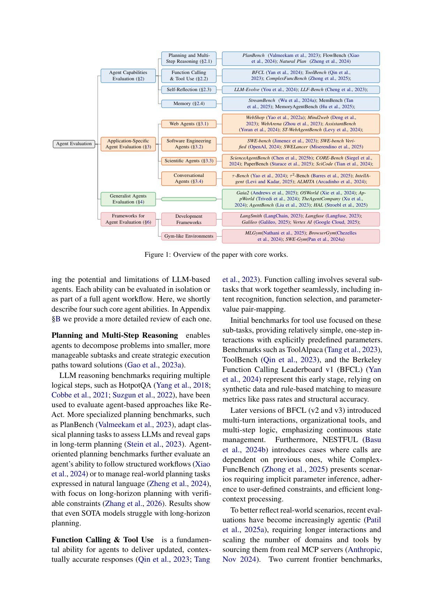
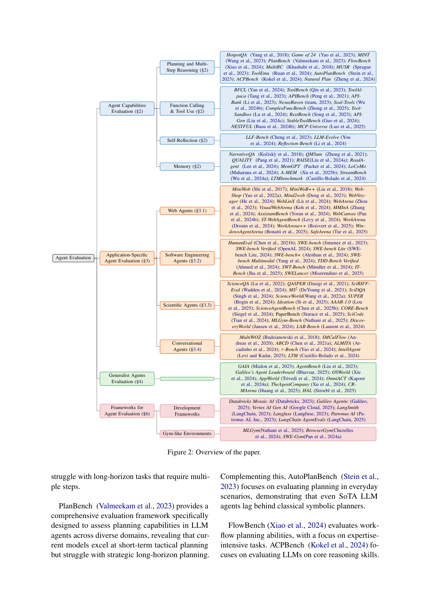

survey_eval | A Survey on Evaluation of LLM-based Agents | IBM Research + Hebrew Univ. + Yale(Arman Cohan 组) | 2025-03, arXiv 2503.16416 (ACL 体例,综述) | 主题线 L7 评测 · 相关性 High(评测维度锚)

> [light 档] 综述类(评测向)→ A 栏抽其**评测维度/分类法**。自称「第一篇 LLM Agent 评测的全面综述」。配套 GitHub 追踪库。

══ 第一层:一眼看懂 ══
- 🟦 **TL;DR**:【原文 Abstract/§1】这是**第一篇系统综述「怎么评测 LLM Agent」**的论文。它从**五个视角**切分整个评测领域:(1) 跑 agentic 流程所需的**核心 LLM 能力**(规划、工具调用等);(2) **应用专属 benchmark**(Web Agent、SWE Agent 等);(3) **通用 Agent 评测**;(4) 对 agent benchmark 的**核心维度做剖面分析**;(5) 给开发者用的**评测框架与工具**。核心论断:从「静态文本模型」转向「自适应交互式 Agent」,评测必须超越「看文本输出对不对」,要评「序列决策 + 在动态环境里操作」的能力;趋势是越来越真实/有挑战/持续更新的 benchmark,而关键缺口在**成本-效率、安全、鲁棒性,以及细粒度可扩展的评测方法**。
- **最巧的一步**:【推断·依据 §4 Core Benchmark Dimensions + Fig.1】不止罗列 benchmark,而是**抽出一组正交的「benchmark 核心维度」(数据构造 / 环境 / 交互接口 / 度量 / 安全 / 鲁棒性)作为剖面坐标**,任意一个 agent benchmark 都能被投到这套坐标上比较。抽掉这个「维度剖面」,综述就只是一份 benchmark 清单;有了它,才能跨 benchmark 做结构化对比并暴露缺口(如「几乎没人测 cost-efficiency」)。

══ 第二层:为什么需要这评测综述 + 它如何分类 ══
- **研究背景**:【原文 §1】LLM 是「静态、知识固定、只能文本进文本出」;LLM Agent = LLM backbone + **agent harness(脚手架/scaffold)**,把模型嵌进多步工作流、装上外部工具,于是能算数、查实时信息、与环境交互,能自主规划-执行-适应复杂策略。这种从「静态模型→自适应交互式 agent」的范式转移,要求一套全新的评测范式:不能只看文本输出对不对,要评「序列决策 + 在动态环境里操作」的能力,而且 benchmark 必须**与 agent 能力共同进化**(co-evolve)。
- **解决的具体痛点**:【原文 §1/§7】① 评测散乱——能力评测、应用 benchmark、通用 agent、框架工具各说各话,缺一张「全景地图」;② 现有 benchmark 多为粗粒度 end-to-end 成功率,**看不见中间决策**(工具选择、推理质量),无法定位失败;③ 几乎没人系统量化 **cost-efficiency / safety / robustness**;④ 模型能力与 harness 设计被混在一起评,**无法归因性能增益来自模型还是脚手架**。
- **相关工作 & 各自不足**:【原文 §1/§4 + 推断】此前是「单一应用 benchmark」(SWE-bench、WebArena、τ-bench…)各自为政,或「能力子项 benchmark」(PlanBench、BFCL…)散点;通用 agent 评测两条路——要么造天然需多能力的 benchmark(GAIA、AgentBench),要么把多个任务 benchmark 拼成统一平台(HAL),但后者**不支持跨环境的同一 harness 评测**(Harbor/Exgentic 才刚起步补这点)。本综述自定位:**第一篇 LLM Agent 评测全面综述**,提供把这些散点投到统一坐标的「剖面维度」。
- **动机链(一条逻辑链)**:【推断·依据 §1 + §5】agent ≠ 静态 LLM(多了 harness + 序列交互)→ 旧的「看文本对错」评不出 agent 的真本事(决策序列、环境操作)→ 单独罗列 benchmark 又无法横向比较、暴露缺口 → 故需抽出一组**正交剖面维度**(数据/环境/接口/度量/安全)把所有 benchmark 投上去 → 投上去后立刻看见两个系统性空白:几乎没人测 cost-efficiency,且模型与 harness 没解耦评。为什么不直接用现成 LLM 评测综述?因为它们没有「环境/交互接口/harness」这几维,装不下 agent。
- **与最近邻工作的 Δ**:【推断·依据 §5】与「按应用域罗列 benchmark 的清单式综述」相比,关键差异是 §5 那组**正交「benchmark 核心维度」**(data curation / environment / interaction interface / metric / safety),并配 Table 1 把 SWE-bench Ver./Mind2Web/WebArena/TAU-Bench/AppWorld/GAIA 逐维投影——把「清单」升级为「可结构化对比、可暴露缺口」的坐标系,这一差异让「几乎没 benchmark 标 safety=Yes、几乎没人测 cost」这类结论一眼可见。

══ 第三层:分类框架细节 + 局限 ══
- **分类框架(五视角怎么咬合)**:【原文 §2–§6】① §2 能力层(Planning/Multi-Step Reasoning、Function-Calling/Tool-Use、Self-Reflection、Memory)——agent 的「零件」;② §3 应用层(Web/SWE/Scientific/Conversational)——零件组装后的领域表现;③ §4 通用 agent 层(GAIA/AgentBench/HAL 等);④ §5 剖面维度——把②③的 benchmark 投到正交坐标做横向对比;⑤ §6 框架工具——按**评测对象**(Final Response / Stepwise / Trajectory-Based)× **裁判方式**(Reference-Based / Reference-Free)组织,支撑 Gym-like 环境 + LLM-as-Judge。层层从「零件→组装→对比→工具」递进。
- **逐组件必要性**:【推断】§5 的剖面维度是全篇支点——抽掉它,①②③就退回成无法互比的清单;Table 1 的具体投影(如 TAU-Bench 是少数 Safety=Yes、多数为 No)是「缺口可见」的证据。§2 的 Self-Reflection/Memory 两轴对本调研尤其关键:它们正是自进化 agent 的能力来源,却被列为「待评能力」而非「实现机制」。
- **关键机制/评测对象三分**:【原文 §6】Final Response(只看终态答案)/ Stepwise(看每一步)/ Trajectory-Based(看整条轨迹)。直觉:终态评测便宜但看不见过程、无法归因;轨迹/单步评测能定位「在哪一步选错工具/推错」,但贵(常需 LLM judge)。这一三分直接对应本调研「在轨迹层验证 path-selection/path-recovery 是否真发生」的需求。
- **趋势与未来方向(支撑核心主张的「证据」)**:【原文 §7.1/§7.2】趋势:① 更真实/更难(WebArena、真实 GitHub issue、长程专家任务);② **Live Benchmarks**(BFCL 多版、SWE-bench 家族不断刷新,以对抗饱和/过时)。未来五缺口:① 细粒度/轨迹评测;② **Cost & Efficiency 指标**(token/API/推理时间/资源);③ Scaling & Automating(合成数据 + agent-as-Judge);④ Safety & Compliance(尤其多智能体涌现风险);⑤ **Decoupling LLM & Harness**——主张设计「逐因素独立变动」的受控评测协议,把增益归因到 LLM / harness / 具体模块(memory、planning)。这条与本调研「harness 协同演化」直接呼应。
- **假设与失效边界**:见下方原有「假设」条(隐含「agent 能力可被相对稳定的视角刻画并用多为静态的 benchmark 度量」;对「随时间纵向看学习曲线/遗忘」表达力弱)。
- **祛魅总结**:【推断】真贡献=**一张可复用的 L7 评测全景地图 + 一组正交剖面维度 + 五个被点名的缺口**,尤其「Stepwise/Trajectory 评测、Self-Reflection/Memory 能力轴、Cost-Efficiency 维度、Decoupling Harness」四点可直接拿来当本调研的评测脚手架。包装/局限:综述本身**不提供新指标的具体定义/实现**,只指方向;且承认自身是「快速演化领域的一张快照」(§Limitations),靠维护 GitHub 库续命;它的横切式维度**难以表达「时间维度上的学习曲线/遗忘」**——这正是 lifelong/CL benchmark(本调研 bench_lifelong/agentcl/stulife/reliability)要补的纵向缺口。

══ 机制速览 6 轴(评测综述 → 映射其关注点) ══
| 维度 | 内容(评测视角下) |
|---|---|
| 学什么信号 | 不适用(评测综述);但其评的**能力轴**含自反思(Self-Reflection)、记忆(Memory)——正是自进化 Agent 的信号来源 |
| 改什么 | 不适用;关注的是「如何度量 agent 行为/轨迹」而非改 agent |
| 何时改 | 评测时机轴:终态评测(Final Response) / 单步评测(Stepwise) / 全轨迹评测(Trajectory-Based) |
| 免梯度? | 不适用 |
| 记忆-技能生命周期 | 把「Memory」「Self-Reflection」列为待评的**核心 agent 能力**(§2),但本综述只问「怎么测」,不问「怎么实现」 |
| 防遗忘机制 | 不适用;不过「持续更新的 benchmark」「动态环境」是其识别的趋势,隐含对「会进化的 agent」需要「会进化的评测」 |

══ 抽取的评测维度/分类法(A 栏核心) ══
**顶层五视角**:
1. **Agent 能力评测(§2)**:Planning(规划)、Multi-Step Reasoning(多步推理)、Function Calling/Tool Use(工具调用)、**Self-Reflection(自反思)**、**Memory(记忆)**。
2. **应用专属 Agent 评测(§3)**:Web Agents、Software Engineering Agents、Scientific Agents、Conversational Agents。
3. **通用 Agent 评测(§4 Generalist)**。
4. **★Benchmark 核心维度(§4,最关键的剖面坐标)**:**Data Curation(数据构造)/ Environment(环境)/ Interaction Interface(交互接口)/ Metric(度量)/ Safety(安全)/ Robustness(鲁棒性)**;附代表 benchmark 矩阵(SWE-bench Verified、SWE-Lancer、Mind2Web、WebArena、PaperBench、TAU-Bench、AppWorld 等)。
5. **评测框架与工具(§5)**:按**评测对象**分——Final Response Evaluation(终态)/ Stepwise Evaluation(单步)/ Trajectory-Based Assessment(轨迹);按**裁判方式**分——Reference-Based vs Reference-Free;含 Gym-like Environments、LLM-as-a-Judge 支撑能力。
**趋势(§6 Current Trends)**:更真实/更难、持续更新的 benchmark。
**未来方向(§6 Future Directions)**:① Granular/Trajectory 细粒度评测;② **Cost & Efficiency Metrics(token/API/延迟/资源)**;③ Scaling & Automating(合成数据 + agent-as-Judge);④ Safety & Compliance;⑤ **Decoupling Harness(把 harness 与模型解耦评测)** —— 与本调研「harness 协同演化」直接呼应。

══ 关键图 top-2 ══

这是**原文 Figure 1**(p2)。选它因为它一图给出综述的五视角骨架并在每格挂上代表性工作,等于一张「LLM Agent 评测地图」,可直接当本调研 L7 评测线的坐标轴。

这是**原文 Figure 2**(p21)。选它因为它是更细的全景结构图(展开到能力/应用/维度/框架的子项),补全 Figure 1 的细节,便于查每个评测维度下挂了哪些 benchmark/方法。

══ 假设与失效边界(一句) ══
【推断·依据 §6 趋势「持续更新 benchmark」但全篇仍以静态 benchmark 为主】隐含假设是「agent 能力可被一组相对稳定的视角/维度刻画并用(多为静态的)benchmark 度量」;失效边界在于**真正自进化/终身学习的 agent 会随时间改变自身**——其评测需「随时间纵向看进步/遗忘」(本调研 bench_lifelong / bench_agentcl / bench_stulife 正补此空),而本综述的横切式维度难以直接表达「时间维度上的学习曲线」。

══ 对"探索-巩固"idea 对标(一句) ══
**可借组件(评测脚手架)**:它的**「Trajectory-Based / Stepwise 评测」+「Self-Reflection、Memory 能力轴」+「Cost-Efficiency 维度」**可直接借来给 TSRD 设计评测面——既能在轨迹层评 path-selection/path-recovery 是否真发生,又能用 cost-efficiency 维度量化「巩固后是否更省 token/步数」;但它**不提供「学习曲线/前后对比」这类纵向指标**,这部分要靠 lifelong/CL benchmark 补。
