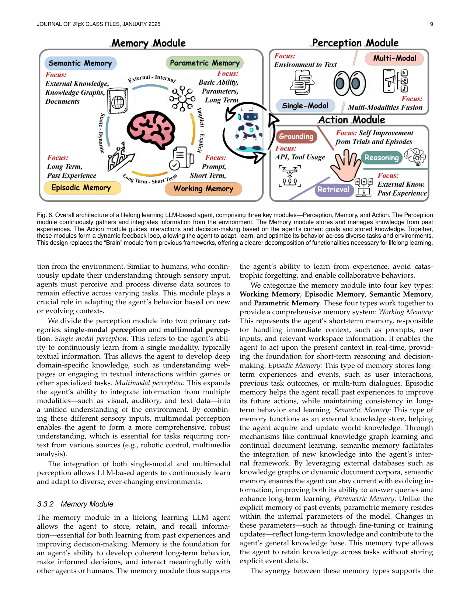
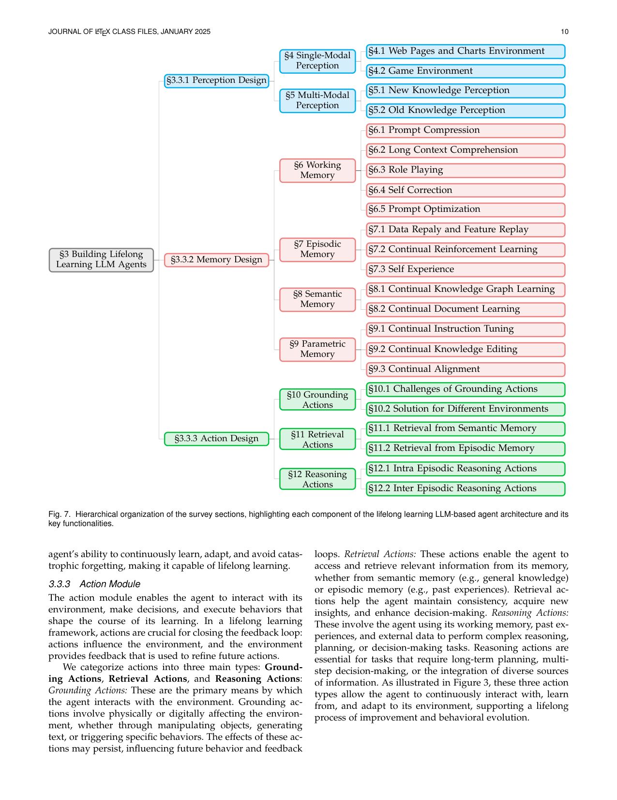

survey_lifelong | Lifelong Learning of Large Language Model based Agents: A Roadmap | 华南理工(Qianli Ma 组)+ 腾讯 AI Lab(Dong Yu) | 2025-01, arXiv 2501.07278 (JOURNAL OF LATEX/IEEE 体例,综述) | 主题线 L1/L2/L3 全覆盖(综述锚) · 相关性 High(全景骨架)

> [light 档] 综述类 → A 栏抽其分类法(taxonomy)。资源页 https://github.com/qianlima-lab/awesome-lifelong-llm-agent

══ 第一层:一眼看懂 ══
- 🟦 **TL;DR**:【原文 Abstract】这是**第一篇系统梳理「如何把终身学习(lifelong/continual/incremental learning)塞进 LLM Agent」的 roadmap 综述**。它把一个能终身学习的 Agent 拆成**三大模块**——感知(Perception,吸收多模态输入)、记忆(Memory,存取不断演化的知识)、行动(Action,在动态环境里 grounded 地交互),并论证这三根支柱如何协同实现「持续适应 + 缓解灾难性遗忘 + 提升长期表现」。核心叙事:传统 LLM 训练完即静态(static black-box),而 Agent 要在「永远变化的环境」里活下去,就必须解决「稳定性 vs 可塑性」(stability-plasticity)困境(§1:不忘的系统学不会新东西,会学的系统会忘旧知识)。
- **最巧的一步**:【推断·依据 Fig.6/Fig.7】把「终身学习」这个抽象目标**映射到 Agent 的标准三模块架构**(感知-记忆-行动),而不是沿用 CL 老分类(rehearsal/regularization/architecture)。抽掉这个「模块化映射」,综述就退化成又一篇普通 CL 综述;正因为按 Agent 组件切分,记忆模块才能进一步细分出**工作/情景/语义/参数四类记忆**(§6–§9),这是本调研「记忆-技能生命周期」轴最常被引用的骨架。

══ 第二层:为什么需要这综述 + 它如何分类 ══
- **研究背景**:【原文 §1】LLM(GPT-4 类)训练完即**静态黑箱**(static after training):知识固定、不重训就无法吸收新信息;而真实部署要的是「智能=对变化的快速适应」(开篇引 Hawking + Legg 的智能观)。Agent 比 LLM 高级在于能**感知多模态→存记忆→行动影响环境**,理应越用越强,但现有 LLM Agent 仍被当静态系统造,缺乏随时间适应的能力。终身学习这一议题近三年发文量陡增(Fig.1),综述应运而生。
- **解决的具体痛点**:【原文 §1.1】两条:① 现有 agent 不会进化——每换一个环境(游戏/网页/购物/家务/OS)就得重做一个 agent;② 主流「LLM 终身学习」研究(continual fine-tuning 等)只对付**数据分布漂移**,仍把 LLM 当不与环境交互的静态黑箱(Fig.2a vs 2b),没解决「在真实环境里交互式学习」这个真问题。本综述要把「交互式、跨环境、会进化」这一新范式系统化。
- **相关工作 & 各自不足**:【原文 §1.1/§1.3 + 推断】① 传统 CL/lifelong learning 综述(De Lange、Wang 等)——按 rehearsal/regularization/architecture 分类,但**不含 agent 的感知/行动维度**,只管参数防遗忘;② LLM CL 综述(Wu 等 2402.01364、本调研 survey_continual_mco 同类)——聚焦续训/续对齐,**仍是静态黑箱视角**;③ Agent 综述——讲架构与能力但**不以「终身学习」为轴**。本综述自定位为「第一篇把 lifelong learning × LLM Agent 交叉系统化」者。
- **动机链(一条逻辑链)**:【推断·依据 §1 stability-plasticity 论述】真实环境永远在变 → 静态 LLM/agent 无法持续胜任 → 必须能「学新而不忘旧」 → 这撞上**稳定性-可塑性困境**(catastrophic forgetting 不忘者学不会、loss of plasticity 会学者会忘)→ 故需一套能同时管「感知新模态、存取演化知识、在动态环境行动」的统一框架 → **既有 CL 分类只覆盖参数防遗忘,无法承载 agent 的感知/行动**,所以必须按 agent 三模块重做 taxonomy。为什么不沿用现成 CL 三分法?因为它把「学习」窄化为参数更新,装不下「免梯度的记忆/prompt/检索式」终身学习——这恰是 agent 的主战场。
- **与最近邻工作的 Δ**:【推断·依据 §1.3 贡献声明】最像的是同类「LLM 持续学习综述」(如 2402.01364)。关键差异:那些以**训练阶段/参数**为骨架;本综述把骨架换成 **agent 的「感知-记忆-行动」三模块**,并在记忆模块下细分**工作/情景/语义/参数四类记忆**——这一差异让「免梯度的经验积累」与「带梯度的权重固化」第一次被并置在同一坐标系里,正是「探索-巩固」叙事所需。

══ 第三层:分类框架细节 + 局限 ══
- **分类框架(综述的「方法流水线」= taxonomy 怎么搭起来的)**:【原文 §3 + Fig.6/Fig.7】① 先给统一架构定义(§3:感知/记忆/行动三模块 + stability-plasticity 形式化,把 t 个任务后在任务 i 的表现记作 \(J_{i,t}\));② 感知设计(§4 单模态 / §5 多模态);③ 记忆设计(§6–§9 四类记忆,核心)；④ 行动设计(§10 grounding / §11 检索 / §12 推理);⑤ 评测(§13)→ 应用(§14)→ 挑战(§15)。每一格挂上代表工作,形成可查的「坐标×文献」矩阵。
- **逐组件必要性**:【推断】三模块缺一即不成 agent 终身学习:抽掉感知=无法吸收新模态/新环境观测;抽掉记忆=退回 stateless LLM(无法跨任务积累);抽掉行动=无法 grounded 交互、经验无来源。记忆四分(工作→情景→语义→参数)是论文的真增量——它对应「瞬时上下文→单次经历→结构化知识→固化进权重」的演化阶梯,综述类无消融,其必要性靠「能归置文献」来论证。
- **关键机制/评测指标**:【原文 §13.1】给出四组指标:**AP**(平均性能,公式14)、**AIP**(平均增量性能,公式15,捕捉历史变化)、**FGT/BWT**(遗忘度/后向迁移,衡量稳定性——老任务是被拖累还是被增益)、**FWT**(前向迁移,公式18,\(\tilde{J}_i\)=无经验 agent 的表现,衡量「过去经验是否帮到新任务」)。直觉:AP 看总体、FGT 看忘没忘、FWT/BWT 看经验有没有正迁移——这套正是「探索带来增益、巩固不引入遗忘」的现成度量。
- **评测数据集分两群**:【原文 §13.2】第一群=简单/隔离场景(CITB、GLUE/SuperGLUE、SuperNI、zsRE/CounterFact 等,只测单一技能的续学);第二群=复杂真实场景(ToolBench/StableToolBench/API-Bank、WebArena/WebShop/WorkArena 等,需多技能 + 跨任务知识利用)。论断:第二群才逼近真实终身学习。
- **挑战/未来方向(§15)**:【原文】感知线(适应新模态)、记忆线(可无限扩展且快存取的 scalable memory、仿人「记忆巩固 memory consolidation」让新记忆与旧记忆共存而非覆盖)、行动线(分层动作空间、持续自改进、用 RL 自学进化、human-in-the-loop 微调、协作学习)。其中「memory consolidation 让新旧共存不覆盖」直接呼应「巩固」议题。
- **祛魅总结**:【推断】真贡献=一张**可复用的全景坐标系**(三模块 × 四记忆 × 评测/应用),是本调研最常被引的骨架,且其「记忆四分 + AP/FGT/FWT/BWT 指标」可直接当工具。包装/局限:它是 roadmap 式综述,**只分类与列挑战,几乎不给可操作算法**;时间上 v1 为 2025-01(v2 2026-01 小修),对 2025 下半年爆发的「免梯度自进化/skill 库/harness 协同演化」覆盖不足——作者把「终身学习」框定在单 agent 内部三模块,可能**低估了「模块之外」(harness/工具/多智能体共享)的演化**这条线。

══ 机制速览 6 轴(综述 → 概括其覆盖范围) ══
| 维度 | 内容(综述层面) |
|---|---|
| 学什么信号 | 全谱:环境 reward(§7.2 continual RL)、自经验/自反思(§7.3 Self Experience、§6.4 Self Correction)、外部文档/KG(§8 语义记忆)、人类指令(§9.1 continual instruction tuning) |
| 改什么 | 全谱:prompt(§6.1 压缩/§6.5 优化)、记忆(§7/§8 情景&语义)、参数(§9 参数记忆:续训/知识编辑/对齐)、行动策略(§10–§12 grounding/检索/推理) |
| 何时改 | 全谱:在线 per-episode(§7.3 自经验)、test-time 自纠(§6.4)、离线批量续训(§9)、推理时检索(§11) |
| 免梯度? | **混合**——记忆/prompt 线多为免梯度(§6–§8),参数记忆线(§9)为带梯度续训/编辑/对齐;综述并列两者 |
| 记忆-技能生命周期 | **本综述的核心贡献**:把记忆四分——工作记忆(§6,瞬时上下文)→ 情景记忆(§7,单次经历回放)→ 语义记忆(§8,KG/文档知识)→ 参数记忆(§9,固化进权重);检索由 Action 模块的 §11 负责;遗忘/淘汰主要在「灾难性遗忘」框架下讨论 |
| 防遗忘机制 | 全谱并列:经验回放(§7.1 data/feature replay)、续训中的正则、知识编辑(§9.2)、续对齐(§9.3);未主张单一最优,作为开放挑战 |

══ 抽取的分类法(A 栏核心,供全景汇总) ══
**顶层三模块(Fig.6 架构图)**:① Perception(感知)② Memory(记忆)③ Action(行动)。
**完整 taxonomy 树(Fig.7 §编号)**:
- **§3.3.1 感知设计**:§4 单模态感知(网页/图表、游戏环境); §5 多模态感知(新知识/旧知识感知)
- **§3.3.2 记忆设计(四类记忆)**:
  - §6 **工作记忆** = prompt压缩 / 长上下文理解 / 角色扮演 / **自纠错** / **prompt优化**
  - §7 **情景记忆** = 数据&特征回放 / **持续强化学习** / **自经验(Self Experience)**
  - §8 **语义记忆** = 持续KG学习 / 持续文档学习(RAG)
  - §9 **参数记忆** = 持续指令微调 / 持续知识编辑 / 持续对齐
- **§3.3.3 行动设计**:§10 Grounding行动(各环境落地挑战与方案); §11 检索行动(从语义/情景记忆检索); §12 推理行动(单次内 intra-episodic / 跨次 inter-episodic)
另含:§2 终身学习发展史四阶段(Fig.5)、§13(评测指标)、§14(应用场景,Fig.16)。

══ 关键图 top-2 ══

这是**原文 Fig.6**(p9)。选它因为它一张图给出本综述最核心的「三模块」骨架:感知吃多模态输入 → 记忆(工作/情景/语义/参数四层)存取演化知识 → 行动(grounding/检索/推理)与环境交互,闭环出「终身学习」。本调研所有「改什么」「记忆生命周期」讨论都可挂到这张图上。

这是**原文 Fig.7**(p10)。选它因为它就是**整篇综述的分类法目录**:三模块→四类记忆→每类下的具体技术(自经验/持续RL/续训/知识编辑/续对齐…)。对全景调研而言这是一张可直接复用的「坐标轴」。

══ 假设与失效边界(一句) ══
【推断·依据 §1 stability-plasticity 困境表述 + 综述定位】核心隐含假设是「Agent 的终身学习可被干净地分解到感知/记忆/行动三模块且模块间界面稳定」;失效边界在于真实自进化系统(如 DGM 式自改代码、harness 协同演化)里三模块高度耦合、且很多新工作发生在「模块之外」(harness/工具/多智能体共享),这套以单 Agent 内部组件为中心的 taxonomy 难以归置——属本调研需补的「跨模块/系统级演化」缺口。

══ 对"探索-巩固"idea 对标(一句) ══
**可借组件(提供坐标系)**:它的「情景记忆(自经验、持续RL)↔ 参数记忆(续训固化)」二分,正对应「探索(在线积累经验/路径)→ 巩固(写回权重)」两阶段——可直接借作 TSRD 中「先用情景记忆攒 path-selection/path-recovery 经验、再择机蒸馏进参数」的分层论证骨架;但它停在「分类与挑战」层面,**不提供具体的探索→巩固触发/调度算法**,这正是本 idea 要填的空。
