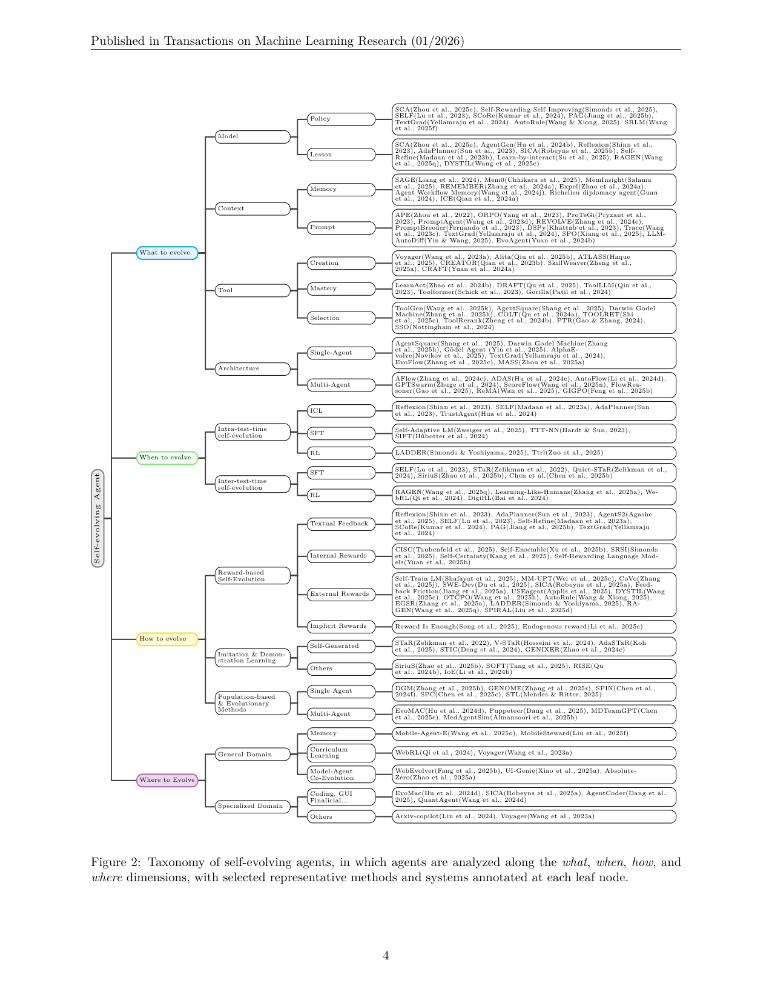
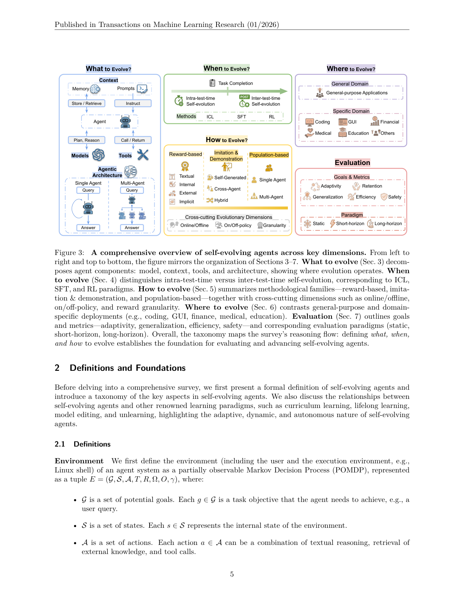

`survey_self_evolving_agents_asi | A Survey of Self-Evolving Agents: What, When, How, and Where to Evolve on the Path to ASI | Princeton/Tsinghua/CMU/SJTU/PSU/CUHK 等 30 余作者(Mengdi Wang/Heng Ji 等) | 2025-07 arXiv v1→2026-01 v4·TMLR 01/2026 已发表 | 综述锚·全线 L1–L7·相关性 = 本调研 taxonomy 母本`

> 本篇是**综述锚**。它不是某条 idea 的竞品/支撑,而是整张调研地图的"母坐标系"。下文按 ANALYSIS_PROMPT 走三层,但**重点产出 A 栏:把它 what/when/how/where 的自进化分类法抽成可复用骨架**,供其余所有 analysis 对齐挂靠。

---

══ 第一层:一眼看懂 [light] ══

- 🟦 **TL;DR**:这是**第一篇专门给"自进化 Agent"做系统综述**的论文(作者自称 first systematic survey,§1)。它把"一个 LLM Agent 怎么在用完之后还能自己变强"这件事,拆成**四个正交问题**来组织整个领域:**改什么(What)、何时改(When)、怎么改(How)、在哪改(Where)**。再加一套**形式化定义**(把环境写成 POMDP、把 Agent 系统写成四元组 Π=(架构Γ, 模型ψ, 上下文C, 工具W)、把"自进化"写成一个把旧 Agent 映射到新 Agent 的变换 f(Π,τ,r)=Π′),最后配评测维度(L6)和应用域(L7)、安全与未来方向。【原文 Abstract、§1、§2、Fig.2、Fig.3】
- **最巧的一步(抽掉就垮)**:**"locus of autonomy"(自主性的落点)这把尺子**——作者明说:"we define self-evolution not merely by the algorithms used, but by **the locus of autonomy**"(§1)。即**不靠"用了 SFT 还是 RL"来界定自进化,而靠"是不是 Agent 自己(基于自己的轨迹/反馈)发起并持续改自己"**。抽掉这把尺子,SFT/RL/蒸馏全都能算"进化",分类法立刻退化成普通"LLM 训练方法综述",四象限失去判别力。正是这把尺子,才能把"标准蒸馏(数据生成与 Agent 交互史无关)"排除在外、把"per-task 反思改 prompt"纳入进来。

---

══ 第二层:为什么做(写透) ══

- **研究背景**:LLM 很强但**根本上是静态的(fundamentally static)**——部署后参数不再随新任务/新知识/新交互而变(§1 开篇)。在开放式、交互式环境里,这个"静态性"成了**核心瓶颈**:传统的知识检索(RAG)不够,需要能在运行时持续调整感知-推理-行动的 Agent。范式因此从"把静态模型 scale 大"转向"造能自进化的 Agent",被作者放在 LLM→Foundation Agent→Self-evolving Agent→(未来)ASI 的能力阶梯上(Fig.1)。
- **解决的具体痛点**:**已有综述把"Agent 进化"只当作通用 Agent 分类法里的一个小章节**(作者点名 Luo et al. 2025a、Liu et al. 2025a、Tao et al. 2024:有的只谈 self-learning/multi-agent co-evolution,有的只按组件谈工具/prompt 进化,有的只谈 LM 本身进化)——都**只覆盖孤立组件,没有把"自进化 Agent"当成一等研究范式来做系统梳理**(§1、§3 开头)。于是三个基本问题悬而未决:**What aspects should evolve? When should adaptation occur? How should it be implemented?**(§3)。
- **相关工作 & 各自不足(它如何与邻近范式划界,§2.2 + Table 1)**:这是综述里最值钱的"祛魅表",用 7 个布尔属性把自进化 Agent 与四个老范式区分开:
  | 范式 | Runtime Context | Evolving Toolset | Dynamic Tasks | Test-time Adaptation | Active Exploration | Structural Change | Self-reflect & Eval |
  |---|---|---|---|---|---|---|---|
  | Curriculum Learning | ✗ | ✗ | ✗ | ✗ | ✗ | ✗ | ✗ |
  | Lifelong/Continual Learning | ✗ | ✗ | ✓ | ✗ | ✗ | ✗ | ✗ |
  | Model Editing | ✗ | ✗ | ✓ | ✓ | ✗ | ✗ | ✗ |
  | **Self-evolving Agents** | ✓ | ✓ | ✓ | ✓ | ✓ | ✓ | ✓ |
  - **vs 课程学习**:课程学习在**静态数据集**上按难度排序,只改**模型参数**;自进化 Agent 面向**动态环境里的序列任务**,还能改记忆/工具等非参数件。
  - **vs 终身/持续学习**:两者都做"序列任务",但(1)**记忆的角色不同**——持续学习的 replay buffer/episodic memory 是**训练时**工具(为梯度优化服务防遗忘),自进化 Agent 的 runtime context(prompt/working memory/对话史)是**测试时直接改行动生成、不需要梯度**;(2)**学习主动性不同**——持续学习多为**被动**接收外部任务序列,自进化 Agent **主动探索 + 自我反思/自评**驱动自己的学习轨迹。作者明说:近期的 self-improving LLM(自生成数据+自我批评)可看作"以模型为中心"的终身学习实例,而自进化 Agent **超出它**,涵盖工具获取/架构重构/环境探索。
  - **vs 模型编辑/反学习**:模型编辑做**定点参数更新**(如把"2021 奥运主办城市"从 Tokyo 改 Paris),但(1)**改不了记忆/工具等非参数件**,(2)**依赖算法设计者预定义的 pipeline**,而自进化 Agent 能**基于环境观察/内部反馈自发选择更灵活的策略**。
  - **两镜头划界(§2.2 末)**:课程/终身学习是**problem-setting 视角**(由"要解决的学习问题"驱动,只规定经验如何组织给学习者);模型编辑/自进化 Agent 是**solution-paradigm 视角**(直接提出"如何更新系统"的机制)。自进化 Agent = **系统级解决范式**:把参数级编辑只当成"更新路径之一",同时允许改 context/memory/tools/workflow。
- **动机链(现状→缺陷→所以必须这样)**:静态 LLM → 开放环境暴露其无法持续适应 → 出现一批分散的"自进化"机制(prompt 优化、记忆、工具创建、架构搜索、RL 自训…)→ 但**散落在各 Agent 综述的边角、缺统一坐标系** → **所以必须建一个正交的 what/when/how/where 框架 + 一套形式化定义**,让人能系统地分析/比较/设计。"为什么不用更简单的现成做法"——作者明确**拒绝"按算法(SFT/RL)分类"**这个最省事的办法,因为它无法表达"自主性落点"这个本质区别(§1)。

---

══ 第三层:怎么做 + 靠不靠谱 ══

### 形式化骨架(全综述的公理层,§2.1)——可直接复用
- **环境 = POMDP**:E=(G,S,A,T,R,Ω,O,γ)。G 目标集(用户 query)、S 状态、**A 动作 = 文本推理 ∪ 外部知识检索 ∪ 工具调用**、T 转移、**R 反馈/奖励(scalar 或 textual,以目标 g 为条件)**、Ω/O 观测、γ 折扣。
- **(多)Agent 系统 = Π=(Γ, {ψi}, {Ci}, {Wi})**:**Γ 架构/控制流**(节点序列,图或代码结构);每个节点 Ni 含 **ψi=底层 LLM/MLLM**、**Ci=上下文(prompt Pi + memory Mi)**、**Wi=可用工具/API 集**。节点策略 πθi(·|o),其中 **θi=(ψi, Ci)**,动作空间 = 自然语言空间 ∪ 工具空间。
- **自进化策略 = 变换 f**(全篇的"动词"):
  `f(Π, τ, r) = Π′ = (Γ′, {ψ′i}, {C′i}, {W′i})` —— 给定当前系统、轨迹 τ、反馈 r,产出**新系统**。递归地 `Π_{j+1}=f(Π_j, τ_j, r_j)`,目标是**最大化任务序列上的累计效用** max_f Σ_j U(Π_j, T_j)。**这就是 What(改 Π 的哪一项 Γ/ψ/C/W)× When(在哪个 j、test-time 内还是任务间)× How(f 怎么用 τ 和 r)的统一语言。**
- **操作性定义(§2.1,判别尺,极重要)**:*"A self-evolving agent is the agent that modifies its internal parameters, contextual state, toolset, or architectural topology based on its own trajectories or feedback signals, with the explicit objective of improving future performance."* 三条**纳入准则**:
  1. **经验依赖(experience-dependent)**:更新由轨迹/自生成数据/环境反馈驱动,且**针对 Agent 自身策略短板/能力边界**(不是泛泛的数据合成);
  2. **持久且改策略(persistent, policy-changing)**:产生持久的、改变策略的效果,**而非一次性 instruction-following**;
  3. **自主探索/自发学习(autonomous exploration)**:系统有自主探索或自发学习机制(哪怕也用预收集数据)。
  - **"passive vs active"**:passive=仅由外部数据/排程触发;active=自发探索/反思/结构改动。**显式排除"标准蒸馏"**(数据生成与 Agent 交互史无关)。
  - **谱系而非硬阈值**:从 **proto-evolution**(迭代自举、反馈驱动 prompting)到 **strong self-evolution**(全自主诊断+重配),作者**不设刚性排除门槛**,把早期工作也纳入分析。这点很务实(避免把 Reflexion 这类"弱进化"踢出去),但也意味着**边界软**——读其他论文时要自己判"这是 proto 还是 strong"。

### 四大坐标轴的 taxonomy(Fig.2 叶节点,A 栏骨架)
- **What to Evolve(§3,改什么)= Π 的四支柱**:
  - **Model {ψ}**:① **Policy**(改策略参数:SCA, Self-Rewarding-Self-Improving, SELF, SCoRe, PAG, TextGrad, AutoRule, SRLM)② **Lesson/经验**(SCA, AgentGen, Reflexion, AdaPlanner, SICA, Self-Refine, Learn-by-interact, RAGEN, DYSTIL)。
  - **Context {C}**:① **Memory**(SAGE, Mem0, MemInsight, REMEMBER, ExpeL, Agent Workflow Memory, Richelieu, ICE)② **Prompt**(APE, ORPO, ProTeGi, PromptAgent, REVOLVE, PromptBreeder, DSPy, Trace, TextGrad, SPO, LLM-AutoDiff, EvoAgent)。
  - **Tools {W}**:① **Creation 创建**(Voyager, Alita, ATLASS, CREATOR, SkillWeaver, CRAFT)② **Mastery 掌握**(LearnAct, DRAFT, ToolLLM, Toolformer, Gorilla)③ **Selection 选择**(ToolGen, AgentSquare, **DGM**, COLT, TOOLRET, ToolRerank, PTR, SSO)。
  - **Architecture Γ**:① **Single-Agent**(AgentSquare, **DGM**, Gödel Agent, AlphaEvolve, TextGrad, EvoFlow, MASS)② **Multi-Agent**(AFlow, ADAS, AutoFlow, GPTSwarm, ScoreFlow, FlowReasoner, ReMA, GIGPO)。
- **When to Evolve(§4,何时改)**:
  - **Intra-test-time(单次任务内、在线即时)**:ICL(Reflexion, SELF, AdaPlanner, TrustAgent)/ SFT(Self-Adaptive LM=SEAL, TTT-NN, SIFT)/ RL(LADDER, TTRL)。
  - **Inter-test-time(跨任务、任务之间)**:SFT(SELF, STaR, Quiet-STaR, SiriuS)/ RL(RAGEN, Learning-Like-Humans, WebRL, DigiRL)。
- **How to Evolve(§5,怎么改)= 三大方法族 + 三条横切维**:
  - **Reward-based**:按奖励来源细分 **Textual Feedback**(Reflexion, AdaPlanner, AgentS2, SELF, Self-Refine, SCoRe, PAG, TextGrad)/ **Internal Rewards**(CISC, Self-Ensemble, SRSI, Self-Certainty, Self-Rewarding LM)/ **External Rewards**(Self-Train LM, MM-UPT, CoVo, SWE-Dev, **SICA**, Feedback-Friction, USEagent, DYSTIL, OTC-PO, AutoRule, EGSR, LADDER, RAGEN, SPIRAL)/ **Implicit Rewards**(Reward-Is-Enough, Endogenous-reward)。
  - **Imitation & Demonstration**:**Self-Generated**(STaR, V-STaR, AdaSTaR, STIC, GENIXER)/ Cross-Agent / Hybrid / Others(SiriuS, SOFT, RISE, IoE)。
  - **Population-based & Evolutionary**:**Single-Agent**(**DGM**, GENOME, SPIN, SPC, STL)/ **Multi-Agent**(EvoMAC, Puppeteer, MDTeamGPT, MedAgentSim)。
  - **横切三维(§5.4 cross-cutting,非常关键的"机制速览"母维)**:① **Online vs Offline**(边交互边更 vs 攒批离线更)② **On-policy vs Off-policy**(用当前策略自己的轨迹学 vs 用旧/他人策略数据学)③ **Reward Granularity**(轨迹级 / 步级 / token 级)。——**这三条正是本调研"机制速览 6 轴"里"何时改/学什么信号"的上位来源**。
- **Where to Evolve(§6,在哪改)**:**General Domain**(Memory: Mobile-Agent-E/MobileSteward;Curriculum: WebRL/Voyager;Model-Agent Co-Evolution: WebEvolver/UI-Genie/Absolute-Zero)/ **Specialized Domain**(Coding/GUI/Financial: EvoMAC, SICA, AgentCoder, QuantAgent;Others: Arxiv-copilot, Voyager)。
- **Evaluation(§7,L6)**:目标-指标 = **Adaptivity / Retention / Generalization / Efficiency / Safety / Self-Directedness**(并指出这些目标间存在 trade-off);范式 = **Static / Short-Horizon Adaptive / Long-Horizon Lifelong**;并批评"当前评测的局限":能力交叉点(如同时考 adaptivity+retention)被低估、公平比较难。
- **Future(§8)**:个性化 Agent、泛化、安全可控(强调自进化系统的 emergent risk + 处方式 guardrail)、多 Agent 生态。

### 逐组件必要性 & 证据(综述特性)
- 综述**无自做实验/消融**——它的"证据"是**对 100+ 篇工作的归类覆盖度**。其说服力靠 Fig.2 叶节点的代表作填充 + Table 1 的划界。**真贡献(硬货)**:① 一套能落地的**操作性定义 + 3 准则 + passive/active**(可直接拿去判一篇论文算不算自进化);② **Π=(Γ,ψ,C,W) + f(Π,τ,r)=Π′** 的统一形式语言(把异构方法统一可比);③ **what×when×how×where 正交分解** + 横切三维。
- **看着强但要小心的地方**:综述把 Reflexion/Self-Refine 这类**纯 in-context 反思**也归入"Model→Lesson / Reward-based→Textual",但按它自己准则(ii)"持久、改策略而非一次性 instruction-following",这类**单次任务内的反思是否真满足'持久'**是模糊的——作者用"proto-evolution"软化了,但这导致**同一篇工作在 What 和 When 里被多次引用**(如 Reflexion 出现在 Model-Lesson、When-Intra-ICL、How-Textual 三处),分类**非互斥**,使用时要注意"一篇可挂多格"。

### 假设与失效边界
- **【原文】**:作者自陈这是"快速形成中的领域,概念边界仍在协商",故定位为 *guiding synthesis* 而非 review of established paradigm;"fully autonomous self-evolution 是 aspirational goal,而非当前常态"(§2.1)。
- **【推断】**(依据:Table 1 全 ✓ vs 其他全/半 ✗ 的极端对照):**Table 1 把自进化 Agent 画成"七项全能"略带营销色彩**——现实中绝大多数被归入的工作只占其中 2–3 项(如纯记忆进化无 Structural Change、无参数更新)。这张表是"理想自进化 Agent 的能力上界",不是"任一被归类工作都具备七项"。读图时应理解为**范式的并集能力**,而非每篇的交集能力。
- **【推断】**(依据:§5.4 把 on/off-policy 仅作"横切维"一笔带过,正文展开少):**它对"防遗忘/巩固机制"的覆盖偏弱**——Retention 只在评测(§7)出现,How(§5)里几乎没有"merging / KL 投影 / 几何共识 / 参数隔离"这类巩固算法族的专门归类。这正好是**本调研(探索-巩固)要补的缺口**:综述给了"探索"侧丰富 taxonomy,"巩固"侧仅有评测指标 Retention,缺机制层。

---

══ 结构化抽取 ══

- 🎯 **机制速览 6 轴** [light]（本篇是"母维",填的是它**为整张地图提供的轴**，非单一方法）:
  | 维度 | 综述给出的上位划分(可作其余论文的对齐刻度) |
  |---|---|
  | **学什么信号** | Reward-based 四源:Textual / Internal / External / Implicit;+ Imitation(自生成/跨Agent/混合)|
  | **改什么** | Π 四支柱:Model ψ(参数/经验)· Context C(memory+prompt)· Tools W(创建/掌握/选择)· Architecture Γ(单/多Agent 拓扑)|
  | **何时改** | Intra-test-time(任务内在线)vs Inter-test-time(任务间);横切 Online/Offline |
  | **免梯度?** | 用 ICL(免梯度)/ SFT / RL 三分;横切 On-policy/Off-policy 区分用谁的轨迹 |
  | **记忆-技能生命周期** | Context-Memory 支:store/retrieve;Tools 支:create→master→select(=技能写入→掌握→检索/淘汰)|
  | **防遗忘机制** | **【缺口】综述仅在评测层列 Retention 指标,How 层未设巩固算法族** —— 留给本调研补 |
- ⑦ **开源代码 + 框架/harness**:**有(awesome-list 型,非可运行框架)**。GitHub: `https://github.com/CharlesQ9/Self-Evolving-Agents`(§题头);OpenReview: forum?id=CTr3bovS5F。**按 CLAUDE.md 决策②/B 层:纯论文清单仓,无训练代码,仅记录不 clone。**【原文题头】
- 💰 **资源/成本与可扩展性**:综述本身无算力成本。但在 §3(Architecture)反复点到**自进化的核心成本痛点 = "评估每个候选 workflow 的计算开销"**,并归纳出应对法:用**轻量预测器**(Agentic Predictor:不全执行就估 workflow 性能)做 cheap proxy 来加速搜索(§3 Architecture 末)。这条对"探索-巩固"里"巩固前要不要花算力验证每条探索路径"有直接启发。
- 🎯 **对"探索-巩固"idea 对标** [light]:**坐标系/母图(既非竞品亦非组件,而是定位工具)**。映射:**"探索"= How 的 Population-based/Reward-based(产生候选策略/路径)+ When-Intra(test-time 即时尝试);"巩固"= 把好轨迹持久化进 Π′(What-Model 参数 或 Context-Memory)+ §7-Retention 指标 + §5.4 On/Off-policy**。**关键缺口(本调研立项点)**:综述在 How 层**没有"巩固机制"的专门 taxonomy**(只有评测指标 Retention),且 MTP/foresight-probe、"path-selection + path-recovery"这类**前瞻式探索-巩固**完全未被现有叶节点覆盖 → 本调研可声称填"How×Retention 的机制空白格"。
- 🔭 **开放问题/未来方向**:
  - **【原文 §8】**:① Personalize AI Agents;② Generalization(跨域迁移);③ Safe & Controllable(自进化系统的 emergent risk + 处方式 guardrail/mitigation);④ Ecosystems of Multi-Agents(多 Agent 协同进化生态)。§7 另指出评测三大短板:能力交叉点欠服务、公平比较难、缺标准化协议。
  - **【推断】**(依据:§5.4 巩固机制留白 + Table 1 把 Structural Change 当独立维但正文 Architecture 搜索成本高):**最该补的是"低成本巩固 + 防遗忘"的算法族**——当前 What 能改 Γ/ψ/C/W,但"改完如何不破坏旧能力"几乎只靠评测事后量,缺前瞻式(改之前就预测会不会遗忘)的机制。这与本项目 MTP-as-foresight-probe 同向。
- 🖼 **关键图 top-2** [light]:
  - 
    这是**原文 Figure 2**(p.4)。选它因为它是**整篇综述、也是本调研 A 栏的骨架本体**:一张树把 What(Model/Context/Tools/Architecture)、When(Intra/Inter-test-time)、How(Reward/Imitation/Population + 横切维)、Where(General/Specialized)四个轴的**每个叶节点都填上了代表方法**(DGM/SICA 在多处出现,EvoAgent 在 Prompt 支),是"把任一论文挂到地图上"的查询表。
  - 
    这是**原文 Figure 3**(p.5)。选它因为它把**抽象的 Π=(Γ,ψ,C,W) 形式化**画成了**可视回路**:Agent 的 Memory/Prompts/Model/Context 如何 store-retrieve / instruct / call-return / plan-reason,并把 When(Intra/Inter)、How(三方法族 + 横切三维)、Where(域)、Evaluation(Adaptivity/Retention/Generalization/Efficiency/Safety + Static/Short/Long-horizon 范式)一图汇齐 —— 是"形式定义→分类轴→评测"的桥梁图,补足 Fig.2 的纯树状视角。

【三标注小结】本笔记中:taxonomy 叶节点、操作性定义、3 准则、POMDP/f 公式、Table 1 七属性、§8 未来方向均为**【原文】**;"Table 1 是并集能力非交集""巩固机制留白是本调研缺口""最该补低成本巩固"为**【推断】**(已各附依据);无【待核】关键事实(全部对照 PDF 正文 p.1–9 + Fig.2/3)。
