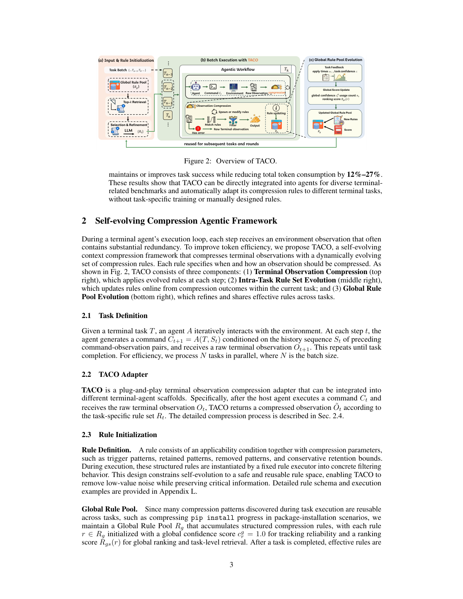
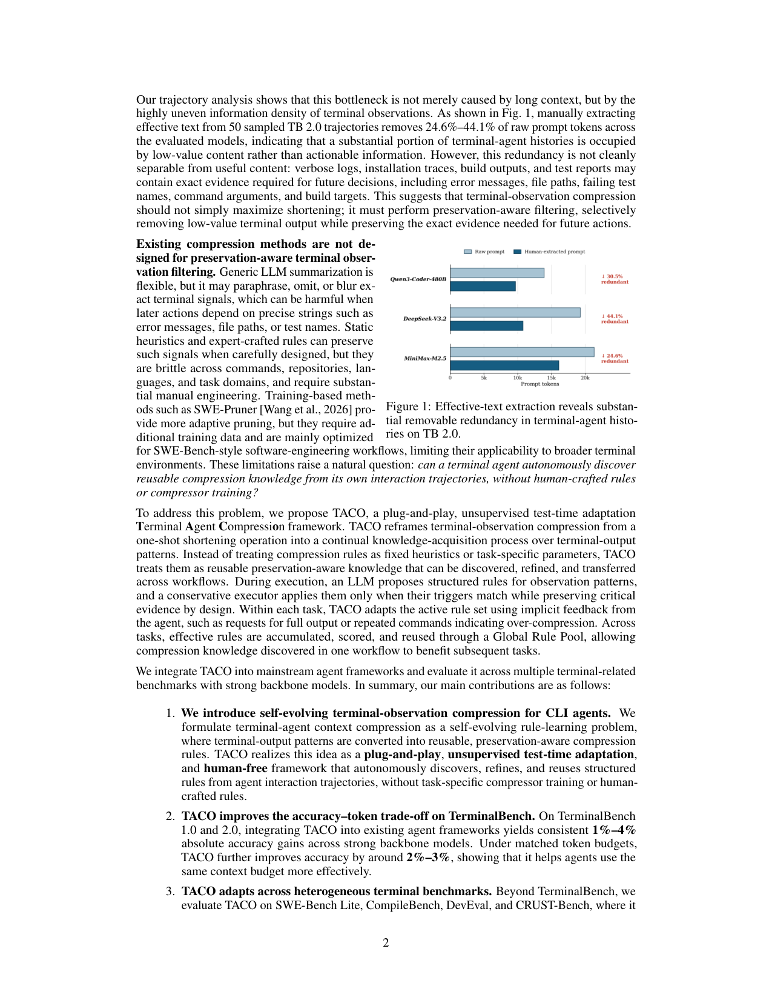

`taco_terminal | A Self-Evolving Framework for Efficient Terminal Agents via Observational Context Compression(方法名 TACO) | 曼彻斯特大学(主)/ MAP / HKUST(GZ) / HKUST / 北航(Jincheng Ren, Siwei Wu, Yizhi Li 等;通讯 Jian Yang, Chenghua Lin) | 2026-04·arXiv:2604.19572 v3(15 May 2026)·preprint·27页 | 主题线 L6(harness 侧"上下文治理"自进化)+ L1 · 相关性 High`

> 三标注:【原文】=直接来自论文;【推断】=有据判断(附依据);【待核】=拿不准的关键事实。
> 方法名 TACO ≠ 标题(候选清单已注明,避免误判)。

---

## ══ 第一层:一眼看懂 [light] ══

- 🟦 **TL;DR**:【原文 摘要, §1】终端(命令行 CLI)观测不是普通长文本:它是**异构、低信息密度的执行轨迹**——稀疏但精确的证据(报错信息、文件路径、失败测试名、命令参数、build target)被大量冗余终端输出(verbose 日志、安装进度、build 输出)夹裹在一起。长程 CLI agent 若保留原始观测,上下文成本飙升、还会稀释关键信号;而通用 LLM 摘要 / 固定启发式规则要么改写/抹掉精确字符串(later action 依赖这些精确串时就坏事),要么跨命令/仓库/语言/任务域很脆、要大量人工。TACO 是**第一个自进化的终端 agent 压缩框架**:把"压缩规则"当成**可复用、保留感知(preservation-aware)的知识**,从交互轨迹里**自主发现、精炼、复用结构化压缩规则**——不靠手写规则、不训专用压缩器、无监督、即插即用(plug-and-play)、test-time adaptation。两套机制:**全局规则池(Global Rule Pool)** 跨任务累积有效规则,**任务内规则进化(intra-task)** 在线适配当前工作流。在 6 个 benchmark(TB 1.0/2.0、SWE-Bench Lite、CompileBench、DevEval、CRUST-Bench)上,TACO 一致地维持或提升任务成功率:TerminalBench 标准评测 +1%~4% 绝对准确率、等 token 预算下 +2%~3%;下游 benchmark 总 token 降 12%~27%。**核心主张**:自进化的观测压缩能"把上下文预算分配给任务相关证据",从而在不微调模型、不靠人写规则的前提下,解锁现有 CLI agent 的潜在能力。
- **最巧的一步**:【推断,依据 §2.4 Eq(1) + §4.4 Table 4】**"Critical 旁路 + 保留感知的保守规则执行器"**——把含显式错误/异常 trace 的观测判为 Critical 直接原样保留(不压),只对 non-Critical 输出施加规则,且规则执行器是"保守的、按 trigger 匹配才动、设计上保留关键证据"。抽掉这一步,TACO 就退化成普通的 LLM 摘要/静态剪枝——而 Table 4 正显示:LLM 摘要和 200 条人工规则**压得更狠(降 token 更多)却涨点更少**,证明"终端压缩应优先保留任务相关信号,而非最大化压缩比"。这个"宁可少压、绝不误删精确证据"的保守取向,是 TACO 区别于一切激进压缩器的命门。

---

## ══ 第二层:为什么做 ══

- **研究背景**:【原文 §1】code 基础模型/code 智能/agentic code 系统进步快,但终端中心任务(仓库调试、编译、测试、环境交互)仍难。与短代码生成不同,CLI agent 走**长程交互回路**:执行命令→观察终端输出→基于累积的环境反馈决定下一步。历史一长,主流终端 agent 常保留累积的原始命令输出(怕丢有用反馈)→ 成为效率与可靠性的中心瓶颈。
- **解决的具体痛点**:【原文 §1, Fig 1】作者的轨迹分析显示:瓶颈不只是"上下文长",而是终端观测**信息密度极不均匀**——在 50 条 TB 2.0 轨迹上人工抽取有效文本,跨模型移除了 **24.6%~44.1%** 的原始 prompt token,说明很大一部分终端历史被低价值内容占据。**但**这种冗余**无法与有用内容干净分离**:verbose 日志/安装 trace/build 输出/测试报告里可能含未来决策所需的精确证据。所以终端压缩**不该单纯最大化缩短**,而要做**保留感知的过滤**:选择性删低价值输出、同时保留未来动作所需的精确证据。
- **相关工作 & 各自不足**:【原文 §1, §5】
  - **通用 prompt 压缩**(LLMLingua/token 剪枝/信息过滤/检索选择/LLM 摘要):靠删冗余缩短输入。**不足**:终端观测有独特安全挑战——通用剪枝可能删掉关键精确串,抽象式摘要可能改写/省略它们。
  - **静态启发式 / 专家规则**:精心设计时能保信号,但**跨命令/仓库/语言/任务域很脆,要大量人工工程**。
  - **训练式压缩器**(SWE-Pruner):更自适应,但**要额外训练数据、主要为 SWE-Bench 式工作流优化**,适用面窄。code 向压缩器(LongCodeZip/SWE-Pruner)更接近本文动机,但**主要针对源码/仓库上下文、常依赖程序结构或训练好的剪枝模型**。
  - **Agent 上下文管理 / 自进化 agent**:轨迹摘要、记忆检索、上下文截断、观测掩码、主动 context folding、学习式历史压缩(ACON 等)。**不足**:它们**主要在观测已进入 agent 上下文之后才操作**;而 training-free 自进化 agent(AgentS 等)累积的是"可复用记忆/技能/计划/工具"。**TACO 的差异**:它在观测**进入 agent 历史之前**就压缩,且进化的是**保留感知的压缩规则**,而非任务求解策略。
- **动机链**:【原文 §1】终端 agent 保留原始输出致上下文爆炸 → 但根因是信息密度不均(24.6~44.1% 可删)→ 冗余与有用证据无法干净分离,故压缩必须保留感知 → 通用摘要会抹精确串、静态规则太脆、训练式压缩器要数据且面窄 → 自然问题:**终端 agent 能否从自己的交互轨迹里自主发现可复用压缩知识,无需人写规则或训练压缩器?** → 所以提出 TACO:把压缩规则当可发现/精炼/迁移的保留感知知识,在线 + 跨任务自进化。
- **与最近邻 Δ**:【原文 §5, §4.4】与 **SWE-Pruner / LongCodeZip(训练式 code 压缩器)** 和 **静态专家规则 / LLM 摘要** 最像。**关键差异**:① vs 训练式——TACO **无需训练数据/不训压缩器**,纯 test-time、无监督、即插即用;② vs 静态规则/LLM 摘要——TACO 的规则**从环境反馈与压缩结果交互式精炼**(Table 4 实证:静态 LLM-Gen 规则与 200 条人工规则都明显逊于 TACO);③ vs 已有 agent 上下文管理——TACO 在观测**入历史前**就压、且进化"压缩规则"而非"求解策略"(§5 明确这条 Δ)。【推断】这差异有用在于:把"压缩"从一次性 shortening 变成持续知识获取,既保留精确证据(LLM-judge 96% 关键信息保留)又跨异构终端任务自适应(6 benchmark 通用)。

---

## ══ 第三层:怎么做 + 靠不靠谱 ══

- **方法流水线**(§2, Fig 2):TACO 是即插即用 adapter——host agent 执行命令 Ct、收到原始观测 Ot 后,TACO 按任务专用规则集 Rt 返回压缩观测 Õt。三大组件:
  1. **规则初始化 / 全局规则池**(§2.3, Fig 2a):规则 = 适用条件(trigger 模式、保留模式、移除模式、保守保留下界)+ 压缩参数;由**固定规则执行器**实例化成具体过滤行为(把自进化约束在安全可复用的规则空间)。**全局规则池 \(R_g\)** 累积结构化规则,每条初始 global confidence \(c^g_r=1.0\) + ranking score \(Rgs(r)\)。**任务级规则选择**:先按 \(Rgs\) 从 \(R_g\) 检索 top-k 候选 → LLM 据任务描述/目标**选择并精炼**(trigger 不匹配当前任务的高分规则被过滤掉)→ 初始化任务专用 active 规则集 Rt。
  2. **终端观测压缩**(§2.4, Eq 1):含显式错误/失败信号(语法错误、异常 trace)的观测判为 **Critical → 原样保留**;仅对 non-Critical 用保守规则算子 \(F_{R_t}(O_t|C_t)\) 压缩。
  3. **任务内规则集进化 ITRSE**(§2.5):**加规则**——某观测无规则覆盖时,调 LLM 生成新规则 r 加入 Rt;**更新规则**——靠 agent 的**隐式反馈**:若 agent 请求 full output / 重复同命令以恢复信息(= 过压缩抱怨),TACO 回溯触发的规则、抑制其后续使用、注入更保守的替代变体。
  4. **全局规则池进化 GRPE**(§2.6):任务完成后,对每条 \(r∈R_t\) 记 \(Δn_r\)(本任务成功应用次数)与 \(c^t_r∈[0,1]\)(任务末置信);**仅当 \(Δn_r≥1\) 且 \(c^t_r≥τ\) 才写回 \(R_g\)**;收到显式抱怨的规则置 \(c^t_r=0\) 不写回、若已在 \(R_g\) 则衰减其 \(c^g_r\)(降排名、降被检索概率)。**Ranking score:\(Rgs(r)=c^g_r·(n_r+1)\)**(Eq 2)——既奖"可靠"(\(c^g_r\),被抱怨则降)又奖"广泛复用"(\(n_r\),成功次数);新规则 \(c^g_r=1.0\) 避免过早淘汰。
  5. **多轮进化 + 收敛(reward-free)**(§2.7):跨任务多轮在同一数据集进化至收敛;并行执行下 batch size N 影响规则传播速度。**收敛信号 = Retention(Eq 3)**:Top-K(K=30)规则在一轮进化后仍留在 Top-K 的比例,稳定即收敛。**Reward-free + 防泄漏**:进化**只用观测级信号**(规则 trigger、应用次数、终端观测、指示过压缩的后续交互),**不访问 benchmark 答案/隐藏测试/verifier 结果/成功标签/榜单反馈**;停止准则(Retention 稳定)也 reward-free。
- **逐组件必要性**(消融 Table 7,TB 2.0/DeepSeek-V3.2):【原文 §4.8】
  - **TACO w/o GRPE**(只任务内进化、不维护共享池):Acc 40.4%(≈baseline 40.6%,几乎不涨)、token 81.57M。
  - **TACO w/o ITRSE**(用最终 Rg 当固定初始化、任务内不更新):Acc **38.9%(降到 baseline 以下)**、token 69.02M(压得最狠但伤准确率)。
  - **TACO Full**:Acc **42.7%**、token 81.45M。
  - 结论:【原文】"纯静态压缩对终端上下文不够;仅从单个任务导出的规则质量与泛化有限;TACO 的共享全局池才能累积高质量、可复用、可泛化的规则"——两个进化组件**都不可省**,且 w/o ITRSE 印证"静态化即掉到 baseline 以下"。
- **关键机制直觉**:【原文 §2.6, §4.4】\(Rgs=c^g_r·(n_r+1)\) 是一个**"可靠×复用度"双因子排序**——既不让没被验证的新规则被淹没(+1 平滑),又用抱怨衰减把"压坏过的规则"自然降权淘汰。配合 Critical 旁路,整体是"**保守优先、被惩罚即退避**"的安全自进化。Retention 用"Top-K 集合重叠率"当无 reward 的收敛探针,绕开了"无成功标签时如何判停"的难题。
- **实验与证据**(§3-4):
  - **数据集/设置**:6 benchmark(TB 1.0/2.0、SWE-Bench Lite、CompileBench、DevEval、CRUST-Bench);骨干含闭源(Claude/GPT/Gemini)+ 开源(MiniMax/DeepSeek/GLM/Kimi-K2/Nex-N1/Qwen3 系 <40B);scaffold 用 Terminus-2(TB/CompileBench/DevEval/CRUST)与 Mini-SWE-Agent(SWE-Bench Lite)。所有自测结果 5 次平均;**token 计入端到端总量(含 TACO 的辅助 LLM 调用)**。
  - **支撑核心主张的关键实验**:① **跨异构 benchmark**(Table 1,MiniMax-M2.5):6 个全部维持或提升准确率,同时 token 降 12.1%~27.0%(DevEval 降 27%、TB1.0 降 21.2%);**辅助规则进化调用 <2% token、平均约 1%**(§4.1 明示,排除"省的全被自己花掉"的质疑)。② **跨模型**(Table 2):TB1.0/2.0 上多模型一致涨 0.36~6.02 点(Qwen3-14B 在 TB1.0 涨 6.02、Qwen3-32B 在 TB2.0 涨 3.56)。③ **等 token 预算**(Fig 3):同预算(14M~120M token)下 6 模型全涨——大模型(>200B)稳涨 1%~2%、小模型(<32B)约 2%~3%。④ **vs 静态压缩**(Table 4,关键对照):TACO 25.9% > +HQ Rule(200 人工规则)24.3% > +LLM Sum 20.3% > +LLM-Gen Rule 19.71% > baseline 23.9%;**LLM 摘要/人工规则压得更多(21.3%/17.9%)却涨更少甚至倒退**——证明"保信号 > 最大压缩比"。
  - **质量与鲁棒性证据**:⑤ **观测级压缩质量**(§4.6,LLM-judge 抽 200 对):**关键信息保留 96.0%**、删冗余 81.0%、保有用非关键 78.5%,仅 4.0% 标为潜在关键损失(人工核 8 例:7 例无行为影响、1 例触发了预期的 need_full_output 抱怨信号反哺进化)。⑥ **任务级 rescue vs regress**(Table 5):所有模型 rescue > regress(DeepSeek 救 8 vs 退 4)——自适应压缩更多是"帮"而非"害"。⑦ **规则可复用性**(Table 6):冷启动收敛后**冻结 Global Rule Pool 复用(TACO Reuse)** 仍有效(甚至 ≥ Online,如 Qwen3-480B 26.96 vs Online 25.86)——规则抓的是可泛化终端输出模式,冷启动成本可摊销。⑧ **收敛指标验证**(Fig 4):Retention 检测到收敛后,任务准确率的滑动标准差从 >2.0 降到 ~1.0,证明 Retention 是可靠收敛信号。
  - **baseline 公平性**:【推断,依据 §3.2, Table 4】token 计入辅助调用、5 次平均、与静态规则/摘要/训练式动机对照齐全 → 较公平。【待核】**未与训练式 SWE-Pruner 做直接同设置数字对比**(仅文字层面在 §5 区分),Table 4 的静态基线是自构的 HQ Rule/LLM-Gen/LLM-Sum。
- **假设与失效边界**:【原文 §4.2 Table 3, §4.7】① **小模型(<40B)收益机制不同**:它们常在复杂终端任务上"过早失败",TACO 让交互更长更成功,**反而增加总步数与总 token**(Table 3 Qwen3-32B token +3.1%、Qwen3-8B +0.04%)——即"省 token"主要对高容量模型成立。② **冷启动成本**:需多次冷启动迭代才到规则收敛(虽可冻结复用摊销,§4.7)。③【推断】依赖"agent 会发出 full-output 请求/重复命令"这类隐式过压缩信号——若 host agent 不产生此类行为,ITRSE 的纠错回路会失灵。④【推断】Critical 判定依赖"显式错误/异常 trace"的可识别性,对无显式错误标志却仍含关键证据的输出可能误压(LLM-judge 已测出 4% 潜在损失)。⑤ 强调 reward-free + 无泄漏(§2.7, Appendix I Tab 11)是显式设计约束。
- **祛魅总结**:【推断】① 真贡献(硬货):把"终端观测压缩"独立成一个**保留感知 + 自进化 + reward-free**的子问题,并给出"Critical 旁路 + 保守规则执行器 + 双因子排序池 + 隐式抱怨纠错 + Retention 收敛"的完整、可复用工程方案;6 benchmark × 多模型 × 多 scaffold 的广覆盖 + LLM-judge 96% 保留 + rescue>regress + 冻结复用,证据相当扎实且诚实(明确区分大/小模型收益机制)。② 包装/边界:绝对涨点不大(多在 1%~4%,部分小模型 token 反增),作者表述克制("maintain or improve")没有夸大;Table 4 的静态基线为自构,缺与训练式 SWE-Pruner 的直接数字 PK。③ 与 AHE/Meta-Harness/life_harness 的定位:TACO 是**最"窄而深"**的一篇——只攻 harness 里的"观测压缩/上下文治理"单一组件,不碰 prompt/工具/技能等其他 harness 面,因此与那三篇是**正交可叠加**关系而非竞争。

---

## ══ 结构化抽取 ══

### 🎯 机制速览 6 轴 [light]
| 维度 | 内容 |
|---|---|
| **学什么信号** | 【原文】**观测级信号 + agent 隐式反馈**(reward-free):规则 trigger 匹配、成功应用次数、终端观测内容、以及"请求 full output / 重复命令"这类过压缩抱怨信号。**显式不用** benchmark 答案/隐藏测试/verifier/成功标签/榜单(§2.7 防泄漏) |
| **改什么** | 【**harness**】(本组重点)——harness 里的**观测压缩规则**这一窄组件(结构化压缩规则:trigger/保留/移除模式 + 保守下界)。**不改** prompt/工具/技能/模型参数,只治理"进入 agent 历史前的终端观测"。是 harness 自进化里最聚焦"上下文治理"的一篇 |
| **何时改** | 【原文】**混合:在线 per-step/per-task(ITRSE,任务内边跑边加/改规则)+ 离线跨任务批量(GRPE,任务完成后写回全局池,多轮至 Retention 收敛)**。收敛后可**冻结**全局池复用(test-time adaptation 的冷启动可摊销) |
| **免梯度?** | 【原文】**是**(纯免梯度、无监督、不训压缩器、不微调模型;全靠 LLM 生成/精炼规则 + 统计打分) |
| **记忆-技能生命周期** | 【原文】写入=有效规则按"\(Δn_r≥1\) 且 \(c^t_r≥τ\)"才写回 Global Rule Pool;检索=按 \(Rgs(r)=c^g_r·(n_r+1)\) 取 top-k → LLM 任务条件化选择/精炼;**淘汰/遗忘=显式抱怨→\(c^t_r=0\) 不写回 + 衰减 \(c^g_r\) 降排名(被惩罚规则自然下沉)**;共享=全局池跨任务/跨轮复用,且冻结池可跨部署复用(Table 6)。**生命周期机制最完整的一篇** |
| **防遗忘机制** | 【原文/推断】**隔离 + 惩罚式降权**——模型冻结无权重遗忘;规则侧靠"全局 confidence 衰减 + ranking 下沉 + 写回门槛(\(c^t_r≥τ\))"防"坏规则污染池";Critical 旁路防"误删关键证据"。属规则池的**统计淘汰**,非几何/merging/KL 类 |

### ⑦ 开源代码 + 框架/harness
- 【原文 摘要明示】**代码可用:https://github.com/multimodal-art-projection/TACO.git**(MAP/multimodal-art-projection 组织下)。**这解决了候选清单/V1 中标注的"代码待 P3 核"**——abstract 直印仓库 URL。【待核】本 P4 阶段未亲自 clone 验证可达性,但 URL 在正文 abstract 明确给出。
- **框架/harness**:【原文 §3.2】host agent scaffold = **Terminus-2**(TerminalBench 引入)与 **Mini-SWE-Agent**(SWE-Bench Lite),部分开源模型用 **OpenHands**;TACO 自身是**即插即用 adapter**(自研,插在 scaffold 与环境之间);规则生成/精炼/任务条件化选择用 LLM 调用。**无 RL/SFT 训练框架**(完全不训模型/不训压缩器)——属"自研 plug-and-play adapter + 现成 agent scaffold(Terminus-2/Mini-SWE-Agent)"类。

### 💰 资源/成本与可扩展性
- 【原文 §4.1】**省 token 是主卖点**:6 benchmark 总 token 降 12%~27%(DevEval -27%、TB1.0 -21.2%、CRUST -17.5%、CompileBench -21.6%);**TACO 自身辅助规则进化调用 <2% token、平均约 1%**(已计入端到端总量)。
- 【原文 §4.7, §2.7】**冷启动成本**:需多轮跨任务进化至 Retention(K=30)收敛(Fig 4 约 7~10 轮);但收敛后**全局池可冻结复用**(TACO Reuse ≈ 或 > Online,Table 6),冷启动成本可摊销到后续部署。【待核】**未给冷启动的绝对 GPU 时/美元成本**。【原文 §4.2 Table 3】小模型(<40B)因被"救活"跑更长轨迹,**总 token 反而略增**(非所有场景都省)。

### 🎯 对"探索-巩固"idea 对标 [light]
- 【推断】**可借组件(强)+ 偏正交的竞品**。与 life_harness/AHE/Meta-Harness 同属"冻结权重、harness 侧自进化",但 TACO 是**最窄的"上下文治理"组件**,与本项目"巩固进权重"基本正交,主要价值在**可迁移积木**:
  - **可借组件①(最相关):reward-free 自进化 + Retention 收敛探针**。本项目做"探索-巩固"时,若想在**无显式成功标签**的阶段判断"某条 path-recovery 规则/某次接管是否已稳定有效",TACO 的"Top-K 集合重叠率"收敛信号是一个现成的、不依赖 reward 的停止/筛选准则。
  - **可借组件②:隐式过压缩反馈 → 保守回退**。"agent 请求 full output / 重复命令 ⇒ 该规则压过头 ⇒ 抑制 + 注保守变体"——这套"用下游行为隐式信号纠正上游干预"的回路,与本项目 **path-recovery 单点接管**的"侦测退化→保守拉回"高度同构,可作为"何时该接管/何时该退避"的轻量信号设计参考。
  - **可借组件③:双因子排序 Rgs=可靠×复用度 + 惩罚衰减淘汰**。可迁移为"被蒸馏/被保留的策略片段"的打分淘汰机制(可靠的+被反复成功用的优先,出错的降权)。
  - **作为对照**:TACO 证明"只治理观测上下文(不动权重)就能解锁现有 CLI agent 潜在能力"——提醒本项目区分"哪些增益其实来自上下文治理(可不进权重)、哪些必须巩固进权重"。但 TACO 绝对涨点小(1%~4%)、且只解决压缩,不触及推理能力本身——这正是"巩固进权重"想超越的天花板。
  - **缺口**:TACO 不内化任何能力进模型、不解决推理路径选择/恢复,纯做 I/O 侧瘦身。

### 🔭 开放问题/未来方向
- 【原文 §4.2, §4.7】① 小模型上"省 token"与"被救活后多花 token"的权衡如何调和(当前小模型 token 反增);② 冷启动成本进一步降低 / 更快收敛。
- 【推断】③ 把"保留感知压缩规则"与"任务求解策略/技能"联合进化(当前 §5 明确两者分离);④ Critical 判定从"显式错误标志"扩展到"语义级关键证据识别"(当前 4% 潜在损失来自此);⑤ 与训练式压缩器(SWE-Pruner)的直接对比 + 是否可把收敛后的规则蒸馏进模型(harness→weight 回灌,呼应 Meta-Harness 的 co-evolve 设想)。

### 🖼 关键图 top-2 [light]

**这是原文 Figure 2**(§2)。表现了方法主干三组件:(a) 输入&规则初始化——Global Rule Pool 经 Top-k 检索 + LLM 选择精炼得任务规则集 Rt;(b) 批执行——agent 发命令 Ct → 环境返回 Raw Observation → 压缩(含 "Has error?" 的 Critical 旁路、Match rules 则 Filter、未覆盖则 Spawn/modify 新规则);(c) 全局规则池进化——按 apply times \(Δn_r\)、task confidence \(c^t_r\) 更新 global confidence \(c^g_r\)、usage count \(n_r\)、ranking score \(Rgs\),有效规则写回供后续任务/轮复用。**选它因为**:一张图讲清"改什么(观测压缩规则)+ 怎么自进化(任务内 + 跨任务双层、保守 + 打分淘汰)",是本组"harness 上下文治理自进化"机制的精华。

**这是原文 Figure 1**(§1)。表现了核心动机证据:在 50 条 TB 2.0 轨迹上人工抽取有效文本,跨多个模型移除了 **24.6%~44.1%** 的原始 prompt token——说明终端 agent 历史里有大量低价值冗余、信息密度极不均匀,为"保留感知压缩"提供了量化依据。**选它因为**:它用一个简单直接的测量回答"为什么值得做"——终端上下文确有大量可砍冗余,但因冗余与精确证据交织,必须做保留感知过滤而非粗暴缩短,这是全文立论的出发点。
