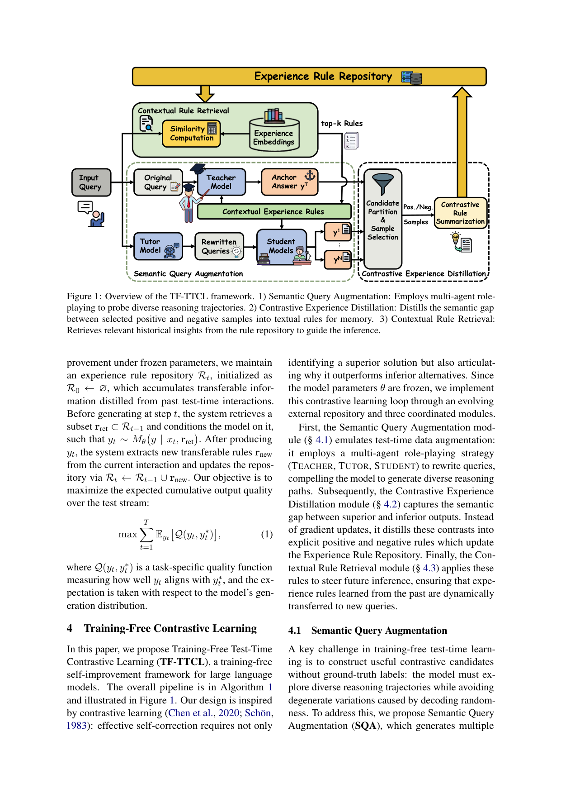
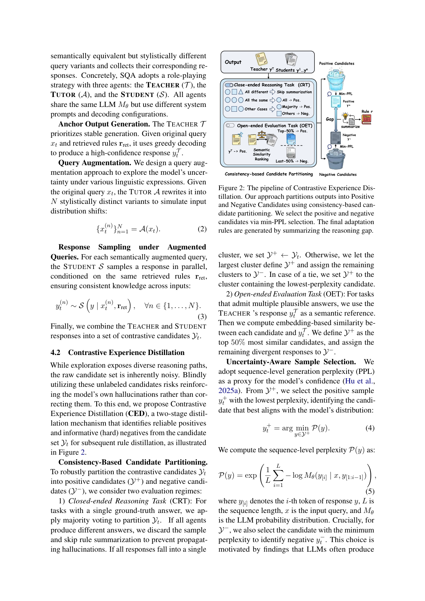

`tf_ttcl | Training-Free Test-Time Contrastive Learning for Large Language Models (TF-TTCL) | 华南理工大学 + 琶洲实验室（Kaiwen Zheng / Kai Zhou / Jinwu Hu 等共一，通讯 Fei Liu feiliu@scut.edu.cn） | arXiv:2604.13552v1, 2026-04-15（cs.CL；本调研窗内近作） | 主题线 L?（test-time 学习 / 免训练自进化 / 记忆规则）·相关性 High`

> 三标注：【原文】直述；【推断】有据判断（附依据）；【待核】拿不准的关键事实。

══ 第一层：一眼看懂 [light] ══

- 🟦 **TL;DR**：想让一个**冻结/黑盒**LLM（如只能 API 调用的 Qwen-Plus、DeepSeek-V3.2）在测试时一边答题一边自我改进，但又**不改参数、不靠外部知识库、不靠 ground-truth**。本文做法：对每个到来的 query，先用"多智能体角色扮演"（TEACHER 贪心出锚答案、TUTOR 改写出多个等价问法、STUDENT 在各问法上采样）造出一批好坏不一的推理轨迹；再**对比**其中"较优 vs 较劣"的轨迹，把它们的语义差距**蒸馏成显式文本规则**（正面规则=该怎么做、负面规则=要避免什么），存进经验规则库；后续 query 用检索把相关规则取回来注入 prompt，引导冻结 LLM 走对路、避开已观察到的错误。整套是"Explore-Reflect-Steer"在线单遍循环，规则就是"语义梯度(semantic gradients)"。【原文 Abstract/§1/§4】
- **最巧的一步**：**对"较优 vs 较劣"输出之间的语义差做对比蒸馏，且负样本与正样本都取 min-PPL（模型最自信的那个）**。负样本取最低困惑度的用意是：专挑模型"最自信却可能错"的轨迹来提取"该避免什么"的拦截信号（hard negative），这是最强的纠偏信号。抽掉对比蒸馏(CED)整个方法就垮——消融里去掉 CED 在 GSM8k 掉得最多（87.49→85.97）。【原文 §4.2/§5.3/Table 5】
- 代码：**https://github.com/KevinSCUTer/TF-TTCL**（摘要末直接给出）。【原文 Abstract】

══ 第二层：为什么做（写透） ══

- **研究背景**："train-once, deploy-anywhere"范式下，冻结模型的静态参数难泛化到 OOD/复杂推理的动态数据流；TTA 想用测试实例在线弥合分布差，强调模型应能从自身推理经验里持续学习。【原文 §1】
- **解决的具体痛点**：现有 test-time 学习要么 ① 梯度更新参数（Tent/TLM/TTRL 等）——需**白盒**、带不小算力/显存开销，不适配"模型冻结、黑盒 API"的现代部署；要么 ② 免参数但有别的限制——静态 prompt（CoT）不能按实例自适应；RAG/反馈优化**重度依赖外部知识库或 ground-truth verifier（如单测）**，现实常不可得。核心 gap：当前 test-time 范式**要么改参数、要么要外部指导**。【原文 §1/§2】
- **相关工作 & 各自不足**（Table 1 对比 4 维：外部知识 / 源数据 / 免梯度 / 在线）：
  - TTA(Tent)、TTT(Hardt-Sun)、TTRL：均**非免梯度**；TTRL 还是**多遍**（先迭代更新参数再评测），不符合"请求顺序到达"的真实在线。【原文 §2.1/Table 1】
  - ExpeL / AvaTaR（累积经验轨迹）：主要是**离线**框架；ExpeL 靠外部环境 reward，AvaTaR 靠 ground-truth 抽 insight——都进不了严格 test-time。【原文 §2.2】
  - **Training-Free GRPO（Cai 2025）**：免反传优化策略，但**重度依赖可验证 ground-truth reward**，没有时退化成多数投票。【原文 §2.2】
  - **ReasoningBank（Ouyang 2025）**：支持无 GT 标签的在线 test-time scaling，但仍**需确定性外部反馈（如代码执行结果）+ LLM-as-Judge** 来切分轨迹；缺显式外部反馈时退回 naive LLM-as-Judge，受**严重自我确认偏差**之苦。【原文 §2.2/Table 1】
  - → TF-TTCL 唯一同时满足：免外部知识 + 免源数据 + **免梯度** + 在线（Table 1 最后一行全 ✓/✗ 对位）。【原文 Table 1】
- **动机链**：冻结/黑盒部署是常态 → 改参数法用不了、要 GT/外部库的法子拿不到信号 → 那唯一能用的监督就藏在**模型自身输出之间的相对好坏**里（呼应对比学习：没有 GT，但"较优 vs 较劣"的语义差含丰富监督）→ 不更新参数，而把这些差距**蒸成文本规则当"语义梯度"**存起来复用。为什么不直接用 LLM-as-Judge 自评？会有自我确认偏差；为什么不 majority voting 就好？开放式任务没有可投票的唯一答案。【原文 §1/§2.2】
- **与最近邻工作的 Δ**：最像 **ReasoningBank**（同为在线、reasoning memory、无需 GT 标签）。Δ：ReasoningBank 仍需**确定性外部反馈 + LLM-as-Judge** 切分轨迹；TF-TTCL 是**完全无反馈(feedback-free)、无监督**，靠"多问法采样 + 一致性/PPL 切分 + 对比蒸馏"自给监督。【原文 §2.2/Table 1】

══ 第三层：怎么做 + 靠不靠谱 ══

- **方法流水线（Algorithm 1 + §4，三模块）**：对测试流每个 query x_t：
  1. **检索**：从规则库 R 取回相关规则 r_ret（式8）；
  2. **Semantic Query Augmentation (SQA, §4.1)**：三个共享同一 LLM 但用不同 system prompt/解码配置的角色——**TEACHER** 贪心(temp 0)对原 query+r_ret 出高置信锚答案 \(y^T_t\)；**TUTOR** 把 query 改写成 N 个风格不同但语义等价的变体 \({x^(n)_t}=A(x_t)\)（模拟输入分布扰动）；**STUDENT**（temp 0.7, top-p 0.9）在每个变体上各采样一个响应 \(y^(n)_t\)。合并为候选集 `Y_t`；
  3. **Contrastive Experience Distillation (CED, §4.2)**：
     - **一致性切分**：闭式推理任务(CRT，有唯一答案)用**多数投票**切正/负候选——全不同则**跳过**（防传播幻觉）、全同则全为正、否则最大簇为正其余为负、平局看最低 PPL；开放式任务(OET，多合理答案)以 TEACHER 答案为语义参考，**embedding 相似度 top-50% 为正、其余为负**；
     - **不确定性选样**：正样本 \(y^+_t\) = Y+ 里**最低 PPL**（最贴模型分布的可靠正例，式4/5）；负样本 \(y^-_t\) = Y− 里**也取最低 PPL**（专挑模型"自信的错"做 hard negative，式6）；
     - **对比规则总结**：用 summarizer（同 LLM 不同 prompt）把 (x_t, y^+_t, y^-_t) 的推理差距蒸成 \({r^+_t（该做什么）, r^-_t（要避免什么）}\)（式7），append 进 R；
  4. **Contextual Rule Retrieval (CRR, §4.3)**：维护**两个不相交记忆集** R_pos / R_neg，每条 (e, r) 以 e=Embed(r) 为键；新 query 用 Embed(x_t) 余弦相似各取 **Top-K 正 + Top-K 负** 规则，用结构化 prompt（明确标注正/负标题）注入；负规则=剪枝已知错误路径，正规则=导向已验证解法。【原文 Alg.1/§4.1-4.3】
- **逐组件必要性 / 消融（§5.3）**：
  - **CED 最关键**：去掉它掉最多（GSM8k 87.49→85.97，Finance 0.2863→0.2639），是框架基石。【原文 Table 5】
  - **CRR 任务依赖**：开放式 Finance 去掉检索(用全部规则截断)**大跌**(0.2863→0.2596)；GSM8k 去掉 CRR 几乎不变(→87.34)——说明数学逻辑规则普适性高、开放式任务对规则对齐高度敏感。Table 6 进一步：CRR 换**随机规则**在 GSM8k 仍 87.41，但 Finance 跌到 0.2665。【原文 §5.3/Table 5/6】
  - **SQA 贡献最小**（去掉 GSM8k 87.49→87.11），只是温和增候选多样性。【原文 Table 5】
  - **正负规则不对称**：去**负规则**比去正规则掉得更狠（GSM8k 87.49→86.88 vs →87.19）——负规则提供独特"拦截信号"防重复高概率错误，正规则多在重申模型已会的。【原文 §5.3/Table 6】
- **关键机制直觉**：没有 GT，就让模型自己造一批"同题不同解"，再用"一致性 + 困惑度"两把尺子近似判好坏，把"为什么这个对/那个错"写成自然语言规则当外部记忆——相当于用**文本规则替代反传梯度**（"semantic gradients"），冻结模型靠检索这些规则在 context 里"现学现用"。负样本特意挑"最自信的错"是借了对比学习 hard negative 的思想（Robinson 2021）。【原文 §1/§4.2】
- **实验与证据（§5）**：
  - 数据集：闭式推理(CRT)——GSM8k、MATH-500、AIME24、Minerva；开放式(OET)——**DomainBench**(Hu 2025a，含 Geography/Agriculture/Medicine/Finance 四专域，测分布偏移)。【原文 §5.1】
  - 指标：CRT 用 Exact-Match 准确率；OET 用 ROUGE-Lsum。【原文 §5.1】
  - 模型：开源 **Llama-3.1-8B-Instruct**（主）；黑盒 API **Qwen-Plus、DeepSeek-V3.2**。embedding 用 **Qwen3-0.6B-Embedding**；检索 Top-30 正 + Top-30 负；4 个 STUDENT 样本。【原文 §5.1/实现细节】
  - 基线：Tent / EATA / COME / TLM（梯度类 TTA）、**TF-GRPO**；黑盒设定下只比 CoT + TF-GRPO。【原文 §5.1】
  - **支撑核心主张的关键数字**：
    - CRT（Table 2, Llama-3.1-8B）：TF-TTCL 全面最佳，平均 **44.86%**（GSM8k 87.49 / MATH500 54.00 / AIME24 13.33 / Minerva 24.63），超 TF-GRPO(41.13)、TLM(40.31)、Base(39.00)。注意多数**梯度类 TTA（Tent/EATA/COME）反而低于 Base**（如 Tent 37.68<39.00）。【原文 Table 2】
    - OET（Table 3）：平均 ROUGE-Lsum Base 0.1731→TF-TTCL **0.2194**，四域全最佳；而 **TF-GRPO 在开放式上反退化**(0.1731→0.1618)——因开放生成无确定 GT，GRPO 拿不到有意义 reward。这是 TF-TTCL"免 GT"优势最有力的证据。【原文 §5.2/Table 3】
    - 黑盒（Table 4）：DeepSeek-V3.2 上 TF-TTCL 全面最佳(AIME24 83.33 / Finance 0.2919)；Qwen-Plus 上 TF-GRPO 虽提升 AIME24 但**过拟合致 Finance 退化**，TF-TTCL 两边都升——更平衡。【原文 §5.2/Table 4】
  - **效率（Table 7）**：TUTOR/STUDENT **并行** + 规则总结(0.39s)**异步**后台 → 用户感知延迟仅 **2.01× 单次调用**（4.11s vs 2.05s），且异步更新在下个 query 到来前完成，保持严格在线单遍；**相似度 FIFO 剪枝**把库限到 1000 条，不仅控开销还当正则、**反而略升**(87.49→87.72)。【原文 §5.3/Table 7】
  - **公平性**：所有方法同样的生成超参；TF-GRPO 在无 GT 的 CRT 用多数投票合成 reward 以公平对照。较扎实。【原文 §5.1/§5.2】
  - "看着强但留疑"的点：【推断】CRT 上对 Base 的绝对提升其实**不大**（GSM8k 82.49→87.49、MATH500 49.2→54.0），多步多采样(4 STUDENT + TUTOR + TEACHER)带来的 ~2× 延迟换来的是个位数百分点；真正拉开差距的是**开放式 + 黑盒**场景（TF-GRPO 在那退化）。依据：Table 2 vs 3/4 的对比。
- **假设与失效边界**：
  - 【原文】探索的**边际收益递减**：TUTOR 再强，模型接近能力天花板(saturation)后增益消退。【原文 Limitations】
  - 【原文】当前是**一次性注入所有检索规则**(one-shot)，长程推理时上下文利用未必最优（拟用 progressive disclosure / Agent Skills 改进）。【原文 Limitations】
  - 【原文】输入配置灵活 → 更易受**对抗性 prompt 注入**，需配输入校验 + 原生安全过滤。【原文 Ethical Considerations】
  - 【推断】整套监督来自"模型自造轨迹的相对好坏"，若模型在某题**系统性全错**（所有问法都错向同一方向），一致性/PPL 切分会把"自信的错"当正例，规则会强化错误（self-confirmation 风险并未完全消除，只是比 naive LLM-Judge 弱）。依据：CRT 切分规则"全同则全为正"+ min-PPL 选样的设计。
  - 【推断】OET 用 TEACHER 答案当语义参考定正负，若 TEACHER 锚答案本身偏，正负标签会被带偏。依据：§4.2 OET 切分定义。
- **祛魅总结**：
  - 真贡献（硬货）：① 一个**真正免梯度 + 免外部知识 + 免 GT + 严格在线单遍**的 test-time 自改进框架（Table 1 四维全占，填了 ReasoningBank/TF-GRPO 留下的"需外部反馈"缺口）；② "对比正负轨迹→蒸成显式正/负规则当语义梯度"这一干净机制，且**负规则比正规则更关键**是有洞见的发现；③ 工程上并行+异步+FIFO 剪枝把多智能体反思的延迟/内存压到可部署（2× 延迟、定容库）。
  - 包装/可能高估：【推断】"contrastive learning" 是**类比**而非真的对比损失——没有 InfoNCE/梯度，只是借"正负对比"直觉做文本规则蒸馏；"semantic gradients" 同为隐喻。读者勿误以为有对比损失训练。依据：§4 全程无任何参数更新、loss 只用于 PPL 度量。
  - 【推断】CRT 上对强基线(TLM/TF-GRPO)的增量较小，框架真正不可替代的价值在"黑盒 + 开放式 + 无 GT"这一交集场景。依据：Table 2/3/4 对比。

══ 结构化抽取 ══

- 🎯 **机制速览 6 轴** [light]：
  | 学什么信号 | 改什么 | 何时改 | 免梯度? | 记忆-技能生命周期 | 防遗忘机制 |
  |---|---|---|---|---|---|
  | **自反思 / 经验库**：模型自造轨迹间的相对好坏（一致性 + 困惑度 PPL 近似），无环境 reward、无 GT、无外部库【原文 §1/§4.2/Table 1】 | **记忆**（外部经验规则库 R=R_pos∪R_neg 里的文本规则）+ 经规则注入间接改 **prompt/context**；**不改参数**【原文 §4.3】 | **在线 per-step（per-query）单遍**：每个 query 现造轨迹→蒸规则→入库，规则总结异步后台完成【原文 Alg.1/§5.3】 | **是**（纯文本规则+检索+ICL，全程冻结/黑盒；PPL 只用于度量不反传）【原文 §1/§4】 | 写入：CED 蒸出 r^+/r^- 入对应集；检索：CRR 按 query embedding 余弦 Top-K 正/负；遗忘/淘汰：**相似度 FIFO 剪枝**定容(如 1000 条)；共享：未涉及跨 agent 共享【原文 §4.2/4.3/§5.3】 | **隔离 + 容量正则**：正负规则分两集隔离防混淆；FIFO 剪枝滤冗余既控规模又当正则(略升精度)；不改参数→无参数级遗忘【原文 §4.3/§5.3】 |
- ⑦ **开源代码 + 框架/harness**：**已开源 https://github.com/KevinSCUTer/TF-TTCL**【原文 Abstract】。框架：**无 RL/训练框架**（免梯度，纯推理时多智能体 + 检索）；embedding 用 **Qwen3-0.6B-Embedding**；后端为 HF/API 推理（Llama-3.1-8B 本地 + Qwen-Plus/DeepSeek-V3.2 API），论文未点名具体推理库。〔待核：仓库内具体依赖/向量库实现，需看 repo〕【原文 §5.1】
- 💰 **资源/成本与可扩展性**：【原文】用户感知延迟 ≈ 2.01× 单次 LLM 调用（4.11s vs 2.05s，靠 TUTOR/STUDENT 并行 + 规则总结 0.39s 异步）；检索 Top-30+30；4 STUDENT 样本；FIFO 剪枝把库限到 1000 条→开销有界且精度略升。黑盒 API 友好（按 token 计费，多智能体会增 API 调用量）。【原文 §5.3/Table 7/实现细节】
- 🎯 **对"探索-巩固"idea 对标** [light]：**强支撑 + 可借组件 + 竞品**。整套"造多样轨迹(探索)→对比蒸成规则(巩固)→检索复用(再用)"是"探索-巩固"的**免训练文本实例**；其多处与你的 idea 同构/可借：① **负规则=拦截信号**对应你"path-recovery 单点接管/避免错误路径"——可直接迁移为"把高熵/低置信关键步的错误轨迹蒸成负规则"；② **min-PPL 选 hard negative**呼应"挑模型最自信处的错"做纠偏；③ 正/负规则**不对称（负更关键）**这一发现，对"巩固时该强化什么"有直接启示。竞品角度：它是"不动参数、纯记忆/规则巩固"路线，正好与你 OPD/MTP"参数级巩固"对照——若文本规则就能拿到大半增益，需论证参数级巩固在"内化/长程/跨任务复用"上的额外不可替代价值。【推断：依据是其三模块与"探索→蒸馏→复用"逐一对应，且负规则机制与 path-recovery 思想同构】
- 🔭 **开放问题/未来方向**：
  - 【原文】用 progressive disclosure（如 Agent Skills）**逐步/动态注入规则**而非一次性全注，优化长程推理的上下文利用；缓解探索饱和；对抗 prompt 注入的鲁棒性。【原文 Limitations/Ethics】
  - 【推断】把"模型自造轨迹的相对好坏"信号与少量真反馈/参数级巩固混合，缓解 self-confirmation；让规则库支持跨 query/跨 agent 共享与去重；OET 切分摆脱对单一 TEACHER 锚答案的依赖。依据：其 self-confirmation 残留风险 + OET 切分定义。
- 🖼 **关键图 top-2** [light]：
  · 
    这是**原文 Figure 1**（渲染自 p4）。展示三模块咬合：Semantic Query Augmentation（TEACHER/TUTOR/STUDENT 多角色造多样轨迹）→ Contrastive Experience Distillation（切正负、选样、蒸规则）→ Contextual Rule Retrieval（按相似度取 top-k 规则回注），中间是 Experience Rule Repository。选它因为它一图说清全文"Explore-Reflect-Steer"闭环与各角色分工。
  · 
    这是**原文 Figure 2**（渲染自 p5）。细化最关键的 CED 模块：上半 CRT 用一致性(全同/全不同跳过/最大簇)切分，下半 OET 用对 TEACHER 的语义相似 top-50% 切分；正负候选各取 min-PPL，再 summarize 出规则 r。选它因为 CED 是消融证明的"最关键组件"，此图把"如何在无 GT 下造监督"的核心逻辑讲透。
