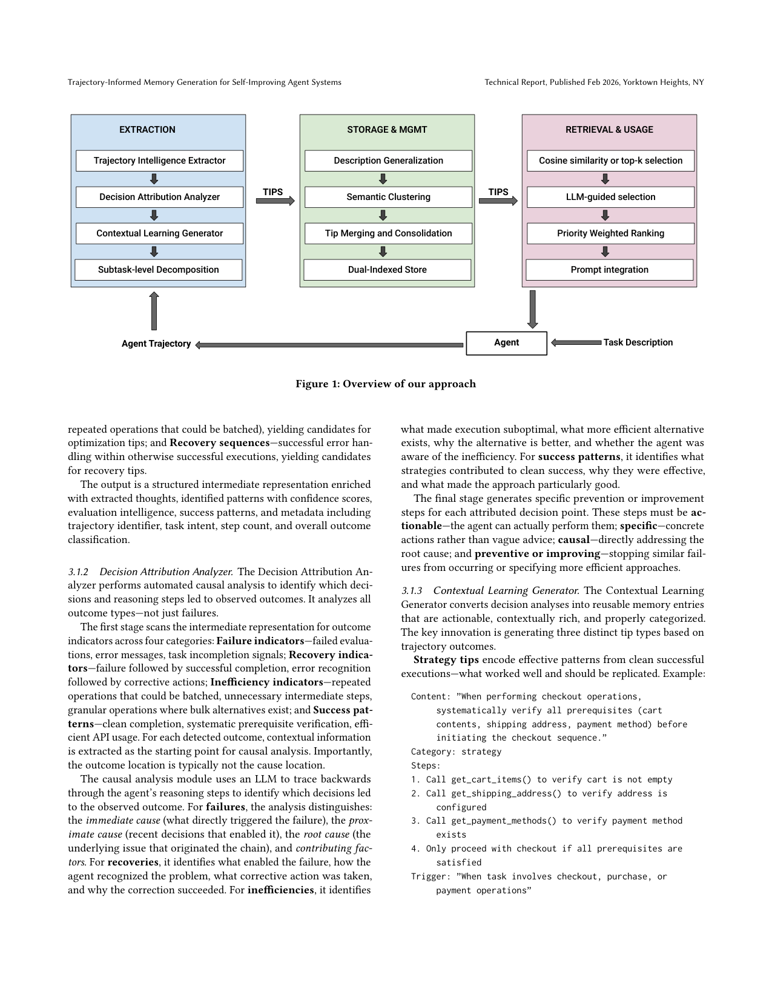
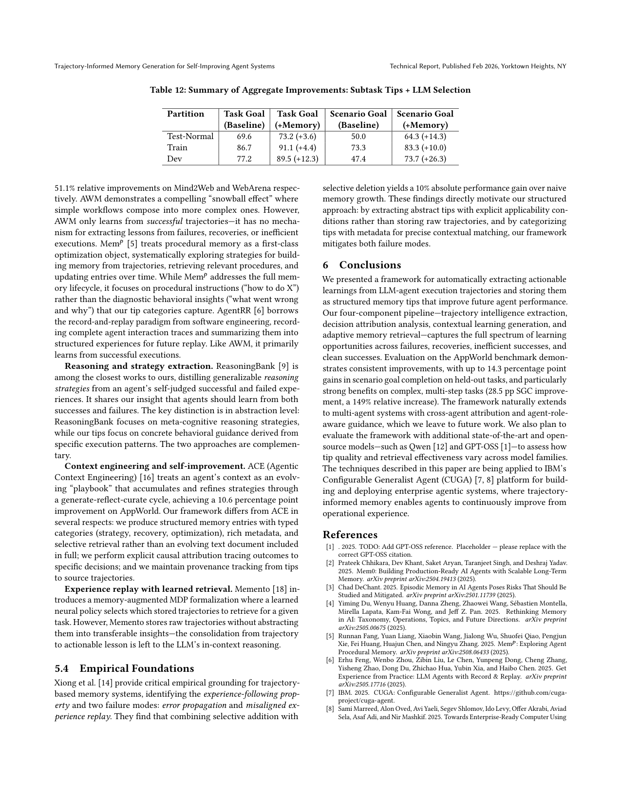

`ti_memgen | Trajectory-Informed Memory Generation for Self-Improving Agent Systems | IBM Research (Agents and Automation Lab, Yorktown Heights) | 2026-03-11 v1 arXiv (cs.AI) / Technical Report (applied to IBM CUGA) | L? 记忆线（免训练经验记忆 + 因果归因）·相关性 High`

══ 第一层：一眼看懂 [light] ══
- 🟦 **TL;DR**：智能体"健忘"——昨天卡在某 API 认证流程，今天还卡。现有通用记忆(Mem0/A-MEM)只存对话事实、不懂执行模式、不做因果分析、只学成功不学失败。本文提出一个**纯 LLM/提示驱动(免训练、免梯度)的"轨迹→记忆"流水线**：(1) Trajectory Intelligence Extractor 语义解析推理模式 →(2) Decision Attribution Analyzer 做因果归因(immediate/proximate/root cause) →(3) Contextual Learning Generator 产三类带 provenance 的 tip：strategy(干净成功)/recovery(失败后恢复)/optimization(低效成功) →(4) Adaptive Retrieval 注入 prompt。在 AppWorld 上 held-out SGC +14.3pp、复杂任务(Difficulty-3) SGC +28.5pp(相对 +149%)。
- **最巧的一步**：**"三类 tip × 因果归因 × subtask 粒度分解"**——尤其 (a) **从失败/低效也提取**(recovery/optimization tip，而非只学成功)，(b) **因果回溯**(失败发生在第15步、病根常在第3步)，(c) **subtask 级分解**(认证/分页取数/处理/完成等通用子任务，跨任务迁移)。消融式对比显示：**tip 粒度驱动 TGC、检索策略(LLM-guided)驱动 SGC(跨变体一致性)**；抽掉因果归因/失败学习就退回普通"成功 workflow 记忆"(AWM 类)。

══ 第二层:为什么做(写透) ══
- **研究背景**:LLM agent 靠"推理→选动作→执行→看结果"迭代做自动化(web 导航、API 编排)。但因 **LLM 是无状态的,agent 健忘**——昨天卡在某 API 认证流程,今天还卡;发现的高效策略不会自动迁移到相似任务;成功从错误恢复的经验对未来执行毫无帮助。【原文 §1】
- **解决的具体痛点(用购物车例子讲透)**:同一个购物车任务的三种轨迹各含不同价值的教训——① **低效成功**(循环单删而非一次清空)→ 该出 **optimization tip**;② **失败后恢复**(没加支付方式就 checkout 失败,识别后补上)→ 该出 **recovery tip**;③ **干净成功**(执行前系统校验前置条件)→ 该出 **strategy tip**。现有方法抓不住这三类:rule-based 脆且要人工预想;prompt engineering 是泛化指导、不针对真实部署经验、无自动改进机制;**通用记忆系统(Mem0/A-MEM)只存对话事实,不懂执行模式、不做因果分析、无 strategy/recovery/optimization 分类、无 provenance 追溯**。【原文 §1】
- **相关工作 & 各自不足**:① 通用记忆(Mem0/A-MEM)——存对话事实进向量库,缺执行模式理解/因果归因/结构化分类/provenance;② 从轨迹抽知识的近作(AWM 抽成功 workflow、procedural instructions、reasoning strategies、ACE 演化 playbook)——**多数只学成功、缺显式失败因果归因、或产出 monolithic 文档而非结构化可检索条目**;③ 实证(Xiong)显示**朴素经验累积会导致错误传播+误配重放**,凸显需质量感知的记忆整理。【原文 §1】
- **动机链**:现状=agent 健忘、现有记忆只存对话事实学成功 → 缺陷=不懂执行模式、不做因果归因、不学失败/低效、无 provenance、朴素累积会错误传播 → 关键洞察:**agent 执行历史(轨迹)本身含丰富语义,可抽成带因果归因、分类型、带溯源的结构化 tip** → 所以做一条**纯 LLM/提示驱动(免训练、免梯度)的"轨迹→记忆"流水线**。为什么不用 RL?作者明确把 RL 列为对比项并指其"需大量数据、算力贵、黑箱、不分 tip 类别"的不适用性。【原文 §1】
- **与最近邻的 Δ**:相比 **ReasoningBank**(偏元认知策略,互补)、**ACE**(演化 playbook,本文更结构化+因果+provenance)、**Memento**(存原始轨迹不抽象),关键差异=**从失败/低效也提取(recovery/optimization tip,而非只学成功)+ 因果回溯定位病根步 + subtask 粒度分解实现跨任务迁移 + provenance 追溯**。这个差异有用,因为失败/低效里藏着成功推不出的信息,且因果归因能把"失败发生在第15步"修正为"病根在第3步"。【原文 §1, §3】

══ 第三层:怎么做 + 靠不靠谱 ══
- **方法流水线(四组件三阶段,Fig.1)**:**EXTRACTION**——① **Trajectory Intelligence Extractor** 语义解析 agent 推理模式 →② **Decision Attribution Analyzer** 做因果归因(immediate/proximate/root cause,定位哪个决策导致失败/恢复/低效)→③ **Contextual Learning Generator** 产三类带 provenance 的 tip(strategy/recovery/optimization)并做 **subtask 级分解**(认证/取数/处理/完成等可复用逻辑相);**STORAGE & MGMT**——subtask 描述泛化去实体 → 语义聚类(HAC@~0.85)把跨任务共享子任务模式的 tip 聚在一起 → **LLM-based merging 去重/解冲突(成功轨迹优先)/综合** → 双表示存储(向量嵌入 + 结构化元数据);**RETRIEVAL & USAGE**——cosine(τ∈0.5-0.7,top5)或 **LLM-guided 元数据过滤** → 优先级加权排序 → 注入 prompt 的 "guidelines" 段。形成自强化循环但非在线梯度更新。【原文 §3, Fig.1】
- **逐组件必要性**:① 因果归因——没它退回普通"成功 workflow 记忆"(AWM 类),无法定位病根;② 失败/低效提取(recovery/optimization)——没它丢掉成功推不出的边界信息;③ subtask 粒度泛化——没它 tip 绑定具体实体、无法跨任务迁移;④ 质量感知整理(成功优先冲突解决 + provenance)——没它会触发 Xiong 指出的错误传播/误配重放。论文用配置对比(tip 粒度 × 检索策略)代替传统 ablation,显示**tip 粒度驱动 TGC、检索策略(LLM-guided)驱动 SGC**。【原文 §3, §4】
- **关键机制(直觉)**:① **因果回溯**——失败常在第15步爆发但病根在第3步(早期前置校验缺失),归因到 root cause 才能生成有用的 recovery tip;② **subtask 抽象 + 聚类合并**——把"在 Amazon 删购物车"泛化成"清空购物车用 bulk 操作",再把不同任务里同子任务模式的 tip 聚类合并去冗,实现跨任务迁移;③ **三类 tip 的互补**——strategy(怎么做对)/recovery(失败后怎么救,含失败模式+识别信号+纠正步骤)/optimization(成功但低效怎么更省)。【原文 §3】
- **实验与证据(支撑核心主张的关键数字)**:
  · benchmark = **AppWorld**(任务平均跨 1.8 apps、9.5 APIs;指标 **TGC**=task goal completion 过所有单测、**SGC**=scenario goal completion 须该 scenario 全部变体[通常3个]都过,更严;任务按 Difficulty 1/2/3 分);模型 = GPT-4.1。【原文 §4】
  · **核心结果**:held-out 任务 **SGC +14.3pp**;复杂任务(Difficulty-3)**SGC +28.5pp(相对 +149%)**——增益在难任务上尤大。subtask-tip + LLM-guided 在 Test-Normal(+3.6 TGC/+14.3 SGC)、Train(+4.4/+10.0)、Dev(+12.3/+26.3)全面提升,**SGC 增益处处大于 TGC**=记忆主要改善"跨变体一致性"。【Abstract, Table 12】
- **baseline 公平性**:与无记忆基线对比 + 配置矩阵(tip 粒度 × 检索策略)拆解贡献来源,公平。**看着强但没回答核心问题**:Difficulty-1/已满分任务上注 tip 反而轻微干扰(94.4% vs 基线 100%)——论文诚实报告了这个"简单任务上记忆是负担"的边界。
- **假设与失效边界**:【原文】benchmark 仅 AppWorld、模型仅 GPT-4.1(承诺未来测 Qwen/GPT-OSS);Difficulty-1 任务注 tip 反伤。【推断】整条流水线靠多次 LLM 调用做抽取/归因/合并/检索→**推理成本与质量都系于底座 LLM,因果归因正确性未独立验证(可能幻觉错误病根)**;提取/整理是离线批处理,**不适合在线 per-step 适应**;LLM-guided 检索每任务多 1 次 LLM 调用,延迟/成本与 cosine 检索有权衡。
- **祛魅总结**:真贡献(硬货)=**把"从轨迹学经验"做成"因果归因 + strategy/recovery/optimization 三类带 provenance 的结构化 tip + subtask 粒度跨任务迁移 + 质量感知整理"的完整免训练流水线**,且难任务 +28.5pp SGC 很有说服力,recovery tip 是 path-recovery 的显式物化。【推断】"免梯度纯提示"是优点(无灾难性遗忘、可解释)也是天花板——质量上限受底座 LLM 封顶、因果归因可能幻觉;且本方法框架本身无公开仓(只应用于 IBM CUGA),工程可复现性受限;SGC>TGC 的增益说明它主要帮"一致性"而非"绝对能力",这一点容易被 +149% 的相对增益数字夸大。

══ 机制速览 6 轴 [light] ══
| 维度 | 内容 |
|---|---|
| **学什么信号** | 经验库(自身执行轨迹) + 可选的 ground-truth 成功/失败标签(无标签时由自反思信号推断 outcome)；**无环境 reward、无梯度信号** |
| **改什么** | **外部记忆(prompt-level)** 与 **harness/context**——产结构化 tip 注入 prompt"guidelines"段；**不动任何参数** |
| **何时改** | **离线批量**：轨迹完成后跑三阶段提取+聚合；运行时(per-task)检索注入。自强化循环但非在线梯度更新 |
| **免梯度?** | **是（纯 LLM/提示，全程零参数更新）**——明确把 RL 列为对比项并指其"需大量数据、算力贵、黑箱、不分 tip 类别"的不适用性 |
| **记忆-技能生命周期** | 写入(轨迹→三类 tip,带 id/category/steps/trigger/priority/source-traj provenance)→**整理(描述泛化去实体→语义聚类 HAC@~0.85→LLM 合并:去重/冲突解决[成功轨迹优先]/综合)**→检索(cosine τ∈0.5-0.7,top5 或 LLM-guided 元数据过滤)→注入；**遗忘=合并去冗 + 选择性保留**(引 Xiong 实证:选择增+选择删 +10%) |
| **防遗忘机制** | 不适用(不动参数、无灾难性遗忘问题)；靠**provenance + 质量感知整理**抑制错误传播/误配重放两大失败模式 |

🖼 **关键图 top-2** [light]：

图1（方法主图）：EXTRACTION(轨迹智能抽取→决策归因→情境学习生成→subtask 分解) → STORAGE&MGMT(描述泛化→语义聚类→tip 合并整理→双索引存储) → RETRIEVAL&USAGE(cosine/topk 或 LLM-guided 选择→优先级加权排序→prompt 注入)。选它因为这是全文唯一架构图、说清四组件如何咬合成自强化循环。

表12（核心结果表，此页同含 Table 7-11）：subtask-tip + LLM-guided 在 Test-Normal(+3.6 TGC/+14.3 SGC)、Train(+4.4/+10.0)、Dev(+12.3/+26.3) 全面提升；**SGC 增益处处大于 TGC**=记忆主要改善"跨变体一致性"。选它因为它是支撑核心主张的关键证据，并暴露"粒度驱动 TGC、检索策略驱动 SGC"的拆解。

══ 假设与失效边界（一句）[推断] ══
【原文】benchmark 仅 AppWorld、模型仅 GPT-4.1(承诺未来测 Qwen/GPT-OSS)；Difficulty-1/已满分任务上注 tip 反而轻微干扰(94.4% vs 基线 100%)。【推断】整条流水线靠多次 LLM 调用做抽取/归因/合并/检索→推理成本与质量都系于底座 LLM，因果归因正确性未独立验证(可能幻觉错误病根)；提取/整理是离线批处理，不适合在线 per-step 适应。

══ 对"探索-巩固"idea 对标（一句）[light] ══
**支撑 + 可借组件（免训练对照组）**：是"探索-巩固"的**纯提示/免梯度实现**对照——把 path-recovery 显式物化为 **recovery tip(失败模式+识别信号+纠正步骤)** + 用**因果回溯定位病根步**(与 TSRD 切关键步/高熵低置信单点接管思路同向)；可借积木=【strategy/recovery/optimization 三类 tip 模板 + provenance 追溯】+【subtask 粒度泛化(去实体→聚类→合并)实现跨任务迁移】+【成功轨迹优先的冲突解决规则】。竞品/邻居：作者自比 ReasoningBank(更偏元认知策略,互补)、ACE(演化 playbook,本文更结构化+因果+provenance)、Memento(存原始轨迹不抽象)。

══ 结构化补充 ══
- ⑦ **开源代码 + 框架/harness**：**框架本身无公开仓**（technical report，未给本方法的 GitHub）；只提到应用于 IBM **CUGA** 平台(https://github.com/cuga-project/cuga-agent，是 CUGA 而非本框架代码)。harness=AppWorld 评测框架 + 单 agent 简化 ReAct loop(GPT-4.1)。属"未开源/未找到(本方法)"。
- 💰 资源/成本：无 GPU 训练(免训练)；成本=批量 LLM 调用(抽取+归因+合并) + 运行时检索(cosine 零 LLM 调用 vs LLM-guided 每任务 1 次额外调用，明确权衡延迟/成本)。
- 🔭 开放问题：扩展到多 agent(跨 agent 归因、角色感知 guidance)；测更多开源模型族评估 tip 质量随模型的变化。
