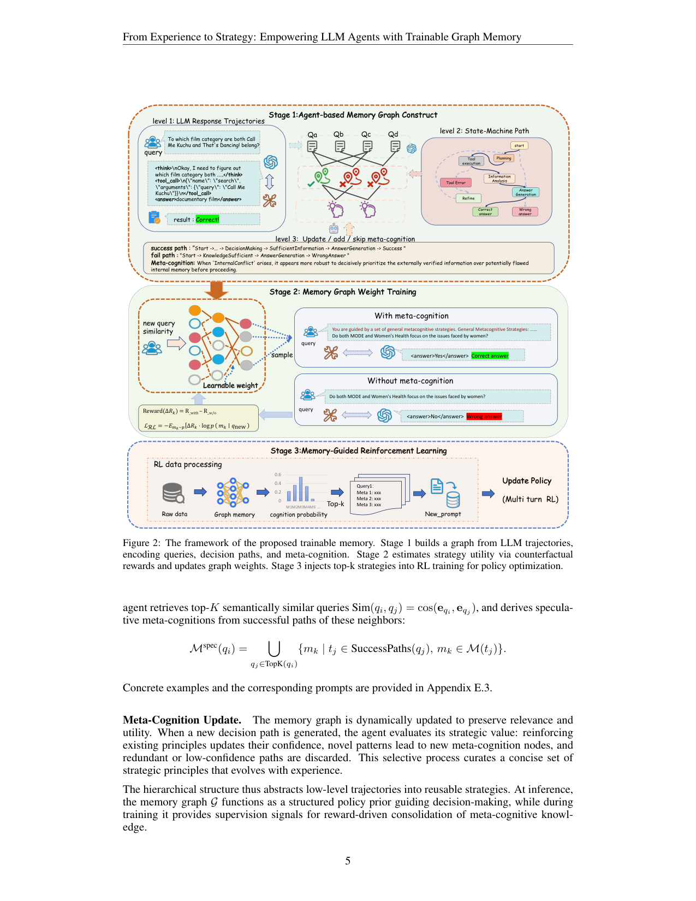
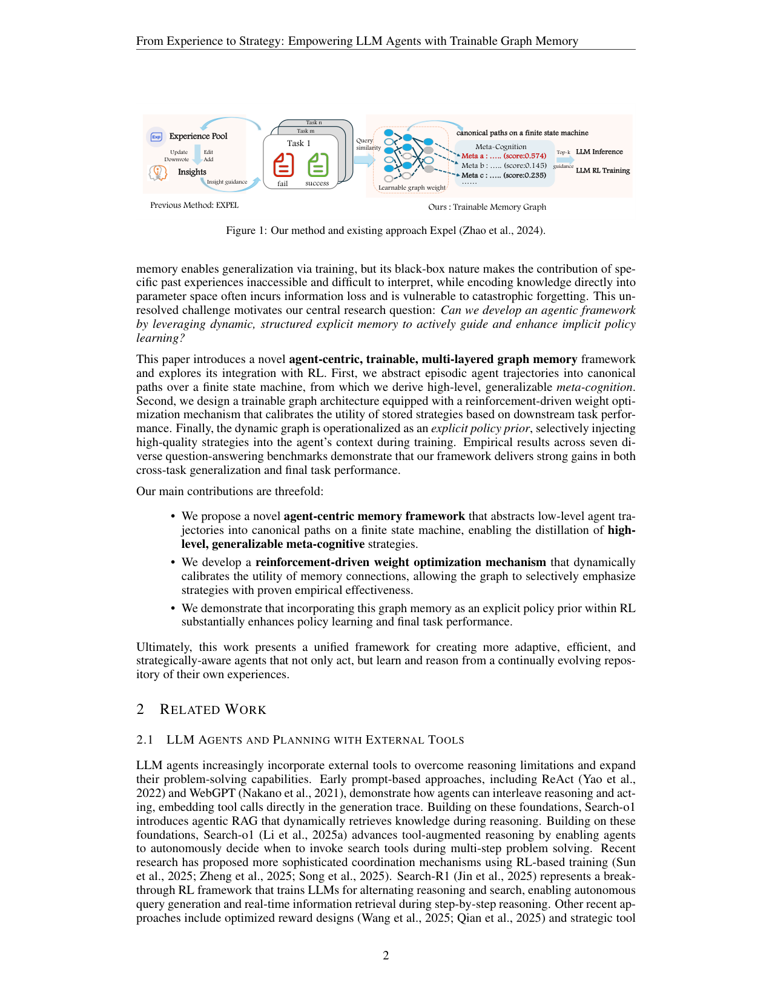

`trainable_graph_mem | From Experience to Strategy: Empowering LLM Agents with Trainable Graph Memory | 中科院自动化所(CASIA)+ 美团 Meituan + UCL(Siyu Xia, Zekun Xu; 通讯 Haifeng Zhang, Jun Wang) | 2025-11 arXiv:2511.07800v1(11 Nov 2025)· 预印本 | L?·"可训练图记忆 × RL"主线·高相关` 

> 三标注:【原文】=论文直述;【推断】=有据判断(附依据);【待核】=拿不准的关键事实。

══ 第一层:一眼看懂 ══

- 🟦 **TL;DR**:给 LLM agent 造一个**三层异构图记忆**:底层是 query 节点,中层把原始轨迹抽象成"有限状态机(FSM)上的标准决策路径",顶层从成功/失败路径对比里蒸馏出"元认知策略(meta-cognition)"——一句句人能看懂的高层启发式(如"当内部知识与外部检索冲突时,优先信外部已验证信息")。关键创新:**图的边带可学习权重**,用 RL(REINFORCE)按"加了这条策略 vs 不加"的奖励差(counterfactual reward gap)去打分,把"哪条策略真有用"学出来;然后把 top-k 高分策略拼到 prompt 前面,**既用于推理、也喂进 GRPO 的 RL 训练循环**。一句话:把"显式可解释的策略记忆"和"隐式参数学习"缝在一起。【原文 摘要+§4】

- **最巧的一步**:**用 counterfactual reward gap(ΔR = R_with − R_w/o)做图边权重的训练信号**。抽掉它,图就退化成静态结构化 prompt(=EXPEL 那类),无法区分"广泛有用的策略"和"过拟合的具体技巧"。消融 Figure 4(a)(b) 正好证明:freeze 权重(no-weight)后性能明显下滑(如 Bamboogle 0.391→0.359、2Wiki 掉得最狠)。这是它区别于所有静态图记忆方法的根。【原文 §5.4, Figure 4】

══ 第二层:为什么做 ══

- **研究背景**:LLM agent 在开放环境做长程推理/工具调用,但决策不稳——动作冗余、反复犯错甚至彻底失败。核心挑战:让 agent 不只"会做",还能"从成败中持续学习并适应"。【原文 §1】

- **解决的具体痛点(对偶困境)**:让 LLM 用历史经验有两条路,各有硬伤——
  - **隐式记忆(训练/RL 写进参数)**:能泛化,但**黑箱、不可解释**,且把知识塞进参数空间会**信息损失 + 灾难性遗忘**。
  - **显式记忆(prompt 注入)**:透明、可解释,但**缺乏适应性,难泛化到新任务/新情境**(注入什么全靠人/启发式,不会自我校准)。
  - 中心研究问题:**能不能用"动态的、结构化的显式记忆"去主动引导并增强隐式策略学习?**【原文 §1】

- **相关工作 & 各自不足**:
  - *自反思/经验复用线*:Reflexion(自言自语反馈)、EXPEL(挑可复用推理轨迹做 insight)——都是静态 insight,无效用评估。
  - *长程记忆线*:MEM1、MemAgent——管理长 horizon 记忆用量,但不抽策略。
  - *动态/图记忆线*:A-MEM(动态记忆笔记)、Zep/HopRAG(逻辑感知图做检索)、**G-Memory(分层图记忆,跨 trial 同化新轨迹)**——但这些**图结构基本是静态用法,缺乏"评估/精炼记忆组件效用"的机制**。
  - **本文的 Δ**:别人都"静态存储 / 任务特定设计",本文是**可训练图 + 效用感知的策略选择 + RL 驱动更新**。与最近邻 G-Memory 的关键差:G-Memory 靠"同化新轨迹"演化结构,**没有把边权当可学习参数用 reward 优化**;本文给每条边一个 learnable weight 并用 ΔR 训它。【原文 §2.2】

- **动机链**:agent 决策不稳要学经验 → 隐式记忆遗忘+黑箱、显式记忆不适应 → 想要"显式但可学习"的记忆 → 用图把轨迹结构化成 FSM 路径再抽策略(解决可解释) → 给边加可学权重 + RL 训(解决适应性) → 把策略当 policy prior 注入 RL 训练循环(让显式记忆反哺隐式学习)。为什么不用更简单的现成做法:纯 prompt 注入(EXPEL)不会校准策略效用、噪声策略会拖累;纯 RL 训参数会遗忘且不可解释。【原文 §1, §4】

══ 第三层:怎么做 + 靠不靠谱 ══

- **方法流水线(三阶段,对应 Figure 2)**:
  1. **Stage 1 分层图构建**:节点集 V=Q∪T∪M,有向边 (Q×T)∪(T×M),DAG 拓扑。
     - *Query 层 Q*:每个 query 节点含输入、执行轨迹、结果标签;一题多解则连多条 path。
     - *Transition Path 层 T*:把原始轨迹映射到**预定义 FSM**(状态如 StrategyPlanning / InformationAnalysis / ToolExecution / AnswerGeneration,转移 T:S×A→S)上的 canonical path,**滤掉执行级噪声**、只留语义决策点,使跨任务可比。
     - *Meta-Cognition 层 M*:对每个 query 采样 N 条轨迹;**若同时有成功 τs 和失败 τf,对比二者 FSM 路径**得到高置信 meta-cognition(解释成败分歧);只有失败时,则检索 top-K 相似邻居 query,从其成功路径取"speculative meta-cognition"。
     - 动态更新:新 path 来 → 强化已有策略置信 / 新模式建新节点 / 冗余低置信路径丢弃。【原文 §4.1】
  2. **Stage 2 可训练图权重优化**:把图当稀疏加权网络,信息按 H_T=σ((A_qt⊙W_qt)ᵀH_Q)、H_M=σ((A_tm⊙W_tm)ᵀH_T) 两跳传播。新 query 用与历史 query 的相似度激活 task-specific 子图;候选策略 m_k 的相关性 ρ(m_k|q)=Σ Sim(q,q_i)·w_qt·w_tm,softmax 成选择概率 p(m_k|q)。**用 REINFORCE 优化权重**:L_RL = −E[ΔR_k · log p(m_k|q)],ΔR_k = R_with(m_k) − R_w/o(正向 ΔR 强化支撑路径,负向削弱)。【原文 §4.2】
  3. **Stage 3 记忆引导的 RL(GRPO)**:**区别于"只在推理时用记忆"的前作**,把记忆塞进训练循环——对每个训练样本 q_train,按图权重算每个 meta-cognition 的相关性,取 top-k 拼成增强 prompt q̃=[m1…mk; q_train],作为 policy 输入;用 **GRPO** 优化 π_θ,目标 L_RL+Mem = −E[R(a)]。这样 policy 不在孤立中学,而被"持续演化的策略语料"引导,加速收敛。【原文 §4.3】

- **逐组件必要性**:
  - *边权 RL 优化*:Figure 4(a)(b) freeze 权重显著掉点 → **必要,有消融**。
  - *meta-cognition 数量 k*:Figure 4(c),k 从 0→3 稳升,>3 边际递减甚至引入噪声;**k=3 最佳** → 有消融。
  - *LLM 后端无关性*:Figure 4(d)/Table 4,把构图的 gpt-4o 换 Gemini-2.5-pro 仍优于无记忆 → 记忆图基本 model-agnostic,有消融。
  - *FSM 抽象这一步*:**无单独消融**(没有"不抽 FSM、直接用原始轨迹"的对照)——FSM 状态定义放附录 B.1。属"机制合理但未单独证明"项。【推断:依据=§5.4 只列三类消融,无 FSM 拆解】
  - *成功+失败对比 vs 只成功*:**无单独消融**(reasoningbank 那种 success-only 对照本文未做)。【推断:依据=§5.4】

- **关键机制直觉**:核心是"**把记忆检索做成可微/可强化的策略选择**"。图的边权 = "这条策略历史上对下游 reward 的贡献度"的可学习估计;ΔR 是无偏的边际效用探针(控制变量:同一题加/不加该策略)。softmax(ρ) 把"结构可达性 × 学到的效用"合成检索分布,REINFORCE 让高效用策略被更频繁选中。这本质是给"记忆该挑哪条"装了个 RL 学出来的、可解释的打分器。【原文 §4.2】

- **实验与证据**:
  - 数据集:**7 个 QA**——General(NQ, TriviaQA, PopQA)+ Multi-hop(HotpotQA, 2WikiMultiHopQA, Musique, Bamboogle)。检索:**2018 Wikipedia dump + E5 retriever,封装成 MCP 工具**让 LLM 自主调用。模型:Qwen3-8B / Qwen3-4B。协议:<think>/<tool_call>/<answer>。【原文 §5.1, 附录A.1】
  - **关键发现①(零训练推理,Table 1)**:Ours 8B 平均 0.365(相对 ITR baseline +9.3%,第一);4B 平均 0.351(**+25.8%**,小模型增益更夸张)。
  - **关键发现②(强泛化)**:**记忆只用 HotpotQA(唯一 in-domain)构建**,却在 NQ/TriviaQA/PopQA/2Wiki 等 OOD 上也 SOTA/有竞争力 → 学到的是推理结构而非过拟合模式。这是全文最有说服力的论据。
  - **关键发现③(RL 训练,Table 2)**:接入 GRPO 后,8B 平均 0.408(超 Search-R1 baseline +3.29%),4B 0.426(**+13.60%**);**且训练后的 4B(0.426)反超 baseline 8B(0.395)** → 效率证据。OOD(TriviaQA/Bamboogle)增益最明显。
  - **baseline 公平性**:推理侧比 ITR / Direct Inference / CoT / Direct Trajectory / A-MEM / EXPEL;训练侧以 Search-R1 为 base,各方法都加同样 GRPO。较公平。【推断:依据=§5.2 设置】
  - **看着强但需警惕**:绝对分数普遍偏低(很多 0.3–0.4 量级),且 **EXPEL 在训练侧反而掉点(8B −6.08%、4B −10.13%)**——说明"静态 insight 注入"在 RL 里会干扰,反衬本文 ΔR 加权的价值,但也提示"乱注入策略有害"这一风险真实存在。【原文 Table 1/2】

- **假设与失效边界**:
  - 【原文/推断】依赖**预定义 FSM 状态集**(StrategyPlanning 等)——换到非 QA、动作语义差异大的领域,FSM 是否还能干净抽象未验证;论文实验全在 QA + 搜索工具。【推断:依据=所有数据集均为 QA、FSM 手工定义在附录】
  - 【原文】k 过大引入噪声(>3 边际递减),策略多样性与清晰度有 trade-off。
  - 【推断】ΔR 需要对同一 query 跑"加/不加策略两条轨迹"来估计 → **构图阶段采样成本翻倍**;且 reward 信号在无明确 reward 的开放任务里难获取。依据=§4.2 counterfactual 定义。
  - 【推断】图随经验增长,虽有"丢弃冗余低置信路径"的更新规则,但**未给出规模/检索延迟的定量分析**——长期可扩展性是空白。依据=正文无 cost/规模表。

- **祛魅总结**:
  - **真贡献(硬货)**:(a)把"记忆选择"形式化成 RL 可优化的图边权重,ΔR 探针设计干净;(b)**显式记忆反哺 RL 训练**(Stage 3)是相对前作(只推理用记忆)的实打实推进,且有 RL 训练曲线/Table 2 支撑;(c)"in-domain 只用 HotpotQA 却 OOD 泛化"是强证据。
  - **包装/可能高估**:"trainable graph memory"听起来像端到端可微大图,**实际可训练的只是边权标量**(REINFORCE 标量梯度),不是 GNN 表示学习;FSM 状态、meta-cognition 抽取仍重度依赖 LLM 提示工程,"trainable"成分有限。【推断:依据=§4.2 权重是 w_qt/w_tm 标量系数,无节点 embedding 学习】
  - **可能低估/空白**:无框架级开源声明、无规模/成本分析、无 FSM 与"成败对比"的单独消融——可复现性与机制归因留有缺口。【推断】

══ 结构化抽取 ══

- 🎯 **机制速览 6 轴**:

| 学什么信号 | 改什么 | 何时改 | 免梯度? | 记忆-技能生命周期 | 防遗忘机制 |
|---|---|---|---|---|---|
| 环境 reward(下游任务奖励;**counterfactual ΔR=R_with−R_w/o** 作边权信号)+ 成功/失败 FSM 路径对比 | **图边权重(标量,REINFORCE)** + **策略注入 prompt** + **policy 参数(GRPO)**——三者都改;不改 logits/激活 | **离线批量为主**:Stage1 建图、Stage2 训边权、Stage3 GRPO 训 policy 都是批量/训练期;推理时只读图 top-k | **混合**:边权用 REINFORCE(有梯度但只对标量)、policy 用 GRPO(有梯度);记忆"内容"抽取免梯度(LLM 提示) | 写入(FSM 抽 path + 成败对比抽 meta-cognition)→检索(相似度激活子图 + 学到的 ρ 打分 top-k)→**淘汰(冗余/低置信路径 discard,负 ΔR 削权)**→未涉及跨 agent 共享 | **隔离式 + 效用衰减**:显式记忆与参数分离(避免参数遗忘),低效用策略被 ΔR 负梯度/discard 淘汰;**无几何共识/无 merging/无 KL 投影** |

- ⑦ **开源代码 + 框架/harness**:**原文未给出代码链接/未声明开源**(摘要、结论、正文均无 GitHub URL)→ **未开源/未找到**。训练框架:**GRPO**,实现明显基于 **Search-R1**(以其为训练 baseline)与作者自家 **RL-Factory(Chai et al., 2025, arXiv:2509.06980,multi-turn tool-use 的 plug-and-play RL 后训练框架)**;检索用 **E5 + 2018 Wiki,封装为 MCP tool**。〔框架为推断:依据=以 Search-R1 为 base + 同组 RL-Factory 被反复引用且专做 multi-turn tool RL;**待核**实际代码仓〕【原文 §4.3, 附录A.1, §2.1】

- 💰 **资源/成本与可扩展性**:模型小(Qwen3-4B/8B),主打"小模型靠记忆追平大模型"(4B 训后 0.426 > 8B baseline 0.395)。隐性成本:构图时每条策略要跑加/不加两条轨迹估 ΔR(采样翻倍);图规模/检索延迟**原文未说明**。无 API 成本(开源 Qwen)。【原文 §5.3;成本细节缺】

- 🎯 **对"探索-巩固"idea 对标**:**强支撑 + 高价值可借组件**。
  - *可借组件 1*:**counterfactual ΔR 做"记忆/策略效用"的打分信号**——可直接迁移到 TSRD 的"巩固"阶段,用"接管某条 path-recovery 策略 vs 不接管"的 reward 差来决定该策略是否值得沉淀。
  - *可借组件 2*:**FSM 把轨迹抽成 canonical 决策路径**——和"切关键步(高熵/低置信决策点)"思路同构,可作 MTP foresight 探针定位"决策点"的结构化表示。
  - *可借组件 3*:**显式策略记忆反哺 RL 训练(Stage 3 prompt 增强 + GRPO)**——正是"先 in-context 探索得到策略、再把策略注入 RL 巩固进参数"的范式,与 mtp_opd(MTP+OPD)把记忆蒸馏回参数的目标高度一致。
  - *竞品面*:它和 reasoningbank 同属"成败对比抽策略",但本文**多了 RL 训参数这条巩固通道**(reasoningbank 是纯 test-time)——对"巩固到参数"这一格,本文是更接近的参照。
  - *缺口*:防遗忘只靠"显式/隐式隔离 + 低效用 discard",没有几何共识/merging 类机制;且 Stage3 仍是 prompt 注入式,**没把策略真正蒸馏进参数权重**(只是把策略当 RL 的上下文先验)。这一步正是 TSRD/OPD 可补的位置。【推断:依据=方法 §4.3 + 项目 project_core_idea】

- 🔭 **开放问题/未来方向**:
  - 【原文】结论把"统一显式记忆与动态学习、加速 RL 收敛"作为贡献定位,未明列 future work(本文无独立 limitation/future 章)。
  - 【推断】扩到非 QA / 真实 agent 环境(FSM 通用性)、图规模与检索效率、把 meta-cognition 蒸馏进参数而非每次 prompt 注入、ΔR 采样成本优化、与无 reward 任务的适配——均为自然延伸。依据=方法局限分析。

- 🖼 **关键图 top-2**:

  
  这是**原文 Figure 2**(方法主图):Stage 1 从 LLM 轨迹建"query→FSM 路径→meta-cognition"三层图(图中可见成功/失败路径与"prioritize 外部已验证信息"这类元认知);Stage 2 用 counterfactual reward(R_with−R_w/o)训边权,得到各 meta-cognition 的 cognition probability 柱状分布;Stage 3 取 top-k 策略拼进 prompt 喂 multi-turn GRPO。选它因为一图贯通"建图→学效用→反哺 RL"全机制,且直接展示了 ΔR 与可学习权重这两个核心创新。

  
  这是**原文 Figure 1**(动机/对比图):左侧 EXPEL 是"insight guidance + downvote/add"的静态 insight 流;右侧本文是"FSM canonical path + learnable graph weight + 带 score 的 meta-cognition(Meta a:0.574 / b:0.145 …)+ top-k 注入 + LLM 推理/RL 训练"。选它因为最直观地点出"静态 insight → 可学习加权策略图"这一关键差异,正是本文相对最近邻工作的卖点。

──────────
**幂等状态**:本文 analysis 首次产出。机制类型 = 可训练图记忆(成败对比抽元认知 + counterfactual ΔR 训边权 + 策略注入 GRPO 反哺 RL;混合梯度,离线批量为主)。抽到 2 图:是(Figure 2 + Figure 1)。
