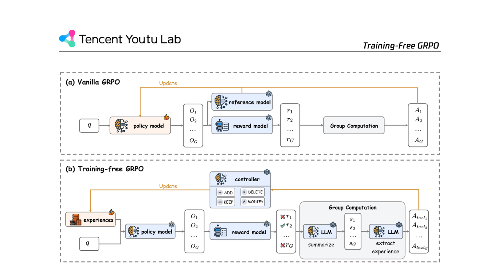
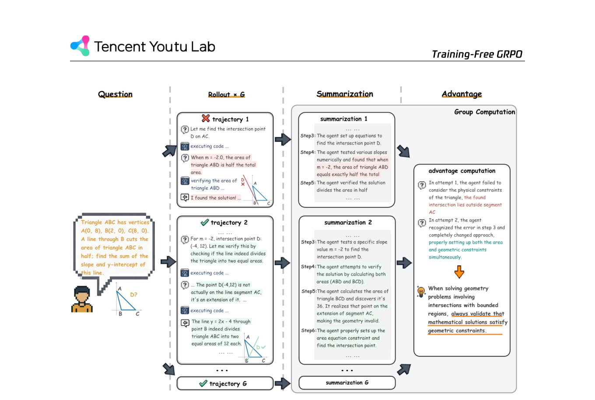

`training_free_grpo | Training-Free GRPO: Training-Free Group Relative Policy Optimization | 腾讯优图实验室 Tencent Youtu Lab（+ 复旦/厦大；通讯 tristanli@tencent.com） | 2025-10-09（arXiv:2510.08191 v1，技术报告） | L1 免梯度·test-time RL（强触 L3 经验→技能、L4 经验内化） | 相关性 High` 

> 【档位】deep 全档。基于真实 PDF 正文（23 页：正文 §1–§6 + 附录 A 案例研究 / B–C）。三标注：【原文】/【推断】（附依据）/【待核】。

---

## ══ 第一层：一眼看懂 ══

- 🟦 **TL;DR**：【原文】给特定领域调一个 LLM agent，主流做法是 SFT+GRPO 改参数——又贵、又要海量标注数据、还容易过拟合 + 跨域泛化差。Training-Free GRPO 提出："**不改一个参数，照样拿到 GRPO 的效果**"。怎么做：保留 GRPO 的"一题采样一组 G 个 rollout"骨架，但把"数值优势 Â=（r−mean）/std"换成**语义优势**——让 LLM 看完这组成功/失败的 rollout，**用自然语言总结出一条经验**（"做几何题要先验证解落在区间内"这种）。这些经验进一个**经验库 E**，通过 ADD/DELETE/MODIFY/KEEP 四种操作多轮迭代精炼；推理时把 E 拼进 prompt 当"token 先验"引导冻结模型。在 AIME 数学 + WebWalkerQA 网页搜索上，仅用**几十~100 条**样本、约 **\$18**，就让冻结的 DeepSeek-V3.1-Terminus 反超花 \$10000+ 训练的 32B RL 模型。
- **最巧的一步**：【原文】**把 GRPO 的"group-relative 数值优势"替换成"group-relative 语义优势（自然语言经验）"**（Figure 2/3，§2 Group Advantage Computation）。**抽掉它**就垮——消融 Table 2："w/o group computation"（group size=1，无法组内对比）显著掉分（AIME24 82.7→80.4、AIME25 73.3→69.3）；"Directly Generated Experiences"（不经 group 对比、直接让模型生成等量经验）则几乎无提升（79.8/67.3 ≈ ReAct 基线）。【推断】因为"组内有赢家有输家的对比"才是信息来源——单条 rollout 的自我反思缺少相对信号，退化成普通 ICL。这正是它区别于 Reflexion/Self-Refine（单样本内迭代）而"更像真 RL"的命门。

---

## ══ 第二层：为什么做（写透） ══

- **研究背景**：【原文】LLM agent 在通用任务强，但落到专业域（需特定工具/API/领域 prompt）常表现不佳；主流补救是 agentic RL（GRPO 及变体）在**参数空间**对齐行为（§1）。
- **解决的具体痛点**（§1 列了 4 条参数微调的死结）：① **算力成本**——大模型微调成本高到禁止，还得专门部署、低频场景不划算；② **泛化差**——参数微调的模型跨域掉得厉害，得为每个域养一个专家模型；③ **数据稀缺**——专业域高质标注少且贵，小样本极易过拟合；④ **收益递减悖论**——成本逼着大家只微调 <32B 小模型，但 API 大模型本就更强、性价比更高——"微调一个弱模型 vs 直接用强冻结模型"的两难。
- **相关工作 & 各自不足**（§5）：
  - **Agentic RL（ReTool/AFM/Search-R1/GiGPO/Tongyi DeepResearch）**：改参数 → 贵、限于 <32B、跨域差。
  - **训练自由迭代法（Self-Refine、Reflexion、ICRL、TextGrad）**：都聚焦"单个 query 内的迭代自改"——【原文 §5 明确区分】Training-Free GRPO 是"**跨一个独立数据集、多 epoch 学习、提炼一个共享经验库供 OOD query 用**"，且**每个 query 显式比较多条 rollout 取语义优势**，更像传统 RL 而非单样本自评。
  - **vs Agent KB（最近邻）**：Agent KB 建分层知识库做"reason-retrieve-refine"复杂流程、靠手工样例、off-policy 只收集一次；【原文】Training-Free GRPO **只是把学到的经验注入 prompt**、用一致 pipeline、更像 on-policy 多 epoch。
- **动机链**：参数微调四死结 → 核心反问"**RL 一定要在参数空间做吗?**" → 洞察"LLM 本就有适应新场景的底子，只需少量'练习'" → 用 ICL 的"轻量 token 先验"承载从少量数据学到的经验式知识 → 为了让经验"越练越好"而非一次性生成,搬来 GRPO 的多 epoch + group rollout 机制,把数值优势改成语义优势。
- **与最近邻的 Δ（vs vanilla GRPO）**：【原文 §2、Figure 2】唯一但关键的替换——**优势从数值变语义、参数梯度更新变经验库的 ADD/DELETE/MODIFY/KEEP 文本操作**；冻结的 base model 充当强先验,起到类似 GRPO 里 KL 约束的"内置稳定器"作用,防止偏离过远。

---

## ══ 第三层：怎么做 + 靠不靠谱 ══

- **方法流水线**（§2，配 Figure 2/3，把 GRPO 一一对应改写）：
  1. **初始化**：参数 θ 永久冻结；外部经验库 E ← ∅。
  2. **Rollout & Reward**：给 query q，并行采样一组 G 个输出 `{o_1..o_G}`，但**策略条件在经验库上** `π_θ(o_i|q,E)`（不是 π_θ(o_i|q)）；用 reward model R 给每个 o_i 打标量 r_i。（与 GRPO 完全一致,只多了 E 这个条件）
  3. **语义优势计算（核心）**：只对"组内既有明显赢家又有输家"的组生成优势（因为 std(r)=0 时 GRPO 的 Â 也=0）。先让 LLM M 对每个 o_i 单独写摘要 `s_i=M(p_summary,q,o_i)`；再给定全部摘要 + 当前 E,让 M 讲清相对成败原因并抽出一条简洁自然语言经验 `A_text=M(p_extract,q,{s_i},E)`——这条 A_text 就是语义优势,功能等价于 GRPO 的 Â_i。
  4. **优化（更新经验库,不更新参数）**：给定全 batch 的 A_text 和现有 E,提示 LLM 生成一组操作 {**Add** 追加 / **Delete** 删低质 / **Modify** 精炼已有 / **Keep** 不变},把 E 更新到 E'。
  5. **下一轮**：条件策略 `π_θ(y|q,E')` 在后续 batch/epoch 产生"被移向高 reward"的偏移分布——等效一次 GRPO 策略更新,但靠改 context 而非改参数。
- **逐组件必要性（消融 Table 2，做得相当扎实）**：
  - **group computation（组内对比）**:有消融,group=1 显著掉分 → 相对信号必需。
  - **ground truth reward**:有消融,"w/o ground truths"(只靠组内隐式多数投票/自判别/自反思)仍 80.7/68.9,虽不及完整版但远超基线 → **对无金标域也可用**(鲁棒性卖点)。
  - **vs Directly Generated Experiences**:有对照,直接生成等量经验几乎无效(79.8/67.3) → 证明增益来自"GRPO 式优化提炼"而非"经验本身"这一平凡解释。
  - **multi-step 学习**:Figure 4 显示 3 步内训练集 Mean@5、OOD AIME Mean@32 单调上升,且**工具调用次数下降** → 经验教会 agent 更省、更准地用工具(发现捷径、避免冗余调用)。
- **关键机制/直觉**：把"梯度上升找参数最优"换成"LLM 自省式地把组内对比浓缩成一条可复用经验、再做库级增删改"。冻结 base 当先验=GRPO 的 KL 锚;经验库=被优化的"软策略"。直觉上像"给 agent 攒一本越改越精的错题本/方法论手册",而非重训大脑。
- **实验与证据**（§3，§4）：
  - **数学**(AIME24/25,Mean@32):Table 1——DeepSeek-V3.1-Terminus + ReAct(CI 工具)从 80.0/67.9 → **82.7/73.3**(+2.7/+5.4),仅 100 条 DAPO 样本、~\$18、3 步、零梯度。**关键对照** Table 3:同等条件超过在 32B 上花 ~\$10000–20000 训练的 ZeroTIR/SimpleTIR/ReTool/AFM。
  - **网页搜索**(WebWalkerQA):Table 4——DeepSeek-V3.1-Terminus pass@1 63.2 → **67.8**(+4.6),用 100 条 AFM-100。
  - **最硬的卖点(回答核心主张)**——**Table 6 跨域迁移**:ReTool(数学专训)迁到 WebWalker 暴跌到 18.3%(< 未微调 ReAct 31.9%);MiroThinker(网页专训)在 AIME 上又不如 ReTool;而 Training-Free GRPO 在**数学和网页两域同时 SOTA**(82.7/73.3/67.8)——**直击"参数微调=域专精换泛化"的痛点**,这是它最不可替代的证据。
  - **成本**(§4.2):复现 ReTool 在 Qwen2.5-32B 约 20000 GPU 时 ≈\$10000;Training-Free GRPO 6 小时、38M 输入+6.6M 输出 token ≈\$18,**训练成本降 2 个数量级**。推理侧:每 query 约 60K 输入+8K 输出 token ≈\$0.02(含 cache 命中),按量付费,适合低频/波动负载。
  - **baseline 公平吗**【推断】:与 RL 法比时**故意用更强的 671B 冻结模型 vs 对手的 32B 微调模型**——这是"context 优化强模型 vs 参数微调弱模型"的有意对比(作者论点就是"该不该微调弱模型"),公平性见仁见智;但 Table 3 也给了在 Qwen3-32B/Qwen2.5-72B 上的同模型自对照(均有 +3~+6 提升),弥补了这点。
  - **"看着强但没答核心问题"的隐患**【推断】:数学绝对增益(+2.7~+5.4)其实不算大,真正的故事在**跨域不掉分**(Table 6)和**成本**;若只看单域提升会高估方法。
- **假设与失效边界**：
  - 【原文】**强依赖底座模型能力**:同方法用在 QwQ-32B 上 WebWalker 仅 25.5% pass@1,**甚至低于其 ReAct 基线 27.5%**(§3.2)——"模型能力是经验式优化的前提",**弱模型上会反噬**。这是论文自己点破的最重要失效边界。
  - 【原文】语义优势**只在组内有赢有输时生成**(std(r)≠0)——全对/全错的组学不到东西;依赖 reward model 能区分质量。
  - 【推断】经验库进 prompt → **随经验增多吃 context、增推理 token 成本**;ADD/DELETE/MODIFY/KEEP 由 LLM 自主决策,**无显式去重/容量上界/冲突消解的形式化保证**,长期库治理质量靠 LLM 自觉(论文未给库规模随 epoch 的增长曲线〔待核〕)。
  - 【推断】只测了 3 epoch、≤100 样本的小规模"训练";更多数据/更长迭代下是否继续涨、会不会经验互相打架,未验证。
- **祛魅总结**：
  - **真贡献(硬货)**:① 把 GRPO 完整结构(group rollout / 多 epoch / KL 锚)**忠实平移到 context 空间**,用"语义优势 + 库操作"替代"数值优势 + 梯度",概念优雅且工程可落地(有开源);② Table 6 的跨域不掉分 + 2 个数量级成本下降是实打实的实用价值;③ 消融充分(group/GT/直接生成三组对照),把"为什么有效"讲清楚了。
  - **包装/可能高估**【推断】:(a) 名字叫"GRPO"但**没有梯度、没有 clip、没有真正的 KL 散度计算**——是"GRPO 的隐喻/结构借用",严格说是一种**有组织的经验库 ICL**,而非 GRPO 算法本身;(b) "outperforms fine-tuned 32B"成立但建立在"用 671B 大模型"上,是模型规模 + 经验的合力,不能简单归功于方法;(c) 强依赖强底座(QwQ 反例),"training-free"的普惠性被高估——它更像"给已经很强的大模型再榨一点专业域性能"。

---

## ══ 结构化抽取 ══

### 🎯 机制速览 6 轴
| 维度 | 内容 |
|---|---|
| **学什么信号** | 环境/任务 **reward**(reward model 给组内 rollout 打分)→ 但**不直接用数值**,而是让 LLM 把"组内成败对比"提炼成**自然语言经验(语义优势 A_text)**;可选无金标(靠组内隐式多数投票/自反思) |
| **改什么** | **外部经验库 E(自然语言)** → 推理时拼进 prompt 当 token 先验;**参数 θ 永久冻结、prompt 模板固定、logits 不直接动**(经 context 间接改输出分布) |
| **何时改** | **离线批量多 epoch**(GRPO 式:3 epoch × 单 batch;在独立训练集上"训练"出 E)→ 部署后 E 固定注入(非在线 per-step 更新) |
| **免梯度?** | **是**(纯训练自由;零梯度、零参数更新;"GRPO"为结构隐喻而非真梯度算法) |
| **记忆-技能生命周期** | 写入:Add 追加经验;**遗忘/淘汰:有显式 Delete(删低质)+ Modify(精炼)+ Keep**——是少数带主动淘汰的免梯度法;检索:全量经验库直接注入 prompt(非按需检索);共享:经验库跨 query/跨任务复用,但**域专属**(数学库 vs 网页库分开插) |
| **防遗忘机制** | **隔离式(不动权重→无灾难性遗忘)** + 冻结 base 当强先验(类比 KL 锚保稳定);**跨域泛化是核心卖点**(Table 6,换库即换域,不破坏通用能力) |

### ⑦ 开源代码 + 框架/harness
- 【原文】代码:**https://github.com/TencentCloudADP/youtu-agent/tree/training_free_GRPO**(扉页给出)。
- 框架/harness:【原文+推断】构建在腾讯 **Youtu-Agent** 框架上;agent 执行用 **ReAct**(+ Code Interpreter 工具)。**非训练框架**(无需 veRL/TRL,因零梯度);底座走 **DeepSeek API**(V3.1-Terminus / V3.2-Exp)及 Qwen 系列。**本次未 clone**(P4 仅核 PDF;如需实现细节请手动取该 repo 的 `training_free_GRPO` 分支)。〔待核:仓库实际依赖/实现完整度——未访问〕

### 💰 资源/成本与可扩展性
- 【原文】训练:6 小时,38M 输入 token + 6.6M 输出 token ≈ **\$18**(DeepSeek 官方定价,多数输入命中 cache 低价);对照 ReTool ≈ 20000 GPU 时 ≈ **\$10000**(降 ~2 数量级)。推理:每 query ~60K 输入 + 8K 输出 token ≈ **\$0.02**(含 cache 命中)。
- 【推断】可扩展性优:无需 GPU 集群、按量付费,适合低频/波动负载;瓶颈在经验库增大后的 prompt 长度与推理成本,以及强底座 API 依赖。

### 🎯 对"探索-巩固"idea 对标
- **支撑 + 强可借组件(免梯度"巩固"的语义版本)**:与"探索-巩固"高度同源——都主张"冻结权重 + 外部知识载体 + 免梯度"。
  - **可借组件**:① **语义优势(group-relative natural-language experience)** 是"探索期产物如何被提炼"的极佳范式——比 JitRL 的数值优势更可解释、可人读;② **经验库的 ADD/DELETE/MODIFY/KEEP 主动治理**正好补 JitRL"只增不删"的空缺,可作"巩固期/库治理"的现成机制;③ **冻结 base 当 KL 锚**的稳定性思想可迁移。
  - **与"探索-巩固"的关系定位**【推断】:它本质是**离线巩固的"语义/context 版"**(在独立数据集上多 epoch 蒸馏出经验库),而 JitRL 是**在线探索的"数值/logit 版"**——两者恰好覆盖"探索-巩固"的两半,但**都停在 context/经验层、都不把知识固化进参数**。
  - **缺口/竞品维度**:对"探索-巩固"若坚持"离线几何共识固化进权重",则 Training-Free GRPO 是一个**强力的免梯度竞品基线**(它证明"不进参数空间也能跨域 SOTA"),必须在对标章节正面比较"固化进权重 vs 留在经验库"的取舍(权重固化的优势是省 context/低推理成本,劣势是回到了遗忘风险)。

### 🔭 开放问题 / 未来方向
- 【原文】§6 未明列 future work;隐含开放点散见正文:对弱底座失效、依赖 reward model 区分度。
- 【推断】① **经验库治理的形式化**:容量上界、去重、冲突经验消解、随 epoch 增长曲线——当前全交给 LLM 自主操作,缺保证。② **弱模型也能用**:如何让 <32B 模型从语义优势获益(目前 QwQ 反噬)。③ **在线/持续版本**:把当前"离线多 epoch 训库"扩展成部署后在线持续更新经验库(向 JitRL 式在线靠拢)。④ **经验→参数的可选固化**:何时值得把稳定经验蒸馏回权重以省推理成本(与"探索-巩固"巩固期的结合点)。

### 🖼 关键图 top-2

- 这是**原文 Figure 2**(方法主图)。(a) Vanilla GRPO:policy→reward model→Group Computation 出**数值优势 A_1..A_G**→反向更新 policy 参数;(b) Training-Free GRPO:policy **条件在 experiences 上**→reward→两个 LLM(summarize/extract)产出**语义优势 A_text**→**controller 用 ADD/DELETE/MODIFY/KEEP 更新经验库**(橙色 Update 回流到 experiences 而非 policy)。**选它**:一图说清"把梯度更新替换成经验库文本操作"这一核心创新,是抽取 6 轴(改什么/免梯度/生命周期)的唯一依据图。

- 这是**原文 Figure 3**(机制实例图)。横向四栏展示一次学习步:Question → 组内 3 条 Rollout(有对有错) → 各自 Summarization → 右侧 Group Computation 提炼出**自然语言的 advantage/经验**(如"做几何题要先验证解落在区间内")。**选它**:把抽象的"语义优势"落到可读实例,直观回答"LLM 到底从组内对比里学到一条什么样的经验",是理解方法"为什么不是普通 ICL"的关键。
